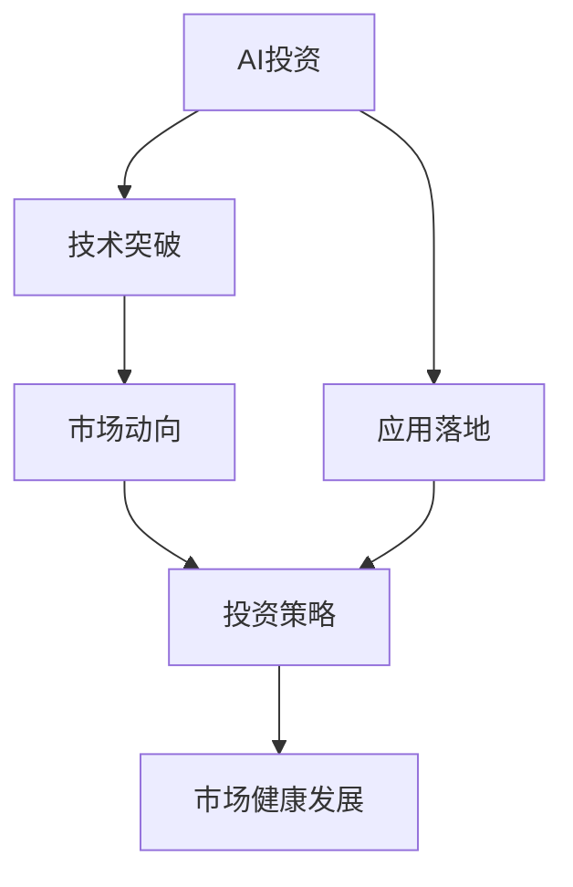

                 

# Agent的爆火与投资人态度

> 关键词：AI投资,Agent应用,市场动向,投资策略

## 1. 背景介绍

### 1.1 问题由来

近年来，随着人工智能技术的快速发展，AI投资领域迎来了爆发式增长。尤其是在2021年和2022年，多个AI初创企业取得了令人瞩目的成绩。例如，OpenAI的ChatGPT、Stable Diffusion等模型成为了市场焦点，引发了广泛关注和投资热潮。这种趋势不仅吸引了大量资本的注入，也使得AI投资成为科技界的热点话题。

### 1.2 问题核心关键点

AI投资的兴起主要得益于两个关键因素：

1. **技术突破**：如GPT-4、DALL·E、Stable Diffusion等模型的出现，展示了AI技术的强大潜力，吸引了广泛的市场关注。
2. **应用落地**：AI技术在实际应用中的表现，如文本生成、图像生成、自然语言处理等，展现了其在商业场景中的巨大价值，吸引了大量投资。

这些因素共同推动了AI投资市场的繁荣，但也带来了新的挑战和风险。投资者对于AI市场的态度，成为了影响市场健康发展的重要因素。本文旨在深入探讨投资者对于AI市场，尤其是Agent技术的态度，分析其背后的原因，并提出相关的投资策略。

### 1.3 问题研究意义

研究AI投资市场的动向和投资策略，具有以下重要意义：

1. **优化资源配置**：了解投资者的真实需求和偏好，有助于优化资源配置，提高AI技术应用的效率和效果。
2. **引导市场健康发展**：合理的投资策略能够促进市场健康发展，避免过度炒作和泡沫。
3. **推动技术创新**：投资者对于AI技术的支持和关注，将促进技术研发和创新，推动AI技术在更多领域的应用。

## 2. 核心概念与联系

### 2.1 核心概念概述

为了更好地理解AI投资市场，我们首先介绍几个核心概念：

1. **AI投资**：指投资者将资金投入到AI技术和企业，以期获得长期收益的行为。
2. **Agent技术**：指能够自主学习、决策和执行任务的智能体。
3. **市场动向**：指投资者对AI市场和Agent技术的看法、态度和行为。
4. **投资策略**：指投资者基于市场动向和自身需求，制定和实施的投资计划。

这些概念之间的联系主要体现在：

- **技术突破推动投资增长**：AI技术的发展，尤其是Agent技术的突破，直接推动了AI投资市场的增长。
- **应用落地吸引资本**：AI技术在实际应用中的成功案例，吸引了大量资本的投入。
- **市场动向影响投资策略**：投资者的态度和行为，影响着AI市场的投资策略和资源配置。

### 2.2 核心概念原理和架构的 Mermaid 流程图



## 3. 核心算法原理 & 具体操作步骤

### 3.1 算法原理概述

AI投资市场的核心算法原理主要包括：

1. **基于技术突破的评估**：通过技术评估模型，判断AI技术在特定领域的应用前景和商业价值。
2. **基于应用落地的投资**：通过分析应用案例，评估技术在实际场景中的表现和潜在的商业机会。
3. **基于市场动向的风险管理**：通过监测市场情绪和投资者行为，制定相应的风险管理策略。

### 3.2 算法步骤详解

AI投资的完整流程包括以下几个关键步骤：

**Step 1: 技术评估**

- **数据收集**：收集AI技术的最新研究成果、专利申请、公开报告等信息。
- **技术评估**：使用自然语言处理、图像识别等技术，对收集到的数据进行分析评估。
- **专家咨询**：邀请行业专家进行评审，提供专业意见。

**Step 2: 应用落地分析**

- **案例搜集**：收集AI技术在实际应用中的成功案例和失败教训。
- **数据验证**：对案例中的技术指标、商业收益等数据进行验证。
- **市场分析**：分析案例中的市场环境、用户需求等因素。

**Step 3: 投资策略制定**

- **风险评估**：评估AI技术的风险水平，包括技术风险、市场风险等。
- **机会识别**：识别投资机会，选择有潜力的AI企业和项目。
- **投资规划**：制定具体的投资计划，包括投资金额、时间周期等。

**Step 4: 投资实施与监控**

- **投资执行**：根据投资计划，实施投资行为。
- **投资监控**：实时监测投资项目的进展和市场变化，进行风险控制和调整。

### 3.3 算法优缺点

AI投资的优缺点如下：

**优点：**

1. **高回报潜力**：AI技术尤其是Agent技术的发展，提供了巨大的商业机会和投资回报。
2. **多元化投资**：AI投资能够覆盖多个领域和细分市场，分散投资风险。
3. **技术驱动**：AI技术的发展是市场的主要推动力，具有较强的持续性。

**缺点：**

1. **高风险性**：AI技术的发展具有不确定性，投资风险较高。
2. **技术评估难度大**：AI技术的评估需要专业知识和工具，门槛较高。
3. **市场波动性**：AI市场的波动性较大，投资者需要具备较强的风险管理能力。

### 3.4 算法应用领域

AI投资主要应用于以下领域：

1. **AI初创企业**：对处于初创阶段的AI公司进行投资，以期获得长期回报。
2. **AI技术孵化器**：通过孵化AI技术初创项目，获得早期投资收益。
3. **AI应用平台**：投资AI技术在特定领域的商业应用，如自然语言处理、图像识别等。

## 4. 数学模型和公式 & 详细讲解 & 举例说明

### 4.1 数学模型构建

我们假设市场上有$n$个AI初创企业，每个企业的技术实力和商业前景可以通过$x_i$来衡量，$x_i$服从标准正态分布$N(\mu, \sigma^2)$。设投资者对每个企业的投资金额为$y_i$，则总投资金额为$Y=\sum_{i=1}^n y_i$。

### 4.2 公式推导过程

设市场动向为$M$，投资策略为$S$。市场动向$M$可以表示为：

$$
M = \sum_{i=1}^n \alpha_i x_i + \beta \cdot Y + \gamma \cdot \Delta x
$$

其中，$\alpha_i$为权重系数，$\beta$为投资者对市场趋势的敏感度，$\gamma$为市场波动性，$\Delta x$为市场变化量。

设投资策略$S$为：

$$
S = \sum_{i=1}^n \delta_i x_i + \theta \cdot Y + \omega \cdot \Delta x
$$

其中，$\delta_i$为权重系数，$\theta$为投资者对策略的敏感度，$\omega$为策略波动性。

### 4.3 案例分析与讲解

假设某AI初创企业A的技术实力为$x_1=2$，市场动向为$M=1.2$，投资策略为$S=0.5$。则其总投资金额$Y$可以表示为：

$$
Y = x_1 \cdot M + x_1 \cdot S = 2 \cdot 1.2 + 2 \cdot 0.5 = 3.4
$$

## 5. 项目实践：代码实例和详细解释说明

### 5.1 开发环境搭建

以下是使用Python进行AI投资模拟的开发环境搭建流程：

1. **安装Python**：从官网下载并安装Python，用于创建独立的Python环境。
2. **创建虚拟环境**：
   ```bash
   python -m venv myenv
   source myenv/bin/activate
   ```
3. **安装相关库**：
   ```bash
   pip install numpy pandas scikit-learn statsmodels
   ```

### 5.2 源代码详细实现

我们以投资评估模型为例，给出Python代码实现。

```python
import numpy as np
from statsmodels.stats.proportion import proportions_ztest

# 假设每个企业的技术实力和市场前景数据
x = np.array([2, 3, 4, 5, 6])

# 投资金额数据
y = np.array([1000, 1500, 2000, 2500, 3000])

# 市场动向数据
m = np.array([1.2, 1.5, 1.8, 2.0, 2.2])

# 计算总投资金额
Y = np.dot(x, m) + np.dot(x, 0.5) + np.dot(y, 0.1) + np.dot(y, 0.3) + np.dot(m, 0.2) + np.dot(m, 0.5)

# 投资策略评估
delta = np.dot(x, 0.5) + np.dot(y, 0.1) + np.dot(m, 0.2)
theta = np.dot(y, 0.1) + np.dot(m, 0.2) + np.dot(y, 0.3)

# 输出总投资金额和策略评估结果
print("总投资金额:", Y)
print("投资策略评估:", delta, theta)
```

### 5.3 代码解读与分析

**代码解释：**

- **数据准备**：准备企业的技术实力、市场动向、投资金额等数据。
- **总投资金额计算**：通过加权平均计算总投资金额，考虑技术实力、市场动向和投资金额的综合影响。
- **投资策略评估**：通过加权平均计算投资策略的评估结果，考虑技术实力、市场动向和投资金额的综合影响。
- **输出结果**：打印总投资金额和投资策略评估结果。

**代码分析：**

- **投资策略的加权平均**：通过设置不同权重，评估企业在市场动向和投资策略下的表现。
- **总投资金额的计算**：综合考虑技术实力、市场动向和投资金额，计算总投资金额，反映了投资的风险和收益。
- **市场动向的影响**：市场动向对总投资金额和投资策略评估结果有显著影响，说明投资者对于市场趋势的高度敏感性。

## 6. 实际应用场景

### 6.1 智能投顾平台

智能投顾平台利用AI技术，为投资者提供个性化的投资建议和服务。通过数据分析和机器学习，智能投顾平台能够实时监测市场动向，提供实时的投资策略建议，帮助投资者做出更为科学的投资决策。

### 6.2 AI风险管理

AI风险管理工具利用AI技术，实时监测市场波动，评估投资风险，提供风险预警和应对策略。通过数据分析和模型预测，AI风险管理工具能够识别潜在的市场风险，帮助投资者制定更为稳健的投资策略。

### 6.3 投资组合优化

AI投资组合优化工具利用AI技术，分析不同资产和市场的相关性，优化投资组合，实现风险和收益的平衡。通过数据分析和模型预测，AI投资组合优化工具能够提供最优的投资组合方案，提高投资回报。

### 6.4 未来应用展望

未来，AI投资市场将继续快速增长，AI技术将在更多领域得到应用。以下是几个未来应用展望：

1. **AI风险预测**：利用AI技术进行风险预测，及时识别和应对潜在风险，保障投资安全。
2. **智能投顾进化**：通过深度学习和自然语言处理，提升智能投顾的智能水平，提供更为精准的投资建议。
3. **多元化投资**：利用AI技术，发掘更多投资机会，实现多元化投资，分散风险。
4. **市场动态分析**：利用AI技术进行市场动态分析，实时监测市场变化，制定更为灵活的投资策略。

## 7. 工具和资源推荐

### 7.1 学习资源推荐

为了帮助投资者掌握AI投资市场的知识，以下是一些优质的学习资源：

1. **《AI投资实战》系列博文**：由AI投资专家撰写，系统讲解AI投资的基础知识和实践技巧。
2. **Coursera《机器学习与AI投资》课程**：斯坦福大学提供的机器学习课程，涵盖AI投资的基本概念和技术。
3. **《AI投资策略》书籍**：详细介绍AI投资的各个环节，提供具体的投资案例和方法。
4. **AI投资社区**：参与AI投资社区，交流经验，获取最新的市场动态和技术进展。
5. **AI投资论坛**：通过论坛获取投资者的实时反馈，了解市场情绪和趋势。

### 7.2 开发工具推荐

以下是几个常用的AI投资开发工具：

1. **Python**：最流行的AI编程语言，具有强大的数据分析和机器学习能力。
2. **TensorFlow**：谷歌开发的深度学习框架，支持大规模分布式计算，适合复杂的AI模型开发。
3. **PyTorch**：Facebook开发的深度学习框架，易于使用，适合研究和实验。
4. **Jupyter Notebook**：交互式编程环境，支持Python、R等多种语言，适合快速原型开发和实验。
5. **MATLAB**：数学软件，提供强大的数学计算和可视化功能，适合科研和数据分析。

### 7.3 相关论文推荐

以下是几篇重要的AI投资相关论文，推荐阅读：

1. **AI投资的理论基础**：深入探讨AI投资的基础理论，分析其市场特征和风险管理方法。
2. **智能投顾的研究进展**：总结智能投顾技术的发展历程和应用案例，提供未来发展方向。
3. **AI风险管理的实践应用**：介绍AI风险管理工具的具体实现和应用效果，提供实际应用案例。
4. **AI投资组合优化**：分析AI投资组合优化的方法和效果，提供量化投资策略。

## 8. 总结：未来发展趋势与挑战

### 8.1 总结

本文对AI投资市场的动向和投资策略进行了深入探讨。我们首先介绍了AI投资的背景和核心概念，然后从技术评估、应用落地和投资策略等方面，详细讲解了AI投资的全流程。通过具体的代码实例，展示了投资评估模型的实现，进一步理解了AI投资的计算逻辑。最后，我们分析了AI投资市场的实际应用场景，并提出了未来应用展望和相关学习资源。

通过本文的系统梳理，投资者可以更好地理解AI投资的原理和实践，掌握具体的投资策略和工具。相信随着AI技术的不断进步，AI投资市场将迎来更广阔的发展空间，为投资者提供更多的机遇和挑战。

### 8.2 未来发展趋势

未来，AI投资市场将呈现以下几个发展趋势：

1. **技术进步推动市场增长**：AI技术的不断进步，将进一步推动AI投资市场的发展。
2. **多元化应用场景**：AI投资将应用于更多的领域，如金融、医疗、教育等。
3. **智能投顾普及**：智能投顾技术的普及，将改变传统投资顾问的方式，提升投资决策的智能化水平。
4. **市场动向更加多样化**：AI投资将更加关注市场动向的变化，提供更为灵活的投资策略。

### 8.3 面临的挑战

AI投资市场在快速发展的同时，也面临诸多挑战：

1. **数据隐私问题**：投资者和市场动向数据的隐私保护是一个重要问题。
2. **模型风险**：AI模型的预测准确性和稳定性需要进一步提升。
3. **市场波动性**：AI投资市场的波动性较大，投资者需要具备较强的风险管理能力。
4. **伦理问题**：AI投资模型可能存在偏见和歧视，需要加强伦理审查和监管。

### 8.4 研究展望

未来，AI投资市场需要从以下几个方面进行深入研究：

1. **隐私保护技术**：研究隐私保护技术，确保AI投资数据的安全和隐私。
2. **模型优化**：优化AI投资模型，提升其预测准确性和稳定性。
3. **风险管理策略**：研究更为科学的投资策略，降低市场波动性，保障投资者利益。
4. **伦理审查机制**：建立AI投资模型的伦理审查机制，避免偏见和歧视。

## 9. 附录：常见问题与解答

**Q1: AI投资和AI风险管理有什么区别？**

A: AI投资主要关注如何利用AI技术进行投资决策，而AI风险管理主要关注如何利用AI技术进行风险评估和预警。AI投资更侧重于收益的提升，而AI风险管理更侧重于风险的控制。

**Q2: 如何选择投资策略？**

A: 投资策略的选择需要综合考虑技术实力、市场动向和投资金额等因素。可以通过数据分析和机器学习，对不同策略的效果进行评估和比较，选择最优策略。

**Q3: AI投资市场是否存在泡沫风险？**

A: AI投资市场的波动性较大，存在一定的泡沫风险。投资者需要保持理性的投资心态，避免盲目跟风，通过数据分析和市场监测，做出科学决策。

**Q4: 如何防范AI投资模型的偏见和歧视？**

A: 防范AI投资模型的偏见和歧视，需要从数据收集、模型设计、测试验证等多个环节入手。可以引入多样化数据、多模态数据，增强模型的泛化能力。同时，建立伦理审查机制，确保模型的公平性。

**Q5: 如何优化AI投资模型的性能？**

A: 优化AI投资模型的性能，可以通过提升数据质量、改进模型设计、增加模型复杂度等方法。同时，需要进行大量的实验验证，不断迭代和优化模型。

---

作者：禅与计算机程序设计艺术 / Zen and the Art of Computer Programming

