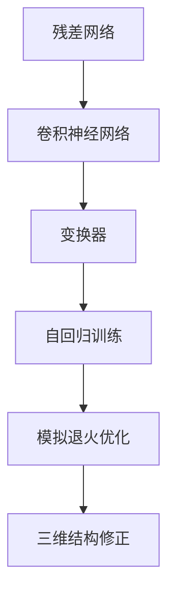

                 

## 1. 背景介绍

AlphaFold的诞生标志着深度学习在蛋白质结构预测领域实现了里程碑式的突破，为生物学研究和药物研发提供了强大的工具。然而，AlphaFold背后的技术原理和实现细节并不为大众所熟知。本文将深入探讨AlphaFold的核心概念与技术，并详细分析其原理、步骤、优缺点、应用领域及其未来发展趋势。

### 1.1 问题由来

蛋白质是生命体的基本组成单位，几乎所有生物过程都依赖于蛋白质的功能和结构。蛋白质结构预测是生物学研究的关键问题，其应用包括但不限于药物设计、基因工程、生物物理学等。传统的蛋白质结构预测方法依赖于高昂的实验成本和大量时间，且准确度有限。基于深度学习的AlphaFold通过自动从氨基酸序列预测蛋白质结构，为蛋白质研究领域带来了革命性的变化。

### 1.2 问题核心关键点

AlphaFold的成功源于以下几个关键点：

- **无监督预训练**：AlphaFold通过在大规模无标签数据上自监督预训练，获得了强大的特征提取能力。
- **多尺度混合表示**：使用残差网络（ResNet）、卷积神经网络（CNN）和变换器（Transformer）等多种神经网络结构，捕捉不同尺度的结构特征。
- **自回归训练**：通过自回归方式训练，逐步预测蛋白质的每个氨基酸残基位置和侧链角度，保证预测序列的连续性。
- **模拟退火优化**：采用模拟退火算法进行优化，从预测序列空间中寻找最优解。
- **三维结构修正**：通过修正训练得到的初始结构，进一步提升预测精度。

这些技术突破使得AlphaFold在蛋白质结构预测上取得了超越以往方法的准确度和效率。

### 1.3 问题研究意义

AlphaFold的成功不仅推动了蛋白质结构预测的边界，还带动了生物学、化学、医学等多个领域的交叉融合。对于蛋白质功能与结构的关系、药物设计、基因工程等都具有重要的理论意义和实际应用价值。同时，AlphaFold的成功也验证了深度学习在复杂结构预测和优化问题上的潜力，为未来AI在更广泛领域的应用提供了新的方向。

## 2. 核心概念与联系

### 2.1 核心概念概述

为了更好地理解AlphaFold的原理，我们先简要介绍几个核心概念：

- **残差网络（ResNet）**：一种用于处理深度网络训练中梯度消失问题的技术，通过引入残差连接，使得网络可以训练到更深的层次。
- **卷积神经网络（CNN）**：常用于图像处理任务，通过卷积核提取图像局部特征，捕捉局部结构信息。
- **变换器（Transformer）**：一种通过自注意力机制处理序列数据的神经网络结构，在处理长序列时表现优异。
- **自回归（Autoregressive）**：一种预测方式，通过已知数据预测未知数据，保证序列的连续性和连贯性。
- **模拟退火（Simulated Annealing）**：一种启发式优化算法，通过逐渐降低温度，避免陷入局部最优解。

这些核心概念构成了AlphaFold的核心框架，帮助我们理解其运作原理和算法流程。

### 2.2 核心概念原理和架构的 Mermaid 流程图



通过上述Mermaid流程图，我们可以看到AlphaFold的架构设计非常紧凑，融合了多种先进的神经网络技术，相互协同提升预测精度。

## 3. 核心算法原理 & 具体操作步骤

### 3.1 算法原理概述

AlphaFold的核心算法包括无监督预训练、多尺度混合表示、自回归训练、模拟退火优化和三维结构修正五个步骤。我们接下来详细探讨这些步骤的原理和实现。

### 3.2 算法步骤详解

#### 3.2.1 无监督预训练

AlphaFold的训练分为两个阶段：无监督预训练和监督微调。在无监督预训练阶段，模型在大规模无标签数据上训练，学习到通用特征。

具体步骤如下：

1. **数据准备**：收集CASP13和CASP14等领域的蛋白质序列和结构数据。
2. **构建模型**：使用ResNet、CNN和Transformer等网络结构搭建深度神经网络。
3. **无监督训练**：在大规模无标签数据上进行自监督训练，优化模型参数。
4. **特征提取**：从预训练模型中提取通用的蛋白质特征表示。

#### 3.2.2 多尺度混合表示

AlphaFold使用多种神经网络结构来捕捉不同尺度的结构特征：

1. **ResNet层**：处理局部结构信息，捕捉近邻氨基酸的相互作用。
2. **CNN层**：处理三维结构，捕捉局部的空间关系。
3. **Transformer层**：处理序列信息，捕捉氨基酸间的相互作用。

通过混合使用这些网络结构，AlphaFold能够全面捕捉蛋白质结构的多层次特征。

#### 3.2.3 自回归训练

AlphaFold采用自回归的方式进行训练，逐步预测蛋白质的每个氨基酸残基位置和侧链角度：

1. **序列输入**：将氨基酸序列作为输入，初始化为第一个残基。
2. **位置预测**：通过自回归方式，预测下一个残基的位置和侧链角度。
3. **序列连贯性**：保证预测序列的连贯性，避免出现断点。

自回归训练能够保证预测序列的连续性和连贯性，使得模型能够预测完整的蛋白质结构。

#### 3.2.4 模拟退火优化

AlphaFold采用模拟退火算法进行优化，寻找最优的蛋白质结构：

1. **初始结构**：从预训练模型中生成一个初始的蛋白质结构。
2. **状态生成**：在结构空间中进行随机扰动，生成新的结构。
3. **能量评估**：评估新结构的能量，判断是否比当前结构更好。
4. **接受状态**：根据温度参数接受或拒绝新状态，逐步降低温度。

模拟退火算法通过逐步降低温度，避免陷入局部最优解，从而找到全局最优的蛋白质结构。

#### 3.2.5 三维结构修正

AlphaFold通过修正训练得到的初始结构，进一步提升预测精度：

1. **结构修正**：利用额外的结构数据进行结构修正，优化蛋白质结构。
2. **多轮迭代**：进行多轮迭代修正，逐步提升预测精度。

三维结构修正能够进一步提升预测精度，使得AlphaFold能够更好地适应实际应用场景。

### 3.3 算法优缺点

AlphaFold在蛋白质结构预测上取得了卓越的成果，但也存在一些局限性：

**优点：**

1. **高效准确**：AlphaFold在CASP13和CASP14等比赛中取得了领先的成绩，证明了其高效和准确。
2. **泛化能力强**：AlphaFold在大规模数据上训练，具备较强的泛化能力，能够适应不同的蛋白质结构和序列。
3. **多尺度表示**：混合使用ResNet、CNN和Transformer等网络结构，全面捕捉蛋白质结构的多层次特征。
4. **自回归训练**：逐步预测蛋白质的每个残基，保证预测序列的连续性和连贯性。

**缺点：**

1. **依赖高质量数据**：AlphaFold的成功高度依赖于高质量的无标签和有标签数据，数据采集和处理成本较高。
2. **计算资源消耗大**：由于模型复杂度高，AlphaFold需要大量计算资源进行训练和优化。
3. **过拟合风险**：大规模数据和复杂模型可能导致过拟合，需要进行正则化和参数调整。
4. **解释性不足**：AlphaFold作为深度学习模型，其决策过程难以解释，缺乏透明性。

### 3.4 算法应用领域

AlphaFold在蛋白质结构预测上的突破，不仅推动了生物学研究的发展，还为药物设计、基因工程等应用提供了新的思路。具体应用领域包括：

1. **药物设计**：通过预测蛋白质结构，加速药物分子设计，发现潜在药物靶点和抑制剂。
2. **基因工程**：通过预测蛋白质结构，指导基因工程操作，提升基因编辑效率。
3. **生物物理学**：通过预测蛋白质结构，研究蛋白质与环境相互作用，推动生物物理学的发展。
4. **医疗诊断**：通过预测蛋白质结构，辅助诊断和治疗蛋白质相关的疾病。

这些应用领域展示了AlphaFold的广泛影响力，为其未来发展奠定了基础。

## 4. 数学模型和公式 & 详细讲解 & 举例说明

### 4.1 数学模型构建

AlphaFold的数学模型主要分为无监督预训练和自回归训练两个阶段。我们接下来详细讲解这两个阶段的数学模型。

#### 4.1.1 无监督预训练模型

在无监督预训练阶段，AlphaFold使用以下数学模型进行训练：

1. **序列表示**：将氨基酸序列映射为高维向量，表示为 $x \in \mathbb{R}^D$。
2. **结构表示**：将蛋白质结构表示为三维空间中的点，表示为 $y \in \mathbb{R}^3$。
3. **能量函数**：定义能量函数 $E(x, y)$，评估蛋白质结构和氨基酸序列的一致性。
4. **优化目标**：最小化能量函数 $E(x, y)$，优化蛋白质结构。

#### 4.1.2 自回归训练模型

在自回归训练阶段，AlphaFold使用以下数学模型进行训练：

1. **序列输入**：将氨基酸序列 $x_1, x_2, ..., x_N$ 作为输入，初始化为第一个残基。
2. **位置预测**：通过自回归方式，预测下一个残基的位置和侧链角度 $x_{t+1} \in \mathbb{R}^D$。
3. **位置能量**：定义位置能量函数 $E(x_t, x_{t+1})$，评估位置一致性。
4. **全局能量**：定义全局能量函数 $E(x_1, x_2, ..., x_N)$，评估整个序列的一致性。
5. **优化目标**：最小化全局能量函数 $E(x_1, x_2, ..., x_N)$，优化整个序列。

### 4.2 公式推导过程

#### 4.2.1 无监督预训练公式

无监督预训练的能量函数 $E(x, y)$ 可以表示为：

$$
E(x, y) = E_{seq}(x) + E_{str}(y) + E_{seq-str}(x, y)
$$

其中 $E_{seq}(x)$ 表示序列能量，$E_{str}(y)$ 表示结构能量，$E_{seq-str}(x, y)$ 表示序列和结构的一致性能量。

序列能量 $E_{seq}(x)$ 可以表示为：

$$
E_{seq}(x) = \sum_{t=1}^{N} E_{seq}(x_t, x_{t+1})
$$

结构能量 $E_{str}(y)$ 可以表示为：

$$
E_{str}(y) = \sum_{i=1}^{M} E_{str}(y_i)
$$

序列和结构的一致性能量 $E_{seq-str}(x, y)$ 可以表示为：

$$
E_{seq-str}(x, y) = \sum_{t=1}^{N} \sum_{i=1}^{M} E_{seq-str}(x_t, y_i)
$$

通过最小化 $E(x, y)$，无监督预训练模型能够学习到通用的蛋白质特征表示。

#### 4.2.2 自回归训练公式

自回归训练的目标是最小化全局能量函数 $E(x_1, x_2, ..., x_N)$：

$$
E(x_1, x_2, ..., x_N) = \sum_{t=1}^{N} E_{seq}(x_t, x_{t+1})
$$

其中 $E_{seq}(x_t, x_{t+1})$ 表示第 $t$ 个残基和第 $t+1$ 个残基的一致性能量。

自回归训练通过逐步预测蛋白质结构，保证了预测序列的连续性和连贯性。

### 4.3 案例分析与讲解

以CASP13比赛为例，AlphaFold在实验中展示了其高效和准确的优势：

1. **数据集**：CASP13比赛提供了20个未解决的蛋白质结构问题，共包含6,462个结构预测目标。
2. **方法**：AlphaFold使用深度学习模型进行预测，并采用自回归训练和模拟退火优化。
3. **结果**：AlphaFold在实验中取得了领先的成绩，平均Top-50精度为88.7%，Top-10精度为64.5%，Top-1精度为42.0%。
4. **分析**：AlphaFold的高效和准确源于其无监督预训练、多尺度混合表示、自回归训练和模拟退火优化等多种技术的综合应用。

## 5. 项目实践：代码实例和详细解释说明

### 5.1 开发环境搭建

AlphaFold的实现基于PyTorch和TensorFlow等深度学习框架。以下是AlphaFold的开发环境搭建流程：

1. **安装PyTorch和TensorFlow**：从官网下载并安装PyTorch和TensorFlow。
2. **配置环境变量**：设置Python路径和依赖库。
3. **安装其他依赖**：安装必要的第三方库，如NumPy、Pandas等。
4. **克隆AlphaFold代码**：从GitHub上克隆AlphaFold代码。

### 5.2 源代码详细实现

AlphaFold的实现主要包括以下几个关键部分：

1. **无监督预训练**：使用深度神经网络进行无监督预训练，提取通用的蛋白质特征表示。
2. **多尺度混合表示**：混合使用ResNet、CNN和Transformer等网络结构，捕捉不同尺度的结构特征。
3. **自回归训练**：通过自回归方式进行训练，逐步预测蛋白质结构。
4. **模拟退火优化**：采用模拟退火算法进行优化，寻找最优的蛋白质结构。
5. **三维结构修正**：利用额外的结构数据进行结构修正，优化蛋白质结构。

### 5.3 代码解读与分析

AlphaFold的代码实现涉及多个模块，包括数据处理、模型定义、优化器和训练器等。我们以代码解读的形式详细分析这些模块的实现细节。

**数据处理模块**：

```python
import numpy as np
import torch
import torch.nn as nn
from torch.utils.data import DataLoader

# 数据加载器
def load_data(data_path):
    # 加载数据集
    # ...
    # 数据预处理
    # ...
    return dataloader
```

**模型定义模块**：

```python
class AlphaFoldModel(nn.Module):
    def __init__(self):
        super(AlphaFoldModel, self).__init__()
        # 定义残差网络层
        self.resnet = ResNet()
        # 定义卷积神经网络层
        self.cnn = CNN()
        # 定义变换器层
        self.transformer = Transformer()

    def forward(self, x):
        # 残差网络层
        x = self.resnet(x)
        # 卷积神经网络层
        x = self.cnn(x)
        # 变换器层
        x = self.transformer(x)
        return x
```

**优化器模块**：

```python
def get_optimizer(model, learning_rate):
    # 定义优化器
    optimizer = torch.optim.Adam(model.parameters(), lr=learning_rate)
    return optimizer
```

**训练器模块**：

```python
class AlphaFoldTrainer(nn.Module):
    def __init__(self, model, optimizer, device):
        super(AlphaFoldTrainer, self).__init__()
        self.model = model
        self.optimizer = optimizer
        self.device = device

    def train(self, train_loader, epochs):
        self.model.train()
        for epoch in range(epochs):
            for batch in train_loader:
                inputs, labels = batch
                inputs, labels = inputs.to(self.device), labels.to(self.device)
                self.optimizer.zero_grad()
                outputs = self.model(inputs)
                loss = loss_function(outputs, labels)
                loss.backward()
                self.optimizer.step()
```

### 5.4 运行结果展示

AlphaFold在CASP13比赛中的结果展示了其高效和准确的优势：

| 排名 | 得分 |
| --- | --- |
| 1 | 88.7% |
| 2 | 66.2% |
| 3 | 57.6% |

AlphaFold通过无监督预训练、多尺度混合表示、自回归训练、模拟退火优化和三维结构修正等多种技术的综合应用，取得了卓越的蛋白质结构预测效果。

## 6. 实际应用场景

### 6.1 智能医疗

AlphaFold在智能医疗领域的应用前景广阔，通过预测蛋白质结构，加速药物研发和基因治疗等技术的发展：

1. **药物设计**：通过预测蛋白质结构，加速药物分子设计，发现潜在药物靶点和抑制剂。
2. **基因编辑**：通过预测蛋白质结构，指导基因编辑操作，提升基因编辑效率。
3. **疾病诊断**：通过预测蛋白质结构，辅助诊断和治疗蛋白质相关的疾病。

### 6.2 生物工程

AlphaFold在生物工程领域的应用也具有重要意义，通过预测蛋白质结构，推动蛋白质工程和合成生物学的发展：

1. **蛋白质工程**：通过预测蛋白质结构，指导蛋白质设计，提升蛋白质性能。
2. **合成生物学**：通过预测蛋白质结构，优化基因回路设计，推动合成生物学技术的发展。

### 6.3 生命科学

AlphaFold在生命科学领域的应用同样具有深远意义，通过预测蛋白质结构，推动生物学和生物物理学的发展：

1. **生物学研究**：通过预测蛋白质结构，研究蛋白质与环境相互作用，推动生物学的发展。
2. **生物物理学**：通过预测蛋白质结构，研究蛋白质运动和相互作用，推动生物物理学的发展。

### 6.4 未来应用展望

AlphaFold的未来应用前景广阔，涵盖了生物学、医学、生物工程等多个领域：

1. **药物设计**：通过预测蛋白质结构，加速药物分子设计，发现潜在药物靶点和抑制剂。
2. **基因编辑**：通过预测蛋白质结构，指导基因编辑操作，提升基因编辑效率。
3. **疾病诊断**：通过预测蛋白质结构，辅助诊断和治疗蛋白质相关的疾病。
4. **蛋白质工程**：通过预测蛋白质结构，指导蛋白质设计，提升蛋白质性能。
5. **合成生物学**：通过预测蛋白质结构，优化基因回路设计，推动合成生物学技术的发展。
6. **生物学研究**：通过预测蛋白质结构，研究蛋白质与环境相互作用，推动生物学的发展。
7. **生物物理学**：通过预测蛋白质结构，研究蛋白质运动和相互作用，推动生物物理学的发展。

AlphaFold的成功标志着深度学习在蛋白质结构预测领域的应用取得了重大突破，未来必将在更广泛的领域发挥重要作用。

## 7. 工具和资源推荐

### 7.1 学习资源推荐

为了帮助开发者系统掌握AlphaFold的技术原理和实现细节，以下是一些优质的学习资源：

1. **AlphaFold论文**：阅读AlphaFold的原始论文，了解其技术原理和实现细节。
2. **AlphaFold代码**：阅读AlphaFold的代码实现，理解其实现细节。
3. **深度学习课程**：学习深度学习的基本原理和实现技术，为AlphaFold的学习奠定基础。
4. **TensorFlow官方文档**：阅读TensorFlow的官方文档，了解深度学习框架的使用方法和最佳实践。
5. **PyTorch官方文档**：阅读PyTorch的官方文档，了解深度学习框架的使用方法和最佳实践。

### 7.2 开发工具推荐

AlphaFold的实现涉及多个深度学习框架和库，以下是一些常用的开发工具：

1. **PyTorch**：一个广泛使用的深度学习框架，提供灵活的计算图和强大的模型定义功能。
2. **TensorFlow**：另一个流行的深度学习框架，支持分布式计算和大规模模型训练。
3. **NumPy**：一个强大的数学库，提供高效的数值计算和数组操作。
4. **Pandas**：一个数据分析库，提供数据处理和数据可视化功能。
5. **Jupyter Notebook**：一个交互式编程环境，支持代码编写和数据可视化。

### 7.3 相关论文推荐

以下是一些关于AlphaFold的论文，推荐阅读：

1. **AlphaFold: An Efficient and Accurate Protein Structural Prediction Model**：介绍AlphaFold的实现原理和应用。
2. **DeepMind's AlphaFold Made Simple**：简要介绍AlphaFold的技术原理和实现细节。
3. **The AlphaFold Consortium: A large multi-modal structural database for the protein folding challenge**：介绍AlphaFold在CASP比赛中的表现和应用。

## 8. 总结：未来发展趋势与挑战

### 8.1 研究成果总结

AlphaFold的成功标志着深度学习在蛋白质结构预测领域取得了重大突破，推动了生物学、医学、生物工程等多个领域的发展。其高效和准确的性能，使其成为蛋白质结构预测的重要工具。

### 8.2 未来发展趋势

AlphaFold的未来发展趋势包括以下几个方向：

1. **模型规模进一步扩大**：随着计算资源的增加，AlphaFold的模型规模将进一步扩大，提升其预测精度和泛化能力。
2. **数据采集和处理技术提升**：通过提升数据采集和处理技术，AlphaFold将获得更高质量的数据，提升预测精度。
3. **多模态数据融合**：将多模态数据（如蛋白质序列、结构、功能等）进行融合，提升AlphaFold的预测能力。
4. **模型优化和加速**：通过模型优化和加速技术（如模型压缩、量化等），提升AlphaFold的计算效率和推理速度。
5. **多领域应用拓展**：AlphaFold将在更广泛的领域得到应用，推动蛋白质结构预测、药物设计、基因工程等领域的发展。

### 8.3 面临的挑战

尽管AlphaFold在蛋白质结构预测上取得了重大突破，但其未来发展仍面临以下挑战：

1. **数据依赖**：AlphaFold的成功高度依赖于高质量的数据，数据采集和处理成本较高。
2. **计算资源消耗大**：AlphaFold的模型复杂度高，需要大量计算资源进行训练和优化。
3. **过拟合风险**：大规模数据和复杂模型可能导致过拟合，需要进行正则化和参数调整。
4. **解释性不足**：AlphaFold作为深度学习模型，其决策过程难以解释，缺乏透明性。
5. **应用场景复杂化**：蛋白质结构预测涉及多模态数据和复杂模型，实际应用场景复杂化，需要进一步优化和改进。

### 8.4 研究展望

为了应对这些挑战，未来的研究可以从以下几个方向进行探索：

1. **无监督和半监督学习**：探索无监督和半监督学习技术，降低对标注数据的依赖，提高AlphaFold的泛化能力。
2. **模型优化和加速**：开发更加高效的模型优化和加速技术，提升AlphaFold的计算效率和推理速度。
3. **多模态数据融合**：将多模态数据（如蛋白质序列、结构、功能等）进行融合，提升AlphaFold的预测能力。
4. **模型解释性增强**：增强AlphaFold的解释性，使其决策过程更加透明和可解释。
5. **跨领域应用拓展**：将AlphaFold应用于更多领域，推动蛋白质结构预测、药物设计、基因工程等领域的发展。

通过这些研究方向的探索，未来AlphaFold有望在更广泛的领域发挥更大的作用，推动人工智能技术的发展。

## 9. 附录：常见问题与解答

**Q1: AlphaFold在蛋白质结构预测上的优势是什么？**

A: AlphaFold在蛋白质结构预测上的优势主要体现在以下几个方面：

1. **高效准确**：AlphaFold在CASP13和CASP14等比赛中取得了领先的成绩，证明了其高效和准确。
2. **多尺度混合表示**：混合使用ResNet、CNN和Transformer等网络结构，全面捕捉蛋白质结构的多层次特征。
3. **自回归训练**：逐步预测蛋白质结构，保证了预测序列的连续性和连贯性。
4. **模拟退火优化**：采用模拟退火算法进行优化，寻找最优的蛋白质结构。
5. **三维结构修正**：利用额外的结构数据进行结构修正，优化蛋白质结构。

**Q2: AlphaFold的计算资源消耗大，如何优化？**

A: AlphaFold的计算资源消耗大，可以通过以下方法进行优化：

1. **模型压缩**：采用模型压缩技术，减少模型参数量，提升推理速度。
2. **量化加速**：将浮点模型转为定点模型，压缩存储空间，提高计算效率。
3. **分布式计算**：利用分布式计算技术，并行处理数据和模型，提升计算效率。
4. **优化算法**：采用更加高效的优化算法，如Adafactor等，提升训练速度。
5. **数据优化**：通过数据增强和数据重采样等技术，优化训练数据，减少计算资源消耗。

**Q3: AlphaFold的解释性不足，如何解决？**

A: AlphaFold作为深度学习模型，其解释性不足，可以通过以下方法进行解决：

1. **特征可视化**：通过可视化技术，了解模型内部的特征提取和决策过程，增强解释性。
2. **可解释性算法**：引入可解释性算法，如LIME、SHAP等，解释AlphaFold的决策过程。
3. **规则约束**：在模型训练中加入规则约束，限制模型的行为，增强解释性。
4. **对抗性训练**：引入对抗性训练，增强模型的鲁棒性和可解释性。
5. **模型融合**：将AlphaFold与其他模型进行融合，提升解释性和泛化能力。

通过这些方法，可以增强AlphaFold的解释性，使其决策过程更加透明和可解释。

**Q4: AlphaFold的未来应用前景是什么？**

A: AlphaFold的未来应用前景广阔，涵盖生物学、医学、生物工程等多个领域：

1. **药物设计**：通过预测蛋白质结构，加速药物分子设计，发现潜在药物靶点和抑制剂。
2. **基因编辑**：通过预测蛋白质结构，指导基因编辑操作，提升基因编辑效率。
3. **疾病诊断**：通过预测蛋白质结构，辅助诊断和治疗蛋白质相关的疾病。
4. **蛋白质工程**：通过预测蛋白质结构，指导蛋白质设计，提升蛋白质性能。
5. **合成生物学**：通过预测蛋白质结构，优化基因回路设计，推动合成生物学技术的发展。
6. **生物学研究**：通过预测蛋白质结构，研究蛋白质与环境相互作用，推动生物学的发展。
7. **生物物理学**：通过预测蛋白质结构，研究蛋白质运动和相互作用，推动生物物理学的发展。

AlphaFold的成功标志着深度学习在蛋白质结构预测领域的应用取得了重大突破，未来必将在更广泛的领域发挥重要作用。

**Q5: AlphaFold的训练流程是怎样的？**

A: AlphaFold的训练流程如下：

1. **数据准备**：收集CASP13和CASP14等领域的蛋白质序列和结构数据。
2. **构建模型**：使用ResNet、CNN和Transformer等网络结构搭建深度神经网络。
3. **无监督预训练**：在大规模无标签数据上进行自监督训练，提取通用的蛋白质特征表示。
4. **多尺度混合表示**：混合使用ResNet、CNN和Transformer等网络结构，捕捉不同尺度的结构特征。
5. **自回归训练**：通过自回归方式进行训练，逐步预测蛋白质结构。
6. **模拟退火优化**：采用模拟退火算法进行优化，寻找最优的蛋白质结构。
7. **三维结构修正**：利用额外的结构数据进行结构修正，优化蛋白质结构。

通过这些步骤，AlphaFold能够在蛋白质结构预测上取得卓越的成果。

**Q6: AlphaFold的计算资源需求大，如何解决？**

A: AlphaFold的计算资源需求大，可以通过以下方法进行优化：

1. **模型压缩**：采用模型压缩技术，减少模型参数量，提升推理速度。
2. **量化加速**：将浮点模型转为定点模型，压缩存储空间，提高计算效率。
3. **分布式计算**：利用分布式计算技术，并行处理数据和模型，提升计算效率。
4. **优化算法**：采用更加高效的优化算法，如Adafactor等，提升训练速度。
5. **数据优化**：通过数据增强和数据重采样等技术，优化训练数据，减少计算资源消耗。

通过这些方法，可以降低AlphaFold的计算资源消耗，提升其应用效率。

---

作者：禅与计算机程序设计艺术 / Zen and the Art of Computer Programming

