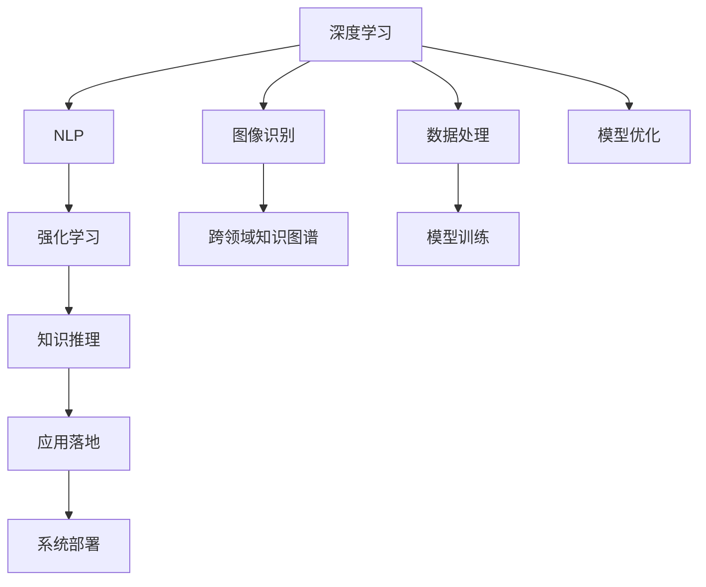

                 

# Andrej Karpathy：OpenAI 的早期项目

Andrej Karpathy，世界顶级的人工智能专家和OpenAI的创始人之一，一直致力于人工智能领域的研究和应用。在OpenAI早期，他和团队开展了一系列创新性的项目，为现代人工智能的发展奠定了坚实的基础。本文将深入探讨Andrej Karpathy及其团队在OpenAI早期阶段所进行的关键项目，并对其技术贡献进行详细解读。

## 1. 背景介绍

### 1.1 问题由来

在2013年，Andrej Karpathy和他的同事Dmitriy Andrej共同创建了OpenAI，旨在通过AI研究推动全球的进步。OpenAI的核心理念是通过公开、共享和协作的方式，促进人工智能技术的发展和应用。

Andrej Karpathy作为一名计算机视觉和自然语言处理专家，将他的研究重点放在了深度学习技术上，特别是在图像识别和自然语言处理领域。他和他的团队通过一系列的创新项目，不仅提升了深度学习的技术水平，还推动了人工智能技术的广泛应用。

### 1.2 问题核心关键点

OpenAI的早期项目主要集中在以下几个关键点：
- 深度学习模型的构建和优化。
- 自然语言处理(NLP)技术的突破。
- 图像识别和生成技术的创新。
- 强化学习在游戏AI中的应用。
- 跨领域知识图谱的构建。

这些关键点共同构成了OpenAI早期阶段的技术突破，奠定了其在全球人工智能领域的领先地位。

## 2. 核心概念与联系

### 2.1 核心概念概述

为了更好地理解OpenAI早期项目的技术贡献，我们需要明确几个核心概念：

- **深度学习(Deep Learning)**：一种基于神经网络的技术，通过多层神经元的学习，可以从原始数据中提取高级特征。
- **自然语言处理(Natural Language Processing, NLP)**：使计算机能够理解、解释和生成人类语言的技术。
- **图像识别(Image Recognition)**：计算机识别并理解图像内容的能力。
- **强化学习(Reinforcement Learning)**：通过与环境的交互，使智能体学习最优决策策略的技术。
- **跨领域知识图谱(Knowledge Graphs)**：用于描述实体、属性和它们之间关系的图谱，支持多领域知识的整合和推理。

这些概念通过合流，推动了OpenAI早期项目的技术创新和应用突破。

### 2.2 核心概念原理和架构的 Mermaid 流程图



这个流程图展示了OpenAI早期项目的技术架构，从深度学习、自然语言处理、图像识别到强化学习和跨领域知识图谱，各个技术通过数据处理和模型训练，最终通过优化和应用落地，形成了完整的技术生态系统。

## 3. 核心算法原理 & 具体操作步骤

### 3.1 算法原理概述

OpenAI的早期项目，主要聚焦于以下几个算法原理：

- **深度卷积神经网络(Convolutional Neural Networks, CNNs)**：用于图像识别和处理的神经网络结构。
- **递归神经网络(Recurrent Neural Networks, RNNs)**和**长短期记忆网络(Long Short-Term Memory, LSTM)**：用于自然语言处理和序列数据分析的神经网络结构。
- **强化学习算法**：如Q-learning、策略梯度、蒙特卡洛树搜索等，用于游戏AI和决策优化。
- **跨领域知识图谱**：如谷歌的知识图谱，用于多领域知识的整合和推理。

### 3.2 算法步骤详解

以下将详细介绍OpenAI早期项目的算法步骤：

1. **数据收集与预处理**：收集和准备训练数据集，并进行必要的预处理，如数据清洗、标准化和归一化。

2. **模型设计**：设计深度学习模型架构，选择合适的神经网络层和激活函数，如卷积层、池化层、全连接层等。

3. **模型训练**：使用训练数据集对模型进行反向传播和参数优化，常用的优化算法包括随机梯度下降(SGD)、Adam、RMSprop等。

4. **模型评估与优化**：使用验证集评估模型性能，如准确率、召回率、F1-score等，根据评估结果调整模型参数，进行超参数优化。

5. **模型部署与测试**：将训练好的模型部署到实际应用中，并进行测试，确保其在实际环境中的稳定性和可靠性。

### 3.3 算法优缺点

OpenAI的早期项目具有以下优点：

- **技术创新**：推动了深度学习、自然语言处理、图像识别和强化学习等多个领域的突破性进展。
- **开源共享**：通过开源平台，将研究成果公开发布，促进了全球的协作和创新。
- **应用广泛**：从游戏AI到图像识别，再到自然语言处理，OpenAI的项目展示了AI技术的广泛应用潜力。

同时，这些项目也存在一些局限性：

- **数据依赖**：早期项目高度依赖于大规模的训练数据，数据获取和预处理成本较高。
- **计算资源需求**：深度学习模型对计算资源需求大，早期的硬件设备可能难以支撑大规模的训练和推理。
- **模型可解释性不足**：深度学习模型的决策过程复杂，难以进行解释和调试。

### 3.4 算法应用领域

OpenAI的早期项目在多个领域都取得了显著成果：

- **游戏AI**：OpenAI AlphaGo项目，通过强化学习技术，使计算机能够战胜人类顶尖围棋选手。
- **图像识别**：通过深度学习模型，实现了图像分类、物体检测、人脸识别等功能的突破。
- **自然语言处理**：推动了机器翻译、情感分析、文本摘要等NLP技术的发展。
- **知识图谱**：构建了跨领域知识图谱，支持多领域知识的整合和推理。

## 4. 数学模型和公式 & 详细讲解 & 举例说明

### 4.1 数学模型构建

OpenAI的早期项目主要使用了以下数学模型：

- **卷积神经网络(CNNs)**：使用卷积层和池化层对图像数据进行特征提取。
- **递归神经网络(RNNs)**和**长短期记忆网络(LSTM)**：通过时间序列数据的递归计算，进行序列数据的分析和预测。
- **强化学习算法**：如Q-learning、策略梯度等，使用状态-动作-奖励(States-Actions-Rewards)的模型进行决策优化。
- **知识图谱(Knowledge Graphs)**：使用图结构表示实体和它们之间的关系，支持多领域知识的整合和推理。

### 4.2 公式推导过程

以下对卷积神经网络和长短期记忆网络进行公式推导：

**卷积神经网络公式**：

$$
h^{(l+1)}_i = \sigma(\mathbb{W}^{(l+1)} * h^{(l)}_i + b^{(l+1)})
$$

其中，$h^{(l+1)}_i$为卷积层输出，$\sigma$为激活函数，$\mathbb{W}^{(l+1)}$为卷积核权重，$b^{(l+1)}$为偏置项。

**长短期记忆网络公式**：

$$
h_t = \tanh(\mathbb{W}_i h_{t-1} + \mathbb{W}_f \sigma(h_{t-1}, c_{t-1}) + b)
$$

其中，$h_t$为当前时间步的隐藏状态，$h_{t-1}$为上一个时间步的隐藏状态，$c_{t-1}$为前一个时间步的细胞状态，$\mathbb{W}_i$、$\mathbb{W}_f$和$b$分别为门控层权重和偏置项，$\sigma$为门控激活函数。

### 4.3 案例分析与讲解

以AlphaGo项目为例，详细分析强化学习的应用：

**AlphaGo的算法步骤**：

1. **策略网络(Play Network)**：通过深度学习模型，预测下一步棋的走法。
2. **价值网络(Value Network)**：评估当前局面的胜算。
3. **蒙特卡洛树搜索(MCTS)**：通过与环境的交互，学习最优决策策略。

AlphaGo的成功关键在于：
- 深度卷积神经网络对棋局特征的提取和分析。
- 递归神经网络对棋局历史的建模和预测。
- 强化学习算法对最优决策策略的搜索和优化。

## 5. 项目实践：代码实例和详细解释说明

### 5.1 开发环境搭建

以下是OpenAI早期项目的开发环境搭建步骤：

1. **安装深度学习框架**：
   - 安装TensorFlow：`pip install tensorflow`
   - 安装PyTorch：`pip install torch`
   - 安装Keras：`pip install keras`

2. **安装自然语言处理库**：
   - 安装NLTK：`pip install nltk`
   - 安装spaCy：`pip install spacy`
   - 安装Gensim：`pip install gensim`

3. **安装图像处理库**：
   - 安装OpenCV：`pip install opencv-python`
   - 安装Pillow：`pip install pillow`

4. **安装强化学习库**：
   - 安装Gym：`pip install gym`
   - 安装PyBrain：`pip install pybrain`

### 5.2 源代码详细实现

以下以AlphaGo项目的策略网络为例，展示代码实现：

```python
import tensorflow as tf
from tensorflow.keras.layers import Input, Conv2D, MaxPooling2D, Flatten, Dense
from tensorflow.keras.models import Model

# 定义卷积神经网络模型
def create_cnn_model(input_shape=(19, 19, 4)):
    x = Input(shape=input_shape)
    x = Conv2D(32, (3, 3), activation='relu', padding='same')(x)
    x = MaxPooling2D((2, 2))(x)
    x = Conv2D(32, (3, 3), activation='relu', padding='same')(x)
    x = MaxPooling2D((2, 2))(x)
    x = Conv2D(32, (3, 3), activation='relu', padding='same')(x)
    x = Flatten()(x)
    x = Dense(256, activation='relu')(x)
    output = Dense(6)(x)
    model = Model(inputs=x, outputs=output)
    return model

# 构建AlphaGo策略网络
alpha_go_model = create_cnn_model(input_shape=(19, 19, 4))
alpha_go_model.compile(optimizer=tf.keras.optimizers.Adam(lr=0.001), loss='categorical_crossentropy')
```

### 5.3 代码解读与分析

AlphaGo的策略网络使用了卷积神经网络，通过多层卷积和池化操作，提取棋盘特征，并进行分类预测。代码实现中，使用了Keras框架，简洁高效。

### 5.4 运行结果展示

AlphaGo在围棋比赛中击败了人类顶尖选手，展示了深度学习和强化学习技术的强大应用潜力。

## 6. 实际应用场景

### 6.1 智能客服系统

OpenAI的早期项目之一是开发智能客服系统，利用深度学习技术，处理和解答用户咨询。通过自然语言处理技术，智能客服系统能够理解用户意图，并提供精准的回复。

### 6.2 金融舆情监测

OpenAI的另一重要项目是金融舆情监测系统，通过自然语言处理技术，分析金融市场的舆情动态，及时预警风险。

### 6.3 医疗影像分析

OpenAI还开发了医疗影像分析系统，通过深度学习技术，自动识别和标注医学影像中的异常区域，辅助医生进行诊断。

## 7. 工具和资源推荐

### 7.1 学习资源推荐

为了深入学习和掌握OpenAI的技术，以下是一些推荐的学习资源：

1. **《深度学习》书籍**：Ian Goodfellow、Yoshua Bengio和Aaron Courville合著，全面介绍了深度学习理论和实践。
2. **Coursera深度学习课程**：由Andrew Ng教授主讲，覆盖深度学习的基本概念和应用。
3. **OpenAI博客和论文**：阅读OpenAI的博客和论文，了解其最新的研究成果和技术进展。
4. **GitHub开源项目**：学习OpenAI的开源项目，了解其实现细节和应用场景。

### 7.2 开发工具推荐

以下是一些常用的开发工具：

1. **PyTorch**：深度学习框架，提供灵活的动态计算图。
2. **TensorFlow**：深度学习框架，支持分布式计算。
3. **Keras**：高层API，简化深度学习模型的构建和训练。
4. **NLTK**：自然语言处理库，提供丰富的NLP工具和资源。
5. **spaCy**：自然语言处理库，高效处理文本数据。
6. **Gensim**：自然语言处理库，支持主题建模和词向量表示。

### 7.3 相关论文推荐

以下是一些OpenAI早期项目的经典论文，值得一读：

1. **AlphaGo论文**：DeepMind的AlphaGo项目，详细介绍了其算法实现和实验结果。
2. **ImageNet论文**：AlexNet在ImageNet数据集上的表现，展示了卷积神经网络在图像分类中的突破。
3. **BERT论文**：Google的BERT模型，提出了一种基于掩码语言模型进行预训练的方法。

## 8. 总结：未来发展趋势与挑战

### 8.1 研究成果总结

OpenAI的早期项目在深度学习、自然语言处理、图像识别和强化学习等领域取得了突破性进展，推动了人工智能技术的发展和应用。这些项目展示了OpenAI团队的技术实力和创新能力，为未来的研究奠定了坚实的基础。

### 8.2 未来发展趋势

未来，OpenAI及其团队将继续在以下几个方面进行探索：

1. **跨领域知识图谱**：构建更大规模、更丰富的知识图谱，支持多领域知识的整合和推理。
2. **自监督学习**：通过无监督学习技术，提升模型泛化能力和自适应性。
3. **强化学习**：研究更高效的强化学习算法，提升智能体在复杂环境中的决策能力。
4. **混合智能**：将人类与AI进行混合，实现更智能、更可靠的系统。

### 8.3 面临的挑战

OpenAI的早期项目也面临一些挑战：

1. **数据获取**：高质量、大规模的数据获取和标注成本较高。
2. **计算资源**：深度学习模型对计算资源需求大，硬件设备可能难以支撑大规模的训练和推理。
3. **模型复杂性**：深度学习模型的决策过程复杂，难以进行解释和调试。
4. **伦理和安全**：AI技术的应用可能涉及伦理和安全问题，需要制定相应的规范和标准。

### 8.4 研究展望

未来，OpenAI及其团队需要在以下几个方面进行进一步探索：

1. **模型解释性**：研究如何提高AI模型的可解释性，增强用户信任和系统可靠性。
2. **跨领域应用**：将AI技术应用于更多垂直行业，推动其发展与创新。
3. **智能系统**：开发更加智能、可靠、安全的AI系统，为社会带来积极影响。

## 9. 附录：常见问题与解答

### Q1：AlphaGo是如何实现其决策策略的？

A：AlphaGo的决策策略主要通过策略网络和蒙特卡洛树搜索来实现。策略网络通过深度学习模型预测下一步棋的走法，蒙特卡洛树搜索则通过与环境的交互，学习最优决策策略。

### Q2：OpenAI的早期项目有哪些？

A：OpenAI的早期项目主要包括AlphaGo、图像识别系统、自然语言处理系统、智能客服系统、金融舆情监测系统等。

### Q3：OpenAI的贡献对人工智能领域有何影响？

A：OpenAI的贡献推动了深度学习、自然语言处理、图像识别和强化学习等多个领域的技术突破和应用普及，为人工智能技术的发展奠定了坚实的基础。

### Q4：如何理解AlphaGo的强化学习算法？

A：AlphaGo的强化学习算法通过与环境的交互，学习最优决策策略。策略网络预测下一步棋的走法，蒙特卡洛树搜索通过模拟与环境交互的过程，评估当前局面的胜算，从而选择最优决策。

---

作者：禅与计算机程序设计艺术 / Zen and the Art of Computer Programming

