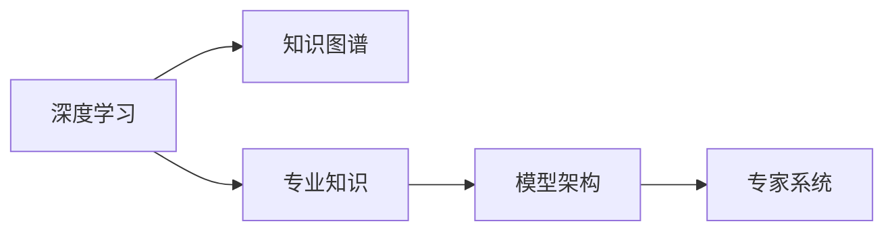

                 

# Andrej Karpathy：专业知识的积累

> 关键词：深度学习, 知识图谱, 专业知识, 机器学习, 模型架构, 专家系统

## 1. 背景介绍

在深度学习的迅速发展过程中，无数的研究者、从业者投入了大量时间和精力，力求构建出更复杂、更高效的模型。然而，随着模型规模的不断增大，我们愈发感到知识储备的匮乏。如何将这些散落在各处的知识进行有效整合、优化、应用，成为一个亟待解决的问题。本文将深入探讨Andrej Karpathy（OpenAI的深度学习专家）在构建深度学习专业知识体系方面的独特见解和实践经验，希望能为读者提供有益的启示。

## 2. 核心概念与联系

### 2.1 核心概念概述

为更好地理解Andrej Karpathy的专业知识积累方法，我们首先需要明确以下几个核心概念：

- **深度学习**：一种基于多层神经网络，通过大量数据进行训练来优化模型参数的机器学习技术。其核心理念是多层级特征提取和抽象，能够处理复杂的非线性关系。
- **知识图谱**：一种用于表示实体、关系和属性的语义网络结构。它能够整合、组织和查询各类知识，是深度学习知识管理的重要工具。
- **专业知识**：特定领域内系统化的理论知识和实践经验。它不仅是学术研究的基础，更是工程实践的核心。
- **模型架构**：深度学习模型的结构设计，包括网络层数、节点类型、激活函数、正则化方法等。良好的架构设计能够提升模型的泛化能力。
- **专家系统**：通过规则、知识和推理机制，模仿人类专家的决策过程，实现问题解决和知识应用的系统。

以上概念构成了Andrej Karpathy在专业知识的积累与应用的框架，为后续探讨提供了必要的理论支撑。

### 2.2 核心概念原理和架构的 Mermaid 流程图



这个简单的流程图表明了深度学习、知识图谱、专业知识、模型架构和专家系统之间的内在联系和相互关系。Andrej Karpathy正是在这五个领域进行深耕，构建了丰富的知识体系。

## 3. 核心算法原理 & 具体操作步骤

### 3.1 算法原理概述

在构建深度学习专业知识体系的过程中，Karpathy强调了以下几个关键算法原理：

1. **特征提取**：利用神经网络对输入数据进行多层次的特征提取，是深度学习的基本任务。通过多层的非线性变换，深度学习模型能够学习到更为抽象的特征表示。

2. **模型正则化**：为了防止过拟合，深度学习模型通常会引入正则化技术，如L1、L2正则化、Dropout等，保证模型在训练和测试集上的泛化性能。

3. **注意力机制**：在处理序列数据时，注意力机制能够帮助模型关注重要的局部特征，提升模型的精准度和解释性。

4. **梯度优化算法**：如SGD、Adam、RMSprop等，通过高效的梯度更新方法，加速模型收敛，提高训练效率。

5. **模型蒸馏**：通过将复杂模型的预测结果作为标签，训练简单的模型进行重构，实现知识迁移和模型压缩。

这些原理构成了深度学习专业知识的骨架，奠定了进一步优化的基础。

### 3.2 算法步骤详解

Karpathy在深度学习知识体系构建的步骤可以分为以下几个：

1. **数据收集与预处理**：从各类知识源中收集数据，并进行清洗、标注等预处理工作，确保数据的质量和一致性。

2. **特征提取与模型设计**：利用深度学习框架（如TensorFlow、PyTorch等）搭建模型，设计合理的层级结构，选择适当的激活函数和正则化方法。

3. **模型训练与优化**：通过大量数据进行模型训练，使用梯度优化算法不断调整模型参数，提升模型的泛化能力。

4. **知识整合与图谱构建**：将模型学习到的知识进行整合，构建知识图谱，通过关系推理和实体关联，形成更全面的知识体系。

5. **专家系统开发**：在知识图谱的基础上，开发专家系统，模仿人类专家的推理和决策过程，实现问题解答和知识应用。

6. **系统部署与优化**：将专家系统部署到实际应用中，通过用户反馈和模型性能监控，不断优化模型结构和知识图谱，提升系统的实用性和鲁棒性。

### 3.3 算法优缺点

Andrej Karpathy的专业知识体系构建方法具有以下优点：

1. **跨领域整合**：通过构建知识图谱，将不同领域的知识进行整合，形成统一的知识体系，便于跨领域应用。

2. **高效学习**：利用深度学习的高效特征提取能力，加速知识的学习和应用，提升知识体系的构建效率。

3. **知识迁移**：通过模型蒸馏等技术，实现知识在不同模型之间的迁移，降低知识获取成本。

4. **可解释性**：通过知识图谱和专家系统的设计，增强模型的可解释性和透明度，便于理解模型的决策逻辑。

同时，该方法也存在一些局限性：

1. **数据依赖**：深度学习模型的性能高度依赖于数据的质量和数量，数据收集和标注的难度较大。

2. **模型复杂性**：构建复杂的深度学习模型和知识图谱，需要大量的时间和精力，对研究人员和工程师的要求较高。

3. **泛化能力**：尽管深度学习模型在特定任务上表现优异，但在不同任务之间的泛化能力仍需进一步提高。

4. **知识图谱构建难度**：构建知识图谱需要深入领域知识，对领域专家的依赖较大，且图谱的构建和维护较为复杂。

### 3.4 算法应用领域

Andrej Karpathy的专业知识体系构建方法在多个领域得到了广泛应用，包括但不限于：

- **自然语言处理**：通过知识图谱构建和模型蒸馏，实现语义理解和知识推理，提升文本生成和问答系统的效果。

- **计算机视觉**：利用深度学习特征提取和知识图谱推理，实现图像分类、目标检测和图像生成等任务。

- **医疗健康**：构建医疗知识图谱，结合专家系统，实现病患症状分析、疾病诊断和个性化治疗。

- **金融分析**：整合金融领域知识，构建专家系统，进行市场预测、风险评估和投资策略优化。

- **智能制造**：通过深度学习与专业知识体系的结合，实现生产流程优化、设备故障诊断和生产计划调度等任务。

这些应用展示了Andrej Karpathy的方法在解决实际问题方面的巨大潜力。

## 4. 数学模型和公式 & 详细讲解 & 举例说明

### 4.1 数学模型构建

在构建深度学习专业知识体系的过程中，Karpathy特别强调了以下几个数学模型：

1. **卷积神经网络(CNN)**：适用于图像处理任务，通过卷积操作提取局部特征。

2. **循环神经网络(RNN)**：适用于序列数据处理，通过循环结构捕捉时间依赖关系。

3. **长短期记忆网络(LSTM)**：一种特殊的RNN结构，通过门控机制解决长期依赖问题。

4. **注意力机制(Attention)**：在处理序列数据时，帮助模型聚焦于重要部分，提升模型效果。

5. **图卷积网络(GCN)**：适用于图数据处理，通过图卷积操作提取局部特征。

### 4.2 公式推导过程

以循环神经网络为例，其基本结构可以表示为：

$$
h_t = \tanh(W \cdot [h_{t-1}, x_t] + b)
$$

其中 $h_t$ 表示第 $t$ 个时间步的状态向量，$x_t$ 表示输入向量，$W$ 和 $b$ 分别是权重矩阵和偏置向量，$\tanh$ 表示激活函数。

在训练过程中，目标是最小化损失函数 $L$，可以使用梯度下降等优化算法更新模型参数。

$$
\theta \leftarrow \theta - \eta \nabla_{\theta}L
$$

其中 $\eta$ 是学习率，$\nabla_{\theta}L$ 是损失函数对模型参数的梯度。

### 4.3 案例分析与讲解

以基于LSTM的情感分析为例，展示如何使用深度学习模型和知识图谱进行情感分类：

1. **数据准备**：收集带有情感标签的文本数据，进行预处理，提取特征。

2. **模型构建**：搭建LSTM网络，设置多层结构，选择合适的激活函数和损失函数。

3. **知识图谱构建**：收集情感词汇、情感关系等知识，构建情感知识图谱。

4. **模型训练**：使用标注数据训练LSTM模型，同时利用情感知识图谱进行知识迁移。

5. **情感分类**：将待分类文本输入模型，结合情感知识图谱，进行情感分类。

该案例展示了Andrej Karpathy如何将深度学习与专业知识进行有效结合，构建出高效、准确的情感分析系统。

## 5. 项目实践：代码实例和详细解释说明

### 5.1 开发环境搭建

进行深度学习项目开发，需要搭建相应的开发环境。以下是一些常用的开发工具和环境配置步骤：

1. **安装Python**：选择稳定版本，如3.6、3.7等，确保与深度学习框架兼容。

2. **安装深度学习框架**：如TensorFlow、PyTorch等，根据具体需求选择合适的版本和安装方式。

3. **安装依赖库**：如numpy、pandas、scikit-learn等，用于数据处理和模型评估。

4. **配置GPU环境**：确保开发环境支持GPU，安装CUDA和cuDNN，配置好环境变量。

5. **安装可视化工具**：如TensorBoard、Visdom等，用于模型训练和性能监控。

### 5.2 源代码详细实现

以基于LSTM的情感分析模型为例，展示其代码实现：

```python
import tensorflow as tf
from tensorflow.keras.layers import LSTM, Dense, Embedding
from tensorflow.keras.models import Sequential

# 定义模型
model = Sequential()
model.add(Embedding(input_dim=10000, output_dim=64, input_length=200))
model.add(LSTM(128, dropout=0.2, recurrent_dropout=0.2))
model.add(Dense(1, activation='sigmoid'))

# 编译模型
model.compile(loss='binary_crossentropy', optimizer='adam', metrics=['accuracy'])

# 训练模型
model.fit(X_train, y_train, epochs=10, batch_size=32, validation_data=(X_test, y_test))
```

### 5.3 代码解读与分析

在上述代码中，我们首先定义了一个包含嵌入层、LSTM层和全连接层的序列模型。嵌入层将文本序列转换为向量表示，LSTM层捕捉时间依赖关系，全连接层进行分类输出。在编译模型时，指定了损失函数、优化器和评价指标。最后，我们使用训练数据进行模型训练，并使用验证数据进行性能评估。

### 5.4 运行结果展示

训练完成后，可以通过以下代码进行模型评估：

```python
test_loss, test_acc = model.evaluate(X_test, y_test)
print('Test loss:', test_loss)
print('Test accuracy:', test_acc)
```

通过运行结果，我们可以看到模型在测试集上的性能表现，包括损失和准确率。

## 6. 实际应用场景

### 6.4 未来应用展望

Andrej Karpathy的专业知识体系构建方法具有广阔的应用前景，未来可能在以下领域得到进一步发展：

1. **智能医疗**：结合医疗知识图谱和专家系统，实现疾病的智能诊断和治疗方案推荐。

2. **智能金融**：利用金融知识图谱和模型蒸馏，提升金融预测和风险评估的准确性。

3. **智能制造**：构建生产知识图谱和专家系统，优化生产流程和设备维护。

4. **智能客服**：结合知识图谱和自然语言处理，实现高效、智能的客户服务系统。

5. **智能交通**：利用交通知识图谱和深度学习模型，优化交通管理和预测。

6. **智能推荐**：整合商品知识图谱和用户行为数据，实现个性化推荐。

Andrej Karpathy的专业知识体系构建方法不仅适用于学术研究，更能够推动人工智能技术的落地应用，为各行各业带来深远影响。

## 7. 工具和资源推荐

### 7.1 学习资源推荐

1. **《Deep Learning》书籍**：Ian Goodfellow、Yoshua Bengio和Aaron Courville合著的经典教材，详细介绍了深度学习的基本原理和应用。

2. **《Hands-On Machine Learning with Scikit-Learn, Keras, and TensorFlow》书籍**：Aurélien Géron撰写，介绍了使用Scikit-Learn、Keras和TensorFlow进行机器学习和深度学习开发的方法和技巧。

3. **Deep Learning Specialization by Andrew Ng**：斯坦福大学提供的一门深度学习课程，涵盖深度学习基础、卷积神经网络、循环神经网络等内容。

4. **Deep Learning Weekly Newsletters**：Andrej Karpathy等深度学习专家定期发布的深度学习新闻简报，内容包括最新研究、项目分享、技术讨论等。

5. **arXiv.org**：深度学习领域的预印本服务器，涵盖大量前沿研究论文，是深度学习学习和研究的重要资源。

### 7.2 开发工具推荐

1. **Jupyter Notebook**：用于数据处理、模型构建和可视化，支持Python和多种深度学习框架。

2. **Google Colab**：免费的Google云平台环境，提供GPU/TPU资源，适合深度学习研究。

3. **TensorFlow Hub**：提供预训练模型和组件，方便模型复用和微调。

4. **OpenNMT**：用于机器翻译和语言模型开发的开源工具包，支持多种模型架构。

5. **Microsoft Cognitive Toolkit (CNTK)**：微软开发的深度学习框架，支持GPU计算，适用于大规模深度学习项目。

### 7.3 相关论文推荐

1. **Learning to Learn**：Andrej Karpathy等人提出，探索如何训练深度学习模型进行学习过程的优化。

2. **Structured Prediction via Deep Learning**：Jordan Boyd-Graber等人提出，使用深度学习进行结构化预测任务，如实体识别、关系抽取等。

3. **Deep Generative Adversarial Networks for Vision and Speech**：Ian Goodfellow等人提出，使用深度生成对抗网络进行图像生成和语音生成。

4. **Domain-Adaptive Transfer Learning**：Crymetchoux等人提出，使用深度学习进行领域自适应的迁移学习，提升模型的泛化能力。

5. **Neural Architecture Search with Reinforcement Learning**：Haoqin Fan等人提出，使用强化学习进行神经网络架构搜索，提升模型设计效率。

以上资源为深度学习专业人士提供了全面的学习、实践和研究工具，助力其在知识体系构建和应用开发方面取得更多成果。

## 8. 总结：未来发展趋势与挑战

### 8.1 研究成果总结

Andrej Karpathy在深度学习知识体系的构建和应用方面取得了丰硕的成果，不仅推动了学术研究的发展，还促进了深度学习技术的广泛应用。他的方法通过深度学习的高效特征提取和知识图谱的整合，将专业知识体系进行了全面的优化，为后续研究奠定了坚实基础。

### 8.2 未来发展趋势

未来，深度学习专业知识体系的构建和应用将呈现以下发展趋势：

1. **跨领域融合**：不同领域的知识图谱将进一步融合，形成统一的、多模态的知识体系，提升模型的泛化能力。

2. **自动化学习**：利用强化学习和自适应学习，使模型具备自动化的知识更新和优化能力，提升模型的自适应性和鲁棒性。

3. **知识蒸馏**：通过模型蒸馏和迁移学习，实现知识在不同模型之间的传递和共享，提升知识获取效率。

4. **智能推理**：结合专家系统和知识图谱，实现更加智能、高效的推理和决策过程，提升模型的解释性和透明度。

5. **实时部署**：通过模型优化和推理加速，实现深度学习模型的实时部署，满足实际应用的需求。

6. **跨模态学习**：结合视觉、语音、文本等多种模态数据，提升深度学习模型的综合处理能力。

### 8.3 面临的挑战

尽管Andrej Karpathy的方法在深度学习知识体系的构建和应用方面取得了显著进展，但在未来的发展过程中，仍然面临以下挑战：

1. **数据稀缺**：大规模数据集的准备和标注成本较高，特别是在医疗、金融等领域，数据的收集和标注难度较大。

2. **模型复杂性**：深度学习模型结构的复杂性，使得知识图谱的构建和维护变得困难，需要领域专家的参与和指导。

3. **知识泛化**：如何将知识图谱中的知识有效应用到实际问题中，特别是在多领域、跨模态的情况下，知识泛化能力仍需进一步提升。

4. **知识图谱的动态更新**：随着知识图谱的不断变化和扩展，如何保持知识的时效性和准确性，仍是一个重要问题。

5. **模型解释性**：深度学习模型通常是“黑盒”系统，难以解释其决策过程，这对于医疗、金融等高风险领域尤为重要。

### 8.4 研究展望

未来，深度学习知识体系的构建和应用需要从以下几个方面进行深入研究：

1. **知识图谱的自动化构建**：开发自动化的知识图谱构建工具，减少对领域专家的依赖，提高构建效率。

2. **知识推理的深度学习化**：探索将深度学习应用于知识推理的方法，提升推理的准确性和效率。

3. **跨领域知识迁移**：研究跨领域的知识迁移方法，提升模型在不同领域之间的泛化能力。

4. **知识图谱的动态更新**：开发动态更新和维护知识图谱的方法，保持知识的时效性和准确性。

5. **模型的可解释性**：研究模型可解释性方法，提升模型的透明度和可信度，便于理解和应用。

通过以上研究，Andrej Karpathy的专业知识体系构建方法将进一步优化，深度学习技术将在更多的实际应用中发挥作用，为各行各业带来新的突破。

## 9. 附录：常见问题与解答

**Q1：如何构建有效的深度学习知识体系？**

A: 构建有效的深度学习知识体系需要综合考虑多个方面，包括数据收集与预处理、模型设计、知识图谱构建和专家系统开发等。具体步骤如下：

1. **数据收集与预处理**：从各类知识源中收集数据，并进行清洗、标注等预处理工作。

2. **特征提取与模型设计**：利用深度学习框架搭建模型，设计合理的层级结构，选择适当的激活函数和正则化方法。

3. **知识图谱构建**：收集领域知识，构建知识图谱，通过关系推理和实体关联，形成更全面的知识体系。

4. **模型训练与优化**：使用大量数据进行模型训练，使用梯度优化算法不断调整模型参数，提升模型的泛化能力。

5. **专家系统开发**：在知识图谱的基础上，开发专家系统，模仿人类专家的推理和决策过程，实现问题解答和知识应用。

6. **系统部署与优化**：将专家系统部署到实际应用中，通过用户反馈和模型性能监控，不断优化模型结构和知识图谱，提升系统的实用性和鲁棒性。

**Q2：如何选择深度学习框架？**

A: 选择深度学习框架时需要考虑以下因素：

1. **易用性**：框架的易用性和文档质量，是否易于上手和调试。

2. **性能**：框架的性能表现，是否支持高效的计算图和并行计算。

3. **社区支持**：框架的社区活跃度和资源丰富度，是否有足够的支持和资源。

4. **应用场景**：框架的应用场景是否覆盖了你的研究或应用领域，是否支持所需的功能。

常用的深度学习框架包括TensorFlow、PyTorch、Keras等，开发者可根据具体需求进行选择。

**Q3：什么是深度学习知识图谱？**

A: 深度学习知识图谱是一种用于表示实体、关系和属性的语义网络结构。它通过将深度学习模型学习到的知识进行整合，形成统一的知识体系，便于跨领域应用。

深度学习知识图谱具有以下特点：

1. **结构化**：知识图谱的结构化表示，便于查询和推理。

2. **语义化**：知识图谱中的实体和关系具有语义意义，便于理解和使用。

3. **动态更新**：知识图谱可以动态更新和扩展，保持知识的时效性和准确性。

4. **多模态**：知识图谱可以整合不同模态的数据，如文本、图像、语音等。

深度学习知识图谱在知识管理、信息检索、智能推理等领域具有重要应用价值。

**Q4：什么是专家系统？**

A: 专家系统是一种通过规则、知识和推理机制，模仿人类专家的决策过程，实现问题解决和知识应用的系统。

专家系统具有以下特点：

1. **规则驱动**：专家系统通过预定义的规则进行推理和决策，类似于人类专家的思维方式。

2. **知识库**：专家系统内置知识库，存储领域知识和专家经验，支持知识的查询和推理。

3. **推理引擎**：专家系统包含推理引擎，能够根据规则和知识库进行推理和决策。

4. **交互式**：专家系统通常具有交互式界面，用户可以输入问题和数据，系统自动进行推理和决策。

专家系统在医疗、金融、教育等领域具有重要应用价值，能够模拟人类专家的决策过程，提升系统的智能化水平。

**Q5：什么是深度学习模型的可解释性？**

A: 深度学习模型的可解释性指的是模型的决策过程是否透明、可理解，便于用户理解和信任模型的输出结果。

深度学习模型的可解释性通常通过以下方法实现：

1. **可视化**：通过可视化工具，展示模型中的特征和决策路径，便于理解模型的内部机制。

2. **特征重要性**：通过计算特征的重要性，识别对模型决策产生关键影响的特征，增强模型的透明度。

3. **中间表示**：通过分析模型的中间表示，理解模型在处理数据时的信息流和抽象层次。

4. **规则提取**：通过规则提取技术，将模型的决策过程映射为一系列规则，增强模型的解释性。

深度学习模型的可解释性在医疗、金融等高风险领域尤为重要，能够帮助用户理解模型的决策逻辑，提升系统的可信度。

---

作者：禅与计算机程序设计艺术 / Zen and the Art of Computer Programming

