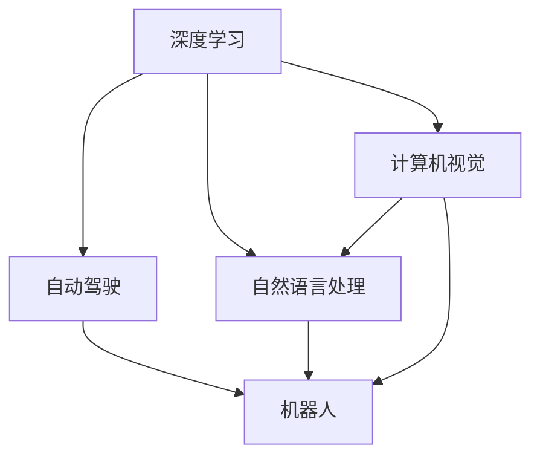

                 

# Andrej Karpathy：人工智能的未来发展前景

> 关键词：人工智能, 深度学习, 深度强化学习, 自动驾驶, 机器人, 计算机视觉, 自然语言处理, 生成对抗网络, 未来技术

## 1. 背景介绍

### 1.1 问题由来

随着人工智能技术的快速发展，深度学习在过去几年内取得了一系列突破性的进展，特别是在计算机视觉和自然语言处理领域。以Andrej Karpathy为代表的深度学习专家，不断推动着AI技术的前沿研究，为我们揭示了人工智能的未来发展方向。本文将从Andrej Karpathy的视角，探讨深度学习在未来的应用前景。

### 1.2 问题核心关键点

- 深度学习在计算机视觉、自然语言处理、自动驾驶等领域的应用前景。
- 未来深度学习技术的发展趋势，如生成对抗网络、深度强化学习等。
- 深度学习在机器人、自动驾驶等高技术领域的应用。
- 人工智能对社会和经济发展的影响。

## 2. 核心概念与联系

### 2.1 核心概念概述

为更好地理解Andrej Karpathy对人工智能未来的展望，本节将介绍几个关键的概念：

- 深度学习：基于多层神经网络，通过反向传播算法优化模型参数，使其能够从数据中学习出高级特征，适用于图像、语音、文本等多种数据类型。
- 生成对抗网络（GAN）：一种由生成器和判别器组成的网络结构，通过对抗训练，生成逼真、高质量的图像、音频、视频等。
- 深度强化学习：结合深度学习和强化学习，通过与环境的交互学习，实现复杂的决策制定和控制任务。
- 自动驾驶：结合计算机视觉、自然语言处理、深度学习等多种技术，实现车辆自主导航和驾驶。
- 机器人：结合计算机视觉、深度学习、自然语言处理等技术，实现自主导航、任务执行等功能。
- 计算机视觉：通过图像处理、特征提取、模式识别等技术，使计算机具备“看”的能力。
- 自然语言处理：通过语言理解、文本生成、情感分析等技术，使计算机具备“听”和“说”的能力。

这些概念之间的逻辑关系可以通过以下Mermaid流程图来展示：



这个流程图展示了几大核心概念及其之间的关系：

1. 深度学习是计算机视觉、自然语言处理和自动驾驶等领域的基石。
2. 生成对抗网络和深度强化学习等技术在计算机视觉、自然语言处理等领域得到广泛应用。
3. 机器人、自动驾驶等领域结合了计算机视觉、自然语言处理、深度学习等多种技术。

## 3. 核心算法原理 & 具体操作步骤
### 3.1 算法原理概述

Andrej Karpathy对人工智能的未来展望主要集中在以下几个方面：

- **计算机视觉与自然语言处理**：深度学习在图像和文本识别、自然语言理解与生成等任务上已取得显著进展，未来将继续推动自动化视觉和语音识别技术的发展。
- **生成对抗网络（GAN）**：GAN在图像生成、视频编辑、医学影像重建等方面展现出巨大潜力，未来将进一步完善生成图像的质量和多样性。
- **深度强化学习**：结合深度学习和强化学习，未来将实现更复杂的决策制定和控制任务，如自动驾驶、机器人操作等。
- **自动驾驶**：结合计算机视觉、自然语言处理、深度学习等技术，未来将实现更为安全和高效的车辆导航。
- **机器人**：结合计算机视觉、深度学习、自然语言处理等技术，未来将实现更加智能、灵活的自主机器人。

### 3.2 算法步骤详解

1. **计算机视觉与自然语言处理**：
   - **数据准备**：收集大规模、高质量的图像和文本数据集，并进行预处理和标注。
   - **模型训练**：构建卷积神经网络（CNN）、循环神经网络（RNN）、Transformer等深度学习模型，通过反向传播算法优化模型参数。
   - **模型评估**：在测试集上评估模型的性能，如准确率、召回率、F1分数等指标。
   - **模型部署**：将训练好的模型部署到实际应用中，如实时图像识别、语音助手、智能客服等。

2. **生成对抗网络（GAN）**：
   - **生成器与判别器构建**：设计生成器和判别器的网络结构，通常使用卷积神经网络。
   - **对抗训练**：通过交替更新生成器和判别器，使生成器能够生成逼真的图像或视频。
   - **质量优化**：引入GAN的变分自编码器（VAE）、变分生成对抗网络（VGAN）等技术，提升生成图像的质量和多样性。
   - **应用场景**：如医学图像重建、人脸生成、视频编辑等。

3. **深度强化学习**：
   - **环境设计**：定义智能体与环境的交互方式，如自动驾驶场景中的交通环境、机器人操作中的操作环境。
   - **策略优化**：使用Q-learning、SARSA等强化学习算法，优化智能体的决策策略。
   - **模型融合**：结合深度学习和强化学习，如深度Q网络（DQN）、深度确定性策略梯度（DDPG）等，提升智能体的决策能力。
   - **应用场景**：如自动驾驶、机器人操作、游戏AI等。

4. **自动驾驶**：
   - **数据采集**：通过车载传感器（如摄像头、雷达、激光雷达）采集车辆周围的环境数据。
   - **环境理解**：使用深度学习模型进行图像识别、目标检测、语义分割等任务，理解周围环境。
   - **决策制定**：结合深度强化学习技术，制定驾驶决策，如避障、跟车、变道等。
   - **实时控制**：根据决策结果，控制车辆加速、制动、转向等动作。

5. **机器人**：
   - **感知与定位**：使用深度学习模型进行环境感知和定位，如通过摄像头进行目标检测、语义分割等。
   - **任务执行**：结合深度学习、自然语言处理等技术，执行各种任务，如搬运物品、清洁环境等。
   - **协同工作**：通过多机器人协同工作，提高工作效率和精度，如无人仓库中的机器人协作。

### 3.3 算法优缺点

Andrej Karpathy对深度学习的未来展望具有以下优点：

- **高性能**：深度学习在图像识别、语音识别、自然语言处理等方面取得了显著进展，展示了强大的学习能力。
- **广泛应用**：深度学习技术已经在多个领域得到广泛应用，如自动驾驶、机器人、医疗等。
- **持续创新**：深度学习领域不断涌现出新的模型和算法，推动技术进步。

同时，深度学习也存在一些局限性：

- **数据依赖**：深度学习模型需要大量标注数据进行训练，数据获取和标注成本较高。
- **可解释性不足**：深度学习模型通常被视为“黑盒”，难以解释其内部决策过程。
- **计算资源消耗大**：深度学习模型需要大量计算资源进行训练和推理，硬件成本较高。
- **通用性不足**：深度学习模型在特定领域的应用效果可能不如传统算法。

### 3.4 算法应用领域

Andrej Karpathy对深度学习的未来展望主要在以下几个领域：

1. **计算机视觉**：深度学习在图像分类、物体检测、图像分割等方面取得了突破性进展，未来将继续推动自动化视觉技术的发展。
2. **自然语言处理**：深度学习在机器翻译、文本摘要、情感分析等方面展示了强大能力，未来将进一步提升自然语言理解和生成能力。
3. **生成对抗网络（GAN）**：GAN在图像生成、视频编辑、医学影像重建等方面展现出巨大潜力，未来将进一步完善生成图像的质量和多样性。
4. **深度强化学习**：结合深度学习和强化学习，未来将实现更复杂的决策制定和控制任务，如自动驾驶、机器人操作等。
5. **自动驾驶**：结合计算机视觉、自然语言处理、深度学习等技术，未来将实现更为安全和高效的车辆导航。
6. **机器人**：结合计算机视觉、深度学习、自然语言处理等技术，未来将实现更加智能、灵活的自主机器人。

## 4. 数学模型和公式 & 详细讲解 & 举例说明

### 4.1 数学模型构建

Andrej Karpathy的研究主要集中在深度学习和深度强化学习领域，以下以深度学习为例，简要介绍数学模型构建过程。

假设输入数据为 $x \in \mathbb{R}^n$，目标输出为 $y \in \mathbb{R}^m$。构建一个深度神经网络模型，通常包含多个隐藏层，如图：

```
input -> hidden layer1 -> hidden layer2 -> output
```

其中，每个隐藏层由多个神经元组成，每个神经元与上一层的所有神经元相连。模型的输入和输出分别由权重矩阵 $W$ 和偏置向量 $b$ 进行线性变换，并应用非线性激活函数 $f$ 进行处理。最终输出结果为：

$$
y = W^Lf(W^{L-1}f(\dots f(W^1x + b^1)\dots) + b^L)
$$

其中 $L$ 为隐藏层数，$f$ 为激活函数，如 ReLU、Sigmoid 等。

### 4.2 公式推导过程

以卷积神经网络（CNN）为例，推导其前向传播和反向传播公式。

假设输入数据为 $x \in \mathbb{R}^{H \times W \times C}$，卷积核为 $w \in \mathbb{R}^{F \times F \times C \times O}$，其中 $H$、$W$、$C$ 分别为输入数据的高度、宽度和通道数，$F$ 为卷积核的大小，$O$ 为卷积层的输出通道数。

前向传播公式为：

$$
y_{i,j,k} = \sum_{o=1}^{O} \sum_{p=0}^{P-1} \sum_{q=0}^{Q-1} w_{o,i-p,j-q,k}x_{i-p,j-q,k}
$$

其中 $y_{i,j,k}$ 为输出特征图上的每个元素，$w_{o,i-p,j-q,k}$ 为卷积核在输入上的卷积权重。

反向传播公式为：

$$
\frac{\partial \mathcal{L}}{\partial x} = \frac{\partial \mathcal{L}}{\partial y} \frac{\partial y}{\partial x}
$$

其中 $\mathcal{L}$ 为损失函数，$y$ 为输出结果。

### 4.3 案例分析与讲解

以图像分类为例，假设使用卷积神经网络进行图像分类，输入为 $x \in \mathbb{R}^{H \times W \times C}$，输出为 $y \in \mathbb{R}^C$，其中 $C$ 为类别数。

构建一个卷积神经网络模型，如图：

```
input -> conv1 -> conv2 -> pool -> conv3 -> pool -> fc -> output
```

其中，conv1、conv2、conv3 为卷积层，pool 为池化层，fc 为全连接层。

假设模型输出结果为 $y$，与真实标签 $t$ 的损失函数为交叉熵损失：

$$
\mathcal{L} = -\frac{1}{N}\sum_{i=1}^N\sum_{j=1}^C t_{i,j}\log y_{i,j}
$$

其中 $N$ 为样本数量，$t$ 为真实标签，$y$ 为模型输出。

## 5. 项目实践：代码实例和详细解释说明

### 5.1 开发环境搭建

在进行深度学习项目实践前，我们需要准备好开发环境。以下是使用Python进行TensorFlow开发的开发环境配置流程：

1. 安装Anaconda：从官网下载并安装Anaconda，用于创建独立的Python环境。

2. 创建并激活虚拟环境：
```bash
conda create -n tf-env python=3.8 
conda activate tf-env
```

3. 安装TensorFlow：根据CUDA版本，从官网获取对应的安装命令。例如：
```bash
conda install tensorflow tensorflow-gpu=2.4
```

4. 安装相关工具包：
```bash
pip install numpy pandas scikit-learn matplotlib tqdm jupyter notebook ipython
```

完成上述步骤后，即可在`tf-env`环境中开始深度学习实践。

### 5.2 源代码详细实现

下面以图像分类任务为例，给出使用TensorFlow对卷积神经网络（CNN）进行图像分类的代码实现。

首先，定义CNN模型：

```python
import tensorflow as tf
from tensorflow.keras import layers

model = tf.keras.Sequential([
    layers.Conv2D(32, (3, 3), activation='relu', input_shape=(28, 28, 1)),
    layers.MaxPooling2D((2, 2)),
    layers.Conv2D(64, (3, 3), activation='relu'),
    layers.MaxPooling2D((2, 2)),
    layers.Conv2D(64, (3, 3), activation='relu'),
    layers.Flatten(),
    layers.Dense(64, activation='relu'),
    layers.Dense(10, activation='softmax')
])
```

然后，定义训练和评估函数：

```python
def train_model(model, train_dataset, val_dataset, batch_size=32, epochs=10):
    model.compile(optimizer='adam',
                  loss='sparse_categorical_crossentropy',
                  metrics=['accuracy'])
    history = model.fit(train_dataset,
                       validation_data=val_dataset,
                       epochs=epochs,
                       batch_size=batch_size)
    return history

def evaluate_model(model, test_dataset, batch_size=32):
    model.evaluate(test_dataset, batch_size=batch_size)
```

最后，启动训练流程：

```python
train_dataset = tf.keras.datasets.mnist.load_data()
val_dataset = train_dataset[0]
test_dataset = train_dataset[1]

# 数据预处理
train_images = train_dataset[0][0].reshape((-1, 28, 28, 1)) / 255.0
val_images = val_dataset[0].reshape((-1, 28, 28, 1)) / 255.0
test_images = test_dataset[0].reshape((-1, 28, 28, 1)) / 255.0

# 数据集划分
x_train, y_train = train_images, train_dataset[1]
x_val, y_val = val_images, val_dataset[1]
x_test, y_test = test_images, test_dataset[1]

# 训练模型
history = train_model(model, (x_train, y_train), (x_val, y_val), batch_size=32, epochs=10)

# 评估模型
evaluate_model(model, (x_test, y_test), batch_size=32)
```

以上就是使用TensorFlow进行CNN图像分类的完整代码实现。可以看到，使用TensorFlow构建卷积神经网络模型非常简单，只需要几步即可完成模型的定义和训练。

### 5.3 代码解读与分析

让我们再详细解读一下关键代码的实现细节：

**Sequential模型**：
- 使用 `tf.keras.Sequential` 定义卷积神经网络模型，按顺序添加卷积层、池化层、全连接层等。

**数据预处理**：
- 将图像数据归一化到 [0, 1] 区间，减少梯度消失问题。
- 通过 `reshape` 函数将图像数据转换成符合模型的输入形状。

**模型编译**：
- 使用 `compile` 方法定义模型的优化器、损失函数和评估指标。

**模型训练**：
- 使用 `fit` 方法对模型进行训练，并传入训练集和验证集。

**模型评估**：
- 使用 `evaluate` 方法对模型进行评估，传入测试集。

**训练流程**：
- 加载 MNIST 数据集，提取训练、验证和测试图像和标签。
- 将图像数据归一化，转换为模型输入形状。
- 定义模型、编译模型，并传入训练集和验证集。
- 训练模型，并在训练过程中保存训练指标。
- 评估模型，输出测试集上的准确率。

## 6. 实际应用场景

### 6.1 智能客服系统

深度学习在智能客服系统中的应用广泛，通过训练基于深度学习的语音识别和自然语言处理模型，可以实现自动客服和语音助手功能。用户只需输入问题，系统即可自动给出答案，提高客户满意度。

### 6.2 金融舆情监测

深度学习在金融领域的应用同样广泛，通过训练基于深度学习的情感分析模型，可以对金融舆情进行实时监测，及时发现负面信息，避免金融风险。

### 6.3 个性化推荐系统

深度学习在个性化推荐系统中也有广泛应用，通过训练基于深度学习的协同过滤和内容推荐模型，可以根据用户的历史行为和兴趣，推荐个性化的商品或内容。

### 6.4 未来应用展望

未来深度学习将在更多领域得到应用，以下是几个可能的趋势：

1. **生成对抗网络（GAN）**：GAN在图像生成、视频编辑、医学影像重建等方面展现出巨大潜力，未来将进一步完善生成图像的质量和多样性。
2. **深度强化学习**：结合深度学习和强化学习，未来将实现更复杂的决策制定和控制任务，如自动驾驶、机器人操作等。
3. **深度学习在医疗领域的应用**：深度学习在医学影像分析、疾病预测等方面具有巨大潜力，未来将进一步推动医疗领域的发展。
4. **深度学习在无人驾驶中的应用**：深度学习在无人驾驶领域的应用前景广阔，未来将实现更为安全和高效的车辆导航。
5. **深度学习在工业自动化中的应用**：深度学习在工业自动化领域的应用前景广阔，未来将实现更为智能和高效的工业生产。

## 7. 工具和资源推荐

### 7.1 学习资源推荐

为了帮助开发者系统掌握深度学习技术，这里推荐一些优质的学习资源：

1. **深度学习入门**：《深度学习》一书由 Ian Goodfellow 等著，详细介绍了深度学习的基本概念和常用技术。
2. **深度学习实战**：《动手学深度学习》一书由李沐等人著，提供了大量深度学习的实践案例。
3. **Coursera深度学习课程**：由 Andrew Ng 开设的深度学习课程，涵盖深度学习的各个方面，适合初学者学习。
4. **Kaggle竞赛平台**：Kaggle 提供大量深度学习竞赛和数据集，适合提升实战能力。
5. **Google Colab**：Google 提供的在线 Jupyter Notebook 环境，方便开发者进行深度学习实验和分享学习笔记。

通过对这些资源的学习实践，相信你一定能够快速掌握深度学习技术的精髓，并用于解决实际的深度学习问题。

### 7.2 开发工具推荐

高效的开发离不开优秀的工具支持。以下是几款用于深度学习开发的常用工具：

1. **TensorFlow**：由 Google 主导开发的深度学习框架，功能强大，支持大规模深度学习模型的训练和推理。
2. **PyTorch**：由 Facebook 开发的深度学习框架，灵活性高，适合快速迭代研究。
3. **MXNet**：由 Apache 支持的深度学习框架，支持多种语言和平台，适合企业级深度学习应用。
4. **Keras**：一个高层次的深度学习 API，支持 TensorFlow 和 Theano 后端，易于使用。
5. **Caffe**：由 Berkeley 开发的高效深度学习框架，适合图像识别、目标检测等任务。

合理利用这些工具，可以显著提升深度学习任务的开发效率，加快创新迭代的步伐。

### 7.3 相关论文推荐

深度学习技术的发展源于学界的持续研究。以下是几篇奠基性的相关论文，推荐阅读：

1. **ImageNet Large Scale Visual Recognition Challenge**：由 Jia et al. 提出的 ImageNet 图像识别竞赛，推动了深度学习在图像识别领域的发展。
2. **GoogleNet**：由 Goodfellow et al. 提出的深度卷积神经网络，展示了深度学习在图像分类任务上的强大能力。
3. **AlexNet**：由 Krizhevsky et al. 提出的深度卷积神经网络，开创了深度学习在图像分类任务上的先河。
4. **AlphaGo**：由 Silver et al. 提出的深度强化学习算法，实现了 AlphaGo 在围棋比赛中战胜人类。
5. **VGGNet**：由 Simonyan 和 Zisserman 提出的深度卷积神经网络，展示了深度学习在图像分类任务上的性能提升。

这些论文代表了大深度学习技术的发展脉络。通过学习这些前沿成果，可以帮助研究者把握学科前进方向，激发更多的创新灵感。

## 8. 总结：未来发展趋势与挑战

### 8.1 总结

本文对深度学习在人工智能领域的应用前景进行了全面系统的介绍。首先阐述了深度学习在计算机视觉、自然语言处理、自动驾驶等领域的进展，明确了深度学习在未来的应用方向。其次，从原理到实践，详细讲解了深度学习的数学模型和关键步骤，给出了深度学习任务开发的完整代码实例。同时，本文还广泛探讨了深度学习在多个行业领域的应用前景，展示了深度学习的巨大潜力。最后，本文精选了深度学习的学习资源、开发工具和相关论文，力求为读者提供全方位的技术指引。

通过本文的系统梳理，可以看到，深度学习技术在计算机视觉、自然语言处理、自动驾驶等领域已经取得了显著进展，未来将继续推动人工智能技术的进一步发展。深度学习技术的应用前景广阔，将在更多领域得到推广和应用，为人类社会带来深远的影响。

### 8.2 未来发展趋势

展望未来，深度学习技术将呈现以下几个发展趋势：

1. **生成对抗网络（GAN）**：GAN 在图像生成、视频编辑、医学影像重建等方面展现出巨大潜力，未来将进一步完善生成图像的质量和多样性。
2. **深度强化学习**：结合深度学习和强化学习，未来将实现更复杂的决策制定和控制任务，如自动驾驶、机器人操作等。
3. **深度学习在医疗领域的应用**：深度学习在医学影像分析、疾病预测等方面具有巨大潜力，未来将进一步推动医疗领域的发展。
4. **深度学习在无人驾驶中的应用**：深度学习在无人驾驶领域的应用前景广阔，未来将实现更为安全和高效的车辆导航。
5. **深度学习在工业自动化中的应用**：深度学习在工业自动化领域的应用前景广阔，未来将实现更为智能和高效的工业生产。

### 8.3 面临的挑战

尽管深度学习技术已经取得了显著进展，但在迈向更加智能化、普适化应用的过程中，它仍面临诸多挑战：

1. **数据依赖**：深度学习模型需要大量标注数据进行训练，数据获取和标注成本较高。
2. **可解释性不足**：深度学习模型通常被视为“黑盒”，难以解释其内部决策过程。
3. **计算资源消耗大**：深度学习模型需要大量计算资源进行训练和推理，硬件成本较高。
4. **通用性不足**：深度学习模型在特定领域的应用效果可能不如传统算法。

### 8.4 研究展望

面对深度学习面临的这些挑战，未来的研究需要在以下几个方面寻求新的突破：

1. **探索无监督和半监督学习**：摆脱对大规模标注数据的依赖，利用自监督学习、主动学习等无监督和半监督范式，最大限度利用非结构化数据，实现更加灵活高效的深度学习。
2. **研究模型压缩和加速**：开发更加参数高效和计算高效的深度学习模型，在保证性能的同时，减小模型大小和计算资源消耗。
3. **引入更多先验知识**：将符号化的先验知识，如知识图谱、逻辑规则等，与深度学习模型进行巧妙融合，引导深度学习过程学习更准确、合理的特征表示。
4. **结合因果分析和博弈论工具**：将因果分析方法引入深度学习模型，识别出模型决策的关键特征，增强输出解释的因果性和逻辑性。
5. **纳入伦理道德约束**：在深度学习模型的训练目标中引入伦理导向的评估指标，过滤和惩罚有偏见、有害的输出倾向，确保深度学习模型的输出符合人类价值观和伦理道德。

这些研究方向的探索，必将引领深度学习技术迈向更高的台阶，为构建安全、可靠、可解释、可控的智能系统铺平道路。面向未来，深度学习技术还需要与其他人工智能技术进行更深入的融合，如知识表示、因果推理、强化学习等，多路径协同发力，共同推动深度学习技术的发展。只有勇于创新、敢于突破，才能不断拓展深度学习的边界，让智能技术更好地造福人类社会。

## 9. 附录：常见问题与解答

**Q1：深度学习在计算机视觉和自然语言处理等领域的应用前景如何？**

A: 深度学习在计算机视觉和自然语言处理等领域已取得显著进展，未来将继续推动自动化视觉和语音识别技术的发展。深度学习模型在图像分类、目标检测、语义分割、机器翻译、文本摘要等任务上展示了强大的学习能力。

**Q2：深度学习在医疗领域的应用前景如何？**

A: 深度学习在医疗领域的应用前景广阔，未来将在医学影像分析、疾病预测等方面取得突破。例如，深度学习可以用于医学影像分类、病灶检测、病理图像分析等任务，为医疗诊断提供支持。

**Q3：深度学习在无人驾驶中的应用前景如何？**

A: 深度学习在无人驾驶领域的应用前景广阔，未来将实现更为安全和高效的车辆导航。深度学习可以用于环境感知、路径规划、决策制定等任务，提升无人驾驶系统的性能。

**Q4：深度学习面临哪些挑战？**

A: 深度学习面临数据依赖、可解释性不足、计算资源消耗大、通用性不足等挑战。未来需要探索无监督和半监督学习、模型压缩和加速、引入先验知识、结合因果分析和博弈论工具、纳入伦理道德约束等方法，推动深度学习技术的发展。

**Q5：深度学习在工业自动化中的应用前景如何？**

A: 深度学习在工业自动化领域的应用前景广阔，未来将实现更为智能和高效的工业生产。深度学习可以用于质量检测、故障预测、设备维护、生产优化等任务，提升工业自动化系统的性能。

---

作者：禅与计算机程序设计艺术 / Zen and the Art of Computer Programming

