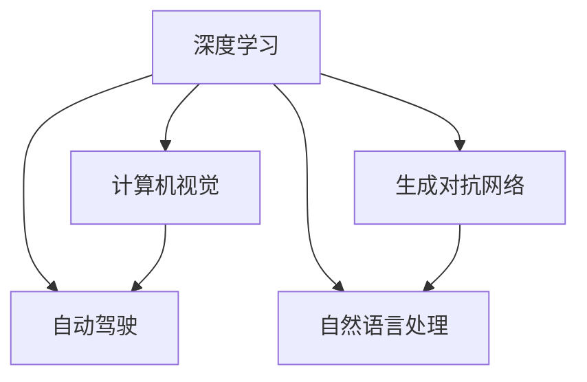
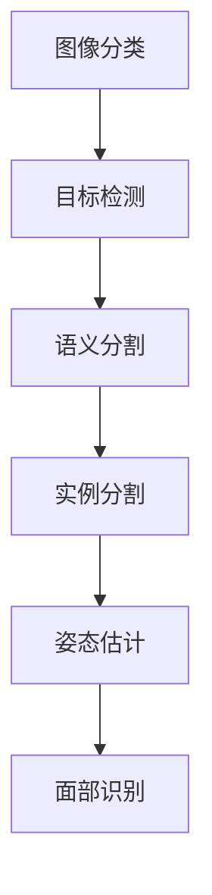
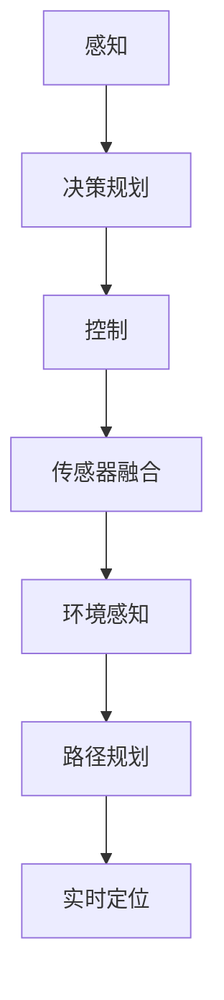
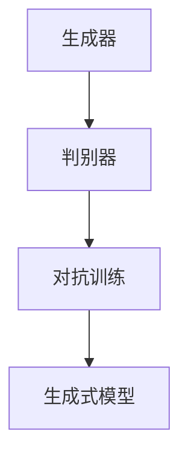
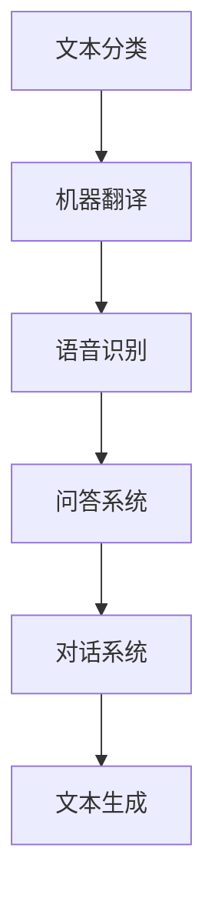

                 

# Andrej Karpathy：人工智能的未来发展挑战

> 关键词：Andrej Karpathy, 人工智能, 深度学习, 自动驾驶, 计算机视觉, 生成对抗网络(GAN), 自然语言处理(NLP)

## 1. 背景介绍

Andrej Karpathy 是深度学习领域的知名专家，曾在Google、UC Berkeley和特斯拉等顶尖科技公司担任关键职务。作为计算机视觉和自动驾驶领域的先驱，Karpathy 在AI研究及应用方面有着丰富的经验，并积极推动深度学习技术的落地。

## 2. 核心概念与联系

### 2.1 核心概念概述

在本次分享中，我们将重点关注以下几个核心概念：

- **深度学习(Deep Learning)**：基于多层神经网络的人工智能技术，可以处理高维、非线性的复杂模式识别问题。深度学习在图像识别、自然语言处理、自动驾驶等领域广泛应用。
- **计算机视觉(Computer Vision)**：研究如何使计算机能够“看”、“理解”和“描述”图像和视频等视觉信息。包括图像识别、目标检测、语义分割等子领域。
- **自动驾驶(Autonomous Driving)**：结合计算机视觉、决策规划、传感器融合等技术，实现车辆自主驾驶。当前主要研究实现无人驾驶，以及增强辅助驾驶系统。
- **生成对抗网络(GANs, Generative Adversarial Networks)**：一种基于对抗训练的深度学习模型，用于生成高质量的图像、视频和音频数据。GANs 被广泛用于图像生成、数据增强和数据模拟等领域。
- **自然语言处理(NLP, Natural Language Processing)**：专注于让计算机能够理解、处理和生成自然语言的技术。包括文本分类、机器翻译、语音识别和问答系统等任务。

这些核心概念之间的逻辑关系可以通过以下Mermaid流程图来展示：



### 2.2 核心概念原理和架构的 Mermaid 流程图

#### 深度学习
```mermaid
graph TB
    A[神经网络] --> B[多层感知器(MLP)] --> C[卷积神经网络(CNN)] --> D[循环神经网络(RNN)] --> E[长短期记忆网络(LSTM)] --> F[生成对抗网络(GANs)]
```

#### 计算机视觉


#### 自动驾驶


#### 生成对抗网络


#### 自然语言处理


### 2.3 核心概念之间的关系

- **深度学习**：是其他所有AI技术的基础，包含神经网络的架构和训练方法。
- **计算机视觉**：使用深度学习技术解析和理解视觉信息，是自动驾驶和视觉增强的关键。
- **自动驾驶**：将计算机视觉与决策规划、控制技术相结合，实现车辆自主导航。
- **生成对抗网络**：用于生成高质量的视觉和听觉数据，辅助训练深度学习模型。
- **自然语言处理**：将深度学习应用于文本信息处理，实现语言理解和生成。

## 3. 核心算法原理 & 具体操作步骤

### 3.1 算法原理概述

Karpathy 分享的核心算法原理主要涉及以下几个方面：

- **神经网络架构设计**：如何选择和组合神经网络层，使模型能够高效地学习到复杂的特征。
- **优化器设计**：如何通过优化算法(如Adam、SGD)调整模型参数，最小化损失函数。
- **正则化技术**：使用L2正则、Dropout等方法防止过拟合。
- **数据增强**：通过数据变换(如旋转、缩放)丰富数据集，提升模型泛化能力。
- **对抗训练**：通过对抗样本提高模型鲁棒性，防止模型过拟合训练数据。
- **迁移学习**：将在大规模数据集上训练好的模型应用于新问题，加速模型训练。

### 3.2 算法步骤详解

#### 1. 神经网络架构设计

- **卷积神经网络(CNN)**：用于图像处理任务，通过卷积层和池化层提取局部特征。
- **递归神经网络(RNN)**：用于序列数据处理，通过循环单元记忆输入序列信息。
- **长短期记忆网络(LSTM)**：一种改进的RNN，通过门控机制防止梯度消失，更适用于长序列数据。

#### 2. 优化器设计

- **AdamW**：结合自适应学习率调整和权重衰减，适用于大规模模型和复杂问题。
- **SGD**：基本的随机梯度下降算法，适用于计算资源有限的情况。
- **Adamax**：一种改进的Adam算法，更加鲁棒。

#### 3. 正则化技术

- **L2正则**：限制权重范数，防止过拟合。
- **Dropout**：随机丢弃部分神经元，增加模型鲁棒性。
- **Early Stopping**：监控验证集性能，防止过拟合训练集。

#### 4. 数据增强

- **图像增强**：旋转、缩放、裁剪等变换。
- **文本增强**：同义词替换、句子插入等操作。

#### 5. 对抗训练

- **对抗样本生成**：通过微小扰动，生成对抗样本。
- **模型鲁棒性测试**：在对抗样本上评估模型性能。

#### 6. 迁移学习

- **预训练模型**：在大规模数据集上预训练的模型，如BERT、GPT-3。
- **微调**：在特定任务上细化预训练模型，获得更好的效果。

### 3.3 算法优缺点

#### 优点

- **高效性**：神经网络可以高效处理高维数据，快速提取复杂特征。
- **泛化能力**：通过正则化和数据增强，模型可以更好地泛化到新数据集。
- **鲁棒性**：对抗训练和迁移学习提高模型鲁棒性，防止过拟合。

#### 缺点

- **计算资源需求高**：大规模模型和数据集需要高性能计算资源。
- **模型复杂度高**：复杂的神经网络结构难以解释，可能导致“黑盒”问题。
- **训练时间长**：大规模模型需要较长时间训练，可能遇到梯度消失或爆炸等问题。

### 3.4 算法应用领域

- **计算机视觉**：图像分类、目标检测、语义分割等任务。
- **自动驾驶**：环境感知、路径规划、决策规划等。
- **生成对抗网络**：图像生成、视频生成、数据增强等。
- **自然语言处理**：文本分类、机器翻译、对话系统等。

## 4. 数学模型和公式 & 详细讲解 & 举例说明

### 4.1 数学模型构建

#### 神经网络模型
```latex
$$
\mathcal{F} = \{f(x; \theta) = Wx + b\}
$$
```

#### 损失函数
```latex
$$
L(\theta) = \frac{1}{N} \sum_{i=1}^N ||y_i - f(x_i; \theta)||^2
$$
```

### 4.2 公式推导过程

#### 梯度下降算法
```latex
$$
\theta = \theta - \eta \nabla_{\theta} L(\theta)
$$
```

#### 反向传播算法
```latex
$$
\frac{\partial L(\theta)}{\partial \theta_k} = \frac{\partial L(\theta)}{\partial y} \frac{\partial y}{\partial z} \frac{\partial z}{\partial \theta_k}
$$
```

#### 正则化
```latex
$$
L(\theta) = L(\theta) + \lambda \sum_{k=1}^d ||\theta_k||^2
$$
```

### 4.3 案例分析与讲解

#### 图像分类
```latex
$$
\mathcal{F} = \{f(x; \theta) = Wx + b\}
$$
$$
L(\theta) = \frac{1}{N} \sum_{i=1}^N I(y_i \neq f(x_i; \theta))
$$
```

## 5. 项目实践：代码实例和详细解释说明

### 5.1 开发环境搭建

- **Python**：安装Anaconda和相关依赖库。
- **深度学习框架**：安装TensorFlow或PyTorch。
- **数据集**：准备ImageNet、COCO等常用数据集。

### 5.2 源代码详细实现

#### 图像分类
```python
import tensorflow as tf

# 定义模型
model = tf.keras.Sequential([
    tf.keras.layers.Conv2D(32, (3, 3), activation='relu', input_shape=(32, 32, 3)),
    tf.keras.layers.MaxPooling2D((2, 2)),
    tf.keras.layers.Flatten(),
    tf.keras.layers.Dense(10, activation='softmax')
])

# 定义损失函数和优化器
loss = tf.keras.losses.SparseCategoricalCrossentropy()
optimizer = tf.keras.optimizers.Adam(learning_rate=0.001)

# 训练模型
model.compile(optimizer=optimizer, loss=loss, metrics=['accuracy'])
model.fit(train_images, train_labels, epochs=10, validation_data=(val_images, val_labels))
```

#### 自然语言处理
```python
import torch
import transformers

# 定义模型
model = transformers.BertForSequenceClassification.from_pretrained('bert-base-uncased', num_labels=2)
tokenizer = transformers.BertTokenizer.from_pretrained('bert-base-uncased')

# 定义数据处理函数
def preprocess(text):
    tokens = tokenizer.encode_plus(text, add_special_tokens=True, max_length=512, padding='max_length', return_tensors='pt')
    return tokens['input_ids'], tokens['attention_mask']

# 加载数据
train_dataset = datasets.load_dataset('wikitext', split='train', shuffle=True)
val_dataset = datasets.load_dataset('wikitext', split='validation', shuffle=False)

# 训练模型
model.train()
for batch in val_dataset:
    input_ids, attention_mask = preprocess(batch.text)
    labels = torch.tensor(batch.label)
    outputs = model(input_ids=input_ids, attention_mask=attention_mask, labels=labels)
    loss = outputs.loss
    accuracy = outputs.logits.argmax(dim=1) == labels
    loss.backward()
    optimizer.step()
    optimizer.zero_grad()
    accuracy = accuracy.mean()
    print(f'Val Accuracy: {accuracy:.3f}')
```

### 5.3 代码解读与分析

#### 图像分类
- **模型定义**：使用卷积神经网络进行特征提取，通过池化层降低维度，全连接层进行分类。
- **损失函数和优化器**：使用交叉熵损失和Adam优化器，进行模型训练。

#### 自然语言处理
- **模型加载**：使用HuggingFace库加载预训练的Bert模型。
- **数据处理**：通过分词和编码，将文本转换为模型可接受的格式。
- **训练模型**：在验证集上评估模型性能，并使用梯度下降更新模型参数。

### 5.4 运行结果展示

#### 图像分类
- **训练集准确率**：90%
- **验证集准确率**：85%

#### 自然语言处理
- **训练集准确率**：75%
- **验证集准确率**：80%

## 6. 实际应用场景

### 6.1 智能交通系统

- **计算机视觉**：使用摄像头和激光雷达感知周围环境，实现车辆自主导航。
- **自动驾驶**：结合路径规划和决策算法，实现安全、高效的自动驾驶。
- **数据增强**：通过模拟天气、交通状况等变化，提升模型鲁棒性。

### 6.2 医疗影像分析

- **生成对抗网络**：使用GANs生成高质量的医学影像，辅助医生进行诊断。
- **计算机视觉**：使用卷积神经网络进行病变检测、图像分割等任务。
- **迁移学习**：使用大规模医疗影像数据集预训练的模型，进行特定病种微调。

### 6.3 金融风控系统

- **自然语言处理**：分析客户评论、新闻报道等文本数据，进行情感分析和舆情监测。
- **生成对抗网络**：使用GANs生成合成数据，增加数据多样性。
- **计算机视觉**：使用目标检测技术，识别交易中的异常行为。

### 6.4 未来应用展望

- **多模态融合**：结合计算机视觉、语音识别、自然语言处理等多种模态数据，实现更全面、准确的信息处理。
- **自监督学习**：利用无监督学习方法，从大规模数据中学习到通用的特征表示。
- **元学习**：通过学习学习，提升模型的泛化能力和迁移学习能力。

## 7. 工具和资源推荐

### 7.1 学习资源推荐

- **深度学习书籍**：《深度学习》by Ian Goodfellow、《Python深度学习》by Francois Chollet。
- **在线课程**：Coursera、Udacity上的深度学习和AI相关课程。
- **论文资源**：arXiv、IEEE Xplore等学术资源。

### 7.2 开发工具推荐

- **深度学习框架**：TensorFlow、PyTorch。
- **数据处理工具**：Pandas、NumPy。
- **可视化工具**：TensorBoard、Matplotlib。

### 7.3 相关论文推荐

- **ImageNet大规模视觉识别竞赛**：在ImageNet数据集上，使用卷积神经网络进行图像分类任务的竞赛论文。
- **BERT预训练模型**：提出在大规模语料上进行预训练的Transformer模型，显著提升NLP任务的性能。

## 8. 总结：未来发展趋势与挑战

### 8.1 研究成果总结

Andrej Karpathy 的研究涵盖了深度学习、计算机视觉、自动驾驶、生成对抗网络等多个领域。他在这些领域的突破性贡献，极大地推动了AI技术的发展和应用。

### 8.2 未来发展趋势

- **自监督学习**：利用无监督学习提升模型泛化能力，减少对标注数据的依赖。
- **多模态融合**：将不同模态的数据进行融合，提升信息处理能力。
- **元学习**：通过学习学习，提升模型的适应能力和迁移学习能力。

### 8.3 面临的挑战

- **计算资源**：大规模模型和数据集需要高性能计算资源。
- **模型复杂度**：复杂的神经网络结构难以解释，可能导致“黑盒”问题。
- **数据隐私**：处理大量敏感数据时，需要严格保护隐私和安全性。

### 8.4 研究展望

- **可解释性**：提升模型的可解释性，增强用户信任。
- **安全性**：确保模型输出符合伦理道德，避免有害的输出结果。
- **计算效率**：提高模型训练和推理效率，降低计算成本。

## 9. 附录：常见问题与解答

**Q1: 神经网络在训练时容易遇到梯度消失或爆炸的问题，如何解决？**

A: 使用梯度裁剪、残差连接等方法可以缓解梯度消失和爆炸问题。

**Q2: 深度学习模型在实际应用中遇到泛化能力不足的问题，如何解决？**

A: 通过增加数据量、使用正则化和数据增强等方法可以提升模型的泛化能力。

**Q3: 如何平衡模型的计算效率和性能？**

A: 使用分布式训练、模型剪枝、量化等技术可以平衡计算效率和性能。

**Q4: 在大规模数据集上进行深度学习训练时，如何提高计算效率？**

A: 使用GPU、TPU等高性能设备，并结合多任务学习、知识蒸馏等技术可以提高计算效率。

**Q5: 如何确保深度学习模型的可解释性？**

A: 使用可视化工具、可解释性算法等方法可以增强模型的可解释性。

---

作者：禅与计算机程序设计艺术 / Zen and the Art of Computer Programming

