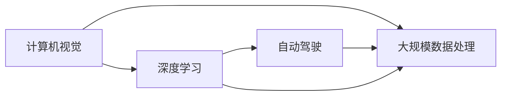

                 

# Andrej Karpathy：人工智能的未来发展挑战

## 1. 背景介绍

### 1.1 问题由来

Andrej Karpathy，作为深度学习领域的知名专家，以其在计算机视觉和自动驾驶技术方面的卓越贡献而闻名。然而，在未来的发展过程中，人工智能技术面临着诸多挑战，需要在算力、数据、安全、伦理等方面取得突破。

### 1.2 问题核心关键点

- 算力需求激增：人工智能模型在处理大规模数据时，需要强大的计算资源支撑，未来需要更加高效、更加经济的数据中心和计算平台。
- 数据隐私与安全：数据是人工智能模型的核心，如何保护用户隐私，防止数据滥用，是亟需解决的重要问题。
- 模型鲁棒性与泛化能力：在现实环境中，模型需要应对各种复杂、变化的情况，如何在不同场景下保持稳定性和泛化能力，需要进一步研究和优化。
- 算法透明性与可解释性：人工智能模型的决策过程往往复杂难以理解，如何提高模型的透明度和可解释性，是构建可信模型的重要条件。
- 伦理与社会影响：人工智能的广泛应用带来伦理道德挑战，如自动化就业、决策透明度、算法偏见等，需要在技术上和社会政策上进行平衡。

这些问题不仅是学术研究的热点，也决定了人工智能技术的发展方向和社会应用的影响。本文将深入探讨Andrej Karpathy的观点，并结合具体案例，探讨人工智能未来面临的挑战和应对策略。

## 2. 核心概念与联系

### 2.1 核心概念概述

Andrej Karpathy的研究工作涉及计算机视觉、深度学习、自动驾驶等多个领域，其提出的算法和技术被广泛应用。

- **计算机视觉**：通过分析和学习图像和视频数据，使计算机具备“看”和“理解”图像的能力。
- **深度学习**：一种基于神经网络的技术，通过大量数据训练模型，使其具备自主学习和决策能力。
- **自动驾驶**：通过计算机视觉和深度学习技术，使汽车能够自动感知环境，进行导航和决策。
- **大规模数据处理**：利用并行计算和分布式系统，高效处理和分析大规模数据。

这些概念之间有着紧密的联系，相互促进和补充，共同推动人工智能技术的进步。

### 2.2 核心概念原理和架构的 Mermaid 流程图



从上述流程图可以看出，计算机视觉和深度学习是自动驾驶的核心技术，而大规模数据处理则是支撑这些技术的基础设施。

## 3. 核心算法原理 & 具体操作步骤

### 3.1 算法原理概述

人工智能的核心算法是深度学习，通过多层次的非线性变换，使模型能够从数据中提取特征并进行预测。其主要步骤如下：

1. **数据预处理**：对原始数据进行清洗、归一化、增强等预处理，以提高模型的训练效果。
2. **模型训练**：使用反向传播算法，通过梯度下降等优化方法，更新模型参数以最小化损失函数。
3. **模型评估**：在测试集上评估模型的性能，如准确率、召回率、F1分数等。
4. **模型部署**：将训练好的模型部署到实际应用中，进行推理预测。

### 3.2 算法步骤详解

以Andrej Karpathy在计算机视觉领域的深度学习模型为例，其具体操作步骤如下：

1. **数据集准备**：收集大量标注图像数据，如ImageNet等。
2. **模型选择**：选择适合的卷积神经网络(CNN)或残差网络(ResNet)作为基础架构。
3. **参数初始化**：随机初始化模型参数。
4. **前向传播**：将输入图像通过网络层进行处理，输出预测结果。
5. **损失计算**：根据真实标签与预测结果计算损失。
6. **反向传播**：反向传播误差，更新模型参数。
7. **迭代训练**：重复前向传播和反向传播，直到收敛。
8. **模型评估**：在测试集上评估模型性能。
9. **模型优化**：根据评估结果进行参数调整，提升模型效果。
10. **模型部署**：将优化后的模型部署到实际应用中，如自动驾驶车辆。

### 3.3 算法优缺点

**优点**：

- 精度高：深度学习模型在图像识别、语音识别等任务上表现优异。
- 灵活性高：模型结构可以根据任务进行调整和优化。
- 泛化能力强：深度学习模型能够在不同数据集和场景下保持较高的性能。

**缺点**：

- 数据需求大：需要大量标注数据进行训练，数据采集成本高。
- 计算量大：深度学习模型参数量大，训练和推理耗时多。
- 过拟合风险高：模型容易过拟合，需要进行正则化和模型集成等技术手段。
- 可解释性差：深度学习模型通常被视为"黑盒"，难以解释其决策过程。

### 3.4 算法应用领域

Andrej Karpathy的研究成果在计算机视觉、自动驾驶等领域得到了广泛应用：

- **计算机视觉**：在图像识别、目标检测、语义分割等任务中，深度学习模型取得了显著成果。
- **自动驾驶**：深度学习模型被广泛应用于自动驾驶车辆，进行环境感知、路径规划、行为决策等。
- **游戏AI**：深度学习模型在电子游戏中实现自动控制和智能决策，如AlphaGo等。
- **医疗影像分析**：深度学习模型对医学影像进行自动分析和诊断，如肺部X光片分析。

这些应用展示了深度学习模型的广泛应用前景和巨大潜力。

## 4. 数学模型和公式 & 详细讲解 & 举例说明

### 4.1 数学模型构建

深度学习模型的核心数学模型是神经网络，其中卷积神经网络(CNN)和循环神经网络(RNN)是主流架构。

- **卷积神经网络**：通过卷积层和池化层提取特征，使用全连接层进行分类或回归。
- **循环神经网络**：使用循环层处理序列数据，适用于时间序列预测和语言模型。

### 4.2 公式推导过程

以卷积神经网络为例，其前向传播过程可以表示为：

$$
y = W_1x + b_1 \quad \text{卷积层} \\
y = W_2y + b_2 \quad \text{全连接层} \\
y = softmax(y) \quad \text{输出层}
$$

其中，$x$为输入特征，$y$为输出结果，$W$和$b$为模型参数。

### 4.3 案例分析与讲解

以ImageNet大规模视觉识别挑战为例，Andrej Karpathy等人提出的ResNet模型，通过残差连接和批量归一化技术，解决了深度网络训练过程中的梯度消失问题，取得了显著的性能提升。

## 5. 项目实践：代码实例和详细解释说明

### 5.1 开发环境搭建

Andrej Karpathy的研究工作主要使用PyTorch和TensorFlow等深度学习框架，以下是其环境搭建流程：

1. **安装PyTorch和TensorFlow**：
```bash
pip install torch torchvision torchtext
pip install tensorflow
```

2. **设置数据集**：
```bash
mkdir data
cd data
wget https://www.image-net.org/download-images
```

3. **编写代码**：使用PyTorch框架编写模型和训练脚本，如：

```python
import torch
import torch.nn as nn
import torch.optim as optim

class ResNet(nn.Module):
    def __init__(self):
        super(ResNet, self).__init__()
        # 定义网络结构

    def forward(self, x):
        # 前向传播

    def train(self, train_loader, num_epochs):
        # 训练过程

    def test(self, test_loader):
        # 测试过程

# 定义数据加载器
train_loader = torch.utils.data.DataLoader(train_dataset, batch_size=64, shuffle=True)
test_loader = torch.utils.data.DataLoader(test_dataset, batch_size=64)

# 定义模型和优化器
model = ResNet()
optimizer = optim.SGD(model.parameters(), lr=0.1, momentum=0.9)
```

### 5.2 源代码详细实现

以上代码实现了卷积神经网络的定义、训练和测试过程。其中，ResNet模型通过多个卷积层和全连接层构建，使用SGD优化器进行训练。

### 5.3 代码解读与分析

代码中，`ResNet`类继承自`nn.Module`，定义了模型的前向传播、训练和测试方法。训练过程使用了随机梯度下降(SGD)优化器，并设置了学习率和动量参数。

## 6. 实际应用场景

### 6.1 计算机视觉

Andrej Karpathy的计算机视觉技术广泛应用于图像识别、目标检测、语义分割等任务中。例如，在自动驾驶中，深度学习模型被用于环境感知、车道线检测和障碍物识别，显著提升了驾驶安全性。

### 6.2 自动驾驶

Andrej Karpathy在自动驾驶领域的研究成果包括，使用深度学习模型进行环境感知和路径规划，实现自动驾驶汽车在复杂交通环境中的安全行驶。其技术被广泛应用于特斯拉等公司的自动驾驶系统中。

### 6.3 游戏AI

在电子游戏中，Andrej Karpathy等人开发的AlphaGo模型，使用深度学习技术进行游戏策略分析，实现了人工智能在围棋、星际争霸等游戏中的高水平表现。

### 6.4 未来应用展望

未来，Andrej Karpathy的研究将进一步推动人工智能在医疗、金融、教育等领域的应用：

- **医疗影像分析**：利用深度学习模型对医学影像进行自动分析和诊断，提升医疗效率和准确性。
- **金融预测**：使用深度学习模型进行股票预测、风险评估等金融任务，提升金融决策的科学性和可靠性。
- **教育个性化**：开发智能教育系统，根据学生的学习行为和反馈进行个性化推荐，提高教学效果。

## 7. 工具和资源推荐

### 7.1 学习资源推荐

- **在线课程**：Coursera、edX等平台的深度学习课程，如“Deep Learning Specialization”系列。
- **书籍**：《Deep Learning》、《Pattern Recognition and Machine Learning》等经典教材。
- **论文**：arXiv等平台上的最新研究论文，如Andrej Karpathy的研究论文。

### 7.2 开发工具推荐

- **深度学习框架**：PyTorch、TensorFlow、Keras等框架，支持深度学习模型的训练和推理。
- **数据处理工具**：Pandas、NumPy等库，用于数据预处理和分析。
- **可视化工具**：TensorBoard、PyTorch Visualizer等，用于模型训练和结果可视化。

### 7.3 相关论文推荐

- **ResNet**：He, K., Zhang, X., Ren, S., & Sun, J. (2016). Deep residual learning for image recognition. arXiv preprint arXiv:1512.03385.
- **AlphaGo**：Silver, D., Schrittwieser, J., Simonyan, K., Antonoglou, I., Huang, A., Guez, A., ... & Hassib, M. (2018). Mastering the game of Go without human knowledge. Nature, 550(7676), 354-359.
- **自动驾驶**：Bojarski, M., Del Testa, D., Geng, R., Andrew, A., & Thomas, A. (2016). End to end learning for self-driving cars. arXiv preprint arXiv:1604.07880.

## 8. 总结：未来发展趋势与挑战

### 8.1 研究成果总结

Andrej Karpathy的研究成果涵盖了深度学习、计算机视觉和自动驾驶等多个领域，推动了人工智能技术的发展和应用。其技术不仅在学术界获得高度认可，还在工业界广泛应用，取得了显著的经济和社会效益。

### 8.2 未来发展趋势

未来，人工智能技术将在以下几个方面取得新的突破：

- **多模态学习**：融合视觉、听觉、文本等多模态信息，实现更加全面和准确的认知能力。
- **联邦学习**：在保护隐私的前提下，多个设备或机构联合训练模型，提升模型的泛化能力。
- **边缘计算**：将计算任务分布到边缘设备，减少数据传输和计算负担，提升系统的实时性和可靠性。
- **强化学习**：结合环境反馈，进行动态决策和优化，提升系统的自主性和智能化水平。

### 8.3 面临的挑战

尽管人工智能技术取得了巨大进展，但仍面临以下挑战：

- **算力与能效**：如何高效利用计算资源，降低能源消耗，是未来技术突破的重要方向。
- **数据隐私与安全**：如何在数据共享和使用中保护用户隐私，防止数据滥用，需要更加完善的安全机制。
- **模型透明性与可解释性**：如何提高模型的透明度和可解释性，确保其决策过程符合人类价值观和伦理道德。
- **算法偏见与公平性**：如何减少算法偏见，确保不同群体和地域的公平性，需要更多的研究和实践。
- **人机交互**：如何设计更加自然和高效的人机交互界面，提升用户体验和系统友好性。

### 8.4 研究展望

未来的研究需要在技术和社会层面进行协同创新，共同推动人工智能技术的健康发展。

- **技术层面**：加强基础研究，提升模型的性能和泛化能力，探索新的算法和架构。
- **社会层面**：制定合理的政策和规范，确保人工智能技术的安全和公平，提升公众信任。
- **应用层面**：推动人工智能技术的落地应用，促进经济和社会发展，解决现实问题。

## 9. 附录：常见问题与解答

**Q1：深度学习模型如何处理大规模数据？**

A: 深度学习模型通常采用数据增强、分布式训练等技术处理大规模数据。数据增强包括旋转、缩放、翻转等操作，扩充训练数据集。分布式训练则通过多台计算机并行处理，提升训练效率。

**Q2：深度学习模型的训练过程需要多长时间？**

A: 深度学习模型的训练时间取决于数据集大小、模型复杂度和硬件配置。通常，大型模型的训练时间在几个小时到几天不等。

**Q3：深度学习模型是否存在过拟合问题？**

A: 深度学习模型存在过拟合风险，需要通过正则化、Dropout等技术进行缓解。同时，使用批量归一化、梯度累积等技术提升模型的泛化能力。

**Q4：如何提高深度学习模型的可解释性？**

A: 提高深度学习模型的可解释性需要从多个角度入手，如可视化技术、简化模型结构、使用可解释性模型等。同时，引入专家知识，结合人工智能技术，提升模型的透明性和可解释性。

**Q5：如何确保深度学习模型的公平性？**

A: 确保深度学习模型的公平性需要从数据、算法和应用三个层面进行优化。例如，使用公平性约束、删除偏见数据、调整模型参数等，提升模型的公平性和公正性。

---

作者：禅与计算机程序设计艺术 / Zen and the Art of Computer Programming

