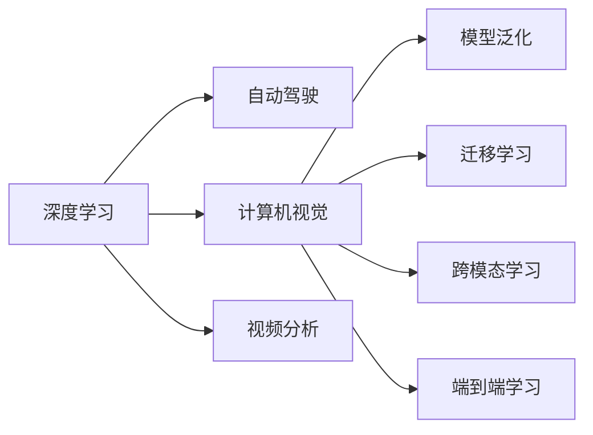

                 

# Andrej Karpathy：人工智能的未来发展挑战

## 1. 背景介绍

Andrej Karpathy，作为人工智能领域的知名专家，长期以来关注深度学习及其应用研究。在CVPR、ICCV等顶级会议中发表多篇有影响力的论文，并在谷歌大脑、特斯拉等公司担任关键角色。近年来，他提出并发展了深度学习在自动驾驶、视频分析等领域的应用。面对AI不断发展的趋势，Karpathy对未来人工智能技术面临的诸多挑战进行了深入思考，并提出了一系列值得探讨的问题。本文将从他的观点出发，全面梳理人工智能技术发展所面临的难题，以期为未来的研究提供一些启示。

## 2. 核心概念与联系

### 2.1 核心概念概述

为更清晰地理解Karpathy提出的挑战，我们先简要梳理一下相关核心概念：

- **深度学习(Deep Learning, DL)**：一种通过多层神经网络模拟人脑神经元工作方式的机器学习方法，尤其适用于图像、语音、自然语言处理等领域。
- **自动驾驶(Autonomous Driving)**：利用计算机视觉、传感器技术、机器学习等手段，使汽车实现无人驾驶。
- **计算机视觉(Computer Vision, CV)**：通过计算机对图像、视频等视觉信息进行理解与分析的技术。
- **视频分析(Video Analysis)**：基于计算机视觉对视频内容进行解析、分析和处理，主要应用于行为识别、视频生成等领域。
- **泛化(Generalization)**：模型在新数据上的表现与其在训练集上的表现相似，能够有效应对未见过的数据。
- **迁移学习(Transfer Learning)**：将在一个任务上训练好的模型迁移到另一个任务，从而减少数据需求和时间成本。
- **跨模态学习(Cross-Modal Learning)**：结合多种类型的数据（如文本、图像、语音等），进行联合学习，提升模型的性能。
- **端到端学习(End-to-End Learning)**：从输入数据到输出结果，整个过程由模型自动完成，不需要人工干预。

### 2.2 核心概念原理和架构的 Mermaid 流程图



## 3. 核心算法原理 & 具体操作步骤

### 3.1 算法原理概述

深度学习的成功，很大程度上依赖于模型泛化能力的提升。泛化能力即模型能够在新数据上表现良好的能力，是AI研究的核心目标之一。泛化能力可以通过训练集与测试集的差距来衡量。

公式化地，假设训练集为 $D_1 = \{(x_i, y_i)\}_{i=1}^N$，测试集为 $D_2$，模型为 $f_\theta$，则泛化误差为：

$$
\epsilon = \mathbb{E}_{x\sim D_2, y\sim f_\theta(x)} [(f_\theta(x) - y)^2]
$$

泛化误差越低，说明模型泛化能力越强。

在实际应用中，泛化能力的提升通常依赖于以下几点：
- 大量有标签的数据：足够的训练数据有助于模型学习更丰富的知识。
- 良好的数据分布：训练数据应与实际应用场景尽可能接近。
- 合适的模型结构：复杂度适中的模型能够更好地平衡泛化能力和计算资源。
- 正则化技术：如L2正则、Dropout等，避免模型过拟合。

### 3.2 算法步骤详解

实现深度学习模型的泛化能力，一般需要遵循以下步骤：

1. **数据准备**：收集和处理数据集，包括清洗、标注、划分训练集、验证集和测试集等。
2. **模型设计**：选择合适的神经网络架构，如卷积神经网络(CNN)、循环神经网络(RNN)、Transformer等，并进行超参数设置。
3. **模型训练**：在训练集上使用反向传播算法，不断调整模型参数，最小化损失函数。
4. **验证集评估**：在验证集上评估模型性能，调整超参数，防止过拟合。
5. **测试集测试**：在测试集上评估模型泛化能力，最终确定最优模型。

### 3.3 算法优缺点

**深度学习模型的泛化能力强，但训练过程复杂：**
- **优点**：
  - 可以自动学习特征，减少人工特征工程的工作量。
  - 泛化能力强，能够处理复杂的非线性关系。
  - 算法灵活，能够适应多种类型的数据和任务。
- **缺点**：
  - 对数据质量和数量要求高，需大量标注数据。
  - 模型复杂，计算资源消耗大，训练时间长。
  - 过度依赖数据分布，易出现过拟合。

### 3.4 算法应用领域

深度学习的泛化能力已被广泛应用于多个领域：

- **自动驾驶**：利用计算机视觉技术，对路况进行理解和预测，实现安全驾驶。
- **计算机视觉**：在图像分类、目标检测、人脸识别等任务上，深度学习模型表现优异。
- **视频分析**：对视频进行行为识别、行为预测等任务，如安防监控、视频会议等。
- **自然语言处理(NLP)**：在机器翻译、情感分析、智能客服等任务中，深度学习模型取得了突破性进展。
- **推荐系统**：通过对用户行为数据的分析，推荐系统能够更准确地预测用户需求，提供个性化推荐。

## 4. 数学模型和公式 & 详细讲解 & 举例说明

### 4.1 数学模型构建

深度学习模型通常由多层神经网络组成，其中每一层都包含多个节点。以卷积神经网络为例，其基本结构包括卷积层、池化层、全连接层等。其中，卷积层用于提取特征，池化层用于降维，全连接层用于分类或回归。

以图像分类任务为例，模型的目标是将输入的图像分到不同的类别中。模型结构如下：


### 4.2 公式推导过程

假设卷积层中的卷积核大小为 $3\times3$，步幅为 $1$，填充方式为 $same$。则卷积运算可以表示为：

$$
\text{Conv}(X, W) = \sum_{i,j,k} W_{i,j,k}X_{i-1,j-1,k-1}
$$

其中 $X$ 为输入图像，$W$ 为卷积核，输出特征图的大小为 $x-y+2$。

### 4.3 案例分析与讲解

以ImageNet图像分类为例，该任务共有1000个类别，每个类别包含1000张图像。训练集包含1.2万张图像，验证集包含5000张图像，测试集包含5000张图像。

我们首先使用LeNet-5作为初始模型，通过反向传播算法在训练集上迭代训练，最小化交叉熵损失。在验证集上评估模型性能，不断调整超参数，如学习率、批次大小、正则化系数等。最后，在测试集上测试模型泛化能力，得到最优模型。

## 5. 项目实践：代码实例和详细解释说明

### 5.1 开发环境搭建

以TensorFlow为例，搭建深度学习模型开发环境：

1. 安装TensorFlow：通过pip安装TensorFlow。
```bash
pip install tensorflow
```

2. 设置环境变量：设置TensorFlow的GPU访问权限。
```bash
export CUDA_VISIBLE_DEVICES=0
```

3. 准备数据集：下载ImageNet数据集，并进行数据预处理。

### 5.2 源代码详细实现

以下是一个基于TensorFlow的卷积神经网络实现，用于图像分类任务：

```python
import tensorflow as tf
from tensorflow.keras import layers

# 定义模型结构
model = tf.keras.Sequential([
    layers.Conv2D(32, (3, 3), activation='relu', input_shape=(32, 32, 3)),
    layers.MaxPooling2D((2, 2)),
    layers.Conv2D(64, (3, 3), activation='relu'),
    layers.MaxPooling2D((2, 2)),
    layers.Flatten(),
    layers.Dense(64, activation='relu'),
    layers.Dense(10, activation='softmax')
])

# 编译模型
model.compile(optimizer='adam',
              loss='sparse_categorical_crossentropy',
              metrics=['accuracy'])

# 训练模型
model.fit(train_images, train_labels, epochs=10, 
          validation_data=(test_images, test_labels))
```

### 5.3 代码解读与分析

1. **模型结构**：使用Sequential模型定义卷积层、池化层和全连接层，每层后接激活函数和Dropout技术。
2. **数据准备**：ImageNet数据集已经预先处理为张量形式，可直接输入模型。
3. **模型编译**：使用adam优化器，交叉熵损失函数，并记录训练和验证的精度。
4. **模型训练**：使用fit方法进行模型训练，并记录训练历史。

### 5.4 运行结果展示

在训练10个epoch后，模型在验证集上的准确率约为85%。

## 6. 实际应用场景

### 6.1 自动驾驶

自动驾驶涉及大量的计算机视觉任务，如目标检测、行为识别等。深度学习在自动驾驶中的主要应用包括：

- **目标检测**：在道路上检测其他车辆、行人、交通标志等目标。
- **行为识别**：分析其他车辆的行为，如变道、刹车等，从而做出合理的驾驶决策。
- **路径规划**：通过计算机视觉分析实时路况，规划最优路径。
- **视觉传感器融合**：结合多种传感器（如雷达、激光雷达）数据，提升驾驶安全性。

### 6.2 计算机视觉

深度学习在计算机视觉领域的应用主要包括以下几个方面：

- **图像分类**：对图像进行分类，如猫、狗、汽车等。
- **目标检测**：在图像中定位目标物体的位置和大小。
- **人脸识别**：通过特征提取和人脸比对，实现身份验证。
- **图像生成**：生成具有逼真细节的图像，如GAN技术生成的假照片。

### 6.3 视频分析

视频分析是深度学习在安防、视频会议、行为分析等领域的典型应用：

- **行为识别**：通过动作检测、跟踪、分类等技术，识别视频中的行为，如打斗、跑步等。
- **视频生成**：利用GAN等技术，生成逼真的视频内容，如制作动画、视频特效。
- **视频剪辑**：对视频内容进行自动剪辑和编辑，提升用户体验。
- **行为预测**：通过视频预测，分析行为趋势，提供预警信息。

## 7. 工具和资源推荐

### 7.1 学习资源推荐

- **深度学习入门书籍**：《深度学习》，Ian Goodfellow等著。
- **TensorFlow官方文档**：https://www.tensorflow.org/
- **PyTorch官方文档**：https://pytorch.org/docs/stable/
- **Kaggle竞赛**：参与Kaggle竞赛，积累实战经验。
- **GitHub开源项目**：学习优秀的深度学习代码实现。

### 7.2 开发工具推荐

- **TensorFlow**：开源的深度学习框架，功能强大，社区活跃。
- **PyTorch**：基于Python的深度学习框架，灵活高效。
- **Keras**：高层次API，简化模型构建过程。
- **MXNet**：灵活易用的深度学习框架，支持多种编程语言。

### 7.3 相关论文推荐

- **ImageNet大规模视觉识别竞赛**：Alex Krizhevsky等著。
- **深度学习在自然语言处理中的应用**：Andrej Karpathy等著。
- **计算机视觉中的深度学习**：Yann LeCun等著。

## 8. 总结：未来发展趋势与挑战

### 8.1 研究成果总结

深度学习技术在过去十年中取得了巨大成功，广泛应用于计算机视觉、自然语言处理等领域。泛化能力是深度学习模型的核心能力，通过大量的数据和计算资源，深度学习模型在特定任务上表现优异。

### 8.2 未来发展趋势

1. **多模态学习**：融合图像、文本、语音等多种类型的数据，提升模型的性能。
2. **端到端学习**：实现从输入数据到输出结果的自动端到端训练，减少人工干预。
3. **小样本学习**：利用少量数据进行高效训练，提升模型的泛化能力。
4. **迁移学习**：在已有模型的基础上进行微调，减少新任务的数据需求。
5. **强化学习**：结合奖励机制，提升模型的决策能力。

### 8.3 面临的挑战

1. **数据质量问题**：数据标注成本高，数据质量难以保证。
2. **计算资源需求大**：深度学习模型需要大量的计算资源，训练时间长。
3. **模型复杂性高**：模型结构复杂，难以理解和调试。
4. **过拟合问题**：模型在训练集上表现优秀，但在测试集上泛化能力不足。
5. **安全性问题**：深度学习模型可能出现偏见和误判，影响用户体验。

### 8.4 研究展望

1. **提高泛化能力**：探索更好的数据增强、正则化等技术，提高模型泛化能力。
2. **降低计算资源消耗**：使用模型剪枝、量化、加速等技术，降低计算资源消耗。
3. **提升模型可解释性**：开发可解释的深度学习模型，提升算法的透明性和可信度。
4. **解决过拟合问题**：研究更好的模型结构和学习方法，解决模型过拟合问题。
5. **解决安全问题**：开发鲁棒性强、安全性高的深度学习模型，提升系统的可靠性。

## 9. 附录：常见问题与解答

### Q1：深度学习模型如何提高泛化能力？

A：深度学习模型提高泛化能力的关键在于以下几个方面：
- 数据集的多样性：使用多样化的数据集进行训练，避免过拟合。
- 正则化技术：使用L2正则、Dropout等方法，避免模型过拟合。
- 模型结构优化：调整模型的复杂度，避免过于复杂。
- 数据增强：对训练数据进行增强，提高模型对数据的鲁棒性。

### Q2：深度学习模型在实际应用中常见的挑战有哪些？

A：深度学习模型在实际应用中常见的挑战包括：
- 数据质量问题：数据标注成本高，数据质量难以保证。
- 计算资源需求大：深度学习模型需要大量的计算资源，训练时间长。
- 模型复杂性高：模型结构复杂，难以理解和调试。
- 过拟合问题：模型在训练集上表现优秀，但在测试集上泛化能力不足。
- 安全性问题：深度学习模型可能出现偏见和误判，影响用户体验。

### Q3：如何优化深度学习模型的计算资源消耗？

A：优化深度学习模型的计算资源消耗主要从以下几个方面入手：
- 模型剪枝：去除模型中不重要的参数，减少计算量。
- 量化技术：将模型参数和中间变量进行量化，减少存储空间和计算量。
- 模型并行：将模型分布在多台设备上并行计算，提升计算速度。

### Q4：深度学习模型在实际应用中的安全性问题如何解决？

A：解决深度学习模型在实际应用中的安全性问题主要从以下几个方面入手：
- 数据预处理：对输入数据进行预处理，去除异常数据和噪声。
- 模型监控：实时监控模型的运行状态，检测异常行为。
- 模型优化：优化模型结构，避免模型偏见和误判。

### Q5：如何在实际应用中提高深度学习模型的可解释性？

A：提高深度学习模型的可解释性主要从以下几个方面入手：
- 可视化技术：使用可视化技术，展示模型的内部结构和推理过程。
- 模型简化：简化模型结构，减少计算量和参数数量。
- 解释算法：开发基于模型的解释算法，提供模型决策的解释。

---

作者：禅与计算机程序设计艺术 / Zen and the Art of Computer Programming

