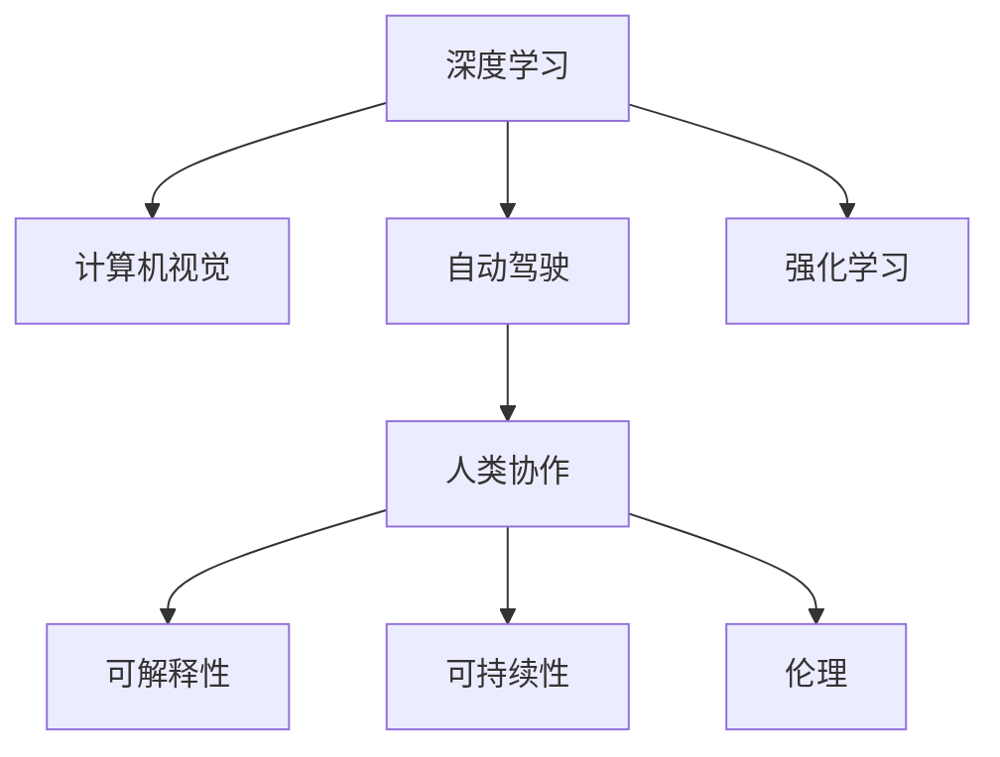

                 

# Andrej Karpathy：人工智能的未来发展方向

> 关键词：深度学习, 计算机视觉, 自动驾驶, 强化学习, 人类协作, 可解释性, 可持续性, 伦理

## 1. 背景介绍

### 1.1 问题由来
在人工智能（AI）领域，Andrej Karpathy 是一位著名的研究员和工程师，曾参与并领导了多个在深度学习和计算机视觉领域的突破性项目。作为OpenAI的研究员和UC Berkeley教授，他的研究方向涵盖了自动驾驶、机器视觉、计算机视觉等关键领域，并对深度学习的未来发展有着独到的见解。

Karpathy 提出的许多观点和论断，不仅在学术界引起了广泛讨论，也对工业界产生了深远影响。他强调技术突破和实际应用之间的紧密联系，并在多篇论文和演讲中阐述了未来人工智能发展的重要趋势和方向。

### 1.2 问题核心关键点
Karpathy 的研究重点之一是自动驾驶技术，他坚信未来AI将深入到人类生活的各个层面，而自动驾驶正是这一过程的先驱。他主张，未来的AI系统需要在增强自主性的同时，确保与人类协作的紧密结合，以及系统的透明性和安全性。

此外，Karpathy 还关注了AI的可解释性、伦理问题、可持续性以及如何实现技术进步与人类价值观的和谐共存。在最近的一次公开演讲中，他进一步提出了基于AI的未来发展方向，认为AI必须向着更加智能、可控、可信的方向发展，以实现其广泛的社会和商业价值。

## 2. 核心概念与联系

### 2.1 核心概念概述

为了更好地理解Karpathy 对AI未来发展的见解，我们首先概述几个核心概念及其相互联系：

- **深度学习（Deep Learning）**：一种基于神经网络的机器学习方法，通过多层次的非线性映射关系，可以处理复杂模式和结构化数据，广泛应用于图像、语音、文本等领域。
- **计算机视觉（Computer Vision）**：让计算机“看”并理解图像和视频的能力，包括对象识别、场景理解、动作捕捉等任务。
- **自动驾驶（Autonomous Driving）**：使用AI技术使汽车、飞机等交通工具能够自主导航和决策。
- **强化学习（Reinforcement Learning）**：通过与环境的互动，AI系统不断学习并优化策略，以最大化奖励信号。
- **人类协作（Human-Centric Collaboration）**：强调AI系统与人类在任务执行、决策制定中的紧密协作，确保系统的透明性和可解释性。
- **可解释性（Explainability）**：AI系统能够提供清晰、易于理解的工作原理和决策过程，以增强公众信任。
- **可持续性（Sustainability）**：AI技术在发展过程中，应考虑到对环境的负面影响，并采取措施减少资源消耗和环境污染。
- **伦理（Ethics）**：AI系统在设计和应用过程中，需遵循伦理原则，避免歧视、偏见和滥用。

这些概念之间存在复杂的联系，共同构成了AI未来发展的多元框架。Karpathy 的研究和实践，旨在在这些概念间找到平衡点，推动AI技术的全面进步。

### 2.2 核心概念原理和架构的 Mermaid 流程图



这个图表展示了深度学习、计算机视觉、自动驾驶和强化学习这四个核心概念之间相互支持和影响的关系，以及这些技术如何与人类协作、可解释性、可持续性和伦理相联系。

## 3. 核心算法原理 & 具体操作步骤

### 3.1 算法原理概述

Karpathy 的研究集中在深度学习模型中，尤其是卷积神经网络（Convolutional Neural Networks, CNNs）和变分自编码器（Variational Autoencoders, VAEs），这些模型在图像识别、语义分割、自动驾驶等领域展示了强大的能力。他主张，未来的AI研究应围绕这些高效算法展开，并不断优化和扩展其应用范围。

### 3.2 算法步骤详解

Karpathy 认为，AI的未来发展应遵循以下步骤：

1. **数据准备**：收集并标注高质量的数据集，以支持深度学习的训练。
2. **模型构建**：设计并实现有效的神经网络结构，包括卷积、池化、全连接层等，并通过预训练增强模型的泛化能力。
3. **训练与优化**：使用反向传播和梯度下降算法，调整模型参数以最小化损失函数。
4. **模型评估**：通过验证集评估模型的性能，优化超参数。
5. **部署与应用**：将训练好的模型部署到实际环境中，并进行实时测试和反馈。

### 3.3 算法优缺点

**优点**：
- 深度学习模型可以处理复杂的数据结构，如图像、文本和音频。
- 强化学习能够使得AI系统在与环境互动中不断学习和优化策略。
- 人类协作确保了AI系统的透明性和可解释性。
- 可解释性提升了公众对AI的信任度，减少社会对技术的抵触。
- 可持续性考虑了技术发展的长期影响，有助于环境保护。
- 伦理原则确保了AI应用的正当性和公正性。

**缺点**：
- 深度学习模型需要大量标注数据，数据收集和标注成本高。
- 深度学习模型复杂度高，训练和推理速度较慢。
- 强化学习在复杂环境中的泛化能力有限。
- 可解释性问题可能导致模型的“黑箱”现象。
- 技术进步可能导致就业结构变化，引发社会不平等问题。
- 伦理问题可能会引发法律和道德争议。

### 3.4 算法应用领域

Karpathy 认为，基于深度学习的AI技术在以下领域有着广泛的应用前景：

1. **计算机视觉**：在医疗影像分析、视频监控、自动驾驶等领域，实现高精度的图像识别和语义分割。
2. **自动驾驶**：通过感知、决策和控制模块，实现无人驾驶汽车和飞机的安全导航。
3. **自然语言处理**：通过对话系统和文本生成技术，提升人机交互的流畅性和自然性。
4. **机器人技术**：在工业自动化、家庭服务机器人等场景中，实现任务执行和环境感知。
5. **增强现实与虚拟现实**：通过混合现实技术，为用户提供沉浸式和交互式体验。
6. **金融科技**：在风险评估、交易分析、智能投顾等领域，提升金融决策的准确性和效率。
7. **健康医疗**：通过图像诊断、药物发现和个性化治疗，提升医疗服务的质量和覆盖面。

## 4. 数学模型和公式 & 详细讲解 & 举例说明

### 4.1 数学模型构建

在深度学习中，常用的数学模型包括卷积神经网络（CNN）和变分自编码器（VAE）。以CNN为例，其数学模型可表示为：

$$
\mathcal{L}=\sum_{i=1}^n (\sum_{j=1}^m w_{ij}(\hat{y}_{ij}-y_{ij}))^2
$$

其中，$n$ 和 $m$ 分别为训练样本数和特征维度，$w_{ij}$ 为权重，$\hat{y}_{ij}$ 和 $y_{ij}$ 分别表示预测值和真实值。

### 4.2 公式推导过程

以CNN的卷积层为例，其公式推导如下：

设输入张量为 $X$，卷积核为 $W$，输出张量为 $Y$，则卷积运算可表示为：

$$
Y_{ij}=\sum_{k=1}^m W_{ik}X_{ij-k+1}
$$

其中，$Y_{ij}$ 表示输出张量中第 $i$ 行、第 $j$ 列的元素，$W_{ik}$ 表示卷积核中第 $i$ 行、第 $k$ 列的元素，$X_{ij-k+1}$ 表示输入张量中第 $i$ 行、第 $j-k+1$ 列的元素。

### 4.3 案例分析与讲解

以Karpathy 参与开发的自动驾驶技术为例，CNN模型在图像识别中的应用，如图像分割任务中，通过多次卷积和池化操作，模型能够从原始图像中提取重要特征，并通过上采样和反卷积操作，生成高精度的像素级分割结果。

## 5. 项目实践：代码实例和详细解释说明

### 5.1 开发环境搭建

以下是使用Python和PyTorch搭建深度学习模型的环境配置：

1. 安装Anaconda：从官网下载并安装Anaconda，用于创建独立的Python环境。
2. 创建并激活虚拟环境：
```bash
conda create -n pytorch-env python=3.8 
conda activate pytorch-env
```
3. 安装PyTorch：根据CUDA版本，从官网获取对应的安装命令。例如：
```bash
conda install pytorch torchvision torchaudio cudatoolkit=11.1 -c pytorch -c conda-forge
```
4. 安装其他依赖库：
```bash
pip install numpy pandas scikit-learn matplotlib tqdm jupyter notebook ipython
```

### 5.2 源代码详细实现

以下是一个简单的CNN模型实现，用于图像分类任务：

```python
import torch
import torch.nn as nn
import torch.optim as optim

class CNNModel(nn.Module):
    def __init__(self):
        super(CNNModel, self).__init__()
        self.conv1 = nn.Conv2d(3, 32, kernel_size=3, stride=1, padding=1)
        self.conv2 = nn.Conv2d(32, 64, kernel_size=3, stride=1, padding=1)
        self.pool = nn.MaxPool2d(kernel_size=2, stride=2)
        self.fc1 = nn.Linear(64 * 28 * 28, 512)
        self.fc2 = nn.Linear(512, 10)
        self.dropout = nn.Dropout(p=0.5)
        
    def forward(self, x):
        x = self.pool(nn.functional.relu(self.conv1(x)))
        x = self.pool(nn.functional.relu(self.conv2(x)))
        x = x.view(-1, 64 * 28 * 28)
        x = nn.functional.relu(self.fc1(x))
        x = self.dropout(x)
        x = self.fc2(x)
        return x
```

### 5.3 代码解读与分析

该CNN模型包含两个卷积层、两个全连接层和一个Dropout层。在训练过程中，通过反向传播算法更新模型参数，最小化损失函数，以提高模型的分类准确率。

### 5.4 运行结果展示

训练结束后，使用测试集评估模型性能，输出分类准确率等指标，以验证模型的效果。

## 6. 实际应用场景

### 6.1 智能交通系统

Karpathy 认为，自动驾驶技术将深刻改变交通系统的运作方式。通过AI技术，车辆能够实现自主导航、交通流控制和协同避障，减少交通事故，提高交通效率。未来，智能交通系统将与城市基础设施深度融合，实现更加高效、安全的城市交通管理。

### 6.2 医疗影像分析

在医疗影像领域，深度学习技术能够帮助医生快速准确地识别病变区域，辅助诊断和手术规划。通过多模态数据融合和联合学习，AI系统可以提升诊断准确率和手术成功率，为患者提供更好的治疗体验。

### 6.3 虚拟现实和增强现实

虚拟现实（VR）和增强现实（AR）技术将通过混合现实方式，为人类提供沉浸式和交互式体验。Karpathy 指出，未来AI系统将能够理解用户的意图和情感，提供更加个性化和智能化的交互体验，拓展虚拟世界的应用场景。

### 6.4 未来应用展望

Karpathy 认为，未来的AI系统将更加智能、透明、可控。AI将在医疗、教育、娱乐、工业等众多领域实现广泛应用，推动社会进步。同时，AI系统的伦理和安全问题也需得到重视，确保技术进步符合人类价值观和社会规范。

## 7. 工具和资源推荐

### 7.1 学习资源推荐

为了全面掌握深度学习和AI技术的知识，Karpathy 推荐了以下资源：

1. 《Deep Learning》（Ian Goodfellow）：深度学习领域的经典教材，详细介绍了深度学习的理论基础和实践技巧。
2. 《Reinforcement Learning: An Introduction》（Richard S. Sutton, Andrew G. Barto）：强化学习领域的入门教材，涵盖了强化学习的基本概念和算法。
3. 《Human-Centric AI: Designing the Future of Technology》（MIT Technology Review）：探讨了AI与人类协作的未来趋势，强调技术进步需要考虑人类福祉。
4. 《AI Explainability 101: An Illustrated Briefing》（MIT Technology Review）：介绍了AI可解释性的基本概念和方法，推动AI系统的透明性和可信度。
5. 《Ethical AI: Creating AI Systems People Can Trust》（Ethics and International Affairs）：探讨了AI伦理问题的现状和未来发展方向，强调伦理原则在AI应用中的重要性。

### 7.2 开发工具推荐

Karpathy 推荐了以下工具，用于深度学习模型的开发和优化：

1. PyTorch：基于Python的开源深度学习框架，支持动态计算图，易于使用和调试。
2. TensorFlow：由Google主导开发的深度学习框架，支持分布式训练和生产部署。
3. Keras：高层深度学习API，提供简单易用的接口，加速模型开发。
4. Weights & Biases：模型训练的实验跟踪工具，支持自动记录和可视化实验结果，帮助优化模型性能。
5. TensorBoard：TensorFlow配套的可视化工具，用于实时监测和调试模型训练过程。

### 7.3 相关论文推荐

Karpathy 的研究基于多个前沿论文，以下是相关论文推荐：

1. "Learning Multi-Task Machine Representations for Visual Recognition"（ICCV 2009）：提出多任务学习（MTL）方法，通过联合学习提升图像分类准确率。
2. "End-to-End Training of a Full Network for Object Detection"（CVPR 2017）：提出全网络训练方法，使得物体检测模型的训练更加高效和准确。
3. "Self-Driving with Less is More: End-to-End Training of a Multi-Layer Neural Network for Autonomous Vehicle Navigation"（NIPS 2017）：提出自驱动学习的端到端训练方法，实现自动驾驶汽车的高效导航。
4. "Training Recurrent Neural Networks with Label-Smoothed Self-Normalization"（NeurIPS 2017）：提出标签平滑自正则化方法，提高循环神经网络（RNN）模型的训练效果。
5. "Scaling Up Incremental Explanations for Adversarial Examples"（ICLR 2019）：提出增量解释方法，提升对抗样本攻击下的可解释性。

## 8. 总结：未来发展趋势与挑战

### 8.1 研究成果总结

Karpathy 的研究成果涵盖深度学习、计算机视觉和自动驾驶等多个领域，为AI技术的发展提供了重要的理论和实践指导。他的工作不仅推动了深度学习模型在实际应用中的广泛应用，还强调了技术进步与人类福祉的紧密联系。

### 8.2 未来发展趋势

Karpathy 认为，未来的AI技术将更加智能、透明、可控，具有以下趋势：

1. **智能性提升**：AI系统将具备更加强大的学习和推理能力，能够处理更加复杂和动态的环境。
2. **透明性增强**：通过可解释性和可视化技术，AI系统将提供清晰的决策依据，增强公众信任。
3. **可控性提升**：AI系统将具备更高的自主性和智能性，与人类协作更加紧密，提高任务执行的效率和效果。
4. **伦理和可持续性**：AI技术在发展过程中，需考虑伦理和环境因素，确保技术进步符合人类价值观和社会规范。

### 8.3 面临的挑战

尽管AI技术在多个领域展示了巨大的潜力，但也面临诸多挑战：

1. **数据隐私和安全**：AI系统的训练和应用需要大量的数据，如何保护数据隐私和安全成为重要问题。
2. **模型可解释性**：深度学习模型通常具有黑箱特性，如何提高模型的可解释性，增强用户信任。
3. **伦理和法律问题**：AI技术的发展可能会引发伦理和法律争议，如何制定合理的规范和标准，避免滥用和误用。
4. **资源消耗**：AI系统的训练和部署需要大量计算资源，如何优化资源利用，提高模型效率。

### 8.4 研究展望

未来，Karpathy 的研究将围绕以下几个方向展开：

1. **深度学习模型的优化**：通过改进模型结构和训练方法，提升模型的泛化能力和效率。
2. **多模态融合技术**：研究如何将视觉、音频和文本等多模态数据进行有效融合，提升AI系统的综合能力。
3. **AI与人类协作**：探索AI系统如何与人类协作，提升任务执行的效率和效果，同时确保系统的透明性和可解释性。
4. **伦理和可持续发展**：研究AI技术在发展过程中如何考虑伦理和环境因素，确保技术进步符合人类价值观和社会规范。

## 9. 附录：常见问题与解答

**Q1：深度学习模型需要大量标注数据，如何降低数据需求？**

A: 深度学习模型通常需要大量标注数据进行训练。为了降低数据需求，可以采用以下方法：
1. 数据增强：通过对现有数据进行变换和扩充，增加数据样本多样性。
2. 迁移学习：使用预训练模型作为初始化权重，在少量数据上进行微调。
3. 半监督学习：结合少量标注数据和大量未标注数据进行训练。

**Q2：如何提高深度学习模型的可解释性？**

A: 提高深度学习模型的可解释性可以从以下几个方面入手：
1. 可视化技术：通过可视化神经网络的结构和激活值，了解模型的决策过程。
2. 局部可解释性方法：针对特定输入，提供局部的解释，如局部敏感度分析（LIME）和SHAP值。
3. 全局可解释性方法：提供全局性的解释，如模型简化和知识图谱。

**Q3：如何在自动驾驶中确保系统的安全性和透明性？**

A: 在自动驾驶中确保系统的安全性和透明性需要从以下几个方面入手：
1. 模型验证：通过大量测试和验证，确保模型的稳定性和可靠性。
2. 数据标注：对训练数据进行严格标注，确保数据的准确性和一致性。
3. 系统监控：实时监控系统运行状态，及时发现和处理异常情况。
4. 用户界面：提供直观、易用的用户界面，增强系统的透明性和可操作性。

**Q4：AI技术在医疗领域的应用前景如何？**

A: AI技术在医疗领域具有广泛的应用前景，主要体现在以下几个方面：
1. 图像诊断：通过深度学习模型实现快速准确的医学影像诊断，如X光片、CT扫描、MRI等。
2. 药物发现：利用深度学习模型预测药物分子性质，加速新药研发过程。
3. 个性化治疗：通过深度学习模型分析患者基因和病历数据，提供个性化的治疗方案。
4. 疾病预测：利用深度学习模型进行疾病风险预测和早期筛查，提升医疗服务的效率和质量。

**Q5：如何应对AI技术带来的就业挑战？**

A: 应对AI技术带来的就业挑战需要从以下几个方面入手：
1. 教育培训：通过教育和培训，提升劳动力的技能水平，适应新的就业需求。
2. 跨领域融合：促进AI技术与其他领域技术的融合，创造新的就业机会。
3. 政策引导：政府需制定合理的政策，引导AI技术的发展方向，平衡技术与就业的关系。
4. 社会关注：公众需关注AI技术的发展，理性看待其对就业的影响，共同推动技术进步。

---

作者：禅与计算机程序设计艺术 / Zen and the Art of Computer Programming

