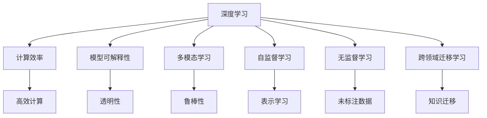

                 

# Andrej Karpathy：人工智能的未来发展方向

## 1. 背景介绍

### 1.1 问题由来
Andrej Karpathy，作为全球顶尖的人工智能专家和深度学习领域的前沿人物，他对于人工智能的发展方向有着深刻的见解。Karpathy的研究涵盖了计算机视觉、自然语言处理和自动驾驶等多个领域，其工作促进了深度学习技术的突破，引领了人工智能技术的发展方向。他的观点和理论对于未来的AI研究有着深远的影响。

### 1.2 问题核心关键点
Karpathy对于人工智能的未来发展方向主要围绕以下几个核心关键点展开：
1. **深度学习与计算效率的平衡**：随着模型复杂度的提升，深度学习模型需要更高效的计算资源和更大的存储空间。如何平衡模型性能和计算效率成为当前的重要研究课题。
2. **模型可解释性与透明性**：尽管深度学习模型在许多任务上表现优异，但其内部机制和决策过程往往是"黑盒"，缺乏可解释性，这影响了其在实际应用中的可靠性。
3. **多模态学习和融合**：传统的深度学习模型通常专注于单一模态，而多模态学习能够更好地融合视觉、语言、声音等多种信息，提升模型的鲁棒性和泛化能力。
4. **自监督学习和无监督学习**：在缺乏足够标注数据的情况下，自监督学习和无监督学习成为了提升模型性能的重要方法，研究如何从大规模未标注数据中学习有意义的表示变得至关重要。
5. **跨领域迁移学习**：如何在不同领域间高效迁移知识，提升模型在新领域的适应性和泛化能力，是一个具有挑战性的研究方向。

这些关键点构成了Karpathy关于AI未来发展的核心框架，为AI研究者提供了重要的研究方向和思考路径。

## 2. 核心概念与联系

### 2.1 核心概念概述
为了深入理解Karpathy关于AI未来发展方向的观点，我们先梳理核心概念之间的联系。

**深度学习（Deep Learning）**：一种通过多层神经网络自动学习特征表示的技术，广泛应用于图像识别、语音识别、自然语言处理等领域。

**计算效率（Computational Efficiency）**：指模型在计算和存储上的效率，包括模型的参数量、计算速度、内存占用等。

**模型可解释性（Model Interpretability）**：指模型的内部工作机制是否透明，是否能够提供关于模型决策过程的可理解性解释。

**多模态学习（Multimodal Learning）**：指模型能够处理和融合不同模态（如视觉、语言、声音）的信息，提升模型泛化能力和鲁棒性。

**自监督学习（Self-supervised Learning）**：指在缺乏标注数据的情况下，通过自监督任务学习模型的表示，如语言模型、自编码器等。

**无监督学习（Unsupervised Learning）**：指从未标注数据中学习模型的表示，无需任何监督信号。

**跨领域迁移学习（Cross-domain Transfer Learning）**：指将在一个领域学到的知识迁移到另一个领域，提升模型在新领域的表现。

### 2.2 核心概念原理和架构的 Mermaid 流程图



这个流程图展示了深度学习与其他核心概念之间的联系：

1. **深度学习**与**计算效率**紧密相关，计算效率直接影响深度学习模型的训练和推理效率。
2. **深度学习**与**模型可解释性**、**多模态学习**、**自监督学习**和**无监督学习**等方向相互促进，共同提升模型的表现。
3. **跨领域迁移学习**能够将不同领域学到的知识进行融合，提升模型在新领域的适应性和泛化能力。

这些概念共同构成了AI发展的多维视角，为研究者提供了全面的研究框架。

## 3. 核心算法原理 & 具体操作步骤

### 3.1 算法原理概述
Karpathy认为，未来的AI发展需要关注以下几个关键算法原理：

1. **深度学习模型的压缩与优化**：随着模型复杂度的提升，深度学习模型的计算和存储需求也相应增加。如何设计更加高效的结构和算法，使得模型在保持高性能的同时，计算和存储资源消耗最小，是未来研究的重要方向。

2. **模型的可解释性与透明性**：深度学习模型的"黑盒"特性，限制了其在实际应用中的可靠性。研究如何通过规则化、可视化和模型融合等方法，提升模型的可解释性，使得其决策过程更加透明和可理解。

3. **多模态学习与融合**：在深度学习模型中加入视觉、语言、声音等多种模态信息，提升模型的鲁棒性和泛化能力。多模态学习不仅能够更好地捕捉现实世界的多样性，还能够减少单一模态信息的噪声和偏差。

4. **自监督学习和无监督学习**：在缺乏足够标注数据的情况下，自监督学习和无监督学习成为提升模型性能的重要方法。研究如何从大规模未标注数据中学习有意义的表示，是未来研究的关键。

5. **跨领域迁移学习**：如何将在一个领域学到的知识迁移到另一个领域，提升模型在新领域的适应性和泛化能力，是一个具有挑战性的研究方向。

### 3.2 算法步骤详解
以下是基于Karpathy观点的核心算法步骤详解：

**Step 1: 模型压缩与优化**  
- 使用剪枝、量化、权重共享等方法减少模型参数量，降低计算和存储开销。
- 研究可解释性规则和模型融合方法，提升模型的透明度和可靠性。

**Step 2: 多模态学习与融合**  
- 将视觉、语言、声音等多种信息融合到深度学习模型中，提升模型的泛化能力。
- 研究多模态数据表示学习，提升模型的鲁棒性和泛化能力。

**Step 3: 自监督学习和无监督学习**  
- 利用自监督任务（如语言模型、自编码器等）学习模型的表示。
- 研究无监督学习算法，从大规模未标注数据中学习有意义的表示。

**Step 4: 跨领域迁移学习**  
- 利用预训练模型在特定领域进行微调，提升模型在新领域的适应性和泛化能力。
- 研究跨领域知识迁移策略，提升模型在新领域的泛化能力。

### 3.3 算法优缺点
**优点**：
- **高效性**：通过模型压缩和优化，显著提升模型的计算和存储效率，使得模型能够在大规模数据上高效运行。
- **鲁棒性**：通过多模态学习和知识迁移，提升模型的泛化能力和鲁棒性，减少单一模态信息的噪声和偏差。
- **可靠性**：通过可解释性和透明性研究，提升模型的可靠性，使得模型决策过程更加透明和可理解。

**缺点**：
- **计算复杂性**：模型压缩和优化过程需要大量的计算资源和时间，特别是在大规模模型上。
- **数据需求**：自监督学习和无监督学习需要大规模未标注数据，获取这些数据成本较高。
- **可解释性局限**：尽管可解释性研究取得了一定进展，但深度学习模型的"黑盒"特性仍然存在，难以完全解决。

### 3.4 算法应用领域
Karpathy认为，未来的AI发展将广泛应用于以下领域：

1. **计算机视觉**：在图像识别、目标检测、图像生成等领域，多模态学习和自监督学习将发挥重要作用。
2. **自然语言处理**：在语言模型、文本生成、情感分析等领域，深度学习模型将不断优化，提升模型的可解释性和泛化能力。
3. **自动驾驶**：在自动驾驶、机器人等领域，多模态学习、自监督学习、跨领域迁移学习将帮助系统更好地理解环境和任务。
4. **医疗健康**：在医学影像分析、疾病预测、个性化治疗等领域，AI技术将提供更精准、高效的解决方案。
5. **金融科技**：在风险评估、市场预测、欺诈检测等领域，AI技术将提升金融系统的智能水平和风险管理能力。

## 4. 数学模型和公式 & 详细讲解

### 4.1 数学模型构建
在深度学习中，常见的数学模型包括前馈神经网络、卷积神经网络、循环神经网络等。以卷积神经网络（Convolutional Neural Network, CNN）为例，其数学模型可以表示为：

$$ y = W \cdot x + b $$

其中 $W$ 为权重矩阵，$x$ 为输入，$b$ 为偏置向量，$y$ 为输出。

### 4.2 公式推导过程
假设有一个输入数据 $x$ 和一个权重矩阵 $W$，CNN的卷积操作可以表示为：

$$ h = f(W \cdot x) $$

其中 $h$ 为卷积层输出，$f$ 为非线性激活函数，如ReLU。

### 4.3 案例分析与讲解
以图像分类为例，CNN可以有效地处理图像数据。在预训练阶段，使用大规模无标签图像数据进行自监督学习，学习到通用的图像特征表示。在微调阶段，使用特定的标注数据对模型进行微调，提升其在特定分类任务上的性能。

## 5. 项目实践：代码实例和详细解释说明

### 5.1 开发环境搭建
1. **安装Python**：确保Python环境稳定，可以使用Anaconda或Miniconda进行安装。
2. **安装深度学习框架**：如TensorFlow、PyTorch等，使用pip进行安装。
3. **安装相关库**：如NumPy、Pandas、Scikit-Learn等，使用pip进行安装。

### 5.2 源代码详细实现
以下是使用PyTorch进行图像分类任务的代码实现：

```python
import torch
import torch.nn as nn
import torch.optim as optim
import torchvision.transforms as transforms
from torchvision import datasets, models

# 定义数据预处理
transform = transforms.Compose([
    transforms.Resize(256),
    transforms.CenterCrop(224),
    transforms.ToTensor(),
    transforms.Normalize(mean=[0.485, 0.456, 0.406],
                        std=[0.229, 0.224, 0.225])
])

# 加载数据集
train_dataset = datasets.ImageFolder('train', transform=transform)
test_dataset = datasets.ImageFolder('test', transform=transform)

# 定义模型
model = models.resnet18(pretrained=True)
num_ftrs = model.fc.in_features
model.fc = nn.Linear(num_ftrs, 2)

# 定义优化器和损失函数
criterion = nn.CrossEntropyLoss()
optimizer = optim.SGD(model.parameters(), lr=0.001, momentum=0.9)

# 训练模型
device = torch.device('cuda:0' if torch.cuda.is_available() else 'cpu')
model.to(device)
criterion.to(device)

for epoch in range(10):
    running_loss = 0.0
    for i, data in enumerate(train_loader, 0):
        inputs, labels = data[0].to(device), data[1].to(device)
        optimizer.zero_grad()
        outputs = model(inputs)
        loss = criterion(outputs, labels)
        loss.backward()
        optimizer.step()

    print(f'Epoch {epoch+1}, loss: {running_loss:.3f}')
```

### 5.3 代码解读与分析
- **数据预处理**：使用PyTorch的`transforms`模块定义数据预处理步骤，包括图像大小调整、中心裁剪、转换为Tensor和标准化。
- **模型定义**：加载预训练的ResNet模型，并在顶层添加一个全连接层，用于图像分类任务。
- **训练过程**：在GPU上训练模型，使用随机梯度下降（SGD）优化器，并在每个epoch结束时输出损失值。

## 6. 实际应用场景

### 6.1 智能推荐系统
智能推荐系统可以为用户提供个性化的推荐内容，如商品、电影、音乐等。基于深度学习的多模态学习和自监督学习，可以更准确地理解用户的行为和偏好，提升推荐效果。

### 6.2 自动驾驶
自动驾驶技术需要处理来自视觉、雷达、激光雷达等多种传感器数据，多模态学习和自监督学习可以提升模型的鲁棒性和泛化能力，减少单一模态信息的噪声和偏差。

### 6.3 医疗诊断
在医学影像分析和疾病预测中，多模态学习和自监督学习可以提升模型的诊断精度，提供更准确的医学诊断结果。

### 6.4 未来应用展望
未来，AI将更广泛地应用于各个领域，推动社会进步和经济发展。以下是未来应用展望的几个方向：

1. **智能制造**：通过多模态学习和自监督学习，提升智能制造系统的自动化和智能化水平。
2. **智能交通**：在智能交通系统中，多模态学习和自监督学习可以提升交通系统的安全性和效率。
3. **智慧城市**：在智慧城市建设中，AI技术可以提升城市管理水平，提升居民生活质量。

## 7. 工具和资源推荐

### 7.1 学习资源推荐
1. **《深度学习》课程**：由斯坦福大学Andrew Ng教授讲授的深度学习课程，详细介绍了深度学习的原理和应用。
2. **Kaggle竞赛**：通过参与Kaggle竞赛，可以学习到最新的AI技术和应用案例，提升实战能力。
3. **Arxiv论文**：阅读最新的AI论文，了解最新的研究方向和技术进展。

### 7.2 开发工具推荐
1. **PyTorch**：Python深度学习框架，提供丰富的深度学习库和工具。
2. **TensorFlow**：由Google开发的深度学习框架，支持分布式计算和高效部署。
3. **TensorBoard**：TensorFlow配套的可视化工具，用于实时监控和分析模型训练过程。

### 7.3 相关论文推荐
1. **《ImageNet Classification with Deep Convolutional Neural Networks》**：AlexNet论文，展示了卷积神经网络在图像分类任务上的优越性能。
2. **《Learning Transferable Feature Representations with Unsupervised Deep Learning》**：自监督学习的经典论文，展示了如何通过自监督任务学习模型的表示。

## 8. 总结：未来发展趋势与挑战

### 8.1 研究成果总结
Karpathy关于人工智能未来发展的观点，涵盖了深度学习模型的压缩与优化、模型的可解释性与透明性、多模态学习与融合、自监督学习和无监督学习、跨领域迁移学习等多个关键方向。这些观点为未来的AI研究提供了重要的研究方向和思考路径。

### 8.2 未来发展趋势
未来，AI将更多地应用于各个领域，推动社会进步和经济发展。以下是未来发展趋势的几个方向：

1. **计算效率**：随着模型复杂度的提升，深度学习模型的计算和存储需求也相应增加。如何设计更加高效的结构和算法，使得模型在保持高性能的同时，计算和存储资源消耗最小，是未来研究的重要方向。
2. **可解释性**：深度学习模型的"黑盒"特性，限制了其在实际应用中的可靠性。研究如何通过规则化、可视化和模型融合等方法，提升模型的可解释性，使得其决策过程更加透明和可理解。
3. **多模态学习**：在深度学习模型中加入视觉、语言、声音等多种模态信息，提升模型的鲁棒性和泛化能力。多模态学习不仅能够更好地捕捉现实世界的多样性，还能够减少单一模态信息的噪声和偏差。
4. **自监督学习**：在缺乏足够标注数据的情况下，自监督学习成为提升模型性能的重要方法。研究如何从大规模未标注数据中学习有意义的表示，是未来研究的关键。
5. **跨领域迁移学习**：如何将在一个领域学到的知识迁移到另一个领域，提升模型在新领域的适应性和泛化能力，是一个具有挑战性的研究方向。

### 8.3 面临的挑战
尽管AI技术在多个领域取得了显著进展，但在应用过程中仍面临诸多挑战：

1. **计算资源**：深度学习模型复杂度高，计算和存储需求大，需要高性能计算设备和大量内存支持。
2. **数据需求**：深度学习模型需要大量标注数据进行训练，获取这些数据成本较高。
3. **可解释性**：深度学习模型的"黑盒"特性，限制了其在实际应用中的可靠性。
4. **鲁棒性**：深度学习模型面对新样本时，泛化性能往往大打折扣。
5. **安全性和隐私**：AI技术在应用过程中，可能存在数据泄露、模型偏见等问题，需要建立安全保障机制。

### 8.4 研究展望
未来的研究需要从以下几个方面进行突破：

1. **计算效率提升**：研究高效计算方法和优化算法，减少深度学习模型的计算和存储开销。
2. **模型可解释性**：研究模型规则化和可视化方法，提升模型的可解释性和透明性。
3. **多模态学习**：研究多模态数据表示学习，提升模型的鲁棒性和泛化能力。
4. **自监督学习**：研究无监督学习算法，从大规模未标注数据中学习有意义的表示。
5. **跨领域迁移学习**：研究跨领域知识迁移策略，提升模型在新领域的泛化能力。

## 9. 附录：常见问题与解答

**Q1：深度学习模型在计算和存储上存在哪些瓶颈？**

A: 深度学习模型复杂度高，计算和存储需求大，需要高性能计算设备和大量内存支持。为解决这一问题，研究者们提出了剪枝、量化、权重共享等方法，减少模型参数量，提升计算和存储效率。

**Q2：如何在缺乏标注数据的情况下提升模型性能？**

A: 利用自监督学习和无监督学习算法，从大规模未标注数据中学习有意义的表示。例如，在自然语言处理领域，可以通过掩码语言模型等自监督任务，学习语言的上下文表示。

**Q3：如何提升深度学习模型的可解释性？**

A: 通过规则化、可视化和模型融合等方法，提升模型的可解释性。例如，在计算机视觉领域，可以使用梯度可视化方法，理解模型在每个区域的决策过程。

**Q4：多模态学习在实际应用中有哪些优势？**

A: 多模态学习可以更好地捕捉现实世界的多样性，减少单一模态信息的噪声和偏差。例如，在自动驾驶领域，多模态学习可以整合视觉、雷达、激光雷达等多种传感器数据，提升系统的感知能力和决策鲁棒性。

**Q5：未来AI发展面临哪些主要挑战？**

A: 未来AI发展面临的主要挑战包括计算资源、数据需求、可解释性、鲁棒性和安全性等。为应对这些挑战，研究者们需要在计算效率提升、模型可解释性、多模态学习、自监督学习和跨领域迁移学习等方向进行深入研究。

---

作者：禅与计算机程序设计艺术 / Zen and the Art of Computer Programming

