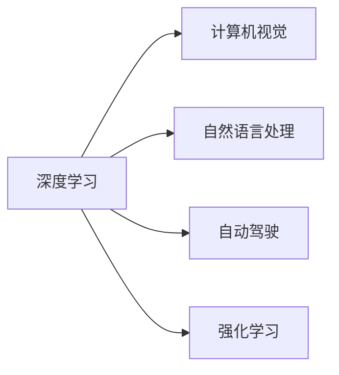

                 

# Andrej Karpathy：人工智能的未来技术

> 关键词：人工智能，深度学习，机器学习，深度神经网络，计算机视觉，自然语言处理，自动驾驶，强化学习，未来技术

## 1. 背景介绍

Andrej Karpathy是深度学习领域的先驱和领导者，他在计算机视觉、自然语言处理、自动驾驶等领域都做出了革命性的贡献。作为一名世界级的人工智能专家和程序员，Karpathy的研究不仅推动了深度学习技术的发展，也对未来技术的研究方向提供了深刻的见解。本文将从背景介绍、核心概念、算法原理、实践应用等多个方面，探讨Andrej Karpathy在人工智能领域的研究和展望，为读者揭示人工智能的未来技术。

## 2. 核心概念与联系

### 2.1 核心概念概述

在探讨Andrej Karpathy的人工智能未来技术之前，首先需明确几个核心概念：

- **深度学习**：一种基于人工神经网络的学习范式，通过多层次的非线性变换，从原始数据中自动学习特征表示。
- **机器学习**：一种使机器能够通过数据进行自我学习和改进的技术。
- **深度神经网络**：一种具有多层的神经网络结构，通过反向传播算法进行参数优化，能够高效地处理复杂的非线性关系。
- **计算机视觉**：研究如何让计算机识别、理解和处理图像、视频等视觉数据的技术。
- **自然语言处理**：研究如何让计算机理解和处理人类语言的技术。
- **自动驾驶**：通过计算机视觉和深度学习技术，实现车辆的自主导航和决策。
- **强化学习**：一种通过奖励信号引导智能体进行学习，优化决策策略的技术。

这些概念构成了人工智能研究的基础框架，Andrej Karpathy的研究涵盖了这些领域的多个方面。

### 2.2 核心概念原理和架构的 Mermaid 流程图



## 3. 核心算法原理 & 具体操作步骤

### 3.1 算法原理概述

Andrej Karpathy的研究主要集中在以下几个核心算法原理上：

- **深度神经网络架构**：如ResNet、VGGNet等，这些网络架构通过层次化结构设计，大大提升了模型的表达能力和泛化能力。
- **卷积神经网络（CNN）**：应用于计算机视觉任务的深度学习模型，通过局部感受野和池化操作，有效提取图像特征。
- **循环神经网络（RNN）和长短时记忆网络（LSTM）**：应用于自然语言处理和序列数据处理任务，通过时间上的信息传递，捕捉语言序列的动态变化。
- **生成对抗网络（GAN）**：一种生成模型，通过对抗训练，生成逼真的图像、视频等数据。
- **强化学习算法**：如Q-Learning、Policy Gradient等，通过与环境的交互，学习最优决策策略。

### 3.2 算法步骤详解

下面以深度神经网络和卷积神经网络为例，详细讲解Andrej Karpathy的算法操作步骤：

#### 3.2.1 深度神经网络

- **数据预处理**：对原始数据进行归一化、标准化等预处理，提高模型训练的稳定性。
- **模型架构设计**：设计合适的网络层次结构和激活函数，如ReLU、Sigmoid等。
- **参数初始化**：通过如Xavier、He等方法，初始化网络参数，减少梯度消失和爆炸问题。
- **前向传播**：将输入数据通过网络层进行特征提取和处理。
- **反向传播**：根据损失函数，计算梯度，更新模型参数。
- **模型训练**：通过多轮迭代，最小化损失函数，训练得到模型参数。
- **模型评估**：在测试集上评估模型性能，进行必要的调参优化。

#### 3.2.2 卷积神经网络

- **数据预处理**：图像数据需要进行归一化、裁剪、旋转等预处理，以适应网络输入。
- **卷积层设计**：设计卷积核的大小、步幅、填充等参数，提取图像特征。
- **池化层设计**：通过最大池化、平均池化等操作，降低特征图的空间大小，减少参数数量。
- **全连接层设计**：设计合适的全连接层结构，进行特征映射和分类。
- **激活函数设计**：引入ReLU、LeakyReLU等激活函数，增强模型的非线性表达能力。
- **正则化技术**：使用L2正则、Dropout等技术，防止过拟合。
- **模型训练**：通过多轮迭代，最小化损失函数，训练得到模型参数。
- **模型评估**：在测试集上评估模型性能，进行必要的调参优化。

### 3.3 算法优缺点

#### 3.3.1 深度神经网络的优点

- **强大的表达能力**：能够处理复杂的非线性关系，适应各种复杂的模式识别和分类任务。
- **高效的特征提取**：通过层次化的网络结构，自动学习到丰富的特征表示，减少了手动提取特征的复杂度。
- **良好的泛化能力**：通过大量的数据训练，模型能够泛化到未见过的数据集。

#### 3.3.2 深度神经网络的缺点

- **计算资源需求高**：网络参数众多，训练时需要大量的计算资源。
- **训练时间较长**：深层网络的训练往往需要较长时间，容易过拟合。
- **模型可解释性差**：深层网络中的每一层都具有抽象特征，难以解释其内部工作机制。

#### 3.3.3 卷积神经网络的优点

- **局部连接**：减少了参数数量，提高了模型训练和推理速度。
- **参数共享**：同一层中的每个卷积核在所有位置上共享，增强了模型的泛化能力。
- **平移不变性**：卷积操作对输入数据的平移具有不变性，提高了模型的稳定性和鲁棒性。

#### 3.3.4 卷积神经网络的缺点

- **特征提取依赖于感受野大小**：感受野过小可能无法捕捉到细节信息，感受野过大可能无法处理大规模图像。
- **参数共享可能导致局部退化**：某些区域可能过度依赖特定的卷积核，导致特征提取效果不佳。

## 4. 数学模型和公式 & 详细讲解 & 举例说明

### 4.1 数学模型构建

以卷积神经网络为例，构建数学模型：

- **输入数据**：$\mathbf{x} \in \mathbb{R}^{H \times W \times C}$，表示一个$H \times W$像素、$C$通道的图像。
- **卷积层**：$\mathbf{X} \in \mathbb{R}^{H_{out} \times W_{out} \times C_{out}}$，其中$H_{out} = \frac{H}{S} - 1 \times K + 2P$，$W_{out} = \frac{W}{S} - 1 \times K + 2P$，$C_{out} = F$，$S$为步幅，$K$为卷积核大小，$P$为填充。
- **激活函数**：$\sigma$，如ReLU、Sigmoid等。
- **池化层**：$\mathbf{Y} \in \mathbb{R}^{H_{pooled} \times W_{pooled} \times C_{out}}$，其中$H_{pooled} = \frac{H_{out}}{P}$，$W_{pooled} = \frac{W_{out}}{P}$。

### 4.2 公式推导过程

以卷积层为例，推导公式：

$$
\mathbf{X} = \sigma(\mathbf{W} * \mathbf{x} + \mathbf{b})
$$

其中$\mathbf{W} \in \mathbb{R}^{K \times K \times C \times F}$为卷积核，$\mathbf{b} \in \mathbb{R}^{F}$为偏置项。

### 4.3 案例分析与讲解

以Andrej Karpathy的图像分类任务为例，介绍卷积神经网络的数学模型：

- **输入数据**：$\mathbf{x} \in \mathbb{R}^{H \times W \times 3}$，表示一张$H \times W$像素、3个通道的图像。
- **卷积层**：使用$3 \times 3$卷积核，步幅为$1$，无填充，输出通道数为$64$。
- **激活函数**：ReLU。
- **池化层**：使用$2 \times 2$最大池化，步幅为$2$。
- **全连接层**：将特征图$\mathbf{Y} \in \mathbb{R}^{7 \times 7 \times 64}$，通过全连接层，映射到$1000$个类别。

## 5. 项目实践：代码实例和详细解释说明

### 5.1 开发环境搭建

为了构建卷积神经网络模型，我们需要以下开发环境：

- **Python**：3.7及以上版本。
- **PyTorch**：1.8及以上版本。
- **CUDA**：安装NVIDIA GPU驱动和CUDA库。
- **NVIDIA cuDNN**：与CUDA兼容的深度学习库。

### 5.2 源代码详细实现

以下是一个简单的卷积神经网络代码实现，包括数据预处理、模型定义、训练和评估等步骤：

```python
import torch
import torch.nn as nn
import torch.optim as optim
import torchvision.transforms as transforms
from torch.utils.data import DataLoader
from torchvision.datasets import CIFAR10

# 定义数据预处理
transform_train = transforms.Compose([
    transforms.RandomCrop(32, padding=4),
    transforms.RandomHorizontalFlip(),
    transforms.ToTensor(),
    transforms.Normalize((0.4914, 0.4822, 0.4465), (0.2023, 0.1994, 0.2010))
])

transform_test = transforms.Compose([
    transforms.ToTensor(),
    transforms.Normalize((0.4914, 0.4822, 0.4465), (0.2023, 0.1994, 0.2010))
])

# 加载CIFAR10数据集
train_dataset = CIFAR10(root='data', train=True, download=True, transform=transform_train)
test_dataset = CIFAR10(root='data', train=False, download=True, transform=transform_test)

# 定义数据加载器
train_loader = DataLoader(train_dataset, batch_size=128, shuffle=True, num_workers=4)
test_loader = DataLoader(test_dataset, batch_size=128, shuffle=False, num_workers=4)

# 定义模型
class Net(nn.Module):
    def __init__(self):
        super(Net, self).__init__()
        self.conv1 = nn.Conv2d(3, 64, kernel_size=3, stride=1, padding=1)
        self.conv2 = nn.Conv2d(64, 128, kernel_size=3, stride=1, padding=1)
        self.pool = nn.MaxPool2d(kernel_size=2, stride=2)
        self.fc1 = nn.Linear(128 * 8 * 8, 512)
        self.fc2 = nn.Linear(512, 10)

    def forward(self, x):
        x = nn.functional.relu(self.conv1(x))
        x = self.pool(x)
        x = nn.functional.relu(self.conv2(x))
        x = self.pool(x)
        x = x.view(-1, 128 * 8 * 8)
        x = nn.functional.relu(self.fc1(x))
        x = self.fc2(x)
        return x

# 定义损失函数和优化器
net = Net()
criterion = nn.CrossEntropyLoss()
optimizer = optim.SGD(net.parameters(), lr=0.01, momentum=0.9)

# 定义训练函数
def train(epoch):
    net.train()
    for batch_idx, (data, target) in enumerate(train_loader):
        optimizer.zero_grad()
        output = net(data)
        loss = criterion(output, target)
        loss.backward()
        optimizer.step()
        if (batch_idx + 1) % 100 == 0:
            print('Train Epoch: {} [{}/{} ({:.0f}%)]\tLoss: {:.6f}'.format(
                epoch, batch_idx * len(data), len(train_loader.dataset),
                100. * batch_idx / len(train_loader), loss.item()))

# 定义测试函数
def test():
    net.eval()
    correct = 0
    total = 0
    for batch_idx, (data, target) in enumerate(test_loader):
        output = net(data)
        _, predicted = torch.max(output.data, 1)
        total += target.size(0)
        correct += (predicted == target).sum().item()
    print('Test Accuracy of the model on the 10000 test images: {} %'.format(100 * correct / total))

# 训练模型
for epoch in range(10):
    train(epoch)
    test()
```

### 5.3 代码解读与分析

以上代码实现了一个简单的卷积神经网络模型，包含两个卷积层、两个池化层和两个全连接层。训练时，通过反向传播算法更新模型参数，最小化损失函数。测试时，评估模型在测试集上的准确率。

## 6. 实际应用场景

### 6.1 计算机视觉

Andrej Karpathy在计算机视觉领域的贡献体现在多个方面，包括图像分类、目标检测、图像生成等。

- **图像分类**：通过卷积神经网络模型，Andrej Karpathy提出了ResNet、VGGNet等架构，显著提升了图像分类的准确率。
- **目标检测**：基于Faster R-CNN、YOLO等模型，实现高效的目标检测和定位。
- **图像生成**：通过生成对抗网络（GAN），生成逼真的图像数据，用于无监督学习。

### 6.2 自然语言处理

在自然语言处理领域，Andrej Karpathy也做出了重要贡献，包括机器翻译、文本分类、文本生成等。

- **机器翻译**：通过序列到序列（Seq2Seq）模型，Andrej Karpathy提出了注意力机制（Attention），显著提升了翻译质量。
- **文本分类**：通过卷积神经网络和循环神经网络，实现高效的多分类任务。
- **文本生成**：通过变分自编码器（VAE）和生成对抗网络（GAN），生成自然流畅的文本。

### 6.3 自动驾驶

Andrej Karpathy在自动驾驶领域的研究主要集中在图像识别和决策策略上。

- **图像识别**：通过卷积神经网络，实现对道路标志、交通信号、车辆等关键信息的识别。
- **决策策略**：通过强化学习算法，训练智能体在复杂环境下做出最优决策。

## 7. 工具和资源推荐

### 7.1 学习资源推荐

1. **《深度学习》课程**：由Andrej Karpathy在Stanford大学开设的课程，涵盖深度学习的基本原理和实践技巧。
2. **《神经网络与深度学习》书籍**：由Michael Nielsen撰写，详细讲解神经网络和深度学习的基本概念和算法。
3. **Kaggle竞赛平台**：提供一个丰富的数据集和竞赛环境，帮助开发者实践深度学习模型。
4. **PyTorch官方文档**：提供PyTorch框架的详细文档和教程，方便开发者学习和使用。
5. **GitHub仓库**：Andrej Karpathy在GitHub上的代码仓库，包含大量的深度学习项目和代码实现。

### 7.2 开发工具推荐

1. **PyTorch**：开源深度学习框架，提供高效的计算图和动态网络定义功能。
2. **TensorFlow**：由Google开发的深度学习框架，支持分布式训练和生产部署。
3. **Jupyter Notebook**：交互式Python代码编辑器，方便开发者调试和展示代码。
4. **Git**：版本控制工具，方便开发者管理和协作代码。
5. **CUDA**：NVIDIA GPU加速工具，提高模型训练和推理的速度。

### 7.3 相关论文推荐

1. **ImageNet Classification with Deep Convolutional Neural Networks**：Andrej Karpathy等人在2012年提出的图像分类算法，展示了卷积神经网络的强大性能。
2. **Visualizing and Understanding Convolutional Networks**：Andrej Karpathy等人在2014年提出的可视化方法，帮助理解卷积神经网络的内部工作机制。
3. **CS231n: Convolutional Neural Networks for Visual Recognition**：斯坦福大学的计算机视觉课程，由Andrej Karpathy等人主讲，涵盖图像处理和深度学习的最新进展。

## 8. 总结：未来发展趋势与挑战

### 8.1 研究成果总结

Andrej Karpathy在深度学习和人工智能领域的研究成果，为未来技术的发展提供了重要的基础和方向。他的工作不仅推动了深度学习模型的性能提升，也推动了计算机视觉、自然语言处理、自动驾驶等领域的创新。

### 8.2 未来发展趋势

未来，人工智能技术将继续向深度学习、计算机视觉、自然语言处理等领域迈进，具体趋势如下：

- **模型规模和复杂度**：深度神经网络将进一步增大，模型结构将更加复杂，能够处理更复杂的模式识别和分类任务。
- **跨领域融合**：不同领域的技术将进一步融合，如计算机视觉和自然语言处理结合，实现跨模态的智能系统。
- **自监督学习**：通过无监督学习，自动学习到特征表示，降低对标注数据的依赖。
- **模型解释性**：研究如何提高模型的可解释性，使人们能够理解和信任模型的决策过程。
- **分布式训练**：通过分布式训练技术，提高模型训练的效率和稳定性。

### 8.3 面临的挑战

尽管人工智能技术取得了显著进展，但在实际应用中仍然面临许多挑战：

- **计算资源需求高**：深度学习模型需要大量的计算资源，如何降低资源消耗是一个重要问题。
- **模型可解释性差**：深度神经网络的复杂性使得模型难以解释，如何提高模型可解释性是一个重要研究方向。
- **数据隐私和安全**：人工智能系统处理大量敏感数据，如何保障数据隐私和安全是一个关键问题。
- **模型偏见**：深度学习模型可能学习到数据中的偏见，如何消除模型偏见是一个重要研究方向。
- **模型鲁棒性**：模型在面对数据变化时，如何保持鲁棒性是一个重要问题。

### 8.4 研究展望

未来，人工智能技术需要在模型性能、计算资源、可解释性、数据隐私等方面取得新的突破。具体研究展望如下：

- **高效模型压缩**：研究如何压缩深度学习模型，提高模型训练和推理的效率。
- **可解释模型设计**：研究如何设计可解释性强的深度学习模型，使人们能够理解和信任模型的决策过程。
- **数据隐私保护**：研究如何在人工智能系统中保护数据隐私，保障数据安全。
- **对抗攻击防御**：研究如何防御对抗攻击，提高模型的鲁棒性和安全性。
- **跨领域知识融合**：研究如何将不同领域的知识融合到深度学习模型中，提升模型的表现能力。

## 9. 附录：常见问题与解答

### Q1: 什么是卷积神经网络？

**A**: 卷积神经网络是一种专门用于图像处理的深度学习模型，通过卷积层和池化层，提取图像的特征表示。卷积层通过滑动卷积核进行特征提取，池化层通过降低特征图的大小，减少参数数量。

### Q2: 如何训练深度神经网络？

**A**: 深度神经网络的训练通常采用反向传播算法，通过最小化损失函数，更新模型参数。训练过程中需要设置合适的学习率、优化器、正则化等参数，避免过拟合和梯度消失问题。

### Q3: 深度学习模型有哪些优点和缺点？

**A**: 深度学习模型的优点包括强大的表达能力、高效的特征提取、良好的泛化能力等。缺点包括计算资源需求高、训练时间长、模型可解释性差等。

### Q4: 如何提高深度学习模型的可解释性？

**A**: 提高深度学习模型的可解释性可以通过可视化技术、简化模型结构、增加正则化等方法。例如，使用Grad-CAM技术，可视化卷积层的激活图，帮助理解模型的特征提取过程。

### Q5: 如何保护深度学习模型的数据隐私？

**A**: 保护深度学习模型的数据隐私可以通过数据匿名化、差分隐私等技术。例如，将数据加密存储，限制模型的访问权限，保障数据的安全性。

