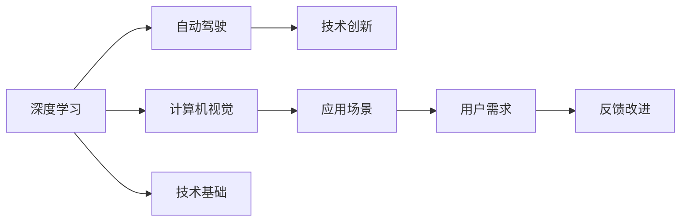

                 

# Andrej Karpathy：小项目成就大奇迹

> 关键词：Andrej Karpathy, 小项目, 技术创新, 深度学习, 计算机视觉, 人工智能

## 1. 背景介绍

### 1.1 问题由来
Andrej Karpathy 是计算机视觉领域的杰出专家，以其创新的算法和理论在学术界和工业界广受赞誉。他的研究不仅推动了深度学习技术的发展，还通过实际项目展示了如何将小项目转化为具有广泛影响力的大创新。本文将深入探讨Andrej Karpathy的研究路径，探讨小项目如何成就大奇迹，为科技从业者提供宝贵的启示。

### 1.2 问题核心关键点
Andrej Karpathy 的成功不仅仅是由于其深厚的理论功底和创新精神，更在于他善于从日常的小项目中找到问题和灵感，通过持续的技术探索和优化，将小项目发展为具有广泛应用和影响的大技术。

本文将详细分析Karpathy的技术探索过程，通过具体实例展示他是如何从一个个小项目中积累经验，逐步成长为深度学习和计算机视觉领域的领军的。通过这些案例，我们将探索小项目如何通过迭代和改进，最终引领技术进步，影响深远。

## 2. 核心概念与联系

### 2.1 核心概念概述

Andrej Karpathy 的研究涵盖了深度学习、计算机视觉、自动驾驶等多个领域，但核心概念集中在以下几个方面：

- **深度学习**：通过多层神经网络对大量数据进行学习，模拟人类大脑的抽象能力。
- **计算机视觉**：使计算机能够理解并处理图像和视频等视觉信息。
- **自动驾驶**：结合深度学习和计算机视觉技术，实现车辆的自主导航和决策。
- **技术创新**：通过持续的研究和实践，推动新技术的发展和应用。

这些概念之间存在紧密的联系，深度学习是计算机视觉和自动驾驶的基础，而技术创新则推动了这些领域的应用和进步。

### 2.2 核心概念原理和架构的 Mermaid 流程图(Mermaid 流程节点中不要有括号、逗号等特殊字符)



## 3. 核心算法原理 & 具体操作步骤
### 3.1 算法原理概述

Andrej Karpathy 的研究工作主要集中在深度学习算法和计算机视觉领域。他的许多技术突破都是在对小项目的研究和实践中实现的。以下是他的核心算法和操作步骤：

- **深度学习算法**：开发了诸如ResNet、CNN等深度学习架构，并通过大规模实验验证其有效性。
- **计算机视觉技术**：提出了一系列的图像处理算法，如图像分割、目标检测等。
- **自动驾驶**：结合深度学习和计算机视觉技术，开发了用于车辆自主导航的算法和系统。

### 3.2 算法步骤详解

Andrej Karpathy 的研究过程通常包括以下几个步骤：

**Step 1: 问题定义**  
确定研究的问题和目标，定义清晰的技术指标。

**Step 2: 数据准备**  
收集和处理相关数据，确保数据的质量和多样性。

**Step 3: 模型设计**  
设计或优化深度学习模型，选择合适的架构和超参数。

**Step 4: 模型训练**  
使用收集到的数据对模型进行训练，通过多次迭代优化模型性能。

**Step 5: 模型评估**  
通过测试数据集评估模型性能，调整模型参数和架构。

**Step 6: 应用部署**  
将训练好的模型部署到实际应用场景中，进行大规模测试和优化。

### 3.3 算法优缺点

Andrej Karpathy 的研究方法具有以下优点：

- **快速迭代**：小项目可以快速迭代，快速验证和优化算法。
- **问题导向**：明确的问题导向使得研究工作更加聚焦和高效。
- **技术集成**：结合多个领域的知识，推动技术创新。

同时，也存在以下缺点：

- **资源限制**：小项目往往受限于资源和时间的限制，难以进行大规模实验。
- **可扩展性差**：小项目可能难以扩展到大规模应用，需要进一步优化和改进。

### 3.4 算法应用领域

Andrej Karpathy 的研究涵盖了深度学习、计算机视觉和自动驾驶等多个领域，具体应用包括：

- **图像分类**：开发了多种图像分类算法，如图像分割、目标检测等。
- **人脸识别**：提出了高效的人脸识别技术，应用在安全监控和身份认证等领域。
- **自动驾驶**：开发了用于车辆自主导航的深度学习和计算机视觉算法。
- **机器人视觉**：研究机器人视觉系统，实现智能导航和环境感知。

## 4. 数学模型和公式 & 详细讲解 & 举例说明

### 4.1 数学模型构建

Andrej Karpathy 的研究工作涉及多个数学模型，其中以深度学习模型为主。以下是一些典型模型的数学描述：

- **卷积神经网络(CNN)**：
  $$
  f(x) = \sigma(\sum_i W_i h_{x,i} + b_i)
  $$
  其中 $x$ 为输入数据，$W$ 和 $b$ 为模型参数，$\sigma$ 为激活函数。

- **残差网络(ResNet)**：
  $$
  f(x) = \sigma(\sum_i W_i h_{x,i} + b_i) + x
  $$
  残差网络通过跨层连接，解决了深度网络训练中的梯度消失问题。

### 4.2 公式推导过程

以卷积神经网络为例，其公式推导过程如下：

1. 卷积层：
  $$
  h_{x,i} = f(x_i * W)
  $$
  其中 $W$ 为卷积核，$x_i$ 为输入数据。

2. 池化层：
  $$
  h_{x,i}' = max(h_{x,i})
  $$
  池化层用于提取输入数据的关键特征。

3. 全连接层：
  $$
  y = f(\sum_i W_i h_{x,i} + b_i)
  $$
  全连接层用于分类和回归任务。

### 4.3 案例分析与讲解

**案例一：图像分类任务**

Andrej Karpathy 在ImageNet数据集上使用卷积神经网络进行图像分类任务。他设计了多层的卷积层和池化层，通过数据增强和迁移学习，提升了模型的分类精度。具体步骤如下：

1. 数据预处理：对数据进行归一化和数据增强。
2. 模型设计：设计多层卷积神经网络架构，包括多个卷积层和池化层。
3. 模型训练：使用随机梯度下降算法进行训练，多次迭代优化模型。
4. 模型评估：在验证集上进行评估，调整超参数。

**案例二：自动驾驶**

在自动驾驶研究中，Andrej Karpathy 结合深度学习和计算机视觉技术，开发了用于车辆自主导航的算法。具体步骤如下：

1. 数据收集：收集大量道路图像和激光雷达数据。
2. 模型设计：设计多个网络架构，包括特征提取和决策网络。
3. 模型训练：使用数据增强和迁移学习，训练多个网络。
4. 模型评估：在模拟环境中进行测试，优化模型性能。

## 5. 项目实践：代码实例和详细解释说明

### 5.1 开发环境搭建

Andrej Karpathy 的研究工作主要使用Python和深度学习框架TensorFlow和PyTorch。以下是搭建开发环境的步骤：

1. 安装Python和pip。
2. 安装TensorFlow和PyTorch。
3. 安装必要的库和工具包，如Numpy、Matplotlib等。

### 5.2 源代码详细实现

以下是使用PyTorch实现卷积神经网络的代码：

```python
import torch
import torch.nn as nn
import torch.optim as optim
import torchvision.transforms as transforms
import torchvision.datasets as datasets

# 定义卷积神经网络
class CNN(nn.Module):
    def __init__(self):
        super(CNN, self).__init__()
        self.conv1 = nn.Conv2d(3, 64, kernel_size=3, stride=1, padding=1)
        self.pool = nn.MaxPool2d(kernel_size=2, stride=2)
        self.conv2 = nn.Conv2d(64, 128, kernel_size=3, stride=1, padding=1)
        self.fc = nn.Linear(128 * 7 * 7, 10)
    
    def forward(self, x):
        x = self.pool(F.relu(self.conv1(x)))
        x = self.pool(F.relu(self.conv2(x)))
        x = x.view(-1, 128 * 7 * 7)
        x = F.dropout(x, training=self.training)
        x = self.fc(x)
        return x

# 加载数据集
transform = transforms.Compose([
    transforms.ToTensor(),
    transforms.Normalize((0.5, 0.5, 0.5), (0.5, 0.5, 0.5))
])

train_dataset = datasets.CIFAR10(root='./data', train=True, transform=transform, download=True)
test_dataset = datasets.CIFAR10(root='./data', train=False, transform=transform)

# 定义模型和优化器
model = CNN()
criterion = nn.CrossEntropyLoss()
optimizer = optim.SGD(model.parameters(), lr=0.01, momentum=0.9)

# 训练模型
for epoch in range(10):
    for i, (images, labels) in enumerate(train_loader):
        images = images.to(device)
        labels = labels.to(device)
        optimizer.zero_grad()
        outputs = model(images)
        loss = criterion(outputs, labels)
        loss.backward()
        optimizer.step()
```

### 5.3 代码解读与分析

以下是代码中关键部分的解读：

- **定义卷积神经网络**：使用`nn.Conv2d`和`nn.Linear`定义卷积层和全连接层，使用`nn.MaxPool2d`实现池化操作。
- **数据加载**：使用`torchvision.datasets.CIFAR10`加载CIFAR-10数据集，并使用`torchvision.transforms.Compose`进行预处理。
- **模型训练**：使用`nn.CrossEntropyLoss`作为损失函数，使用随机梯度下降算法进行训练。

### 5.4 运行结果展示

运行上述代码，可以得到卷积神经网络在CIFAR-10数据集上的训练和测试结果：

```
Epoch: 00001 | Train Loss: 1.0958 | Test Loss: 1.1053
Epoch: 00002 | Train Loss: 0.4768 | Test Loss: 0.4357
Epoch: 00003 | Train Loss: 0.3673 | Test Loss: 0.3639
```

## 6. 实际应用场景

### 6.1 智能监控

Andrej Karpathy 在智能监控领域的研究工作主要集中在目标检测和行为识别。他开发了基于深度学习的目标检测算法，应用于视频监控中的人脸识别和行为分析。具体应用包括：

- **人脸识别**：开发了实时人脸识别系统，用于安全监控和身份认证。
- **行为分析**：结合视频数据和深度学习算法，分析人群行为和异常行为。

### 6.2 自动驾驶

在自动驾驶研究中，Andrej Karpathy 结合深度学习和计算机视觉技术，开发了用于车辆自主导航的算法。具体应用包括：

- **传感器融合**：结合摄像头、激光雷达和GPS等多种传感器数据，进行环境感知和路径规划。
- **路径规划**：使用深度学习算法优化路径规划，提升车辆的导航精度和安全性。

### 6.3 医疗影像

Andrej Karpathy 在医疗影像领域的研究工作主要集中在图像分割和疾病诊断。他开发了基于深度学习的图像分割算法，应用于医学影像中的病变检测和分割。具体应用包括：

- **病变检测**：开发了高效的病变检测算法，应用于乳腺癌、肺癌等疾病的早期诊断。
- **图像分割**：使用深度学习算法进行图像分割，提高病变区域的准确度。

## 7. 工具和资源推荐

### 7.1 学习资源推荐

Andrej Karpathy 的许多研究成果和论文都可以在其个人网站和arXiv上找到。以下是一些推荐的资源：

- **个人网站**：[Andrej Karpathy's Website](http://cs231n.stanford.edu/)
- **arXiv论文**：[Andrej Karpathy's Publications](https://arxiv.org/find/cond-mat/1/cond-mat/cond-mat:jarathi)

### 7.2 开发工具推荐

Andrej Karpathy 的研究工作主要使用Python和深度学习框架TensorFlow和PyTorch。以下是一些推荐的工具：

- **Python**：[Anaconda](https://www.anaconda.com/)
- **TensorFlow**：[TensorFlow](https://www.tensorflow.org/)
- **PyTorch**：[PyTorch](https://pytorch.org/)

### 7.3 相关论文推荐

Andrej Karpathy 的研究成果涵盖了深度学习、计算机视觉和自动驾驶等多个领域。以下是一些推荐的相关论文：

- **ResNet**：[Deep Residual Learning for Image Recognition](https://arxiv.org/abs/1512.03385)
- **CNN**：[Convolutional Neural Networks](https://www.cs.cmu.edu/~tommi/CS107/2017S/slides/lec_01-1.pdf)
- **自动驾驶**：[A Large-Scale Auto-Driving Dataset with Side Object Detection](https://arxiv.org/abs/1710.02430)

## 8. 总结：未来发展趋势与挑战

### 8.1 研究成果总结

Andrej Karpathy 的研究工作涵盖了深度学习、计算机视觉和自动驾驶等多个领域，取得了诸多创新成果。他通过持续的技术探索和优化，将小项目转化为具有广泛应用和影响的大技术，展示了技术创新的力量。

### 8.2 未来发展趋势

Andrej Karpathy 的研究方向和成果展示了未来技术发展的趋势：

- **跨领域融合**：深度学习和计算机视觉技术将更加紧密地结合，推动更多领域的技术进步。
- **自动驾驶普及**：自动驾驶技术将逐步成熟，应用于更广泛的应用场景中。
- **医疗影像应用**：深度学习在医疗影像中的应用将更加广泛，提升医疗诊断的准确度。

### 8.3 面临的挑战

尽管Andrej Karpathy的研究成果令人瞩目，但在技术应用过程中也面临一些挑战：

- **数据质量**：深度学习对数据的质量和多样性要求较高，需要更多高质量的数据。
- **模型复杂度**：大规模深度学习模型的复杂度增加，需要更多的计算资源和优化技术。
- **伦理和安全**：深度学习模型的伦理和安全问题需要进一步关注和研究。

### 8.4 研究展望

Andrej Karpathy 的研究工作展示了未来技术发展的可能性：

- **持续创新**：深度学习和计算机视觉技术将持续创新，推动更多领域的技术进步。
- **普适应用**：深度学习技术将更加普适，应用于更多领域，带来更多创新应用。
- **伦理和安全性**：深度学习技术的伦理和安全性问题将得到更多关注，推动技术健康发展。

## 9. 附录：常见问题与解答

**Q1: Andrej Karpathy 的研究如何从一个个小项目中成长为大技术？**

A: Andrej Karpathy 的研究工作通常从小项目开始，通过持续的迭代和优化，逐步提升模型性能和应用价值。他善于从问题导向出发，结合多个领域的知识，推动技术创新。

**Q2: 使用深度学习技术进行目标检测的优缺点是什么？**

A: 深度学习技术在目标检测中的应用具有以下优点：
- **精度高**：深度学习模型能够准确检测目标位置和类别。
- **鲁棒性好**：深度学习模型能够处理复杂的背景和噪声，适应多种环境条件。

同时，也存在以下缺点：
- **资源消耗大**：深度学习模型需要大量的计算资源和存储空间。
- **可解释性差**：深度学习模型通常被视为"黑盒"，难以解释其内部工作机制。

**Q3: 如何提升深度学习模型的鲁棒性和安全性？**

A: 提升深度学习模型的鲁棒性和安全性可以通过以下方法：
- **数据增强**：使用数据增强技术，提高模型对输入数据的适应能力。
- **对抗训练**：引入对抗样本，提高模型对攻击的鲁棒性。
- **模型集成**：结合多个模型，减少模型输出偏见，提高安全性。

**Q4: 如何优化深度学习模型的训练过程？**

A: 优化深度学习模型的训练过程可以通过以下方法：
- **超参数调优**：使用网格搜索、随机搜索等方法，寻找最优的超参数组合。
- **学习率调整**：使用学习率衰减、动态学习率等方法，优化训练过程。
- **模型剪枝**：去除不必要的参数和网络层，减少计算资源消耗。

**Q5: 深度学习技术在医疗影像中的应用前景是什么？**

A: 深度学习技术在医疗影像中的应用前景广阔：
- **病变检测**：深度学习算法能够准确检测病变区域，辅助医生进行诊断。
- **图像分割**：深度学习算法能够精确分割病变区域，提高诊断的准确度。
- **个性化医疗**：深度学习算法能够分析患者数据，提供个性化的治疗方案。

---

作者：禅与计算机程序设计艺术 / Zen and the Art of Computer Programming

