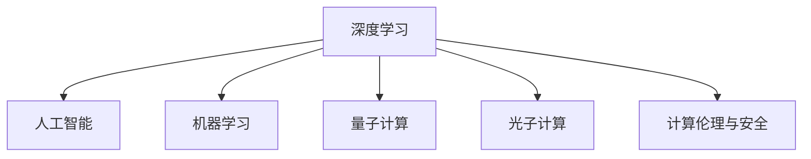

                 

# Andrej Karpathy：计算的本质正在变化

> 关键词：计算、深度学习、人工智能、未来技术、机器学习、人类文明

## 1. 背景介绍

### 1.1 问题由来
在技术日新月异的今天，计算正在以指数级增长，AI和机器学习（ML）的发展尤为迅猛。与此同时，人们对计算本质的认识也在不断深入。Andrej Karpathy，作为计算机科学界的杰出人物，他的演讲和研究一直引领着前沿科技的发展。

在Karpathy最新的演讲《计算的本质正在变化》中，他深入探讨了计算未来的演进方向，以及这一变化对AI和深度学习领域的影响。Karpathy认为，计算本质正在发生变化，这不仅关乎技术进步，更关乎人类文明和未来的发展。

### 1.2 问题核心关键点
Karpathy的演讲从多个维度探讨了计算未来的演进：

- **计算效率的提升**：随着量子计算、光子计算等新技术的涌现，计算能力将大幅提升，数据处理速度将加速，计算效率显著提高。
- **AI与人类协作**：AI将更好地与人类协作，共同解决复杂问题，提升工作效率和生活质量。
- **计算与物理世界结合**：计算能力将进一步渗透到物理世界，如通过计算机视觉和机器人技术，改变我们对世界的感知和互动方式。
- **计算伦理与安全**：随着计算能力的增强，数据隐私和安全性成为更重要的议题，如何保护用户隐私，确保计算的公正性和安全性，是未来亟待解决的问题。

这些关键点触及了计算技术、人类协作、物理世界结合以及伦理安全等多个方面，为我们理解计算的本质提供了新的视角。

## 2. 核心概念与联系

### 2.1 核心概念概述

为了更好地理解Andrej Karpathy演讲的核心概念，本节将介绍几个密切相关的核心概念：

- **深度学习**：一种基于神经网络的机器学习技术，通过多层非线性变换，实现对数据的高级抽象。
- **人工智能**：使机器能够模拟人类智能行为的技术，包括感知、推理、学习等能力。
- **量子计算**：利用量子力学的原理，通过量子比特的叠加和纠缠，实现高效计算的能力。
- **光子计算**：利用光子（光量子）进行信息处理，具有并行性高、计算速度快的特点。
- **机器学习**：通过数据训练，使机器具备从经验中学习的能力，实现对新数据的预测和决策。
- **计算伦理与安全**：在计算能力增强的同时，数据隐私、安全性、公平性等伦理问题也随之出现，需要制定相应的规范和政策。

这些核心概念之间的逻辑关系可以通过以下Mermaid流程图来展示：



这个流程图展示了这个演讲涉及的核心概念及其之间的关系：

1. 深度学习是AI和机器学习的重要基础，通过神经网络实现数据抽象。
2. 量子计算和光子计算代表未来的计算技术，具有极高的计算效率。
3. 计算伦理与安全是计算技术发展的产物，对技术应用提出了新的要求。

这些概念共同构成了计算技术的发展框架，帮助我们理解计算技术未来的演进方向。

## 3. 核心算法原理 & 具体操作步骤
### 3.1 算法原理概述

Andrej Karpathy的演讲中，深度学习是计算演进的基石。深度学习通过多层神经网络，实现对复杂数据的抽象和处理。以下是深度学习的基本原理和操作步骤：

1. **数据准备**：收集和处理数据，确保数据的质量和多样性。
2. **模型设计**：选择或设计合适的神经网络结构，包括输入层、隐藏层和输出层。
3. **模型训练**：使用大量数据训练模型，通过反向传播算法更新网络参数，优化模型性能。
4. **模型评估**：在测试数据集上评估模型性能，使用准确率、召回率、F1值等指标进行衡量。
5. **模型应用**：将训练好的模型应用于实际场景，解决具体的业务问题。

### 3.2 算法步骤详解

深度学习的核心操作步骤包括：

- **神经网络结构**：常见的神经网络结构有卷积神经网络（CNN）、循环神经网络（RNN）、Transformer等。不同的网络结构适用于不同的任务，如图像识别、文本生成、语音识别等。
- **损失函数**：选择合适的损失函数，如交叉熵、均方误差等，用于衡量模型预测与真实标签之间的差异。
- **优化算法**：使用如SGD、Adam等优化算法，调整模型参数以最小化损失函数。
- **正则化技术**：通过L1正则、L2正则、Dropout等技术，防止过拟合，提高模型泛化能力。
- **数据增强**：通过随机裁剪、旋转、翻转等手段，扩充训练数据集，增强模型鲁棒性。
- **超参数调优**：通过网格搜索、随机搜索等方法，优化模型的超参数，如学习率、批量大小、网络深度等。

### 3.3 算法优缺点

深度学习的优点包括：

- **自适应能力**：能够自动学习数据的特征，无需手工设计特征。
- **泛化能力**：在大量数据训练后，能够在未见过的数据上进行准确预测。
- **可解释性**：通过可视化技术，了解模型内部的工作机制，有助于调试和优化。

缺点则包括：

- **计算资源需求高**：大规模神经网络的训练需要大量的计算资源，如GPU、TPU等。
- **数据需求大**：深度学习模型的训练需要大量的标注数据，获取高质量标注数据的成本较高。
- **过拟合风险**：模型复杂度高，容易出现过拟合，需要额外的正则化手段。
- **黑盒模型**：深度学习模型通常难以解释，缺乏透明度。

尽管存在这些局限性，深度学习在图像识别、语音识别、自然语言处理等领域取得了显著的进展，成为了当前AI研究的重要方向。

### 3.4 算法应用领域

深度学习技术已经在多个领域得到了广泛应用：

- **计算机视觉**：图像分类、物体检测、图像分割、图像生成等任务。
- **自然语言处理**：机器翻译、文本生成、情感分析、命名实体识别等任务。
- **语音识别**：语音转文本、语音合成、语音情感分析等任务。
- **推荐系统**：基于用户历史行为推荐商品、电影、新闻等。
- **医疗影像**：医学影像分析、疾病诊断、医疗文本分类等。
- **自动驾驶**：目标检测、场景理解、路径规划等。

深度学习的应用领域在不断扩展，未来有望在更多复杂场景中发挥作用。

## 4. 数学模型和公式 & 详细讲解 & 举例说明

### 4.1 数学模型构建

在深度学习中，常用的数学模型包括线性回归、逻辑回归、卷积神经网络（CNN）、循环神经网络（RNN）、Transformer等。以卷积神经网络为例，其基本结构包括卷积层、池化层、全连接层等。

卷积神经网络的数学模型可以表示为：

$$
y = W^Tx + b
$$

其中，$y$为输出向量，$W$为权重矩阵，$x$为输入向量，$b$为偏置项。

### 4.2 公式推导过程

卷积神经网络的卷积层可以看作是对输入数据进行卷积操作，提取局部特征。卷积操作的公式为：

$$
f(x) = W^Tx + b
$$

其中，$W$为卷积核，$x$为输入数据，$b$为偏置项。卷积核的大小通常为$k \times k$，步长为$s$。

池化层则是对卷积层的输出进行降采样，减小模型的参数量，提高计算效率。常用的池化操作有最大池化和平均池化，其公式分别为：

$$
f(x) = \max_{i,j}x(i,j) \text{ and } f(x) = \frac{1}{k^2}\sum_{i,j}x(i,j)
$$

### 4.3 案例分析与讲解

以图像分类任务为例，卷积神经网络可以通过多层卷积和池化操作，逐步提取图像的高级特征，最终通过全连接层进行分类预测。其训练过程可以通过反向传播算法，逐步更新网络参数，优化模型性能。

以下是一个简单的卷积神经网络实现示例：

```python
import torch
import torch.nn as nn
import torch.optim as optim

class ConvNet(nn.Module):
    def __init__(self):
        super(ConvNet, self).__init__()
        self.conv1 = nn.Conv2d(3, 16, 3)
        self.conv2 = nn.Conv2d(16, 32, 3)
        self.pool = nn.MaxPool2d(2, 2)
        self.fc1 = nn.Linear(32 * 8 * 8, 512)
        self.fc2 = nn.Linear(512, 10)

    def forward(self, x):
        x = self.pool(torch.relu(self.conv1(x)))
        x = self.pool(torch.relu(self.conv2(x)))
        x = x.view(-1, 32 * 8 * 8)
        x = torch.relu(self.fc1(x))
        x = self.fc2(x)
        return x

# 定义模型和优化器
model = ConvNet()
criterion = nn.CrossEntropyLoss()
optimizer = optim.SGD(model.parameters(), lr=0.001, momentum=0.9)

# 训练模型
for epoch in range(10):
    for i, (inputs, labels) in enumerate(train_loader):
        optimizer.zero_grad()
        outputs = model(inputs)
        loss = criterion(outputs, labels)
        loss.backward()
        optimizer.step()

    print(f"Epoch {epoch+1}, Loss: {loss.item()}")
```

以上代码展示了卷积神经网络的构建和训练过程。通过反向传播算法，模型逐步更新权重和偏置，最小化损失函数，提高分类精度。

## 5. 项目实践：代码实例和详细解释说明
### 5.1 开发环境搭建

在进行深度学习项目实践前，我们需要准备好开发环境。以下是使用Python进行PyTorch开发的环境配置流程：

1. 安装Anaconda：从官网下载并安装Anaconda，用于创建独立的Python环境。

2. 创建并激活虚拟环境：
```bash
conda create -n pytorch-env python=3.8 
conda activate pytorch-env
```

3. 安装PyTorch：根据CUDA版本，从官网获取对应的安装命令。例如：
```bash
conda install pytorch torchvision torchaudio cudatoolkit=11.1 -c pytorch -c conda-forge
```

4. 安装TensorFlow：
```bash
pip install tensorflow
```

5. 安装TensorBoard：
```bash
pip install tensorboard
```

6. 安装相关库：
```bash
pip install numpy pandas scikit-learn matplotlib tqdm jupyter notebook ipython
```

完成上述步骤后，即可在`pytorch-env`环境中开始深度学习实践。

### 5.2 源代码详细实现

下面我们以图像分类任务为例，给出使用PyTorch进行卷积神经网络模型构建和训练的代码实现。

```python
import torch
import torch.nn as nn
import torch.optim as optim
import torchvision.transforms as transforms
from torch.utils.data import DataLoader
from torchvision.datasets import CIFAR10

# 定义数据预处理
transform = transforms.Compose([
    transforms.ToTensor(),
    transforms.Normalize((0.5, 0.5, 0.5), (0.5, 0.5, 0.5))
])

# 加载数据集
train_set = CIFAR10(root='./data', train=True, download=True, transform=transform)
test_set = CIFAR10(root='./data', train=False, download=True, transform=transform)
train_loader = DataLoader(train_set, batch_size=64, shuffle=True)
test_loader = DataLoader(test_set, batch_size=64, shuffle=False)

# 定义模型和优化器
class ConvNet(nn.Module):
    def __init__(self):
        super(ConvNet, self).__init__()
        self.conv1 = nn.Conv2d(3, 16, 3)
        self.conv2 = nn.Conv2d(16, 32, 3)
        self.pool = nn.MaxPool2d(2, 2)
        self.fc1 = nn.Linear(32 * 8 * 8, 512)
        self.fc2 = nn.Linear(512, 10)

    def forward(self, x):
        x = self.pool(torch.relu(self.conv1(x)))
        x = self.pool(torch.relu(self.conv2(x)))
        x = x.view(-1, 32 * 8 * 8)
        x = torch.relu(self.fc1(x))
        x = self.fc2(x)
        return x

model = ConvNet()
criterion = nn.CrossEntropyLoss()
optimizer = optim.SGD(model.parameters(), lr=0.001, momentum=0.9)

# 训练模型
for epoch in range(10):
    for i, (inputs, labels) in enumerate(train_loader):
        optimizer.zero_grad()
        outputs = model(inputs)
        loss = criterion(outputs, labels)
        loss.backward()
        optimizer.step()

    print(f"Epoch {epoch+1}, Loss: {loss.item()}")
```

### 5.3 代码解读与分析

让我们再详细解读一下关键代码的实现细节：

**ConvNet类**：
- `__init__`方法：初始化卷积层、池化层、全连接层等组件。
- `forward`方法：定义前向传播过程，通过多层卷积和池化操作提取特征，并通过全连接层进行分类预测。

**训练流程**：
- 定义训练集和测试集，使用CIFAR10数据集。
- 定义数据预处理和数据加载器。
- 定义模型和优化器。
- 在每个epoch中，对训练集进行迭代训练，计算损失并更新模型参数。
- 在测试集上评估模型性能，输出损失值。

可以看到，PyTorch提供了丰富的API和工具，使得深度学习模型的构建和训练变得简单高效。

## 6. 实际应用场景
### 6.1 计算机视觉

深度学习在计算机视觉领域的应用非常广泛。通过卷积神经网络，可以实现图像分类、物体检测、图像分割、图像生成等任务。

以图像分类为例，可以使用预训练的卷积神经网络（如ResNet、Inception等），通过微调模型参数，实现对特定图像集的分类。例如，在医学影像分析中，可以使用卷积神经网络对X光片、CT片进行分类，识别病变区域，辅助医生诊断。

### 6.2 自然语言处理

自然语言处理（NLP）是深度学习的另一重要应用领域。通过循环神经网络（RNN）、Transformer等模型，可以实现文本分类、情感分析、机器翻译、对话系统等任务。

例如，可以使用Transformer模型进行机器翻译，将一种语言的文本翻译成另一种语言。Transformer模型通过自注意力机制，能够高效地处理长序列数据，实现高质量的翻译效果。

### 6.3 推荐系统

推荐系统是深度学习在商业应用中最为成功的案例之一。通过用户历史行为数据，构建推荐模型，实现个性化推荐。

例如，在电商领域，可以使用深度学习模型预测用户对商品的兴趣，推荐相关的商品。通过不断优化模型，提升推荐准确性，增加用户粘性和购买转化率。

### 6.4 未来应用展望

随着深度学习技术的不断进步，未来深度学习技术将在更多领域得到应用，为各行各业带来变革性影响。

- **医疗影像**：通过深度学习模型对医疗影像进行分类和分析，辅助医生诊断和治疗。
- **自动驾驶**：使用计算机视觉和深度学习技术，实现自动驾驶车辆的目标检测和场景理解。
- **金融分析**：使用深度学习模型进行市场预测和风险评估，辅助金融决策。
- **智能制造**：使用深度学习模型进行设备故障预测和生产调度优化。
- **农业智能化**：使用深度学习模型对农业数据进行分析和预测，提高农业生产效率。

未来深度学习技术的发展方向将更加多样化，有望在更多领域发挥重要作用。

## 7. 工具和资源推荐
### 7.1 学习资源推荐

为了帮助开发者系统掌握深度学习理论基础和实践技巧，这里推荐一些优质的学习资源：

1. 《Deep Learning》书籍：Ian Goodfellow、Yoshua Bengio和Aaron Courville合著的经典教材，系统介绍了深度学习的基本原理和算法。
2. CS231n《卷积神经网络》课程：斯坦福大学开设的计算机视觉课程，涵盖深度学习在图像分类、目标检测、图像生成等任务中的应用。
3. CS224n《序列模型》课程：斯坦福大学开设的自然语言处理课程，涵盖深度学习在文本分类、机器翻译、对话系统等任务中的应用。
4. CS382《强化学习》课程：斯坦福大学开设的强化学习课程，涵盖深度学习在决策、控制、规划等任务中的应用。
5. Coursera《深度学习专项课程》：由深度学习领域的专家教授，系统介绍深度学习的基本原理和算法，并结合实际案例进行讲解。
6. TensorFlow官网和官方文档：提供了丰富的学习资源和API文档，方便开发者快速上手。

通过对这些资源的学习实践，相信你一定能够快速掌握深度学习技术，并用于解决实际的业务问题。

### 7.2 开发工具推荐

高效的深度学习开发离不开优秀的工具支持。以下是几款用于深度学习开发的常用工具：

1. PyTorch：基于Python的开源深度学习框架，灵活动态的计算图，适合快速迭代研究。
2. TensorFlow：由Google主导开发的开源深度学习框架，生产部署方便，适合大规模工程应用。
3. Keras：高层次的深度学习API，易于上手，适合快速原型开发。
4. Jupyter Notebook：交互式Python开发环境，支持代码块执行和可视化展示，方便调试和演示。
5. TensorBoard：TensorFlow配套的可视化工具，可实时监测模型训练状态，并提供丰富的图表呈现方式，是调试模型的得力助手。
6. Weights & Biases：模型训练的实验跟踪工具，可以记录和可视化模型训练过程中的各项指标，方便对比和调优。

合理利用这些工具，可以显著提升深度学习项目的开发效率，加快创新迭代的步伐。

### 7.3 相关论文推荐

深度学习技术的发展源于学界的持续研究。以下是几篇奠基性的相关论文，推荐阅读：

1. AlexNet：在ImageNet大规模图像识别竞赛中取得冠军，标志着深度学习在计算机视觉领域的应用。
2. ResNet：深度残差网络，解决深度网络训练中的梯度消失问题，使深度学习模型能够更深更宽。
3. LSTM：长短期记忆网络，解决序列数据中的梯度消失问题，使深度学习模型能够更好地处理时间序列数据。
4. Transformer：自注意力机制，使深度学习模型能够高效地处理长序列数据，实现高质量的机器翻译和文本生成。
5. GAN：生成对抗网络，能够生成高质量的图像和视频，开辟了深度学习在生成对抗中的新应用。
6. AutoML：自动化机器学习，通过算法自动化和超参数搜索，提升深度学习模型的性能。

这些论文代表了大深度学习的发展脉络。通过学习这些前沿成果，可以帮助研究者把握学科前进方向，激发更多的创新灵感。

## 8. 总结：未来发展趋势与挑战
### 8.1 总结

本文对Andrej Karpathy演讲中深度学习技术的发展趋势进行了全面系统的介绍。首先阐述了深度学习在计算演进中的重要地位，明确了深度学习技术在数据处理、模型训练、算法优化等方面的优势和局限性。其次，从原理到实践，详细讲解了深度学习的数学模型和操作步骤，给出了深度学习模型构建和训练的完整代码实例。同时，本文还广泛探讨了深度学习在计算机视觉、自然语言处理、推荐系统等多个领域的应用前景，展示了深度学习技术的广泛应用潜力。

通过本文的系统梳理，可以看到，深度学习技术正在改变我们对于数据、模型和算法的认知，提升人类社会的生产力和效率。未来，深度学习技术将继续深入各行各业，带来更多的创新和变革。

### 8.2 未来发展趋势

展望未来，深度学习技术将呈现以下几个发展趋势：

1. **计算效率提升**：随着量子计算、光子计算等新技术的涌现，计算能力将大幅提升，数据处理速度将加速，计算效率显著提高。
2. **AI与人类协作**：AI将更好地与人类协作，共同解决复杂问题，提升工作效率和生活质量。
3. **计算与物理世界结合**：计算能力将进一步渗透到物理世界，如通过计算机视觉和机器人技术，改变我们对世界的感知和互动方式。
4. **计算伦理与安全**：随着计算能力的增强，数据隐私和安全性成为更重要的议题，如何保护用户隐私，确保计算的公正性和安全性，是未来亟待解决的问题。
5. **多模态计算**：计算不再局限于传统的数字计算，而是涵盖了传感器、相机、声音等多种模态，实现更为丰富的数据处理和信息融合。

这些趋势凸显了深度学习技术的广阔前景。这些方向的探索发展，必将进一步提升深度学习系统的性能和应用范围，为人类认知智能的进化带来深远影响。

### 8.3 面临的挑战

尽管深度学习技术已经取得了瞩目成就，但在迈向更加智能化、普适化应用的过程中，它仍面临着诸多挑战：

1. **数据瓶颈**：深度学习模型的训练需要大量的标注数据，获取高质量标注数据的成本较高。如何降低数据获取成本，是未来亟待解决的问题。
2. **计算资源限制**：深度学习模型的训练和推理需要大量的计算资源，如GPU、TPU等。如何降低计算资源需求，是未来亟待解决的问题。
3. **模型泛化性不足**：深度学习模型容易过拟合，泛化性能不足。如何提高模型的泛化能力，是未来亟待解决的问题。
4. **伦理与安全问题**：深度学习模型可能会学习到有偏见、有害的信息，如何保护用户隐私，确保计算的公正性和安全性，是未来亟待解决的问题。
5. **模型透明性不足**：深度学习模型通常难以解释，缺乏透明度。如何提高模型的透明性和可解释性，是未来亟待解决的问题。

这些挑战凸显了深度学习技术的发展方向和应用限制。

### 8.4 研究展望

面对深度学习面临的挑战，未来的研究需要在以下几个方面寻求新的突破：

1. **无监督和半监督学习**：摆脱对大规模标注数据的依赖，利用自监督学习、主动学习等无监督和半监督范式，最大限度利用非结构化数据，实现更加灵活高效的深度学习。
2. **参数高效学习**：开发更加参数高效的深度学习算法，在固定大部分网络参数的同时，只更新极少量的任务相关参数。
3. **多模态深度学习**：将深度学习技术应用到更多模态的数据中，如视觉、声音、语言等，实现多模态数据的深度融合。
4. **可解释深度学习**：开发更加透明、可解释的深度学习模型，帮助用户理解模型的决策过程，提升模型可信度。
5. **自适应深度学习**：开发自适应深度学习算法，使模型能够自动调整参数和结构，适应不同的数据分布和应用场景。

这些研究方向的探索，必将引领深度学习技术迈向更高的台阶，为构建安全、可靠、可解释、可控的智能系统铺平道路。面向未来，深度学习技术还需要与其他人工智能技术进行更深入的融合，如知识表示、因果推理、强化学习等，多路径协同发力，共同推动深度学习技术的进步。只有勇于创新、敢于突破，才能不断拓展深度学习技术的边界，让智能技术更好地造福人类社会。

## 9. 附录：常见问题与解答

**Q1：深度学习与传统机器学习的区别是什么？**

A: 深度学习与传统机器学习的主要区别在于模型复杂度和训练方式。传统机器学习通常依赖手工设计的特征，模型的复杂度较低，训练过程需要手动选择特征和超参数。而深度学习使用神经网络，通过自动学习数据特征，模型的复杂度较高，训练过程通过反向传播算法自动优化模型参数。

**Q2：深度学习在实际应用中面临哪些挑战？**

A: 深度学习在实际应用中面临的挑战包括：
1. 数据获取成本高，获取高质量标注数据的成本较高。
2. 计算资源需求高，深度学习模型的训练和推理需要大量的计算资源。
3. 模型泛化性不足，深度学习模型容易过拟合。
4. 伦理与安全问题，深度学习模型可能会学习到有偏见、有害的信息。
5. 模型透明性不足，深度学习模型通常难以解释。

**Q3：未来深度学习技术的发展方向是什么？**

A: 未来深度学习技术的发展方向包括：
1. 计算效率提升，随着量子计算、光子计算等新技术的涌现，计算能力将大幅提升。
2. AI与人类协作，深度学习将更好地与人类协作，共同解决复杂问题。
3. 计算与物理世界结合，深度学习将进一步渗透到物理世界，实现计算机视觉和机器人技术。
4. 计算伦理与安全，深度学习技术需要保护用户隐私，确保计算的公正性和安全性。
5. 多模态深度学习，深度学习将应用于更多模态的数据中，如视觉、声音、语言等。

这些方向凸显了深度学习技术的广阔前景，将进一步推动深度学习技术的发展和应用。

**Q4：如何提高深度学习模型的泛化能力？**

A: 提高深度学习模型的泛化能力可以从以下几个方面入手：
1. 数据增强：通过随机裁剪、旋转、翻转等手段，扩充训练数据集，增强模型鲁棒性。
2. 正则化技术：使用L1正则、L2正则、Dropout等技术，防止过拟合，提高模型泛化能力。
3. 数据扩充：通过迁移学习、少样本学习等方法，利用已有的数据和知识，提高模型泛化能力。
4. 多模态学习：将深度学习技术应用到更多模态的数据中，如视觉、声音、语言等，实现多模态数据的深度融合。

这些方法可以有效地提高深度学习模型的泛化能力，提升模型在实际应用中的性能。

**Q5：如何提高深度学习模型的透明性和可解释性？**

A: 提高深度学习模型的透明性和可解释性可以从以下几个方面入手：
1. 可视化技术：通过可视化技术，了解模型内部的工作机制，帮助调试和优化。
2. 可解释模型：开发可解释的深度学习模型，如LIME、SHAP等，帮助用户理解模型的决策过程。
3. 模型融合：将深度学习模型与其他模型进行融合，提高模型的透明性和可解释性。
4. 知识图谱：将符号化的先验知识，如知识图谱、逻辑规则等，与深度学习模型进行融合，增强模型的透明性和可解释性。

这些方法可以有效地提高深度学习模型的透明性和可解释性，提升模型的可信度。

