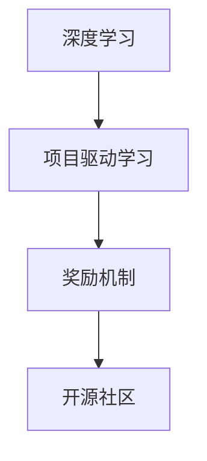

                 

# Andrej Karpathy：通过做项目来获得奖励

## 1. 背景介绍

### 1.1 问题由来
Andrej Karpathy 是深度学习领域的顶级专家，他在Youtube上发布了大量关于深度学习的教学视频，受到了全球机器学习爱好者和学生的广泛欢迎。他的教学风格深入浅出、生动有趣，能够使复杂的概念变得易于理解。

然而，Andrej Karpathy 的许多教学内容并未完全覆盖深度学习的各个方面，特别是如何在实际项目中进行深度学习的应用。这一领域的复杂性和多样性，使得深度学习项目开发对于初学者来说是一个巨大的挑战。尽管有大量的学习资源，但如何将所学知识应用于实际项目中，仍然是许多人的困扰。

### 1.2 问题核心关键点
针对这一问题，Andrej Karpathy 提出了一种通过做项目来学习深度学习的独特方法，即“通过做项目来获得奖励”。这种方法的核心在于，将深度学习的实际应用转化为一系列小项目，通过解决实际问题来巩固所学知识。通过这种方式，不仅能够使学习者更好地理解深度学习的原理，还能激发学习者的创新能力和实践能力。

## 2. 核心概念与联系

### 2.1 核心概念概述

为了更好地理解“通过做项目来获得奖励”的方法，我们需要介绍几个关键概念：

- **深度学习(Deep Learning)**：一种基于神经网络的大型机器学习技术，能够处理复杂的非线性问题，广泛应用于计算机视觉、自然语言处理、语音识别等领域。
- **项目驱动学习(Project-Based Learning)**：一种基于实践的学习方法，通过实际项目的完成来增强学习者的理解和技能。
- **奖励机制(Reward Mechanism)**：通过设置激励措施，鼓励学习者积极参与项目开发，提升学习动力。
- **开源社区(Open Source Community)**：一个开放的平台，允许任何人共享和协作开发代码、文档和数据，促进知识和技术的传播。

这些核心概念之间的联系通过以下Mermaid流程图来展示：



这个流程图展示了这个学习方法的核心逻辑：

1. 深度学习技术是项目驱动学习的核心工具。
2. 奖励机制提供动力，鼓励学习者参与项目。
3. 开源社区提供平台，促进知识的共享和协作。

## 3. 核心算法原理 & 具体操作步骤
### 3.1 算法原理概述

“通过做项目来获得奖励”的方法，本质上是将深度学习的理论和实践相结合，通过实际项目的完成来增强学习者的理解。其核心思想是，将深度学习的学习过程分解为一系列小项目，每个项目解决一个实际问题。通过解决这些小问题，学习者能够逐步掌握深度学习的各种技能和技巧。

### 3.2 算法步骤详解

以下是“通过做项目来获得奖励”的具体操作步骤：

**Step 1: 确定项目目标**
- 确定项目的目标，如构建一个图像分类器、实现一个聊天机器人、设计一个游戏AI等。目标应该是具体、可实现、可衡量的。

**Step 2: 选择项目工具和数据集**
- 根据项目目标选择合适的深度学习框架和数据集。例如，对于图像分类器，可以选择TensorFlow或PyTorch，并使用CIFAR-10或ImageNet等数据集。

**Step 3: 设计与实现**
- 设计项目的详细方案，包括模型架构、训练流程、评估指标等。
- 使用代码实现方案，通过编程语言（如Python）和深度学习框架（如TensorFlow、PyTorch）实现模型的设计和训练。

**Step 4: 测试与优化**
- 在测试集上评估模型性能，调整模型参数、训练轮数、优化器等超参数，以提升模型效果。
- 通过交叉验证、调参等技术手段，优化模型，使其在实际问题上表现更好。

**Step 5: 分享与反馈**
- 将项目代码和文档上传到开源社区，接受社区其他成员的反馈和改进建议。
- 参与社区讨论，分享自己的经验和教训，与其他学习者交流。

**Step 6: 反思与改进**
- 总结项目中的经验教训，分析模型性能提升或下降的原因。
- 根据反馈和反思结果，调整项目方案，进行下一次迭代。

### 3.3 算法优缺点

“通过做项目来获得奖励”的方法具有以下优点：
1. 实践性强。通过实际项目的操作，学习者能够更深刻地理解深度学习的原理和应用。
2. 动力充足。通过设置奖励机制，激励学习者积极参与项目，提升学习兴趣和动力。
3. 社区支持。开源社区提供丰富的资源和交流平台，促进学习者的互助和知识传播。

同时，该方法也存在一定的局限性：
1. 项目规模较小。对于大规模、复杂的问题，单个项目可能难以覆盖所有方面，需要多个项目组合。
2. 项目难度不一。不同项目之间难度差异较大，初学者可能会遇到较大的挑战。
3. 资源依赖。某些项目需要特定的硬件资源（如GPU、TPU）和数据集，可能对学习者造成一定限制。

尽管如此，通过做项目来学习深度学习的方法，仍然是当前最受欢迎和有效的学习方式之一。

### 3.4 算法应用领域

“通过做项目来获得奖励”的方法，已经在多个深度学习应用领域得到了广泛应用，包括但不限于：

- **计算机视觉**：如图像分类、目标检测、图像分割等任务。
- **自然语言处理**：如文本分类、情感分析、机器翻译等任务。
- **语音识别**：如自动语音识别、语音合成等任务。
- **游戏AI**：如自动生成游戏策略、角色控制等任务。
- **推荐系统**：如用户行为分析、商品推荐等任务。

## 4. 数学模型和公式 & 详细讲解  
### 4.1 数学模型构建

在“通过做项目来获得奖励”的方法中，我们不需要构建复杂的数学模型。项目的核心在于解决实际问题，因此主要涉及深度学习框架和工具的使用，而不是数学模型的构建。

### 4.2 公式推导过程

由于不涉及数学模型的推导，因此本节无需进行公式推导。

### 4.3 案例分析与讲解

下面以图像分类为例，简要介绍如何使用“通过做项目来获得奖励”的方法。

假设我们要构建一个图像分类器，用于识别手写数字图片。

**Step 1: 确定项目目标**
- 项目目标是构建一个能够准确识别手写数字图像的分类器。

**Step 2: 选择项目工具和数据集**
- 选择TensorFlow框架，使用MNIST数据集进行训练。

**Step 3: 设计与实现**
- 设计卷积神经网络(CNN)模型，包括卷积层、池化层、全连接层等。
- 使用Python和TensorFlow编写代码，实现模型的设计和训练。

**Step 4: 测试与优化**
- 在测试集上评估模型性能，调整超参数（如学习率、批大小）以提升模型效果。
- 使用交叉验证等技术手段优化模型。

**Step 5: 分享与反馈**
- 将项目代码上传到GitHub，接受社区成员的反馈和改进建议。
- 参与社区讨论，分享自己的经验和教训。

**Step 6: 反思与改进**
- 总结项目中的经验教训，分析模型性能提升或下降的原因。
- 根据反馈和反思结果，调整项目方案，进行下一次迭代。

## 5. 项目实践：代码实例和详细解释说明
### 5.1 开发环境搭建

在进行项目实践前，我们需要准备好开发环境。以下是使用Python进行TensorFlow开发的环境配置流程：

1. 安装Anaconda：从官网下载并安装Anaconda，用于创建独立的Python环境。

2. 创建并激活虚拟环境：
```bash
conda create -n tf-env python=3.8 
conda activate tf-env
```

3. 安装TensorFlow：根据CUDA版本，从官网获取对应的安装命令。例如：
```bash
conda install tensorflow -c conda-forge
```

4. 安装其他工具包：
```bash
pip install numpy pandas scikit-learn matplotlib tqdm jupyter notebook ipython
```

完成上述步骤后，即可在`tf-env`环境中开始项目实践。

### 5.2 源代码详细实现

以下是使用TensorFlow实现图像分类器的完整代码实现：

```python
import tensorflow as tf
from tensorflow.keras.datasets import mnist
from tensorflow.keras.models import Sequential
from tensorflow.keras.layers import Conv2D, MaxPooling2D, Flatten, Dense

# 加载MNIST数据集
(x_train, y_train), (x_test, y_test) = mnist.load_data()

# 数据预处理
x_train = x_train.reshape(-1, 28, 28, 1).astype('float32') / 255.0
x_test = x_test.reshape(-1, 28, 28, 1).astype('float32') / 255.0
y_train = tf.keras.utils.to_categorical(y_train, num_classes=10)
y_test = tf.keras.utils.to_categorical(y_test, num_classes=10)

# 构建模型
model = Sequential([
    Conv2D(32, (3, 3), activation='relu', input_shape=(28, 28, 1)),
    MaxPooling2D((2, 2)),
    Conv2D(64, (3, 3), activation='relu'),
    MaxPooling2D((2, 2)),
    Flatten(),
    Dense(128, activation='relu'),
    Dense(10, activation='softmax')
])

# 编译模型
model.compile(optimizer='adam', loss='categorical_crossentropy', metrics=['accuracy'])

# 训练模型
model.fit(x_train, y_train, epochs=10, batch_size=64, validation_data=(x_test, y_test))

# 评估模型
model.evaluate(x_test, y_test)
```

### 5.3 代码解读与分析

让我们再详细解读一下关键代码的实现细节：

**数据预处理**：
- 将MNIST数据集的图像和标签分别进行预处理，包括将图像数据归一化到0-1之间，将标签进行one-hot编码。

**模型构建**：
- 使用Sequential模型定义卷积神经网络架构，包括两个卷积层、两个池化层和两个全连接层。

**模型编译**：
- 使用Adam优化器和交叉熵损失函数，编译模型。

**模型训练**：
- 使用训练集对模型进行训练，设置10个epoch和64个样本批次。

**模型评估**：
- 使用测试集对模型进行评估，输出准确率。

可以看到，通过做项目来学习深度学习的方法，不仅能够掌握具体的编程技能，还能理解深度学习的核心原理和实际应用。

## 6. 实际应用场景
### 6.1 智能客服系统

基于深度学习的智能客服系统，可以广泛应用于企业内部客服场景，提高客服效率和服务质量。通过实际项目的操作，学习者可以更好地理解深度学习在自然语言处理中的应用，如文本分类、情感分析等。

在技术实现上，可以收集企业内部的客服对话记录，构建监督数据集，对预训练的深度学习模型进行微调。微调后的模型能够自动理解用户意图，匹配最合适的回答模板，生成自然流畅的回复，提升客服系统的智能水平。

### 6.2 金融舆情监测

金融机构需要实时监测市场舆论动向，以便及时应对负面信息传播，规避金融风险。通过实际项目的操作，学习者可以深入理解深度学习在文本分类和情感分析中的应用，如使用LSTM模型进行情感分类，构建舆情监测系统。

具体而言，可以收集金融领域相关的新闻、报道、评论等文本数据，并对其进行情感标注。在此基础上对预训练深度学习模型进行微调，使其能够自动判断文本的情感倾向。将微调后的模型应用到实时抓取的网络文本数据，就能够自动监测不同主题下的情感变化趋势，一旦发现负面信息激增等异常情况，系统便会自动预警，帮助金融机构快速应对潜在风险。

### 6.3 个性化推荐系统

当前的推荐系统往往只依赖用户的历史行为数据进行物品推荐，无法深入理解用户的真实兴趣偏好。通过实际项目的操作，学习者可以理解深度学习在用户行为分析和个性化推荐中的应用，如使用协同过滤和深度学习相结合的推荐系统。

在实践中，可以收集用户浏览、点击、评论、分享等行为数据，提取和用户交互的物品标题、描述、标签等文本内容。将文本内容作为模型输入，用户的后续行为（如是否点击、购买等）作为监督信号，在此基础上微调深度学习模型。微调后的模型能够从文本内容中准确把握用户的兴趣点，设计更加全面、个性化的推荐策略，提升推荐效果。

### 6.4 未来应用展望

随着深度学习技术的不断演进，通过做项目来学习深度学习的方法，将在更多领域得到应用，为各行各业带来变革性影响。

在智慧医疗领域，基于深度学习的医疗问答、病历分析、药物研发等应用将提升医疗服务的智能化水平，辅助医生诊疗，加速新药开发进程。

在智能教育领域，深度学习技术可应用于作业批改、学情分析、知识推荐等方面，因材施教，促进教育公平，提高教学质量。

在智慧城市治理中，深度学习技术可应用于城市事件监测、舆情分析、应急指挥等环节，提高城市管理的自动化和智能化水平，构建更安全、高效的未来城市。

此外，在企业生产、社会治理、文娱传媒等众多领域，基于深度学习的项目开发将不断涌现，为经济社会发展注入新的动力。相信随着深度学习技术的日益成熟，通过做项目来学习深度学习的方法，必将在构建人机协同的智能时代中扮演越来越重要的角色。

## 7. 工具和资源推荐
### 7.1 学习资源推荐

为了帮助开发者系统掌握深度学习理论基础和实践技巧，这里推荐一些优质的学习资源：

1. TensorFlow官方文档：提供全面的TensorFlow教程和API文档，帮助开发者快速上手深度学习项目。

2. PyTorch官方文档：提供全面的PyTorch教程和API文档，帮助开发者掌握深度学习框架的使用。

3. Deep Learning Specialization（吴恩达深度学习课程）：斯坦福大学开设的深度学习系列课程，涵盖深度学习基础、卷积神经网络、循环神经网络、深度学习应用等。

4. Fast.ai：提供深度学习框架FastAI的使用教程和实践项目，帮助开发者快速上手深度学习项目。

5. Kaggle：全球最大的数据科学竞赛平台，提供丰富的数据集和深度学习竞赛项目，帮助开发者提升深度学习实战能力。

通过对这些资源的学习实践，相信你一定能够快速掌握深度学习技术，并用于解决实际的NLP问题。

### 7.2 开发工具推荐

高效的开发离不开优秀的工具支持。以下是几款用于深度学习项目开发的常用工具：

1. TensorFlow：由Google主导开发的开源深度学习框架，生产部署方便，适合大规模工程应用。

2. PyTorch：基于Python的开源深度学习框架，灵活动态的计算图，适合快速迭代研究。

3. Jupyter Notebook：开源的交互式编程环境，支持多种编程语言，适合数据科学和机器学习项目开发。

4. Anaconda：Python科学计算平台，提供了丰富的Python包和环境管理工具，适合深度学习项目的开发和管理。

5. Git：版本控制系统，支持多人协作开发，适合项目管理。

6. GitHub：全球最大的开源社区，提供代码托管、版本控制和协作开发平台，适合深度学习项目的共享和交流。

合理利用这些工具，可以显著提升深度学习项目的开发效率，加快创新迭代的步伐。

### 7.3 相关论文推荐

深度学习技术的发展源于学界的持续研究。以下是几篇奠基性的相关论文，推荐阅读：

1. AlexNet：ImageNet大规模视觉识别挑战赛的冠军算法，开创了深度卷积神经网络的时代。

2. Inception：提出Inception模块和Inception网络，提升了卷积神经网络的深度和效率。

3. ResNet：提出残差网络，解决了深度网络中的梯度消失和退化问题。

4. LSTM：提出长短期记忆网络，解决了序列数据的建模问题。

5. Transformer：提出自注意力机制，提升了序列建模的效果。

这些论文代表了大规模深度学习模型的发展脉络。通过学习这些前沿成果，可以帮助研究者把握学科前进方向，激发更多的创新灵感。

## 8. 总结：未来发展趋势与挑战

### 8.1 总结

本文对通过做项目来学习深度学习的“通过做项目来获得奖励”的方法进行了全面系统的介绍。首先阐述了深度学习在NLP应用中的重要性，明确了通过项目实践来学习深度学习的独特价值。其次，从原理到实践，详细讲解了深度学习项目开发的具体步骤，给出了深度学习项目开发的完整代码实例。同时，本文还广泛探讨了深度学习项目在智能客服、金融舆情、个性化推荐等多个行业领域的应用前景，展示了深度学习项目开发的巨大潜力。此外，本文精选了深度学习项目的各类学习资源，力求为读者提供全方位的技术指引。

通过本文的系统梳理，可以看到，通过做项目来学习深度学习的方法，已经在NLP领域得到了广泛的应用，为深度学习技术的发展和普及提供了有力支持。未来，伴随深度学习技术的不断进步，通过做项目来学习深度学习的方法，必将引领深度学习技术迈向更高的台阶，为构建安全、可靠、可解释、可控的智能系统铺平道路。

### 8.2 未来发展趋势

展望未来，深度学习项目开发技术将呈现以下几个发展趋势：

1. 技术工具更加丰富。未来的深度学习项目开发将借助更多先进工具，如TensorFlow、PyTorch、Jupyter Notebook等，提升开发效率。

2. 应用场景更加广泛。深度学习技术将进一步拓展到更多领域，如智慧医疗、智能教育、智慧城市等，为各行各业带来变革性影响。

3. 数据处理更加高效。随着数据处理技术的不断进步，深度学习项目将能够处理更大量的数据，获得更丰富的特征信息。

4. 模型优化更加精细。未来的深度学习项目将更加注重模型优化，通过改进模型架构、优化超参数等手段，提升模型效果。

5. 应用落地更加便捷。深度学习项目将借助云平台、容器化、微服务化等技术手段，提升应用的部署和运维效率。

6. 社区协作更加紧密。未来的深度学习项目开发将更加依赖开源社区的协作和交流，促进知识的传播和共享。

以上趋势凸显了深度学习项目开发技术的广阔前景。这些方向的探索发展，必将进一步提升深度学习技术的实用性，推动深度学习技术在更多场景中的应用。

### 8.3 面临的挑战

尽管深度学习项目开发技术已经取得了显著进展，但在迈向更加智能化、普适化应用的过程中，它仍面临着诸多挑战：

1. 计算资源需求高。深度学习项目往往需要大量的计算资源，如GPU、TPU等高性能设备，对硬件设施的依赖较大。

2. 数据标注成本高。深度学习项目通常需要大量的标注数据，标注成本较高。如何降低数据标注成本，提高数据标注质量，是一大难题。

3. 模型泛化能力不足。深度学习模型往往容易出现过拟合现象，泛化能力不足。如何在保证模型精度的同时，提升模型的泛化能力，是亟需解决的问题。

4. 可解释性不足。深度学习模型的决策过程通常缺乏可解释性，难以对其推理逻辑进行分析和调试。如何赋予深度学习模型更强的可解释性，是亟需解决的问题。

5. 安全性和隐私保护。深度学习模型在处理敏感数据时，可能存在数据泄露和隐私保护的风险。如何保障深度学习模型的安全性和隐私保护，是亟需解决的问题。

6. 模型集成与优化。深度学习项目通常需要集成多个模型，进行模型调优和融合，提升系统的整体性能。如何在模型集成与优化方面取得突破，是亟需解决的问题。

正视深度学习项目开发技术面临的这些挑战，积极应对并寻求突破，将使深度学习技术更加成熟，推动深度学习技术在更多场景中的应用。

### 8.4 研究展望

面对深度学习项目开发技术所面临的挑战，未来的研究需要在以下几个方面寻求新的突破：

1. 探索高效计算资源。开发高效计算模型和算法，降低对高性能设备的依赖，提升深度学习项目的计算效率。

2. 开发高效标注技术。开发高效的数据标注方法和工具，降低深度学习项目的数据标注成本，提升标注数据的质量。

3. 研究模型泛化方法。开发高效泛化算法和技术，提升深度学习模型的泛化能力，减少过拟合现象。

4. 提升模型可解释性。开发可解释性强的深度学习模型和工具，增强深度学习模型的决策过程的可解释性，提升模型的透明度和可信度。

5. 保障数据安全隐私。开发安全的数据处理和保护技术，确保深度学习模型的数据安全性和隐私保护，避免数据泄露和滥用。

6. 优化模型集成与融合。开发高效模型集成与融合技术，提升深度学习系统的整体性能，确保系统的高效性和稳定性。

这些研究方向的探索，必将引领深度学习项目开发技术迈向更高的台阶，为深度学习技术的发展和应用提供有力支持。

## 9. 附录：常见问题与解答

**Q1：深度学习项目开发需要哪些关键技术？**

A: 深度学习项目开发需要掌握以下关键技术：
1. 深度学习框架：如TensorFlow、PyTorch等，掌握框架的基本使用方法和API。
2. 数据处理技术：如数据清洗、数据增强、数据集划分等，提升数据处理效率。
3. 模型构建技术：如卷积神经网络、循环神经网络、注意力机制等，掌握模型设计原理。
4. 模型优化技术：如梯度下降、正则化、批标准化等，提升模型效果和泛化能力。
5. 模型评估技术：如交叉验证、测试集评估、模型调优等，评估模型性能。

**Q2：深度学习项目开发中如何处理过拟合问题？**

A: 过拟合是深度学习项目开发中的常见问题，可以通过以下方法处理：
1. 数据增强：通过数据扩充、数据增强等手段，提升数据的多样性。
2. 正则化技术：如L2正则、Dropout等，限制模型复杂度。
3. 早停机制：在验证集上监控模型性能，及时停止训练，防止过拟合。
4. 批标准化：通过批标准化技术，提升模型泛化能力。
5. 模型集成：通过集成多个模型，提升模型的泛化能力。

**Q3：深度学习项目开发中如何提高模型性能？**

A: 提高模型性能可以从以下几个方面入手：
1. 增加数据量：通过数据扩充、数据增强等手段，提升数据的多样性。
2. 优化模型架构：通过改进模型结构、优化超参数等手段，提升模型效果。
3. 应用预训练模型：通过迁移学习、预训练等手段，提升模型的泛化能力。
4. 模型集成：通过集成多个模型，提升模型的泛化能力。
5. 引入先验知识：通过引入领域知识、规则库等专家知识，提升模型的性能和可解释性。

**Q4：深度学习项目开发中如何降低计算资源消耗？**

A: 降低计算资源消耗可以从以下几个方面入手：
1. 模型裁剪：去除不必要的层和参数，减小模型尺寸，加快推理速度。
2. 量化加速：将浮点模型转为定点模型，压缩存储空间，提高计算效率。
3. 模型并行：通过分布式训练、模型并行等手段，提升计算效率。
4. 模型压缩：通过压缩模型参数、剪枝等手段，减小模型内存占用。

**Q5：深度学习项目开发中如何提高模型的可解释性？**

A: 提高模型的可解释性可以从以下几个方面入手：
1. 使用可解释性强的模型：如线性模型、决策树等，提升模型的透明度。
2. 使用可解释性工具：如LIME、SHAP等，分析模型的决策过程。
3. 引入先验知识：通过引入领域知识、规则库等专家知识，提升模型的可解释性。
4. 开发可解释性模型：通过开发可解释性强的深度学习模型，提升模型的透明度和可信度。

**Q6：深度学习项目开发中如何保障数据安全隐私？**

A: 保障数据安全隐私可以从以下几个方面入手：
1. 数据加密：对数据进行加密处理，防止数据泄露。
2. 访问控制：对数据进行严格的访问控制，确保数据安全。
3. 隐私保护技术：采用隐私保护技术，如差分隐私、联邦学习等，保护用户隐私。
4. 安全审计：定期进行安全审计，确保数据安全。

通过解决这些问题，可以帮助深度学习项目开发人员更好地应对实际问题，提升项目的开发效率和成功率。

---

作者：禅与计算机程序设计艺术 / Zen and the Art of Computer Programming

