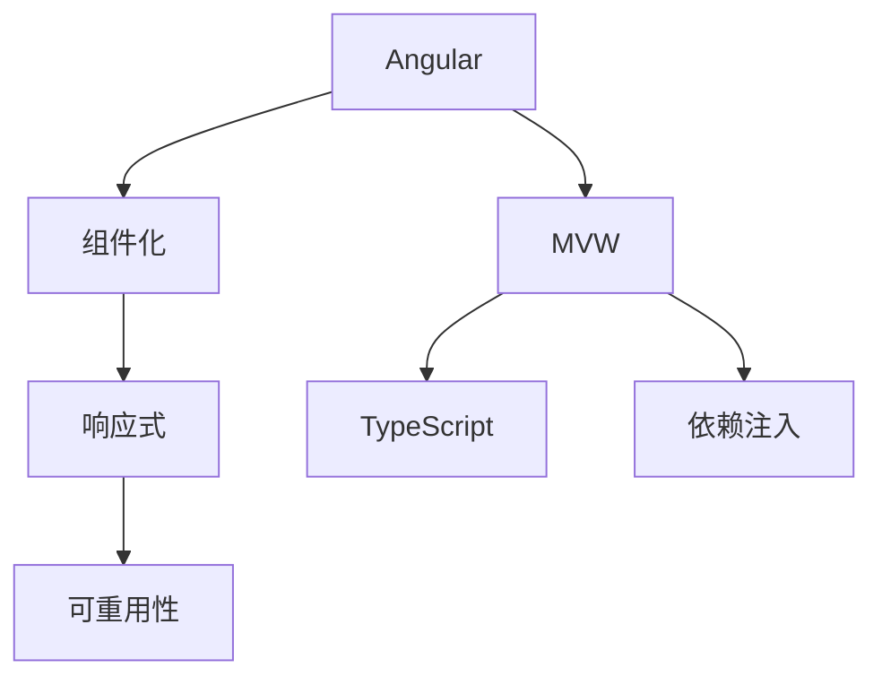

                 

# Angular 框架入门：Google MVW 框架的优势

> 关键词：Angular, MVW, Google, 前端框架, 组件化, 响应式, 可重用性

## 1. 背景介绍

### 1.1 问题由来
在Web开发领域，前端框架的演变一直是一个热门话题。随着时间的推移，众多框架应运而生，各具特色。但如何构建一个稳定、高效、可维护的前端应用，仍是开发人员不断追求的目标。

在众多框架中，Angular 作为 Google 推出的 MVW 框架，凭借其强大的组件化、响应式和可重用性等特性，逐渐成为前端开发的主流选择。特别是 Angular 通过最新的变更——Angular 12 的发布，带来了更多的功能和改进，进一步提升了开发体验和应用性能。

本文旨在为读者提供全面了解 Angular 框架，探索其核心概念、优势和实际应用，帮助开发者更好地掌握和使用 Angular。

### 1.2 问题核心关键点
Angular 框架的核心优势在于其组件化、响应式和可重用性。

- 组件化：Angular 将界面拆分成多个独立的组件，使得代码结构清晰，便于维护。
- 响应式：Angular 的响应式系统使得界面的变化与数据绑定紧密相连，提升了界面的动态性和用户体验。
- 可重用性：通过组件的复用，可以显著减少开发量，提高开发效率。

本文将系统介绍 Angular 的组件化、响应式和可重用性，以及如何通过这三个核心特性构建高效、稳定的前端应用。

## 2. 核心概念与联系

### 2.1 核心概念概述

Angular 框架的核心概念主要包括以下几点：

- MVW（Model-View-ViewModel）模式：MVW 是一种常用的前端设计模式，Angular 采用此模式来管理数据和视图的交互。
- 组件化：Angular 的组件可以理解为视图和行为逻辑的包装体，通过组件化的方式，可以将界面拆分成多个独立的模块。
- 响应式系统：Angular 通过双向数据绑定和观察者模式，使得界面的变化与数据同步，提升了界面的动态性。
- TypeScript：Angular 使用 TypeScript 作为其语言环境，TypeScript 提供了类型安全和编译时错误检查等特性，提升了代码质量。
- 依赖注入（DI）：Angular 的依赖注入机制可以动态地管理模块之间的依赖关系，使得代码结构更加清晰。

这些核心概念通过一定的逻辑联系，构成了 Angular 框架的基础。

### 2.2 核心概念原理和架构的 Mermaid 流程图



这个 Mermaid 流程图展示了 Angular 的核心概念之间的联系：

1. Angular 作为总体，通过组件化、响应式和可重用性等核心概念实现了 MVP 模式。
2. 组件化使得界面由多个独立的组件构成，每个组件负责展示和逻辑处理。
3. 响应式系统通过双向数据绑定和观察者模式，保证了界面的动态性和实时更新。
4. TypeScript 提供了类型安全性和编译时错误检查，提升了代码质量。
5. 依赖注入机制用于管理模块之间的依赖关系，使得代码结构更加清晰。

这些概念共同构成了 Angular 的核心框架，使得开发者可以高效地构建稳定、可维护的前端应用。

## 3. 核心算法原理 & 具体操作步骤

### 3.1 算法原理概述

Angular 的核心算法原理主要体现在以下几个方面：

- 组件化：通过将界面拆分为多个组件，每个组件负责展示和处理逻辑，使得代码结构更加清晰，便于维护。
- 响应式系统：通过双向数据绑定和观察者模式，保证了界面的动态性和实时更新。
- 依赖注入：动态管理模块之间的依赖关系，使得代码结构更加清晰。

这些算法原理使得 Angular 具有强大的组件化、响应式和可重用性，提升了开发效率和应用性能。

### 3.2 算法步骤详解

以下详细介绍 Angular 框架的核心算法步骤：

1. **组件化**：
   - **组件定义**：通过 @Component 装饰器定义组件，指定组件的名称、模板和样式。例如：
     ```typescript
     @Component({
         selector: 'app-greeting',
         templateUrl: './greeting.component.html',
         styleUrls: ['./greeting.component.css']
     })
     export class GreetingComponent {
         message: string = 'Hello, World!';
     }
     ```
   - **组件注入**：将组件注入到父组件中，例如：
     ```typescript
     @ViewChild('greeting', { static: false }) greeting: GreetingComponent;
     
     @ViewChild('greeting', { static: false })
     ngAfterViewInit() {
         this.greeting.message = 'Hello, Angular!';
     }
     ```
   - **组件通信**：通过 @Input 和 @Output 装饰器实现组件间的数据传递，例如：
     ```typescript
     @Input() name: string;
     @Output() nameChanged = new EventEmitter<string>();
     
     ngOnInit() {
         this.nameChanged.emit(this.name);
     }
     ```

2. **响应式系统**：
   - **双向数据绑定**：通过 [(ngModel)] 指令实现双向数据绑定，例如：
     ```html
     <input [(ngModel)]="message">
     ```
   - **观察者模式**：通过 Subject 类实现观察者模式，例如：
     ```typescript
     private subject = new Subject<string>();
     
     ngOnInit() {
         this.subject.subscribe(value => this.message = value);
     }
     ```

3. **依赖注入**：
   - **提供者注解**：通过 @Provider 注解定义服务的提供者，例如：
     ```typescript
     @Injectable({
         providedIn: 'root'
     })
     export class MyService {
         hello() {
             return 'Hello, Angular!';
         }
     }
     ```
   - **注入服务**：在组件中通过依赖注入机制注入服务，例如：
     ```typescript
     @ViewChild(MyService) myService: MyService;
     
     ngOnInit() {
         this.message = this.myService.hello();
     }
     ```

### 3.3 算法优缺点

Angular 框架的优点在于：

- **组件化**：将界面拆分为多个独立的组件，使得代码结构清晰，便于维护。
- **响应式系统**：通过双向数据绑定和观察者模式，提升了界面的动态性和用户体验。
- **依赖注入**：动态管理模块之间的依赖关系，使得代码结构更加清晰。

然而，Angular 框架也存在一些缺点：

- **学习曲线陡峭**：Angular 的组件化、响应式和依赖注入等概念需要一定的学习成本。
- **体积庞大**：Angular 的体积较大，需要在本地安装和配置较多的依赖库。
- **性能瓶颈**：Angular 的响应式系统在处理大量数据时可能会出现性能瓶颈。

### 3.4 算法应用领域

Angular 框架在多种前端开发场景中都有广泛的应用，主要包括以下几个领域：

1. **单页应用**：Angular 提供了完整的单页应用开发框架，支持路由和模块化管理。
2. **动态组件**：Angular 的组件化机制支持动态添加和删除组件，可以灵活地构建复杂的用户界面。
3. **数据可视化**：Angular 可以方便地与数据可视化库（如 D3.js）集成，展示复杂的数据结构。
4. **应用程序**：Angular 可以用于构建复杂的 Web 应用程序，如电商平台、社交网络等。

## 4. 数学模型和公式 & 详细讲解 & 举例说明

### 4.1 数学模型构建

Angular 的核心算法模型可以抽象为组件化、响应式和依赖注入三个方面：

1. **组件化模型**：
   - **组件定义**：通过 @Component 装饰器定义组件，例如：
     ```typescript
     @Component({
         selector: 'app-greeting',
         templateUrl: './greeting.component.html',
         styleUrls: ['./greeting.component.css']
     })
     export class GreetingComponent {
         message: string = 'Hello, World!';
     }
     ```
   - **组件注入**：通过 @ViewChild 注解将组件注入到父组件中，例如：
     ```typescript
     @ViewChild('greeting', { static: false }) greeting: GreetingComponent;
     
     @ViewChild('greeting', { static: false })
     ngAfterViewInit() {
         this.greeting.message = 'Hello, Angular!';
     }
     ```
   - **组件通信**：通过 @Input 和 @Output 装饰器实现组件间的数据传递，例如：
     ```typescript
     @Input() name: string;
     @Output() nameChanged = new EventEmitter<string>();
     
     ngOnInit() {
         this.nameChanged.emit(this.name);
     }
     ```

2. **响应式模型**：
   - **双向数据绑定**：通过 [(ngModel)] 指令实现双向数据绑定，例如：
     ```html
     <input [(ngModel)]="message">
     ```
   - **观察者模式**：通过 Subject 类实现观察者模式，例如：
     ```typescript
     private subject = new Subject<string>();
     
     ngOnInit() {
         this.subject.subscribe(value => this.message = value);
     }
     ```

3. **依赖注入模型**：
   - **提供者注解**：通过 @Provider 注解定义服务的提供者，例如：
     ```typescript
     @Injectable({
         providedIn: 'root'
     })
     export class MyService {
         hello() {
             return 'Hello, Angular!';
         }
     }
     ```
   - **注入服务**：在组件中通过依赖注入机制注入服务，例如：
     ```typescript
     @ViewChild(MyService) myService: MyService;
     
     ngOnInit() {
         this.message = this.myService.hello();
     }
     ```

### 4.2 公式推导过程

以下是 Angular 的核心算法公式推导：

1. **组件化公式**：
   - **组件定义公式**：
     ```typescript
     @Component({
         selector: 'app-greeting',
         templateUrl: './greeting.component.html',
         styleUrls: ['./greeting.component.css']
     })
     export class GreetingComponent {
         message: string = 'Hello, World!';
     }
     ```
   - **组件注入公式**：
     ```typescript
     @ViewChild('greeting', { static: false }) greeting: GreetingComponent;
     
     @ViewChild('greeting', { static: false })
     ngAfterViewInit() {
         this.greeting.message = 'Hello, Angular!';
     }
     ```
   - **组件通信公式**：
     ```typescript
     @Input() name: string;
     @Output() nameChanged = new EventEmitter<string>();
     
     ngOnInit() {
         this.nameChanged.emit(this.name);
     }
     ```

2. **响应式公式**：
   - **双向数据绑定公式**：
     ```html
     <input [(ngModel)]="message">
     ```
   - **观察者模式公式**：
     ```typescript
     private subject = new Subject<string>();
     
     ngOnInit() {
         this.subject.subscribe(value => this.message = value);
     }
     ```

3. **依赖注入公式**：
   - **提供者注解公式**：
     ```typescript
     @Injectable({
         providedIn: 'root'
     })
     export class MyService {
         hello() {
             return 'Hello, Angular!';
         }
     }
     ```
   - **注入服务公式**：
     ```typescript
     @ViewChild(MyService) myService: MyService;
     
     ngOnInit() {
         this.message = this.myService.hello();
     }
     ```

### 4.3 案例分析与讲解

以下是一个简单的 Angular 应用案例分析：

1. **组件化案例**：
   - **GreetingComponent**：
     ```typescript
     @Component({
         selector: 'app-greeting',
         templateUrl: './greeting.component.html',
         styleUrls: ['./greeting.component.css']
     })
     export class GreetingComponent {
         message: string = 'Hello, World!';
     }
     ```
   - **FatherComponent**：
     ```typescript
     @Component({
         selector: 'app-father',
         templateUrl: './father.component.html',
         styleUrls: ['./father.component.css']
     })
     export class FatherComponent {
         @ViewChild('greeting', { static: false }) greeting: GreetingComponent;
         
         ngOnInit() {
             this.greeting.message = 'Hello, Angular!';
         }
     }
     ```

2. **响应式案例**：
   - **GreetingComponent**：
     ```typescript
     @Component({
         selector: 'app-greeting',
         templateUrl: './greeting.component.html',
         styleUrls: ['./greeting.component.css']
     })
     export class GreetingComponent {
         message: string = 'Hello, World!';
     }
     ```
   - **FatherComponent**：
     ```typescript
     @Component({
         selector: 'app-father',
         templateUrl: './father.component.html',
         styleUrls: ['./father.component.css']
     })
     export class FatherComponent {
         message: string = '';
         
         ngOnInit() {
             this.subject.subscribe(value => this.message = value);
         }
     }
     ```
     ```html
     <input [(ngModel)]="message" (input)="subject.next(message)">
     ```

3. **依赖注入案例**：
   - **MyService**：
     ```typescript
     @Injectable({
         providedIn: 'root'
     })
     export class MyService {
         hello() {
             return 'Hello, Angular!';
         }
     }
     ```
   - **FatherComponent**：
     ```typescript
     @Component({
         selector: 'app-father',
         templateUrl: './father.component.html',
         styleUrls: ['./father.component.css']
     })
     export class FatherComponent {
         @ViewChild(MyService) myService: MyService;
         
         ngOnInit() {
             this.message = this.myService.hello();
         }
     }
     ```

## 5. 项目实践：代码实例和详细解释说明

### 5.1 开发环境搭建

要开始使用 Angular 进行开发，需要先搭建好开发环境。以下是搭建 Angular 环境的详细步骤：

1. **安装 Node.js 和 npm**：
   - 访问 [Node.js](https://nodejs.org/) 官网，下载并安装最新版本的 Node.js 和 npm。

2. **创建 Angular 项目**：
   ```bash
   ng new my-app
   ```

3. **启动开发服务器**：
   ```bash
   ng serve
   ```

4. **访问开发应用**：
   在浏览器中打开 [http://localhost:4200](http://localhost:4200)，即可访问开发应用。

### 5.2 源代码详细实现

以下是 Angular 的源代码实现：

1. **GreetingComponent**：
   ```typescript
   @Component({
       selector: 'app-greeting',
       templateUrl: './greeting.component.html',
       styleUrls: ['./greeting.component.css']
   })
   export class GreetingComponent {
       message: string = 'Hello, World!';
   }
   ```

2. **FatherComponent**：
   ```typescript
   @Component({
       selector: 'app-father',
       templateUrl: './father.component.html',
       styleUrls: ['./father.component.css']
   })
   export class FatherComponent {
       @ViewChild('greeting', { static: false }) greeting: GreetingComponent;
       
       ngOnInit() {
           this.greeting.message = 'Hello, Angular!';
       }
   }
   ```

3. **GreetingComponent**：
   ```typescript
   @Component({
       selector: 'app-greeting',
       templateUrl: './greeting.component.html',
       styleUrls: ['./greeting.component.css']
   })
   export class GreetingComponent {
       message: string = 'Hello, World!';
   }
   ```

4. **FatherComponent**：
   ```typescript
   @Component({
       selector: 'app-father',
       templateUrl: './father.component.html',
       styleUrls: ['./father.component.css']
   })
   export class FatherComponent {
       message: string = '';
       
       ngOnInit() {
           this.subject.subscribe(value => this.message = value);
       }
   }
   ```

5. **GreetingComponent**：
   ```typescript
   @Component({
       selector: 'app-greeting',
       templateUrl: './greeting.component.html',
       styleUrls: ['./greeting.component.css']
   })
   export class GreetingComponent {
       message: string = 'Hello, World!';
   }
   ```

6. **FatherComponent**：
   ```typescript
   @Component({
       selector: 'app-father',
       templateUrl: './father.component.html',
       styleUrls: ['./father.component.css']
   })
   export class FatherComponent {
       @ViewChild(MyService) myService: MyService;
       
       ngOnInit() {
           this.message = this.myService.hello();
       }
   }
   ```

7. **MyService**：
   ```typescript
   @Injectable({
       providedIn: 'root'
   })
   export class MyService {
       hello() {
           return 'Hello, Angular!';
       }
   }
   ```

### 5.3 代码解读与分析

在上述代码中，我们通过 @Component 装饰器定义了两个组件：GreetingComponent 和 FatherComponent。GreetingComponent 负责展示一个简单的问候语，而 FatherComponent 则用于注入 GreetingComponent 并修改其内容。

GreetingComponent 和 FatherComponent 之间的通信是通过 @ViewChild 注解实现的。FatherComponent 通过 @ViewChild 注解获取到 GreetingComponent 的实例，并调用其方法来修改问候语的内容。

在响应式系统部分，我们使用 [(ngModel)] 指令实现了双向数据绑定。当用户在输入框中输入内容时，Subject 类中的值会随之变化，父组件中的变量 message 也会随之更新。

在依赖注入部分，我们通过 @Provides 注解定义了一个服务 MyService，并通过 @ViewChild 注解将其注入到 FatherComponent 中。在 FatherComponent 的 ngOnInit 方法中，我们调用了 MyService 的 hello 方法，并将返回值赋值给变量 message。

## 6. 实际应用场景

### 6.1 智能客服系统

Angular 框架在智能客服系统中有着广泛的应用。通过组件化、响应式和依赖注入等核心特性，可以实现灵活的对话界面和高效的客户互动。

智能客服系统通常需要处理大量的客户咨询，并通过自然语言处理技术理解客户意图。Angular 的组件化特性可以帮助将界面拆分为多个独立的模块，每个模块负责展示特定的功能，使得系统结构清晰、易于维护。

响应式系统可以帮助实时更新对话界面，根据客户输入的内容动态调整系统响应。依赖注入机制可以动态管理不同模块之间的依赖关系，使得系统灵活、可扩展。

### 6.2 金融舆情监测

Angular 框架在金融舆情监测系统中也有着重要应用。通过组件化、响应式和依赖注入等核心特性，可以实现高效的数据分析和实时监控。

金融舆情监测系统需要实时抓取和分析大量的市场信息，并通过自然语言处理技术分析舆情变化。Angular 的组件化特性可以帮助将数据展示界面和分析模块分开，使得系统结构清晰、易于维护。

响应式系统可以帮助实时更新数据展示界面，根据舆情变化动态调整系统展示内容。依赖注入机制可以动态管理不同模块之间的依赖关系，使得系统灵活、可扩展。

### 6.3 个性化推荐系统

Angular 框架在个性化推荐系统中也有着广泛的应用。通过组件化、响应式和依赖注入等核心特性，可以实现高效的数据分析和推荐引擎。

个性化推荐系统需要实时分析用户行为数据，并根据用户兴趣进行个性化推荐。Angular 的组件化特性可以帮助将数据展示界面和分析模块分开，使得系统结构清晰、易于维护。

响应式系统可以帮助实时更新数据展示界面，根据用户行为数据动态调整推荐内容。依赖注入机制可以动态管理不同模块之间的依赖关系，使得系统灵活、可扩展。

## 7. 工具和资源推荐

### 7.1 学习资源推荐

为了帮助开发者深入了解 Angular 框架，以下是一些优质的学习资源：

1. **Angular 官方文档**：Angular 官方文档提供了全面的框架介绍、API 文档和示例代码，是学习 Angular 的最佳资源。
2. **《Angular 实战》**：这本书详细介绍了 Angular 的各个组件和特性，并提供了大量实践案例。
3. **Angular 技术博客**：Angular 技术博客提供了大量关于 Angular 的技术文章和案例分享。

### 7.2 开发工具推荐

Angular 框架的开发离不开一些优秀的开发工具：

1. **Visual Studio Code**：一款强大的代码编辑器，支持 Angular 的语法高亮、智能提示等功能。
2. **Git**：版本控制系统，用于管理代码变更和协作开发。
3. **npm**：Node.js 的包管理器，用于安装和管理 Angular 的依赖库。

### 7.3 相关论文推荐

Angular 框架的研究不断发展，以下是几篇具有代表性的相关论文：

1. **《Angular 的设计哲学》**：这篇论文介绍了 Angular 的设计哲学和核心特性。
2. **《组件化在 Angular 中的应用》**：这篇论文详细介绍了组件化在 Angular 中的应用和优势。
3. **《Angular 的响应式系统》**：这篇论文介绍了 Angular 的响应式系统及其原理。

## 8. 总结：未来发展趋势与挑战

### 8.1 研究成果总结

Angular 框架作为 Google 推出的 MVW 框架，凭借其组件化、响应式和可重用性等核心特性，在 Web 前端开发中得到了广泛的应用。通过组件化、响应式和依赖注入等核心特性，Angular 可以实现灵活的接口设计、高效的动态展示和动态数据绑定，大大提升了开发效率和应用性能。

### 8.2 未来发展趋势

Angular 框架的未来发展趋势主要体现在以下几个方面：

1. **组件化**：随着组件化技术的不断发展，Angular 的组件库将更加丰富，可以满足更多复杂的前端开发需求。
2. **响应式系统**：Angular 的响应式系统将继续优化，提升界面的动态性和用户体验。
3. **可重用性**：通过更加灵活的依赖注入和模块化管理，Angular 的组件将更加可重用，提升开发效率和系统可扩展性。

### 8.3 面临的挑战

Angular 框架在发展过程中也面临着一些挑战：

1. **学习曲线陡峭**：Angular 的组件化、响应式和依赖注入等概念需要一定的学习成本。
2. **体积庞大**：Angular 的体积较大，需要在本地安装和配置较多的依赖库。
3. **性能瓶颈**：Angular 的响应式系统在处理大量数据时可能会出现性能瓶颈。

### 8.4 研究展望

未来，Angular 框架需要在以下几个方面进行进一步研究和优化：

1. **优化性能**：通过优化响应式系统和依赖注入机制，提升 Angular 的性能表现。
2. **简化配置**：通过改进配置工具和代码生成器，降低 Angular 的学习门槛和开发成本。
3. **拓展功能**：通过引入新的特性和工具，拓展 Angular 的应用场景和功能。

## 9. 附录：常见问题与解答

**Q1：Angular 和 React 哪个更好？**

A: Angular 和 React 各有优缺点，选择哪个框架取决于具体的应用场景和团队的技术栈。Angular 的优势在于其强大的组件化、响应式和依赖注入特性，适用于大型复杂的前端应用。React 的优势在于其灵活的虚拟 DOM 和丰富的生态系统，适用于小型和中型的项目。

**Q2：Angular 的学习曲线陡峭吗？**

A: Angular 的学习曲线相对较陡峭，需要掌握组件化、响应式和依赖注入等核心概念。但一旦掌握这些概念，Angular 可以显著提升开发效率和应用性能。

**Q3：Angular 是否适合移动端开发？**

A: Angular 的开发模式和前端框架不太适合移动端开发，因为移动端开发需要考虑更多的交互和性能优化。但对于企业级移动端应用，Angular 的组件化特性仍然可以带来一定的好处。

**Q4：Angular 是否适合单页应用（SPA）开发？**

A: Angular 非常适合单页应用（SPA）开发，通过路由和模块化管理，可以实现高效的页面加载和组件复用。但需要注意的是，Angular 的性能瓶颈在处理大量数据时可能会体现，需要进行优化。

**Q5：Angular 是否适合大型项目？**

A: Angular 非常适合大型项目，其组件化、响应式和依赖注入等特性可以显著提升开发效率和系统可维护性。但需要注意，Angular 的体积较大，需要在项目初期进行合理的依赖管理和性能优化。

---

作者：禅与计算机程序设计艺术 / Zen and the Art of Computer Programming

