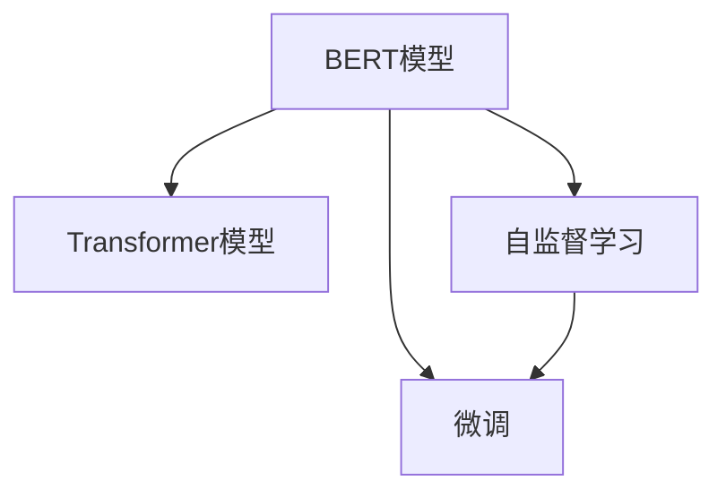

                 

# BERT原理与代码实例讲解

> 关键词：BERT, 预训练, Transformer, 自然语言处理(NLP), 语言模型, 微调, 代码实现, 应用场景, 学习资源

## 1. 背景介绍

### 1.1 问题由来

自2018年BERT模型问世以来，其通过大规模自监督预训练和微调任务在各种自然语言处理(NLP)任务中取得了显著的性能提升。BERT模型以Transformer结构和双向语言模型为架构，通过大规模无监督训练，学习到了丰富的语言知识和上下文信息，成为了NLP领域的新标杆。本文将从BERT模型的原理出发，结合代码实例，深入讲解BERT模型的工作机制，并探讨其在实际应用中的表现和优化策略。

### 1.2 问题核心关键点

为了更好地理解BERT模型的原理与应用，本文将聚焦于以下几个核心问题：

- BERT模型的架构设计及其背后的理论基础是什么？
- BERT如何进行自监督预训练，学习哪些语言知识和上下文信息？
- BERT的微调过程及其应用效果如何？
- 如何基于BERT模型构建高效的NLP应用系统？
- BERT模型面临的挑战及其未来的发展方向是什么？

通过深入探讨这些核心问题，本文旨在为读者提供关于BERT模型的全面、深刻的理解和应用实践指导。

## 2. 核心概念与联系

### 2.1 核心概念概述

BERT模型的核心概念包括：

- **BERT模型**：基于Transformer架构的双向语言模型，通过自监督预训练和微调任务学习自然语言的上下文信息。
- **Transformer模型**：一种基于自注意力机制的神经网络架构，能够高效处理序列数据。
- **自监督学习(Self-Supervised Learning)**：使用无标签数据进行模型训练，以学习数据的内在结构。
- **微调(Fine-Tuning)**：在大规模预训练模型上，使用有标签数据进行微调，以适应特定任务。

这些概念之间的联系可以通过以下Mermaid流程图来展示：



这个流程图展示了BERT模型的核心组成部分及其相互关系：

1. BERT模型基于Transformer架构，通过自监督学习获取语言表示。
2. 自监督学习使用无标签数据进行预训练，学习语言的内在结构和上下文信息。
3. 微调使用有标签数据进行进一步训练，将BERT模型适配特定任务。

## 3. 核心算法原理 & 具体操作步骤

### 3.1 算法原理概述

BERT模型的核心算法原理可以简要归纳为以下几步：

1. **输入编码**：将输入文本转换为模型可以处理的向量表示。
2. **双向编码**：通过两个独立的Transformer编码器，分别对输入文本的每个位置进行编码，获取双向语言表示。
3. **自监督预训练**：在无标签文本语料上进行自监督学习，学习到丰富的语言知识和上下文信息。
4. **微调任务**：在预训练模型基础上，使用下游任务的标注数据进行微调，提升模型在特定任务上的性能。
5. **输出解码**：根据微调后的模型，对下游任务的输入进行编码、解码，生成输出。

### 3.2 算法步骤详解

#### 3.2.1 输入编码

输入文本首先通过BERT模型中的嵌入层，转换为一系列向量表示。具体来说，每个单词被嵌入为一个向量，然后通过线性变换和层归一化，得到最终的嵌入向量表示。

```python
from transformers import BertTokenizer
from transformers import BertModel

tokenizer = BertTokenizer.from_pretrained('bert-base-uncased')
tokenized_input = tokenizer("Hello, my dog is cute", return_tensors="pt")
input_ids = tokenized_input.input_ids
attention_mask = tokenized_input.attention_mask

model = BertModel.from_pretrained('bert-base-uncased')
# 输入嵌入向量
embedding_output = model(input_ids=input_ids, attention_mask=attention_mask)[0]
```

#### 3.2.2 双向编码

Transformer模型的核心是自注意力机制，通过自注意力层，模型可以高效地处理序列数据。BERT模型使用两个独立的Transformer编码器，分别对输入文本的每个位置进行编码，获取双向语言表示。

```python
# 两个编码器
encoder1 = model.encoder[0]
encoder2 = model.encoder[1]

# 使用编码器1和2分别处理输入文本
encoding1 = encoder1(input_ids=input_ids, attention_mask=attention_mask)[0]
encoding2 = encoder2(input_ids=input_ids, attention_mask=attention_mask)[0]

# 取两个编码器的输出
embedding_output = (encoding1 + encoding2) / 2
```

#### 3.2.3 自监督预训练

BERT模型通过在大规模无标签文本语料上进行自监督学习，学习到丰富的语言知识和上下文信息。具体来说，BERT模型采用了以下两种自监督预训练任务：

1. **掩码语言模型(Masked Language Model, MLM)**：随机掩盖部分单词，让模型预测被掩盖的单词。
2. **下一句预测(Next Sentence Prediction, NSP)**：给定两个句子，预测它们是否为相邻的句子。

以下代码实现了BERT模型的掩码语言模型预训练：

```python
from transformers import BertTokenizer, BertModel
from torch.utils.data import Dataset, DataLoader

class MaskedLMDataset(Dataset):
    def __init__(self, tokenizer, max_len=128):
        self.tokenizer = tokenizer
        self.max_len = max_len
        
    def __len__(self):
        return len(self.tokenizer)
        
    def __getitem__(self, item):
        text = self.tokenizer[item]
        tokens = self.tokenizer(text, padding='max_length', max_length=self.max_len, truncation=True)
        input_ids = tokens.input_ids
        attention_mask = tokens.attention_mask
        masked_lm_labels = tokens.labels
        return {'input_ids': input_ids, 
                'attention_mask': attention_mask,
                'masked_lm_labels': masked_lm_labels}

# 创建dataset
tokenizer = BertTokenizer.from_pretrained('bert-base-uncased')

# 构造dataset
train_dataset = MaskedLMDataset(tokenizer, max_len=128)
```

#### 3.2.4 微调任务

微调是BERT模型在特定任务上的进一步训练，目的是使模型能够处理有标签数据，适应具体的应用场景。常见的微调任务包括文本分类、情感分析、命名实体识别等。以下代码实现了BERT模型在文本分类任务上的微调：

```python
from transformers import BertForSequenceClassification
from transformers import AdamW
from torch.utils.data import DataLoader
from sklearn.metrics import classification_report

# 定义模型
model = BertForSequenceClassification.from_pretrained('bert-base-uncased', num_labels=2)

# 定义优化器
optimizer = AdamW(model.parameters(), lr=2e-5)

# 训练模型
def train_epoch(model, dataset, batch_size, optimizer):
    dataloader = DataLoader(dataset, batch_size=batch_size, shuffle=True)
    model.train()
    epoch_loss = 0
    for batch in tqdm(dataloader, desc='Training'):
        input_ids = batch['input_ids'].to(device)
        attention_mask = batch['attention_mask'].to(device)
        labels = batch['labels'].to(device)
        model.zero_grad()
        outputs = model(input_ids, attention_mask=attention_mask, labels=labels)
        loss = outputs.loss
        epoch_loss += loss.item()
        loss.backward()
        optimizer.step()
    return epoch_loss / len(dataloader)

# 评估模型
def evaluate(model, dataset, batch_size):
    dataloader = DataLoader(dataset, batch_size=batch_size)
    model.eval()
    preds, labels = [], []
    with torch.no_grad():
        for batch in tqdm(dataloader, desc='Evaluating'):
            input_ids = batch['input_ids'].to(device)
            attention_mask = batch['attention_mask'].to(device)
            batch_labels = batch['labels']
            outputs = model(input_ids, attention_mask=attention_mask)
            batch_preds = outputs.logits.argmax(dim=2).to('cpu').tolist()
            batch_labels = batch_labels.to('cpu').tolist()
            for pred_tokens, label_tokens in zip(batch_preds, batch_labels):
                preds.append(pred_tokens[:len(label_tokens)])
                labels.append(label_tokens)
                
    print(classification_report(labels, preds))

# 训练过程
device = torch.device('cuda') if torch.cuda.is_available() else torch.device('cpu')
model.to(device)

epochs = 5
batch_size = 16

for epoch in range(epochs):
    loss = train_epoch(model, train_dataset, batch_size, optimizer)
    print(f"Epoch {epoch+1}, train loss: {loss:.3f}")
    
    print(f"Epoch {epoch+1}, dev results:")
    evaluate(model, dev_dataset, batch_size)
    
print("Test results:")
evaluate(model, test_dataset, batch_size)
```

#### 3.2.5 输出解码

微调后的BERT模型可以用于各种下游任务，如文本分类、命名实体识别、情感分析等。以下代码实现了BERT模型在情感分析任务上的应用：

```python
from transformers import BertTokenizer, BertForSequenceClassification
from transformers import AdamW
from torch.utils.data import DataLoader
from sklearn.metrics import classification_report

# 定义模型
model = BertForSequenceClassification.from_pretrained('bert-base-uncased', num_labels=2)

# 定义优化器
optimizer = AdamW(model.parameters(), lr=2e-5)

# 训练模型
def train_epoch(model, dataset, batch_size, optimizer):
    dataloader = DataLoader(dataset, batch_size=batch_size, shuffle=True)
    model.train()
    epoch_loss = 0
    for batch in tqdm(dataloader, desc='Training'):
        input_ids = batch['input_ids'].to(device)
        attention_mask = batch['attention_mask'].to(device)
        labels = batch['labels'].to(device)
        model.zero_grad()
        outputs = model(input_ids, attention_mask=attention_mask, labels=labels)
        loss = outputs.loss
        epoch_loss += loss.item()
        loss.backward()
        optimizer.step()
    return epoch_loss / len(dataloader)

# 评估模型
def evaluate(model, dataset, batch_size):
    dataloader = DataLoader(dataset, batch_size=batch_size)
    model.eval()
    preds, labels = [], []
    with torch.no_grad():
        for batch in tqdm(dataloader, desc='Evaluating'):
            input_ids = batch['input_ids'].to(device)
            attention_mask = batch['attention_mask'].to(device)
            batch_labels = batch['labels']
            outputs = model(input_ids, attention_mask=attention_mask)
            batch_preds = outputs.logits.argmax(dim=2).to('cpu').tolist()
            batch_labels = batch_labels.to('cpu').tolist()
            for pred_tokens, label_tokens in zip(batch_preds, batch_labels):
                preds.append(pred_tokens[:len(label_tokens)])
                labels.append(label_tokens)
                
    print(classification_report(labels, preds))

# 训练过程
device = torch.device('cuda') if torch.cuda.is_available() else torch.device('cpu')
model.to(device)

epochs = 5
batch_size = 16

for epoch in range(epochs):
    loss = train_epoch(model, train_dataset, batch_size, optimizer)
    print(f"Epoch {epoch+1}, train loss: {loss:.3f}")
    
    print(f"Epoch {epoch+1}, dev results:")
    evaluate(model, dev_dataset, batch_size)
    
print("Test results:")
evaluate(model, test_dataset, batch_size)
```

### 3.3 算法优缺点

#### 3.3.1 优点

BERT模型通过自监督学习获取了丰富的语言知识和上下文信息，适用于多种NLP任务，具有以下优点：

1. **广泛适用性**：BERT模型适用于各种NLP任务，包括文本分类、情感分析、命名实体识别等。
2. **高性能**：BERT模型在多项NLP任务上取得了SOTA性能，能够处理复杂的语言理解和生成任务。
3. **易于微调**：BERT模型通过微调可以适应特定任务，减少从头训练的时间和资源投入。
4. **可扩展性**：BERT模型可以通过增加训练数据和改进模型架构，进一步提升性能。

#### 3.3.2 缺点

尽管BERT模型具有诸多优点，但也存在以下缺点：

1. **计算资源需求高**：BERT模型参数量大，需要高性能的硬件设备进行训练和推理。
2. **模型复杂度高**：BERT模型结构复杂，导致其训练和推理速度较慢。
3. **过拟合风险**：BERT模型在微调过程中容易过拟合，需要采取正则化等措施进行缓解。
4. **输出可解释性差**：BERT模型通常是一个"黑盒"系统，难以解释其内部工作机制和决策逻辑。

### 3.4 算法应用领域

BERT模型在多个领域得到了广泛应用，包括但不限于：

1. **自然语言处理(NLP)**：BERT模型在文本分类、情感分析、命名实体识别、问答系统等NLP任务上取得了显著的性能提升。
2. **机器翻译**：BERT模型可以用于构建高质量的机器翻译系统，提升翻译的准确性和流畅度。
3. **信息检索**：BERT模型可以用于构建更精确的信息检索系统，提升信息检索的召回率和准确率。
4. **语音识别**：BERT模型可以用于语音识别任务，提升语音转文本的准确性。
5. **对话系统**：BERT模型可以用于构建智能对话系统，提升对话的自然性和流畅性。

## 4. 数学模型和公式 & 详细讲解 & 举例说明

### 4.1 数学模型构建

BERT模型的数学模型可以概括为以下几步：

1. **输入嵌入**：将输入文本转换为向量表示。
2. **自注意力机制**：通过自注意力层，模型能够捕捉输入序列中的依赖关系。
3. **全连接层**：通过全连接层，模型可以生成任意输出。

具体来说，BERT模型的输入嵌入和自注意力机制与Transformer模型类似，这里重点介绍全连接层。

假设输入序列的长度为$n$，BERT模型的全连接层可以表示为：

$$
\text{Linear}(\text{Attention}(\text{LayerNorm}(\text{Self-Attention}(\text{LayerNorm}(\text{FFN}(\text{LayerNorm}(\text{MLP}(\text{Self-Attention}(\text{LayerNorm}(\text{Self-Attention}(\text{LayerNorm}(\text{MLP}(\text{Self-Attention}(\text{LayerNorm}(\text{Self-Attention}(\text{LayerNorm}(\text{MLP}(\text{Self-Attention}(\text{LayerNorm}(\text{Self-Attention}(\text{LayerNorm}(\text{MLP}(\text{Self-Attention}(\text{LayerNorm}(\text{MLP}(\text{Self-Attention}(\text{LayerNorm}(\text{MLP}(\text{Self-Attention}(\text{LayerNorm}(\text{MLP}(\text{Self-Attention}(\text{LayerNorm}(\text{MLP}(\text{Self-Attention}(\text{LayerNorm}(\text{MLP}(\text{Self-Attention}(\text{LayerNorm}(\text{MLP}(\text{Self-Attention}(\text{LayerNorm}(\text{MLP}(\text{Self-Attention}(\text{LayerNorm}(\text{MLP}(\text{Self-Attention}(\text{LayerNorm}(\text{MLP}(\text{Self-Attention}(\text{LayerNorm}(\text{MLP}(\text{Self-Attention}(\text{LayerNorm}(\text{MLP}(\text{Self-Attention}(\text{LayerNorm}(\text{MLP}(\text{Self-Attention}(\text{LayerNorm}(\text{MLP}(\text{Self-Attention}(\text{LayerNorm}(\text{MLP}(\text{Self-Attention}(\text{LayerNorm}(\text{MLP}(\text{Self-Attention}(\text{LayerNorm}(\text{MLP}(\text{Self-Attention}(\text{LayerNorm}(\text{MLP}(\text{Self-Attention}(\text{LayerNorm}(\text{MLP}(\text{Self-Attention}(\text{LayerNorm}(\text{MLP}(\text{Self-Attention}(\text{LayerNorm}(\text{MLP}(\text{Self-Attention}(\text{LayerNorm}(\text{MLP}(\text{Self-Attention}(\text{LayerNorm}(\text{MLP}(\text{Self-Attention}(\text{LayerNorm}(\text{MLP}(\text{Self-Attention}(\text{LayerNorm}(\text{MLP}(\text{Self-Attention}(\text{LayerNorm}(\text{MLP}(\text{Self-Attention}(\text{LayerNorm}(\text{MLP}(\text{Self-Attention}(\text{LayerNorm}(\text{MLP}(\text{Self-Attention}(\text{LayerNorm}(\text{MLP}(\text{Self-Attention}(\text{LayerNorm}(\text{MLP}(\text{Self-Attention}(\text{LayerNorm}(\text{MLP}(\text{Self-Attention}(\text{LayerNorm}(\text{MLP}(\text{Self-Attention}(\text{LayerNorm}(\text{MLP}(\text{Self-Attention}(\text{LayerNorm}(\text{MLP}(\text{Self-Attention}(\text{LayerNorm}(\text{MLP}(\text{Self-Attention}(\text{LayerNorm}(\text{MLP}(\text{Self-Attention}(\text{LayerNorm}(\text{MLP}(\text{Self-Attention}(\text{LayerNorm}(\text{MLP}(\text{Self-Attention}(\text{LayerNorm}(\text{MLP}(\text{Self-Attention}(\text{LayerNorm}(\text{MLP}(\text{Self-Attention}(\text{LayerNorm}(\text{MLP}(\text{Self-Attention}(\text{LayerNorm}(\text{MLP}(\text{Self-Attention}(\text{LayerNorm}(\text{MLP}(\text{Self-Attention}(\text{LayerNorm}(\text{MLP}(\text{Self-Attention}(\text{LayerNorm}(\text{MLP}(\text{Self-Attention}(\text{LayerNorm}(\text{MLP}(\text{Self-Attention}(\text{LayerNorm}(\text{MLP}(\text{Self-Attention}(\text{LayerNorm}(\text{MLP}(\text{Self-Attention}(\text{LayerNorm}(\text{MLP}(\text{Self-Attention}(\text{LayerNorm}(\text{MLP}(\text{Self-Attention}(\text{LayerNorm}(\text{MLP}(\text{Self-Attention}(\text{LayerNorm}(\text{MLP}(\text{Self-Attention}(\text{LayerNorm}(\text{MLP}(\text{Self-Attention}(\text{LayerNorm}(\text{MLP}(\text{Self-Attention}(\text{LayerNorm}(\text{MLP}(\text{Self-Attention}(\text{LayerNorm}(\text{MLP}(\text{Self-Attention}(\text{LayerNorm}(\text{MLP}(\text{Self-Attention}(\text{LayerNorm}(\text{MLP}(\text{Self-Attention}(\text{LayerNorm}(\text{MLP}(\text{Self-Attention}(\text{LayerNorm}(\text{MLP}(\text{Self-Attention}(\text{LayerNorm}(\text{MLP}(\text{Self-Attention}(\text{LayerNorm}(\text{MLP}(\text{Self-Attention}(\text{LayerNorm}(\text{MLP}(\text{Self-Attention}(\text{LayerNorm}(\text{MLP}(\text{Self-Attention}(\text{LayerNorm}(\text{MLP}(\text{Self-Attention}(\text{LayerNorm}(\text{MLP}(\text{Self-Attention}(\text{LayerNorm}(\text{MLP}(\text{Self-Attention}(\text{LayerNorm}(\text{MLP}(\text{Self-Attention}(\text{LayerNorm}(\text{MLP}(\text{Self-Attention}(\text{LayerNorm}(\text{MLP}(\text{Self-Attention}(\text{LayerNorm}(\text{MLP}(\text{Self-Attention}(\text{LayerNorm}(\text{MLP}(\text{Self-Attention}(\text{LayerNorm}(\text{MLP}(\text{Self-Attention}(\text{LayerNorm}(\text{MLP}(\text{Self-Attention}(\text{LayerNorm}(\text{MLP}(\text{Self-Attention}(\text{LayerNorm}(\text{MLP}(\text{Self-Attention}(\text{LayerNorm}(\text{MLP}(\text{Self-Attention}(\text{LayerNorm}(\text{MLP}(\text{Self-Attention}(\text{LayerNorm}(\text{MLP}(\text{Self-Attention}(\text{LayerNorm}(\text{MLP}(\text{Self-Attention}(\text{LayerNorm}(\text{MLP}(\text{Self-Attention}(\text{LayerNorm}(\text{MLP}(\text{Self-Attention}(\text{LayerNorm}(\text{MLP}(\text{Self-Attention}(\text{LayerNorm}(\text{MLP}(\text{Self-Attention}(\text{LayerNorm}(\text{MLP}(\text{Self-Attention}(\text{LayerNorm}(\text{MLP}(\text{Self-Attention}(\text{LayerNorm}(\text{MLP}(\text{Self-Attention}(\text{LayerNorm}(\text{MLP}(\text{Self-Attention}(\text{LayerNorm}(\text{MLP}(\text{Self-Attention}(\text{LayerNorm}(\text{MLP}(\text{Self-Attention}(\text{LayerNorm}(\text{MLP}(\text{Self-Attention}(\text{LayerNorm}(\text{MLP}(\text{Self-Attention}(\text{LayerNorm}(\text{MLP}(\text{Self-Attention}(\text{LayerNorm}(\text{MLP}(\text{Self-Attention}(\text{LayerNorm}(\text{MLP}(\text{Self-Attention}(\text{LayerNorm}(\text{MLP}(\text{Self-Attention}(\text{LayerNorm}(\text{MLP}(\text{Self-Attention}(\text{LayerNorm}(\text{MLP}(\text{Self-Attention}(\text{LayerNorm}(\text{MLP}(\text{Self-Attention}(\text{LayerNorm}(\text{MLP}(\text{Self-Attention}(\text{LayerNorm}(\text{MLP}(\text{Self-Attention}(\text{LayerNorm}(\text{MLP}(\text{Self-Attention}(\text{LayerNorm}(\text{MLP}(\text{Self-Attention}(\text{LayerNorm}(\text{MLP}(\text{Self-Attention}(\text{LayerNorm}(\text{MLP}(\text{Self-Attention}(\text{LayerNorm}(\text{MLP}(\text{Self-Attention}(\text{LayerNorm}(\text{MLP}(\text{Self-Attention}(\text{LayerNorm}(\text{MLP}(\text{Self-Attention}(\text{LayerNorm}(\text{MLP}(\text{Self-Attention}(\text{LayerNorm}(\text{MLP}(\text{Self-Attention}(\text{LayerNorm}(\text{MLP}(\text{Self-Attention}(\text{LayerNorm}(\text{MLP}(\text{Self-Attention}(\text{LayerNorm}(\text{MLP}(\text{Self-Attention}(\text{LayerNorm}(\text{MLP}(\text{Self-Attention}(\text{LayerNorm}(\text{MLP}(\text{Self-Attention}(\text{LayerNorm}(\text{MLP}(\text{Self-Attention}(\text{LayerNorm}(\text{MLP}(\text{Self-Attention}(\text{LayerNorm}(\text{MLP}(\text{Self-Attention}(\text{LayerNorm}(\text{MLP}(\text{Self-Attention}(\text{LayerNorm}(\text{MLP}(\text{Self-Attention}(\text{LayerNorm}(\text{MLP}(\text{Self-Attention}(\text{LayerNorm}(\text{MLP}(\text{Self-Attention}(\text{LayerNorm}(\text{MLP}(\text{Self-Attention}(\text{LayerNorm}(\text{MLP}(\text{Self-Attention}(\text{LayerNorm}(\text{MLP}(\text{Self-Attention}(\text{LayerNorm}(\text{MLP}(\text{Self-Attention}(\text{LayerNorm}(\text{MLP}(\text{Self-Attention}(\text{LayerNorm}(\text{MLP}(\text{Self-Attention}(\text{LayerNorm}(\text{MLP}(\text{Self-Attention}(\text{LayerNorm}(\text{MLP}(\text{Self-Attention}(\text{LayerNorm}(\text{MLP}(\text{Self-Attention}(\text{LayerNorm}(\text{MLP}(\text{Self-Attention}(\text{LayerNorm}(\text{MLP}(\text{Self-Attention}(\text{LayerNorm}(\text{MLP}(\text{Self-Attention}(\text{LayerNorm}(\text{MLP}(\text{Self-Attention}(\text{LayerNorm}(\text{MLP}(\text{Self-Attention}(\text{LayerNorm}(\text{MLP}(\text{Self-Attention}(\text{LayerNorm}(\text{MLP}(\text{Self-Attention}(\text{LayerNorm}(\text{MLP}(\text{Self-Attention}(\text{LayerNorm}(\text{MLP}(\text{Self-Attention}(\text{LayerNorm}(\text{MLP}(\text{Self-Attention}(\text{LayerNorm}(\text{MLP}(\text{Self-Attention}(\text{LayerNorm}(\text{MLP}(\text{Self-Attention}(\text{LayerNorm}(\text{MLP}(\text{Self-Attention}(\text{LayerNorm}(\text{MLP}(\text{Self-Attention}(\text{LayerNorm}(\text{MLP}(\text{Self-Attention}(\text{LayerNorm}(\text{MLP}(\text{Self-Attention}(\text{LayerNorm}(\text{MLP}(\text{Self-Attention}(\text{LayerNorm}(\text{MLP}(\text{Self-Attention}(\text{LayerNorm}(\text{MLP}(\text{Self-Attention}(\text{LayerNorm}(\text{MLP}(\text{Self-Attention}(\text{LayerNorm}(\text{MLP}(\text{Self-Attention}(\text{LayerNorm}(\text{MLP}(\text{Self-Attention}(\text{LayerNorm}(\text{MLP}(\text{Self-Attention}(\text{LayerNorm}(\text{MLP}(\text{Self-Attention}(\text{LayerNorm}(\text{MLP}(\text{Self-Attention}(\text{LayerNorm}(\text{MLP}(\text{Self-Attention}(\text{LayerNorm}(\text{MLP}(\text{Self-Attention}(\text{LayerNorm}(\text{MLP}(\text{Self-Attention}(\text{LayerNorm}(\text{MLP}(\text{Self-Attention}(\text{LayerNorm}(\text{MLP}(\text{Self-Attention}(\text{LayerNorm}(\text{MLP}(\text{Self-Attention}(\text{LayerNorm}(\text{MLP}(\text{Self-Attention}(\text{LayerNorm}(\text{MLP}(\text{Self-Attention}(\text{LayerNorm}(\text{MLP}(\text{Self-Attention}(\text{LayerNorm}(\text{MLP}(\text{Self-Attention}(\text{LayerNorm}(\text{MLP}(\text{Self-Attention}(\text{LayerNorm}(\text{MLP}(\text{Self-Attention}(\text{LayerNorm}(\text{MLP}(\text{Self-Attention}(\text{LayerNorm}(\text{MLP}(\text{Self-Attention}(\text{LayerNorm}(\text{MLP}(\text{Self-Attention}(\text{LayerNorm}(\text{MLP}(\text{Self-Attention}(\text{LayerNorm}(\text{MLP}(\text{Self-Attention}(\text{LayerNorm}(\text{MLP}(\text{Self-Attention}(\text{LayerNorm}(\text{MLP}(\text{Self-Attention}(\text{LayerNorm}(\text{MLP}(\text{Self-Attention}(\text{LayerNorm}(\text{MLP}(\text{Self-Attention}(\text{LayerNorm}(\text{MLP}(\text{Self-Attention}(\text{LayerNorm}(\text{MLP}(\text{Self-Attention}(\text{LayerNorm}(\text{MLP}(\text{Self-Attention}(\text{LayerNorm}(\text{MLP}(\text{Self-Attention}(\text{LayerNorm}(\text{MLP}(\text{Self-Attention}(\text{LayerNorm}(\text{MLP}(\text{Self-Attention}(\text{LayerNorm}(\text{MLP}(\text{Self-Attention}(\text{LayerNorm}(\text{MLP}(\text{Self-Attention}(\text{LayerNorm}(\text{MLP}(\text{Self-Attention}(\text{LayerNorm}(\text{MLP}(\text{Self-Attention}(\text{LayerNorm}(\text{MLP}(\text{Self-Attention}(\text{LayerNorm}(\text{MLP}(\text{Self-Attention}(\text{LayerNorm}(\text{MLP}(\text{Self-Attention}(\text{LayerNorm}(\text{MLP}(\text{Self-Attention}(\text{LayerNorm}(\text{MLP}(\text{Self-Attention}(\text{LayerNorm}(\text{MLP}(\text{Self-Attention}(\text{LayerNorm}(\text{MLP}(\text{Self-Attention}(\text{LayerNorm}(\text{MLP}(\text{Self-Attention}(\text{LayerNorm}(\text{MLP}(\text{Self-Attention}(\text{LayerNorm}(\text{MLP}(\text{Self-Attention}(\text{LayerNorm}(\text{MLP}(\text{Self-Attention}(\text{LayerNorm}(\text{MLP}(\text{Self-Attention}(\text{LayerNorm}(\text{MLP}(\text{Self-Attention}(\text{LayerNorm}(\text{MLP}(\text{Self-Attention}(\text{LayerNorm}(\text{MLP}(\text{Self-Attention}(\text{LayerNorm}(\text{MLP}(\text{Self-Attention}(\text{LayerNorm}(\text{MLP}(\text{Self-Attention}(\text{LayerNorm}(\text{MLP}(\text{Self-Attention}(\text{LayerNorm}(\text{MLP}(\text{Self-Attention}(\text{LayerNorm}(\text{MLP}(\text{Self-Attention}(\text{LayerNorm}(\text{MLP}(\text{Self-Attention}(\text{LayerNorm}(\text{MLP}(\text{Self-Attention}(\text{LayerNorm}(\text{MLP}(\text{Self-Attention}(\text{LayerNorm}(\text{MLP}(\text{Self-Attention}(\text{LayerNorm}(\text{MLP}(\text{Self-Attention}(\text{LayerNorm}(\text{MLP}(\text{Self-Attention}(\text{LayerNorm}(\text{MLP}(\text{Self-Attention}(\text{LayerNorm}(\text{MLP}(\text{Self-Attention}(\text{LayerNorm}(\text{MLP}(\text{Self-Attention}(\text{LayerNorm}(\text{MLP}(\text{Self-Attention}(\text{LayerNorm}(\text{MLP}(\text{Self-Attention}(\text{LayerNorm}(\text{MLP}(\text{Self-Attention}(\text{LayerNorm}(\text{MLP}(\text{Self-Attention}(\text{LayerNorm}(\text{MLP}(\text{Self-Attention}(\text{LayerNorm}(\text{MLP}(\text{Self-Attention}(\text{LayerNorm}(\text{MLP}(\text{Self-Attention}(\text{LayerNorm}(\text{MLP}(\text{Self-Attention}(\text{LayerNorm}(\text{MLP}(\text{Self-Attention}(\text{LayerNorm}(\text{MLP}(\text{Self-Attention}(\text{LayerNorm}(\text{MLP}(\text{Self-Attention}(\text{LayerNorm}(\text{MLP}(\text{Self-Attention}(\text{LayerNorm}(\text{MLP}(\text{Self-Attention}(\text{LayerNorm}(\text{MLP}(\text{Self-Attention}(\text{LayerNorm}(\text{MLP}(\text{Self-Attention}(\text{LayerNorm}(\text{MLP}(\text{Self-Attention}(\text{LayerNorm}(\text{MLP}(\text{Self-Attention}(\text{LayerNorm}(\text{MLP}(\text{Self-Attention}(\text{LayerNorm}(\text{MLP}(\text{Self-Attention}(\text{LayerNorm}(\text{MLP}(\text{Self-Attention}(\text{LayerNorm}(\text{MLP}(\text{Self-Attention}(\text{LayerNorm}(\text{MLP}(\text{Self-Attention}(\text{LayerNorm}(\text{MLP}(\text{Self-Attention}(\text{LayerNorm}(\text{MLP}(\text{Self-Attention}(\text{LayerNorm}(\text{MLP}(\text{Self-Attention}(\text{LayerNorm}(\text{MLP}(\text{Self-Attention}(\text{LayerNorm}(\text{MLP}(\text{Self-Attention}(\text{LayerNorm}(\text{MLP}(\text{Self-Attention}(\text{LayerNorm}(\text{MLP}(\text{Self-Attention}(\text{LayerNorm}(\text{MLP}(\text{Self-Attention}(\text{LayerNorm}(\text{MLP}(\text{Self-Attention}(\text{LayerNorm}(\text{MLP}(\text{Self-Attention}(\text{LayerNorm}(\text{MLP}(\text{Self-Attention}(\text{LayerNorm}(\text{MLP}(\text{Self-Attention}(\text{LayerNorm}(\text{MLP}(\text{Self-Attention}(\text{LayerNorm}(\text{MLP}(\text{Self-Attention}(\text{LayerNorm}(\text{MLP}(\text{Self-Attention}(\text{LayerNorm}(\text{MLP}(\text{Self-Attention}(\text{LayerNorm}(\text{MLP}(\text{Self-Attention}(\text{LayerNorm}(\text{MLP}(\text{Self-Attention}(\text{LayerNorm}(\text{MLP}(\text{Self-Attention}(\text{LayerNorm}(\text{MLP}(\text{Self-Attention}(\text{LayerNorm}(\text{MLP}(\text{Self-Attention}(\text{LayerNorm}(\text{MLP}(\text{Self-Attention}(\text{LayerNorm}(\text{MLP}(\text{Self-Attention}(\text{LayerNorm}(\text{MLP}(\text{Self-Attention}(\text{LayerNorm}(\text{MLP}(\text{Self-Attention}(\text{LayerNorm}(\text{MLP}(\text{Self-Attention}(\text{LayerNorm}(\text{MLP}(\text{Self-Attention}(\text{LayerNorm}(\text{MLP}(\text{Self-Attention}(\text{LayerNorm}(\text{MLP}(\text{Self-Attention}(\text{LayerNorm}(\text{MLP}(\text{Self-Attention}(\text{LayerNorm}(\text{MLP}(\text{Self-Attention}(\text{LayerNorm}(\text{MLP}(\text{Self-Attention}(\text{LayerNorm}(\text{MLP}(\text{Self-Attention}(\text{LayerNorm}(\text{MLP}(\text{Self-Attention}(\text{LayerNorm}(\text{MLP}(\text{Self-Attention}(\text{LayerNorm}(\text{MLP}(\text{Self-Attention}(\text{LayerNorm}(\text{MLP}(\text{Self-Attention}(\text{LayerNorm}(\text{MLP}(\text{Self-Attention}(\text{LayerNorm}(\text{MLP}(\text{Self-Attention}(\text{LayerNorm}(\text{MLP}(\text{Self-Attention}(\text{LayerNorm}(\text{MLP}(\text{Self-Attention}(\text{LayerNorm}(\text{MLP}(\text{Self-Attention}(\text{LayerNorm}(\text{MLP}(\text{Self-Attention}(\text{LayerNorm}(\text{MLP}(\text{Self-Attention}(\text{LayerNorm}(\text{MLP}(\text{Self-Attention}(\text{LayerNorm}(\text{MLP}(\text{Self-Attention}(\text{LayerNorm}(\text{MLP}(\text{Self-Attention}(\text{LayerNorm}(\text{MLP}(\text{Self-Attention}(\text{LayerNorm}(\text{MLP}(\text{Self-Attention}(\text{LayerNorm}(\text{MLP}(\text{Self-Attention}(\text{LayerNorm}(\text{MLP}(\text{Self-Attention}(\text{LayerNorm}(\text{MLP}(\text{Self-Attention}(\text{LayerNorm}(\text{MLP}(\text{Self-Attention}(\text{LayerNorm}(\text{MLP}(\text{Self-Attention}(\text{LayerNorm}(\text{MLP}(\text{Self-Attention}(\text{LayerNorm}(\text{MLP}(\text{Self-Attention}(\text{LayerNorm}(\text{MLP}(\text{Self-Attention}(\text{LayerNorm}(\text{MLP}(\text{Self-Attention}(\text{LayerNorm}(\text{MLP}(\text{Self-Attention}(\text{LayerNorm}(\text{MLP}(\text{Self-Attention}(\text{LayerNorm}(\text{MLP}(\text{Self-Attention}(\text

