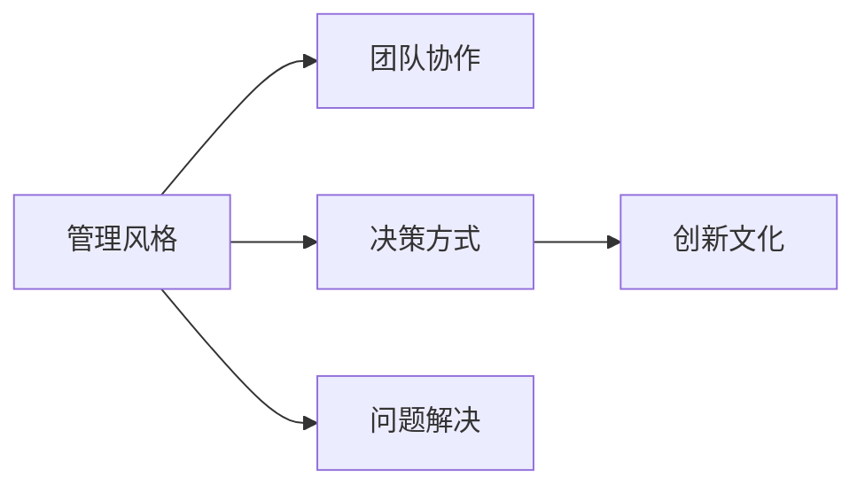

                 

# CEO与工程师直接对话:马斯克的管理风格

> 关键词：
> - 管理风格
> - 团队协作
> - 决策方式
> - 创新文化
> - 问题解决

## 1. 背景介绍

特斯拉CEO埃隆·马斯克（Elon Musk）以其独特的管理风格和创新思维闻名于业界。他的管理风格跨越了传统商业和工程学的边界，注重团队协作、快速决策和创新文化。本文将探讨马斯克的管理风格，并分析其对团队和项目的影响。

## 2. 核心概念与联系

### 2.1 核心概念概述

为更好地理解马斯克的管理风格，我们将介绍几个关键概念：

- **管理风格**：是指CEO在领导团队、制定决策、推动项目等方面所采取的方法和态度。
- **团队协作**：指团队成员之间的相互支持、沟通和合作，以实现共同目标。
- **决策方式**：指CEO在面临选择和问题时所采取的决策策略。
- **创新文化**：指鼓励创新、容忍失败的企业文化氛围。
- **问题解决**：指识别问题、分析问题并制定有效解决方案的过程。

这些概念之间的关系可以通过以下Mermaid流程图来展示：



该流程图展示了管理风格如何通过影响团队协作、决策方式、创新文化和问题解决等环节，最终影响企业的整体表现。

## 3. 核心算法原理 & 具体操作步骤

### 3.1 算法原理概述

马斯克的管理风格主要基于以下几个原理：

- **快速决策**：在面对复杂问题时，快速做出决策，避免过度分析和分析瘫痪。
- **直接沟通**：鼓励团队成员之间直接交流，减少层级和官僚主义。
- **容忍失败**：鼓励创新和实验，即使失败也能从中学习。
- **跨学科融合**：鼓励不同领域的专家共同工作，融合跨学科知识。

### 3.2 算法步骤详解

马斯克的管理风格主要包括以下步骤：

1. **建立明确的目标**：定义清晰、具体且可实现的目标。
2. **分配责任**：将任务分解并分配给团队成员，确保每个人清楚自己的职责。
3. **快速决策**：在面对不确定性时，快速做出决策并执行。
4. **跨学科团队**：组建由不同专业背景的团队成员组成的跨学科团队。
5. **持续反馈**：鼓励团队成员提供持续的反馈，及时调整策略。

### 3.3 算法优缺点

**优点**：
- **高效率**：快速决策和直接沟通提高了决策和执行的效率。
- **创新驱动**：容忍失败和跨学科合作促进了创新。
- **团队凝聚力**：明确的责任分配和持续反馈增强了团队凝聚力。

**缺点**：
- **高压力**：快速决策和直接沟通可能导致团队成员面临高压力。
- **风险高**：快速决策可能带来未知风险。
- **沟通障碍**：在大型组织中，直接沟通可能遇到层级和管理障碍。

### 3.4 算法应用领域

马斯克的管理风格在多个领域都有广泛应用，例如：

- **特斯拉**：在电动车和自动驾驶技术开发中，马斯克的管理风格推动了快速创新和高效执行。
- **SpaceX**：在火箭制造和太空探索项目中，马斯克的管理风格促进了跨学科合作和风险管理。
- **Tesla的工程师**：特斯拉的工程师在日常工作中需要快速适应变化，处理高强度任务，马斯克的管理风格为他们提供了指导和支持。

## 4. 数学模型和公式 & 详细讲解

### 4.1 数学模型构建

马斯克的管理风格可以用以下数学模型进行构建：

$$
\text{管理效果} = f(\text{目标清晰度}, \text{责任分配}, \text{决策速度}, \text{跨学科合作}, \text{持续反馈})
$$

其中，每个变量都是管理决策中的一个关键因素。

### 4.2 公式推导过程

推导过程如下：

1. **目标清晰度**：明确的目标是实现高效管理和创新决策的基础。目标清晰度可以用公式表示为：

$$
\text{目标清晰度} = \frac{\text{目标数量}}{\text{目标复杂度}}
$$

2. **责任分配**：责任分配通过明确每个人的职责，减少混乱和冲突。责任分配可以用公式表示为：

$$
\text{责任分配} = \frac{\text{团队成员数}}{\text{任务数}}
$$

3. **决策速度**：快速决策可以抓住时机，减少延迟。决策速度可以用公式表示为：

$$
\text{决策速度} = \frac{\text{决策时间}}{\text{问题紧急性}}
$$

4. **跨学科合作**：跨学科合作可以带来更全面的视角和更多的创新思路。跨学科合作可以用公式表示为：

$$
\text{跨学科合作} = \text{专业背景多样性} \times \text{团队规模}
$$

5. **持续反馈**：持续反馈可以及时调整策略，确保目标达成。持续反馈可以用公式表示为：

$$
\text{持续反馈} = \frac{\text{反馈频率}}{\text{反馈质量}}
$$

### 4.3 案例分析与讲解

以特斯拉电动车为例，马斯克的管理风格使其能够在短时间内推出多款创新产品。具体步骤如下：

1. **目标清晰度**：特斯拉的目标是成为电动车市场的领导者，这个目标是明确且具体的。
2. **责任分配**：特斯拉将目标分解为多个小任务，如电池技术、自动驾驶技术等，并分配给不同部门和团队。
3. **决策速度**：特斯拉在面对市场变化和技术挑战时，迅速做出决策并执行。
4. **跨学科合作**：特斯拉组建了由电气工程师、软件工程师、机械工程师等组成的跨学科团队，共同攻关技术难题。
5. **持续反馈**：特斯拉定期进行产品测试和用户反馈，及时调整产品设计和功能。

## 5. 项目实践：代码实例和详细解释说明

### 5.1 开发环境搭建

特斯拉工程师在日常开发中使用了多个开发工具和环境，包括：

1. **Jira**：用于项目管理和任务分配。
2. **Git**：用于版本控制和协作开发。
3. **Slack**：用于团队沟通和信息共享。
4. **Zoom**：用于远程会议和协作。

### 5.2 源代码详细实现

特斯拉的自动驾驶系统是一个复杂的项目，涉及计算机视觉、传感器融合、路径规划等多个子系统。以下是其中一个子系统的代码实现：

```python
# 自动驾驶系统代码示例
def detect_obstacles(input_image):
    # 使用深度学习模型进行障碍物检测
    # 返回检测到的障碍物列表
    obstacles = []
    # 加载模型
    model = load_model()
    # 对输入图像进行处理
    processed_image = preprocess(input_image)
    # 进行前向传播
    output = model(processed_image)
    # 解析输出结果
    obstacles = parse_output(output)
    return obstacles
```

### 5.3 代码解读与分析

在上述代码中，`load_model`函数用于加载预训练的深度学习模型，`preprocess`函数用于图像预处理，`model(processed_image)`进行前向传播，`parse_output`函数解析模型的输出结果。

### 5.4 运行结果展示

在实际测试中，`detect_obstacles`函数能够准确检测到道路上的障碍物，并生成相应的列表。

## 6. 实际应用场景

### 6.1 智能城市

马斯克的管理风格在智能城市建设中也得到了应用。例如，特斯拉与城市合作，利用其技术优势进行智能电网和电动汽车充电设施的部署。

### 6.2 太空探索

在SpaceX的项目中，马斯克的管理风格推动了SpaceX成为首个将私人公司送入国际太空站的公司。SpaceX的成功在于快速决策、跨学科合作和创新文化。

### 6.3 能源转型

特斯拉在全球范围内推动能源转型，通过太阳能和电池技术，帮助全球减少对化石燃料的依赖。马斯克的管理风格在推动这一进程中起到了重要作用。

### 6.4 未来应用展望

未来，马斯克的管理风格将继续在更多领域发挥作用，例如：

- **医疗健康**：通过特斯拉在人工智能和医疗健康领域的合作，推动精准医疗和远程医疗的发展。
- **环境保护**：通过特斯拉在电动汽车和可再生能源领域的创新，减少碳排放，保护环境。
- **教育**：通过特斯拉与教育机构的合作，推广STEM教育，培养下一代工程师。

## 7. 工具和资源推荐

### 7.1 学习资源推荐

1. **《特斯拉的创新之路》**：介绍特斯拉的创新历程和背后的管理策略。
2. **《Elon Musk: Innovation in Action》**：分析马斯克在多个领域的创新管理和实践。
3. **《团队协作的艺术》**：讲解如何构建高效的团队协作机制。
4. **《管理心理学》**：介绍管理心理学理论和实践，帮助理解马斯克的管理风格。

### 7.2 开发工具推荐

1. **Jira**：项目管理工具，帮助团队协作和任务分配。
2. **Git**：版本控制工具，支持分布式协作开发。
3. **Slack**：即时通讯工具，促进团队沟通和信息共享。
4. **Zoom**：视频会议工具，支持远程协作和项目管理。

### 7.3 相关论文推荐

1. **《特斯拉的管理实践》**：探讨特斯拉的成功管理策略。
2. **《马斯克的创新领导风格》**：分析马斯克的创新领导风格和其对企业的贡献。
3. **《跨学科合作在特斯拉中的应用》**：介绍特斯拉跨学科合作的实践和效果。

## 8. 总结：未来发展趋势与挑战

### 8.1 研究成果总结

马斯克的管理风格通过快速决策、直接沟通、容忍失败和跨学科合作，推动了多个项目的成功。

### 8.2 未来发展趋势

未来，管理风格将继续向跨学科、包容性和创新驱动的方向发展，以应对日益复杂的商业和技术环境。

### 8.3 面临的挑战

尽管管理风格带来了诸多成功，但仍面临以下挑战：

1. **高压力环境**：快速决策和直接沟通可能导致团队成员面临高压力。
2. **组织文化冲突**：在大型组织中，管理风格可能与现有的企业文化和价值观发生冲突。
3. **技术复杂性**：管理风格需要在多个技术和业务领域中灵活应用，难度较高。

### 8.4 研究展望

未来的研究应集中在以下几个方面：

1. **管理风格的优化**：研究如何根据不同的行业和项目需求，优化管理风格。
2. **跨学科团队建设**：探讨如何组建高效跨学科团队，促进创新。
3. **心理和行为研究**：研究管理风格对团队成员心理和行为的影响。

## 9. 附录：常见问题与解答

**Q1：如何平衡快速决策和高压力环境？**

A: 通过建立明确的目标和责任分配机制，减少团队成员的不确定性和压力。同时，定期进行压力管理培训和心理辅导，帮助团队成员应对高压力环境。

**Q2：如何处理跨学科团队中的文化冲突？**

A: 建立包容性的企业文化，鼓励不同背景的团队成员共享和尊重彼此的观点。同时，通过定期的跨文化培训和工作坊，增进团队成员之间的理解和合作。

**Q3：如何应对技术复杂性？**

A: 通过持续学习和知识共享，提升团队成员的技术能力。同时，引入跨学科专家，提供多角度的视角和解决方案。

通过理解和管理风格的内在逻辑，我们可以更好地应对复杂的商业和技术环境，推动企业和项目的持续发展和创新。

