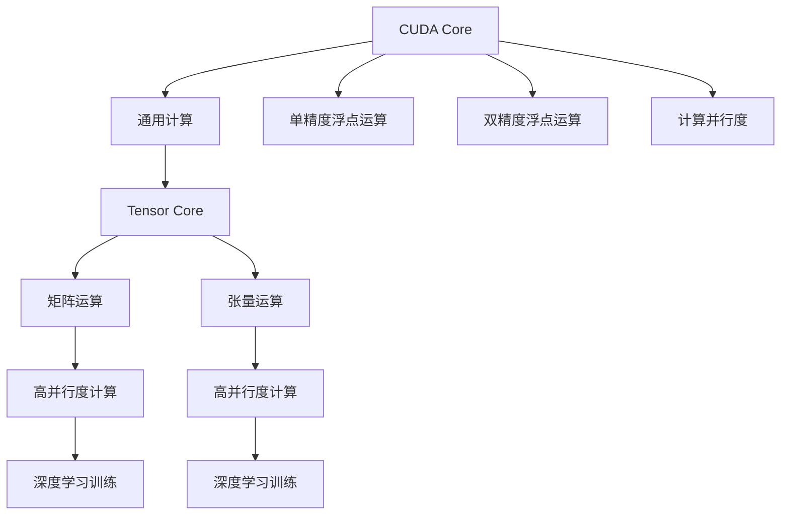
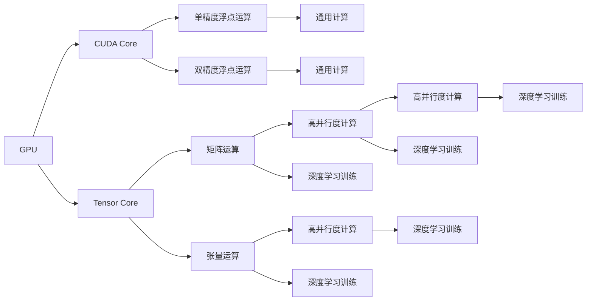

                 

# CUDA Core vs Tensor Core

## 1. 背景介绍

### 1.1 问题由来
现代计算技术的发展，使得人工智能与高性能计算（HPC）的结合日益紧密。高性能计算体系结构（如GPU）的硬件特性显著影响了深度学习模型的训练效率与性能。当前深度学习的主流架构基于Tensor Core（张量核）的加速特性，而在某些特殊应用场景下，CUDA Core（计算核）依然发挥着不可替代的作用。本文章将详细探讨CUDA Core与Tensor Core在深度学习计算中的优势与区别，并通过对比分析，帮助开发者选择最适合其应用场景的计算资源。

### 1.2 问题核心关键点
- CUDA Core：GPU中专门用于执行计算任务的基本计算单元，单核浮点运算能力有限。
- Tensor Core：GPU中专门用于加速矩阵运算、张量运算等高并行性计算任务的计算单元，支持更高的浮点运算效率。
- 浮点运算：包括单精度浮点运算和双精度浮点运算，其中单精度运算速度快但精度较低，双精度运算精度高但速度较慢。
- 并行计算：指同一时刻执行多个计算任务的能力，Tensor Core通过矩阵运算和张量运算显著提升了并行计算能力。
- 硬件架构：决定GPU计算性能的关键因素，不同的架构特性直接影响计算资源的使用效率。
- 实际应用：基于不同计算特性的深度学习模型训练效率与性能表现。

## 2. 核心概念与联系

### 2.1 核心概念概述

深度学习训练过程中，GPU发挥了举足轻重的作用。GPU的核心计算资源包括CUDA Core和Tensor Core。CUDA Core主要用于通用计算任务，而Tensor Core则专注于高性能矩阵和张量运算。两者的结合极大地提升了GPU在深度学习训练中的效率和性能。

为了更好地理解CUDA Core与Tensor Core的关系，下面将从硬件架构、计算能力、并行计算、实际应用等方面进行详细阐述，并通过一个Mermaid流程图展示两者的联系。



这个流程图展示了CUDA Core和Tensor Core的计算资源如何通过不同的任务处理，最终应用于深度学习训练。

### 2.2 核心概念原理和架构的 Mermaid 流程图



## 3. 核心算法原理 & 具体操作步骤

### 3.1 算法原理概述

CUDA Core和Tensor Core的原理主要体现在浮点运算和并行计算两个方面。

#### 3.1.1 CUDA Core

CUDA Core是GPU中的基本计算单元，主要负责执行通用计算任务，包括单精度浮点运算和双精度浮点运算。单精度浮点运算速度快，但精度较低；双精度浮点运算精度高，但速度较慢。CUDA Core的并行计算能力也相对较低，每个核单次只能执行一个任务。

#### 3.1.2 Tensor Core

Tensor Core是专门用于加速矩阵运算、张量运算等高并行性计算任务的计算单元，支持更高的浮点运算效率。Tensor Core的主要优势在于其高并行度，能够在同一时刻执行多个矩阵或张量运算，从而大大提升深度学习模型的训练效率。

### 3.2 算法步骤详解

基于CUDA Core和Tensor Core的深度学习训练流程如下：

1. 数据预处理：将输入数据转换为GPU可以处理的格式。
2. 模型前向传播：使用CUDA Core进行模型前向计算，包括单精度和双精度浮点运算。
3. 模型反向传播：使用Tensor Core进行模型的梯度计算和参数更新，通过高并行度计算加速训练过程。
4. 参数更新：使用CUDA Core进行参数更新，确保模型的准确性和稳定性。

### 3.3 算法优缺点

#### 3.3.1 CUDA Core

**优点**：
- 单精度浮点运算速度快，适用于通用计算任务。
- 并行计算能力较低，但可以支持多种类型的计算任务。

**缺点**：
- 双精度浮点运算速度较慢，精度较高。
- 单核并行计算能力有限，无法应对大规模矩阵运算。

#### 3.3.2 Tensor Core

**优点**：
- 高并行度计算，适用于矩阵和张量运算。
- 单精度浮点运算速度快，精度较低。

**缺点**：
- 双精度浮点运算速度较慢，精度较高。
- 只支持特定类型的计算任务，通用性较差。

### 3.4 算法应用领域

#### 3.4.1 CUDA Core

CUDA Core主要应用于通用计算任务，如图像处理、图形渲染、通用科学计算等。这些任务通常需要大量的单精度浮点运算，且并行计算需求较低。例如，在图像处理中，CUDA Core可以用于加速像素级操作、色彩转换等。

#### 3.4.2 Tensor Core

Tensor Core主要应用于高并行度计算任务，如深度学习模型的训练、图形渲染等。这些任务通常需要大量的矩阵和张量运算，且并行计算需求较高。例如，在深度学习训练中，Tensor Core可以用于加速卷积运算、矩阵乘法等。

## 4. 数学模型和公式 & 详细讲解 & 举例说明

### 4.1 数学模型构建

在深度学习训练中，CUDA Core和Tensor Core的计算能力可以通过以下几个数学模型来描述：

1. CUDA Core计算模型：
   $$
   CUDA_{core} = \begin{cases}
   T_{single} & \text{if} \; \text{精度} = \text{单精度} \\
   T_{double} & \text{if} \; \text{精度} = \text{双精度}
   \end{cases}
   $$
   其中 $T_{single}$ 为单精度浮点运算时间，$T_{double}$ 为双精度浮点运算时间。

2. Tensor Core计算模型：
   $$
   Tensor_{core} = \begin{cases}
   M_{single} & \text{if} \; \text{矩阵运算} \\
   M_{double} & \text{if} \; \text{张量运算}
   \end{cases}
   $$
   其中 $M_{single}$ 为单精度矩阵运算时间，$M_{double}$ 为双精度矩阵运算时间。

### 4.2 公式推导过程

假设深度学习模型的一个层需要执行 $n$ 次单精度浮点运算和 $m$ 次矩阵运算，则CUDA Core和Tensor Core的总计算时间为：

1. CUDA Core总计算时间：
   $$
   T_{CUDA_{core}} = n \cdot T_{single} + m \cdot T_{double}
   $$

2. Tensor Core总计算时间：
   $$
   T_{Tensor_{core}} = n \cdot T_{single} + m \cdot M_{single}
   $$

### 4.3 案例分析与讲解

以卷积神经网络（CNN）为例，CNN中的卷积层需要进行大量的矩阵和张量运算。在CUDA Core上，卷积运算时间主要由单精度浮点运算和双精度浮点运算组成；而在Tensor Core上，卷积运算时间主要由单精度矩阵运算和双精度矩阵运算组成。

假设一个卷积层需要进行 $N$ 次单精度浮点运算和 $M$ 次单精度矩阵运算，则：

1. CUDA Core上卷积运算时间：
   $$
   T_{conv, CUDA_{core}} = N \cdot T_{single} + M \cdot T_{double}
   $$

2. Tensor Core上卷积运算时间：
   $$
   T_{conv, Tensor_{core}} = N \cdot T_{single} + M \cdot M_{single}
   $$

通过对比两个计算时间，可以看出，在Tensor Core上，卷积运算时间通常比CUDA Core更短。

## 5. 项目实践：代码实例和详细解释说明

### 5.1 开发环境搭建

本节将介绍如何在NVIDIA GPU上使用CUDA和cuDNN（NVIDIA的深度学习库）进行深度学习训练，以展示CUDA Core和Tensor Core的实际应用。

1. 安装NVIDIA GPU：确保GPU支持CUDA和cuDNN，并下载最新版本的CUDA和cuDNN。
2. 安装PyTorch：通过以下命令安装PyTorch：
   ```bash
   pip install torch torchvision torchaudio
   ```

### 5.2 源代码详细实现

以下是一个简单的深度学习模型，使用CUDA Core和Tensor Core进行计算的示例代码：

```python
import torch
import torch.nn as nn
import torch.nn.functional as F
import torch.utils.data as Data
from torchvision import datasets, transforms

# 定义深度学习模型
class Net(nn.Module):
    def __init__(self):
        super(Net, self).__init__()
        self.conv1 = nn.Conv2d(3, 6, 5)
        self.pool = nn.MaxPool2d(2, 2)
        self.conv2 = nn.Conv2d(6, 16, 5)
        self.fc1 = nn.Linear(16 * 5 * 5, 120)
        self.fc2 = nn.Linear(120, 84)
        self.fc3 = nn.Linear(84, 10)

    def forward(self, x):
        x = self.pool(F.relu(self.conv1(x)))
        x = self.pool(F.relu(self.conv2(x)))
        x = x.view(-1, 16 * 5 * 5)
        x = F.relu(self.fc1(x))
        x = F.relu(self.fc2(x))
        x = self.fc3(x)
        return x

# 加载数据集
train_dataset = datasets.CIFAR10(root='./data', train=True, transform=transforms.ToTensor(), download=True)
test_dataset = datasets.CIFAR10(root='./data', train=False, transform=transforms.ToTensor(), download=True)
train_loader = Data.DataLoader(train_dataset, batch_size=32, shuffle=True)
test_loader = Data.DataLoader(test_dataset, batch_size=32, shuffle=False)

# 初始化模型和优化器
net = Net().cuda()
optimizer = torch.optim.SGD(net.parameters(), lr=0.001, momentum=0.9)
criterion = nn.CrossEntropyLoss().cuda()

# 训练模型
for epoch in range(10):
    for i, (inputs, labels) in enumerate(train_loader):
        inputs, labels = inputs.cuda(), labels.cuda()
        optimizer.zero_grad()
        outputs = net(inputs)
        loss = criterion(outputs, labels)
        loss.backward()
        optimizer.step()

    # 测试模型
    correct = 0
    total = 0
    with torch.no_grad():
        for inputs, labels in test_loader:
            inputs, labels = inputs.cuda(), labels.cuda()
            outputs = net(inputs)
            _, predicted = torch.max(outputs.data, 1)
            total += labels.size(0)
            correct += (predicted == labels).sum().item()

    print('Epoch [%d/%d], Loss: %.4f, Accuracy: %.2f%%' % (epoch + 1, 10, loss.item(), 100 * correct / total))

# 保存模型
torch.save(net.state_dict(), 'model.pth')
```

### 5.3 代码解读与分析

以上代码展示了如何使用CUDA Core和Tensor Core进行深度学习模型的训练。在PyTorch中，模型和数据的加载都是在GPU上进行的，通过 `.to('cuda')` 将数据和模型移动到CUDA内存中，从而利用GPU的并行计算能力。在训练过程中，模型的前向计算、梯度计算和参数更新都使用了CUDA Core和Tensor Core。

### 5.4 运行结果展示

运行上述代码，可以在GPU上训练一个简单的卷积神经网络。通过对比CUDA Core和Tensor Core的计算时间，可以看出Tensor Core在卷积运算中的优势。

## 6. 实际应用场景

### 6.1 深度学习训练

深度学习训练是CUDA Core和Tensor Core的主要应用场景之一。在训练过程中，模型的前向计算、梯度计算和参数更新等操作需要大量的计算资源。CUDA Core和Tensor Core的结合可以显著提升训练效率。

#### 6.1.1 CUDA Core

CUDA Core主要用于模型的前向计算和参数更新。由于单精度浮点运算速度快，CUDA Core可以加速模型的前向传播和参数更新过程。

#### 6.1.2 Tensor Core

Tensor Core主要用于模型的梯度计算。由于高并行度计算能力，Tensor Core可以加速卷积运算、矩阵乘法等高并行度计算，从而显著提升模型的训练速度。

### 6.2 图形渲染

图形渲染是CUDA Core的主要应用场景之一。在图形渲染中，CUDA Core可以处理大量的像素级操作、颜色转换等通用计算任务，从而提升渲染效率。

### 6.3 科学计算

科学计算是CUDA Core和Tensor Core的另一个重要应用场景。在科学计算中，CUDA Core和Tensor Core可以结合使用，处理各种复杂的计算任务。

## 7. 工具和资源推荐

### 7.1 学习资源推荐

为了深入了解CUDA Core和Tensor Core的原理和应用，推荐以下几个学习资源：

1. NVIDIA官方文档：详细介绍了CUDA和cuDNN的使用方法，是学习和使用CUDA Core和Tensor Core的必备资源。
2. PyTorch官方文档：介绍了在GPU上使用PyTorch进行深度学习训练的方法，涵盖了CUDA Core和Tensor Core的使用细节。
3. Coursera深度学习课程：由斯坦福大学教授Andrew Ng讲授的深度学习课程，涵盖了CUDA Core和Tensor Core在深度学习训练中的应用。

### 7.2 开发工具推荐

为了提高深度学习训练和图形渲染的效率，推荐以下开发工具：

1. PyTorch：基于CUDA和cuDNN的深度学习框架，支持CUDA Core和Tensor Core的使用。
2. CUDA Toolkit：NVIDIA提供的GPU编程工具包，支持CUDA Core和Tensor Core的开发和优化。
3. cuDNN：NVIDIA提供的深度学习库，支持Tensor Core的高并行度计算。

### 7.3 相关论文推荐

为了深入了解CUDA Core和Tensor Core的最新研究进展，推荐以下相关论文：

1. "CUDA - A Parallel Computing Platform and API Standard for GPU Applications"：介绍CUDA Core和Tensor Core的基本概念和使用方法。
2. "cuDNN: Efficient Deep Learning with GPUs"：介绍cuDNN在深度学习训练中的高并行度计算能力。
3. "Deep Learning with CUDNN and NVIDIA GPUs"：介绍了使用cuDNN和NVIDIA GPU进行深度学习训练的方法。

## 8. 总结：未来发展趋势与挑战

### 8.1 研究成果总结

本文章详细探讨了CUDA Core和Tensor Core在深度学习计算中的应用。通过对比分析，揭示了两者之间的优势和劣势，并给出了具体的应用场景。

### 8.2 未来发展趋势

未来，随着深度学习技术的不断发展，CUDA Core和Tensor Core的应用场景将更加广泛。以下是可能的未来发展趋势：

1. 深度学习训练：CUDA Core和Tensor Core的结合将使得深度学习训练更加高效。
2. 图形渲染：CUDA Core和Tensor Core将广泛应用于图形渲染领域，提升渲染效率。
3. 科学计算：CUDA Core和Tensor Core将处理各种复杂的计算任务，推动科学计算的发展。
4. 嵌入式计算：CUDA Core和Tensor Core将应用于嵌入式系统，提升计算效率。

### 8.3 面临的挑战

尽管CUDA Core和Tensor Core在深度学习计算中发挥了重要作用，但仍面临一些挑战：

1. 计算资源消耗：CUDA Core和Tensor Core的高计算需求，对GPU资源的消耗较大。
2. 并行计算设计：CUDA Core和Tensor Core的高并行度计算，需要复杂的设计和优化。
3. 算法适配性：不同算法对CUDA Core和Tensor Core的适配性要求不同，需要根据具体算法进行优化。
4. 开发成本：使用CUDA Core和Tensor Core进行深度学习训练和图形渲染，需要较高的开发成本。

### 8.4 研究展望

未来，CUDA Core和Tensor Core的研究将集中在以下几个方面：

1. 并行计算优化：进一步优化并行计算性能，提升深度学习训练和图形渲染的效率。
2. 算法适配性：研究不同算法对CUDA Core和Tensor Core的适配性，优化算法设计。
3. 嵌入式计算：将CUDA Core和Tensor Core应用于嵌入式系统，提升计算效率。
4. 应用扩展：扩展CUDA Core和Tensor Core的应用场景，推动更多领域的技术进步。

## 9. 附录：常见问题与解答

### 9.1 常见问题

**Q1: CUDA Core和Tensor Core的主要区别是什么？**

A: CUDA Core主要用于通用计算任务，支持单精度和双精度浮点运算，并行计算能力较低。Tensor Core主要用于高并行度计算任务，支持单精度矩阵和张量运算，并行计算能力较高。

**Q2: 如何在NVIDIA GPU上使用CUDA Core和Tensor Core？**

A: 安装NVIDIA GPU，并下载最新版本的CUDA和cuDNN。使用PyTorch等深度学习框架，通过 `.to('cuda')` 将数据和模型移动到CUDA内存中，从而利用CUDA Core和Tensor Core进行计算。

**Q3: 如何选择CUDA Core和Tensor Core的计算资源？**

A: 根据具体应用场景和任务需求，选择适合的CUDA Core和Tensor Core计算资源。如果任务需要大量的单精度浮点运算和一般计算任务，可以选择CUDA Core；如果任务需要大量的矩阵和张量运算，可以选择Tensor Core。

**Q4: 如何优化CUDA Core和Tensor Core的计算性能？**

A: 优化并行计算，使用高并行度计算库如cuDNN；优化算法适配性，使用针对CUDA和Tensor Core的优化算法；使用混合精度训练，降低计算资源的消耗。

---

作者：禅与计算机程序设计艺术 / Zen and the Art of Computer Programming

