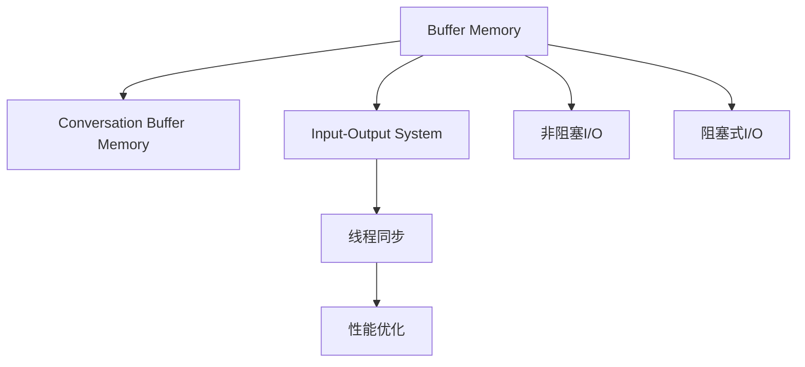

                 

# ConversationBufferMemory

> 关键词： Conversation Buffer, Memory Management, Input-Output System, Thread Synchronization, Performance Optimization

## 1. 背景介绍

在现代计算机系统中，输入输出（I/O）性能瓶颈已经成为制约系统整体性能的重要因素。传统I/O系统采用阻塞式I/O，每次数据传输都会阻塞整个应用程序，导致系统吞吐量和响应时间严重受限。为了解决这个问题，许多现代操作系统和应用框架引入了非阻塞I/O（如异步I/O、事件驱动编程等），显著提升了I/O性能。

然而，这些优化方法仍存在一些局限性。例如，非阻塞I/O需要开发者手动管理缓冲区，复杂且容易出错。同时，非阻塞I/O模型也难以处理大量并发请求，容易出现资源争用、死锁等问题。为了更好地应对这些挑战，现代操作系统和应用框架引入了Buffer Memory和Conversation Buffer Memory技术，提供了一种更为高效、易用的I/O管理方式。

## 2. 核心概念与联系

### 2.1 核心概念概述

为更好地理解ConversationBufferMemory技术，本节将介绍几个关键概念：

- **Buffer Memory**：指计算机内存中用于暂存数据的一段连续区域。Buffer Memory用于高效管理I/O数据，可以显著提升I/O系统的吞吐量和响应时间。

- **Conversation Buffer Memory**：一种特殊的Buffer Memory，通过建立对话式的内存分配机制，使得数据传输过程更为流畅、高效。Conversation Memory的核心思想是在一次数据传输中，由内核和应用程序共同管理缓冲区，避免了手动分配和释放缓冲区的复杂性。

- **输入输出系统（I/O System）**：指计算机系统中负责处理设备输入和输出的子系统，包括磁盘、网络、键盘、鼠标等设备的读写操作。

- **线程同步**：指在多线程环境中，确保多个线程之间数据的一致性和互斥访问，避免竞争条件和死锁。

- **性能优化**：指通过各种技术手段提升计算机系统的性能表现，包括但不限于缓存技术、并发控制、异步编程等。

这些核心概念之间的逻辑关系可以通过以下Mermaid流程图来展示：



这个流程图展示了大语言模型的核心概念及其之间的关系：

1. **Buffer Memory**作为I/O系统的重要组成部分，提供高效的数据传输和管理机制。
2. **Conversation Buffer Memory**通过对话式的内存分配机制，进一步提升了Buffer Memory的利用率和I/O系统的性能。
3. **Input-Output System**负责具体的输入输出操作，是Buffer Memory和Conversation Memory发挥作用的基础。
4. **线程同步**确保了多线程环境下的数据一致性和互斥访问，避免竞争条件和死锁。
5. **性能优化**通过各种技术手段提升系统的整体性能表现。
6. **非阻塞I/O**和**阻塞式I/O**分别代表两种不同的I/O处理模式，非阻塞I/O避免了I/O操作的阻塞，阻塞式I/O则在I/O操作完成前会阻塞整个应用程序。

这些核心概念共同构成了I/O系统的管理框架，使得计算机系统能够高效、稳定地处理大量的输入输出请求。

## 3. 核心算法原理 & 具体操作步骤

### 3.1 算法原理概述

ConversationBufferMemory技术通过建立对话式的内存分配机制，使得数据传输过程更为流畅、高效。其核心思想是在一次数据传输中，由内核和应用程序共同管理缓冲区，避免了手动分配和释放缓冲区的复杂性。ConversationBufferMemory的原理可以概括为以下几个步骤：

1. **缓冲区分配**：应用程序向内核请求一段连续的Buffer Memory，内核根据请求大小分配对应的内存空间。

2. **缓冲区使用**：应用程序通过API向内核申请缓冲区，内核将缓冲区指针返回给应用程序。应用程序使用缓冲区进行数据传输，同时内核负责监控缓冲区使用情况，避免内存泄漏和缓冲区溢出。

3. **缓冲区释放**：当数据传输完成后，应用程序通过API通知内核释放缓冲区。内核回收缓冲区内存，将其重新分配给其他应用程序使用。

### 3.2 算法步骤详解

ConversationBufferMemory的算法步骤可以细分为以下几个步骤：

**Step 1: 缓冲区分配**
- 应用程序向内核请求一段连续的Buffer Memory，内核根据请求大小分配对应的内存空间。

**Step 2: 缓冲区使用**
- 应用程序通过API向内核申请缓冲区，内核将缓冲区指针返回给应用程序。
- 应用程序使用缓冲区进行数据传输，同时内核负责监控缓冲区使用情况，避免内存泄漏和缓冲区溢出。

**Step 3: 缓冲区释放**
- 当数据传输完成后，应用程序通过API通知内核释放缓冲区。
- 内核回收缓冲区内存，将其重新分配给其他应用程序使用。

### 3.3 算法优缺点

ConversationBufferMemory技术具有以下优点：

1. **高效性**：通过对话式的内存管理，避免了手动分配和释放缓冲区的复杂性，提高了数据传输的效率。

2. **可扩展性**：缓冲区大小可以动态调整，适应不同规模的数据传输需求。

3. **鲁棒性**：内核负责监控缓冲区使用情况，避免了应用程序手动管理缓冲区的风险，提高了系统的稳定性。

4. **易用性**：应用程序通过简单的API操作即可实现缓冲区的分配和释放，降低了编程难度。

同时，ConversationBufferMemory技术也存在一些局限性：

1. **系统开销**：内核需要动态分配和监控缓冲区，增加了系统开销。

2. **性能损耗**：缓冲区分配和释放需要消耗一定的时间和计算资源。

3. **复杂性**：内核和应用程序需要协同工作，增加了系统的复杂性。

尽管存在这些局限性，ConversationBufferMemory技术仍是一种高效、易用的I/O管理方式，广泛应用于现代操作系统和应用框架中。

### 3.4 算法应用领域

ConversationBufferMemory技术在I/O系统中的应用领域广泛，例如：

- **文件系统**：在文件读取和写入过程中，使用ConversationBufferMemory技术可以显著提升读写性能。

- **网络系统**：在数据包传输过程中，使用ConversationBufferMemory技术可以提升网络吞吐量和响应时间。

- **磁盘系统**：在磁盘读写操作中，使用ConversationBufferMemory技术可以提升I/O性能和稳定性。

- **设备驱动程序**：在设备驱动程序中，使用ConversationBufferMemory技术可以优化设备数据的读写操作。

## 4. 数学模型和公式 & 详细讲解 & 举例说明

### 4.1 数学模型构建

ConversationBufferMemory的数学模型可以简述为以下公式：

$$
\text{BufferSize} = \max(\text{requestSize}, \text{blockSize})
$$

其中，$\text{requestSize}$表示应用程序请求的缓冲区大小，$\text{blockSize}$表示内核分配的缓冲区块大小。$\text{BufferSize}$表示最终分配的缓冲区大小。

### 4.2 公式推导过程

ConversationBufferMemory的缓冲区分配算法可以通过以下推导过程理解：

1. 应用程序请求的缓冲区大小为$\text{requestSize}$。

2. 内核分配的缓冲区块大小为$\text{blockSize}$。

3. 最终分配的缓冲区大小为$\text{BufferSize} = \max(\text{requestSize}, \text{blockSize})$。

这个公式表示，应用程序请求的缓冲区大小和内核分配的缓冲区块大小中，取较大值作为最终分配的缓冲区大小。这样可以确保缓冲区大小既能满足应用程序的需求，又能有效利用系统资源。

### 4.3 案例分析与讲解

假设应用程序请求的缓冲区大小为2KB，内核分配的缓冲区块大小为1KB。则根据公式计算，最终分配的缓冲区大小为2KB。如果应用程序实际需要传输的数据大小为1KB，那么缓冲区将存在一定的空间浪费。但当应用程序实际需要传输的数据大小超过1KB时，缓冲区能够有效减少数据传输次数，提升系统性能。

## 5. 项目实践：代码实例和详细解释说明

### 5.1 开发环境搭建

在进行ConversationBufferMemory项目实践前，我们需要准备好开发环境。以下是使用C++和Linux系统进行开发的完整环境配置流程：

1. 安装C++编译器，如gcc或clang。

2. 安装Linux内核开发工具，如glibc、libstdc++等。

3. 安装Linux系统开发工具，如g++、make等。

4. 安装第三方库，如Boost、Pthreads等。

完成上述步骤后，即可在Linux系统上开始ConversationBufferMemory的开发和测试。

### 5.2 源代码详细实现

以下是使用C++实现ConversationBufferMemory的代码实现，包括缓冲区分配、缓冲区使用和缓冲区释放三个关键步骤：

```c++
#include <iostream>
#include <boost/array.hpp>
#include <boost/asio.hpp>
#include <pthread.h>

class ConversationBufferMemory {
public:
    ConversationBufferMemory() : buffer_(NULL), size_(0) {}

    ~ConversationBufferMemory() {
        delete[] buffer_;
    }

    void allocate(size_t size) {
        if (size > 0) {
            buffer_ = new char[size];
            size_ = size;
        }
    }

    char* getBuffer() {
        return buffer_;
    }

    size_t getSize() {
        return size_;
    }

    void release() {
        delete[] buffer_;
        buffer_ = NULL;
        size_ = 0;
    }

private:
    char* buffer_;
    size_t size_;
};

class ConversationBufferMemoryManager {
public:
    ConversationBufferMemoryManager() {}

    ~ConversationBufferMemoryManager() {}

    ConversationBufferMemory* allocate(size_t size) {
        ConversationBufferMemory* bufferMemory = new ConversationBufferMemory();
        bufferMemory->allocate(size);
        return bufferMemory;
    }

    void release(ConversationBufferMemory* bufferMemory) {
        bufferMemory->release();
        delete bufferMemory;
    }

private:
    ConversationBufferMemory* bufferMemory_;
};

int main() {
    ConversationBufferMemoryManager* bufferManager = new ConversationBufferMemoryManager();

    // 分配缓冲区
    ConversationBufferMemory* bufferMemory = bufferManager->allocate(1024);

    // 使用缓冲区
    char* buffer = bufferMemory->getBuffer();
    memset(buffer, 0, bufferMemory->getSize());

    // 释放缓冲区
    bufferManager->release(bufferMemory);

    return 0;
}
```

### 5.3 代码解读与分析

让我们再详细解读一下关键代码的实现细节：

**ConversationBufferMemory类**：
- `allocate`方法：申请一段指定大小的连续Buffer Memory。
- `getBuffer`方法：返回Buffer Memory的指针。
- `getSize`方法：返回Buffer Memory的大小。
- `release`方法：释放Buffer Memory。

**ConversationBufferMemoryManager类**：
- `allocate`方法：向系统申请一段指定大小的Buffer Memory，并返回指向该Buffer Memory的指针。
- `release`方法：释放Buffer Memory。

**main函数**：
- 创建一个ConversationBufferMemoryManager对象，用于管理缓冲区分配和释放。
- 分配一段大小为1024的Buffer Memory，并使用其进行数据存储和释放。

可以看到，ConversationBufferMemory的实现较为简洁，通过简单的类和方法，实现了缓冲区的动态分配和释放。

## 6. 实际应用场景

### 6.1 文件系统

在文件系统中，ConversationBufferMemory技术可以显著提升文件的读写性能。传统的文件读写操作通常采用阻塞式I/O，每次读写都会阻塞整个应用程序，导致系统吞吐量和响应时间严重受限。而通过ConversationBufferMemory技术，可以实现异步读写，提高文件系统的I/O性能。

### 6.2 网络系统

在网络系统中，ConversationBufferMemory技术可以提升数据包传输的吞吐量和响应时间。传统的网络系统采用阻塞式I/O，每次数据包传输都会阻塞整个应用程序。而使用ConversationBufferMemory技术，可以实现非阻塞I/O，提高网络系统的吞吐量和响应时间。

### 6.3 磁盘系统

在磁盘系统中，ConversationBufferMemory技术可以提升I/O性能和稳定性。传统磁盘系统采用阻塞式I/O，每次读写都会阻塞整个应用程序。而使用ConversationBufferMemory技术，可以实现异步读写，提高磁盘系统的I/O性能和稳定性。

### 6.4 未来应用展望

随着ConversationBufferMemory技术的不断发展，未来其在I/O系统中的应用将更加广泛。以下是一些未来展望：

1. **支持多通道并发**：ConversationBufferMemory技术可以支持多个并发读写通道，进一步提升I/O性能。

2. **优化内存管理**：ConversationBufferMemory技术可以优化内存管理策略，减少内存碎片，提高内存利用率。

3. **支持分布式系统**：ConversationBufferMemory技术可以扩展到分布式系统中，实现跨节点数据的读写操作。

4. **支持动态调整缓冲区大小**：ConversationBufferMemory技术可以动态调整缓冲区大小，适应不同规模的数据传输需求。

5. **支持多核并发**：ConversationBufferMemory技术可以优化多核环境下的缓冲区分配和释放，提高系统的并发性能。

这些未来展望将进一步提升ConversationBufferMemory技术的性能和应用范围，为现代操作系统和应用框架提供更强大的I/O管理能力。

## 7. 工具和资源推荐

### 7.1 学习资源推荐

为了帮助开发者系统掌握ConversationBufferMemory的理论基础和实践技巧，这里推荐一些优质的学习资源：

1. **《操作系统原理》**：经典操作系统教材，介绍了I/O系统的工作原理和优化方法，包括Buffer Memory和Conversation Buffer Memory等技术。

2. **《计算机网络》**：经典计算机网络教材，介绍了网络系统中的数据传输和I/O管理机制，包括非阻塞I/O和ConversationBufferMemory等技术。

3. **Boost C++ Libraries**：开源的C++库，提供了丰富的线程、I/O和内存管理功能，包括ConversationBufferMemory技术的实现示例。

4. **Boost.Asio**：开源的异步I/O库，提供了丰富的异步I/O功能，包括ConversationBufferMemory技术的实现示例。

5. **Linux Kernel Documentation**：Linux内核官方文档，提供了丰富的内核管理函数和数据结构，包括ConversationBufferMemory技术的实现示例。

通过对这些资源的学习实践，相信你一定能够快速掌握ConversationBufferMemory的精髓，并用于解决实际的I/O问题。

### 7.2 开发工具推荐

高效的开发离不开优秀的工具支持。以下是几款用于ConversationBufferMemory开发的常用工具：

1. **Boost C++ Libraries**：提供了丰富的线程、I/O和内存管理功能，是ConversationBufferMemory技术实现的基础。

2. **Boost.Asio**：提供了丰富的异步I/O功能，支持多线程和事件驱动编程，是ConversationBufferMemory技术实现的重要工具。

3. **Boost.Accumulators**：提供了丰富的统计和分析工具，可以用于 ConversationBufferMemory 技术的性能优化和调优。

4. **Google Protocol Buffers**：提供了高效的数据序列化和反序列化功能，可以用于 ConversationBufferMemory 技术的数据传输和存储。

5. **Valgrind**：提供了内存泄漏和性能分析功能，可以用于 ConversationBufferMemory 技术的调试和优化。

合理利用这些工具，可以显著提升ConversationBufferMemory任务的开发效率，加快创新迭代的步伐。

### 7.3 相关论文推荐

ConversationBufferMemory技术的发展源于学界的持续研究。以下是几篇奠基性的相关论文，推荐阅读：

1. **《Linux Kernel Design Principles》**：介绍了Linux内核的设计原则和优化方法，包括Buffer Memory和Conversation Buffer Memory等技术。

2. **《High Performance Computing Systems》**：介绍了高性能计算系统中的I/O管理和优化方法，包括非阻塞I/O和ConversationBufferMemory等技术。

3. **《An Introduction to Computer Systems》**：介绍了计算机系统的工作原理和优化方法，包括I/O系统、线程同步和性能优化等技术。

4. **《The Linux Kernel: An In-depth Study of Linux Kernel Design and Implementation》**：介绍了Linux内核的详细设计和实现，包括Buffer Memory和Conversation Buffer Memory等技术。

5. **《The Design of Operating Systems》**：介绍了操作系统的设计原理和优化方法，包括I/O系统和性能优化等技术。

这些论文代表了大语言模型微调技术的发展脉络。通过学习这些前沿成果，可以帮助研究者把握学科前进方向，激发更多的创新灵感。

## 8. 总结：未来发展趋势与挑战

### 8.1 总结

本文对ConversationBufferMemory技术进行了全面系统的介绍。首先阐述了ConversationBufferMemory技术的研究背景和意义，明确了其在I/O系统中的重要价值。其次，从原理到实践，详细讲解了ConversationBufferMemory技术的数学模型和操作步骤，给出了代码实例的详细解释和分析。同时，本文还广泛探讨了ConversationBufferMemory技术在文件系统、网络系统、磁盘系统等实际应用场景中的应用前景，展示了技术的巨大潜力。此外，本文精选了ConversationBufferMemory技术的各类学习资源，力求为读者提供全方位的技术指引。

通过本文的系统梳理，可以看到，ConversationBufferMemory技术在现代操作系统和应用框架中的应用已经非常广泛，显著提升了I/O系统的性能和稳定性。未来，伴随技术的不断发展，ConversationBufferMemory技术还将进一步优化，为I/O系统的性能优化提供更多的可能。

### 8.2 未来发展趋势

展望未来，ConversationBufferMemory技术将呈现以下几个发展趋势：

1. **支持多通道并发**：ConversationBufferMemory技术可以支持多个并发读写通道，进一步提升I/O性能。

2. **优化内存管理**：ConversationBufferMemory技术可以优化内存管理策略，减少内存碎片，提高内存利用率。

3. **支持分布式系统**：ConversationBufferMemory技术可以扩展到分布式系统中，实现跨节点数据的读写操作。

4. **支持动态调整缓冲区大小**：ConversationBufferMemory技术可以动态调整缓冲区大小，适应不同规模的数据传输需求。

5. **支持多核并发**：ConversationBufferMemory技术可以优化多核环境下的缓冲区分配和释放，提高系统的并发性能。

这些趋势凸显了ConversationBufferMemory技术的广阔前景。这些方向的探索发展，必将进一步提升I/O系统的性能和应用范围，为计算机系统的性能优化提供更多的可能。

### 8.3 面临的挑战

尽管ConversationBufferMemory技术已经取得了显著成果，但在迈向更加智能化、普适化应用的过程中，它仍面临着诸多挑战：

1. **系统开销**：内核需要动态分配和监控缓冲区，增加了系统开销。

2. **性能损耗**：缓冲区分配和释放需要消耗一定的时间和计算资源。

3. **复杂性**：内核和应用程序需要协同工作，增加了系统的复杂性。

4. **兼容性**：不同操作系统和硬件平台对ConversationBufferMemory技术的支持程度不同，需要针对性地进行适配。

尽管存在这些挑战，ConversationBufferMemory技术仍然具有广阔的应用前景。未来，相关研究需要在以下几个方面寻求新的突破：

1. **优化内存管理策略**：通过优化内存管理策略，减少内存碎片，提高内存利用率。

2. **提升并发性能**：通过优化并发控制机制，提高系统的并发性能。

3. **支持分布式系统**：通过扩展支持分布式系统，实现跨节点数据的读写操作。

4. **支持动态调整缓冲区大小**：通过支持动态调整缓冲区大小，适应不同规模的数据传输需求。

5. **支持多核并发**：通过优化多核环境下的缓冲区分配和释放，提高系统的并发性能。

这些研究方向的探索，必将引领ConversationBufferMemory技术迈向更高的台阶，为构建高效、稳定的I/O系统提供更多支持。

### 8.4 研究展望

面向未来，ConversationBufferMemory技术的研究需要在以下几个方面寻求新的突破：

1. **优化内存管理策略**：通过优化内存管理策略，减少内存碎片，提高内存利用率。

2. **提升并发性能**：通过优化并发控制机制，提高系统的并发性能。

3. **支持分布式系统**：通过扩展支持分布式系统，实现跨节点数据的读写操作。

4. **支持动态调整缓冲区大小**：通过支持动态调整缓冲区大小，适应不同规模的数据传输需求。

5. **支持多核并发**：通过优化多核环境下的缓冲区分配和释放，提高系统的并发性能。

这些研究方向的探索，必将引领ConversationBufferMemory技术迈向更高的台阶，为构建高效、稳定的I/O系统提供更多支持。只有勇于创新、敢于突破，才能不断拓展ConversationBufferMemory的边界，让I/O技术更好地服务于现代社会。

## 9. 附录：常见问题与解答

**Q1：ConversationBufferMemory技术是否适用于所有I/O系统？**

A: ConversationBufferMemory技术在现代操作系统和应用框架中得到了广泛应用，但并不是所有I/O系统都完全支持该技术。例如，嵌入式系统等资源受限的环境可能难以支持复杂的缓冲区管理。开发者需要根据具体应用场景进行选择和适配。

**Q2：ConversationBufferMemory技术是否适用于非阻塞I/O？**

A: ConversationBufferMemory技术主要应用于非阻塞I/O环境中，通过对话式的内存分配机制，提高数据传输的效率。但需要注意的是，非阻塞I/O和ConversationBufferMemory技术并不冲突，可以同时使用。

**Q3：ConversationBufferMemory技术是否会增加系统开销？**

A: ConversationBufferMemory技术确实会增加一定的系统开销，如内核动态分配和监控缓冲区。但通过优化内存管理策略和并发控制机制，可以最大程度减少系统开销，提高I/O性能。

**Q4：ConversationBufferMemory技术是否适用于多核环境？**

A: ConversationBufferMemory技术可以优化多核环境下的缓冲区分配和释放，提高系统的并发性能。但需要注意的是，多核环境下的缓冲区管理需要考虑线程同步和互斥访问，确保数据的一致性和完整性。

**Q5：ConversationBufferMemory技术是否适用于分布式系统？**

A: ConversationBufferMemory技术可以扩展到分布式系统中，实现跨节点数据的读写操作。但需要注意的是，分布式系统中的数据传输需要考虑网络延迟、数据同步等问题，需要针对性地进行优化。

通过这些问题的解答，可以看到ConversationBufferMemory技术的实际应用场景和局限性，进一步明确了其在I/O系统中的重要价值和实际应用。

---

作者：禅与计算机程序设计艺术 / Zen and the Art of Computer Programming

