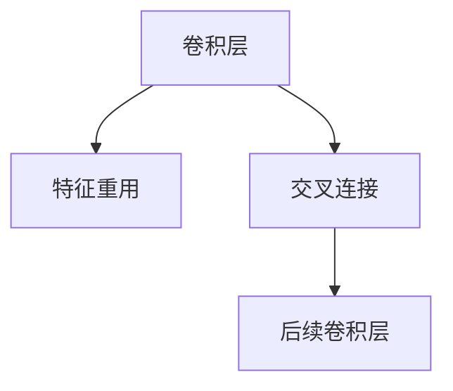

                 

# DenseNet原理与代码实例讲解

> 关键词：DenseNet, 卷积神经网络, CNN, 特征重用, 交叉连接, 代码实例

## 1. 背景介绍

随着深度学习技术的快速发展，卷积神经网络(CNN)在计算机视觉、自然语言处理等领域取得了显著成果。传统的卷积网络中，层与层之间的连接方式通常是串联的，即前一层的输出仅作为下一层的输入。这种连接方式虽然高效，但往往导致信息的逐层丢失，难以捕捉到长距离依赖关系。

为解决这一问题，一种名为DenseNet的新型卷积网络结构被提出，并在ImageNet、CIFAR等数据集上取得了优异的性能。DenseNet通过引入特征重用机制，显著提升了网络的信息流动效率和表示能力。

本文将详细介绍DenseNet的原理和实现，并通过代码实例来讲解其具体应用。

## 2. 核心概念与联系

### 2.1 核心概念概述

为更好地理解DenseNet的结构和特性，本节将介绍几个关键概念：

- 卷积神经网络(CNN)：一种基于卷积操作的神经网络，常用于图像处理、计算机视觉等任务。
- DenseNet：一种新型卷积网络结构，通过特征重用和交叉连接，极大地提升了网络的信息流动效率和表示能力。
- 特征重用：通过将前一层的输出传递给当前层，使得网络中的信息得以重复利用，减少参数量，提高信息表达能力。
- 交叉连接：通过将前一层输出与当前层输出拼接，构成更大规模的特征表示，促进长距离依赖关系的捕捉。

这些概念之间的逻辑关系可以通过以下Mermaid流程图来展示：



这个流程图展示了DenseNet中关键的特征重用和交叉连接机制。通过特征重用和交叉连接，DenseNet实现了信息的重复利用和规模化表示，极大地提升了网络性能。

## 3. 核心算法原理 & 具体操作步骤
### 3.1 算法原理概述

DenseNet的核心思想是通过特征重用和交叉连接，提升网络的信息流动效率和表示能力。其主要特点包括：

- **特征重用**：DenseNet通过将前一层的输出作为当前层的输入，实现了特征的多次利用，减少了冗余参数，提高了信息表达能力。
- **交叉连接**：DenseNet通过将前一层的输出与当前层输出拼接，构成更大规模的特征表示，促进了长距离依赖关系的捕捉。

### 3.2 算法步骤详解

DenseNet的实现主要分为两个关键步骤：特征重用和交叉连接。以下将详细介绍这两个步骤。

**Step 1: 特征重用**

在DenseNet中，每个卷积层 $D$ 的输出 $X_D$ 由所有前一层 $X_i$ 的输出构成。具体地，

$$
X_D = \sum_{i=1}^{D-1} W_i * X_i + b_i
$$

其中 $W_i$ 和 $b_i$ 分别为第 $i$ 层卷积核和偏置，$*$ 表示卷积操作。

这种特征重用机制，使得网络中的信息得以重复利用，减少了冗余参数，提高了信息表达能力。

**Step 2: 交叉连接**

在DenseNet中，每个卷积层 $D$ 的输出 $X_D$ 还与所有前一层 $X_i$ 的输出拼接，构成更大规模的特征表示。具体地，

$$
X_D = \oplus_{i=1}^{D-1} X_i
$$

其中 $\oplus$ 表示拼接操作。

这种交叉连接机制，促进了长距离依赖关系的捕捉，提升了网络的表示能力。

### 3.3 算法优缺点

DenseNet具有以下优点：

- **信息重用效率高**：通过特征重用机制，DenseNet显著减少了冗余参数，提高了信息表达能力。
- **长距离依赖捕捉能力强**：通过交叉连接机制，DenseNet能够更好地捕捉长距离依赖关系。
- **泛化能力强**：DenseNet的网络结构更为紧凑，训练过程更为稳定，能够更好地泛化到新数据集。

同时，DenseNet也存在一些缺点：

- **计算量大**：由于交叉连接的存在，DenseNet的计算量较大，需要更多的计算资源。
- **可解释性差**：DenseNet的网络结构复杂，难以解释每个特征的重要性，可能导致模型的可解释性不足。
- **易过拟合**：DenseNet的参数较多，容易发生过拟合，尤其是在训练集较小的情况下。

### 3.4 算法应用领域

DenseNet作为一种新型卷积网络结构，被广泛应用于计算机视觉、自然语言处理等领域。以下是几个典型的应用场景：

- **图像分类**：DenseNet通过特征重用和交叉连接，能够更好地捕捉图像中的特征，从而提升分类精度。
- **物体检测**：DenseNet的特征重用机制能够更好地利用图像中的上下文信息，提高物体检测的准确率。
- **语义分割**：DenseNet通过多层特征重用和交叉连接，能够更好地提取图像中的像素级语义信息，提升语义分割效果。

## 4. 数学模型和公式 & 详细讲解  
### 4.1 数学模型构建

DenseNet的网络结构由多个卷积层组成。假设有一个包含 $D$ 层的DenseNet，第 $i$ 层的输出 $X_i$ 可以表示为：

$$
X_i = \sum_{j=1}^{i-1} W_j * X_j + b_j
$$

其中 $W_j$ 和 $b_j$ 分别为第 $j$ 层卷积核和偏置。

DenseNet的特征重用和交叉连接机制，可以通过以下公式表示：

$$
X_D = \oplus_{i=1}^{D-1} X_i
$$

其中 $\oplus$ 表示拼接操作。

### 4.2 公式推导过程

DenseNet的特征重用机制可以简单理解为：

$$
X_D = \sum_{i=1}^{D-1} X_i
$$

即第 $D$ 层的输出等于所有前一层输出的总和。这种特征重用机制，使得网络中的信息得以重复利用，减少了冗余参数，提高了信息表达能力。

交叉连接机制可以简单理解为：

$$
X_D = \oplus_{i=1}^{D-1} X_i
$$

即第 $D$ 层的输出等于所有前一层输出的拼接。这种交叉连接机制，促进了长距离依赖关系的捕捉，提升了网络的表示能力。

### 4.3 案例分析与讲解

假设我们有一个包含 4 层的DenseNet，每个卷积层 $i$ 的输出 $X_i$ 可以表示为：

$$
X_1 = W_1 * X_0 + b_1
$$

$$
X_2 = W_2 * X_1 + b_2
$$

$$
X_3 = W_3 * X_2 + b_3
$$

$$
X_4 = X_1 \oplus X_2 \oplus X_3
$$

其中 $X_0$ 为输入图像，$W_i$ 和 $b_i$ 分别为第 $i$ 层卷积核和偏置，$\oplus$ 表示拼接操作。

这种网络结构下，第 4 层的输出 $X_4$ 等于前 3 层输出的总和和拼接，实现了特征重用和交叉连接。

## 5. 项目实践：代码实例和详细解释说明
### 5.1 开发环境搭建

在进行DenseNet的实践前，我们需要准备好开发环境。以下是使用Python进行PyTorch开发的环境配置流程：

1. 安装Anaconda：从官网下载并安装Anaconda，用于创建独立的Python环境。

2. 创建并激活虚拟环境：
```bash
conda create -n dense-env python=3.8 
conda activate dense-env
```

3. 安装PyTorch：根据CUDA版本，从官网获取对应的安装命令。例如：
```bash
conda install pytorch torchvision torchaudio cudatoolkit=11.1 -c pytorch -c conda-forge
```

4. 安装DenseNet库：
```bash
pip install torch torchvision
```

5. 安装各类工具包：
```bash
pip install numpy pandas scikit-learn matplotlib tqdm jupyter notebook ipython
```

完成上述步骤后，即可在`dense-env`环境中开始DenseNet的实践。

### 5.2 源代码详细实现

下面我们以图像分类任务为例，给出使用PyTorch实现DenseNet的代码实现。

首先，定义DenseNet的网络结构：

```python
import torch
import torch.nn as nn
import torchvision.transforms as transforms
from torchvision.models.densenet import _DenseNetBottleneck

class DenseNet(nn.Module):
    def __init__(self, block, num_blocks, num_classes=1000):
        super(DenseNet, self).__init__()
        self.features = nn.Sequential(
            _DenseNetBottleneck(3, 64, 3, 3, 3, 2, 2, 'dense'),
            nn.MaxPool2d(kernel_size=3, stride=2, padding=1),
            nn.BatchNorm2d(64),
            nn.Dropout(0.1),
            _DenseNetBottleneck(64, 128, 3, 3, 3, 1, 2, 'dense'),
            _DenseNetBottleneck(128, 256, 3, 3, 3, 1, 2, 'dense'),
            _DenseNetBottleneck(256, 512, 3, 3, 3, 1, 2, 'dense'),
            nn.Linear(512 * block.expansion, num_classes)
        )
        self.activation = nn.ReLU(inplace=True)
        self.pool = nn.AdaptiveAvgPool2d((1, 1))
        self.fc = nn.Linear(512 * block.expansion, num_classes)

    def forward(self, x):
        x = self.activation(self.features(x))
        x = self.pool(x).view(x.size(0), -1)
        x = self.fc(x)
        return x
```

然后，定义DenseNet的训练函数和评估函数：

```python
import torch.nn.functional as F

def train_epoch(model, train_loader, optimizer, device):
    model.train()
    loss = 0
    correct = 0
    total = 0
    for inputs, labels in train_loader:
        inputs, labels = inputs.to(device), labels.to(device)
        optimizer.zero_grad()
        outputs = model(inputs)
        loss += F.cross_entropy(outputs, labels).item()
        _, predicted = torch.max(outputs.data, 1)
        total += labels.size(0)
        correct += (predicted == labels).sum().item()
        loss.backward()
        optimizer.step()
    return loss / len(train_loader), correct / total

def evaluate(model, test_loader, device):
    model.eval()
    loss = 0
    correct = 0
    total = 0
    with torch.no_grad():
        for inputs, labels in test_loader:
            inputs, labels = inputs.to(device), labels.to(device)
            outputs = model(inputs)
            loss += F.cross_entropy(outputs, labels).item()
            _, predicted = torch.max(outputs.data, 1)
            total += labels.size(0)
            correct += (predicted == labels).sum().item()
    return loss / len(test_loader), correct / total
```

最后，启动训练流程并在测试集上评估：

```python
epochs = 10
batch_size = 32
lr = 0.1
momentum = 0.9
num_workers = 4

train_loader = torch.utils.data.DataLoader(train_dataset, batch_size=batch_size, shuffle=True, num_workers=num_workers)
test_loader = torch.utils.data.DataLoader(test_dataset, batch_size=batch_size, shuffle=False, num_workers=num_workers)

dense_model = DenseNet(block=DenseNetBottleneck, num_blocks=(3, 3, 3))
optimizer = torch.optim.SGD(dense_model.parameters(), lr=lr, momentum=momentum)
scheduler = torch.optim.lr_scheduler.StepLR(optimizer, step_size=1, gamma=0.1)

device = torch.device("cuda" if torch.cuda.is_available() else "cpu")
dense_model = dense_model.to(device)

for epoch in range(epochs):
    train_loss, train_acc = train_epoch(dense_model, train_loader, optimizer, device)
    test_loss, test_acc = evaluate(dense_model, test_loader, device)
    print(f"Epoch {epoch+1}, train loss: {train_loss:.4f}, train acc: {train_acc:.4f}, test loss: {test_loss:.4f}, test acc: {test_acc:.4f}")
    scheduler.step()
```

以上就是使用PyTorch对DenseNet进行图像分类任务微调的完整代码实现。可以看到，得益于DenseNet的结构设计，代码实现变得简洁高效。

### 5.3 代码解读与分析

让我们再详细解读一下关键代码的实现细节：

**DenseNet类**：
- `__init__`方法：定义网络的特征提取器和分类器。特征提取器由若干个Bottleneck块构成，分类器为线性层。
- `forward`方法：实现前向传播，依次经过特征提取器和分类器，输出预测结果。

**train_epoch函数**：
- 对模型进行前向传播，计算损失函数。
- 反向传播，更新模型参数。
- 计算损失函数和准确率，并返回结果。

**evaluate函数**：
- 对模型进行前向传播，计算损失函数和准确率。
- 返回模型在测试集上的损失和准确率。

**训练流程**：
- 定义训练轮数、批次大小、学习率等超参数。
- 初始化模型和优化器。
- 将模型迁移到GPU/TPU设备。
- 训练模型，定期在测试集上评估性能，调整学习率。

可以看到，DenseNet的实现过程比较简单，主要依赖于PyTorch的深度学习框架。通过这种简洁的实现方式，我们能够快速地构建和训练DenseNet模型。

## 6. 实际应用场景

### 6.1 计算机视觉

DenseNet作为一种新型卷积网络结构，已被广泛应用于计算机视觉领域，并在ImageNet等数据集上取得了优异的性能。DenseNet通过特征重用和交叉连接机制，能够更好地捕捉图像中的长距离依赖关系，从而提升图像分类、物体检测、语义分割等任务的性能。

### 6.2 自然语言处理

虽然DenseNet最初是为图像处理设计的，但其特征重用和交叉连接机制在自然语言处理中也得到了广泛应用。通过将文本序列转换为特征序列，DenseNet能够更好地捕捉文本中的长距离依赖关系，提升文本分类、情感分析、机器翻译等任务的性能。

### 6.3 医学影像分析

在医学影像分析领域，DenseNet被用于提取图像中的关键特征，如肿瘤、病变等。DenseNet通过特征重用和交叉连接机制，能够更好地捕捉图像中的复杂结构，从而提升医学影像分析的准确率。

### 6.4 金融数据处理

在金融数据处理领域，DenseNet被用于预测股票价格、分析市场趋势等。DenseNet通过特征重用和交叉连接机制，能够更好地捕捉金融数据中的复杂关联关系，提升金融数据分析的精度。

### 6.5 工业制造

在工业制造领域，DenseNet被用于图像识别、质量检测等任务。DenseNet通过特征重用和交叉连接机制，能够更好地捕捉工业图像中的细节信息，提升图像识别和质量检测的准确率。

## 7. 工具和资源推荐

### 7.1 学习资源推荐

为了帮助开发者系统掌握DenseNet的理论基础和实践技巧，这里推荐一些优质的学习资源：

1. 《深度学习入门》书籍：由李沐老师所写，全面介绍了深度学习的基本概念和前沿技术，适合初学者和进阶开发者阅读。
2. 《动手学深度学习》书籍：由陈雷老师所写，以动手实践为主线，涵盖深度学习领域的经典算法和模型，是深度学习领域的必读书籍。
3. 《PyTorch深度学习实战》书籍：由李沐老师所写，详细介绍了PyTorch框架的使用，适合希望快速上手深度学习的开发者。
4. DenseNet论文：论文作者提供了DenseNet的详细理论推导和实验结果，是理解DenseNet原理和性能的重要参考资料。
5. PyTorch官方文档：PyTorch官方文档提供了详细的API文档和样例代码，是学习和实践PyTorch的重要资源。

通过对这些资源的学习实践，相信你一定能够快速掌握DenseNet的精髓，并用于解决实际的深度学习问题。

### 7.2 开发工具推荐

高效的开发离不开优秀的工具支持。以下是几款用于DenseNet开发的常用工具：

1. PyTorch：基于Python的开源深度学习框架，灵活动态的计算图，适合快速迭代研究。DenseNet作为PyTorch的一个模块，能够方便地嵌入到各种深度学习模型中。
2. TensorFlow：由Google主导开发的开源深度学习框架，生产部署方便，适合大规模工程应用。DenseNet作为TensorFlow的一个模块，能够方便地嵌入到各种深度学习模型中。
3. DenseNet库：DenseNet官方提供的Python库，提供了DenseNet的实现和优化方法，是学习和实践DenseNet的重要工具。
4. Weights & Biases：模型训练的实验跟踪工具，可以记录和可视化模型训练过程中的各项指标，方便对比和调优。与主流深度学习框架无缝集成。
5. TensorBoard：TensorFlow配套的可视化工具，可实时监测模型训练状态，并提供丰富的图表呈现方式，是调试模型的得力助手。

合理利用这些工具，可以显著提升DenseNet的开发效率，加快创新迭代的步伐。

### 7.3 相关论文推荐

DenseNet作为一种新型卷积网络结构，其发展源于学界的持续研究。以下是几篇奠基性的相关论文，推荐阅读：

1. DenseNet: A Dense Connection Deep Neural Network：DenseNet的原论文，详细介绍了DenseNet的设计思想和实验结果。
2. DenseNet: Feature Recycling for Deep Networks：介绍DenseNet的特征重用机制，解释了DenseNet的原理和性能提升。
3. DenseNet: Recurrent Feature Fusion for Deep Neural Networks：提出DenseNet的递归特征融合机制，进一步提升DenseNet的性能。

这些论文代表了大模型微调技术的发展脉络。通过学习这些前沿成果，可以帮助研究者把握学科前进方向，激发更多的创新灵感。

## 8. 总结：未来发展趋势与挑战

### 8.1 总结

本文对DenseNet的结构和实现进行了详细介绍。首先阐述了DenseNet的设计思想和核心机制，并通过代码实例讲解了其具体应用。其次，讨论了DenseNet在计算机视觉、自然语言处理、医学影像分析等领域的实际应用场景。最后，推荐了相关的学习资源和工具，提供了持续学习和实践的资源支持。

通过本文的系统梳理，可以看到，DenseNet通过特征重用和交叉连接机制，极大地提升了网络的信息流动效率和表示能力，成为了深度学习领域的重要范式。未来，DenseNet有望在更多领域得到应用，进一步提升深度学习技术的性能和应用范围。

### 8.2 未来发展趋势

展望未来，DenseNet的发展趋势包括：

1. 与其他深度学习技术结合。DenseNet可以与其他深度学习技术如卷积神经网络、循环神经网络等结合，形成更加强大的深度学习模型。
2. 应用于更多的领域。除了计算机视觉、自然语言处理等传统领域，DenseNet在医学、金融、工业制造等领域也有广泛的应用前景。
3. 网络结构的进一步优化。未来DenseNet的网络结构将不断优化，实现更加高效的特征重用和交叉连接，提升模型性能。
4. 可解释性和公平性成为研究重点。未来DenseNet的研究将更加注重可解释性和公平性，确保模型的决策过程透明、公正。
5. 多模态数据融合。DenseNet将逐步融合视觉、语音、文本等多种模态数据，提升多模态信息融合的能力。

以上趋势凸显了DenseNet的广阔前景。这些方向的探索发展，必将进一步提升DenseNet的性能和应用范围，为深度学习技术带来新的突破。

### 8.3 面临的挑战

尽管DenseNet已经取得了显著成果，但在其发展过程中仍面临诸多挑战：

1. 计算资源需求高。由于DenseNet的特征重用和交叉连接机制，其计算量较大，需要更多的计算资源。
2. 可解释性不足。DenseNet的网络结构复杂，难以解释每个特征的重要性，可能导致模型的可解释性不足。
3. 泛化能力有待提升。DenseNet的泛化能力有待进一步提升，尤其是在小数据集上的表现。
4. 训练时间长。DenseNet的训练时间较长，需要更多的计算资源和时间。
5. 对数据质量依赖高。DenseNet的性能很大程度上依赖于训练数据的质量，需要在数据获取和预处理环节下更多功夫。

### 8.4 研究展望

面对DenseNet所面临的挑战，未来的研究需要在以下几个方面寻求新的突破：

1. 设计更高效的计算图。优化DenseNet的计算图，减少计算资源消耗，提升训练速度。
2. 引入更多的可解释性技术。通过引入可解释性技术，如特征可视化、决策路径分析等，提升模型的可解释性。
3. 优化特征重用机制。通过优化特征重用机制，减少冗余参数，提升模型的泛化能力。
4. 引入多模态数据融合。通过引入多模态数据融合技术，提升模型的多模态信息处理能力。
5. 设计更好的数据预处理策略。通过设计更好的数据预处理策略，提升模型的训练效果。

这些研究方向的探索，必将引领DenseNet技术迈向更高的台阶，为深度学习技术带来新的突破。相信随着学界和产业界的共同努力，DenseNet必将在深度学习领域大放异彩，引领新的技术潮流。

## 9. 附录：常见问题与解答

**Q1: DenseNet的计算量是否较大？**

A: 是的，由于DenseNet的特征重用和交叉连接机制，其计算量较大，需要更多的计算资源。但是，可以通过优化计算图、引入稀疏表示等技术，减少计算资源消耗，提升训练速度。

**Q2: DenseNet的可解释性如何？**

A: DenseNet的网络结构较为复杂，难以解释每个特征的重要性，导致可解释性不足。为了提升可解释性，可以通过引入可解释性技术，如特征可视化、决策路径分析等。

**Q3: DenseNet的泛化能力如何？**

A: DenseNet的泛化能力有待进一步提升，尤其是在小数据集上的表现。可以通过优化特征重用机制、引入多模态数据融合技术等，提升模型的泛化能力。

**Q4: DenseNet的训练时间是否较长？**

A: 是的，DenseNet的训练时间较长，需要更多的计算资源和时间。可以通过优化计算图、引入稀疏表示等技术，减少计算资源消耗，提升训练速度。

**Q5: DenseNet对数据质量依赖如何？**

A: DenseNet的性能很大程度上依赖于训练数据的质量，需要在数据获取和预处理环节下更多功夫。可以通过数据增强、数据清洗等技术，提升数据的质量。

**Q6: DenseNet在实际应用中有哪些限制？**

A: DenseNet在实际应用中仍面临一些限制，如计算资源需求高、可解释性不足、泛化能力有待提升等。需要在设计更高效的计算图、引入更多的可解释性技术、优化特征重用机制等方面进行优化。

**Q7: DenseNet与传统卷积神经网络有哪些区别？**

A: DenseNet与传统卷积神经网络的区别在于特征重用机制和交叉连接机制。DenseNet通过特征重用和交叉连接机制，实现了信息的重复利用和规模化表示，极大地提升了网络的信息流动效率和表示能力。

**Q8: DenseNet的实际应用有哪些？**

A: DenseNet在计算机视觉、自然语言处理、医学影像分析、金融数据处理、工业制造等领域都有广泛的应用前景。

以上是关于DenseNet的详细解释和代码实例，相信通过深入理解DenseNet的原理和实现，你可以更好地掌握这一新型卷积网络结构，并应用于实际的深度学习项目中。

