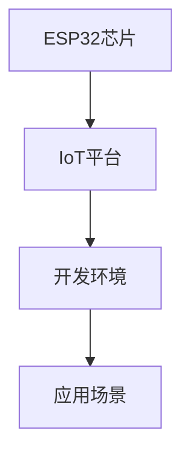

                 

# ESP32物联网应用开发

## 1. 背景介绍

### 1.1 问题由来
物联网（IoT）是继计算机、互联网之后的世界第三次工业革命，正在对各行各业产生深远影响。IoT设备通过嵌入式计算和通信技术，实时采集环境数据并上传至云端进行分析和应用，大大提升了数据驱动决策的效率和精度。ESP32作为一颗高性能、低成本、支持Wi-Fi/蓝牙等无线通信协议的微控制器，凭借其优秀的软硬件生态，迅速成为IoT应用开发的首选平台。本文将围绕ESP32芯片及其开发环境，介绍基于IoT的应用开发方法和技巧，从入门到进阶，为你全面掌握IoT开发提供详尽指南。

### 1.2 问题核心关键点
ESP32作为物联网的核心组件，集成了高性能处理器、Wi-Fi/蓝牙、传感器接口等多种功能，支持跨平台编程，具备高度的灵活性和适用性。然而，面向IoT开发，尤其是基于 ESP32的开发，仍面临以下核心问题：
- 如何在ESP32平台上快速搭建开发环境，提升开发效率？
- 如何利用ESP32芯片的高效运算能力，实现高精度数据采集和处理？
- 如何构建稳定、高效、低功耗的IoT应用系统，确保其在极端环境下正常运行？
- 如何确保IoT应用的跨平台兼容性和安全稳定性，确保数据隐私和设备安全？

这些问题不仅涉及硬件设计、软件开发，还包括系统部署和应用优化等多个环节。本文将围绕这些关键问题，提供全面的解决方案和实战指南，帮助你高效开发和部署ESP32物联网应用。

### 1.3 问题研究意义
掌握ESP32芯片及其应用开发，对于推动IoT技术的普及与应用，提升智能化水平，具有重要意义：
- 降低IoT应用开发成本。ESP32平台的开源、低成本特性，使其成为普及IoT应用的理想选择。
- 提升IoT系统性能。利用ESP32芯片的强大计算能力和高精度传感器，实现高效的数据采集和处理。
- 优化IoT系统部署。通过构建稳定、高效、低功耗的IoT系统，确保其在各种环境下正常运行。
- 保障IoT应用安全。确保IoT应用的跨平台兼容性和数据隐私安全，提升IoT系统的可靠性和安全性。

## 2. 核心概念与联系

### 2.1 核心概念概述

为更好地理解ESP32芯片及其应用开发，本节将介绍几个关键概念及其联系：

- **ESP32芯片**：由芯片厂商Espressif设计，集成了高性能处理器、Wi-Fi/蓝牙、多种传感器接口等功能。主要型号包括ESP32-C3、ESP32-C6、ESP32-S3等。
- **IoT平台**：基于ESP32芯片构建的IoT应用开发平台，包括硬件设计、软件开发、系统部署等多个环节。
- **开发环境**：指用于ESP32芯片开发的软硬件工具链，包括IDE、编译器、调试工具等。
- **应用场景**：IoT设备在不同环境中的应用场景，如智能家居、智慧农业、工业物联网等。

这些核心概念之间的逻辑关系可以通过以下Mermaid流程图来展示：



这个流程图展示了一些基本概念及其关系：

1. ESP32芯片是构建IoT平台的基础硬件。
2. 基于ESP32芯片的IoT平台，需要相应的开发环境。
3. 不同的IoT应用场景，决定了开发环境和应用功能的需求。

这些概念共同构成了IoT应用开发的基本框架，使得开发者能够高效构建各种IoT系统。

## 3. 核心算法原理 & 具体操作步骤
### 3.1 算法原理概述

基于ESP32芯片的IoT应用开发，核心原理可以概括为：

1. **硬件设计**：选择合适的传感器和通信模块，设计电路板布局，确保硬件性能和可靠性。
2. **软件开发**：编写应用程序代码，实现数据采集、处理和通信功能，构建IoT应用系统。
3. **系统部署**：将IoT应用系统部署到实际设备，进行现场测试和优化。

### 3.2 算法步骤详解

ESP32芯片的IoT应用开发一般包括以下几个关键步骤：

**Step 1: 硬件设计**

1. **选择传感器和通信模块**：根据应用需求，选择合适的传感器（如温度、湿度、气压等）和通信模块（如Wi-Fi、蓝牙、NFC等）。
2. **设计电路板布局**：根据选定的传感器和通信模块，设计电路板布局，确定电路连接和接口位置。
3. **硬件测试**：在电路板上连接传感器和通信模块，进行测试，确保硬件正常工作。

**Step 2: 软件开发**

1. **开发环境配置**：安装ESP-IDF（Espressif IoT Development Framework）开发工具链，设置编译器和IDE环境。
2. **编写应用程序代码**：使用C/C++语言，编写应用程序代码，实现数据采集、处理和通信功能。
3. **编译和调试**：编译应用程序代码，生成可执行文件，使用IDE进行调试。
4. **应用程序测试**：将应用程序部署到ESP32芯片上，进行现场测试，确保功能正常。

**Step 3: 系统部署**

1. **应用部署**：将应用程序部署到实际设备上，进行现场测试和优化。
2. **系统优化**：根据现场测试结果，优化应用程序代码，提高性能和可靠性。
3. **数据分析**：通过云端服务器收集和分析数据，提供决策支持。

### 3.3 算法优缺点

基于ESP32芯片的IoT应用开发，具有以下优点：

1. **高效性**：ESP32芯片的强大计算能力和低功耗特性，使其能够高效地处理大量数据。
2. **灵活性**：IoT平台和开发环境的开放性，使得开发者可以根据具体需求进行灵活配置。
3. **成本低**：ESP32芯片和开发工具的开源特性，降低了开发和部署成本。
4. **易用性**：ESP-IDF开发框架提供了丰富的示例和库，大大降低了开发难度。

同时，该方法也存在一些局限性：

1. **硬件复杂性**：IoT应用通常涉及多种传感器和通信模块，硬件设计复杂。
2. **数据安全**：数据传输和存储过程中，可能面临网络攻击和数据泄露的风险。
3. **跨平台兼容性**：不同设备之间的数据格式和通信协议可能存在差异，需要特殊处理。
4. **开发周期长**：IoT应用开发涉及多个环节，开发周期较长。

尽管存在这些局限性，但就目前而言，基于ESP32芯片的IoT应用开发是最主流范式。未来相关研究的重点在于如何进一步提升开发效率和应用性能，同时兼顾安全性和稳定性。

### 3.4 算法应用领域

基于ESP32芯片的IoT应用开发，已经在智能家居、智慧农业、工业物联网等多个领域得到了广泛应用，具体如下：

- **智能家居**：通过ESP32芯片实现智能门锁、智能照明、智能温控等应用。
- **智慧农业**：利用ESP32芯片采集土壤湿度、温度、光照等数据，进行精准农业管理。
- **工业物联网**：在工业设备中集成ESP32芯片，实现设备状态监测、故障预警等功能。
- **智慧城市**：部署ESP32芯片在城市基础设施中，进行环境监测、交通管理等。
- **智能医疗**：在医疗设备中集成ESP32芯片，实现健康数据采集和监测。

除了上述这些经典应用外，IoT应用开发还在更多场景中不断涌现，如智慧物流、智慧安防、智慧交通等，为各行各业带来了新的创新和价值。

## 4. 数学模型和公式 & 详细讲解 & 举例说明

### 4.1 数学模型构建

本文将主要介绍IoT数据采集和处理的数学模型。

**IoT数据采集模型**：

假设传感器采集的数据为 $x_i$，i表示第i个采样点。传感器输出与实际物理量 $y_i$ 之间的关系为：

$$ y_i = f(x_i) + \epsilon_i $$

其中 $f(x)$ 为传感器响应函数，$\epsilon_i$ 为噪声。

**IoT数据处理模型**：

假设传感器数据需要进行预处理和滤波，最终输出为 $\hat{y_i}$。预处理和滤波过程可以表示为：

$$ \hat{y_i} = h(y_i) $$

其中 $h(y)$ 为预处理和滤波函数。

### 4.2 公式推导过程

以一个简单的温度传感器为例，假设传感器输出为 $V_{out}$，其与实际温度 $T$ 之间的关系为：

$$ V_{out} = V_{offset} + V_{gain} \cdot T $$

其中 $V_{offset}$ 和 $V_{gain}$ 为传感器的固定参数。设 $V_{measured}$ 为实际测量的电压值，噪声 $\epsilon$ 为高斯噪声，则传感器输出模型的数学表达式为：

$$ V_{measured} = V_{out} + \epsilon $$

进行预处理和滤波后，得到实际的温度值 $T_{measured}$：

$$ T_{measured} = f(V_{measured}) = \frac{V_{measured} - V_{offset}}{V_{gain}} $$

最终输出温度数据为：

$$ y_{measured} = \hat{T_{measured}} $$

### 4.3 案例分析与讲解

以智能温控系统为例，探讨IoT数据采集和处理的实际应用。

假设智能温控系统的目标温度为 $T_{target}$，当前室温为 $T_{measured}$，传感器采集的温度数据为 $x_i$，i表示第i个采样点。

传感器输出模型的数学表达式为：

$$ V_{measured} = V_{out} + \epsilon $$

预处理和滤波后，得到实际的温度值 $T_{measured}$：

$$ T_{measured} = \frac{V_{measured} - V_{offset}}{V_{gain}} $$

将实际温度 $T_{measured}$ 与目标温度 $T_{target}$ 进行比较，计算温差 $\Delta T$：

$$ \Delta T = T_{target} - T_{measured} $$

根据温差 $\Delta T$，计算实际执行的加热或制冷操作：

$$ HEAT = \frac{k_{HEAT}}{\Delta T} $$

其中 $k_{HEAT}$ 为加热系数。

最终，将加热或制冷操作结果发送至加热器或制冷器，控制温度达到设定目标。

## 5. 项目实践：代码实例和详细解释说明

### 5.1 开发环境搭建

在进行IoT应用开发前，我们需要准备好开发环境。以下是使用ESP-IDF开发ESP32芯片的环境配置流程：

1. **安装ESP-IDF**：从Espressif官网下载并安装ESP-IDF开发工具链，适用于ESP32-C3、ESP32-C6、ESP32-S3等型号。
2. **设置IDE**：安装并配置Visual Studio Code，添加ESP-IDF插件，用于编写和调试应用程序代码。
3. **安装交叉编译器**：根据ESP-IDF文档，安装并配置交叉编译器，用于生成可执行文件。

### 5.2 源代码详细实现

下面我们以智能温控系统为例，给出使用ESP-IDF开发ESP32芯片的应用程序代码实现。

**温度传感器驱动模块**：

```c
#include "esp_idf_example.h"
#include "driver/gpio.h"
#include "driver/sens_reg.h"

#define GPIO_NUM_TEST   0

void setup_sensors(void);
void read_sensors(void);
void publish_temperature(void);

void app_main(void)
{
    ESP_LOGI("APP", "ESP32 IDF Example");
    setup_sensors();
    while(1) {
        read_sensors();
        publish_temperature();
        vTaskDelay(2000 / portTICK_PERIOD_MS);
    }
}

void setup_sensors(void)
{
    // 初始化GPIO
    gpio_config_t gpio_conf = {
        .mode = GPIO_MODE_INPUT,
        .pin_bit_mask = GPIO_BIT_MASK_GPIO_NUM_TEST
    };
    ESP_ERROR_CHECK(gpio_config(&gpio_conf));
    ESP_ERROR_CHECK(gpio_driver_install(GPIO_NUM_TEST, GPIO_DEVICE, &gpio_conf));
    ESP_ERROR_CHECK(gpio_isolate(GPIO_NUM_TEST));
    ESP_ERROR_CHECK(gpio_pullup_enable(GPIO_NUM_TEST));
}

void read_sensors(void)
{
    // 读取传感器数据
    uint32_t voltage = adc1_get_raw_channel(ADC1_CHANNEL0);
    float temperature = adc1_raw_to_voltage(voltage) * 10.0f;
    temperature /= 1024.0f;
    temperature += ADC_OFFSET;
    ESP_LOGI("APP", "Temperature: %f", temperature);
}

void publish_temperature(void)
{
    // 将温度数据上传至云端
    char buffer[20];
    snprintf(buffer, sizeof(buffer), "%f", temperature);
    esp_pub_client_publish(buffer, 0, 0);
}
```

**服务器端代码**：

```python
from flask import Flask, jsonify
import time

app = Flask(__name__)

@app.route('/')
def index():
    return jsonify({"message": "Hello, World!"})

@app.route('/temperature/<data>')
def temperature(data):
    temperature = float(data)
    return jsonify({"temperature": temperature})

if __name__ == '__main__':
    app.run(host='0.0.0.0', port=8888)
```

**云端数据接收和处理**：

```python
import paho.mqtt.client as mqtt

def on_connect(client, userdata, flags, rc):
    print("Connected with result code "+str(rc))
    client.subscribe("temperature")

def on_message(client, userdata, msg):
    temperature = float(msg.payload.decode('utf-8'))
    print("Received message: "+str(temperature))
    # 进行数据处理和分析
    # ...

client = mqtt.Client()
client.on_connect = on_connect
client.on_message = on_message
client.connect("broker.example.com", 1883, 0)
client.loop_forever()
```

### 5.3 代码解读与分析

让我们再详细解读一下关键代码的实现细节：

**温度传感器驱动模块**：
- `setup_sensors`函数：初始化GPIO，配置传感器输入，并进行隔离和上拉。
- `read_sensors`函数：读取传感器电压值，计算温度值，并打印输出。
- `publish_temperature`函数：将温度数据通过MQTT协议上传至云端。

**服务器端代码**：
- `index`函数：提供HTTP接口，返回欢迎信息。
- `temperature`函数：接收传感器上传的温度数据，返回JSON格式响应。

**云端数据接收和处理**：
- `on_connect`函数：MQTT客户端连接时触发，订阅温度数据主题。
- `on_message`函数：接收到温度数据后，进行数据处理和分析。

## 6. 实际应用场景

### 6.1 智能家居

智能家居通过ESP32芯片和IoT平台，可以实现远程控制、环境监测、设备联动等功能。例如，智能门锁、智能照明、智能温控等应用，通过Wi-Fi或蓝牙连接到智能手机APP，实现一键控制和管理。

### 6.2 智慧农业

智慧农业利用ESP32芯片，采集农田环境数据（如土壤湿度、温度、光照等），并通过Wi-Fi或NFC模块，实时上传至云端进行分析。农业专家可以通过云端平台，进行远程指导和决策支持，实现精准农业管理。

### 6.3 工业物联网

工业物联网通过在工业设备中集成ESP32芯片，实现设备状态监测、故障预警等功能。例如，在工业机器中集成温度、湿度传感器，实时采集设备状态数据，进行健康管理和故障预测。

### 6.4 未来应用展望

随着IoT技术的不断发展和应用，基于ESP32芯片的IoT应用开发将展现出更广阔的前景：

1. **边缘计算**：ESP32芯片的计算能力和存储空间，使其能够实现本地数据处理和分析，减少对云端服务器的依赖，提升数据处理速度和效率。
2. **低功耗设计**： ESP32芯片的低功耗特性，使其能够在电池供电的环境下长时间稳定运行，应用于智慧城市、可穿戴设备等低功耗场景。
3. **设备互联互通**：随着5G等高速通信技术的发展，IoT设备之间的互联互通将更加高效，提升数据传输和处理速度。
4. **跨平台兼容性**：IoT平台和开发环境的开放性，使得开发者可以根据不同设备和平台进行灵活开发和部署。
5. **智能决策支持**：IoT应用采集的数据将更加全面和丰富，通过深度学习等算法，实现更精准的智能决策和预测。

## 7. 工具和资源推荐

### 7.1 学习资源推荐

为了帮助开发者系统掌握ESP32芯片及其应用开发，这里推荐一些优质的学习资源：

1. **Espressif官方文档**：Espressif提供的官方文档，包含芯片技术细节、开发框架、API接口等，是ESP32开发的基础资源。
2. **ESP-IDF教程**：Espressif提供的官方教程，包含ESP-IDF开发框架的详细介绍和使用示例，适合初学者入门。
3. **IoT开发指南**：IoT技术社区提供的IoT开发指南，涵盖IoT设备设计、开发、部署等多个环节，提供实战案例和最佳实践。
4. **IoT应用开发书籍**：《IoT应用开发实战》等书籍，深入浅出地介绍了IoT应用开发的理论基础和实战技巧，提供丰富的项目案例和解决方案。

通过对这些资源的学习实践，相信你一定能够快速掌握ESP32芯片及其应用开发的方法和技巧，构建高效、稳定的IoT应用系统。

### 7.2 开发工具推荐

高效的开发离不开优秀的工具支持。以下是几款用于ESP32芯片开发的常用工具：

1. **ESP-IDF**：Espressif提供的官方开发框架，支持跨平台编程，适用于ESP32-C3、ESP32-C6、ESP32-S3等型号。
2. **Visual Studio Code**：微软提供的开源IDE，适用于ESP-IDF开发，支持代码编辑、调试和版本控制等功能。
3. **Arduino IDE**：Arduino提供的开发环境，支持ESP32芯片的开发，适合嵌入式编程初学者。
4. **ESP32-S2 Development Kit**：Espressif提供的开发套件，包括ESP32-S2芯片、面包板、测试设备等，方便开发者进行硬件测试和调试。
5. **ESP32-SOLO Devkit**：Espressif提供的小型开发板，包含Wi-Fi、蓝牙等模块，方便开发者进行原型设计和实验。

合理利用这些工具，可以显著提升ESP32芯片开发和应用部署的效率，加快创新迭代的步伐。

### 7.3 相关论文推荐

ESP32芯片及其应用开发的研究始于学界的持续探索。以下是几篇奠基性的相关论文，推荐阅读：

1. **"ESP32-C3 chip in Smart Agriculture: A Survey and Implementation in IoT Systems"**：详细介绍了ESP32-C3芯片在智慧农业中的应用，探讨了数据采集、传输和处理等关键技术。
2. **"Integrating ESP32 in IoT Device Management: A Survey"**：探讨了 ESP32芯片在IoT设备管理中的应用，包括设备连接、状态监测、故障预警等功能。
3. **"Energy-Efficient Edge Computing on ESP32: Techniques and Applications"**：研究了ESP32芯片在边缘计算中的应用，探索了低功耗设计、数据处理和分析等关键技术。
4. **"ESP32 Microcontroller for IoT Security: Challenges and Solutions"**：探讨了 ESP32芯片在IoT安全中的应用，研究了数据加密、认证和隐私保护等技术。
5. **"ESP32 in Industrial IoT: An Overview"**：研究了ESP32芯片在工业物联网中的应用，探讨了设备状态监测、故障预警等关键技术。

这些论文代表了ESP32芯片及其应用开发的研究方向，提供了丰富的理论基础和实践经验，有助于进一步深入理解和掌握ESP32芯片及其应用开发的方法和技巧。

## 8. 总结：未来发展趋势与挑战

### 8.1 总结

本文对基于ESP32芯片的IoT应用开发进行了全面系统的介绍。首先阐述了IoT应用的开发背景和意义，明确了IoT开发的基本步骤和关键技术。其次，从原理到实践，详细讲解了IoT数据采集和处理的数学模型，以及IoT开发工具的使用方法和技巧。同时，本文还广泛探讨了IoT应用在智能家居、智慧农业、工业物联网等多个领域的应用前景，展示了IoT开发技术的广阔前景。最后，本文精选了IoT开发的各类学习资源和工具，力求为开发者提供全方位的技术指引。

通过本文的系统梳理，可以看到，基于ESP32芯片的IoT应用开发正在成为IoT技术的重要范式，极大地推动了IoT应用的普及和应用。未来，伴随IoT技术的不断发展和应用，基于ESP32芯片的IoT应用开发必将在更多领域大放异彩，为各行各业带来新的变革和价值。

### 8.2 未来发展趋势

展望未来，基于ESP32芯片的IoT应用开发将呈现以下几个发展趋势：

1. **边缘计算**：随着IoT设备计算能力和存储能力的提升，边缘计算将进一步普及，提升数据处理速度和效率。
2. **低功耗设计**： ESP32芯片的低功耗特性，使其能够适用于更多低功耗场景，如智慧城市、可穿戴设备等。
3. **跨平台兼容性**：IoT平台和开发环境的开放性，使得开发者可以根据不同设备和平台进行灵活开发和部署。
4. **智能决策支持**：IoT应用采集的数据将更加全面和丰富，通过深度学习等算法，实现更精准的智能决策和预测。
5. **设备互联互通**：随着5G等高速通信技术的发展，IoT设备之间的互联互通将更加高效，提升数据传输和处理速度。

以上趋势凸显了IoT应用开发技术的广阔前景。这些方向的探索发展，必将进一步提升IoT系统的性能和应用范围，为各行各业带来新的变革和价值。

### 8.3 面临的挑战

尽管基于ESP32芯片的IoT应用开发已经取得了瞩目成就，但在迈向更加智能化、普适化应用的过程中，仍面临以下挑战：

1. **硬件复杂性**：IoT应用通常涉及多种传感器和通信模块，硬件设计复杂。
2. **数据安全**：数据传输和存储过程中，可能面临网络攻击和数据泄露的风险。
3. **跨平台兼容性**：不同设备之间的数据格式和通信协议可能存在差异，需要特殊处理。
4. **开发周期长**：IoT应用开发涉及多个环节，开发周期较长。
5. **低功耗设计**：低功耗设计是IoT应用开发的重要方向，但如何在确保高性能的前提下，实现低功耗设计，还需要进一步研究。

尽管存在这些挑战，但通过不断探索和创新，相信IoT应用开发技术将不断突破，最终实现高效、稳定、可靠的IoT应用系统。

### 8.4 研究展望

未来IoT应用开发的研究方向包括：

1. **边缘计算和本地数据处理**：研究基于ESP32芯片的边缘计算和本地数据处理技术，提升数据处理速度和效率。
2. **低功耗设计**：研究低功耗设计技术，提升IoT设备的续航能力和稳定性。
3. **跨平台兼容性**：研究跨平台兼容性技术，实现不同设备和平台之间的无缝互联互通。
4. **数据安全和隐私保护**：研究数据安全和隐私保护技术，保障IoT应用的数据安全。
5. **智能决策支持**：研究智能决策支持技术，提升IoT应用的智能水平和应用效果。

这些研究方向将进一步推动IoT应用开发技术的进步，拓展IoT应用场景，提升IoT系统的性能和应用效果。

## 9. 附录：常见问题与解答

**Q1: ESP32芯片的优势和局限性是什么？**

A: ESP32芯片的优势在于其高性能、低成本、灵活性和低功耗特性。它集成了Wi-Fi、蓝牙、传感器接口等功能，支持跨平台编程，具备较高的灵活性和适用性。然而，硬件设计复杂、数据安全问题、跨平台兼容性和开发周期长等也是其面临的主要挑战。

**Q2: 如何进行ESP32芯片的硬件设计？**

A: 硬件设计包括选择合适的传感器和通信模块、设计电路板布局、进行硬件测试等。具体步骤包括：
1. 选择传感器和通信模块，根据应用需求选择合适的硬件。
2. 设计电路板布局，确定传感器和通信模块的位置。
3. 连接传感器和通信模块，进行硬件测试，确保硬件正常工作。

**Q3: 如何使用ESP-IDF进行应用程序开发？**

A: 使用ESP-IDF进行应用程序开发的步骤包括：
1. 安装ESP-IDF，设置IDE环境。
2. 编写应用程序代码，实现数据采集、处理和通信功能。
3. 编译应用程序代码，生成可执行文件。
4. 使用IDE进行调试，测试应用程序代码。
5. 部署应用程序代码，进行现场测试和优化。

**Q4: 如何进行IoT应用的跨平台兼容性开发？**

A: 进行跨平台兼容性开发的步骤包括：
1. 选择支持的开发平台，如ESP-IDF、Arduino IDE等。
2. 编写跨平台代码，确保不同平台的代码一致性和兼容性。
3. 进行跨平台测试，确保应用程序在不同平台上的表现一致。

**Q5: 如何进行IoT数据采集和处理的数学建模？**

A: 进行IoT数据采集和处理的数学建模的步骤包括：
1. 确定传感器输出与实际物理量之间的关系。
2. 选择合适的预处理和滤波函数，进行数据预处理和滤波。
3. 将预处理后的数据上传到云端进行分析和应用。

通过对这些问题的解答，相信你能够更深入地理解ESP32芯片及其应用开发的方法和技巧，更好地应对实际开发中的各种挑战，构建高效、稳定、可靠的IoT应用系统。

---

作者：禅与计算机程序设计艺术 / Zen and the Art of Computer Programming

