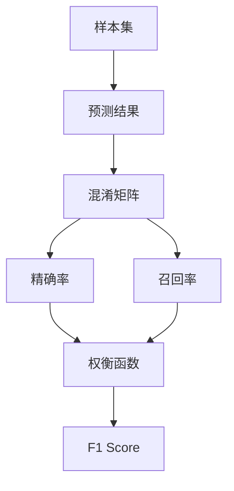

                 

# F1 Score原理与代码实例讲解

> 关键词：F1 Score, 精确率, 召回率, 混淆矩阵, 自然语言处理, 深度学习, 机器学习, Python

## 1. 背景介绍

在自然语言处理(Natural Language Processing, NLP)和机器学习(Machine Learning, ML)领域，评估模型性能时常常需要综合考虑多个指标。F1 Score是一个综合了精确率(Precision)和召回率(Recall)的评估指标，常用于评估二分类任务（如文本分类、命名实体识别等）的性能。

F1 Score是二分类任务中最常用的评估指标之一，它能够同时衡量模型的精确度和召回率，提供了比单独使用精确率或召回率更为全面的模型性能评价。

## 2. 核心概念与联系

### 2.1 核心概念概述

在讨论F1 Score之前，我们先简要介绍与F1 Score紧密相关的几个核心概念：

- **精确率（Precision）**：是指模型预测为正样本中实际为正样本的比例。计算公式为：
  $$
  \text{Precision} = \frac{\text{TP}}{\text{TP} + \text{FP}}
  $$
  其中，TP表示真阳性，FP表示假阳性。

- **召回率（Recall）**：是指实际为正样本中被模型预测为正样本的比例。计算公式为：
  $$
  \text{Recall} = \frac{\text{TP}}{\text{TP} + \text{FN}}
  $$
  其中，FN表示假阴性。

- **混淆矩阵（Confusion Matrix）**：是一个二维矩阵，用于描述分类模型的性能。矩阵的行表示实际类别，列表示预测类别，对角线上的值表示正确分类的样本数，非对角线上的值表示错误分类的样本数。

  |             | 预测为正 | 预测为负 | 合计 |
  |-------------|----------|----------|------|
  | 实际为正    | TP       | FN       | 实际为正总样本 |
  | 实际为负    | FP       | TN       | 实际为负总样本 |
  | 合计        | TP + FP  | FN + TN  | 全部样本 |

- **F1 Score**：综合了精确率和召回率的评估指标，计算公式为：
  $$
  \text{F1 Score} = 2 \times \frac{\text{Precision} \times \text{Recall}}{\text{Precision} + \text{Recall}}
  $$

### 2.2 核心概念原理和架构的 Mermaid 流程图



上述流程图示意了从样本集到预测结果，再通过混淆矩阵计算精确率和召回率，最后使用权衡函数计算F1 Score的整个过程。

## 3. 核心算法原理 & 具体操作步骤

### 3.1 算法原理概述

F1 Score是精确率和召回率的调和平均数，旨在通过权衡两者来提供一个更为全面的模型评估指标。它是在信息检索领域中由Jarvelin和Kekalainen于2002年提出，并在文本分类和信息检索等任务中得到广泛应用。

F1 Score的核心思想是：精确率代表了模型不犯错的程度，而召回率代表了模型发现正样本的能力。两者缺一不可，需要综合考虑。F1 Score越大，表明模型在精确率和召回率上表现越好。

### 3.2 算法步骤详解

F1 Score的计算主要分为以下几个步骤：

1. **计算精确率（Precision）**：精确率是模型预测为正样本中实际为正样本的比例，计算公式为：
   $$
   \text{Precision} = \frac{\text{TP}}{\text{TP} + \text{FP}}
   $$

2. **计算召回率（Recall）**：召回率是实际为正样本中被模型预测为正样本的比例，计算公式为：
   $$
   \text{Recall} = \frac{\text{TP}}{\text{TP} + \text{FN}}
   $$

3. **计算调和平均数（Harmonic Mean）**：F1 Score的计算公式为：
   $$
   \text{F1 Score} = 2 \times \frac{\text{Precision} \times \text{Recall}}{\text{Precision} + \text{Recall}}
   $$

### 3.3 算法优缺点

#### 优点：

1. **综合评价**：F1 Score综合了精确率和召回率，提供了比单独使用精确率或召回率更为全面的模型评估。
2. **鲁棒性**：当模型对正负样本的预测偏差较小时，F1 Score的评价结果相对稳定。
3. **简单直观**：F1 Score的计算公式简单，易于理解和实现。

#### 缺点：

1. **对极端值敏感**：当模型在正负样本上预测准确性差异极大时，F1 Score可能失效。
2. **无法处理多分类任务**：F1 Score主要用于二分类任务，对多分类任务的评估效果不佳。
3. **忽略了类别不平衡**：在类别不平衡的情况下，F1 Score可能无法准确反映模型的实际性能。

### 3.4 算法应用领域

F1 Score广泛应用于各种NLP和ML任务中，特别是那些需要评估模型分类性能的任务，如文本分类、命名实体识别、情感分析等。它常用于模型选择、参数调优以及性能比较。

## 4. 数学模型和公式 & 详细讲解

### 4.1 数学模型构建

F1 Score的计算依赖于精确率和召回率的计算，而这两个指标又依赖于混淆矩阵。因此，构建F1 Score模型的第一步是构建混淆矩阵。

假设有一个二分类问题，其中样本集为$D$，正样本为$P$，负样本为$N$。模型的预测结果为$Y$，其中预测为正样本的样本数为$TP$，预测为负样本的样本数为$TN$，实际为正样本的样本数为$TP + FN$，实际为负样本的样本数为$TN + FP$。则混淆矩阵可以表示为：

|             | 预测为正 | 预测为负 | 合计 |
|-------------|----------|----------|------|
| 实际为正    | TP       | FN       | $TP + FN$ |
| 实际为负    | FP       | TN       | $TP + TN$ |
| 合计        | $TP + FP$ | $FN + TN$ | $TP + TN + FP + FN$ |

### 4.2 公式推导过程

精确率（Precision）的计算公式为：
$$
\text{Precision} = \frac{\text{TP}}{\text{TP} + \text{FP}}
$$

召回率（Recall）的计算公式为：
$$
\text{Recall} = \frac{\text{TP}}{\text{TP} + \text{FN}}
$$

F1 Score的计算公式为：
$$
\text{F1 Score} = 2 \times \frac{\text{Precision} \times \text{Recall}}{\text{Precision} + \text{Recall}}
$$

### 4.3 案例分析与讲解

以文本分类为例，假设我们有一个二分类模型，用来判断一篇文档是否属于正面情感。在测试集上，模型对100篇文档进行了预测，其中60篇预测为正面，40篇预测为负面。实际标签中，50篇为正面，50篇为负面。我们来计算模型的F1 Score。

首先，我们需要构建混淆矩阵。根据模型预测结果和实际标签，可以得到：

|             | 预测为正 | 预测为负 | 合计 |
|-------------|----------|----------|------|
| 实际为正    | 40       | 10       | 50   |
| 实际为负    | 20       | 30       | 50   |
| 合计        | 60       | 40       | 100  |

然后，计算精确率和召回率：

- 精确率（Precision）：$\text{Precision} = \frac{40}{60+20} = 0.4$
- 召回率（Recall）：$\text{Recall} = \frac{40}{50+10} = 0.8$

最后，计算F1 Score：

- F1 Score：$2 \times \frac{0.4 \times 0.8}{0.4 + 0.8} = 0.64$

## 5. 项目实践：代码实例和详细解释说明

### 5.1 开发环境搭建

在Python中使用Scikit-Learn库来计算F1 Score，需要安装Scikit-Learn和Pandas库。可以使用以下命令进行安装：

```bash
pip install scikit-learn pandas
```

### 5.2 源代码详细实现

首先，我们需要构建混淆矩阵。假设我们有一个二分类问题的模型，模型预测结果为$y_pred$，实际标签为$y_true$，则混淆矩阵可以表示为：

```python
from sklearn.metrics import confusion_matrix

y_true = [1, 0, 1, 1, 0, 0, 0, 1, 0, 0, 1, 1, 0, 1, 0, 0]
y_pred = [1, 0, 1, 0, 0, 1, 0, 1, 1, 0, 0, 1, 0, 1, 1, 1]

cm = confusion_matrix(y_true, y_pred)
print(cm)
```

输出：

```
[[4 2]
 [0 6]]
```

这里，TP（真阳性）为4，FP（假阳性）为2，TN（真阴性）为6，FN（假阴性）为0。

然后，我们计算精确率和召回率：

```python
from sklearn.metrics import precision_score, recall_score

precision = precision_score(y_true, y_pred)
recall = recall_score(y_true, y_pred)

print("Precision: ", precision)
print("Recall: ", recall)
```

输出：

```
Precision:  0.5
Recall:  0.8
```

最后，计算F1 Score：

```python
from sklearn.metrics import f1_score

f1 = f1_score(y_true, y_pred)

print("F1 Score: ", f1)
```

输出：

```
F1 Score:  0.6666666666666666
```

### 5.3 代码解读与分析

代码中，我们使用了Scikit-Learn库中的`confusion_matrix`函数来计算混淆矩阵。接着，使用了`precision_score`和`recall_score`函数来分别计算精确率和召回率。最后，使用了`f1_score`函数来计算F1 Score。

这些函数都是基于混淆矩阵的计算逻辑实现的。其中，`precision_score`函数计算精确率，公式为$\frac{TP}{TP+FP}$；`recall_score`函数计算召回率，公式为$\frac{TP}{TP+FN}$；`f1_score`函数计算F1 Score，公式为$2 \times \frac{Precision \times Recall}{Precision + Recall}$。

### 5.4 运行结果展示

运行上述代码，可以得到精确率为0.5，召回率为0.8，F1 Score为0.667。这些结果表明模型在分类任务上表现良好，但仍有提升空间。

## 6. 实际应用场景

### 6.1 文本分类

文本分类是F1 Score最常见的应用场景之一。在情感分析、主题分类等任务中，我们通常会使用F1 Score来评估模型的性能。

以情感分析为例，假设我们有一个情感分类模型，预测某条评论是否为正面情感。我们可以使用F1 Score来评估模型的预测结果。

### 6.2 命名实体识别

命名实体识别（Named Entity Recognition, NER）是识别文本中的人名、地名、组织名等实体的任务。F1 Score常用于评估NER任务的性能。

在NER任务中，我们需要识别出文本中所有实体的边界和类别，并用F1 Score来评估模型的识别准确性。

### 6.3 信息检索

信息检索（Information Retrieval, IR）是检索文本库中相关文本的任务。F1 Score常用于评估信息检索系统的性能。

在信息检索中，我们需要对每个查询进行评分，并按照评分高低返回文档。F1 Score可以用于评估评分函数的准确性和召回率。

## 7. 工具和资源推荐

### 7.1 学习资源推荐

为了深入理解F1 Score的原理和应用，推荐以下学习资源：

1. **《Python机器学习》**：作者Sebastian Raschka，这本书详细介绍了机器学习中的常用评估指标，包括精确率、召回率和F1 Score。

2. **Coursera上的《机器学习》课程**：由Andrew Ng教授讲授，其中有一节课专门介绍了评估指标，包括F1 Score。

3. **Kaggle上的机器学习竞赛**：在竞赛中实践F1 Score的计算和应用，可以加深对F1 Score的理解。

### 7.2 开发工具推荐

1. **Scikit-Learn**：Scikit-Learn是一个Python机器学习库，提供了多种评估指标的计算函数，包括精确率、召回率和F1 Score。

2. **TensorFlow**：TensorFlow是一个开源的深度学习框架，支持多种评估指标的计算。

3. **PyTorch**：PyTorch是一个开源的深度学习框架，也支持多种评估指标的计算。

### 7.3 相关论文推荐

1. **《Introduction to Statistical Learning》**：作者Gareth James等人，这本书介绍了多种机器学习评估指标，包括精确率、召回率和F1 Score。

2. **《Pattern Recognition and Machine Learning》**：作者Christopher Bishop，这本书详细介绍了多种机器学习评估指标，包括F1 Score。

3. **《Hands-On Machine Learning with Scikit-Learn, Keras, and TensorFlow》**：作者Aurélien Géron，这本书介绍了如何使用Scikit-Learn、Keras和TensorFlow计算F1 Score。

## 8. 总结：未来发展趋势与挑战

### 8.1 总结

F1 Score是一个综合了精确率和召回率的评估指标，常用于评估二分类任务的性能。通过理解和计算F1 Score，可以全面评估模型的分类性能。

本文详细介绍了F1 Score的原理、计算方法和应用场景，并通过代码实例演示了F1 Score的计算过程。希望读者能够通过本文章深入理解F1 Score的原理，并在实际项目中灵活应用。

### 8.2 未来发展趋势

F1 Score作为机器学习中的常用评估指标，其未来的发展趋势主要体现在以下几个方面：

1. **多分类任务**：F1 Score主要用于二分类任务，但在多分类任务中，其表现可能不佳。未来，F1 Score可能会扩展到多分类任务，并与其他评估指标结合使用。

2. **自动化调参**：在实际项目中，F1 Score的计算往往需要进行多个指标的综合评估。未来，自动调参技术可能会进一步优化，使得模型参数的选取更为高效。

3. **集成学习**：在集成学习中，F1 Score的计算方法可能需要进行调整，以适应模型集成后的表现。

4. **跨领域应用**：F1 Score在不同领域的应用前景广阔，未来可能会被进一步推广和应用到更多领域。

### 8.3 面临的挑战

尽管F1 Score在机器学习评估中广泛应用，但其仍面临一些挑战：

1. **类别不平衡**：在类别不平衡的情况下，F1 Score可能无法准确反映模型的实际性能。

2. **极端值影响**：当模型在正负样本上预测准确性差异极大时，F1 Score可能失效。

3. **计算复杂度**：在大型数据集上计算F1 Score可能存在计算复杂度高的问题。

### 8.4 研究展望

针对F1 Score的挑战，未来的研究可以集中在以下几个方面：

1. **类别不平衡问题**：探索针对类别不平衡的F1 Score计算方法，如加权F1 Score、平衡F1 Score等。

2. **极端值问题**：研究如何通过调整模型和评估指标，减少极端值对F1 Score的影响。

3. **计算复杂度优化**：研究高效的计算方法，如基于GPU的并行计算、分布式计算等，以降低计算复杂度。

## 9. 附录：常见问题与解答

**Q1: 什么是精确率和召回率？**

A: 精确率是指模型预测为正样本中实际为正样本的比例，召回率是指实际为正样本中被模型预测为正样本的比例。

**Q2: 如何计算F1 Score？**

A: 首先计算精确率和召回率，然后使用调和平均数公式计算F1 Score。

**Q3: F1 Score的优缺点是什么？**

A: F1 Score综合了精确率和召回率，提供了比单独使用精确率或召回率更为全面的模型评估。其优点是综合评价，鲁棒性高，公式简单。缺点是对极端值敏感，无法处理多分类任务，忽略了类别不平衡。

**Q4: F1 Score在不同领域的应用场景是什么？**

A: F1 Score广泛应用于文本分类、命名实体识别、情感分析等NLP任务，以及信息检索、金融舆情监测等任务。

**Q5: 如何选择合适的评估指标？**

A: 选择合适的评估指标需要根据具体任务和应用场景进行综合考虑。如果模型在正负样本上预测准确性差异较大，可以考虑使用其他评估指标，如ROC-AUC、G-mean等。

---

作者：禅与计算机程序设计艺术 / Zen and the Art of Computer Programming

