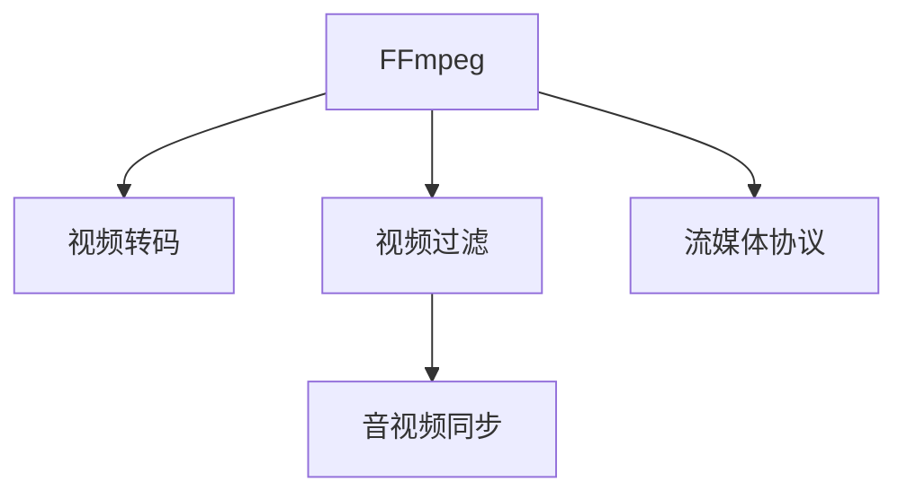

                 

# FFmpeg 视频处理：转码和过滤

## 1. 背景介绍

### 1.1 问题由来
随着互联网的普及和视频流媒体服务的兴起，视频处理在各个领域的应用愈发广泛。无论是传统的音视频编辑、流媒体传输，还是新兴的直播、在线教育、视频会议等，高质量的视频处理技术都是必不可少的。然而，不同平台和设备对视频格式和编码规范有不同的要求，使得跨平台视频传输和处理变得更加复杂。

FFmpeg 是一个广泛使用的开源视频处理工具，支持从录制、编辑到播放的各种视频格式和操作。它提供了强大的编码和解码功能，支持多种流媒体协议和格式转换。通过学习 FFmpeg 的转码和过滤技术，我们可以有效应对这些挑战，实现跨平台、跨设备的高效视频处理。

### 1.2 问题核心关键点
FFmpeg 的核心功能包括视频转码、视频过滤、音视频混合、流媒体传输等。本文将重点介绍 FFmpeg 的转码和过滤技术，包括其原理、操作流程、优缺点以及应用领域。

## 2. 核心概念与联系

### 2.1 核心概念概述

为更好地理解 FFmpeg 的转码和过滤技术，我们需要先掌握一些关键概念：

- **FFmpeg**：一个开源的音视频编解码库，支持多种视频格式和编解码操作，广泛应用于视频编辑、流媒体传输等领域。
- **视频转码**：将一种视频格式转换为另一种格式的过程，主要用于解决不同设备之间的兼容性问题。
- **视频过滤**：对视频进行特定的处理和修改，如裁剪、旋转、滤镜等，用于实现特殊效果或去除不需要的部分。
- **音视频同步**：确保视频和音频数据在时间上的精确同步，避免因不同步造成的干扰。
- **流媒体协议**：如 RTMP、HTTP Live Streaming (HLS)、MPEG-DASH 等，用于实现音视频的流式传输。

这些概念之间的逻辑关系可以通过以下 Mermaid 流程图来展示：



这个流程图展示出 FFmpeg 的核心功能：

1. FFmpeg 提供视频转码功能，支持多种格式之间的转换。
2. 可以对视频进行过滤操作，实现特定的视觉效果。
3. 可以实现音视频同步，确保多媒体的正常播放。
4. 支持多种流媒体协议，实现流式传输。

## 3. 核心算法原理 & 具体操作步骤
### 3.1 算法原理概述

FFmpeg 的视频转码和过滤操作主要基于以下原理：

- **视频转码**：基于编码器的解码和重新编码，实现不同视频格式之间的转换。
- **视频过滤**：通过对视频流的筛选、裁剪、旋转等操作，实现对视频内容的修改。

这些操作通常包括四个基本步骤：输入、处理、输出和设置。输入是原始视频文件，处理是对视频流的变换，输出是转换后的视频文件，设置则是针对转换过程的参数配置。

### 3.2 算法步骤详解

#### 3.2.1 视频转码

1. **输入配置**：
   - 指定输入文件路径和格式，如 `-i input.mp4`。
   - 指定输出文件路径和格式，如 `-c:v libx264 output.mp4`。

2. **编码设置**：
   - 设置编码器参数，如分辨率、帧率、码率等，如 `-vf scale=640:480 -r 25 output.mp4`。
   - 可以选择不同的编码器，如 `-c:v libx264 -crf 28 output.mp4`。

3. **输出配置**：
   - 指定输出文件路径，如 `output.mp4`。
   - 可以使用管道（`pipe:`）将多个操作串联，如 `ffmpeg -i input.mp4 -c:v libx264 -crf 28 -c:a copy output.mp4 -map 0`。

4. **参数优化**：
   - 使用 `-vcodec` 和 `-acodec` 参数调整编码器。
   - 使用 `-profile:v baseline` 和 `-level 3.0` 参数调整视频参数。
   - 使用 `-preset ultrafast` 参数优化编码速度。

#### 3.2.2 视频过滤

1. **输入配置**：
   - 指定输入文件路径和格式，如 `-i input.mp4`。

2. **滤镜设置**：
   - 使用 `-vf` 参数指定滤镜操作，如 `-vf scale=640:480`。
   - 可以使用多个滤镜，如 `-vf scale=640:480,format=nv12`。

3. **输出配置**：
   - 指定输出文件路径，如 `output.mp4`。

4. **参数优化**：
   - 使用 `-vf` 参数调整滤镜参数，如 `-vf scale=640:480,format=nv12`。
   - 使用 `-filter_complex` 参数进行复杂滤镜操作。

### 3.3 算法优缺点

#### 3.3.1 视频转码

优点：
- **支持多种格式**：FFmpeg 支持几乎所有的视频格式，可以轻松地进行格式转换。
- **高效编码**：FFmpeg 使用先进的编码算法，如 x264、hevc 等，可以高效地压缩视频数据。
- **灵活配置**：通过参数调整，可以实现高质量的输出。

缺点：
- **转换速度较慢**：特别是大文件和高码率的转换，可能需要较长时间。
- **内存占用高**：特别是在解码和重新编码过程中，内存占用较大。

#### 3.3.2 视频过滤

优点：
- **效果丰富**：支持多种滤镜操作，可以实现各种视觉效果。
- **灵活调整**：通过参数调整，可以实现精细的效果控制。

缺点：
- **计算量大**：特别是复杂滤镜操作，可能需要较高的计算资源。
- **容易出错**：参数设置不当可能导致输出不符合预期。

### 3.4 算法应用领域

FFmpeg 的转码和过滤技术在多个领域得到了广泛应用：

- **视频编辑**：将不同来源的视频进行格式转换和编辑，制作高质量的编辑视频。
- **流媒体传输**：将视频文件转换为适合流式传输的格式，支持各种流媒体平台。
- **在线教育**：将讲师的录制视频转换为适合在线播放的格式，提高教学质量。
- **视频会议**：将视频和音频数据进行同步处理，实现高质量的视频会议。
- **移动设备**：将视频转换为适合移动设备播放的格式，提高用户体验。

## 4. 数学模型和公式 & 详细讲解 & 举例说明

### 4.1 数学模型构建

FFmpeg 的视频转码和过滤操作主要基于视频编解码的原理。以下是一些常用的数学模型和公式：

#### 4.1.1 视频转码

视频转码的基本模型为：
$$
\text{Input} \rightarrow \text{Decode} \rightarrow \text{Encode} \rightarrow \text{Output}
$$

其中，输入为原始视频，解码器将输入视频转换为编码器可以处理的格式，编码器再将其转换为目标格式输出。

#### 4.1.2 视频过滤

视频过滤的基本模型为：
$$
\text{Input} \rightarrow \text{Filter} \rightarrow \text{Output}
$$

其中，输入为原始视频，滤镜对输入视频进行处理，得到最终输出。

### 4.2 公式推导过程

#### 4.2.1 视频转码

假设输入视频为 `input.mp4`，目标格式为 `output.mp4`，使用 x264 编码器，则转码命令为：
$$
\text{ffmpeg} \text{-i input.mp4} \text{-c:v libx264 output.mp4}
$$

### 4.3 案例分析与讲解

以将一个 4K 视频转换为 1080p 并调整帧率为 30fps 为例，命令如下：
$$
\text{ffmpeg} \text{-i input.mp4} \text{-c:v libx264} \text{-crf 28} \text{-vf scale=1920:1080} \text{-r 30} \text{output.mp4}
$$

- `-crf 28`：设置编码参数，控制编码质量。
- `-vf scale=1920:1080`：设置滤镜参数，调整分辨率。
- `-r 30`：设置帧率。

## 5. 项目实践：代码实例和详细解释说明

### 5.1 开发环境搭建

1. **安装 FFmpeg**：
   - 下载最新版本的 FFmpeg 二进制文件，如 `ffmpeg-4.3.4-88c9994.tar.bz2`。
   - 解压并移动到 `/usr/local/ffmpeg`。
   - 添加环境变量，如：

     ```bash
     sudo export LD_LIBRARY_PATH=$LD_LIBRARY_PATH:/usr/local/ffmpeg/lib:$LD_LIBRARY_PATH
     sudo export PATH=$PATH:/usr/local/ffmpeg/bin:$PATH
     ```

2. **安装依赖包**：
   - 安装必要的依赖包，如 `ffmpeg-devel` 和 `libx264`。

   ```bash
   sudo apt-get install ffmpeg-devel libx264-dev
   ```

3. **测试安装**：
   - 测试是否安装成功，可以使用以下命令：

     ```bash
     ffmpeg -version
     ffmpeg -formats
     ffmpeg -filters
     ffmpeg -codecs
     ```

### 5.2 源代码详细实现

#### 5.2.1 视频转码

将 `input.mp4` 转换为 `output.mp4`，命令如下：

```bash
ffmpeg -i input.mp4 -c:v libx264 output.mp4
```

#### 5.2.2 视频过滤

将 `input.mp4` 转换为 `output.mp4`，命令如下：

```bash
ffmpeg -i input.mp4 -vf scale=640:480 output.mp4
```

### 5.3 代码解读与分析

- **视频转码**：使用 `-c:v libx264` 参数指定编码器为 x264，实现高质量的视频转码。
- **视频过滤**：使用 `-vf` 参数指定滤镜操作，实现对视频内容的修改。

### 5.4 运行结果展示

运行上述命令后，会在当前目录下生成 `output.mp4` 文件，其视频格式和编码参数已经按照指定要求进行了转换。

## 6. 实际应用场景

### 6.1 视频编辑

在视频编辑中，FFmpeg 常用于将不同来源的视频进行格式转换和编辑。例如，将不同格式的录制视频进行转码，以适应特定的播放平台。此外，还可以使用滤镜对视频进行裁剪、旋转、滤镜等操作，实现各种视觉效果。

### 6.2 流媒体传输

在流媒体传输中，FFmpeg 可以轻松地将视频文件转换为适合流式传输的格式，如 HLS、DASH 等。这些格式支持实时流传输，能够在不同的设备和平台上流畅播放。

### 6.3 在线教育

在在线教育中，FFmpeg 可以用于将讲师的录制视频转换为适合在线播放的格式，如 MP4、WebM 等。通过调整视频和音频参数，可以实现高质量的在线教学。

### 6.4 视频会议

在视频会议中，FFmpeg 可以用于将视频和音频数据进行同步处理，实现高质量的视频会议。通过调整视频和音频参数，可以适应不同的设备和网络条件，保证视频会议的流畅性。

### 6.5 移动设备

在移动设备上，FFmpeg 可以用于将视频转换为适合移动设备播放的格式，如 MP4、WebM 等。通过调整视频和音频参数，可以实现高质量的视频播放体验。

## 7. 工具和资源推荐

### 7.1 学习资源推荐

1. **FFmpeg 官方文档**：
   - 详细介绍了 FFmpeg 的使用方法和参数配置。
   - 地址：[https://ffmpeg.org/doxygen.html](https://ffmpeg.org/doxygen.html)

2. **FFmpeg 教程**：
   - 提供了详细的教程和实例，适合初学者入门。
   - 地址：[https://ffmpeg.org/tutorials.html](https://ffmpeg.org/tutorials.html)

3. **视频编解码原理**：
   - 介绍了视频编解码的基本原理和算法。
   - 地址：[https://en.wikipedia.org/wiki/Video_compression](https://en.wikipedia.org/wiki/Video_compression)

4. **视频滤镜操作**：
   - 详细介绍了各种视频滤镜操作。
   - 地址：[https://ffmpeg.org/ffmpeg-filters.html](https://ffmpeg.org/ffmpeg-filters.html)

5. **流媒体协议**：
   - 介绍了各种流媒体协议及其应用。
   - 地址：[https://en.wikipedia.org/wiki/HTTP_Live_Streaming](https://en.wikipedia.org/wiki/HTTP_Live_Streaming)

### 7.2 开发工具推荐

1. **Linux 环境**：
   - 适用于各种 Linux 发行版，支持全面的 FFmpeg 功能。
   - 推荐使用 Ubuntu、CentOS 等系统。

2. **Mac OS X**：
   - 提供了针对 macOS 的预编译版本，易于安装和使用。
   - 地址：[https://ffmpeg.org/download.html](https://ffmpeg.org/download.html)

3. **Windows**：
   - 提供了针对 Windows 的预编译版本，易于安装和使用。
   - 地址：[https://ffmpeg.zeranoe.com/builds/](https://ffmpeg.zeranoe.com/builds/)

### 7.3 相关论文推荐

1. **Video Encoding and Decoding**：
   - 介绍了视频编码和解码的基本原理和技术。
   - 作者：Michael Marcellin。
   - 地址：[https://www.iro.umontreal.ca/~martin/multimedia-book/multimedia-book.pdf](https://www.iro.umontreal.ca/~martin/multimedia-book/multimedia-book.pdf)

2. **Real-Time Streaming Protocols**：
   - 介绍了各种流媒体协议及其应用。
   - 作者：Konstantinos Katsikas。
   - 地址：[https://www.konstantinoskatsikas.com/wp-content/uploads/2015/02/Real-Time-Streaming-Protocols.pdf](https://www.konstantinoskatsikas.com/wp-content/uploads/2015/02/Real-Time-Streaming-Protocols.pdf)

3. **Video Filtering and Effects**：
   - 介绍了各种视频滤镜操作及其实现。
   - 作者：Larry King。
   - 地址：[https://www.safaribooksonline.com/library/view/ffmpeg-video-editing/9781449365341/ch05.html](https://www.safaribooksonline.com/library/view/ffmpeg-video-editing/9781449365341/ch05.html)

## 8. 总结：未来发展趋势与挑战

### 8.1 研究成果总结

FFmpeg 作为一款强大的开源视频处理工具，已经在视频转码、视频过滤、音视频同步、流媒体传输等方面取得了显著成果。其在不同的应用场景中，通过灵活配置参数，实现了高效的视频处理和高质量的视频输出。

### 8.2 未来发展趋势

1. **高效编码**：未来将进一步提升视频编码的效率和质量，通过优化算法和硬件加速，实现更高效的转码操作。
2. **智能滤镜**：利用人工智能技术，实现智能化的视频滤镜操作，提升滤镜效果的智能化水平。
3. **跨平台支持**：未来将支持更多的平台和设备，提供更全面的跨平台支持。
4. **低延迟传输**：随着 5G 技术的发展，低延迟视频传输将成为主流，FFmpeg 将进一步优化流媒体传输的效率和稳定性。

### 8.3 面临的挑战

1. **高性能计算**：视频转码和滤镜操作需要高性能的计算资源，未来需要提升计算性能和资源利用率。
2. **兼容性问题**：不同设备和平台对视频格式和编码规范的要求不同，如何实现跨平台兼容仍然是一个挑战。
3. **内存占用**：特别是在处理大文件和复杂滤镜操作时，内存占用较大，需要优化内存使用。

### 8.4 研究展望

未来的研究需要从以下几个方向进行探索：

1. **优化编码算法**：进一步优化视频编码算法，提升编码效率和质量。
2. **引入人工智能**：利用人工智能技术，提升视频滤镜的智能化水平。
3. **跨平台优化**：优化跨平台支持，提升在不同设备和系统上的兼容性和性能。
4. **资源管理**：优化资源使用，减少内存占用和计算时间。

## 9. 附录：常见问题与解答

**Q1：FFmpeg 支持哪些视频格式？**

A: FFmpeg 支持几乎所有的视频格式，包括常见的 AVI、MP4、MKV、WMV、MOV 等。具体支持的格式可以参考官方文档。

**Q2：如何进行高质量的视频转码？**

A: 可以通过调整参数如编码器、码率、分辨率等，进行高质量的视频转码。如使用 `-crf 28` 参数控制编码质量，使用 `-vf scale=640:480` 参数调整分辨率。

**Q3：如何进行视频过滤？**

A: 可以使用各种滤镜操作，如 `-vf scale=640:480` 调整分辨率，使用 `-vf crop=100:100:400:300` 裁剪视频，使用 `-vf flip` 翻转视频等。

**Q4：如何进行音视频同步？**

A: 可以使用 `-ad 1` 参数调整音频流，使用 `-af vbr_qt` 参数调整音频编码，确保音频和视频同步。

**Q5：如何进行流媒体传输？**

A: 可以使用 `-f hls` 参数进行 HLS 流传输，使用 `-f mpegts` 参数进行 MPEG-DASH 流传输。

---

作者：禅与计算机程序设计艺术 / Zen and the Art of Computer Programming

