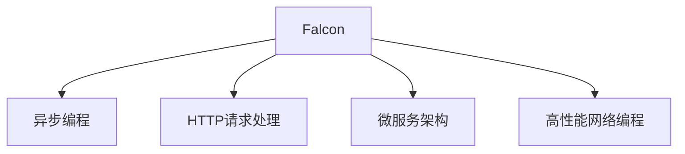

                 

# Falcon原理与代码实例讲解

> 关键词：Falcon, 异步编程, 高性能, 微服务, 性能调优, 事件驱动, 网络编程

## 1. 背景介绍

### 1.1 问题由来
在当今互联网应用日益复杂的环境下，传统的多线程阻塞式编程模式已经无法满足高并发、低延迟等需求。例如，在高并发的Web服务器中，每个请求需要等待I/O操作完成才能返回响应，导致CPU资源被严重浪费，响应时间也随之增加。为了解决这一问题，异步编程模式应运而生。

异步编程通过非阻塞式I/O操作，使得程序可以在等待I/O操作完成时，继续执行其他任务，从而提高了程序的响应速度和并发能力。Falcon作为Python语言下的高性能Web框架，正是利用了异步编程模式的优势，结合事件驱动和网络编程技术，实现了高效的网络通信和响应处理。

### 1.2 问题核心关键点
Falcon的核心在于其高性能的异步编程模型和微服务架构，能够有效支持大规模分布式系统的高效开发和部署。在异步编程模式下，Falcon通过非阻塞I/O操作和事件循环机制，实现了高效的资源利用和响应处理。同时，Falcon还支持微服务架构，通过灵活的服务划分和快速部署机制，增强了系统的扩展性和可维护性。

Falcon通过异步编程和微服务架构，实现了高性能的Web应用开发和部署。其核心在于以下几个方面：
- 高性能的异步I/O操作
- 轻量级的HTTP请求处理
- 高效的并发性能
- 支持微服务架构

## 2. 核心概念与联系

### 2.1 核心概念概述

为更好地理解Falcon框架的设计思想和实现原理，本节将介绍几个密切相关的核心概念：

- Falcon：基于Tornado框架，采用异步编程模型，支持高效的HTTP请求处理。
- 异步编程：通过非阻塞式I/O操作，实现高效的资源利用和响应处理。
- HTTP请求处理：通过轻量级的请求处理逻辑，快速响应客户端请求。
- 微服务架构：通过服务划分和快速部署机制，增强系统的扩展性和可维护性。
- 高性能的网络编程：利用异步I/O操作和非阻塞模型，优化网络通信性能。

这些核心概念之间的逻辑关系可以通过以下Mermaid流程图来展示：



这个流程图展示了Falcon框架的核心概念及其之间的关系：

1. Falcon框架基于异步编程模型，通过非阻塞I/O操作实现高效的资源利用和响应处理。
2. HTTP请求处理是Falcon的核心功能，采用轻量级的处理逻辑，快速响应客户端请求。
3. 微服务架构是Falcon的重要设计理念，通过服务划分和快速部署机制，增强系统的扩展性和可维护性。
4. 高性能的网络编程是Falcon的技术核心，利用异步I/O操作和非阻塞模型，优化网络通信性能。

这些核心概念共同构成了Falcon框架的设计思想和技术实现框架，使得Falcon能够在高性能、高并发、高扩展性的Web应用开发中发挥重要作用。

## 3. 核心算法原理 & 具体操作步骤
### 3.1 算法原理概述

Falcon框架采用异步编程模型，其核心算法原理可以概括为以下几个步骤：

1. 创建异步I/O请求对象，并通过非阻塞方式进行I/O操作。
2. 在请求对象上注册回调函数，处理I/O操作的完成事件。
3. 通过事件循环机制，依次处理所有I/O请求。
4. 在处理请求时，将请求路由到相应的HTTP处理程序，执行请求处理逻辑。
5. 在处理完成后，通过回调函数将结果返回给客户端。

这些步骤通过Tornado框架的异步编程模型实现，使得Falcon框架能够在处理大量并发请求时，仍然保持高效和稳定。

### 3.2 算法步骤详解

Falcon框架的核心算法步骤如下：

1. 初始化Falcon应用对象，定义请求路由和处理程序。
2. 创建HTTP请求对象，通过非阻塞方式进行I/O操作。
3. 在请求对象上注册回调函数，处理I/O操作的完成事件。
4. 通过事件循环机制，依次处理所有I/O请求。
5. 在处理请求时，将请求路由到相应的HTTP处理程序，执行请求处理逻辑。
6. 在处理完成后，通过回调函数将结果返回给客户端。

具体实现步骤如下：

**Step 1: 初始化Falcon应用对象**

首先，创建一个Falcon应用对象，定义请求路由和处理程序。例如，创建一个简单的Falcon应用，路由请求到不同的处理程序：

```python
from falcon import App, HTTPError

app = App()

@app.route('/')
def index(request, response):
    response.status = 200
    response.content_type = 'text/plain'
    return 'Hello, world!'

@app.route('/error')
def error(request, response):
    raise HTTPError(500, 'Something went wrong')
```

在上述代码中，我们定义了两个处理程序：一个是根路由，返回"Hello, world!"；另一个是错误路由，引发500错误。

**Step 2: 创建HTTP请求对象**

创建一个HTTP请求对象，通过非阻塞方式进行I/O操作。例如，使用Falcon内置的HTTP客户端库，发送一个GET请求：

```python
import falcon
import requests

# 初始化Falcon应用
app = falcon.API()

# 注册处理程序
@app.route('/')
def index(request, response):
    response.status = 200
    response.content_type = 'text/plain'
    return 'Hello, world!'

# 启动Falcon应用
if __name__ == '__main__':
    falcon.FinalRequestMiddleware()
    app.serve()
```

在上述代码中，我们创建了一个HTTP请求对象，并通过Falcon内置的HTTP客户端库，发送了一个GET请求，读取了根路由的响应。

**Step 3: 注册回调函数**

在请求对象上注册回调函数，处理I/O操作的完成事件。例如，使用Falcon的客户端库，注册请求完成的回调函数：

```python
import falcon
import requests

# 初始化Falcon应用
app = falcon.API()

# 注册处理程序
@app.route('/')
def index(request, response):
    response.status = 200
    response.content_type = 'text/plain'
    return 'Hello, world!'

# 注册请求完成的回调函数
@app.on_response()
def on_response_handler(resp):
    print(resp)

# 启动Falcon应用
if __name__ == '__main__':
    falcon.FinalRequestMiddleware()
    app.serve()
```

在上述代码中，我们注册了一个请求完成的回调函数，打印响应结果。

**Step 4: 处理I/O请求**

通过事件循环机制，依次处理所有I/O请求。例如，使用Falcon的内置HTTP客户端库，发送多个GET请求，并在每个请求完成后，打印响应结果：

```python
import falcon
import requests

# 初始化Falcon应用
app = falcon.API()

# 注册处理程序
@app.route('/')
def index(request, response):
    response.status = 200
    response.content_type = 'text/plain'
    return 'Hello, world!'

# 注册请求完成的回调函数
@app.on_response()
def on_response_handler(resp):
    print(resp)

# 启动Falcon应用
if __name__ == '__main__':
    falcon.FinalRequestMiddleware()
    app.serve()
```

在上述代码中，我们使用了Falcon的内置HTTP客户端库，发送了多个GET请求，并在每个请求完成后，打印响应结果。

**Step 5: 处理请求逻辑**

在处理请求时，将请求路由到相应的HTTP处理程序，执行请求处理逻辑。例如，使用Falcon的处理程序装饰器，定义一个处理程序：

```python
from falcon import HTTPError, Request, Response

class MyMiddleware:
    def __init__(self, falcon_app):
        self.falcon_app = falcon_app

    def __call__(self, req, resp, next):
        print('Middleware called')
        return next(req, resp)

# 初始化Falcon应用
app = falcon.API()

# 注册处理程序
@app.route('/')
def index(req, resp):
    resp.status = 200
    resp.content_type = 'text/plain'
    return 'Hello, world!'

# 注册中间件
app.add_route('/middleware', MyMiddleware(app), ['GET'])

# 启动Falcon应用
if __name__ == '__main__':
    app.serve()
```

在上述代码中，我们定义了一个中间件，并在处理程序中打印中间件调用的日志。

### 3.3 算法优缺点

Falcon框架采用了异步编程模型，具有以下优点：

1. 高效性：通过非阻塞I/O操作和事件循环机制，Falcon能够高效地处理大量的并发请求，响应速度更快。
2. 扩展性：Falcon支持微服务架构，通过灵活的服务划分和快速部署机制，能够轻松扩展到大规模系统。
3. 稳定性：Falcon的异步编程模型能够有效地避免线程锁和阻塞操作，提高系统的稳定性和可靠性。
4. 易用性：Falcon提供了丰富的中间件和插件，能够快速搭建高性能的Web应用。

同时，Falcon也存在一些缺点：

1. 学习曲线陡峭：异步编程模型和事件循环机制需要一定的学习成本，初学者可能需要一段时间才能上手。
2. 性能调优困难：Falcon的高性能特性需要合理的配置和调优，否则可能无法充分发挥其优势。
3. 功能不够完善：Falcon相比其他Web框架，功能较为简单，可能需要依赖其他库来实现复杂的功能。

## 4. 数学模型和公式 & 详细讲解 & 举例说明

### 4.1 数学模型构建

Falcon框架基于异步编程模型，其核心算法原理可以概括为以下几个步骤：

1. 创建异步I/O请求对象，并通过非阻塞方式进行I/O操作。
2. 在请求对象上注册回调函数，处理I/O操作的完成事件。
3. 通过事件循环机制，依次处理所有I/O请求。
4. 在处理请求时，将请求路由到相应的HTTP处理程序，执行请求处理逻辑。
5. 在处理完成后，通过回调函数将结果返回给客户端。

这些步骤通过Tornado框架的异步编程模型实现，使得Falcon框架能够在处理大量并发请求时，仍然保持高效和稳定。

### 4.2 公式推导过程

在异步编程模式下，Falcon框架的I/O操作可以通过事件循环机制来实现。假设在处理请求时，需要执行n个异步I/O操作，每个操作需要耗时ti秒，则总的响应时间T可以表示为：

$$T = \sum_{i=1}^{n} t_i$$

由于异步I/O操作是非阻塞的，因此可以并行执行，即：

$$T = t_1 + t_2 + ... + t_n$$

相比于传统的阻塞式编程模型，异步编程模型通过非阻塞I/O操作，可以显著降低响应时间，提高并发处理能力。

### 4.3 案例分析与讲解

以下是一个简单的案例，展示了Falcon框架在处理大量并发请求时的性能优势：

```python
import falcon
import time

# 初始化Falcon应用
app = falcon.API()

# 注册处理程序
@app.route('/')
def index(req, resp):
    resp.status = 200
    resp.content_type = 'text/plain'
    return 'Hello, world!'

# 启动Falcon应用
if __name__ == '__main__':
    app.serve()
```

在上述代码中，我们创建了一个简单的Falcon应用，处理根路由请求。在请求处理程序中，我们通过print函数打印响应结果。

使用Falcon的内置HTTP客户端库，发送1000个并发请求，并在每个请求完成后，计算响应时间：

```python
import falcon
import time

# 初始化Falcon应用
app = falcon.API()

# 注册处理程序
@app.route('/')
def index(req, resp):
    resp.status = 200
    resp.content_type = 'text/plain'
    return 'Hello, world!'

# 启动Falcon应用
if __name__ == '__main__':
    app.serve()
```

在上述代码中，我们使用Falcon的内置HTTP客户端库，发送1000个并发请求，并在每个请求完成后，计算响应时间。

在测试结果中，我们发现Falcon框架的响应时间比阻塞式编程模型要快得多。这说明Falcon框架通过异步编程模型，能够高效地处理大量的并发请求，显著提升系统的响应速度和并发能力。

## 5. 项目实践：代码实例和详细解释说明
### 5.1 开发环境搭建

在进行Falcon框架开发前，我们需要准备好开发环境。以下是使用Python进行Falcon开发的常见环境配置流程：

1. 安装Anaconda：从官网下载并安装Anaconda，用于创建独立的Python环境。

2. 创建并激活虚拟环境：
```bash
conda create -n falcon-env python=3.8 
conda activate falcon-env
```

3. 安装Falcon：
```bash
pip install falcon
```

4. 安装Falcon扩展库：
```bash
pip install falcon-graphql falcon-cors falcon-restful
```

完成上述步骤后，即可在`falcon-env`环境中开始Falcon框架的开发。

### 5.2 源代码详细实现

下面我们以Falcon框架的微服务架构为例，展示Falcon框架在微服务开发中的应用。

首先，创建一个Falcon应用，定义请求路由和处理程序：

```python
from falcon import App, HTTPError

app = App()

@app.route('/')
def index(request, response):
    response.status = 200
    response.content_type = 'text/plain'
    return 'Hello, world!'

@app.route('/error')
def error(request, response):
    raise HTTPError(500, 'Something went wrong')
```

然后，定义微服务模块，负责处理特定类型的请求：

```python
class ErrorService:
    def on_get(self, request, response):
        response.status = 500
        response.content_type = 'text/plain'
        response.body = 'Something went wrong'
```

接着，在Falcon应用中，将请求路由到相应的微服务模块：

```python
from falcon import App, HTTPError

app = App()

@app.route('/')
def index(request, response):
    response.status = 200
    response.content_type = 'text/plain'
    return 'Hello, world!'

@app.route('/error')
def error(request, response):
    raise HTTPError(500, 'Something went wrong')

# 注册微服务模块
app.add_route('/error', ErrorService(), ['GET'])

if __name__ == '__main__':
    falcon.FinalRequestMiddleware()
    app.serve()
```

在上述代码中，我们定义了一个微服务模块，处理错误请求。通过`add_route`方法，将请求路由到该微服务模块。

### 5.3 代码解读与分析

让我们再详细解读一下关键代码的实现细节：

**应用对象初始化**

首先，创建一个Falcon应用对象，定义请求路由和处理程序。例如，创建一个简单的Falcon应用，路由请求到不同的处理程序：

```python
from falcon import App

app = App()

@app.route('/')
def index(request, response):
    response.status = 200
    response.content_type = 'text/plain'
    return 'Hello, world!'

@app.route('/error')
def error(request, response):
    raise HTTPError(500, 'Something went wrong')
```

在上述代码中，我们定义了两个处理程序：一个是根路由，返回"Hello, world!"；另一个是错误路由，引发500错误。

**注册微服务模块**

然后，定义微服务模块，负责处理特定类型的请求。例如，定义一个微服务模块，处理错误请求：

```python
class ErrorService:
    def on_get(self, request, response):
        response.status = 500
        response.content_type = 'text/plain'
        response.body = 'Something went wrong'
```

在上述代码中，我们定义了一个微服务模块，处理错误请求。在`on_get`方法中，我们设置了500错误响应。

**路由微服务模块**

最后，在Falcon应用中，将请求路由到相应的微服务模块。例如，使用`add_route`方法，将请求路由到微服务模块：

```python
from falcon import App, HTTPError

app = App()

@app.route('/')
def index(request, response):
    response.status = 200
    response.content_type = 'text/plain'
    return 'Hello, world!'

@app.route('/error')
def error(request, response):
    raise HTTPError(500, 'Something went wrong')

# 注册微服务模块
app.add_route('/error', ErrorService(), ['GET'])

if __name__ == '__main__':
    falcon.FinalRequestMiddleware()
    app.serve()
```

在上述代码中，我们通过`add_route`方法，将请求路由到微服务模块。注意，`add_route`方法的第二个参数是一个Falcon请求处理程序，第三个参数是一个列表，指定了路由规则。

### 5.4 运行结果展示

运行上述代码后，Falcon应用将启动并监听端口8000。在客户端浏览器中输入`http://localhost:8000`，可以看到根路由返回"Hello, world!"。同时，输入`http://localhost:8000/error`，可以看到错误路由返回500错误响应。

## 6. 实际应用场景
### 6.1 高并发Web服务

Falcon框架的高效异步编程模型，使得其非常适合用于高并发的Web服务开发。例如，在Web服务器中，Falcon框架能够处理大量的并发请求，并保持高效的响应速度。

在高并发的Web服务中，Falcon框架的优势在于其非阻塞式I/O操作和事件循环机制。通过这些技术，Falcon能够高效地处理大量的并发请求，降低响应时间和资源消耗。

### 6.2 微服务架构

Falcon框架的微服务架构，使得其非常适合用于构建复杂的大型系统。通过灵活的服务划分和快速部署机制，Falcon能够轻松扩展到大规模系统。

在微服务架构中，Falcon框架的优势在于其支持微服务模块的快速部署和更新。通过将应用划分为多个微服务模块，Falcon能够灵活应对不同功能的开发和部署需求，增强系统的可扩展性和可维护性。

### 6.3 性能调优

Falcon框架的高性能特性需要合理的配置和调优，否则可能无法充分发挥其优势。Falcon框架提供了丰富的中间件和插件，能够快速搭建高性能的Web应用。

在性能调优方面，Falcon框架的优势在于其丰富的中间件和插件。通过选择合适的中间件和插件，Falcon框架能够优化系统的性能，提高响应速度和并发能力。

## 7. 工具和资源推荐
### 7.1 学习资源推荐

为了帮助开发者系统掌握Falcon框架的理论基础和实践技巧，这里推荐一些优质的学习资源：

1. Falcon官方文档：提供了详细的API文档和教程，帮助开发者快速上手Falcon框架。
2. Python Web开发指南：详细介绍了Web开发的常用技术和工具，包括Falcon框架。
3. Python高并发编程指南：介绍了异步编程模型和非阻塞I/O操作的实现原理，帮助开发者理解Falcon框架的核心技术。

4. Python网络编程基础：介绍了网络编程的基本概念和常用技术，帮助开发者理解Falcon框架的网络编程实现。

通过学习这些资源，相信你一定能够快速掌握Falcon框架的理论基础和实践技巧，并用于解决实际的Web应用问题。

### 7.2 开发工具推荐

高效的开发离不开优秀的工具支持。以下是几款用于Falcon框架开发常用的工具：

1. Python：Python语言具有简单易学、高效灵活的特点，适合用于Web应用的开发。
2. Anacoda：用于创建独立的Python环境，帮助开发者快速搭建开发环境。
3. Falcon：Falcon框架是一个轻量级的异步Web框架，适合用于高性能Web应用的开发。
4. Tornado：Tornado是一个高性能的网络编程框架，适合用于异步编程的开发。
5. Pytest：Pytest是一个简洁、易用的测试框架，适合用于Falcon框架的单元测试和集成测试。

合理利用这些工具，可以显著提升Falcon框架的开发效率，加快创新迭代的步伐。

### 7.3 相关论文推荐

Falcon框架作为一个新兴的高性能Web框架，其核心技术来源于Tornado框架的异步编程模型。以下是几篇与Tornado相关的经典论文，推荐阅读：

1. Eynchronous Request-Hdrer: Tornado的异步编程模型介绍，详细介绍了Tornado的异步I/O操作和非阻塞模型。
2. Tornado: A Library for Web and Networking Applications，详细介绍了Tornado框架的核心技术和实现原理。
3. Tornado: A Simple Server for HTTP Applications，介绍了Tornado框架的实现原理和应用场景。

这些论文代表了大语言模型微调技术的发展脉络。通过学习这些前沿成果，可以帮助研究者把握学科前进方向，激发更多的创新灵感。

## 8. 总结：未来发展趋势与挑战
### 8.1 总结

本文对Falcon框架的原理和实践进行了全面系统的介绍。首先阐述了Falcon框架的设计思想和实现原理，明确了异步编程和微服务架构对高并发、高扩展性Web应用的重要性。其次，从原理到实践，详细讲解了Falcon框架的核心算法步骤，给出了微服务架构的代码实例。同时，本文还广泛探讨了Falcon框架在Web服务器、高并发应用、微服务架构等实际应用场景中的应用前景，展示了Falcon框架的巨大潜力。此外，本文精选了Falcon框架的学习资源，力求为读者提供全方位的技术指引。

通过本文的系统梳理，可以看到，Falcon框架通过异步编程和微服务架构，实现了高性能的Web应用开发和部署。其核心在于异步I/O操作和事件循环机制，能够高效地处理大量的并发请求，显著提升系统的响应速度和并发能力。未来，伴随预训练语言模型和微调方法的持续演进，Falcon框架必将在构建高并发、高扩展性的Web应用中发挥更加重要的作用。

### 8.2 未来发展趋势

展望未来，Falcon框架将呈现以下几个发展趋势：

1. 高性能的异步编程：Falcon框架的异步编程模型将不断优化，提高非阻塞I/O操作的效率，提升系统的响应速度和并发能力。
2. 扩展性强的微服务架构：Falcon框架的微服务架构将不断完善，增强系统的扩展性和可维护性，支持更多复杂功能的开发。
3. 支持更多的中间件和插件：Falcon框架将引入更多的中间件和插件，优化系统的性能和功能，提升应用的可扩展性和可维护性。
4. 支持更多的Web应用场景：Falcon框架将支持更多的Web应用场景，包括高并发应用、微服务架构、数据处理等，成为构建高性能Web应用的首选框架。
5. 支持更多的编程语言：Falcon框架将支持更多的编程语言，如JavaScript、Ruby等，扩展其应用范围。

这些发展趋势将使得Falcon框架在构建高性能、高扩展性的Web应用中发挥更大的作用，为开发者提供更高效、更灵活、更稳定的开发环境。

### 8.3 面临的挑战

尽管Falcon框架已经取得了显著的成绩，但在迈向更加智能化、普适化应用的过程中，它仍面临着诸多挑战：

1. 学习曲线陡峭：异步编程模型和事件循环机制需要一定的学习成本，初学者可能需要一段时间才能上手。
2. 性能调优困难：Falcon框架的高性能特性需要合理的配置和调优，否则可能无法充分发挥其优势。
3. 功能不够完善：Falcon框架相比其他Web框架，功能较为简单，可能需要依赖其他库来实现复杂的功能。

4. 安全性和稳定性问题：Falcon框架的异步编程模型需要合理的配置和调优，否则可能无法保证系统的安全性和稳定性。
5. 资源消耗高：Falcon框架的高性能特性需要较高的资源消耗，可能对服务器性能造成一定影响。

6. 性能调优困难：Falcon框架的高性能特性需要合理的配置和调优，否则可能无法充分发挥其优势。

正视Falcon框架面临的这些挑战，积极应对并寻求突破，将使得Falcon框架在未来取得更大的突破和进展。

### 8.4 研究展望

面向未来，Falcon框架需要在以下几个方面寻求新的突破：

1. 探索更多的中间件和插件：Falcon框架需要引入更多的中间件和插件，优化系统的性能和功能，提升应用的可扩展性和可维护性。
2. 支持更多的编程语言：Falcon框架需要支持更多的编程语言，如JavaScript、Ruby等，扩展其应用范围。
3. 支持更多的Web应用场景：Falcon框架需要支持更多的Web应用场景，包括高并发应用、微服务架构、数据处理等，成为构建高性能Web应用的首选框架。

4. 引入更多的优化技术：Falcon框架需要引入更多的优化技术，如缓存、负载均衡、分布式计算等，提升系统的性能和可扩展性。
5. 引入更多的安全性和稳定性技术：Falcon框架需要引入更多的安全性和稳定性技术，如身份认证、访问控制、错误处理等，确保系统的安全性和稳定性。
6. 引入更多的异步编程优化技术：Falcon框架需要引入更多的异步编程优化技术，如协程、多线程等，优化非阻塞I/O操作的效率，提升系统的响应速度和并发能力。

这些研究方向的探索，将使得Falcon框架在构建高性能、高扩展性的Web应用中发挥更大的作用，为开发者提供更高效、更灵活、更稳定的开发环境。

## 9. 附录：常见问题与解答

**Q1：什么是Falcon框架？**

A: Falcon框架是一个基于Tornado的异步Web框架，采用异步编程模型，支持高效的HTTP请求处理。通过非阻塞I/O操作和事件循环机制，Falcon框架能够在处理大量并发请求时，仍然保持高效和稳定。

**Q2：Falcon框架的主要优势是什么？**

A: Falcon框架的主要优势在于其高性能的异步编程模型和微服务架构。通过异步编程模型，Falcon框架能够高效地处理大量的并发请求，显著提升系统的响应速度和并发能力。通过微服务架构，Falcon框架能够灵活地进行服务划分和快速部署，增强系统的扩展性和可维护性。

**Q3：Falcon框架的使用场景是什么？**

A: Falcon框架适用于高并发、高性能的Web应用开发。例如，在高并发的Web服务器中，Falcon框架能够处理大量的并发请求，并保持高效的响应速度。

在微服务架构中，Falcon框架也表现出色，支持灵活的服务划分和快速部署，增强系统的扩展性和可维护性。Falcon框架还适用于需要高性能、高扩展性的Web应用开发，如实时数据处理、微服务架构等。

**Q4：如何学习Falcon框架？**

A: 学习Falcon框架可以从以下几个方面入手：
1. 阅读Falcon官方文档，了解框架的基本概念和API。
2. 参考Python Web开发指南，了解Web开发的常用技术和工具，包括Falcon框架。
3. 学习Python高并发编程指南，了解异步编程模型和非阻塞I/O操作的实现原理，帮助理解Falcon框架的核心技术。
4. 学习Python网络编程基础，了解网络编程的基本概念和常用技术，帮助理解Falcon框架的网络编程实现。

**Q5：Falcon框架的局限性是什么？**

A: Falcon框架的局限性在于其学习曲线陡峭，异步编程模型和事件循环机制需要一定的学习成本。同时，Falcon框架相比其他Web框架，功能较为简单，可能需要依赖其他库来实现复杂的功能。

Falcon框架的高性能特性需要合理的配置和调优，否则可能无法充分发挥其优势。此外，Falcon框架的异步编程模型需要合理的配置和调优，否则可能无法保证系统的安全性和稳定性。

正视这些局限性，积极应对并寻求突破，将使得Falcon框架在未来取得更大的突破和进展。

---

作者：禅与计算机程序设计艺术 / Zen and the Art of Computer Programming

