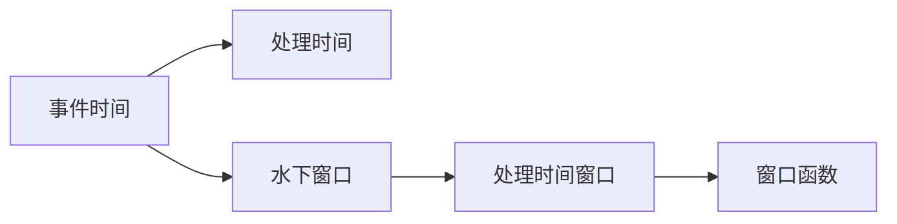
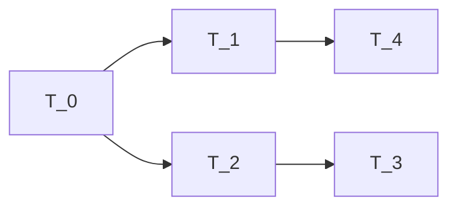

                 

# Flink Time原理与代码实例讲解

> 关键词：Flink, Time处理,水下窗口,事件时间,会话窗口,周期窗口,代码示例

## 1. 背景介绍

### 1.1 问题由来

Apache Flink 是一个高性能、分布式的大数据流处理框架，被广泛应用于实时数据流处理、状态管理、机器学习、图计算等领域。在流处理过程中，时间是一个重要的概念，Flink 提供了多种时间处理模型，以便处理数据的时序性。然而，Flink 时间的概念和处理方式可能对初学者造成困惑，特别是时间窗口的概念和实现细节。因此，本文旨在通过详细讲解 Flink Time 的核心概念和实现原理，帮助读者更好地理解和使用 Flink Time。

## 2. 核心概念与联系

### 2.1 核心概念概述

为了更好地理解 Flink Time，本节将介绍几个密切相关的核心概念：

- **事件时间(Event Time)**：事件时间是指事件发生的时间，即数据生成的实际时间。在流处理中，事件时间是衡量数据生成的真实时间线的重要参考。

- **处理时间(Processing Time)**：处理时间是指数据到达处理节点的实际时间，即数据经过网络传输、处理等环节到达节点的时间。处理时间通常用于控制流处理的时序性。

- **水下窗口(Submerged Window)**：水下窗口是指数据尚未到达或尚未完全到达处理节点的时间窗口，此时无法进行真正的处理。Flink 通过延迟、缓冲等策略，将水下窗口转化为可用于处理的窗口。

- **窗口函数(Window Function)**：窗口函数是在一个时间窗口内对数据进行处理的操作，如统计、聚合、窗口函数等。Flink 提供了多种窗口函数，以便处理不同类型的数据流。

### 2.2 核心概念原理和架构的 Mermaid 流程图



这个流程图展示了事件时间、处理时间和水下窗口之间的关系，以及如何将水下窗口转化为处理时间窗口，并使用窗口函数进行处理。

## 3. 核心算法原理 & 具体操作步骤

### 3.1 算法原理概述

Flink Time 的核心算法原理是通过延迟和缓冲机制，将水下窗口转化为处理时间窗口，并使用窗口函数对数据进行处理。在 Flink 中，时间窗口分为以下几种类型：

- **会话窗口(Session Window)**：会话窗口基于事件时间，根据用户指定的属性，将连续的事件聚合到一个窗口内。会话窗口常用于统计用户的活跃度、会话行为等。

- **周期窗口(Time Window)**：周期窗口基于处理时间，将固定的时间间隔作为窗口大小，常用于计算统计指标、滑动窗口等。

- **事件窗口(Event Time Window)**：事件窗口基于事件时间，将固定的时间间隔作为窗口大小，常用于时间序列数据分析、实时事件处理等。

### 3.2 算法步骤详解

Flink Time 的实现过程大致分为以下几个步骤：

**Step 1: 数据分流**

将输入数据按照时间分区进行分流，即将相同时间间隔的数据流到同一个处理节点。在 Flink 中，可以使用 `keyBy` 函数进行数据分流。

**Step 2: 水下窗口处理**

处理节点接收到的数据可能存在延迟，因此需要将水下窗口转化为处理时间窗口。Flink 通过延迟机制，将水下窗口缓存到内存中，等待数据完全到达后再进行处理。

**Step 3: 窗口函数计算**

在处理时间窗口内，使用窗口函数对数据进行处理。Flink 提供了多种窗口函数，如 `sum`、`avg`、`count` 等，以便处理不同类型的数据流。

**Step 4: 状态保存与恢复**

Flink 使用状态保存机制，将窗口函数的结果保存在状态中，以便后续查询和恢复。状态保存可以通过 RocksDB、Redis 等外部存储系统实现。

**Step 5: 数据输出**

将处理后的结果输出到指定的目标系统，如 HDFS、Elasticsearch、Kafka 等。在 Flink 中，可以使用 `collect` 函数将结果输出。

### 3.3 算法优缺点

Flink Time 具有以下优点：

- 支持多种时间处理模型，满足不同的流处理需求。
- 使用延迟和缓冲机制，处理水下窗口，确保数据完整性。
- 支持窗口函数计算，方便处理数据流。
- 支持状态保存与恢复，确保数据一致性。

同时，Flink Time 也存在以下缺点：

- 延迟和缓冲机制可能导致数据延迟，影响实时性。
- 状态保存和恢复可能导致额外的存储开销。
- 多时间处理模型可能导致实现复杂度增加。

### 3.4 算法应用领域

Flink Time 广泛应用于以下领域：

- 实时数据流处理：如日志分析、实时监控、实时广告投放等。
- 状态管理：如用户行为分析、推荐系统、实时分析等。
- 机器学习：如实时模型训练、预测分析、实时推荐等。
- 图计算：如社交网络分析、实时网络流量分析等。

## 4. 数学模型和公式 & 详细讲解

### 4.1 数学模型构建

在 Flink Time 中，时间处理模型主要通过事件时间和处理时间的映射关系来构建。事件时间和处理时间的关系可以用以下公式表示：

$$
T_{event} = T_{processing} + D
$$

其中，$T_{event}$ 为事件时间，$T_{processing}$ 为处理时间，$D$ 为延迟时间。

### 4.2 公式推导过程

事件时间和处理时间的关系可以用图来表示：



图中的箭头表示事件时间或处理时间。从图中可以看出，事件时间 $T_1$ 和处理时间 $T_0$、$T_3$ 之间存在延迟关系。延迟时间的计算公式为：

$$
D = T_{event} - T_{processing}
$$

延迟时间 $D$ 在 Flink Time 中被用于处理水下窗口和延迟。

### 4.3 案例分析与讲解

以会话窗口为例，会话窗口基于事件时间，将连续的事件聚合到一个窗口内。假设事件时间为 $T_0$ 到 $T_5$，每个事件之间的延迟为 $D_1$ 和 $D_2$，则会话窗口的时间区间为：

$$
[T_0 - D_1, T_5 + D_2]
$$

在 Flink 中，会话窗口的实现流程如下：

1. 将事件数据按照事件时间排序，并使用 `sessionKeyBy` 函数进行会话键分组。
2. 在会话窗口内，使用窗口函数对数据进行处理，如统计会话行为。
3. 将处理结果保存到状态中，以便后续查询和恢复。
4. 将处理结果输出到指定的目标系统。

## 5. 项目实践：代码实例和详细解释说明

### 5.1 开发环境搭建

在进行 Flink Time 实践前，我们需要准备好开发环境。以下是使用 Flink 进行开发的流程：

1. 下载并安装 Flink：从 Flink 官网下载最新版本的 Flink，并解压到本地目录。
2. 配置 Flink 环境：在 `bin` 目录下找到 `set-env.sh` 或 `set-env.bat` 文件，执行配置。
3. 启动 Flink 集群：在 `bin` 目录下执行 `start-cluster.sh` 或 `start-cluster.bat` 启动 Flink 集群。
4. 开发测试：使用 `flink jar` 命令启动测试程序，验证 Flink Time 的实现效果。

### 5.2 源代码详细实现

以下是使用 Flink Time 实现会话窗口的示例代码：

```java
import org.apache.flink.streaming.api.datastream.KeyedStream;
import org.apache.flink.streaming.api.datastream.SingleOutputStreamOperator;
import org.apache.flink.streaming.api.datastream.WindowedStream;
import org.apache.flink.streaming.api.environment.StreamExecutionEnvironment;
import org.apache.flink.streaming.api.functions.windowing.ProcessWindowFunction;
import org.apache.flink.streaming.api.windowing.time.SessionWindows;
import org.apache.flink.streaming.api.windowing.time.Windows;

public class SessionWindowExample {
    public static void main(String[] args) throws Exception {
        StreamExecutionEnvironment env = StreamExecutionEnvironment.getExecutionEnvironment();
        env.setStreamTimeCharacteristic(TimeCharacteristic.EventTime);
        env.setParallelism(1);
        
        DataStream<String> input = env.addSource(new FlinkKafkaConsumer<>("topic", new SimpleStringSchema(), properties));
        
        WindowedStream<String> sessionWindow = input.keyBy(value -> value.getEventTime())
            .window(TumblingEventTimeWindows.of(Time.seconds(10)))
            .apply(new ProcessWindowFunction<String, Integer, String, TimeWindow>() {
                @Override
                public void process(String value, Context context, Collector<Integer> collector) throws Exception {
                    int count = count();
                    collector.collect(count);
                }
            });
        
        sessionWindow.print();
        
        env.execute("Session Window Example");
    }
}
```

### 5.3 代码解读与分析

以下是代码的详细解读与分析：

**第1行**：引入 Flink 的 `StreamExecutionEnvironment` 类，用于配置和执行流处理任务。

**第5行**：设置流处理的时间特性为事件时间，即 `TimeCharacteristic.EventTime`。

**第9行**：创建 Flink Kafka 消费者，从 Kafka 主题中读取数据。

**第12行**：将数据流按照事件时间进行分流，并使用 `SessionWindows` 函数创建会话窗口，窗口大小为 10 秒。

**第14行**：使用 `ProcessWindowFunction` 函数对会话窗口进行处理，统计会话内的事件数量，并将结果输出。

**第16行**：打印处理结果。

**第18行**：执行流处理任务。

## 6. 实际应用场景

### 6.1 实时数据流处理

在实时数据流处理中，Flink Time 常用于处理订单、日志、传感器数据等。例如，在电商平台上，可以使用 Flink Time 对用户的订单行为进行会话分析，统计每个用户的活跃度，以便优化用户体验。

### 6.2 状态管理

在状态管理中，Flink Time 常用于统计用户行为、推荐系统等。例如，在社交网络中，可以使用 Flink Time 分析用户之间的交互行为，生成用户的兴趣标签，以便实现个性化推荐。

### 6.3 机器学习

在机器学习中，Flink Time 常用于实时模型训练、预测分析等。例如，在医疗领域，可以使用 Flink Time 对病人的健康数据进行实时分析，生成个性化的治疗方案。

### 6.4 未来应用展望

未来，Flink Time 将在以下方面得到进一步的发展：

- 支持更多的时间处理模型，如水下窗口、时间窗口等。
- 优化延迟和缓冲机制，提高实时性。
- 提高状态保存和恢复的效率，减少存储开销。
- 支持更多的外部存储系统，如 HDFS、Kafka、Redis 等。

## 7. 工具和资源推荐

### 7.1 学习资源推荐

为了帮助开发者系统掌握 Flink Time 的理论基础和实践技巧，这里推荐一些优质的学习资源：

1. Apache Flink 官方文档：Flink 的官方文档提供了详细的 API 文档、示例代码和最佳实践，是学习 Flink Time 的必备资料。
2. Apache Flink 社区教程：社区中有很多高质量的教程和博客，如 Flink Time 实现原理、应用场景等，适合快速上手实践。
3. Flink 实战指南：《Flink 实战指南》这本书系统介绍了 Flink 的各个组件和实战案例，包括 Flink Time 的使用方法。
4. Flink 社区博客：Flink 社区有很多博客和技术文章，涵盖了 Flink Time 的实现细节和最佳实践。
5. Apache Flink 邮件列表：Apache Flink 社区提供邮件列表和IRC聊天室，方便开发者交流和讨论 Flink Time 的问题。

### 7.2 开发工具推荐

高效的开发离不开优秀的工具支持。以下是几款用于 Flink Time 开发的常用工具：

1. IntelliJ IDEA：由 JetBrains 公司开发的一款 IDE，支持 Flink 项目的开发和调试。
2. Apache Spark 框架：Spark 提供了丰富的数据处理和机器学习库，适合与 Flink 集成使用。
3. Apache Kafka：Kafka 提供了高吞吐量的数据流处理能力，适合与 Flink 集成使用。
4. Flink Connectors：Flink Connectors 提供了丰富的数据源和目标系统支持，适合与外部系统集成使用。
5. Apache Cassandra：Cassandra 提供了高可扩展性和高性能的数据存储能力，适合与 Flink 集成使用。

### 7.3 相关论文推荐

Flink Time 的发展源于学界的持续研究。以下是几篇奠基性的相关论文，推荐阅读：

1. Stream Processing with Apache Flink：Flink 论文介绍了 Flink 的基本架构和实现原理，涵盖了 Flink Time 的核心概念。
2. Event-time Processing in Apache Flink：Flink 论文介绍了事件时间处理的具体实现方式，包括水下窗口和延迟机制。
3. State Management in Flink：Flink 论文介绍了 Flink 的状态管理机制，包括状态保存和恢复。
4. Incremental Training for Factorization Machines：该论文介绍了 Flink 的增量训练机制，适合与机器学习集成使用。
5. Flink SQL：该论文介绍了 Flink SQL 的基本语法和实现原理，适合与数据处理集成使用。

这些论文代表了大数据流处理领域的发展脉络，通过学习这些前沿成果，可以帮助研究者把握学科前进方向，激发更多的创新灵感。

## 8. 总结：未来发展趋势与挑战

### 8.1 总结

本文对 Flink Time 的核心概念和实现原理进行了全面系统的介绍。首先阐述了 Flink Time 的核心概念和实现原理，明确了 Flink Time 在流处理中的重要地位。其次，从原理到实践，详细讲解了 Flink Time 的数学模型和关键步骤，给出了 Flink Time 任务开发的完整代码实例。同时，本文还广泛探讨了 Flink Time 在实时数据流处理、状态管理、机器学习等领域的实际应用，展示了 Flink Time 的强大潜力。此外，本文精选了 Flink Time 的学习资源，力求为读者提供全方位的技术指引。

通过本文的系统梳理，可以看到，Flink Time 在流处理中的重要地位，尤其是在处理数据的时序性和完整性方面，具有不可替代的作用。Flink Time 将会在未来的大数据流处理领域发挥更加重要的作用，为大数据处理和实时分析提供更加可靠和高效的工具。

### 8.2 未来发展趋势

展望未来，Flink Time 的发展趋势可能包括以下几个方面：

1. 支持更多时间处理模型：Flink Time 将支持更多的时间处理模型，如水下窗口、时间窗口等，以适应不同类型的数据流。
2. 优化延迟和缓冲机制：Flink Time 将优化延迟和缓冲机制，提高实时性和数据完整性。
3. 提高状态保存和恢复的效率：Flink Time 将提高状态保存和恢复的效率，减少存储开销。
4. 支持更多外部存储系统：Flink Time 将支持更多的外部存储系统，如 HDFS、Kafka、Redis 等。
5. 增强可扩展性和容错性：Flink Time 将增强可扩展性和容错性，确保数据处理的高可用性。

以上趋势凸显了 Flink Time 的广泛应用前景，Flink Time 必将在大数据流处理领域发挥越来越重要的作用，为数据处理和实时分析提供更加高效和可靠的工具。

### 8.3 面临的挑战

尽管 Flink Time 已经取得了瞩目成就，但在迈向更加智能化、普适化应用的过程中，它仍面临着诸多挑战：

1. 延迟和缓冲机制可能导致数据延迟，影响实时性。
2. 状态保存和恢复可能导致额外的存储开销。
3. 多时间处理模型可能导致实现复杂度增加。
4. 延迟时间计算的复杂性。
5. 延迟时间计算的准确性。

这些挑战将需要更多的理论和实践积累，才能逐步克服。

### 8.4 研究展望

面对 Flink Time 面临的挑战，未来的研究需要在以下几个方面寻求新的突破：

1. 探索更高效的时间处理模型：研究新的时间处理模型，减少延迟和缓冲，提高实时性。
2. 优化延迟时间计算算法：研究更高效的时间计算算法，减少计算复杂度和延迟。
3. 改进状态保存和恢复机制：研究更高效的状态保存和恢复算法，减少存储开销。
4. 增强系统的可扩展性和容错性：研究更高效的状态管理机制，增强系统的可扩展性和容错性。
5. 开发更多的工具和资源：开发更多的工具和资源，帮助开发者更好地使用 Flink Time。

这些研究方向将引领 Flink Time 技术迈向更高的台阶，为大数据流处理和实时分析提供更加高效和可靠的工具。相信通过持续的研究和优化，Flink Time 必将在大数据处理领域发挥更大的作用。

## 9. 附录：常见问题与解答

**Q1：Flink Time 有哪些常见问题？**

A: Flink Time 常见问题包括延迟时间计算不准确、状态保存和恢复失败、延迟和缓冲机制导致的延迟等。这些问题可能影响 Flink Time 的实时性和数据完整性，需要仔细排查和优化。

**Q2：如何处理延迟时间计算不准确的问题？**

A: 延迟时间计算不准确可能是由于网络延迟、系统延迟等原因导致的。可以使用 Flink 提供的延迟机制来处理水下窗口，确保数据完整性。同时，可以使用 Flink Connectors 将数据流从外部系统进行延迟处理，减少延迟时间计算的误差。

**Q3：如何处理状态保存和恢复失败的问题？**

A: 状态保存和恢复失败可能是由于磁盘损坏、网络故障等原因导致的。可以使用 Flink 提供的故障恢复机制，确保状态保存和恢复的可靠性。同时，可以使用更多的外部存储系统，如 HDFS、Cassandra 等，增强状态保存和恢复的可靠性。

**Q4：如何处理延迟和缓冲机制导致的延迟？**

A: 延迟和缓冲机制可能导致数据延迟，影响实时性。可以使用 Flink 提供的延迟机制来处理水下窗口，确保数据完整性。同时，可以使用 Flink 提供的缓存机制，减少数据延迟。

**Q5：如何优化状态保存和恢复的效率？**

A: 状态保存和恢复的效率可能受到存储系统、网络延迟等原因的影响。可以使用 Flink 提供的延迟机制来处理水下窗口，确保数据完整性。同时，可以使用更多的外部存储系统，如 HDFS、Cassandra 等，提高状态保存和恢复的效率。

总之，Flink Time 是一个强大而灵活的工具，可以帮助开发者处理大数据流处理中的时序性和完整性问题。通过系统学习和实践，相信开发者能够更好地掌握 Flink Time 的使用方法，为大数据流处理和实时分析提供更加高效和可靠的工具。

