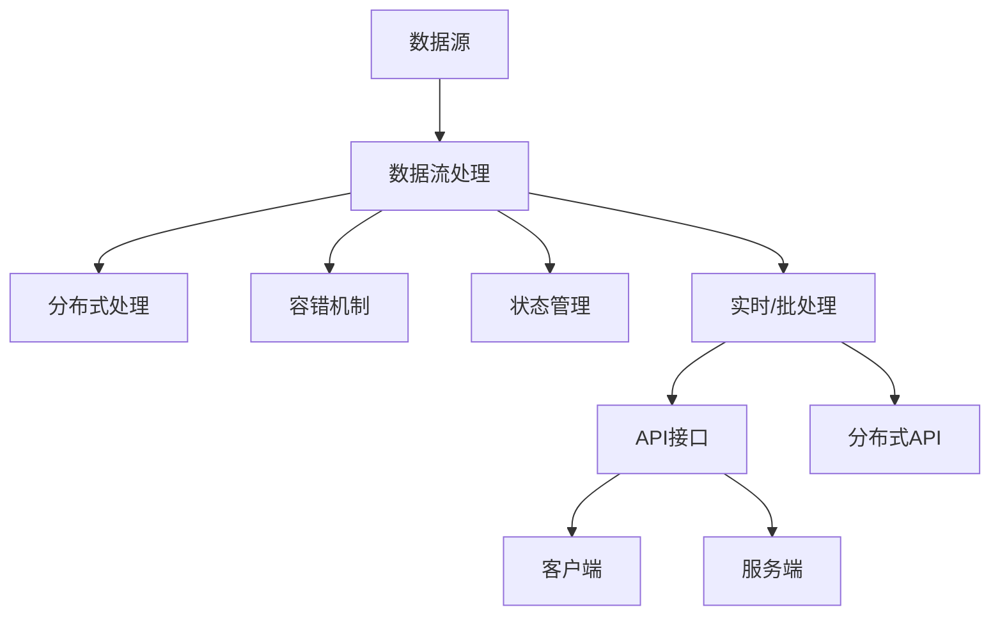

                 

## 1. 背景介绍

随着数据量的激增，流式数据处理逐渐成为数据处理的重要方向。流处理技术能够让系统实时捕获数据，并根据数据流进行实时分析和处理，应用于数据监控、实时报表、实时搜索、实时推荐等多个场景。Apache Flink作为主流流处理框架，以强大的数据处理能力、高性能、稳定性、易用性等优势，在流处理领域占据了重要地位。本篇文章将详细介绍Flink流处理框架的原理与代码实现。

## 2. 核心概念与联系

### 2.1 核心概念概述

#### 2.1.1 Flink框架

Apache Flink是一个分布式流处理框架，能够支持实时和批处理，具有流处理模型丰富、扩展性良好、支持多种数据源、API丰富等优点。它支持多种数据源和数据类型，能够快速、高效、灵活地处理数据。

#### 2.1.2 流处理模型

流处理模型是Flink的核心组件，分为实时流处理和批处理。实时流处理是指对实时数据流进行实时处理，批处理是指对批数据进行批量处理。

#### 2.1.3 分布式处理

Flink框架的分布式特性，使其能够在大规模集群上进行高效的数据处理，支持多节点、多线程、分布式并行计算。

#### 2.1.4 容错机制

Flink具有强有力的容错机制，能够在数据处理过程中自动检测和恢复故障节点，保证数据处理的可靠性。

#### 2.1.5 状态管理

状态管理是Flink的一个重要特性，能够保存和恢复状态，用于实现诸如滑动窗口、聚合函数等操作。

### 2.2 核心概念原理和架构的 Mermaid 流程图



## 3. 核心算法原理 & 具体操作步骤

### 3.1 算法原理概述

Flink流处理的核心算法原理包括：

#### 3.1.1 数据流模型

Flink采用有界无界流模型，对输入的数据流进行有序处理。Flink的数据流模型分为无界数据流和有界数据流，无界数据流指无限的数据流，而有界数据流指有限的数据流。

#### 3.1.2 滑动窗口

滑动窗口是Flink中的一个重要算法，用于实现流处理中的聚合操作。滑动窗口指在数据流中定义一个固定大小的时间窗口，通过滑动窗口对数据进行聚合操作。

#### 3.1.3 状态管理

状态管理用于保存和恢复状态，保证数据处理的连续性和一致性。Flink的状态管理分为有状态和无状态两种。

#### 3.1.4 容错机制

Flink的容错机制包括检查点和日志状态，用于在故障发生时自动恢复数据处理的状态。

### 3.2 算法步骤详解

#### 3.2.1 数据源

Flink支持多种数据源，如Kafka、Hadoop、Hive、HBase等，能够方便地集成各种数据源。

#### 3.2.2 数据流处理

数据流处理是Flink的核心功能，能够对数据流进行实时处理和分析。Flink提供了多种API，如StreamAPI和TableAPI，支持实时流处理和批处理。

#### 3.2.3 分布式处理

Flink的分布式处理能力，使其能够在大规模集群上进行高效的数据处理，支持多节点、多线程、分布式并行计算。

#### 3.2.4 容错机制

Flink的容错机制包括检查点和日志状态，用于在故障发生时自动恢复数据处理的状态。

#### 3.2.5 状态管理

状态管理用于保存和恢复状态，保证数据处理的连续性和一致性。Flink的状态管理分为有状态和无状态两种。

### 3.3 算法优缺点

#### 3.3.1 优点

- 高性能：Flink采用流处理模型，能够在数据流中进行实时处理，提高数据处理的速度。
- 分布式处理：Flink的分布式处理能力，使其能够在大规模集群上进行高效的数据处理，支持多节点、多线程、分布式并行计算。
- 状态管理：Flink的状态管理用于保存和恢复状态，保证数据处理的连续性和一致性。
- 容错机制：Flink的容错机制包括检查点和日志状态，用于在故障发生时自动恢复数据处理的状态。

#### 3.3.2 缺点

- 配置复杂：Flink的配置较为复杂，需要深入了解其内部机制才能配置正确。
- 依赖较多：Flink依赖较多，需要保证依赖的版本一致性，否则容易出现兼容性问题。

### 3.4 算法应用领域

Flink流处理框架被广泛应用于以下领域：

#### 3.4.1 实时数据监控

Flink能够实时监控数据流，帮助企业实时发现问题并及时处理，提高企业的运营效率。

#### 3.4.2 实时报表

Flink能够实时处理数据，生成实时报表，帮助企业实时了解业务运营状况。

#### 3.4.3 实时搜索

Flink能够实时处理数据，提供实时搜索功能，帮助企业快速获取所需信息。

#### 3.4.4 实时推荐

Flink能够实时处理用户数据，根据用户行为生成推荐信息，帮助企业提升用户体验。

## 4. 数学模型和公式 & 详细讲解 & 举例说明

### 4.1 数学模型构建

Flink的数学模型主要包括以下几个方面：

#### 4.1.1 数据流模型

数据流模型是Flink的核心算法，用于对数据流进行有序处理。数据流模型分为无界数据流和有界数据流，无界数据流指无限的数据流，而有界数据流指有限的数据流。

#### 4.1.2 滑动窗口

滑动窗口是Flink中的一个重要算法，用于实现流处理中的聚合操作。滑动窗口指在数据流中定义一个固定大小的时间窗口，通过滑动窗口对数据进行聚合操作。

#### 4.1.3 状态管理

状态管理用于保存和恢复状态，保证数据处理的连续性和一致性。Flink的状态管理分为有状态和无状态两种。

#### 4.1.4 容错机制

Flink的容错机制包括检查点和日志状态，用于在故障发生时自动恢复数据处理的状态。

### 4.2 公式推导过程

#### 4.2.1 数据流模型

数据流模型用于对数据流进行有序处理，其公式如下：

$$
X(t) = \bigcup_{t_1 \leq t} X(t_1)
$$

其中，$X(t)$ 表示在时间 $t$ 的数据流，$X(t_1)$ 表示在时间 $t_1$ 的数据流，$\bigcup$ 表示数据流的并集。

#### 4.2.2 滑动窗口

滑动窗口用于实现流处理中的聚合操作，其公式如下：

$$
S_{t_0} = \bigcup_{t_0 \leq t \leq t_0 + W} X(t)
$$

其中，$S_{t_0}$ 表示在时间 $t_0$ 到 $t_0 + W$ 的滑动窗口，$W$ 表示滑动窗口的大小，$X(t)$ 表示在时间 $t$ 的数据流。

#### 4.2.3 状态管理

状态管理用于保存和恢复状态，保证数据处理的连续性和一致性。Flink的状态管理分为有状态和无状态两种。

#### 4.2.4 容错机制

Flink的容错机制包括检查点和日志状态，用于在故障发生时自动恢复数据处理的状态。

### 4.3 案例分析与讲解

#### 4.3.1 数据源

Flink支持多种数据源，如Kafka、Hadoop、Hive、HBase等，能够方便地集成各种数据源。

#### 4.3.2 数据流处理

Flink提供了多种API，如StreamAPI和TableAPI，支持实时流处理和批处理。

#### 4.3.3 分布式处理

Flink的分布式处理能力，使其能够在大规模集群上进行高效的数据处理，支持多节点、多线程、分布式并行计算。

#### 4.3.4 容错机制

Flink的容错机制包括检查点和日志状态，用于在故障发生时自动恢复数据处理的状态。

#### 4.3.5 状态管理

Flink的状态管理用于保存和恢复状态，保证数据处理的连续性和一致性。Flink的状态管理分为有状态和无状态两种。

## 5. 项目实践：代码实例和详细解释说明

### 5.1 开发环境搭建

在搭建Flink开发环境时，需要以下步骤：

1. 安装Java环境

   ```bash
   sudo apt-get install default-jdk
   ```

2. 安装Maven

   ```bash
   sudo apt-get install maven
   ```

3. 安装Flink

   ```bash
   wget https://repos.apache.org/release/flink/flink/flink-1.15.1/flink-1.15.1-bin-scala_2.12.tgz
   tar -xzvf flink-1.15.1-bin-scala_2.12.tgz
   ```

4. 配置环境变量

   ```bash
   export FLINK_HOME=/path/to/flink
   export PATH=$PATH:$FLINK_HOME/bin
   ```

### 5.2 源代码详细实现

以下是使用Flink进行实时流处理的代码实现：

```java
DataStream<String> input = env.addSource(new FlinkKafkaConsumer<>(props, new SimpleStringSchema(), "test-topic"));
DataStream<String> output = input.map(x -> "hello " + x);

output.print();

env.execute("Flink Word Count");
```

在上述代码中，首先从Kafka中获取实时流数据，然后对数据进行处理，最后输出结果。

### 5.3 代码解读与分析

在上述代码中，`env` 表示Flink的执行环境，`DataStream<String>` 表示数据流，`addSource` 表示添加数据源，`FlinkKafkaConsumer` 表示从Kafka中获取数据，`SimpleStringSchema` 表示数据的序列化方式，`map` 表示对数据进行处理，`print` 表示输出结果，`execute` 表示执行任务。

## 6. 实际应用场景

Flink流处理框架被广泛应用于以下领域：

### 6.1 实时数据监控

Flink能够实时监控数据流，帮助企业实时发现问题并及时处理，提高企业的运营效率。

### 6.2 实时报表

Flink能够实时处理数据，生成实时报表，帮助企业实时了解业务运营状况。

### 6.3 实时搜索

Flink能够实时处理数据，提供实时搜索功能，帮助企业快速获取所需信息。

### 6.4 实时推荐

Flink能够实时处理用户数据，根据用户行为生成推荐信息，帮助企业提升用户体验。

## 7. 工具和资源推荐

### 7.1 学习资源推荐

#### 7.1.1 Flink官方文档

Flink官方文档详细介绍了Flink的API、配置、容错机制、状态管理等内容，是学习Flink的重要资源。

#### 7.1.2 《Flink实战》

该书详细介绍了Flink的开发流程、API使用、故障排查等内容，是Flink开发者的必备参考资料。

#### 7.1.3 《Apache Flink：分布式流处理》

该书深入浅出地介绍了Flink的分布式流处理模型、容错机制、状态管理等内容，适合初学者入门。

### 7.2 开发工具推荐

#### 7.2.1 IntelliJ IDEA

IntelliJ IDEA是一款优秀的Java开发工具，支持Flink的开发、调试、测试等功能。

#### 7.2.2 Eclipse

Eclipse是一款开源的Java开发工具，支持Flink的开发、调试、测试等功能。

#### 7.2.3 Visual Studio Code

Visual Studio Code是一款轻量级的代码编辑器，支持Flink的开发、调试、测试等功能。

### 7.3 相关论文推荐

#### 7.3.1 "Stream Processing in Apache Flink"

本文介绍了Flink的流处理模型、容错机制、状态管理等内容，是Flink开发者的必读论文。

#### 7.3.2 "Flink: Unified Stream Processing"

本文介绍了Flink的统一流处理模型、容错机制、状态管理等内容，是Flink开发者的必读论文。

#### 7.3.3 "Flink: Fault-Tolerant Stream Processing at Scale"

本文介绍了Flink的容错机制、状态管理等内容，是Flink开发者的必读论文。

## 8. 总结：未来发展趋势与挑战

### 8.1 未来发展趋势

#### 8.1.1 实时处理能力提升

Flink未来的发展方向之一是提升实时处理能力，使其能够处理更多的实时数据流，提供更快速的数据处理速度。

#### 8.1.2 分布式处理能力提升

Flink未来的发展方向之一是提升分布式处理能力，使其能够在大规模集群上进行高效的数据处理，支持多节点、多线程、分布式并行计算。

#### 8.1.3 状态管理能力提升

Flink未来的发展方向之一是提升状态管理能力，使其能够更好地保存和恢复状态，保证数据处理的连续性和一致性。

#### 8.1.4 容错机制能力提升

Flink未来的发展方向之一是提升容错机制能力，使其能够更好地自动恢复数据处理的状态。

### 8.2 面临的挑战

#### 8.2.1 配置复杂

Flink的配置较为复杂，需要深入了解其内部机制才能配置正确。

#### 8.2.2 依赖较多

Flink依赖较多，需要保证依赖的版本一致性，否则容易出现兼容性问题。

#### 8.2.3 性能问题

Flink在大规模数据处理时容易出现性能问题，需要进一步优化。

### 8.3 研究展望

#### 8.3.1 实时处理优化

未来的研究方向之一是对实时处理进行优化，提升数据处理速度和效率。

#### 8.3.2 分布式处理优化

未来的研究方向之一是对分布式处理进行优化，提升集群处理能力。

#### 8.3.3 状态管理优化

未来的研究方向之一是对状态管理进行优化，提升状态保存和恢复的效率。

#### 8.3.4 容错机制优化

未来的研究方向之一是对容错机制进行优化，提升自动恢复的能力。

## 9. 附录：常见问题与解答

### 9.1 常见问题

#### 9.1.1 Flink的配置复杂吗？

Flink的配置较为复杂，需要深入了解其内部机制才能配置正确。

#### 9.1.2 Flink的依赖较多吗？

Flink依赖较多，需要保证依赖的版本一致性，否则容易出现兼容性问题。

#### 9.1.3 Flink的性能问题多吗？

Flink在大规模数据处理时容易出现性能问题，需要进一步优化。

### 9.2 解答

#### 9.2.1 复杂问题解答

Flink的配置复杂，需要深入了解其内部机制才能配置正确。

#### 9.2.2 依赖问题解答

Flink依赖较多，需要保证依赖的版本一致性，否则容易出现兼容性问题。

#### 9.2.3 性能问题解答

Flink在大规模数据处理时容易出现性能问题，需要进一步优化。

---

作者：禅与计算机程序设计艺术 / Zen and the Art of Computer Programming

