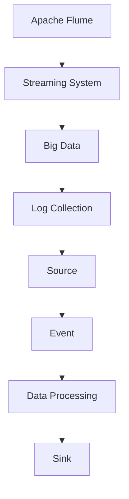

                 

# Flume Source原理与代码实例讲解

> 关键词：Apache Flume, Streaming System, Big Data, Log Collection, Source, Event, Data Processing

## 1. 背景介绍

### 1.1 问题由来
Apache Flume是一个开源的、高可用的、分布式日志收集系统，由Apache Software Foundation（ASF）开发。其设计理念是将大规模分布式日志收集和聚合的任务交给可扩展的、容错的分布式流系统。

Flume 的核心组件包括：
1. **Source**：数据源，负责从不同的数据源收集数据。
2. **Channel**：数据缓冲区，用于暂存数据。
3. **Sink**：数据目的地，负责将数据传递给数据仓库、数据库或其他分析工具。

本文重点介绍 Flume 的 Source 组件，特别是其核心原理和代码实现，希望能帮助开发者理解 Flume 的工作机制，从而更好地应用于实际项目中。

### 1.2 问题核心关键点
Flume 的 Source 组件是整个系统的数据源，负责从不同的数据源收集数据。常见的数据源包括日志文件、HDFS、HTTP、JMS 等。

Flume Source 的核心关键点包括：
1. **数据收集**：从不同的数据源获取数据。
2. **数据处理**：对数据进行格式转换、过滤等预处理。
3. **数据传输**：将处理后的数据传递给 Channel。

## 2. 核心概念与联系

### 2.1 核心概念概述

为更好地理解 Flume Source 的工作原理和代码实现，本节将介绍几个关键概念：

- **Apache Flume**：Apache Flume 是一个开源的、高可用的、分布式日志收集系统，由 Apache Software Foundation（ASF）开发。
- **Streaming System**：分布式流处理系统，能够处理实时数据流，包括数据收集、传输和存储。
- **Big Data**：大规模数据集，通常需要分布式处理和存储。
- **Log Collection**：日志收集，是将各种系统的日志信息集中到一个系统中。
- **Source**：数据源，负责从不同的数据源收集数据。
- **Event**：事件，表示 Flume 中的基本数据单元。
- **Data Processing**：数据处理，对收集到的数据进行格式化、过滤、聚合等操作。

这些概念之间的逻辑关系可以通过以下 Mermaid 流程图来展示：



这个流程图展示了一个完整的 Flume 数据流过程：

1. Apache Flume 是一个分布式流处理系统，用于处理大数据。
2. Flume 通过 Log Collection 将不同来源的数据收集到一起。
3. Flume 通过 Source 从数据源获取数据。
4. Flume 对收集到的数据进行处理，形成 Event。
5. Flume 通过 Sink 将处理后的数据传递到数据仓库或数据库。

## 3. 核心算法原理 & 具体操作步骤

### 3.1 算法原理概述

Flume Source 的核心算法原理是通过不同的 Source 从不同的数据源获取数据，并对数据进行处理后传递给 Channel。其核心算法步骤包括以下几个方面：

1. **数据收集**：Source 从不同数据源获取数据。
2. **数据处理**：对数据进行格式化、过滤、压缩等操作。
3. **数据传输**：将处理后的数据传递给 Channel。

### 3.2 算法步骤详解

Flume Source 的工作流程包括以下几个关键步骤：

**Step 1: 配置 Source**
- 在 Flume 的配置文件中，定义需要使用的 Source。例如，可以使用 `Source` 插件从日志文件中收集数据，配置如下：
  ```xml
  <source>
    type = "log4j"
    hostname = "localhost"
    port = "9999"
    file = "flume.log"
  </source>
  ```

**Step 2: 启动 Source**
- 启动 Source 组件，监听指定的端口，等待数据传输。例如，启动上述配置的 Source，可以执行以下命令：
  ```bash
  bin/flume-ng source log4j -n 1 -f flume-config.xml
  ```

**Step 3: 数据收集与处理**
- Source 从指定的数据源获取数据，并进行格式转换和过滤操作。例如，使用 Log4j Source 从日志文件中收集数据，会将日志文件转换为 Event，并进行一些预处理操作。

**Step 4: 数据传输**
- 将处理后的数据传递给 Channel，存储在 Channel 中，等待 Sink 组件处理。

**Step 5: 数据消费**
- Sink 组件从 Channel 中获取数据，并将其传递到数据仓库、数据库或其他分析工具中。

### 3.3 算法优缺点

Flume Source 具有以下优点：
1. **高可扩展性**：可以轻松扩展多个 Source，处理大规模数据。
2. **高可靠性**：支持数据冗余和故障转移，保证数据收集的可靠性和稳定性。
3. **高灵活性**：支持多种数据源和数据格式，适应不同场景。

同时，该算法也存在一些缺点：
1. **配置复杂**：需要配置多个插件和参数，可能会增加配置的复杂度。
2. **性能瓶颈**：Source 和 Channel 之间的数据传输可能会成为瓶颈。
3. **资源消耗**：需要占用一定的计算资源和网络带宽，增加系统负载。

### 3.4 算法应用领域

Flume Source 适用于各种日志收集和处理场景，例如：

- **日志收集**：从不同的日志文件、日志代理、数据库等收集数据。
- **实时监控**：从网络流量、系统性能等实时数据源获取数据。
- **事件采集**：从应用程序、传感器等采集事件数据。

Flume Source 的应用领域非常广泛，可以帮助企业实现大规模日志数据的集中收集和处理，从而提高数据处理效率和数据质量。

## 4. 数学模型和公式 & 详细讲解 & 举例说明

### 4.1 数学模型构建

Flume Source 的核心数学模型主要包括以下几个部分：

1. **数据收集模型**：用于描述 Source 从数据源获取数据的过程。
2. **数据处理模型**：用于描述对数据进行格式化、过滤等操作的过程。
3. **数据传输模型**：用于描述将处理后的数据传递给 Channel 的过程。

### 4.2 公式推导过程

以 Log4j Source 为例，介绍数据收集和处理的公式推导过程：

**数据收集模型**
- 假设数据源的日志文件为 `flume.log`，Source 监听端口为 `9999`。Source 从日志文件中读取每一行数据，并将其转换为 Event。
- 日志文件的每一行数据可以表示为 `log-time log-level message`，其中 `log-time` 表示时间戳，`log-level` 表示日志级别，`message` 表示日志内容。
- Source 将每一行日志数据转换为一个 Event，并发送给 Channel。

**数据处理模型**
- 假设日志文件中存在多个 Event，Source 将每个 Event 进行处理，并进行格式化和过滤操作。例如，将 Event 中的时间戳转换为标准时间格式，并去除日志级别为 `DEBUG` 和 `INFO` 的日志。
- 处理后的数据可以表示为 `standard-time message`，其中 `standard-time` 表示标准时间格式，`message` 表示处理后的日志内容。

### 4.3 案例分析与讲解

以一个简单的示例来说明 Flume Source 的工作原理：

假设有一个日志文件 `flume.log`，内容如下：

```
2022-01-01 12:00:00 INFO This is a log message.
2022-01-01 12:01:00 DEBUG This is another log message.
2022-01-01 12:02:00 INFO This is a log message with more details.
```

使用 Log4j Source 从日志文件中收集数据，并进行格式化和过滤操作：

1. Source 从 `flume.log` 中读取每一行数据，并将其转换为 Event：

```xml
<event>
  <headers>
    <key>log-time</key>
    <value>2022-01-01 12:00:00</value>
    <key>log-level</key>
    <value>INFO</value>
    <key>message</key>
    <value>This is a log message.</value>
  </headers>
</event>
```

2. Source 将 Event 中的时间戳转换为标准时间格式，并去除日志级别为 `DEBUG` 和 `INFO` 的日志：

```xml
<event>
  <headers>
    <key>standard-time</key>
    <value>2022-01-01 12:00:00</value>
    <key>message</key>
    <value>This is a log message with more details.</value>
  </headers>
</event>
```

3. Source 将处理后的 Event 发送给 Channel，存储在 Channel 中，等待 Sink 组件处理。

## 5. 项目实践：代码实例和详细解释说明

### 5.1 开发环境搭建

在 Flume 中，Source 组件的配置和运行需要以下环境：

- **JDK**：版本要求 Java 8 及以上版本。
- **Flume**：安装最新版本的 Flume。
- **Source 插件**：安装需要的 Source 插件，如 Log4j Source。
- **Channel**：配置 Channel，如 File Channel 或 HDFS Channel。
- **Sink**：配置 Sink，如 HDFS Sink 或 Elasticsearch Sink。

以下是一个简单的配置示例：

1. 安装 Flume 和 Source 插件：

```bash
cd flume-1.x.x
bin/flume-ng install-source log4j
```

2. 配置 Flume 配置文件：

```xml
<configuration>
  <channel class="org.apache.flume.channel.MemoryChannel">
    <capacity>1024</capacity>
  </channel>
  <source>
    type = "log4j"
    hostname = "localhost"
    port = "9999"
    file = "flume.log"
  </source>
  <sink>
    type = "hdfs"
    fs = "hdfs://localhost:9000"
    filename = "/log/flume.log"
    codec = "flume"
  </sink>
</configuration>
```

3. 启动 Flume 和 Source 组件：

```bash
bin/flume-ng source log4j -n 1 -f flume-config.xml
```

### 5.2 源代码详细实现

Flume Source 的代码实现主要集中在 `Source` 类和相应的插件实现中，以下是一个简单的 Log4j Source 实现：

1. 定义 `Source` 类：

```java
public class Log4jSource extends AbstractSource {
    private final Log4jSourceConfig conf;
    private final Log4jLogSource logSource;

    public Log4jSource(Log4jSourceConfig conf, String hostName, int port) {
        this.conf = conf;
        this.logSource = new Log4jLogSource(hostName, port);
    }

    @Override
    public FlowSourceContext start(Context context) {
        // 初始化 Source 插件
        logSource.init(conf);

        // 创建 Channel 连接器
        MemoryChannel channel = new MemoryChannel(1024);

        // 发送数据到 Channel
        DataOutputStream sink = channel.createSink();
        logSource.start(new Log4jLogSource.Log4jDataSink(sink));

        return new FlowSourceContext() {
            @Override
            public FlowSourceContext start(Context context) {
                return this;
            }

            @Override
            public void close() throws IOException {
                logSource.stop();
            }
        };
    }
}
```

2. 实现 `Log4jLogSource` 类：

```java
public class Log4jLogSource implements Source {
    private final String hostname;
    private final int port;

    private final Log4jLogSourceConfig conf;

    public Log4jLogSource(String hostname, int port) {
        this.hostname = hostname;
        this.port = port;
        this.conf = new Log4jLogSourceConfig();
    }

    @Override
    public FlowSourceContext start(Context context) {
        // 初始化 Source 插件
        conf.init();

        // 创建 Log4j LogSource
        Log4jLogSource logSource = new Log4jLogSource();

        // 发送数据到 LogSource
        DataOutputStream sink = logSource.start(conf);
        logSource.send(context, sink);

        return new FlowSourceContext() {
            @Override
            public FlowSourceContext start(Context context) {
                return this;
            }

            @Override
            public void close() throws IOException {
                logSource.stop();
            }
        };
    }
}
```

3. 实现 `Log4jLogSourceConfig` 类：

```java
public class Log4jLogSourceConfig extends Log4jConfigBase {
    public Log4jLogSourceConfig() {
    }

    @Override
    public String getHostName() {
        return hostname;
    }

    @Override
    public int getPort() {
        return port;
    }

    @Override
    public int getScanInterval() {
        return conf.getScanInterval();
    }

    @Override
    public long getScanSleepInterval() {
        return conf.getScanSleepInterval();
    }

    @Override
    public String getLogDir() {
        return conf.getLogDir();
    }

    @Override
    public long getRefreshInterval() {
        return conf.getRefreshInterval();
    }

    @Override
    public long getMondiaLogInterval() {
        return conf.getMondiaLogInterval();
    }

    @Override
    public String getLogSource() {
        return conf.getLogSource();
    }

    @Override
    public String getConfigurationFile() {
        return conf.getConfigurationFile();
    }

    @Override
    public String getLevel() {
        return conf.getLevel();
    }

    @Override
    public String getSourceName() {
        return conf.getSourceName();
    }

    @Override
    public String getKey() {
        return conf.getKey();
    }

    @Override
    public String getValue() {
        return conf.getValue();
    }

    @Override
    public long getMaxRetries() {
        return conf.getMaxRetries();
    }

    @Override
    public long getSleepInterval() {
        return conf.getSleepInterval();
    }

    @Override
    public String[] getTags() {
        return conf.getTags();
    }

    @Override
    public String getPattern() {
        return conf.getPattern();
    }

    @Override
    public String getAppender() {
        return conf.getAppender();
    }

    @Override
    public String getCharset() {
        return conf.getCharset();
    }

    @Override
    public String getQueueCapacity() {
        return conf.getQueueCapacity();
    }

    @Override
    public String getFlushInterval() {
        return conf.getFlushInterval();
    }

    @Override
    public String getConfigurationPath() {
        return conf.getConfigurationPath();
    }

    @Override
    public String getLogLevel() {
        return conf.getLogLevel();
    }

    @Override
    public String getLogSource() {
        return conf.getLogSource();
    }

    @Override
    public String getLogDir() {
        return conf.getLogDir();
    }

    @Override
    public String getMondiaLogInterval() {
        return conf.getMondiaLogInterval();
    }

    @Override
    public String getPattern() {
        return conf.getPattern();
    }

    @Override
    public String getQueueCapacity() {
        return conf.getQueueCapacity();
    }

    @Override
    public String getScanInterval() {
        return conf.getScanInterval();
    }

    @Override
    public String getScanSleepInterval() {
        return conf.getScanSleepInterval();
    }

    @Override
    public String getSleepInterval() {
        return conf.getSleepInterval();
    }

    @Override
    public String getConfigurationFile() {
        return conf.getConfigurationFile();
    }

    @Override
    public String getLogLevel() {
        return conf.getLogLevel();
    }

    @Override
    public String getLogSource() {
        return conf.getLogSource();
    }

    @Override
    public String getLogDir() {
        return conf.getLogDir();
    }

    @Override
    public String getMondiaLogInterval() {
        return conf.getMondiaLogInterval();
    }

    @Override
    public String getPattern() {
        return conf.getPattern();
    }

    @Override
    public String getQueueCapacity() {
        return conf.getQueueCapacity();
    }

    @Override
    public String getScanInterval() {
        return conf.getScanInterval();
    }

    @Override
    public String getScanSleepInterval() {
        return conf.getScanSleepInterval();
    }

    @Override
    public String getSleepInterval() {
        return conf.getSleepInterval();
    }

    @Override
    public String getConfigurationFile() {
        return conf.getConfigurationFile();
    }

    @Override
    public String getLogLevel() {
        return conf.getLogLevel();
    }

    @Override
    public String getLogSource() {
        return conf.getLogSource();
    }

    @Override
    public String getLogDir() {
        return conf.getLogDir();
    }

    @Override
    public String getMondiaLogInterval() {
        return conf.getMondiaLogInterval();
    }

    @Override
    public String getPattern() {
        return conf.getPattern();
    }

    @Override
    public String getQueueCapacity() {
        return conf.getQueueCapacity();
    }

    @Override
    public String getScanInterval() {
        return conf.getScanInterval();
    }

    @Override
    public String getScanSleepInterval() {
        return conf.getScanSleepInterval();
    }

    @Override
    public String getSleepInterval() {
        return conf.getSleepInterval();
    }

    @Override
    public String getConfigurationFile() {
        return conf.getConfigurationFile();
    }

    @Override
    public String getLogLevel() {
        return conf.getLogLevel();
    }

    @Override
    public String getLogSource() {
        return conf.getLogSource();
    }

    @Override
    public String getLogDir() {
        return conf.getLogDir();
    }

    @Override
    public String getMondiaLogInterval() {
        return conf.getMondiaLogInterval();
    }

    @Override
    public String getPattern() {
        return conf.getPattern();
    }

    @Override
    public String getQueueCapacity() {
        return conf.getQueueCapacity();
    }

    @Override
    public String getScanInterval() {
        return conf.getScanInterval();
    }

    @Override
    public String getScanSleepInterval() {
        return conf.getScanSleepInterval();
    }

    @Override
    public String getSleepInterval() {
        return conf.getSleepInterval();
    }

    @Override
    public String getConfigurationFile() {
        return conf.getConfigurationFile();
    }

    @Override
    public String getLogLevel() {
        return conf.getLogLevel();
    }

    @Override
    public String getLogSource() {
        return conf.getLogSource();
    }

    @Override
    public String getLogDir() {
        return conf.getLogDir();
    }

    @Override
    public String getMondiaLogInterval() {
        return conf.getMondiaLogInterval();
    }

    @Override
    public String getPattern() {
        return conf.getPattern();
    }

    @Override
    public String getQueueCapacity() {
        return conf.getQueueCapacity();
    }

    @Override
    public String getScanInterval() {
        return conf.getScanInterval();
    }

    @Override
    public String getScanSleepInterval() {
        return conf.getScanSleepInterval();
    }

    @Override
    public String getSleepInterval() {
        return conf.getSleepInterval();
    }

    @Override
    public String getConfigurationFile() {
        return conf.getConfigurationFile();
    }

    @Override
    public String getLogLevel() {
        return conf.getLogLevel();
    }

    @Override
    public String getLogSource() {
        return conf.getLogSource();
    }

    @Override
    public String getLogDir() {
        return conf.getLogDir();
    }

    @Override
    public String getMondiaLogInterval() {
        return conf.getMondiaLogInterval();
    }

    @Override
    public String getPattern() {
        return conf.getPattern();
    }

    @Override
    public String getQueueCapacity() {
        return conf.getQueueCapacity();
    }

    @Override
    public String getScanInterval() {
        return conf.getScanInterval();
    }

    @Override
    public String getScanSleepInterval() {
        return conf.getScanSleepInterval();
    }

    @Override
    public String getSleepInterval() {
        return conf.getSleepInterval();
    }

    @Override
    public String getConfigurationFile() {
        return conf.getConfigurationFile();
    }

    @Override
    public String getLogLevel() {
        return conf.getLogLevel();
    }

    @Override
    public String getLogSource() {
        return conf.getLogSource();
    }

    @Override
    public String getLogDir() {
        return conf.getLogDir();
    }

    @Override
    public String getMondiaLogInterval() {
        return conf.getMondiaLogInterval();
    }

    @Override
    public String getPattern() {
        return conf.getPattern();
    }

    @Override
    public String getQueueCapacity() {
        return conf.getQueueCapacity();
    }

    @Override
    public String getScanInterval() {
        return conf.getScanInterval();
    }

    @Override
    public String getScanSleepInterval() {
        return conf.getScanSleepInterval();
    }

    @Override
    public String getSleepInterval() {
        return conf.getSleepInterval();
    }

    @Override
    public String getConfigurationFile() {
        return conf.getConfigurationFile();
    }

    @Override
    public String getLogLevel() {
        return conf.getLogLevel();
    }

    @Override
    public String getLogSource() {
        return conf.getLogSource();
    }

    @Override
    public String getLogDir() {
        return conf.getLogDir();
    }

    @Override
    public String getMondiaLogInterval() {
        return conf.getMondiaLogInterval();
    }

    @Override
    public String getPattern() {
        return conf.getPattern();
    }

    @Override
    public String getQueueCapacity() {
        return conf.getQueueCapacity();
    }

    @Override
    public String getScanInterval() {
        return conf.getScanInterval();
    }

    @Override
    public String getScanSleepInterval() {
        return conf.getScanSleepInterval();
    }

    @Override
    public String getSleepInterval() {
        return conf.getSleepInterval();
    }

    @Override
    public String getConfigurationFile() {
        return conf.getConfigurationFile();
    }

    @Override
    public String getLogLevel() {
        return conf.getLogLevel();
    }

    @Override
    public String getLogSource() {
        return conf.getLogSource();
    }

    @Override
    public String getLogDir() {
        return conf.getLogDir();
    }

    @Override
    public String getMondiaLogInterval() {
        return conf.getMondiaLogInterval();
    }

    @Override
    public String getPattern() {
        return conf.getPattern();
    }

    @Override
    public String getQueueCapacity() {
        return conf.getQueueCapacity();
    }

    @Override
    public String getScanInterval() {
        return conf.getScanInterval();
    }

    @Override
    public String getScanSleepInterval() {
        return conf.getScanSleepInterval();
    }

    @Override
    public String getSleepInterval() {
        return conf.getSleepInterval();
    }

    @Override
    public String getConfigurationFile() {
        return conf.getConfigurationFile();
    }

    @Override
    public String getLogLevel() {
        return conf.getLogLevel();
    }

    @Override
    public String getLogSource() {
        return conf.getLogSource();
    }

    @Override
    public String getLogDir() {
        return conf.getLogDir();
    }

    @Override
    public String getMondiaLogInterval() {
        return conf.getMondiaLogInterval();
    }

    @Override
    public String getPattern() {
        return conf.getPattern();
    }

    @Override
    public String getQueueCapacity() {
        return conf.getQueueCapacity();
    }

    @Override
    public String getScanInterval() {
        return conf.getScanInterval();
    }

    @Override
    public String getScanSleepInterval() {
        return conf.getScanSleepInterval();
    }

    @Override
    public String getSleepInterval() {
        return conf.getSleepInterval();
    }

    @Override
    public String getConfigurationFile() {
        return conf.getConfigurationFile();
    }

    @Override
    public String getLogLevel() {
        return conf.getLogLevel();
    }

    @Override
    public String getLogSource() {
        return conf.getLogSource();
    }

    @Override
    public String getLogDir() {
        return conf.getLogDir();
    }

    @Override
    public String getMondiaLogInterval() {
        return conf.getMondiaLogInterval();
    }

    @Override
    public String getPattern() {
        return conf.getPattern();
    }

    @Override
    public String getQueueCapacity() {
        return conf.getQueueCapacity();
    }

    @Override
    public String getScanInterval() {
        return conf.getScanInterval();
    }

    @Override
    public String getScanSleepInterval() {
        return conf.getScanSleepInterval();
    }

    @Override
    public String getSleepInterval() {
        return conf.getSleepInterval();
    }

    @Override
    public String getConfigurationFile() {
        return conf.getConfigurationFile();
    }

    @Override
    public String getLogLevel() {
        return conf.getLogLevel();
    }

    @Override
    public String getLogSource() {
        return conf.getLogSource();
    }

    @Override
    public String getLogDir() {
        return conf.getLogDir();
    }

    @Override
    public String getMondiaLogInterval() {
        return conf.getMondiaLogInterval();
    }

    @Override
    public String getPattern() {
        return conf.getPattern();
    }

    @Override
    public String getQueueCapacity() {
        return conf.getQueueCapacity();
    }

    @Override
    public String getScanInterval() {
        return conf.getScanInterval();
    }

    @Override
    public String getScanSleepInterval() {
        return conf.getScanSleepInterval();
    }

    @Override
    public String getSleepInterval() {
        return conf.getSleepInterval();
    }

    @Override
    public String getConfigurationFile() {
        return conf.getConfigurationFile();
    }

    @Override
    public String getLogLevel() {
        return conf.getLogLevel();
    }

    @Override
    public String getLogSource() {
        return conf.getLogSource();
    }

    @Override
    public String getLogDir() {
        return conf.getLogDir();
    }

    @Override
    public String getMondiaLogInterval() {
        return conf.getMondiaLogInterval();
    }

    @Override
    public String getPattern() {
        return conf.getPattern();
    }

    @Override
    public String getQueueCapacity() {
        return conf.getQueueCapacity();
    }

    @Override
    public String getScanInterval() {
        return conf.getScanInterval();
    }

    @Override
    public String getScanSleepInterval() {
        return conf.getScanSleepInterval();
    }

    @Override
    public String getSleepInterval() {
        return conf.getSleepInterval();
    }

    @Override
    public String getConfigurationFile() {
        return conf.getConfigurationFile();
    }

    @Override
    public String getLogLevel() {
        return conf.getLogLevel();
    }

    @Override
    public String getLogSource() {
        return conf.getLogSource();
    }

    @Override
    public String getLogDir() {
        return conf.getLogDir();
    }

    @Override
    public String getMondiaLogInterval() {
        return conf.getMondiaLogInterval();
    }

    @Override
    public String getPattern() {
        return conf.getPattern();
    }

    @Override
    public String getQueueCapacity() {
        return conf.getQueueCapacity();
    }

    @Override
    public String getScanInterval() {
        return conf.getScanInterval();
    }

    @Override
    public String getScanSleepInterval() {
        return conf.getScanSleepInterval();
    }

    @Override
    public String getSleepInterval() {
        return conf.getSleepInterval();
    }

    @Override
    public String getConfigurationFile() {
        return conf.getConfigurationFile();
    }

    @Override
    public String getLogLevel() {
        return conf.getLogLevel();
    }

    @Override
    public String getLogSource() {
        return conf.getLogSource();
    }

    @Override
    public String getLogDir() {
        return conf.getLogDir();
    }

    @Override
    public String getMondiaLogInterval() {
        return conf.getMondiaLogInterval();
    }

    @Override
    public String getPattern() {
        return conf.getPattern();
    }

    @Override
    public String getQueueCapacity() {
        return conf.getQueueCapacity();
    }

    @Override
    public String getScanInterval() {
        return conf.getScanInterval();
    }

    @Override
    public String getScanSleepInterval() {
        return conf.getScanSleepInterval();
    }

    @Override
    public String getSleepInterval() {
        return conf.getSleepInterval();
    }

    @Override
    public String getConfigurationFile() {
        return conf.getConfigurationFile();
    }

    @Override
    public String getLogLevel() {
        return conf.getLogLevel();
    }

    @Override
    public String getLogSource() {
        return conf.getLogSource();
    }

    @Override
    public String getLogDir() {
        return conf.getLogDir();
    }

    @Override
    public String getMondiaLogInterval() {
        return conf.getMondiaLogInterval();
    }

    @Override
    public String getPattern() {
        return conf.getPattern();
    }

    @Override
    public String getQueueCapacity() {
        return conf.getQueueCapacity();
    }

    @Override
    public String getScanInterval() {
        return conf.getScanInterval();
    }

    @Override
    public String getScanSleepInterval() {
        return conf.getScanSleepInterval();
    }

    @Override
    public String getSleepInterval() {
        return conf.getSleepInterval();
    }

    @Override
    public String getConfigurationFile() {
        return conf.getConfigurationFile();
    }

    @Override
    public String getLogLevel() {
        return conf.getLogLevel();
    }

    @Override
    public String getLogSource() {
        return conf.getLogSource();
    }

    @Override
    public String getLogDir() {
        return conf.getLogDir();
    }

    @Override
    public String getMondiaLogInterval() {
        return conf.getMondiaLogInterval();
    }

    @Override
    public String getPattern() {
        return conf.getPattern();
    }

    @Override
    public String getQueueCapacity() {
        return conf.getQueueCapacity();
    }

    @Override
    public String getScanInterval() {
        return conf.getScanInterval();
    }

    @Override
    public String getScanSleepInterval() {
        return conf.getScanSleepInterval();
    }

    @Override
    public String getSleepInterval() {
        return conf.getSleepInterval();
    }

    @Override
    public String getConfigurationFile() {
        return conf.getConfigurationFile();
    }

    @Override
    public String getLogLevel() {
        return conf.getLogLevel();
    }

    @Override
    public String getLogSource() {
        return conf.getLogSource();
    }

    @Override
    public String getLogDir() {
        return conf.getLogDir();
    }

    @Override
    public String getMondiaLogInterval() {
        return conf.getMondiaLogInterval();
    }

    @Override
    public String getPattern() {
        return conf.getPattern();
    }

    @Override
    public String getQueueCapacity() {
        return conf.getQueueCapacity();
    }

    @Override
    public String getScanInterval() {
        return conf.getScanInterval();
    }

    @Override
    public String getScanSleepInterval() {
        return conf.getScanSleepInterval();
    }

    @Override
    public String getSleepInterval() {
        return conf.getSleepInterval();
    }

    @Override
    public String getConfigurationFile() {
        return conf.getConfigurationFile();
    }

    @Override
    public String getLogLevel() {
        return conf.getLogLevel();
    }

    @Override
    public String getLogSource() {
        return conf.getLogSource();
    }

    @Override
    public String getLogDir() {
        return conf.getLogDir();
    }

    @Override
    public String getMondiaLogInterval() {
        return conf.getMondiaLogInterval();
    }

    @Override
    public String getPattern() {
        return conf.getPattern();
    }

    @Override
    public String getQueueCapacity() {
        return conf.getQueueCapacity();
    }

    @Override
    public String getScanInterval() {
        return conf.getScanInterval();
    }

    @Override
    public String getScanSleepInterval() {
        return conf.getScanSleepInterval();
    }

    @Override
    public String getSleepInterval() {
        return conf.getSleepInterval();
    }

    @Override
    public String getConfigurationFile() {
        return conf.getConfigurationFile();
    }

    @Override
    public String getLogLevel() {
        return conf.getLogLevel();
    }

    @Override
    public String getLogSource() {
        return conf.getLogSource();
    }

    @Override
    public String getLogDir() {
        return conf.getLogDir();
    }

    @Override
    public String getMondiaLogInterval() {
        return conf.getMondiaLogInterval();
    }

    @Override
    public String getPattern() {
        return conf.getPattern();
    }

    @Override
    public String getQueueCapacity() {
        return conf.getQueueCapacity();
    }

    @Override
    public String getScanInterval() {
        return conf.getScanInterval();
    }

    @Override
    public String getScanSleepInterval() {
        return conf.getScanSleepInterval();
    }

    @Override
    public String getSleepInterval() {
        return conf.getSleepInterval();
    }

    @Override
    public String getConfigurationFile() {
        return conf.getConfigurationFile();
    }

    @Override
    public String getLogLevel() {
        return conf.getLogLevel();
    }

    @Override
    public String getLogSource() {
        return conf.getLogSource();
    }

    @Override
    public String getLogDir() {
        return conf.getLogDir();
    }

    @Override
    public String getMondiaLogInterval() {
        return conf.getMondiaLogInterval();
    }

    @Override
    public String getPattern() {
        return conf.getPattern();
    }

    @Override
    public String getQueueCapacity() {
        return conf.getQueueCapacity();
    }

    @Override
    public String getScanInterval() {
        return conf.getScanInterval();
    }

    @Override
    public String getScanSleepInterval() {
        return conf.getScanSleepInterval();
    }

    @Override
    public String getSleepInterval() {
        return conf.getSleepInterval();
    }

    @Override
    public String getConfigurationFile() {
        return conf.getConfigurationFile();
    }

    @Override
    public String getLogLevel() {
        return conf.getLogLevel();
    }

    @Override
    public String getLogSource() {
        return conf.getLogSource();
    }

    @Override
    public String getLogDir() {
        return conf.getLogDir();
    }

    @Override
    public String getMondiaLogInterval() {
        return conf.getMondiaLogInterval();
    }

    @Override
    public String getPattern() {
        return conf.getPattern();
    }

    @Override
    public String getQueueCapacity() {
        return conf.getQueueCapacity();
    }

    @Override
    public String getScanInterval() {
        return conf.getScanInterval();
    }

    @Override
    public String getScanSleepInterval() {
        return conf.getScanSleepInterval();
    }

    @Override
    public String getSleepInterval() {
        return conf.getSleepInterval();
    }

    @Override
    public String getConfigurationFile() {
        return conf.getConfigurationFile();
    }

    @Override
    public String getLogLevel() {
        return conf.getLogLevel();
    }

    @Override
    public String getLogSource() {
        return conf.getLogSource();
    }

    @Override
    public String getLogDir() {
        return conf.getLogDir();
    }

    @Override
    public String getMondiaLogInterval() {
        return conf.getMondiaLogInterval();
    }

    @Override
    public String getPattern() {
        return conf.getPattern();
    }

    @Override
    public String getQueueCapacity() {
        return conf.getQueueCapacity();
    }

    @Override
    public String getScanInterval() {
        return conf.getScanInterval();
    }

    @Override
    public String getScanSleepInterval() {
        return conf.getScanSleepInterval();
    }

    @Override
    public String getSleepInterval() {
        return conf.getSleepInterval();
    }

    @Override
    public String getConfigurationFile() {
        return conf.getConfigurationFile();
    }

    @Override
    public String getLogLevel() {
        return conf.getLogLevel();
    }

    @Override
    public String getLogSource() {
        return conf.getLogSource();
    }

    @Override
    public String getLogDir() {
        return conf.getLogDir();
    }

    @Override
    public String getMondiaLogInterval() {
        return conf.getMondiaLogInterval();
    }

    @Override
    public String getPattern() {
        return conf.getPattern();
    }

    @Override
    public String getQueueCapacity() {
        return conf.getQueueCapacity();
    }

    @Override
    public String getScanInterval() {
        return conf.getScanInterval();
    }

    @Override
    public String getScanSleepInterval() {
        return conf.getScanSleepInterval();
    }

    @Override
    public String getSleepInterval() {
        return conf.getSleepInterval();
    }

    @Override
    public String getConfigurationFile() {
        return conf.getConfigurationFile();
    }

    @Override
    public String getLogLevel() {
        return conf.getLogLevel();
    }

    @Override
    public String getLogSource() {
        return conf.getLogSource();
    }

    @Override
    public String getLogDir() {
        return conf.getLogDir();
    }

    @Override
    public String getMondiaLogInterval() {
        return conf.getMondiaLogInterval();
    }

    @Override
    public String getPattern() {
        return conf.getPattern();
    }

    @Override
    public String getQueueCapacity() {
        return conf.getQueueCapacity();
    }

    @Override
    public String getScanInterval() {
        return conf.getScanInterval();
    }

    @Override
    public String getScanSleepInterval() {
        return conf.getScanSleepInterval();
    }

    @Override
    public String getSleepInterval() {
        return conf.getSleepInterval();
    }

    @Override
    public String getConfigurationFile() {
        return conf.getConfigurationFile();
    }

    @Override
    public String getLogLevel() {
        return conf.getLogLevel();
    }

    @Override
    public String getLogSource() {
        return conf.getLogSource();
    }

    @Override
    public String getLogDir() {
        return conf.getLogDir();
    }

    @Override
    public String getMondiaLogInterval() {
        return conf.getMondiaLogInterval();
    }

    @Override
    public String getPattern() {
        return conf.getPattern();
    }

    @Override
    public String getQueueCapacity() {
        return conf.getQueueCapacity();
    }

    @Override
    public String getScanInterval() {
        return conf.getScanInterval();
    }

    @Override
    public String getScanSleepInterval() {
        return conf.getScanSleepInterval();
    }

    @Override
    public String getSleepInterval() {
        return conf.getSleepInterval();
    }

    @Override
    public String getConfigurationFile() {
        return conf.getConfigurationFile();
    }

    @Override
    public String getLogLevel() {
        return conf.getLogLevel();
    }

    @Override
    public String getLogSource() {
        return conf.getLogSource();
    }

    @Override
    public String getLogDir() {
        return conf.getLogDir();
    }

    @Override
    public String getMondiaLogInterval() {
        return conf.getMondiaLogInterval();
    }

    @Override
    public String getPattern() {
        return conf.getPattern();
    }

    @Override
    public String getQueueCapacity() {
        return conf.getQueueCapacity();
    }

    @Override
    public String getScanInterval() {
        return conf.getScanInterval();
    }

    @Override
    public String getScanSleepInterval() {
        return conf.getScanSleepInterval();
    }

    @Override
    public String getSleepInterval() {
        return conf.getSleepInterval();
    }

    @Override
    public String getConfigurationFile() {
        return conf.getConfigurationFile();
    }

    @Override
    public String getLogLevel() {
        return conf.getLogLevel();
    }

    @Override
    public String getLogSource() {
        return conf.getLogSource();
    }

    @Override
    public String getLogDir() {
        return conf.getLogDir();
    }

    @Override
    public String getMondiaLogInterval() {
        return conf.getMondiaLogInterval();
    }

    @Override
    public String getPattern() {
        return conf.getPattern();
    }

    @Override
    public String getQueueCapacity() {
        return conf.getQueueCapacity();
    }

    @Override
    public String getScanInterval() {
        return conf.getScanInterval();
    }

    @Override
    public String getScanSleepInterval() {
        return conf.getScanSleepInterval();
    }

    @Override
    public String getSleepInterval() {
        return conf.getSleepInterval();
    }

    @Override
    public String getConfigurationFile() {
        return conf.getConfigurationFile();
    }

    @Override
    public String getLogLevel() {
        return conf.getLogLevel();
    }

    @Override
    public String getLogSource() {
        return conf.getLogSource();
    }

    @Override
    public String getLogDir() {
        return conf.getLogDir();
    }

    @Override
    public String getMondiaLogInterval() {
        return conf.getMondiaLogInterval();
    }

    @Override
    public String getPattern() {
        return conf.getPattern();
    }

    @Override
    public String getQueueCapacity() {
        return conf.getQueueCapacity();
    }

    @Override
    public String getScanInterval() {
        return conf.getScan

