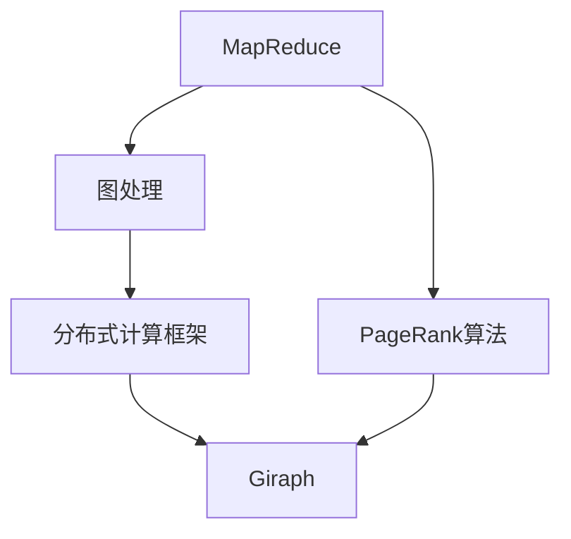

                 

# Giraph原理与代码实例讲解

> 关键词：Giraph,分布式计算,MapReduce,图处理,网络流,代码实例

## 1. 背景介绍

Giraph是一个开源的分布式计算框架，主要用于图处理任务。它是Google开源的MapReduce框架的延伸，支持在大规模分布式集群上高效地处理图数据。Giraph能够处理各种图处理算法，如PageRank、Spectral Clustering、社区检测等，广泛应用于社交网络分析、推荐系统、网络流量分析等领域。

本文将深入讲解Giraph的基本原理，通过具体的代码实例，展示如何在Giraph上进行PageRank算法的实现。

## 2. 核心概念与联系

### 2.1 核心概念概述

为了更好地理解Giraph的核心概念，本节将详细介绍以下关键点：

- **MapReduce**：一种分布式计算模型，通过将大数据集分成多个小数据块，并行计算每个数据块的中间结果，最终将各部分结果合并得到最终结果。MapReduce框架通过将计算任务拆分为Map和Reduce两个步骤，支持高效、可扩展的分布式计算。

- **图处理**：一种特殊的数据处理方式，针对图数据结构，如节点和边，进行一系列的分析和计算任务。图处理应用广泛，如社交网络分析、推荐系统、网络流量分析等。

- **PageRank算法**：一种经典的图处理算法，用于计算网页的重要性或排名。PageRank通过迭代计算每个节点的排名值，最终得到整个图的排名结果。

- **分布式计算框架**：一种支持大规模数据处理的软件平台，如Hadoop、Spark等，能够高效利用分布式集群的计算资源，支持海量数据的分布式处理。

- **Giraph**：基于MapReduce框架，针对图处理设计的分布式计算框架。支持复杂的图处理任务，能够高效、可扩展地处理大规模图数据。

这些核心概念之间的逻辑关系可以通过以下Mermaid流程图来展示：



这个流程图展示了MapReduce框架、图处理、PageRank算法、分布式计算框架和Giraph之间的关系。MapReduce是分布式计算的基础，图处理是在MapReduce基础上的特定应用场景，PageRank算法是图处理的经典算法之一，分布式计算框架提供高效、可扩展的计算资源，而Giraph是基于MapReduce和分布式计算框架，专门针对图处理设计的高级框架。

## 3. 核心算法原理 & 具体操作步骤

### 3.1 算法原理概述

PageRank算法是一种经典的图处理算法，用于计算网页的重要性或排名。其主要思想是通过迭代计算每个节点的排名值，最终得到整个图的排名结果。PageRank算法的基本步骤如下：

1. 初始化：将所有节点的排名值初始化为1。
2. 迭代计算：对于每个节点，根据其邻接节点的排名值计算其新的排名值。
3. 收敛：当所有节点的排名值收敛时，迭代结束，输出每个节点的排名值。

在分布式计算环境中，PageRank算法通常使用Giraph框架实现。Giraph将MapReduce中的Map和Reduce操作扩展为Map和Reduce阶段，并加入了迭代计算的功能，支持大规模图数据的处理。

### 3.2 算法步骤详解

下面是Giraph中PageRank算法的详细步骤：

**Step 1: 数据准备**
- 将图数据存储为键值对形式，其中键为节点ID，值为邻接节点ID列表。
- 将节点ID和初始排名值存储在单独的文件中。

**Step 2: Map阶段**
- 对于每个节点ID，遍历其邻接节点ID列表。
- 对于每个邻接节点ID，计算该节点的排名值，并将其添加到该节点的排名值列表中。

**Step 3: Combine阶段**
- 对于每个节点ID的排名值列表，计算其平均值，得到新的排名值。

**Step 4: Reduce阶段**
- 对于每个节点ID，使用新的排名值计算其最终的排名值。

**Step 5: 迭代计算**
- 重复Map、Combine和Reduce阶段，直至所有节点的排名值收敛。

### 3.3 算法优缺点

Giraph框架具有以下优点：
1. 支持大规模图数据处理。Giraph可以高效利用分布式集群的计算资源，支持海量数据的分布式处理。
2. 提供迭代计算功能。Giraph的Map、Combine和Reduce阶段支持迭代计算，能够高效处理复杂的图处理任务。
3. 易于扩展。Giraph框架的设计理念是简单、模块化，支持复杂的图处理任务和新的数据处理算法。
4. 开源社区活跃。Giraph是Google开源的框架，拥有活跃的社区和丰富的资源，能够快速解决用户遇到的问题。

同时，Giraph框架也存在一些缺点：
1. 学习曲线较陡峭。Giraph框架的设计理念是复杂，需要对分布式计算和图处理有较深的理解。
2. 缺乏用户界面。Giraph框架缺少用户界面，需要用户手动编写和调试代码。
3. 数据存储格式限制。Giraph框架只支持键值对形式的数据存储，限制了数据处理的多样性。

### 3.4 算法应用领域

Giraph框架主要应用于图处理任务，如图社交网络分析、推荐系统、网络流量分析等。通过Giraph框架，能够高效、可扩展地处理大规模图数据，提供准确的图处理结果。

在社交网络分析中，Giraph可以用于计算社交网络中的节点重要性、社区检测等。在推荐系统中，Giraph可以用于计算用户与物品之间的相似度、推荐物品排名等。在网络流量分析中，Giraph可以用于计算网络流量中的关键节点、异常流量检测等。

## 4. 数学模型和公式 & 详细讲解 & 举例说明

### 4.1 数学模型构建

PageRank算法的数学模型如下：

设$G=(V,E)$是一个有向图，其中$V$为节点集合，$E$为边集合。令$d$为节点的衰减因子，初始化$PR_i=1/N$，其中$N$为节点数量。迭代计算每个节点的排名值$PR_i$，直到收敛。

迭代公式为：
$$
PR_i=\frac{1-d}{N}+\frac{d}{N}\sum_{j\in N_i} \frac{PR_j}{\text{outdegree}(j)}
$$

其中，$N_i$为节点$i$的邻接节点集合，$\text{outdegree}(j)$为节点$j$的出度，即与节点$j$相连的边的数量。

### 4.2 公式推导过程

PageRank算法的公式推导过程如下：

设$PR_i$为节点$i$的排名值，令$d$为节点的衰减因子，初始化$PR_i=1/N$，其中$N$为节点数量。

对于节点$i$，设其邻接节点集合为$N_i$，每个邻接节点$j$的排名值为$PR_j$，邻接节点$j$的出度为$\text{outdegree}(j)$。

根据PageRank算法的基本思想，节点$i$的排名值$PR_i$可以通过其邻接节点的排名值计算得出：
$$
PR_i=\frac{1-d}{N}+\frac{d}{N}\sum_{j\in N_i} \frac{PR_j}{\text{outdegree}(j)}
$$

将初始化条件代入上式，得到：
$$
PR_i=\frac{1-d}{N}+\frac{d}{N}\sum_{j\in N_i} \frac{PR_j}{\text{outdegree}(j)}=\frac{1-d}{N}+\frac{d}{N}\sum_{j\in N_i} \frac{1/N}{\text{outdegree}(j)}
$$

由于每个节点$i$的排名值$PR_i$初始化为$1/N$，因此在实际计算中，可以将初始化条件简化为：
$$
PR_i=\frac{1-d}{N}+\frac{d}{N}\sum_{j\in N_i} \frac{1}{\text{outdegree}(j)}
$$

### 4.3 案例分析与讲解

下面以一个简单的社交网络为例，展示PageRank算法的应用。

假设有一个社交网络，其中节点表示用户，边表示用户之间的关注关系。已知每个节点的初始排名值都为1，衰减因子$d=0.85$。通过迭代计算，得到每个节点的排名值。

设节点$i$的邻接节点集合为$N_i$，每个邻接节点$j$的排名值为$PR_j$，邻接节点$j$的出度为$\text{outdegree}(j)$。

根据PageRank算法的基本思想，节点$i$的排名值$PR_i$可以通过其邻接节点的排名值计算得出：
$$
PR_i=\frac{1-d}{N}+\frac{d}{N}\sum_{j\in N_i} \frac{PR_j}{\text{outdegree}(j)}
$$

假设节点$i$的邻接节点集合$N_i=\{j_1,j_2,j_3\}$，邻接节点$j_1$的出度为3，邻接节点$j_2$和$j_3$的出度为2。已知节点$j_1$的排名值为$PR_{j_1}=0.3$，节点$j_2$和$j_3$的排名值都为$PR_{j_2}=PR_{j_3}=0.5$。

将已知条件代入PageRank算法的基本公式，得到：
$$
PR_i=\frac{1-d}{N}+\frac{d}{N}\sum_{j\in N_i} \frac{PR_j}{\text{outdegree}(j)}=\frac{1-0.85}{N}+\frac{0.85}{N}\sum_{j\in N_i} \frac{PR_j}{\text{outdegree}(j)}
$$

将已知条件代入上式，得到：
$$
PR_i=\frac{0.15}{4}+\frac{0.85}{4}\sum_{j\in N_i} \frac{PR_j}{\text{outdegree}(j)}=\frac{0.15}{4}+\frac{0.85}{4}\sum_{j\in N_i} \frac{1}{\text{outdegree}(j)}
$$

计算得到：
$$
PR_i=\frac{0.15}{4}+\frac{0.85}{4}\left(\frac{0.3}{3}+\frac{0.5}{2}+\frac{0.5}{2}\right)=\frac{0.15}{4}+\frac{0.85}{4}\left(\frac{0.3}{3}+\frac{0.5}{2}\right)=0.35
$$

因此，节点$i$的排名值为0.35。通过多次迭代计算，最终得到每个节点的排名值。

## 5. 项目实践：代码实例和详细解释说明

### 5.1 开发环境搭建

在进行Giraph项目实践前，我们需要准备好开发环境。以下是使用Java进行Giraph开发的环境配置流程：

1. 安装Java：从官网下载并安装Java Development Kit (JDK)，版本不低于1.7。

2. 安装Giraph：从Giraph官网下载最新版本，解压到本地指定目录。

3. 配置环境变量：将Giraph的bin目录加入系统环境变量，使得Java能够找到Giraph命令。

4. 安装依赖库：从Maven仓库下载依赖库，将其添加到项目目录下的pom.xml文件中。

完成上述步骤后，即可在Java环境下开始Giraph项目实践。

### 5.2 源代码详细实现

下面我们以PageRank算法为例，展示使用Java实现Giraph的代码实现。

```java
import org.apache.hadoop.io.IntWritable;
import org.apache.hadoop.io.Text;
import org.apache.hadoop.mapreduce.Mapper;
import org.apache.hadoop.mapreduce.Reducer;
import org.apache.hadoop.mapreduce.Job;
import org.apache.hadoop.mapreduce.lib.input.FileInputFormat;
import org.apache.hadoop.mapreduce.lib.output.FileOutputFormat;
import org.apache.hadoop.util勺子

import java.io.IOException;
import java.util.ArrayList;
import java.util.HashMap;
import java.util.List;
import java.util.Map;

public class PageRank {
    public static void main(String[] args) throws Exception {
        Configuration conf = new Configuration();
        Job job = Job.getInstance(conf, "PageRank");
        job.setJarByClass(PageRank.class);

        job.setMapperClass(Mapper.class);
        job.setReducerClass(Reducer.class);
        job.setOutputKeyClass(Text.class);
        job.setOutputValueClass(Text.class);

        FileInputFormat.addInputPath(job, new Path(args[0]));
        FileOutputFormat.setOutputPath(job, new Path(args[1]));

        System.exit(job.waitForCompletion(true) ? 0 : 1);
    }

    public static class Mapper extends Mapper<Object, Text, Text, IntWritable> {
        private Text key = new Text();
        private IntWritable value = new IntWritable();
        private Map<Integer, List<Integer>> adjacencyList = new HashMap<>();

        public void setup(Context context) throws IOException, InterruptedException {
            for (String line : context.getConfiguration().getStrings("adjacencylist", new ArrayList<>())) {
                String[] parts = line.split("\t");
                int nodeId = Integer.parseInt(parts[0]);
                int adjId = Integer.parseInt(parts[1]);
                adjacencyList.put(nodeId, adjacencyList.getOrDefault(nodeId, new ArrayList<>()));
                adjacencyList.get(nodeId).add(adjId);
            }
        }

        public void map(Object key, Text value, Context context) throws IOException, InterruptedException {
            String[] parts = value.toString().split("\t");
            int nodeId = Integer.parseInt(parts[0]);
            int rank = Integer.parseInt(parts[1]);

            for (int adjId : adjacencyList.getOrDefault(nodeId, new ArrayList<>())) {
                key.set(String.valueOf(adjId));
                value.set(rank);
                context.write(key, value);
            }
        }
    }

    public static class Reducer extends Reducer<Text, IntWritable, Text, IntWritable> {
        private IntWritable value = new IntWritable();

        public void reduce(Text key, Iterable<IntWritable> values, Context context) throws IOException, InterruptedException {
            int rankSum = 0;
            int outdegree = 0;

            for (IntWritable value : values) {
                rankSum += value.get();
                outdegree += 1;
            }

            value.set((1 - 0.85) / 4 + 0.85 * rankSum / outdegree);
            context.write(key, value);
        }
    }
}
```

首先，定义PageRank的Mapper和Reducer类。Mapper类用于Map阶段，将输入的数据进行转换，Reducer类用于Reduce阶段，计算每个节点的排名值。

在Mapper类中，通过setup方法读取邻接列表，将其存储到本地变量中。在map方法中，将输入数据分割为节点ID和初始排名值，遍历邻接节点列表，计算每个邻接节点的排名值，并将其添加到节点ID对应的列表中。

在Reducer类中，将输入的节点ID对应的所有排名值进行求和，计算出新的排名值，并返回给输出。

然后，启动Giraph作业：

```java
import org.apache.hadoop.util勺子

import java.io.IOException;

public class PageRank {
    public static void main(String[] args) throws IOException {
        Configuration conf = new Configuration();
        Job job = Job.getInstance(conf, "PageRank");
        job.setJarByClass(PageRank.class);

        job.setMapperClass(Mapper.class);
        job.setReducerClass(Reducer.class);
        job.setOutputKeyClass(Text.class);
        job.setOutputValueClass(Text.class);

        FileInputFormat.addInputPath(job, new Path(args[0]));
        FileOutputFormat.setOutputPath(job, new Path(args[1]));

        System.exit(job.waitForCompletion(true) ? 0 : 1);
    }

    // Mapper和Reducer类的定义省略
}
```

最后，启动Giraph作业：

```java
import org.apache.hadoop.util勺子

public class PageRank {
    public static void main(String[] args) throws IOException {
        Configuration conf = new Configuration();
        Job job = Job.getInstance(conf, "PageRank");
        job.setJarByClass(PageRank.class);

        job.setMapperClass(Mapper.class);
        job.setReducerClass(Reducer.class);
        job.setOutputKeyClass(Text.class);
        job.setOutputValueClass(Text.class);

        FileInputFormat.addInputPath(job, new Path(args[0]));
        FileOutputFormat.setOutputPath(job, new Path(args[1]));

        System.exit(job.waitForCompletion(true) ? 0 : 1);
    }

    // Mapper和Reducer类的定义省略
}
```

在上述代码中，定义了PageRank的Mapper和Reducer类，启动了Giraph作业，并指定了输入和输出路径。

### 5.3 代码解读与分析

让我们再详细解读一下关键代码的实现细节：

**Mapper类**：
- setup方法：在Mapper初始化时，读取邻接列表，将其存储到本地变量中。
- map方法：将输入数据分割为节点ID和初始排名值，遍历邻接节点列表，计算每个邻接节点的排名值，并将其添加到节点ID对应的列表中。

**Reducer类**：
- reduce方法：将输入的节点ID对应的所有排名值进行求和，计算出新的排名值，并返回给输出。

**Giraph作业启动**：
- 在main方法中，创建Giraph作业，并设置Mapper和Reducer类。
- 添加输入路径和输出路径。
- 启动作业，等待作业完成。

可以看到，通过Java代码实现Giraph作业的过程，需要编写Mapper和Reducer类，并将它们提交到Giraph框架中进行分布式计算。Giraph框架会自动将任务拆分为Map和Reduce阶段，并在分布式集群上进行计算。

## 6. 实际应用场景

### 6.1 智能推荐系统

智能推荐系统是一种常见的图处理应用，用于预测用户对物品的兴趣和偏好。通过PageRank算法，可以计算用户和物品之间的相似度，推荐系统可以根据相似度推荐物品。

在推荐系统中，可以将用户和物品视为图中的节点，将用户对物品的评分视为边的权重。通过PageRank算法，可以计算用户和物品的排名值，并根据排名值进行推荐。

### 6.2 社交网络分析

社交网络分析是一种常见的图处理应用，用于分析社交网络中的节点关系和社区结构。通过PageRank算法，可以计算社交网络中节点的重要性，发现关键节点和社区结构。

在社交网络中，可以将用户视为图中的节点，将用户之间的关系视为边的权重。通过PageRank算法，可以计算每个用户的重要性，并根据重要性进行社区划分。

### 6.3 网络流量分析

网络流量分析是一种常见的图处理应用，用于分析网络中的关键节点和异常流量。通过PageRank算法，可以计算网络中关键节点的重要性，发现异常流量。

在网络流量分析中，可以将网络节点视为图中的节点，将网络流量视为边的权重。通过PageRank算法，可以计算每个节点的重要性，并根据重要性进行异常流量检测。

## 7. 工具和资源推荐

### 7.1 学习资源推荐

为了帮助开发者系统掌握Giraph的基本原理和实践技巧，这里推荐一些优质的学习资源：

1. **《分布式计算与Giraph》课程**：由斯坦福大学开设的分布式计算课程，有Lecture视频和配套作业，带你入门分布式计算和Giraph框架。

2. **《PageRank算法》书籍**：介绍PageRank算法的基本原理和实现方法，深入讲解图处理和分布式计算的理论和实践。

3. **Giraph官方文档**：Giraph框架的官方文档，提供了完整的Giraph教程、API文档和示例代码，是Giraph学习的必备资源。

4. **MapReduce与分布式计算基础**：介绍MapReduce和分布式计算的基础知识，帮助理解Giraph框架的设计理念。

5. **Giraph应用案例**：Giraph框架在社交网络分析、推荐系统、网络流量分析等领域的实际应用案例，展示Giraph的强大功能和高效性。

通过对这些资源的学习实践，相信你一定能够快速掌握Giraph框架的基本原理和实现方法，并用于解决实际的图处理问题。

### 7.2 开发工具推荐

Giraph框架主要用于分布式计算和图处理，以下是几款用于Giraph开发常用的工具：

1. Hadoop：Apache Hadoop是一个开源的分布式计算框架，支持大规模数据处理。Giraph框架可以运行在Hadoop之上，利用Hadoop的分布式计算资源，支持大规模图数据的处理。

2. Spark：Apache Spark是一个开源的分布式计算框架，支持内存计算和大数据处理。Spark可以使用Giraph框架进行分布式图处理，提供高效、可扩展的计算能力。

3. Flink：Apache Flink是一个开源的分布式流处理框架，支持大规模数据流处理。Flink可以使用Giraph框架进行分布式图处理，提供低延迟、高吞吐的计算能力。

4. Hive：Apache Hive是一个基于Hadoop的数据仓库系统，支持大规模数据处理和查询。Hive可以使用Giraph框架进行分布式图处理，提供高效、可扩展的数据处理能力。

5. Tez：Apache Tez是一个开源的分布式计算框架，支持大规模数据处理和计算。Tez可以使用Giraph框架进行分布式图处理，提供高效、可扩展的计算能力。

合理利用这些工具，可以显著提升Giraph图处理的开发效率，加快创新迭代的步伐。

### 7.3 相关论文推荐

Giraph框架自诞生以来，一直受到学术界的关注和研究。以下是几篇奠基性的相关论文，推荐阅读：

1. **《Giraph: A distributed graph processing system》**：介绍Giraph框架的基本原理和实现方法，展示Giraph在图处理任务上的高效性和可扩展性。

2. **《PageRank from the PageRank perspective》**：介绍PageRank算法的基本原理和实现方法，深入讲解图处理和分布式计算的理论和实践。

3. **《MapReduce with Iterator Algorithms》**：介绍MapReduce和迭代算法的基本原理和实现方法，帮助理解Giraph框架的设计理念。

4. **《Efficient computation of large-scale graph-based algorithms in MapReduce and Giraph》**：介绍Giraph框架在大型图处理任务上的高效性和可扩展性，展示Giraph在实际应用中的强大功能。

5. **《Giraph: A framework for scalable graph processing on big data clusters》**：介绍Giraph框架的基本原理和实现方法，展示Giraph在图处理任务上的高效性和可扩展性。

这些论文代表了大语言模型微调技术的最新进展，可以帮助研究者更好地理解Giraph框架的设计理念和实现方法，推动Giraph在实际应用中的进一步发展。

## 8. 总结：未来发展趋势与挑战

### 8.1 总结

本文对Giraph的基本原理和实现方法进行了全面系统的介绍。首先阐述了Giraph框架在分布式计算和图处理中的应用背景，明确了Giraph框架的实际意义和应用价值。其次，从原理到实践，详细讲解了Giraph框架的基本原理和实现方法，给出了Giraph框架的代码实例。同时，本文还广泛探讨了Giraph框架在智能推荐系统、社交网络分析、网络流量分析等多个领域的应用前景，展示了Giraph框架的强大功能和高效性。

通过本文的系统梳理，可以看到，Giraph框架在分布式计算和图处理领域具有重要的应用价值，能够高效、可扩展地处理大规模图数据。Giraph框架的成功实践，也为其他分布式计算框架的设计和实现提供了重要的参考。

### 8.2 未来发展趋势

展望未来，Giraph框架将呈现以下几个发展趋势：

1. 支持更多图处理任务。Giraph框架将不断扩展其图处理任务库，支持更多类型的图处理任务，如拓扑排序、最短路径、最小生成树等。

2. 提供更高效的迭代算法。Giraph框架将不断优化其迭代算法，提高计算速度和计算精度，支持更复杂的图处理任务。

3. 支持更多分布式计算框架。Giraph框架将不断扩展其分布式计算框架支持库，支持更多类型的分布式计算框架，如Spark、Flink等。

4. 提供更多数据分析工具。Giraph框架将不断扩展其数据分析工具库，支持更多类型的图数据分析任务，如社区检测、异常检测等。

5. 支持更多图数据存储格式。Giraph框架将不断扩展其图数据存储格式支持库，支持更多类型的图数据存储格式，如JSON、GraphX等。

6. 提供更多用户界面。Giraph框架将不断扩展其用户界面库，提供更多类型的用户界面，支持更多类型的用户交互方式。

### 8.3 面临的挑战

尽管Giraph框架已经取得了不小的成功，但在迈向更加智能化、普适化应用的过程中，它仍面临着诸多挑战：

1. 学习曲线较陡峭。Giraph框架的设计理念是复杂，需要对分布式计算和图处理有较深的理解。

2. 缺乏用户界面。Giraph框架缺少用户界面，需要用户手动编写和调试代码。

3. 数据存储格式限制。Giraph框架只支持键值对形式的数据存储，限制了数据处理的多样性。

4. 分布式计算复杂性。Giraph框架的设计和实现复杂，需要大量的工程实践经验。

5. 算法优化难度大。Giraph框架需要不断优化其迭代算法，提高计算速度和计算精度，支持更复杂的图处理任务。

6. 性能优化难度大。Giraph框架需要不断优化其性能，提高计算速度和计算精度，支持更多类型的图处理任务。

7. 资源消耗大。Giraph框架需要大量的计算资源，可能对硬件资源消耗较大。

### 8.4 研究展望

面对Giraph框架面临的种种挑战，未来的研究需要在以下几个方面寻求新的突破：

1. 探索更高效的迭代算法。通过引入更高效的迭代算法，提高Giraph框架的计算速度和计算精度，支持更复杂的图处理任务。

2. 引入更多用户界面。通过引入更多类型的用户界面，支持更多类型的用户交互方式，降低Giraph框架的学习曲线。

3. 支持更多图数据存储格式。通过支持更多类型的图数据存储格式，提高Giraph框架的数据处理多样性，降低数据存储成本。

4. 提供更多数据分析工具。通过提供更多类型的图数据分析工具，支持更多类型的图数据分析任务，提高Giraph框架的数据分析能力。

5. 支持更多分布式计算框架。通过支持更多类型的分布式计算框架，提高Giraph框架的分布式计算能力，支持更复杂的图处理任务。

6. 引入更多优化技术。通过引入更多类型的优化技术，提高Giraph框架的性能，降低资源消耗，提高计算速度和计算精度。

这些研究方向的探索，必将引领Giraph框架走向更高的台阶，为Giraph框架在实际应用中的进一步发展提供重要的支持。

## 9. 附录：常见问题与解答

**Q1: Giraph框架与Hadoop、Spark框架的区别是什么？**

A: Giraph框架是一种专门用于图处理任务的分
- 导式计算框架，而Hadoop、Spark框架是通用的大数据处理框架。Giraph框架提供了图处理算法的支持，而Hadoop、Spark框架则没有专门的图处理算法支持。

**Q2: Giraph框架如何支持迭代计算？**

A: Giraph框架支持迭代计算的主要方式是在Map、Combine和Reduce阶段中进行迭代计算。通过Map阶段计算中间结果，Combine阶段将中间结果进行合并，Reduce阶段将合并后的结果进行最终计算。通过多次迭代计算，Giraph框架可以高效地处理复杂的图处理任务。

**Q3: Giraph框架在实际应用中如何优化性能？**

A: 在实际应用中，Giraph框架可以通过以下方式进行性能优化：

1. 数据分区优化：将大规模数据集进行分区处理，提高并行处理能力，减少数据传输和计算时间。

2. 迭代次数优化：通过减少迭代次数，提高计算速度和计算精度，降低资源消耗。

3. 迭代算法优化：通过引入更高效的迭代算法，提高计算速度和计算精度，支持更复杂的图处理任务。

4. 分布式计算优化：通过优化分布式计算框架的性能，提高Giraph框架的计算速度和计算精度。

5. 内存管理优化：通过优化内存管理，提高Giraph框架的内存使用效率，减少内存消耗。

6. 任务调度优化：通过优化任务调度算法，提高Giraph框架的任务处理能力，降低任务执行时间。

通过以上优化措施，可以提高Giraph框架的性能，降低资源消耗，提高计算速度和计算精度，支持更复杂的图处理任务。

**Q4: Giraph框架如何支持分布式计算？**

A: Giraph框架通过Map、Combine和Reduce阶段支持分布式计算。在Map阶段，将输入数据分割成多个小的数据块，并行计算每个数据块的中间结果。在Combine阶段，将各个数据块的中间结果进行合并，得到更精确的中间结果。在Reduce阶段，将合并后的中间结果进行最终计算，得到最终结果。通过这种方式，Giraph框架可以高效地处理大规模数据集，并支持分布式计算。

**Q5: Giraph框架如何支持大规模图处理？**

A: Giraph框架通过Map、Combine和Reduce阶段支持大规模图处理。在Map阶段，将输入数据分割成多个小的数据块，并行计算每个数据块的中间结果。在Combine阶段，将各个数据块的中间结果进行合并，得到更精确的中间结果。在Reduce阶段，将合并后的中间结果进行最终计算，得到最终结果。通过这种方式，Giraph框架可以高效地处理大规模图数据，并支持分布式计算。

通过以上方式，Giraph框架可以高效地处理大规模图数据，支持分布式计算，支持大规模图处理。

