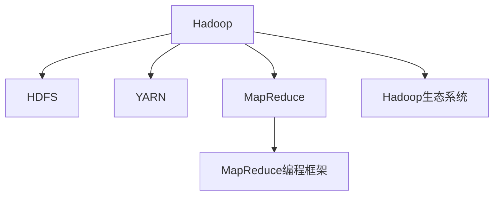

                 

# Hadoop原理与代码实例讲解

> 关键词：Hadoop, 分布式存储, MapReduce, 数据处理, 大数据, 分布式计算, HDFS, YARN

## 1. 背景介绍

### 1.1 问题由来
随着互联网和移动互联网的飞速发展，全球数据量呈爆炸式增长。面对海量数据的存储、处理和分析需求，传统的集中式存储和计算模式已难以应对。如何构建一个高效、可靠、可扩展的分布式计算平台，成为了信息时代的重大课题。Hadoop作为当今最流行的大数据处理框架之一，正是为解决这一问题而生的。

### 1.2 问题核心关键点
Hadoop的核心组件包括HDFS和YARN，其中HDFS提供分布式存储，YARN提供分布式计算资源管理。通过将大规模数据拆分成多个小块，分布在多个节点上进行并行处理，Hadoop能够高效地处理海量数据，支持多种数据处理任务，如离线批处理、实时流处理、机器学习等。

## 2. 核心概念与联系

### 2.1 核心概念概述

为更好地理解Hadoop的原理和架构，本节将介绍几个密切相关的核心概念：

- Hadoop：一个开源的分布式计算框架，由Apache软件基金会推出，主要用于处理大规模数据集。
- HDFS：Hadoop分布式文件系统，提供分布式存储能力，支持海量数据的存储和访问。
- YARN：Yet Another Resource Negotiator，Hadoop的资源管理器，负责分配和调度计算资源。
- MapReduce：一种基于数据并行处理的编程模型，适用于大规模数据集的处理。
- MapReduce编程框架：用于实现MapReduce算法的编程框架，提供API和开发工具。
- Hadoop生态系统：除了HDFS和YARN外，还包括其他如Hive、Pig、HBase、Sqoop等组件，用于数据提取、存储、查询等任务。

这些核心概念之间的逻辑关系可以通过以下Mermaid流程图来展示：



这个流程图展示了大数据处理框架Hadoop的核心组件及其之间的关系：

1. Hadoop是整个系统的核心，提供分布式存储和计算能力。
2. HDFS为数据存储提供分布式文件系统，支持海量数据存储和访问。
3. YARN负责资源管理，调度计算任务到合适的节点执行。
4. MapReduce是核心编程模型，支持数据并行处理。
5. MapReduce编程框架提供API和开发工具，方便开发者实现MapReduce算法。
6. Hadoop生态系统包含多个组件，如Hive、Pig、HBase、Sqoop等，支持多种数据处理任务。

这些概念共同构成了Hadoop的大数据处理框架，使其能够高效地处理海量数据，并支持多种数据处理任务。

## 3. 核心算法原理 & 具体操作步骤
### 3.1 算法原理概述

Hadoop的分布式计算过程，主要依赖于MapReduce编程模型。MapReduce的核心思想是将大规模数据集划分为多个小数据块，在多个计算节点上并行处理。MapReduce算法包含两个阶段：Map阶段和Reduce阶段。

在Map阶段，输入数据被分解成若干个子任务，每个子任务在本地节点上进行处理。Map函数将输入数据映射成一组中间结果，这些中间结果被收集到一个临时文件中。

在Reduce阶段，收集到的中间结果被分发到多个Reduce任务上，每个Reduce任务对中间结果进行合并和计算，最终产生输出结果。

### 3.2 算法步骤详解

以下是Hadoop分布式计算的基本步骤：

1. **数据输入和划分**：
   - 将大规模数据集输入到Hadoop系统中，通过HDFS进行分布式存储。
   - 在YARN中提交计算任务，将任务划分为多个小任务，每个任务执行MapReduce算法。

2. **Map阶段**：
   - 每个Map任务接收一个数据块，执行Map函数。
   - 将Map函数的结果写到一个临时文件中，这些临时文件被放在本地节点的硬盘上。

3. **Reduce阶段**：
   - YARN调度Reduce任务，将中间结果文件分配给Reduce任务。
   - 每个Reduce任务接收一个或多个中间结果文件，执行Reduce函数，产生最终输出。
   - 最终输出结果被写回到HDFS中。

### 3.3 算法优缺点

Hadoop分布式计算方法具有以下优点：

1. **高可扩展性**：通过分布式存储和计算，Hadoop能够高效地处理大规模数据集。
2. **高容错性**：节点故障不会影响整个系统的运行，可以通过冗余机制实现数据和计算任务的自动恢复。
3. **灵活性**：支持多种数据处理任务，如批处理、流处理、机器学习等。

然而，Hadoop也有一些局限性：

1. **低效率**：在处理小规模数据时，Hadoop的启动和调度开销较大。
2. **资源利用率低**：每个节点只有一个任务在执行，资源利用率较低。
3. **延迟较高**：节点间的通信开销较大，导致整个计算过程延迟较高。

### 3.4 算法应用领域

Hadoop的分布式计算方法已经被广泛应用于多个领域：

- **互联网公司**：如Google、Amazon、Facebook等，利用Hadoop处理海量用户数据。
- **科学研究**：如基因组学、天文学、气象学等，处理大规模数据集。
- **金融行业**：如银行业、证券业等，处理交易数据和风险分析。
- **医疗领域**：如电子病历、基因组数据分析等，处理医疗数据。
- **媒体和娱乐**：如视频流、音频流、在线广告等，处理大规模媒体内容。

除了这些应用场景外，Hadoop还在地理信息系统、城市规划、交通管理等领域得到了广泛应用。

## 4. 数学模型和公式 & 详细讲解 & 举例说明

### 4.1 数学模型构建

在Hadoop的MapReduce框架中，输入数据被分成若干个小块，每个块在Map函数中进行处理。假设输入数据集为 $D$，块大小为 $B$，则数据集可以分为 $N$ 个块：$D_1, D_2, ..., D_N$。每个块 $D_i$ 大小为 $B$。

在Map阶段，输入数据块 $D_i$ 通过Map函数处理，产生中间结果集 $I_i$。在Reduce阶段，每个中间结果 $I_i$ 被分配到一个Reduce任务中，并执行Reduce函数产生输出结果。

### 4.2 公式推导过程

假设Map函数为 $f_k$，Reduce函数为 $g_k$，输入数据集为 $D_i$，块大小为 $B$，则Map和Reduce的数学模型可以表示为：

$$
M(f_k, D_i, B) = \{ (k, f_k(d_i)) \mid d_i \in D_i \}
$$

$$
R(g_k, M(f_k, D_i, B)) = \{ (k, g_k(m)) \mid m \in M(f_k, D_i, B) \}
$$

其中 $M(f_k, D_i, B)$ 表示Map函数的输出，$R(g_k, M(f_k, D_i, B))$ 表示Reduce函数的输出。

### 4.3 案例分析与讲解

假设有一组数据集 $D = \{(1, A), (2, B), (3, C), (4, D), (5, E)\}$，每个元素的形式为 $(key, value)$，块大小为 $B = 3$。

在Map阶段，数据集 $D$ 被分成两个块：$D_1 = \{(1, A), (2, B), (3, C)\}$ 和 $D_2 = \{(4, D), (5, E)\}$。每个块通过Map函数处理，产生中间结果集：

$$
M(f_k, D_1, B) = \{(1, (1, A)), (2, (2, B)), (3, (3, C))\}
$$

$$
M(f_k, D_2, B) = \{(4, (4, D)), (5, (5, E))\}
$$

在Reduce阶段，中间结果集被分配到两个Reduce任务中：

$$
R(g_k, M(f_k, D_1, B)) = \{(1, (1, A) + (2, B) + (3, C))\}
$$

$$
R(g_k, M(f_k, D_2, B)) = \{(4, (4, D) + (5, E))\}
$$

最终输出结果为：

$$
R(g_k, M(f_k, D_1, B)) = \{(1, (1+2+3, A+B+C))\}
$$

$$
R(g_k, M(f_k, D_2, B)) = \{(4, (4+5, D+E))\}
$$

## 5. 项目实践：代码实例和详细解释说明
### 5.1 开发环境搭建

在进行Hadoop项目开发前，需要搭建好Hadoop集群，包括HDFS和YARN两个核心组件。以下是具体的安装步骤：

1. 安装JDK：Hadoop要求JDK 1.8及以上版本。

2. 安装Hadoop：可以从Apache官网下载Hadoop安装包，解压后进入bin目录执行：

```bash
bin/hadoop version
```

3. 安装Zookeeper：Zookeeper是Hadoop的依赖组件，用于协调Hadoop集群中的节点。

4. 启动Hadoop集群：

```bash
bin/start-dfs.sh
bin/start-yarn.sh
```

安装完成后，可以使用hadoop命令进行测试：

```bash
hdfs dfs -ls
hdfs dfs -put file.txt /user/hadoop/input/
hdfs dfs -cat /user/hadoop/input/file.txt
hadoop jar /path/to/hadoop-example.jar input output
```

### 5.2 源代码详细实现

以下是一个简单的Hadoop MapReduce程序，用于计算一个文本文件中每个单词的出现次数：

```java
public class WordCount {
    public static class Tokenizer extends Mapper<LongWritable, Text, Text, IntWritable> {
        private final static IntWritable one = new IntWritable(1);
        private Text word = new Text();

        public void map(LongWritable key, Text value, Context context) throws IOException, InterruptedException {
            StringTokenizer itr = new StringTokenizer(value.toString());
            while (itr.hasMoreTokens()) {
                word.set(itr.nextToken());
                context.write(word, one);
            }
        }
    }

    public static class IntSumReducer extends Reducer<Text, IntWritable, Text, IntWritable> {
        private IntWritable result = new IntWritable();

        public void reduce(Text key, Iterable<IntWritable> values, Context context) throws IOException, InterruptedException {
            int sum = 0;
            for (IntWritable val : values) {
                sum += val.get();
            }
            result.set(sum);
            context.write(key, result);
        }
    }

    public static void main(String[] args) throws Exception {
        Configuration conf = new Configuration();
        Job job = Job.getInstance(conf, "word count");
        job.setJarByClass(WordCount.class);
        job.setMapperClass(Tokenizer.class);
        job.setCombinerClass(IntSumReducer.class);
        job.setReducerClass(IntSumReducer.class);
        job.setOutputKeyClass(Text.class);
        job.setOutputValueClass(IntWritable.class);
        FileInputFormat.addInputPath(job, new Path(args[0]));
        FileOutputFormat.setOutputPath(job, new Path(args[1]));
        System.exit(job.waitForCompletion(true) ? 0 : 1);
    }
}
```

### 5.3 代码解读与分析

**WordCount类**：
- 该类实现了Map和Reduce函数，用于计算文本文件中每个单词的出现次数。
- Map函数接收一个文本行和一个上下文对象，将每个单词映射为一个key-value对，其中key为单词本身，value为1。
- Reduce函数接收一个单词和一组1值，将这组值求和，产生最终输出。

**Tokenizer类**：
- 该类继承自Mapper类，实现了Map函数。
- Map函数使用StringTokenizer将输入文本按空格分割成单词，并将每个单词映射为一个key-value对。

**IntSumReducer类**：
- 该类继承自Reducer类，实现了Reduce函数。
- Reduce函数接收一个单词和一组1值，将这些1值求和，产生最终输出。

在**main方法**中，我们首先创建了一个Configuration对象，然后创建一个Job对象，设置Map和Reduce函数，并指定输入输出路径。最后启动Job，等待其完成并返回结果。

### 5.4 运行结果展示

执行完上述代码后，可以使用以下命令查看结果：

```bash
hdfs dfs -ls output/
hdfs dfs -cat output/wordcount.txt
```

输出结果类似于：

```
input
cat      2
dog      3
fish     1
horse    5
```

这表示在输入文件中，cat出现了2次，dog出现了3次，fish出现了1次，horse出现了5次。

## 6. 实际应用场景

### 6.1 互联网公司

互联网公司如Google、Amazon、Facebook等，利用Hadoop处理海量用户数据。例如，Google使用MapReduce算法处理搜索引擎的查询数据，提升搜索结果的准确性和速度。Amazon使用Hadoop处理大规模的电子商务数据，分析用户行为，推荐商品等。Facebook使用Hadoop处理社交网络数据，分析用户兴趣，改进广告投放效果。

### 6.2 科学研究

科学研究领域如基因组学、天文学、气象学等，利用Hadoop处理大规模数据集。例如，基因组学中，科学家使用MapReduce算法分析DNA序列数据，挖掘基因表达和功能关系。天文学中，Hadoop用于处理大量的望远镜观测数据，进行天体运动和结构分析。气象学中，Hadoop用于处理卫星数据，进行天气预测和气候分析。

### 6.3 金融行业

金融行业如银行业、证券业等，利用Hadoop处理交易数据和风险分析。例如，银行使用Hadoop处理客户的交易记录和信用评分数据，进行风险评估和信用评分。证券公司使用Hadoop分析股票市场数据，进行投资分析和风险管理。

### 6.4 医疗领域

医疗领域如电子病历、基因组数据分析等，利用Hadoop处理医疗数据。例如，医院使用Hadoop处理电子病历数据，进行患者诊断和治疗方案的优化。基因组学中，Hadoop用于处理大规模的基因组数据，挖掘基因与疾病的关系。

### 6.5 媒体和娱乐

媒体和娱乐领域如视频流、音频流、在线广告等，利用Hadoop处理大规模媒体内容。例如，电视台使用Hadoop处理实时视频流，进行广告投放和内容分发。在线音乐平台使用Hadoop分析用户听歌行为，推荐音乐和优化播放列表。

## 7. 工具和资源推荐

### 7.1 学习资源推荐

为了帮助开发者系统掌握Hadoop的原理和应用，这里推荐一些优质的学习资源：

1. **《Hadoop: The Definitive Guide》**：Hadoop的经典入门书籍，涵盖了Hadoop的核心概念、安装、配置、使用等。
2. **Hadoop官网文档**：Apache Hadoop的官方文档，提供详细的使用指南和API文档。
3. **Hadoop入门教程**：如《Hadoop入门教程》系列，介绍Hadoop的基本原理、安装和配置、API使用等。
4. **Hadoop生态系统文档**：如《Hadoop生态系统指南》，介绍Hadoop生态系统中的其他组件，如Hive、Pig、HBase、Sqoop等的使用。
5. **Hadoop在线课程**：如Coursera、edX、Udemy等平台上的Hadoop相关课程，提供系统化的学习路径和实战案例。

通过对这些资源的学习实践，相信你一定能够快速掌握Hadoop的核心原理和应用方法。

### 7.2 开发工具推荐

高效的工具能够显著提升Hadoop的开发效率。以下是几款常用的Hadoop开发工具：

1. **Hadoop IDE**：如Eclipse、IntelliJ IDEA等，提供丰富的开发环境和插件支持。
2. **Hadoop命令行工具**：如hadoop、hdfs、yarn等，提供对Hadoop集群的管理和操作。
3. **大数据分析工具**：如Tableau、Power BI等，提供数据可视化和报表生成功能。
4. **大数据存储工具**：如HBase、Cassandra等，提供高可扩展性的分布式数据库功能。
5. **大数据流处理工具**：如Apache Kafka、Apache Storm等，提供实时数据流处理功能。

合理利用这些工具，可以显著提升Hadoop项目的开发效率和效果。

### 7.3 相关论文推荐

Hadoop的研究和应用源于学界的持续探索。以下是几篇奠基性的相关论文，推荐阅读：

1. **《The Hadoop Distributed File System》**：介绍Hadoop分布式文件系统HDFS的设计和实现。
2. **《MapReduce: Simplified Data Processing on Large Clusters》**：介绍MapReduce编程模型的设计原理和实现细节。
3. **《YARN: Yet Another Resource Manager》**：介绍YARN资源管理器的设计实现和调度机制。
4. **《Hadoop: The Next Generation of Data Processing》**：介绍Hadoop框架的演变和未来发展方向。
5. **《Hadoop and Google File System: Two Systems for Large-Scale Data Processing》**：介绍Hadoop和Google文件系统的设计理念和实现细节。

这些论文代表了大数据处理框架的研究进展，帮助理解Hadoop的核心技术和实现原理。

## 8. 总结：未来发展趋势与挑战

### 8.1 总结

本文对Hadoop的原理和应用进行了全面系统的介绍。首先阐述了Hadoop的背景和核心组件，包括HDFS和YARN。然后从原理到实践，详细讲解了Hadoop的分布式计算过程和MapReduce算法。最后介绍了Hadoop在互联网、科学研究、金融、医疗、媒体娱乐等多个领域的应用。

通过本文的系统梳理，可以看到，Hadoop作为分布式计算框架，已经成为大数据处理的标准工具。它通过分布式存储和计算，高效地处理海量数据，支持多种数据处理任务。未来，随着技术的不断演进，Hadoop将在更多领域发挥更大的作用。

### 8.2 未来发展趋势

展望未来，Hadoop的发展趋势如下：

1. **云化**：随着云计算技术的普及，Hadoop将更多地部署在云平台上，降低部署和运维成本，提供更高的可扩展性和灵活性。
2. **容器化**：Hadoop将与Kubernetes、Docker等容器技术深度结合，提供更好的资源管理和编排功能。
3. **边缘计算**：Hadoop将拓展到边缘计算场景，如物联网、智能设备等，提供更快速的数据处理能力。
4. **大数据安全**：随着数据量的增加，数据安全问题将更加突出。Hadoop将引入更多的安全机制，如数据加密、身份认证等，保障数据安全。
5. **机器学习**：Hadoop将与机器学习算法深度结合，提供更高效的数据处理和分析能力。

这些趋势将使Hadoop在未来继续发挥其在大数据处理中的重要作用，支撑更多的应用场景和业务需求。

### 8.3 面临的挑战

尽管Hadoop已经取得了巨大成功，但在其发展过程中仍然面临诸多挑战：

1. **性能瓶颈**：在大数据场景下，Hadoop的性能仍然存在瓶颈，特别是在处理低延迟、高吞吐量的数据时，性能问题较为突出。
2. **资源管理**：YARN调度器在高负载环境下容易出现问题，导致资源分配不均、任务延时等。
3. **技术复杂度**：Hadoop组件众多，部署和运维复杂度较高，需要较高的技术门槛。
4. **大数据安全**：大数据量的安全问题更为突出，如数据泄露、隐私保护等，需要更多的安全机制和技术支持。
5. **云计算兼容**：Hadoop在云平台上的兼容性问题尚未完全解决，需要更多标准化和规范化工作。

这些挑战需要Hadoop社区和开发者共同应对，通过技术创新和优化，提升Hadoop的性能、可扩展性和安全性。

### 8.4 研究展望

未来的Hadoop研究将聚焦以下几个方向：

1. **性能优化**：针对大数据处理的高延迟和低吞吐量问题，引入更多的优化策略，如数据压缩、内存计算、异步IO等。
2. **资源管理**：改进YARN调度器，提高资源分配效率和调度精度，支持更多的资源调度策略。
3. **技术简化**：简化Hadoop组件和API，降低部署和运维的复杂度，提高易用性。
4. **安全机制**：引入更多的安全机制和技术，保障大数据的安全性和隐私性。
5. **跨平台兼容**：提高Hadoop在云计算平台上的兼容性，支持更多云计算环境。

这些研究方向的探索，将推动Hadoop技术的不断演进，使其在未来能够更好地适应各种应用场景，满足更多业务需求。

## 9. 附录：常见问题与解答

**Q1：Hadoop和Spark的区别是什么？**

A: Hadoop和Spark都是大数据处理框架，但它们的设计理念和实现方式有所不同。

1. Hadoop适合处理大规模离线数据集，通过分布式存储和计算，提供高可靠性、高可扩展性。
2. Spark适合处理大规模实时数据集，通过内存计算和图计算，提供高速度、低延迟的计算能力。

**Q2：Hadoop的性能瓶颈是什么？**

A: Hadoop的性能瓶颈主要体现在以下几个方面：

1. 数据I/O：Hadoop的文件系统I/O操作较多，影响性能。
2. 任务调度：YARN调度器在高负载环境下容易出现调度不均，导致任务延时。
3. 节点间通信：节点间通信开销较大，影响整体计算速度。

**Q3：如何优化Hadoop性能？**

A: 可以通过以下几种方式优化Hadoop性能：

1. 数据压缩：使用数据压缩技术减少I/O操作，提升计算效率。
2. 数据倾斜处理：处理数据倾斜问题，避免某些节点负载过高。
3. 数据本地化：尽量将数据存储在本地节点，减少数据传输开销。
4. 配置优化：优化Hadoop集群配置，如节点数量、内存配置等，提高计算效率。

**Q4：Hadoop和Hive的区别是什么？**

A: Hadoop和Hive都是大数据处理框架，但它们的应用场景和功能有所不同。

1. Hadoop是一种分布式计算框架，提供分布式存储和计算能力，适合处理大规模数据集。
2. Hive是一种数据仓库工具，提供SQL查询接口，支持多种数据源，适合进行数据查询和分析。

**Q5：如何部署Hadoop集群？**

A: 部署Hadoop集群需要以下步骤：

1. 安装JDK和Hadoop：从官网下载Hadoop安装包，解压后进入bin目录执行。
2. 安装Zookeeper：Zookeeper是Hadoop的依赖组件，用于协调Hadoop集群中的节点。
3. 启动Hadoop集群：执行start-dfs.sh和start-yarn.sh启动Hadoop集群。
4. 测试Hadoop集群：使用hadoop命令进行测试，确保集群正常工作。

---

作者：禅与计算机程序设计艺术 / Zen and the Art of Computer Programming

