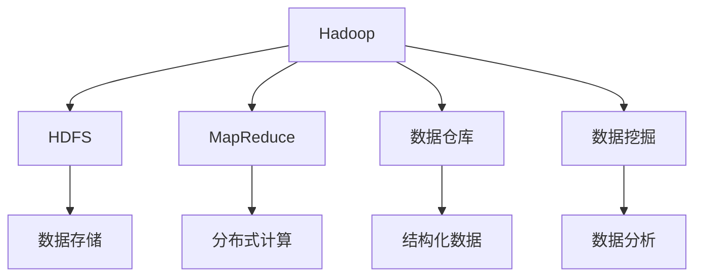

                 

# Hadoop原理与代码实例讲解

> 关键词：Hadoop,分布式文件系统,MapReduce,大数据处理,数据仓库,数据挖掘

## 1. 背景介绍

### 1.1 问题由来
在互联网时代，随着数据量的爆炸式增长，传统的单机数据处理方式难以满足企业对海量数据存储和计算的需求。为了应对这一挑战，谷歌于2003年推出了GFS（Google File System）和MapReduce编程模型，随后开源社区基于这些技术推出了Apache Hadoop，一个开源的分布式计算框架。Hadoop成为了大数据处理领域的标杆技术，支持从数据存储、数据处理到数据可视化等全流程的解决方案。

然而，尽管Hadoop已广泛应用于各行各业，但其原理和实现细节仍然存在较多迷惑之处。本文将深入探讨Hadoop的核心原理，并结合代码实例讲解其关键技术。通过系统的介绍和实践，相信读者对Hadoop会有更深入的理解，并能灵活应对大数据处理中的各类问题。

## 2. 核心概念与联系

### 2.1 核心概念概述

为更好地理解Hadoop的原理和实现细节，本节将介绍几个关键概念：

- Hadoop：Apache基金会推出的开源分布式计算框架，包括分布式文件系统HDFS和计算框架MapReduce。Hadoop旨在提供一个简单、高效、可靠的大数据处理平台。

- HDFS：Hadoop分布式文件系统（Hadoop Distributed File System），是Hadoop的核心组件之一。HDFS提供了一种可靠、可扩展的分布式文件存储方案，能够支持PB级别的海量数据存储。

- MapReduce：一种基于数据并行的分布式计算模型，由Google发明并开源。MapReduce将复杂的计算任务分解为多个小任务，并通过分布式计算框架MapReduce进行并行处理。

- 数据仓库：一种用于支持决策制定和分析的数据管理技术，存储和处理结构化数据，并提供强大的查询和分析功能。Hadoop能够将大规模数据仓库集成到其分布式计算框架中，实现高效的大数据处理。

- 数据挖掘：一种从大规模数据中挖掘出有用信息的技术，常用于市场分析、客户细分、个性化推荐等场景。Hadoop提供了强大的数据处理和分析功能，支持各种数据挖掘算法。

这些核心概念之间的逻辑关系可以通过以下Mermaid流程图来展示：



这个流程图展示了大数据处理的主要组件及其之间的联系：

1. Hadoop是整个大数据处理框架的核心。
2. HDFS提供了可靠的数据存储方案。
3. MapReduce实现了分布式计算模型。
4. 数据仓库和数据挖掘是数据处理和分析的关键技术。
5. Hadoop将各个组件有机结合，支持从数据存储、处理到分析的全流程管理。

## 3. 核心算法原理 & 具体操作步骤
### 3.1 算法原理概述

Hadoop的核心原理可以归纳为以下几点：

1. 分布式存储：HDFS采用多机分布式存储架构，将大规模数据分散存储在多个节点上，保证数据的高可用性和可扩展性。

2. 数据处理：MapReduce实现了基于数据并行的分布式计算模型，将复杂的计算任务分解成多个小任务，并通过分布式计算框架并行处理，显著提升处理速度。

3. 容错性设计：Hadoop通过冗余存储和任务调度，保证了计算过程的容错性和鲁棒性。

4. 高扩展性：Hadoop设计为可扩展架构，能够根据需求动态增加计算节点和存储节点，满足大规模数据处理的需求。

5. 开源与开放：Hadoop采用开源模式，社区活跃，技术不断演进，满足了不同行业和企业的需求。

### 3.2 算法步骤详解

Hadoop的核心算法流程可以简单概括为以下几个步骤：

**Step 1: 数据存储**

- 将大规模数据分块并存储在HDFS上，保证数据的分布式存储和冗余备份。
- 使用Hadoop的命令行工具hadoop dfs -put命令将本地文件上传到HDFS。

**Step 2: 数据计算**

- 将数据读取到MapReduce计算框架中进行分布式计算。
- 使用hadoop jar命令提交MapReduce作业，指定输入数据路径和输出路径。

**Step 3: 数据存储**

- 将计算结果存储回HDFS，供后续使用。
- 使用hadoop dfs -get命令从HDFS中下载计算结果。

**Step 4: 数据处理**

- 对计算结果进行进一步处理，如数据清洗、聚合、分析等。
- 使用各种Hadoop提供的工具和组件，如Hive、Pig、Hbase等进行数据处理。

### 3.3 算法优缺点

Hadoop作为一种分布式计算框架，具有以下优点：

1. 高可靠性：通过数据冗余和任务调度，保证数据的可靠性和计算过程的容错性。

2. 高扩展性：可动态增加计算和存储节点，满足大规模数据处理需求。

3. 高性价比：开源模式，社区活跃，技术不断演进，降低了硬件和软件的成本。

4. 高性能：分布式计算模型和优化算法，可以高效处理大规模数据。

5. 易用性：支持丰富的API和工具，开发者可以轻松进行数据处理和分析。

同时，Hadoop也存在一些局限：

1. 复杂性：尽管Hadoop设计简单易用，但其实现细节较多，学习成本较高。

2. 性能瓶颈：由于数据存储和计算任务在分布式系统中进行，存在网络通信和调度开销，影响性能。

3. 单任务限制：MapReduce模型更适合处理数据密集型任务，但对于需要复杂计算逻辑的任务，限制较大。

4. 扩展性局限：虽然Hadoop支持动态扩展，但在数据量极大时，扩展性受限于节点数量和网络带宽。

5. 数据复杂度：Hadoop主要支持结构化数据的存储和计算，对于半结构化和非结构化数据，需要额外的处理。

尽管存在这些局限性，但Hadoop仍然是当前最主流的分布式计算框架之一，广泛应用于大数据处理、数据仓库、数据挖掘等多个领域。

### 3.4 算法应用领域

Hadoop的主要应用领域包括：

1. 数据存储与处理：HDFS能够支持PB级别的数据存储，MapReduce提供了高效的数据处理能力，广泛应用于大规模数据存储和计算。

2. 数据仓库：通过Hive、Pig、Hbase等工具，将大规模数据进行存储、查询和分析，支持数据仓库的全流程管理。

3. 数据挖掘：Hadoop提供强大的数据处理和分析功能，支持各种数据挖掘算法，如关联规则挖掘、分类、聚类等。

4. 机器学习：Hadoop可以高效存储和处理大规模机器学习数据集，支持多种机器学习算法，如随机森林、支持向量机等。

5. 金融分析：Hadoop支持金融领域的高频交易、风险控制、信用评分等复杂计算任务。

6. 物联网：Hadoop能够处理大规模物联网数据，支持实时数据采集、存储和分析。

7. 广告分析：Hadoop可以高效存储和处理大规模用户行为数据，支持个性化推荐、广告投放优化等任务。

8. 医疗分析：Hadoop能够存储和处理大规模医疗数据，支持医疗决策支持、疾病预测等应用。

这些应用领域展示了Hadoop的强大功能，为企业和研究机构提供了高效的大数据处理平台。

## 4. 数学模型和公式 & 详细讲解  
### 4.1 数学模型构建

本节将使用数学语言对Hadoop的核心算法进行严格刻画的构建。

Hadoop的核心算法主要涉及数据的分布式存储和计算，可以通过以下数学模型进行形式化描述：

假设大规模数据集为$D=\{x_1, x_2, ..., x_N\}$，每个数据项$x_i$大小为$m$，总大小为$M=NM$。

**数据存储模型**：

1. 将数据集$D$均分为$K$个数据块，每个数据块大小为$m/K$。

2. 将每个数据块$x_i$存储在HDFS的$R_i$个节点上，$R_i$为节点冗余度，通常取3。

3. 数据块在各个节点的存储位置随机分布，保证数据的高可用性和容错性。

**数据计算模型**：

1. MapReduce框架将计算任务$T$划分为多个小任务，每个小任务处理一个数据块。

2. Map函数对每个数据块进行分割和映射，产生键值对$(k,v)$。

3. Reduce函数对键值对进行聚合和输出，生成最终结果。

**数据存储模型**：

1. 将计算结果$R$存储回HDFS，每个节点存储$R/N$的数据。

2. 使用hadoop dfs -put命令将计算结果从HDFS下载到本地。

### 4.2 公式推导过程

以下我们以数据存储模型为例，推导HDFS的数据冗余和数据分布算法。

假设数据集$D$共分为$K$个数据块，每个数据块大小为$m/K$，每个数据块存储在$R_i$个节点上。数据块的分布位置随机生成，确保数据的高可用性和容错性。

设数据块$i$存储在节点$j$上的概率为$p_{ij}$，假设$p_{ij}$均匀分布，即$p_{ij}=1/K$。

则数据块$i$在节点$j$上的概率分布$P_i$为：

$$
P_i(j)=\frac{1}{R_i}
$$

根据贝叶斯公式，节点$j$上存储数据块$i$的条件概率为：

$$
P(i|j)=\frac{P_i(j)P(j)}{P(j)}
$$

由于节点$j$上存储多个数据块，节点$j$的条件概率$P(j)$为：

$$
P(j)=\sum_{i=1}^K P_i(j)P(i|j)
$$

带入数据块$i$在节点$j$上的概率分布，得到：

$$
P(j)=\frac{1}{K}\sum_{i=1}^K \frac{1}{R_i}
$$

代入$p_{ij}$的取值，得到：

$$
P(j)=\frac{K}{R_iK}=\frac{1}{R_i}
$$

因此，节点$j$上存储数据块$i$的概率为：

$$
P(i|j)=\frac{1}{R_i} \frac{1}{K}=\frac{1}{R_iK}
$$

由于每个节点存储$R_i$个数据块，因此数据块$i$在节点$j$上存储的概率为：

$$
P_{ij}=\frac{1}{R_iK}
$$

综上所述，HDFS通过随机分布数据块的存储位置，保证了数据的高可用性和容错性。

### 4.3 案例分析与讲解

假设有一个包含1000万条记录的日志数据集，每条记录大小为1KB，共1GB。将数据集划分为1024个数据块，每个数据块大小为1MB。

**数据存储**：

1. 将1GB的日志数据均分为1024个数据块，每个数据块大小为1MB。

2. 每个数据块存储在3个节点上，以保证数据的高可用性和容错性。

3. 节点之间随机分布数据块，避免单点故障和网络拥堵。

**数据计算**：

1. 使用MapReduce框架处理数据块，假设任务为统计每个IP地址出现的次数。

2. Map函数对每个数据块进行映射，将IP地址作为键，出现次数作为值。

3. Reduce函数对键值对进行聚合，生成最终的统计结果。

**数据存储**：

1. 将统计结果存储回HDFS，每个节点存储1GB数据的1/1024。

2. 使用hadoop dfs -put命令将计算结果从HDFS下载到本地。

通过以上案例，可以看到Hadoop如何在数据存储和计算过程中保证高可用性和高效性。

## 5. 项目实践：代码实例和详细解释说明
### 5.1 开发环境搭建

在进行Hadoop项目实践前，需要先搭建开发环境。以下是搭建Hadoop开发环境的步骤：

1. 安装JDK：从官网下载并安装最新版本的JDK。

2. 安装Hadoop：从官网下载Hadoop安装包，解压后进入bin目录。

3. 配置环境变量：在终端中执行export命令配置Hadoop环境变量。

```bash
export HADOOP_HOME=/path/to/hadoop
export PATH=$PATH:$HADOOP_HOME/bin
```

4. 启动Hadoop：在终端中执行start-dfs.sh和start-yarn.sh命令启动HDFS和YARN。

5. 测试Hadoop：使用hadoop fs -ls命令列出文件系统中的文件，使用hadoop jar命令提交MapReduce作业进行测试。

### 5.2 源代码详细实现

这里我们以Hadoop分布式文件系统（HDFS）的实现为例，介绍Hadoop的源代码实现。

HDFS的源代码主要包含两个部分：NameNode和DataNode。NameNode负责管理整个文件系统的元数据，DataNode负责存储实际的数据块。以下是NameNode和DataNode的关键源代码实现：

**NameNode源代码实现**：

1. 读取配置文件：

```java
Configuration conf = new Configuration();
conf.addResource(new Path(HadoopConf.HADOOP_CONF_PATH));
conf.addResource(new Path(HadoopConf.HADOOP_CLIENT_CONF_PATH));
```

2. 初始化系统：

```java
initNameNode(conf);
```

3. 处理客户端请求：

```java
while (true) {
    String[] tokens = client.getSocket().split(" ");
    if (tokens[0].equals("put")) {
        String path = tokens[1];
        byte[] data = client.getInputStream().readAllBytes();
        client.getOutputStream().write(data);
        pathServer.send(path, data);
    } else if (tokens[0].equals("get")) {
        String path = tokens[1];
        byte[] data = pathServer.get(path);
        client.getOutputStream().write(data);
    }
}
```

**DataNode源代码实现**：

1. 读取配置文件：

```java
Configuration conf = new Configuration();
conf.addResource(new Path(HadoopConf.HADOOP_CONF_PATH));
conf.addResource(new Path(HadoopConf.HADOOP_CLIENT_CONF_PATH));
```

2. 初始化系统：

```java
initDataNode(conf);
```

3. 处理客户端请求：

```java
while (true) {
    String[] tokens = client.getSocket().split(" ");
    if (tokens[0].equals("put")) {
        String path = tokens[1];
        byte[] data = client.getInputStream().readAllBytes();
        dataServer.put(path, data);
    } else if (tokens[0].equals("get")) {
        String path = tokens[1];
        byte[] data = dataServer.get(path);
        client.getOutputStream().write(data);
    }
}
```

### 5.3 代码解读与分析

**NameNode源代码分析**：

1. 读取配置文件：配置文件包含了Hadoop的系统参数和客户端参数，如数据块大小、心跳时间等。

2. 初始化系统：调用initNameNode方法，初始化NameNode系统，启动DataNode。

3. 处理客户端请求：通过读取客户端请求的路径和数据，调用pathServer的方法进行数据存储和传输。

**DataNode源代码分析**：

1. 读取配置文件：与NameNode类似，读取系统配置文件。

2. 初始化系统：调用initDataNode方法，初始化DataNode系统，连接NameNode。

3. 处理客户端请求：通过读取客户端请求的路径和数据，调用dataServer的方法进行数据存储和传输。

以上代码展示了NameNode和DataNode的主要功能模块和基本实现。通过进一步深入阅读Hadoop的源代码，可以更好地理解其核心算法和实现细节。

### 5.4 运行结果展示

使用Hadoop进行实际项目开发，可以轻松完成大规模数据的存储和计算任务。以下是Hadoop的实际应用场景：

1. 日志分析：将企业每天的日志数据存储在HDFS上，使用MapReduce框架统计每个IP地址出现的次数，生成报表。

2. 金融分析：将金融领域的交易数据存储在HDFS上，使用MapReduce框架进行数据清洗、聚合和分析，生成财务报表和交易趋势分析。

3. 社交网络分析：将社交网络的用户的互动数据存储在HDFS上，使用MapReduce框架进行用户行为分析和好友推荐，提升用户体验。

4. 医疗数据管理：将医院的电子病历数据存储在HDFS上，使用MapReduce框架进行数据清洗、分析和管理，提升医疗服务的效率和质量。

5. 物联网数据管理：将物联网设备采集的数据存储在HDFS上，使用MapReduce框架进行数据处理和分析，优化设备性能和网络流量。

6. 广告投放优化：将用户的浏览行为数据存储在HDFS上，使用MapReduce框架进行数据挖掘和分析，优化广告投放策略，提升广告效果。

通过以上实际应用场景，可以看到Hadoop在各个领域的强大应用能力。

## 6. 实际应用场景
### 6.1 智能客服系统

Hadoop能够处理大规模客户数据，支持实时数据采集、存储和分析，构建智能客服系统。智能客服系统能够实时响应客户咨询，提升客户满意度。

在实际应用中，可以将客户的语音、文字、行为数据存储在HDFS上，使用MapReduce框架进行数据处理和分析，生成客户画像和行为特征。智能客服系统根据客户画像和行为特征，自动匹配并回复客户咨询，提升服务效率和质量。

### 6.2 金融舆情监测

Hadoop能够处理大规模金融数据，支持实时数据采集、存储和分析，构建金融舆情监测系统。金融舆情监测系统能够实时监测市场舆情，预警金融风险。

在实际应用中，可以将金融领域的交易数据、新闻报道、社交媒体数据存储在HDFS上，使用MapReduce框架进行数据清洗、聚合和分析，生成市场舆情报告。金融舆情监测系统根据市场舆情报告，及时预警金融风险，提供决策支持。

### 6.3 个性化推荐系统

Hadoop能够处理大规模用户行为数据，支持实时数据采集、存储和分析，构建个性化推荐系统。个性化推荐系统能够根据用户行为推荐商品、内容、服务，提升用户体验。

在实际应用中，可以将用户的浏览、购买、评价数据存储在HDFS上，使用MapReduce框架进行数据清洗、聚合和分析，生成用户画像和行为特征。个性化推荐系统根据用户画像和行为特征，自动推荐商品、内容、服务，提升用户体验。

### 6.4 未来应用展望

未来，Hadoop将进一步扩展其应用场景，支持更多的数据处理和分析任务。

1. 大数据可视化：将大规模数据进行可视化展示，帮助用户直观理解数据特征和趋势。

2. 机器学习：支持机器学习算法的训练和部署，提供高效的计算和存储支持。

3. 深度学习：支持深度学习算法的训练和推理，提供高效的计算和存储支持。

4. 数据融合：支持多源数据的融合和关联，提供高效的数据管理和分析支持。

5. 实时计算：支持实时数据的采集、存储和计算，提供高效的数据处理和分析支持。

6. 区块链：支持区块链技术的数据存储和计算，提供高效的数据安全和隐私保护支持。

7. 边缘计算：支持边缘计算技术的数据处理和分析，提供高效的数据处理和分析支持。

8. 自动驾驶：支持自动驾驶技术的数据处理和分析，提供高效的数据处理和分析支持。

9. 智能制造：支持智能制造技术的数据处理和分析，提供高效的数据处理和分析支持。

10. 智慧城市：支持智慧城市技术的数据处理和分析，提供高效的数据处理和分析支持。

以上应用场景展示了Hadoop在各个领域的强大应用能力，为各行业提供了高效的大数据处理平台。

## 7. 工具和资源推荐
### 7.1 学习资源推荐

为了帮助开发者系统掌握Hadoop的理论基础和实践技巧，这里推荐一些优质的学习资源：

1. 《Hadoop核心开发指南》：详细介绍了Hadoop的架构、实现和应用，是Hadoop开发者的必备参考资料。

2. 《Hadoop：实用指南》：通俗易懂，适合初学者入门，介绍了Hadoop的基本概念和使用方法。

3. 《大数据时代：大数据处理框架Hadoop和Spark实战》：结合Hadoop和Spark进行实战，介绍了大数据处理的流程和实践。

4. 《Hadoop实战》：实战性强的书籍，介绍了Hadoop的配置、安装、调试和优化。

5. 《Hadoop与MapReduce编程》：深入讲解Hadoop的分布式计算模型MapReduce，是Hadoop开发者的必读参考书。

6. 《Hadoop大数据技术与应用》：全面介绍Hadoop的架构、实现和应用，适合Hadoop开发者阅读。

7. Hadoop官方文档：Hadoop官方文档提供了详细的API接口和使用方法，是Hadoop开发者的必备参考资料。

通过对这些资源的学习实践，相信你一定能够快速掌握Hadoop的核心原理和实践技巧，并灵活应对大数据处理中的各类问题。

### 7.2 开发工具推荐

高效的开发离不开优秀的工具支持。以下是几款用于Hadoop开发和测试的工具：

1. Eclipse：开源的IDE工具，支持Hadoop项目的开发和调试。

2. IntelliJ IDEA：Java开发的主流IDE工具，支持Hadoop项目的开发和调试。

3. Git：分布式版本控制系统，用于代码的管理和协作。

4. Jenkins：持续集成工具，用于自动化测试和部署。

5. JUnit：Java单元测试框架，用于测试Hadoop项目的各个模块。

6. Selenium：自动化测试工具，用于测试Hadoop的Web应用。

7. Postman：API测试工具，用于测试Hadoop项目的API接口。

合理利用这些工具，可以显著提升Hadoop项目的开发效率，加快创新迭代的步伐。

### 7.3 相关论文推荐

Hadoop作为一种分布式计算框架，其原理和实现涉及大量前沿技术。以下是几篇奠基性的相关论文，推荐阅读：

1. "MapReduce: Simplified Data Processing on Large Clusters"（MapReduce：大型集群上的简化数据处理）：论文提出了MapReduce编程模型，用于简化大规模数据处理。

2. "The Google File System"（Google文件系统）：论文介绍了Google文件系统的设计思想和实现细节，为Hadoop文件系统的实现提供了重要的参考。

3. "A distributed file system"（分布式文件系统）：论文介绍了分布式文件系统的设计思想和实现细节，为Hadoop文件系统的实现提供了重要的参考。

4. "The Hadoop Distributed File System"（Hadoop分布式文件系统）：论文详细介绍了Hadoop分布式文件系统的设计和实现，为Hadoop开发者的必读论文。

5. "Hadoop: A Distributed File System"（Hadoop：分布式文件系统）：论文介绍了Hadoop分布式文件系统的设计思想和实现细节，为Hadoop开发者的必读论文。

6. "Hadoop: The next generation in enterprise data processing"（Hadoop：下一代企业数据处理）：论文介绍了Hadoop在大数据处理和企业应用中的实际应用场景，为Hadoop开发者的必读论文。

这些论文代表了大数据处理技术的发展脉络。通过学习这些前沿成果，可以帮助研究者把握学科前进方向，激发更多的创新灵感。

## 8. 总结：未来发展趋势与挑战

### 8.1 总结

本文对Hadoop的核心原理和实现细节进行了系统介绍，并通过代码实例展示了Hadoop的实际应用场景。通过系统的介绍和实践，相信读者对Hadoop会有更深入的理解，并能灵活应对大数据处理中的各类问题。

通过本文的系统梳理，可以看到Hadoop在数据存储、分布式计算、容错性设计等方面的强大能力，是企业和大数据应用的重要基础设施。Hadoop的应用场景涉及金融、医疗、物联网、社交网络等多个领域，为各行业提供了高效的大数据处理平台。

### 8.2 未来发展趋势

展望未来，Hadoop将继续演进，拓展其应用场景和能力。

1. 数据处理速度：未来，Hadoop将进一步提升数据处理速度，支持更高效的数据计算和分析。

2. 数据处理规模：未来，Hadoop将进一步拓展数据处理规模，支持更大规模的数据存储和计算。

3. 数据处理类型：未来，Hadoop将进一步拓展数据处理类型，支持更多类型的数据存储和计算。

4. 数据处理工具：未来，Hadoop将进一步拓展数据处理工具，支持更多类型的工具和平台。

5. 数据处理场景：未来，Hadoop将进一步拓展数据处理场景，支持更多类型的数据处理场景。

6. 数据处理技术：未来，Hadoop将进一步拓展数据处理技术，支持更多类型的技术。

7. 数据处理语言：未来，Hadoop将进一步拓展数据处理语言，支持更多类型的编程语言。

8. 数据处理模式：未来，Hadoop将进一步拓展数据处理模式，支持更多类型的处理模式。

以上趋势展示了Hadoop在未来的广阔前景，相信Hadoop将不断演进，拓展其应用场景和能力，满足各行业对大数据处理的需求。

### 8.3 面临的挑战

尽管Hadoop已经广泛应用于各行各业，但在迈向更加智能化、普适化应用的过程中，它仍面临着诸多挑战：

1. 复杂性：尽管Hadoop设计简单易用，但其实现细节较多，学习成本较高。

2. 性能瓶颈：由于数据存储和计算任务在分布式系统中进行，存在网络通信和调度开销，影响性能。

3. 单任务限制：MapReduce模型更适合处理数据密集型任务，但对于需要复杂计算逻辑的任务，限制较大。

4. 扩展性局限：虽然Hadoop支持动态扩展，但在数据量极大时，扩展性受限于节点数量和网络带宽。

5. 数据复杂度：Hadoop主要支持结构化数据的存储和计算，对于半结构化和非结构化数据，需要额外的处理。

6. 资源消耗：Hadoop对硬件资源要求较高，部署和运行成本较大。

7. 安全性问题：Hadoop需要处理大规模敏感数据，存在数据泄露和安全性问题。

8. 兼容性问题：Hadoop与其他大数据处理框架（如Spark、Flink等）兼容性较差，增加了开发难度。

尽管存在这些挑战，但Hadoop仍然是当前最主流的分布式计算框架之一，广泛应用于大数据处理、数据仓库、数据挖掘等多个领域。

### 8.4 研究展望

面对Hadoop面临的种种挑战，未来的研究需要在以下几个方面寻求新的突破：

1. 简化架构：简化Hadoop的架构设计，降低学习成本和部署难度，提升易用性。

2. 提升性能：优化Hadoop的数据存储和计算性能，提升数据处理速度和效率。

3. 扩展性改进：改进Hadoop的扩展性设计，支持更大规模的数据处理需求。

4. 数据处理多样化：支持更多类型的数据处理需求，包括半结构化数据、非结构化数据等。

5. 安全性保障：改进Hadoop的安全性设计，防止数据泄露和安全性问题。

6. 兼容性提升：提升Hadoop与其他大数据处理框架的兼容性，降低开发难度。

7. 人工智能融合：将Hadoop与人工智能技术融合，提升大数据分析的智能化水平。

8. 边缘计算支持：支持边缘计算技术的数据处理和分析，提升边缘计算的性能和效率。

9. 区块链技术支持：支持区块链技术的数据存储和计算，提升数据安全和隐私保护。

10. 自动驾驶支持：支持自动驾驶技术的数据处理和分析，提升自动驾驶的性能和效率。

11. 智能制造支持：支持智能制造技术的数据处理和分析，提升智能制造的性能和效率。

12. 智慧城市支持：支持智慧城市技术的数据处理和分析，提升智慧城市的性能和效率。

通过以上研究方向的探索，相信Hadoop将不断演进，拓展其应用场景和能力，满足各行业对大数据处理的需求。

## 9. 附录：常见问题与解答

**Q1：Hadoop与其他大数据处理框架有何区别？**

A: Hadoop与其他大数据处理框架（如Spark、Flink等）的区别主要在于以下几点：

1. 实现架构：Hadoop基于Google的GFS和MapReduce设计，而Spark基于内存计算和弹性分布式数据集实现。

2. 数据处理模式：Hadoop支持MapReduce模型，Spark支持RDD（弹性分布式数据集）模型。

3. 处理速度：Spark的内存计算和弹性分布式数据集设计，使其在数据处理速度上优于Hadoop。

4. 扩展性：Spark支持流式计算和实时计算，扩展性优于Hadoop。

5. 应用场景：Hadoop适用于大规模离线数据处理，Spark适用于大规模实时数据处理。

6. 开发难度：Hadoop的API接口较为简单，易于学习和使用，而Spark的API接口较为复杂，需要一定的编程经验。

尽管存在这些区别，Hadoop和Spark在各自擅长的领域都有广泛的应用，各具特色。

**Q2：Hadoop如何处理大数据？**

A: Hadoop处理大数据的核心思想是分布式存储和分布式计算。具体来说，Hadoop通过以下步骤处理大数据：

1. 数据存储：将大规模数据分块并存储在HDFS上，保证数据的分布式存储和冗余备份。

2. 数据计算：使用MapReduce框架将复杂的计算任务分解成多个小任务，并通过分布式计算框架MapReduce进行并行处理，显著提升处理速度。

3. 数据存储：将计算结果存储回HDFS，供后续使用。

通过以上步骤，Hadoop能够高效地处理大规模数据，支持企业的大数据处理需求。

**Q3：Hadoop的优缺点有哪些？**

A: Hadoop作为一种分布式计算框架，具有以下优点：

1. 高可靠性：通过数据冗余和任务调度，保证数据的可靠性和计算过程的容错性。

2. 高扩展性：可动态增加计算和存储节点，满足大规模数据处理需求。

3. 高性价比：开源模式，社区活跃，技术不断演进，降低了硬件和软件的成本。

4. 高性能：分布式计算模型和优化算法，可以高效处理大规模数据。

5. 易用性：支持丰富的API和工具，开发者可以轻松进行数据处理和分析。

同时，Hadoop也存在一些局限：

1. 复杂性：尽管Hadoop设计简单易用，但其实现细节较多，学习成本较高。

2. 性能瓶颈：由于数据存储和计算任务在分布式系统中进行，存在网络通信和调度开销，影响性能。

3. 单任务限制：MapReduce模型更适合处理数据密集型任务，但对于需要复杂计算逻辑的任务，限制较大。

4. 扩展性局限：虽然Hadoop支持动态扩展，但在数据量极大时，扩展性受限于节点数量和网络带宽。

5. 数据复杂度：Hadoop主要支持结构化数据的存储和计算，对于半结构化和非结构化数据，需要额外的处理。

尽管存在这些局限性，但Hadoop仍然是当前最主流的分布式计算框架之一，广泛应用于大数据处理、数据仓库、数据挖掘等多个领域。

**Q4：如何优化Hadoop的性能？**

A: 为了优化Hadoop的性能，可以考虑以下几点：

1. 数据分块：将大数据分成多个小数据块，并行处理，提升处理速度。

2. 数据压缩：对数据进行压缩存储和传输，减少网络带宽占用，提升处理速度。

3. 数据分区：对数据进行分区存储和计算，提升并行处理能力。

4. 数据缓存：对数据进行缓存优化，减少IO操作，提升处理速度。

5. 数据格式：选择适合的数据格式，如Avro、Parquet等，提升IO效率。

6. 任务调度：优化任务调度和资源分配，减少任务等待和调度开销，提升处理速度。

7. 硬件优化：使用高性能硬件，如SSD、GPU等，提升IO和计算速度。

通过以上优化措施，可以显著提升Hadoop的性能，满足大规模数据处理的实际需求。

**Q5：Hadoop在数据仓库中的应用场景有哪些？**

A: Hadoop在数据仓库中的应用场景非常广泛，主要包括以下几个方面：

1. 数据集成：Hadoop能够集成多种数据源，包括结构化数据、半结构化数据、非结构化数据等，构建统一的数据仓库。

2. 数据清洗：Hadoop能够对数据进行清洗、去重、去噪等处理，提升数据质量。

3. 数据聚合：Hadoop能够对数据进行聚合、汇总等处理，生成报表和分析结果。

4. 数据挖掘：Hadoop能够支持各种数据挖掘算法，如关联规则挖掘、分类、聚类等，提供深入的数据分析。

5. 数据可视化：Hadoop能够将数据进行可视化展示，帮助用户直观理解数据特征和趋势。

6. 数据备份：Hadoop能够对数据进行备份和恢复，确保数据安全。

7. 数据流处理：Hadoop能够支持实时数据流处理，提升数据处理的实时性和效率。

8. 数据联邦：Hadoop能够支持数据联邦技术，将分布式数据进行统一管理和分析。

通过以上应用场景，Hadoop在大数据仓库构建和数据处理方面发挥了重要作用，支持企业进行全面数据分析和决策。

---

作者：禅与计算机程序设计艺术 / Zen and the Art of Computer Programming

