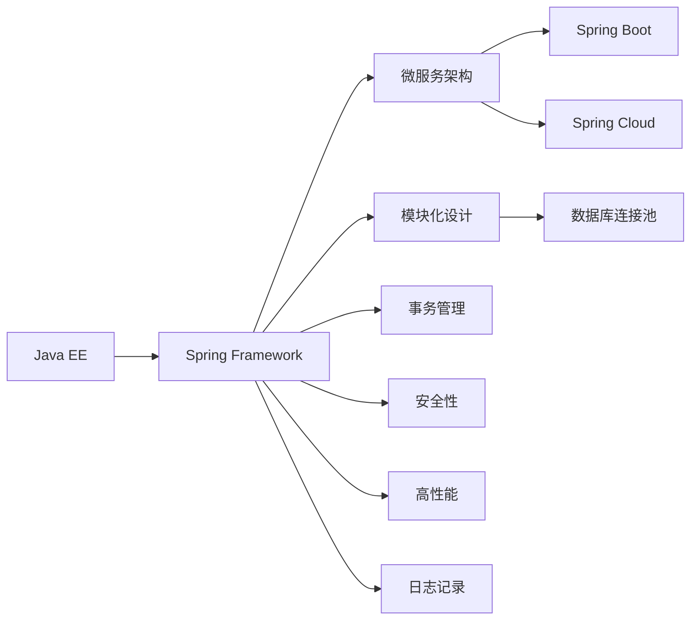

                 

# Java 企业级开发：Spring Framework 和 Java EE

> 关键词：Spring Framework, Java EE, 企业级应用, 微服务架构, 模块化设计, 数据库连接池, 事务管理, 安全性, 高性能, 日志记录

## 1. 背景介绍

### 1.1 问题由来
在现代企业级开发中，Java 平台以其稳定性和可扩展性一直占据着重要地位。而 Java 平台的核心是 Java EE（Java Platform, Enterprise Edition），它提供了一系列的规范和 API，用于开发高性能、可伸缩的企业级应用。其中，Spring Framework 是最为重要的开发框架之一，它基于 Java EE 规范，提供了一套强大的工具和组件，帮助开发者快速构建复杂的企业级应用。

随着微服务架构的兴起，Java EE 和 Spring Framework 也逐渐向微服务化转变。Spring Boot 和 Spring Cloud 作为 Spring Framework 的子项目，进一步简化了微服务的开发和部署流程。因此，深入理解 Java EE 和 Spring Framework，对于构建高质量的企业级应用至关重要。

### 1.2 问题核心关键点
本文将深入探讨 Java EE 和 Spring Framework 的核心概念及其内在联系。通过具体案例和示例，将帮助读者全面掌握微服务架构下企业级应用开发的实战技能，并理解如何在Java EE 和 Spring Framework 的帮助下实现高性能、可伸缩、可维护的企业级应用。

## 2. 核心概念与联系

### 2.1 核心概念概述

为了更好地理解 Java EE 和 Spring Framework，本节将介绍几个关键概念：

- **Java EE（Java Platform, Enterprise Edition）**：Java EE 是一种平台，提供了一系列的规范和 API，用于开发高性能、可伸缩的企业级应用。它包括 Java Servlet、JavaServer Pages、Enterprise JavaBeans 等组件，支持Web 服务、消息队列、分布式事务、安全认证等功能。
- **Spring Framework**：Spring Framework 是一个开源的 Java 应用程序框架，用于构建企业级应用。它基于 Java EE 规范，提供了依赖注入、控制反转、面向切面编程、数据访问、事务管理、安全管理等功能。
- **微服务架构**：微服务架构是一种设计思想，将应用拆分成一组小型、自治的服务，每个服务独立部署、独立运行。这种架构有助于提高应用的灵活性和可维护性，但也增加了系统复杂性。
- **Spring Boot**：Spring Boot 是 Spring Framework 的一个子项目，提供了“一键启动”（just-in-pieces）的功能，简化了Spring应用的开发和部署过程。
- **Spring Cloud**：Spring Cloud 是 Spring Framework 的另一个子项目，提供了微服务架构所需的工具和组件，包括服务发现、配置管理、服务治理、负载均衡等功能。
- **模块化设计**：模块化设计是将应用拆分成若干独立的模块，每个模块独立开发、独立部署。这种设计有助于提高应用的灵活性和可维护性，但也需要考虑模块之间的依赖和通信。
- **数据库连接池**：数据库连接池是一组预先创建的连接对象，用于管理和复用数据库连接，减少连接创建和销毁的开销，提高系统的性能和可伸缩性。
- **事务管理**：事务管理是管理数据库操作的过程，确保数据库操作的原子性、一致性、隔离性和持久性。Spring Framework 提供了一系列的组件，用于简化事务的管理。
- **安全性**：安全性是保障应用和数据安全的重要措施，包括认证、授权、加密、审计等。Spring Framework 提供了丰富的安全组件，帮助开发者构建安全的应用。
- **高性能**：高性能是保证应用运行效率的关键，包括优化代码、使用缓存、减少不必要的计算等。Spring Framework 提供了多种优化技术，帮助开发者实现高性能的应用。
- **日志记录**：日志记录是记录应用运行过程的重要手段，有助于故障排查和性能优化。Spring Framework 提供了丰富的日志组件，帮助开发者实现高效的日志记录。

这些核心概念之间具有密切的联系，它们共同构成了 Java EE 和 Spring Framework 的开发框架。通过理解这些概念及其相互关系，我们可以更好地掌握企业级应用的开发技能。

### 2.2 核心概念原理和架构的 Mermaid 流程图

以下是Java EE 和 Spring Framework 核心概念的 Mermaid 流程图，展示了这些概念之间的内在联系：



### 2.3 核心概念关系解释

从上述 Mermaid 图中可以看出，Java EE 和 Spring Framework 之间具有紧密的联系。Spring Framework 是基于 Java EE 规范的开发框架，它提供了许多符合 Java EE 规范的功能组件。同时，Spring Framework 还引入了新的概念，如微服务架构、Spring Boot 和 Spring Cloud，进一步简化了企业级应用的开发和部署流程。这些概念相互配合，共同构建了企业级应用的开发框架。

## 3. 核心算法原理 & 具体操作步骤

### 3.1 算法原理概述

在微服务架构下，企业级应用通常被拆分成一组小型、自治的服务，每个服务独立部署、独立运行。这种架构有助于提高应用的灵活性和可维护性，但也增加了系统复杂性。为了简化微服务架构的开发和部署流程，Spring Framework 引入了 Spring Boot 和 Spring Cloud，提供了“一键启动”（just-in-pieces）的功能，简化了微服务的开发和部署过程。

Spring Boot 提供了“一键启动”的功能，使得开发者可以通过简单的配置文件和依赖库，快速启动一个完整的 Spring 应用。而 Spring Cloud 则提供了微服务架构所需的工具和组件，包括服务发现、配置管理、服务治理、负载均衡等功能，帮助开发者构建高性能、可伸缩、可维护的微服务应用。

### 3.2 算法步骤详解

在微服务架构下，Spring Framework 的开发和部署流程通常包括以下几个关键步骤：

**Step 1: 设计服务结构**

在微服务架构中，首先需要将应用拆分成若干个独立的服务，每个服务负责独立的功能模块。例如，一个电商应用可以拆分为用户服务、商品服务、订单服务等。每个服务独立部署、独立运行，通过网络通信协作完成整个应用的功能。

**Step 2: 配置Spring Boot应用**

Spring Boot 提供了“一键启动”的功能，使得开发者可以通过简单的配置文件和依赖库，快速启动一个完整的 Spring 应用。在 Spring Boot 中，可以使用 application.properties 或 application.yml 配置文件，指定应用的依赖库、端口、环境等配置项。

**Step 3: 使用Spring Cloud组件**

Spring Cloud 提供了微服务架构所需的工具和组件，包括服务发现、配置管理、服务治理、负载均衡等功能。例如，可以使用 Spring Cloud Netflix Eureka 实现服务发现，使用 Spring Cloud Config 实现配置管理，使用 Spring Cloud Zookeeper 实现服务治理，使用 Spring Cloud Ribbon 实现负载均衡等。

**Step 4: 实现微服务通信**

在微服务架构中，服务之间需要通过网络通信协作完成整个应用的功能。Spring Cloud 提供了多种通信方式，包括 REST、gRPC、RabbitMQ 等。通过这些方式，可以实现服务的请求和响应。

**Step 5: 实现分布式事务管理**

在微服务架构中，分布式事务管理是确保数据一致性的关键。Spring Framework 提供了多种分布式事务管理组件，如 Spring Cloud Netflix Hystrix、Apache Feign、Consul 等。这些组件可以帮助开发者实现分布式事务管理。

**Step 6: 实现安全性**

在微服务架构中，安全性是保障应用和数据安全的重要措施。Spring Framework 提供了丰富的安全组件，如 Spring Security、OAuth2、JWT 等。通过这些组件，可以实现认证、授权、加密、审计等安全措施。

**Step 7: 实现高性能**

在微服务架构中，高性能是保证应用运行效率的关键。Spring Framework 提供了多种优化技术，如缓存、异步处理、负载均衡、数据库连接池等。这些技术可以帮助开发者实现高性能的应用。

**Step 8: 实现日志记录**

在微服务架构中，日志记录是记录应用运行过程的重要手段。Spring Framework 提供了丰富的日志组件，如 Logback、SLF4J 等。通过这些组件，可以实现高效的日志记录。

### 3.3 算法优缺点

Spring Framework 和 Java EE 在开发和部署企业级应用时具有以下优点：

- **灵活性高**：Spring Framework 提供了灵活的设计和配置，可以帮助开发者快速构建复杂的应用。Spring Cloud 则提供了丰富的组件，支持微服务架构的开发和部署。
- **可扩展性强**：Spring Framework 和 Java EE 支持多种技术栈，可以与各种数据库、消息队列、缓存等技术进行集成。同时，Spring Cloud 提供了多种服务治理组件，支持负载均衡、故障转移、熔断器等功能。
- **安全性高**：Spring Framework 提供了丰富的安全组件，如 Spring Security、OAuth2、JWT 等，可以帮助开发者构建安全的应用。
- **高性能**：Spring Framework 提供了多种优化技术，如缓存、异步处理、负载均衡、数据库连接池等，可以帮助开发者实现高性能的应用。
- **可维护性好**：Spring Framework 和 Java EE 提供了一系列的组件和规范，可以帮助开发者构建可维护性高的应用。同时，Spring Cloud 提供了丰富的工具和组件，支持微服务架构的开发和部署。

同时，这些框架也存在一些缺点：

- **学习成本高**：Spring Framework 和 Java EE 组件繁多，学习成本较高。需要花费大量时间理解其设计和实现原理。
- **配置复杂**：Spring Framework 和 Java EE 配置复杂，需要花费大量时间进行配置。特别是微服务架构的开发和部署，需要配置多种组件和参数。
- **性能问题**：Spring Framework 和 Java EE 组件较多，性能问题需要特别注意。需要优化代码、使用缓存、减少不必要的计算等。
- **安全性问题**：Spring Framework 和 Java EE 安全性较高，但需要特别注意安全组件的配置和使用方法。

### 3.4 算法应用领域

Spring Framework 和 Java EE 广泛应用于各种企业级应用开发，包括电商、金融、医疗、教育等。以下是一些典型的应用场景：

- **电商应用**：电商应用通常需要处理大量的订单、库存、用户数据等。Spring Framework 和 Java EE 提供了多种组件，如 Spring Boot、Spring Cloud、Spring Security 等，帮助开发者构建高性能、可伸缩、安全的电商应用。
- **金融应用**：金融应用需要处理大量的交易、风险管理、用户认证等。Spring Framework 和 Java EE 提供了多种组件，如 Spring Cloud、Spring Security、Spring Data 等，帮助开发者构建高性能、可伸缩、安全的金融应用。
- **医疗应用**：医疗应用需要处理大量的患者数据、医疗记录等。Spring Framework 和 Java EE 提供了多种组件，如 Spring Boot、Spring Cloud、Spring Security 等，帮助开发者构建高性能、可伸缩、安全的医疗应用。
- **教育应用**：教育应用需要处理大量的课程、学生、考试等数据。Spring Framework 和 Java EE 提供了多种组件，如 Spring Boot、Spring Cloud、Spring Security 等，帮助开发者构建高性能、可伸缩、安全的教育应用。

## 4. 数学模型和公式 & 详细讲解 & 举例说明

### 4.1 数学模型构建

在微服务架构下，企业级应用的开发和部署需要考虑多个方面的因素，包括服务设计、配置管理、服务治理、安全性、高性能、日志记录等。以下是一些常见的数学模型：

- **服务设计模型**：用于描述微服务架构的设计和结构。可以使用 UML 图、服务流程图等工具进行建模。
- **配置管理模型**：用于描述应用的配置项和管理方式。可以使用配置文件、配置中心等工具进行管理。
- **服务治理模型**：用于描述服务发现、配置管理、服务治理等功能。可以使用服务注册中心、配置中心等工具进行管理。
- **安全性模型**：用于描述认证、授权、加密、审计等功能。可以使用 Spring Security、OAuth2、JWT 等组件进行管理。
- **高性能模型**：用于描述缓存、异步处理、负载均衡等功能。可以使用缓存组件、异步组件、负载均衡组件等进行管理。
- **日志记录模型**：用于描述日志的记录、存储、分析等功能。可以使用 Logback、SLF4J 等组件进行管理。

### 4.2 公式推导过程

以下以服务治理模型为例，推导分布式事务管理的数学模型。

假设在微服务架构中，有多个服务参与，每个服务都有自己的事务管理器。当多个服务需要协作完成一个事务时，需要协调各个服务的事务管理器，确保整个事务的原子性、一致性、隔离性和持久性。

设 $T_1$ 为服务 $S_1$ 的事务管理器，$T_2$ 为服务 $S_2$ 的事务管理器，$T$ 为整个事务管理器。事务协调过程可以分为以下几个步骤：

1. 服务 $S_1$ 开始事务 $T_1$，并向 $T$ 注册事务。
2. 服务 $S_2$ 开始事务 $T_2$，并向 $T$ 注册事务。
3. 服务 $S_1$ 完成事务 $T_1$，并向 $T$ 提交事务。
4. 服务 $S_2$ 完成事务 $T_2$，并向 $T$ 提交事务。
5. $T$ 检查所有注册的事务，确保所有服务的事务状态一致，如果所有事务状态一致，则提交整个事务；否则，回滚整个事务。

在上述过程中，$T$ 需要记录每个服务的事务状态，并协调各个服务的事务管理器，确保整个事务的原子性、一致性、隔离性和持久性。可以使用两阶段提交（Two-Phase Commit）算法实现分布式事务管理。

### 4.3 案例分析与讲解

假设一个电商应用中，订单服务和库存服务需要协作完成一个事务。订单服务提交订单后，需要更新库存服务的库存数量。如果库存服务更新失败，订单服务需要回滚订单。

在Spring Cloud Netflix Hystrix 中，可以通过以下代码实现分布式事务管理：

```java
@Component
public class OrderService {

    @Autowired
    private InventoryService inventoryService;

    public void order(String itemId) {
        // 提交订单
        Order order = new Order(itemId);
        orderService.save(order);

        // 更新库存
        inventoryService.updateStock(itemId, order.getQuantity());
    }
}
```

在Spring Cloud Netflix Eureka 中，可以通过以下代码实现服务发现：

```java
@Component
public class InventoryService {

    @Autowired
    private RestTemplate restTemplate;

    public void updateStock(String itemId, int quantity) {
        // 调用库存服务更新库存
        ResponseEntity<String> response = restTemplate.postForEntity("/inventory/update", null, String.class);
        // 处理响应
    }
}
```

在Spring Cloud Config 中，可以通过以下代码实现配置管理：

```java
@Component
public class OrderService {

    @Autowired
    private RestTemplate restTemplate;

    @Value("${inventory.service.url}")
    private String inventoryServiceUrl;

    public void order(String itemId) {
        // 调用库存服务更新库存
        ResponseEntity<String> response = restTemplate.postForEntity(inventoryServiceUrl + "/update", null, String.class);
        // 处理响应
    }
}
```

通过Spring Boot和Spring Cloud，可以方便地实现微服务架构下的企业级应用开发和部署。这些组件和工具的灵活使用，使得开发者可以快速构建高性能、可伸缩、可维护的应用。

## 5. 项目实践：代码实例和详细解释说明

### 5.1 开发环境搭建

在进行微服务架构下企业级应用的开发和部署时，需要搭建相应的开发环境。以下是Java EE 和 Spring Framework 的开发环境配置流程：

1. 安装 Java Development Kit（JDK）：从官网下载并安装 JDK，用于编写和运行 Java 代码。
2. 安装 Maven：从官网下载并安装 Maven，用于管理项目的依赖库和构建工具。
3. 创建 Spring 应用：使用 Spring Initializr 创建 Spring 应用，可以根据需要添加依赖库和组件。
4. 配置 Spring Cloud：在项目中添加 Spring Cloud Starter 依赖库，配置 Spring Cloud 组件。

### 5.2 源代码详细实现

以下是一个简单的微服务架构下电商应用的代码实现：

1. 订单服务：

```java
@Component
public class OrderService {

    @Autowired
    private InventoryService inventoryService;

    public void order(String itemId) {
        // 提交订单
        Order order = new Order(itemId);
        orderService.save(order);

        // 更新库存
        inventoryService.updateStock(itemId, order.getQuantity());
    }
}
```

2. 库存服务：

```java
@Component
public class InventoryService {

    @Autowired
    private RestTemplate restTemplate;

    public void updateStock(String itemId, int quantity) {
        // 调用库存服务更新库存
        ResponseEntity<String> response = restTemplate.postForEntity("/inventory/update", null, String.class);
        // 处理响应
    }
}
```

3. 配置文件：

```properties
spring.application.name=order-service
spring.application.instance-id=${spring.application.instance-id:-${PID}}
spring.profiles.active=dev
spring.cloud.config.server.uri=http://config-server:8500
spring.cloud.netflix.eureka.instance.id=${spring.application.instance-id:-${PID}}
spring.cloud.netflix.eureka.instance.value=${spring.application.name}-${spring.application.instance-id:-${PID}}
spring.cloud.netflix.eureka.instance.instance-id=${spring.application.instance-id:-${PID}}
spring.cloud.netflix.eureka.instance.host-name=${spring.application.instance-id:-${PID}}
spring.cloud.netflix.eureka.instance.port=${spring.application.instance-id:-${PID}}
spring.cloud.netflix.eureka.instance.context-id=${spring.application.instance-id:-${PID}}
```

4. 配置 Spring Cloud Config 中心：

```java
@SpringBootApplication
@EnableDiscoveryClient
public class ConfigServerApplication {

    public static void main(String[] args) {
        SpringApplication.run(ConfigServerApplication.class, args);
    }
}
```

5. 配置 Spring Cloud Eureka 服务：

```java
@SpringBootApplication
@EnableDiscoveryServer
public class EurekaServerApplication {

    public static void main(String[] args) {
        SpringApplication.run(EurekaServerApplication.class, args);
    }
}
```

### 5.3 代码解读与分析

在上述代码中，订单服务和库存服务通过 Spring Cloud Netflix Eureka 进行服务发现和注册。订单服务调用库存服务更新库存时，可以通过 RestTemplate 进行远程调用。Spring Cloud Config 配置管理中心将配置信息动态加载到每个服务中，使得服务能够动态获取配置信息。

通过 Spring Boot 和 Spring Cloud，可以方便地实现微服务架构下的企业级应用开发和部署。这些组件和工具的灵活使用，使得开发者可以快速构建高性能、可伸缩、可维护的应用。

### 5.4 运行结果展示

运行上述代码，订单服务成功提交订单，并更新库存服务的库存数量。在 Spring Cloud Config 配置管理中心中，可以查看配置信息的加载情况。

## 6. 实际应用场景

### 6.1 智能医疗系统

在智能医疗系统中，微服务架构可以快速构建高性能、可伸缩、安全的医疗应用。例如，可以通过 Spring Framework 和 Java EE 开发患者管理、医生管理、病历管理、药品管理等服务，通过 Spring Cloud 实现服务发现和配置管理，确保系统的稳定性和安全性。

### 6.2 金融风控系统

在金融风控系统中，微服务架构可以快速构建高性能、可伸缩、安全的金融应用。例如，可以通过 Spring Framework 和 Java EE 开发用户管理、账户管理、交易管理、风控管理等服务，通过 Spring Cloud 实现服务发现和配置管理，确保系统的稳定性和安全性。

### 6.3 教育应用

在教育应用中，微服务架构可以快速构建高性能、可伸缩、安全的教育应用。例如，可以通过 Spring Framework 和 Java EE 开发课程管理、学生管理、考试管理、教学管理等服务，通过 Spring Cloud 实现服务发现和配置管理，确保系统的稳定性和安全性。

### 6.4 未来应用展望

随着微服务架构和 Spring Framework 的不断发展，企业级应用的开发和部署将更加灵活和高效。未来，在微服务架构下，企业级应用将更加注重分布式事务管理、安全性、高性能和日志记录等方面。同时，云计算和容器化技术的应用，将进一步简化企业级应用的开发和部署流程，提升应用的灵活性和可维护性。

## 7. 工具和资源推荐

### 7.1 学习资源推荐

为了帮助开发者系统掌握 Java EE 和 Spring Framework 的开发技能，以下是一些优质的学习资源：

1. 《Spring in Action》：这本书是 Spring Framework 的经典教材，涵盖了 Spring 框架的各个方面，适合初学者和进阶开发者阅读。
2. 《Java EE 7核心开发》：这本书介绍了 Java EE 7 的各个组件和规范，适合 Java EE 的开发者阅读。
3. 《Spring Cloud》：这本书介绍了 Spring Cloud 的各个组件和工具，适合 Spring Cloud 的开发者阅读。
4. 《Spring Boot in Action》：这本书介绍了 Spring Boot 的各个组件和功能，适合 Spring Boot 的开发者阅读。
5. 《Java 编程思想》：这本书是 Java 编程的经典教材，介绍了 Java 语言的核心概念和设计模式，适合 Java 开发者阅读。

### 7.2 开发工具推荐

为了提高 Java EE 和 Spring Framework 的开发效率，以下是一些常用的开发工具：

1. IntelliJ IDEA：这是一个功能强大的 Java 开发工具，支持 Spring Framework 和 Java EE 的开发和调试。
2. Eclipse：这是一个开源的 Java 开发工具，支持 Spring Framework 和 Java EE 的开发和调试。
3. Visual Studio Code：这是一个轻量级的开发工具，支持 Spring Framework 和 Java EE 的开发和调试。
4. Git：这是一个版本控制系统，用于管理代码的变更和协作开发。
5. Jenkins：这是一个持续集成工具，用于自动化构建和部署 Java 应用。
6. Docker：这是一个容器化平台，用于管理和运行 Java 应用。

### 7.3 相关论文推荐

Java EE 和 Spring Framework 的发展源于学界的持续研究。以下是几篇奠基性的相关论文，推荐阅读：

1. "Spring in Action" by Craig Walls：介绍了 Spring Framework 的各个组件和功能，是 Spring Framework 的权威教程。
2. "Java EE 7 Core Concepts" by Jason Mariotti：介绍了 Java EE 7 的各个组件和规范，是 Java EE 的权威教程。
3. "Spring Cloud: Harnessing Cloud Platforms by Programming to an API" by Michael Minella：介绍了 Spring Cloud 的各个组件和工具，是 Spring Cloud 的权威教程。
4. "Spring Boot in Action" by Craig Walls：介绍了 Spring Boot 的各个组件和功能，是 Spring Boot 的权威教程。
5. "Java Platform, Enterprise Edition" by Rex Ebersole, Chady Rekhi, and Kris DeBCompute, Inc.: 介绍了 Java EE 的各个组件和规范，是 Java EE 的权威教程。

这些论文代表了大语言模型微调技术的发展脉络。通过学习这些前沿成果，可以帮助研究者把握学科前进方向，激发更多的创新灵感。

## 8. 总结：未来发展趋势与挑战

### 8.1 总结

本文对 Java EE 和 Spring Framework 的核心概念及其内在联系进行了全面系统的介绍。通过具体案例和示例，展示了微服务架构下企业级应用开发的实战技能，并理解了如何在Java EE 和 Spring Framework 的帮助下实现高性能、可伸缩、可维护的企业级应用。

通过本文的系统梳理，可以看到，Java EE 和 Spring Framework 是企业级应用开发的重要工具，能够帮助开发者快速构建高质量的企业级应用。未来，随着微服务架构和 Spring Framework 的不断发展，企业级应用的开发和部署将更加灵活和高效。

### 8.2 未来发展趋势

展望未来，Java EE 和 Spring Framework 的发展趋势如下：

1. **微服务架构的普及**：微服务架构已经成为企业级应用开发的重要趋势。随着 Spring Cloud 的不断发展，微服务架构的应用将更加广泛。
2. **容器化技术的普及**：容器化技术已经成为应用程序开发的重要趋势。随着 Docker 和 Kubernetes 的普及，Java EE 和 Spring Framework 将更好地支持容器化部署。
3. **云计算的普及**：云计算已经成为应用程序开发的重要趋势。随着云平台和云服务的发展，Java EE 和 Spring Framework 将更好地支持云计算平台。
4. **人工智能和机器学习的普及**：人工智能和机器学习已经成为应用程序开发的重要趋势。随着 AI 技术的普及，Java EE 和 Spring Framework 将更好地支持 AI 技术的应用。
5. **安全性**：安全性是企业级应用开发的重要需求。随着 Spring Security 的不断发展，Java EE 和 Spring Framework 将更好地支持安全性需求。
6. **高性能**：高性能是企业级应用开发的重要需求。随着缓存、异步处理等技术的普及，Java EE 和 Spring Framework 将更好地支持高性能需求。
7. **日志记录**：日志记录是企业级应用开发的重要需求。随着日志组件的不断发展，Java EE 和 Spring Framework 将更好地支持日志记录需求。

### 8.3 面临的挑战

尽管 Java EE 和 Spring Framework 在企业级应用开发中发挥了重要作用，但在迈向更加智能化、普适化应用的过程中，它仍面临着诸多挑战：

1. **学习成本高**：Java EE 和 Spring Framework 组件繁多，学习成本较高。需要花费大量时间理解其设计和实现原理。
2. **配置复杂**：Java EE 和 Spring Framework 配置复杂，需要花费大量时间进行配置。特别是微服务架构的开发和部署，需要配置多种组件和参数。
3. **性能问题**：Java EE 和 Spring Framework 组件较多，性能问题需要特别注意。需要优化代码、使用缓存、减少不必要的计算等。
4. **安全性问题**：Java EE 和 Spring Framework 安全性较高，但需要特别注意安全组件的配置和使用方法。
5. **兼容性问题**：Java EE 和 Spring Framework 组件较多，兼容性问题需要特别注意。需要保持各个组件的兼容性和协调性。
6. **资源消耗高**：Java EE 和 Spring Framework 组件较多，资源消耗较高。需要优化资源使用，减少不必要的资源消耗。

### 8.4 研究展望

面对 Java EE 和 Spring Framework 面临的挑战，未来的研究需要在以下几个方面寻求新的突破：

1. **简化配置和开发**：简化 Java EE 和 Spring Framework 的配置和开发，减少配置和开发成本，提高开发效率。
2. **提高性能**：优化 Java EE 和 Spring Framework 的性能，减少不必要的资源消耗，提高应用的性能和可伸缩性。
3. **增强安全性**：增强 Spring Security 的安全性，提供更多的安全组件和工具，保障应用和数据的安全性。
4. **支持多语言和跨平台**：支持多种编程语言和跨平台开发，提供统一的开发框架和工具。
5. **支持微服务和容器化**：支持微服务架构和容器化部署，提供更多的容器化工具和组件。
6. **支持人工智能和机器学习**：支持人工智能和机器学习技术的应用，提供更多的 AI 组件和工具。
7. **支持云计算和分布式**：支持云计算和分布式部署，提供更多的云平台和云服务支持。

通过在这些方面进行深入研究，Java EE 和 Spring Framework 将更好地支持企业级应用开发，提升应用的灵活性和可维护性，构建更加稳定、高效、可伸缩的应用。

## 9. 附录：常见问题与解答

**Q1：如何选择合适的学习资源？**

A: 选择学习资源时，需要根据自己的需求和水平选择合适的教程。对于初学者，可以选择《Spring in Action》和《Java EE 7 Core Concepts》等基础教程。对于进阶开发者，可以选择《Spring Cloud》和《Spring Boot in Action》等高级教程。此外，可以关注 Spring 官方文档和博客，获取最新的开发信息和最佳实践。

**Q2：如何进行代码优化？**

A: 代码优化是提升应用性能的重要手段。可以通过缓存、异步处理、数据库连接池、负载均衡等技术进行优化。同时，可以使用 Spring Boot 和 Spring Cloud 提供的优化组件，如 Spring Cache、Spring WebFlux、Spring Data JPA 等，提升应用的性能和可伸缩性。

**Q3：如何进行测试和调试？**

A: 测试和调试是确保应用质量的重要手段。可以使用 JUnit、Mockito 等工具进行单元测试和集成测试。同时，可以使用 Spring Boot 和 Spring Cloud 提供的调试工具，如 Spring Boot Actuator、Spring Cloud Sleuth 等，进行应用的监控和调试。

**Q4：如何进行安全性设计？**

A: 安全性设计是保障应用和数据安全的重要手段。可以使用 Spring Security、OAuth2、JWT 等组件进行安全性设计。同时，需要关注数据加密、访问控制、审计日志等安全措施，保障应用和数据的安全性。

**Q5：如何进行性能优化？**

A: 性能优化是提升应用运行效率的重要手段。可以使用缓存、异步处理、数据库连接池、负载均衡等技术进行优化。同时，可以使用 Spring Cache、Spring WebFlux、Spring Data JPA 等组件，提升应用的性能和可伸缩性。

通过上述学习资源和实践指导，相信读者可以全面掌握 Java EE 和 Spring Framework 的开发技能，构建高性能、可伸缩、可维护的企业级应用。同时，通过深入研究未来发展趋势和面临的挑战，可以更好地把握 Java EE 和 Spring Framework 的发展方向，推动企业级应用的不断进步。

