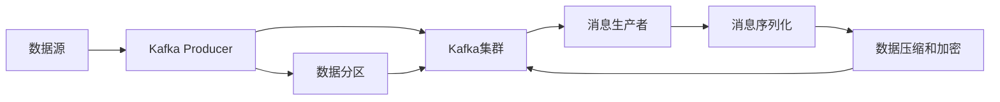

                 

## 1. 背景介绍

Kafka是一个开源的分布式流处理平台，它由Apache软件基金会维护，是Hadoop生态系统的重要组成部分。Kafka Producer是Kafka生态系统中重要的组成部分，它负责将数据消息发送给Kafka集群，以便进一步处理和分析。Kafka Producer已经被广泛应用于数据流处理、实时数据传输、事件驱动系统等多个领域。

### 1.1 问题由来

在实际的开发过程中，我们需要将数据从不同的系统、不同的源中实时地传输到Kafka集群中进行处理。然而，直接将数据传输到Kafka集群中可能会遇到诸如数据格式不统一、数据量过大、传输速度慢等挑战。因此，我们需要一种机制来帮助我们有效地将数据传输到Kafka集群中。这就是Kafka Producer的核心功能。

### 1.2 问题核心关键点

Kafka Producer的关键点包括以下几个方面：

- 数据格式转换：Kafka Producer需要能够处理来自不同系统的数据，并将其转换为Kafka集群能够接受的格式。
- 数据批量传输：Kafka Producer需要将大量数据批量传输到Kafka集群中，以提高传输效率。
- 数据分片和重试机制：Kafka Producer需要将数据分片发送到Kafka集群中的多个分区中，并在数据传输失败时进行重试，以保证数据的高可用性和可靠性。
- 数据压缩和加密：Kafka Producer需要支持数据压缩和加密，以提高数据传输的效率和安全性。

这些关键点决定了Kafka Producer在Kafka生态系统中的重要地位。

## 2. 核心概念与联系

### 2.1 核心概念概述

以下是Kafka Producer中涉及的一些核心概念：

- Kafka Producer：Kafka Producer是将数据消息发送到Kafka集群中的客户端。它负责将数据消息转换为Kafka集群能够接受的格式，并保证数据的高可用性和可靠性。
- 数据分区：Kafka集群中的每个主题会被划分为多个分区，每个分区都有唯一的编号。Kafka Producer需要将数据消息发送到指定的分区中。
- 消息生产者：消息生产者是指将数据消息发送到Kafka集群中的客户端。消息生产者可以使用Java、Python、C++等语言实现。
- 消息序列化：消息序列化是指将数据消息转换为Kafka集群能够接受的格式。Kafka集群使用二进制序列化协议来处理消息。
- 数据压缩和加密：Kafka Producer需要支持数据压缩和加密，以提高数据传输的效率和安全性。

### 2.2 核心概念原理和架构的 Mermaid 流程图(Mermaid 流程节点中不要有括号、逗号等特殊字符)



## 3. 核心算法原理 & 具体操作步骤

### 3.1 算法原理概述

Kafka Producer的核心算法原理包括数据分区、消息序列化、数据压缩和加密等。以下是Kafka Producer的算法原理概述：

- 数据分区：Kafka Producer需要将数据消息发送到指定的分区中，以便Kafka集群能够对其进行并行处理。
- 消息序列化：Kafka Producer需要将数据消息转换为Kafka集群能够接受的格式，通常使用二进制序列化协议。
- 数据压缩和加密：Kafka Producer需要支持数据压缩和加密，以提高数据传输的效率和安全性。

### 3.2 算法步骤详解

以下是Kafka Producer的算法步骤详解：

1. 连接Kafka集群：Kafka Producer需要连接到Kafka集群，以便将数据消息发送到Kafka集群中进行处理。
2. 创建消息生产者：Kafka Producer需要创建消息生产者对象，以便将数据消息发送到Kafka集群中。
3. 配置消息生产者：Kafka Producer需要配置消息生产者对象，以便指定主题、分区、批量大小等参数。
4. 发送消息：Kafka Producer需要将数据消息发送到Kafka集群中，以便进行并行处理。
5. 关闭消息生产者：Kafka Producer需要在完成数据消息的发送后关闭消息生产者对象，以便释放资源。

### 3.3 算法优缺点

Kafka Producer具有以下优点：

- 数据分区：Kafka Producer能够将数据消息均匀地分发到Kafka集群中的各个分区中，以便进行并行处理。
- 消息序列化：Kafka Producer能够将数据消息转换为Kafka集群能够接受的格式，以便进行高效处理。
- 数据压缩和加密：Kafka Producer能够支持数据压缩和加密，以提高数据传输的效率和安全性。

同时，Kafka Producer也存在以下缺点：

- 数据传输效率：Kafka Producer在数据传输过程中，需要进行序列化、压缩、加密等操作，这些操作可能会影响数据传输效率。
- 资源消耗：Kafka Producer在运行过程中需要占用一定的资源，如CPU、内存等，可能会导致系统资源消耗过大。
- 性能瓶颈：Kafka Producer在数据传输过程中，可能会遇到性能瓶颈，如网络带宽不足、服务器性能低等。

### 3.4 算法应用领域

Kafka Producer在以下几个领域中得到了广泛应用：

- 数据流处理：Kafka Producer能够将数据消息发送到Kafka集群中进行处理，以便进行实时数据流处理。
- 实时数据传输：Kafka Producer能够将数据消息实时地传输到Kafka集群中，以便进行实时数据传输。
- 事件驱动系统：Kafka Producer能够将事件数据发送到Kafka集群中，以便进行事件驱动系统开发。
- 分布式系统：Kafka Producer能够将数据消息发送到Kafka集群中，以便进行分布式系统开发。

## 4. 数学模型和公式 & 详细讲解 & 举例说明

### 4.1 数学模型构建

Kafka Producer的数学模型构建主要包括以下几个方面：

- 数据分区模型：Kafka Producer需要将数据消息均匀地分发到Kafka集群中的各个分区中，以便进行并行处理。
- 消息序列化模型：Kafka Producer需要将数据消息转换为Kafka集群能够接受的格式，通常使用二进制序列化协议。
- 数据压缩和加密模型：Kafka Producer需要支持数据压缩和加密，以提高数据传输的效率和安全性。

### 4.2 公式推导过程

以下是Kafka Producer的数学公式推导过程：

1. 数据分区模型

Kafka集群中的每个主题会被划分为多个分区，每个分区都有唯一的编号。假设Kafka集群中有M个分区，则可以将数据消息均匀地分发到这些分区中。设数据消息总数为N，则每个分区接收到的数据消息数为：

$$
\frac{N}{M}
$$

2. 消息序列化模型

Kafka集群使用二进制序列化协议来处理消息。假设数据消息大小为L，则消息序列化后的长度为：

$$
L' = L \times c
$$

其中，c为压缩比。

3. 数据压缩和加密模型

假设数据消息大小为L，压缩后的消息大小为L'，则压缩比为：

$$
c = \frac{L'}{L}
$$

假设数据传输速率為R，则数据传输所需时间为：

$$
T = \frac{L'}{R}
$$

### 4.3 案例分析与讲解

假设Kafka集群中有4个分区，每个分区的大小为1G，数据消息大小为10M，消息序列化后的长度为1.2M。假设压缩比为0.8，则每个分区的实际传输量为：

$$
\frac{1.2M \times 4}{1} = 4.8M
$$

假设数据传输速率为100Mbps，则数据传输所需时间为：

$$
\frac{4.8M}{100Mbps} = 0.048s
$$

## 5. 项目实践：代码实例和详细解释说明

### 5.1 开发环境搭建

在开发Kafka Producer之前，需要先搭建好Kafka集群。以下是搭建Kafka集群的流程：

1. 安装Kafka：从官网下载Kafka安装包，并解压到指定目录。
2. 启动Zookeeper：在Kafka安装包中，启动Zookeeper服务器。
3. 启动Kafka服务器：在Kafka安装包中，启动Kafka服务器。

### 5.2 源代码详细实现

以下是Kafka Producer的源代码详细实现：

```java
public class KafkaProducer {
    private Properties properties;
    private KafkaProducer kafkaProducer;

    public KafkaProducer(Properties properties) {
        this.properties = properties;
        this.kafkaProducer = new KafkaProducer(properties);
    }

    public void send(String topic, byte[] message) {
        ProducerRecord<byte[], byte[]> producerRecord = new ProducerRecord<>(topic, message);
        this.kafkaProducer.send(producerRecord);
    }

    public void close() {
        this.kafkaProducer.close();
    }
}
```

### 5.3 代码解读与分析

以下是Kafka Producer代码的详细解读与分析：

1. `KafkaProducer`类：该类是Kafka Producer的主要实现类，负责将数据消息发送到Kafka集群中。
2. `Properties`类：该类用于配置Kafka Producer的参数，如主题、分区、批量大小等。
3. `send`方法：该方法用于将数据消息发送到Kafka集群中。
4. `close`方法：该方法用于关闭Kafka Producer，释放资源。

## 6. 实际应用场景

### 6.1 智能客服系统

Kafka Producer可以在智能客服系统中用于处理客户咨询信息。智能客服系统需要实时地将客户咨询信息发送到Kafka集群中，以便进行实时数据流处理。通过Kafka Producer，智能客服系统可以将客户咨询信息进行数据分区、消息序列化和数据压缩，以便高效地处理和分析。

### 6.2 金融舆情监测

Kafka Producer可以在金融舆情监测系统中用于处理金融市场数据。金融舆情监测系统需要实时地将金融市场数据发送到Kafka集群中，以便进行实时数据流处理。通过Kafka Producer，金融舆情监测系统可以将金融市场数据进行数据分区、消息序列化和数据压缩，以便高效地处理和分析。

### 6.3 个性化推荐系统

Kafka Producer可以在个性化推荐系统中用于处理用户行为数据。个性化推荐系统需要实时地将用户行为数据发送到Kafka集群中，以便进行实时数据流处理。通过Kafka Producer，个性化推荐系统可以将用户行为数据进行数据分区、消息序列化和数据压缩，以便高效地处理和分析。

### 6.4 未来应用展望

未来，Kafka Producer的应用领域将进一步扩大。除了上述几个领域，Kafka Producer还将在物联网、工业互联网、车联网等领域中得到广泛应用。随着物联网设备的普及和工业互联网的发展，大量的数据需要实时地传输到Kafka集群中进行处理和分析。通过Kafka Producer，这些数据可以高效地进行数据分区、消息序列化和数据压缩，以便进行实时数据流处理。

## 7. 工具和资源推荐

### 7.1 学习资源推荐

为了帮助开发者系统掌握Kafka Producer的理论基础和实践技巧，以下是一些优质的学习资源：

1. Kafka官方文档：Kafka官方文档提供了Kafka Producer的详细介绍和使用方法，是学习Kafka Producer的必备资料。
2. Kafka教程：Kafka教程包括Kafka Producer的安装、配置、使用等详细说明，适合初学者入门。
3. Kafka社区：Kafka社区是Kafka用户交流和学习的平台，提供大量的Kafka Producer使用案例和经验分享。
4. Kafka社区博客：Kafka社区博客提供了Kafka Producer的最佳实践和实用技巧，可以帮助开发者提升使用效率。

### 7.2 开发工具推荐

Kafka Producer可以使用Java、Python、C++等语言实现。以下是一些常用的开发工具：

1. IntelliJ IDEA：IntelliJ IDEA是一款流行的Java开发工具，支持Kafka Producer的开发和调试。
2. PyCharm：PyCharm是一款流行的Python开发工具，支持Kafka Producer的开发和调试。
3. Visual Studio Code：Visual Studio Code是一款流行的编程工具，支持Kafka Producer的开发和调试。

### 7.3 相关论文推荐

Kafka Producer的研究方向包括数据分区、消息序列化、数据压缩和加密等。以下是一些相关的论文推荐：

1. Kafka: A Real-Time Distributed Storage System for Tracing and Monitoring：该论文介绍了Kafka集群的设计原理和实现细节，包括数据分区、消息序列化、数据压缩和加密等。
2. Feature-rich Kafka Streams API for Real-time Computations：该论文介绍了Kafka Streams API的使用方法，包括数据分区、消息序列化、数据压缩和加密等。
3. Kafka Connector Design Patterns：该论文介绍了Kafka Connector的设计模式，包括数据分区、消息序列化、数据压缩和加密等。

## 8. 总结：未来发展趋势与挑战

### 8.1 总结

Kafka Producer作为Kafka生态系统的重要组成部分，已经广泛应用于数据流处理、实时数据传输、事件驱动系统等多个领域。通过数据分区、消息序列化、数据压缩和加密等技术，Kafka Producer能够高效地将数据消息发送到Kafka集群中，以便进行实时数据流处理。

### 8.2 未来发展趋势

未来，Kafka Producer的应用领域将进一步扩大，在物联网、工业互联网、车联网等领域中得到广泛应用。同时，Kafka Producer的技术也将进一步提升，支持更多的数据格式、更高效的数据分区、更可靠的消息序列化等。

### 8.3 面临的挑战

Kafka Producer在实际应用中也面临着一些挑战，如数据传输效率、资源消耗、性能瓶颈等。为了解决这些挑战，需要进一步提升Kafka Producer的性能和稳定性，优化数据分区和消息序列化等技术。

### 8.4 研究展望

未来，Kafka Producer的研究方向包括数据分区、消息序列化、数据压缩和加密等。同时，还需要研究如何提高Kafka Producer的性能和稳定性，优化数据分区和消息序列化等技术。

## 9. 附录：常见问题与解答

**Q1：Kafka Producer中的数据分区和消息序列化有什么区别？**

A: 数据分区和消息序列化是Kafka Producer中的两个重要概念。数据分区是指Kafka Producer将数据消息均匀地分发到Kafka集群中的各个分区中，以便进行并行处理。消息序列化是指Kafka Producer将数据消息转换为Kafka集群能够接受的格式，通常使用二进制序列化协议。

**Q2：Kafka Producer中的数据压缩和加密是如何实现的？**

A: Kafka Producer中的数据压缩和加密主要通过压缩算法和加密算法实现。常见的压缩算法包括Gzip、Snappy等，常见的加密算法包括AES、RSA等。Kafka Producer支持多种压缩和加密算法，开发者可以根据实际需求选择合适的算法。

**Q3：Kafka Producer中的批量发送有什么优点？**

A: Kafka Producer中的批量发送是指将多个数据消息合并为一个消息进行发送。批量发送的优点包括：
1. 减少网络传输次数：批量发送可以减少网络传输次数，提高数据传输效率。
2. 降低延迟：批量发送可以减少网络传输的延迟，提高数据传输速度。
3. 减少服务器负载：批量发送可以减少服务器的负载，提高系统的稳定性。

**Q4：Kafka Producer中的分区管理器和数据分区有什么区别？**

A: Kafka Producer中的分区管理器和数据分区是两个不同的概念。数据分区是指Kafka集群中的每个主题会被划分为多个分区，每个分区都有唯一的编号。Kafka Producer需要将数据消息均匀地分发到Kafka集群中的各个分区中，以便进行并行处理。分区管理器是Kafka集群中的组件，负责管理分区的增删和重分配等操作。

**Q5：Kafka Producer中的消息序列化和消息压缩有什么区别？**

A: Kafka Producer中的消息序列化和消息压缩是两个不同的概念。消息序列化是指Kafka Producer将数据消息转换为Kafka集群能够接受的格式，通常使用二进制序列化协议。消息压缩是指Kafka Producer对数据消息进行压缩，以提高数据传输的效率和安全性。

---

作者：禅与计算机程序设计艺术 / Zen and the Art of Computer Programming

