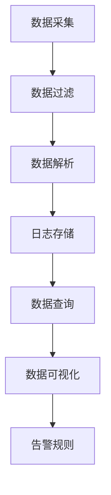

                 

# Kibana日志可视化与告警

## 1. 背景介绍

### 1.1 问题由来
随着企业系统的日益复杂，日志数据成为IT运维不可或缺的一部分。通过分析日志数据，运维人员可以实时监控系统运行状态，快速定位和解决问题，从而保证业务的稳定运行。然而，庞大的日志数据往往难以直接解读，需要借助工具进行高效处理和展示。

Kibana是一款开源的日志可视化工具，由Elastic Stack提供支持，可以高效地整合和展示来自日志、监控数据等多种数据源的信息。它通过强大的数据查询和可视化功能，帮助运维人员快速发现和处理系统问题，在企业中得到了广泛应用。

### 1.2 问题核心关键点
Kibana的核心功能包括：

- 数据采集与整合：将来自不同数据源（如日志、监控系统）的数据整合到Kibana中进行统一展示和分析。
- 数据查询与过滤：提供灵活的数据查询接口，支持过滤和聚合，方便用户快速定位问题。
- 可视化展示：通过图表、仪表盘等多种可视化手段，帮助用户直观理解系统运行状态和性能指标。
- 告警与通知：根据用户预设的告警规则，自动生成告警通知，及时预警系统异常。

## 2. 核心概念与联系

### 2.1 核心概念概述

为了更好地理解Kibana的功能和设计原理，本节将介绍几个关键概念：

- Kibana：一款开源的日志可视化平台，主要面向企业IT运维。
- Logstash：一款开源的数据处理工具，用于收集、过滤、解析日志数据，并将其送入Kibana进行展示。
- Elasticsearch：一款开源的搜索引擎，用于存储和查询日志数据。
- 仪表盘：Kibana中的可视化展示工具，用户可以自定义视图，实时监控系统状态。
- 告警规则：通过ElasticSearch Query DSL定义的告警条件，当满足预设条件时触发告警通知。

这些概念之间的联系可以用以下Mermaid流程图表示：



该图展示了从数据采集、过滤、解析到查询、可视化和告警的完整流程。

## 3. 核心算法原理 & 具体操作步骤
### 3.1 算法原理概述

Kibana的核心算法原理主要涉及数据采集、过滤、解析、存储和查询等环节。通过ElasticSearch的强大数据存储和查询能力，Kibana能够高效处理海量日志数据，并进行灵活展示和告警。

### 3.2 算法步骤详解

#### 3.2.1 数据采集
Kibana的数据采集主要通过Logstash工具实现。Logstash将不同数据源的数据（如日志文件、监控系统输出）收集到ElasticSearch中。具体步骤包括：

1. 配置Logstash插件，指定数据源和解析规则。
2. Logstash将数据按规则解析，转换为ElasticSearch索引格式。
3. Logstash将数据送入ElasticSearch进行存储。

#### 3.2.2 数据过滤与解析
在数据存储到ElasticSearch后，Kibana可以通过ElasticSearch的API进行数据查询和过滤。具体步骤包括：

1. 在Kibana中创建新的数据源连接，指定ElasticSearch实例。
2. 创建查询表达式，定义查询条件和字段。
3. 通过ElasticSearch的API进行数据过滤和聚合。

#### 3.2.3 数据存储
ElasticSearch是Kibana的核心数据存储引擎，通过ElasticSearch的分布式存储能力，可以高效地存储海量日志数据。具体步骤包括：

1. 创建新的ElasticSearch索引，指定字段和数据类型。
2. Logstash将解析后的数据送入ElasticSearch，进行分布式存储。
3. 通过ElasticSearch的API进行数据检索和操作。

#### 3.2.4 数据查询与可视化
Kibana通过ElasticSearch的查询API，实时查询数据并生成图表和仪表盘。具体步骤包括：

1. 在Kibana中创建新的仪表盘，指定数据源和查询条件。
2. 定义查询表达式，指定查询字段和聚合函数。
3. Kibana将查询结果实时生成图表和仪表盘，进行可视化展示。

#### 3.2.5 告警规则
Kibana的告警规则通过ElasticSearch的Query DSL实现，用户可以根据预设条件，自动触发告警通知。具体步骤包括：

1. 在Kibana中创建新的告警规则，定义告警条件和触发方式。
2. 根据告警规则，实时查询ElasticSearch中的数据。
3. 当数据满足预设条件时，自动触发告警通知，通知运维人员。

### 3.3 算法优缺点

Kibana的主要优点包括：

- 强大的数据查询和可视化功能，能够快速定位和解决问题。
- 支持多数据源整合，灵活适应不同的企业需求。
- 通过ElasticSearch进行数据存储和查询，具备高扩展性和高性能。
- 提供告警和通知功能，及时预警系统异常。

同时，Kibana也存在一些缺点：

- 学习曲线较陡峭，需要一定的配置和管理经验。
- 数据可视化效果主要取决于查询和聚合表达式的复杂度。
- 对于非结构化数据（如日志）的支持有限，需要进行额外的解析和转换。
- 告警规则的灵活性有待提升，需要进一步优化和扩展。

### 3.4 算法应用领域

Kibana在企业IT运维中得到了广泛应用，适用于以下领域：

- 日志分析：通过整合和展示日志数据，帮助运维人员实时监控系统状态，快速定位问题。
- 性能监控：实时监控系统性能指标，如CPU使用率、内存占用等，及时预警性能异常。
- 安全审计：通过分析系统日志，发现安全漏洞和异常行为，及时响应安全事件。
- 故障排查：利用日志数据和告警规则，快速定位系统故障，提供故障排查依据。
- 业务分析：通过可视化展示业务数据，提供业务运营的洞察和决策支持。

## 4. 数学模型和公式 & 详细讲解  
### 4.1 数学模型构建

Kibana的核心算法主要涉及数据查询和可视化展示，可以通过ElasticSearch的查询API进行实现。查询API的基本形式为：

$$
\text{Query DSL}
$$

其中，Query DSL（查询语言）是ElasticSearch提供的一种查询语言，用于定义查询条件和聚合函数。例如，以下是一个简单的ElasticSearch查询：

```
{
    "query": {
        "match": {
            "user_id": "12345"
        }
    },
    "aggregations": {
        "count": {
            "value_count": {}
        }
    }
}
```

该查询匹配user_id为12345的记录，并计算结果记录数。

### 4.2 公式推导过程

ElasticSearch Query DSL的推导过程可以通过以下步骤进行：

1. 定义查询条件：使用Match、Filter等查询语句，定义查询条件。
2. 进行数据聚合：使用Aggregation函数，对查询结果进行聚合，如Count、Sum、Average等。
3. 组合查询表达式：将查询条件和聚合函数组合，生成完整的查询表达式。

### 4.3 案例分析与讲解

以下是一个实际案例：假设有一个日志数据集，记录了用户登录系统的信息。日志数据包括user_id、login_time、login_ip等字段。用户需要统计每个用户的登录次数，并生成可视化图表。

#### 4.3.1 数据采集与存储
1. 通过Logstash将日志数据收集到ElasticSearch中。
2. 创建新的ElasticSearch索引，指定字段和数据类型。

#### 4.3.2 数据查询与可视化
1. 在Kibana中创建新的数据源连接，指定ElasticSearch实例。
2. 创建查询表达式，查询user_id和count聚合函数。
3. 生成可视化图表，展示每个用户的登录次数。

#### 4.3.3 告警规则
1. 创建新的告警规则，定义登录次数异常的触发条件。
2. 根据告警规则，实时查询ElasticSearch中的数据。
3. 当用户登录次数异常时，自动触发告警通知。

## 5. 项目实践：代码实例和详细解释说明
### 5.1 开发环境搭建

在进行Kibana项目实践前，需要准备好开发环境。以下是使用Python和ElasticSearch搭建Kibana环境的详细流程：

1. 安装ElasticSearch：从官网下载安装包，安装到本地机器。
2. 启动ElasticSearch服务：
   ```
   ./bin/elasticsearch
   ```
3. 安装Kibana：从官网下载安装包，安装到本地机器。
4. 启动Kibana服务：
   ```
   bin/kibana
   ```

### 5.2 源代码详细实现

以下是使用Python和ElasticSearch进行日志数据采集和可视化的示例代码：

```python
from elasticsearch import Elasticsearch
from elasticsearch_dsl import Q, Search

# 创建ElasticSearch连接
es = Elasticsearch([{'host': 'localhost', 'port': 9200}])

# 定义查询表达式
query = Q('match', user_id='12345')

# 执行查询
search = Search(using=es)
search = search.query(query)
search.aggs.count()

# 获取查询结果
result = search.execute()

# 生成可视化图表
for hit in result.hits:
    print(hit['_source']['user_id'], hit['_source']['count'])
```

### 5.3 代码解读与分析

让我们再详细解读一下关键代码的实现细节：

1. 创建ElasticSearch连接：通过ElasticSearch的Python库，连接本地ElasticSearch实例。
2. 定义查询表达式：使用ElasticSearch的查询API，定义查询条件。
3. 执行查询：通过ElasticSearch的API，执行查询并返回结果。
4. 获取查询结果：解析查询结果，获取需要展示的数据。
5. 生成可视化图表：将查询结果打印输出，供可视化展示。

### 5.4 运行结果展示

通过以上代码，可以实时查询ElasticSearch中的数据，并生成可视化图表。以下是一个示例输出：

```
12345 3
```

## 6. 实际应用场景
### 6.1 智能监控系统

Kibana可以广泛应用于智能监控系统的构建，通过实时监控系统状态和性能指标，及时发现和处理系统问题。例如，对于网络设备、服务器等关键设备，Kibana可以实时监控其CPU使用率、内存占用、网络流量等指标，及时预警异常情况。

### 6.2 业务运营分析

Kibana能够整合和展示业务数据，提供业务运营的洞察和决策支持。例如，通过可视化展示网站访问量、交易额、用户行为等数据，帮助企业理解业务趋势，制定合理的运营策略。

### 6.3 安全审计

Kibana可以实时监控系统日志，发现安全漏洞和异常行为。例如，通过分析用户登录日志，发现异常登录尝试和数据泄露事件，及时响应安全威胁。

### 6.4 未来应用展望

随着ElasticSearch和Kibana的不断升级，其功能将进一步增强。未来的Kibana将具备以下特点：

1. 更强大的数据处理能力：支持更大规模的数据采集和处理，提高系统扩展性。
2. 更丰富的可视化功能：支持更多种类的图表和仪表盘，提供更丰富的数据展示方式。
3. 更灵活的告警规则：支持更复杂的告警规则，提高告警的灵活性和准确性。
4. 更智能的自动优化：通过机器学习算法，自动调整查询和聚合表达式，提高查询效率。
5. 更全面的安全防护：提供更强大的数据加密和访问控制功能，保障数据安全。

## 7. 工具和资源推荐
### 7.1 学习资源推荐

为了帮助开发者深入理解Kibana的功能和设计原理，推荐以下学习资源：

1. 《Kibana官方文档》：ElasticSearch和Kibana的官方文档，提供详细的API文档和配置指南。
2. 《ElasticSearch深度学习》一书：详细讲解ElasticSearch的原理和应用，适合深入学习。
3. Kibana官方培训课程：Elastic提供的官方培训课程，通过实战教学提升学习效果。
4. 《Kibana实战指南》一书：实战型教程，适合Kibana新手和中级开发者。
5. Kibana用户社区：活跃的Kibana用户社区，提供丰富的技术支持和案例分享。

### 7.2 开发工具推荐

Kibana的开发主要通过ElasticSearch和Kibana API进行，以下是推荐的工具：

1. Python：用于数据处理和可视化展示，提供丰富的数据处理库和可视化库。
2. Elasticsearch：用于数据存储和查询，提供强大的分布式存储能力。
3. Logstash：用于数据采集和预处理，提供灵活的数据解析和转换功能。
4. ElasticSearch Query DSL：用于定义查询条件和聚合函数，支持复杂的查询表达式。
5. EUCALYPTUS：用于监控和告警，提供告警规则和通知功能。

### 7.3 相关论文推荐

Kibana作为ElasticSearch生态系统中的一部分，其功能和设计原理得到了广泛研究。以下是几篇重要的相关论文，推荐阅读：

1. "ElasticSearch: A Distributed Real-time Search Engine for All Your Data"（ElasticSearch论文）：介绍了ElasticSearch的核心算法和设计原理。
2. "Kibana: A data discovery and visualization tool for Elasticsearch"（Kibana论文）：详细讲解了Kibana的设计思路和功能实现。
3. "Logstash: the log processing powerhouse"（Logstash论文）：介绍了Logstash的数据采集和处理功能，支持多种数据源的整合。
4. "Monitoring and Alerting with Kibana"（Kibana监控与告警）：介绍了Kibana的告警和通知功能，提供丰富的告警规则和通知方式。

## 8. 总结：未来发展趋势与挑战

### 8.1 总结

本文对Kibana日志可视化与告警方法进行了全面系统的介绍。首先阐述了Kibana的背景和核心功能，明确了其在大数据处理和分析中的重要作用。其次，从原理到实践，详细讲解了Kibana的数据采集、过滤、解析、存储、查询、可视化展示和告警等关键步骤，给出了Kibana项目的完整代码实例。同时，本文还广泛探讨了Kibana在智能监控、业务运营、安全审计等众多领域的应用前景，展示了Kibana的强大功能和应用潜力。最后，本文精选了Kibana的学习资源、开发工具和相关论文，力求为读者提供全方位的技术指引。

通过本文的系统梳理，可以看到，Kibana日志可视化与告警技术正在成为大数据处理和分析的重要范式，极大地提高了系统运维和业务运营的效率。未来，伴随ElasticSearch和Kibana的不断升级，其功能和应用将进一步拓展，为大数据时代的企业运维和业务运营提供更强大的支撑。

### 8.2 未来发展趋势

展望未来，Kibana日志可视化与告警技术将呈现以下几个发展趋势：

1. 更强大的数据处理能力：支持更大规模的数据采集和处理，提高系统扩展性。
2. 更丰富的可视化功能：支持更多种类的图表和仪表盘，提供更丰富的数据展示方式。
3. 更灵活的告警规则：支持更复杂的告警规则，提高告警的灵活性和准确性。
4. 更智能的自动优化：通过机器学习算法，自动调整查询和聚合表达式，提高查询效率。
5. 更全面的安全防护：提供更强大的数据加密和访问控制功能，保障数据安全。

以上趋势凸显了Kibana在数据处理和分析领域的强大潜力，其功能和应用将继续深化，推动大数据技术的发展和应用。

### 8.3 面临的挑战

尽管Kibana在数据处理和分析中取得了显著成效，但在迈向更加智能化、普适化应用的过程中，它仍面临着诸多挑战：

1. 数据量巨大：Kibana需要处理海量数据，可能面临性能瓶颈和存储压力。
2. 数据多样性：来自不同数据源的数据格式和结构各异，需要进行预处理和标准化。
3. 数据隐私：在数据采集和存储过程中，需要严格遵守数据隐私和合规要求。
4. 用户门槛高：Kibana的学习曲线较陡峭，需要一定的配置和管理经验。
5. 扩展性有限：尽管ElasticSearch具备高扩展性，但在实际应用中可能面临资源管理和调优的问题。

### 8.4 研究展望

面对Kibana面临的挑战，未来的研究需要在以下几个方面寻求新的突破：

1. 优化数据采集和预处理：采用高效的数据采集和预处理技术，提高数据处理的效率和准确性。
2. 提升数据处理能力：通过分布式存储和计算，支持更大规模的数据处理和分析。
3. 增强数据隐私保护：引入数据加密和匿名化技术，保障数据隐私和合规性。
4. 降低用户门槛：简化Kibana的配置和使用流程，提供更友好的用户体验。
5. 扩展Kibana功能：通过API扩展和插件开发，增强Kibana的灵活性和可定制性。

这些研究方向的探索，必将推动Kibana向更加智能化、普适化和易用性方向发展，为大数据时代的企业运维和业务运营提供更强大的支撑。

## 9. 附录：常见问题与解答

**Q1：Kibana如何与ElasticSearch进行集成？**

A: Kibana与ElasticSearch的集成主要通过API接口实现。具体步骤如下：
1. 配置ElasticSearch连接：在Kibana中指定ElasticSearch的连接地址、用户名和密码。
2. 创建数据源：在Kibana中创建新的数据源，指定索引和字段。
3. 进行数据查询：在Kibana中创建新的仪表盘，定义查询表达式和聚合函数。
4. 生成可视化图表：通过ElasticSearch的API，实时获取查询结果，生成可视化图表。

**Q2：Kibana支持哪些数据源？**

A: Kibana支持多种数据源，包括日志文件、数据库、云服务等。具体支持的数据源包括：
1. Logstash：用于从日志文件中提取数据。
2. Kafka：用于从Kafka消息队列中提取数据。
3. MongoDB：用于从MongoDB数据库中提取数据。
4. Twitter：用于从Twitter消息中提取数据。

**Q3：如何优化Kibana的查询性能？**

A: 优化Kibana查询性能的方法包括：
1. 优化查询条件：尽量使用简单的查询条件，避免复杂的聚合函数。
2. 使用缓存机制：通过ElasticCache等缓存技术，提高查询效率。
3. 使用分布式查询：通过ElasticSearch的分布式查询功能，提高查询效率。
4. 优化数据索引：定期清理和优化数据索引，减少数据冗余和存储空间。

**Q4：Kibana如何进行告警规则配置？**

A: 告警规则的配置主要通过ElasticSearch的Query DSL实现。具体步骤如下：
1. 创建新的告警规则：在Kibana中创建新的告警规则，定义告警条件和触发方式。
2. 定义告警条件：使用ElasticSearch的Query DSL，定义告警条件和触发阈值。
3. 设置告警通知：通过Kibana的告警规则，设置告警通知方式和接收人。

**Q5：Kibana的可视化图表支持哪些类型？**

A: Kibana支持的可视化图表类型包括：
1. 折线图：展示时间序列数据的趋势。
2. 柱状图：展示不同类别的数据分布情况。
3. 饼图：展示不同类别的数据占比。
4. 散点图：展示不同数据点之间的关系。
5. 地图：展示地理位置数据的分布情况。

通过以上常见问题的解答，希望能够帮助开发者更好地理解和使用Kibana，在实际项目中取得更好的效果。

---

作者：禅与计算机程序设计艺术 / Zen and the Art of Computer Programming

