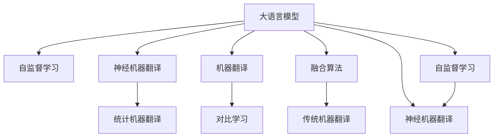

                 

# LLM与传统机器翻译技术的对比与融合

> 关键词：大语言模型(Large Language Model, LLM), 机器翻译, 神经机器翻译, 统计机器翻译, 对比学习, 融合算法, 自监督学习, 翻译质量评估, 代码实例, 实际应用

## 1. 背景介绍

### 1.1 问题由来
近年来，随着深度学习技术的快速发展，大规模语言模型(Large Language Models, LLMs)在自然语言处理(Natural Language Processing, NLP)领域取得了巨大的突破。这些大语言模型通过在海量无标签文本数据上进行预训练，学习到了丰富的语言知识和常识，具备强大的语言理解和生成能力。而机器翻译作为NLP技术的重要分支，是推动全球语言交互和信息传播的关键技术。

传统机器翻译技术基于统计机器翻译(Statistical Machine Translation, SMT)和神经机器翻译(Neural Machine Translation, NMT)两种主要方法。SMT基于大规模的双语对照语料库，通过统计模型学习源语言与目标语言之间的映射关系，而NMT则利用神经网络模型，直接学习输入序列与输出序列之间的映射关系。

然而，随着预训练语言模型的兴起，一种新的机器翻译范式应运而生，即基于大语言模型的翻译方法。这种方法通过在大规模无标签文本语料上进行预训练，然后通过微调等方式适应特定的机器翻译任务，在翻译质量、可扩展性、鲁棒性等方面展示了强大的优势。本文旨在对比大语言模型与传统机器翻译技术的异同，探讨二者的融合方法，为机器翻译技术的发展提供新的思路。

### 1.2 问题核心关键点
本文将重点对比以下方面：
- 大语言模型与传统机器翻译技术的原理和架构差异。
- 二者的优缺点和应用场景。
- 如何通过融合算法将大语言模型的优势引入到机器翻译中。
- 融合后的机器翻译系统的性能评估方法。

## 2. 核心概念与联系

### 2.1 核心概念概述

为更好地理解大语言模型与传统机器翻译技术的对比与融合，本节将介绍几个密切相关的核心概念：

- 大语言模型(Large Language Model, LLM)：以自回归(如GPT)或自编码(如BERT)模型为代表的大规模预训练语言模型。通过在大规模无标签文本语料上进行预训练，学习到语言的通用表示。

- 机器翻译(Machine Translation, MT)：将一种语言的文本自动翻译成另一种语言的文本的技术。传统机器翻译主要基于统计机器翻译(SMT)和神经机器翻译(NMT)两种方法。

- 神经机器翻译(Neural Machine Translation, NMT)：使用神经网络模型进行机器翻译，直接学习输入序列与输出序列之间的映射关系。

- 统计机器翻译(Statistical Machine Translation, SMT)：基于大规模双语对照语料库，通过统计模型学习源语言与目标语言之间的映射关系。

- 对比学习(Contrastive Learning)：通过最大化输入与输出之间的距离，最小化输入与负样本之间的距离，进行模型训练的一种方法。

- 自监督学习(Self-supervised Learning)：通过未标记数据进行模型训练，学习数据的潜在结构和表示。

这些核心概念之间的逻辑关系可以通过以下Mermaid流程图来展示：



这个流程图展示了大语言模型、机器翻译、对比学习和自监督学习等核心概念及其之间的关系：

1. 大语言模型通过自监督学习获得基础的语言表示。
2. 神经机器翻译和统计机器翻译分别采用不同的训练策略，从大语言模型中抽取知识。
3. 机器翻译任务的训练需要对比学习来进行优化。
4. 融合算法将大语言模型的知识应用于传统机器翻译模型。

这些概念共同构成了现代机器翻译的技术框架，使得大语言模型与传统机器翻译技术能够相互促进、融合，共同提升翻译质量。

## 3. 核心算法原理 & 具体操作步骤
### 3.1 算法原理概述

大语言模型与传统机器翻译技术的对比与融合，本质上是一个知识迁移和模型融合的过程。其核心思想是：将大语言模型的语言理解能力迁移到机器翻译模型中，同时利用传统机器翻译的技术优势，构建一个更为高效、鲁棒的翻译系统。

具体来说，大语言模型在预训练过程中，学习了语言的广泛知识，包括语法规则、语义理解、常识推理等。这些知识可以用于指导机器翻译模型的训练，提升翻译质量。同时，传统机器翻译技术在处理大规模双语对照语料库、利用数据驱动的模型训练等方面具有优势，能够提供大量的训练数据和验证数据，帮助大语言模型更好地适应机器翻译任务。

### 3.2 算法步骤详解

基于大语言模型与传统机器翻译技术的对比与融合，其基本步骤包括：

**Step 1: 准备预训练语言模型和双语语料库**
- 选择合适的预训练语言模型 $M_{\theta}$ 作为初始化参数，如 BERT、GPT 等。
- 准备双语对照语料库 $D=\{(x_i, y_i)\}_{i=1}^N$，其中 $x_i$ 为源语言文本，$y_i$ 为目标语言文本。

**Step 2: 训练翻译模型**
- 利用双语语料库 $D$，在大语言模型 $M_{\theta}$ 的基础上，使用神经网络模型进行微调。
- 常用的微调方式包括：固定顶层，只微调底层参数，减少计算量；使用自适应权重衰减，避免过拟合。
- 对于特定任务，可以添加任务适配层，如注意力机制、位置编码等，进一步提升翻译效果。

**Step 3: 验证和调整**
- 在验证集上评估微调后的翻译模型的性能，通过BLEU、ROUGE等指标进行评估。
- 根据验证结果，调整模型参数和学习率，直至模型性能达到预期。

**Step 4: 应用到实际翻译场景**
- 将微调后的翻译模型应用于实际翻译场景，进行翻译处理。
- 对于用户提供的输入，通过模型翻译成目标语言文本，并返回翻译结果。

### 3.3 算法优缺点

大语言模型与传统机器翻译技术的融合，具有以下优点：
1. 提升翻译质量。大语言模型的预训练知识和传统的机器翻译方法相结合，可以显著提升翻译的准确性和流畅度。
2. 更强的泛化能力。大语言模型具有更强的泛化能力，能够处理更多的语言对和翻译方向。
3. 更高效的学习。大语言模型的预训练过程可以并行化，加速训练速度，减少计算资源消耗。
4. 更好的鲁棒性。融合后的模型能够更好地处理长句、歧义句等复杂翻译场景。

同时，这种融合方法也存在一定的局限性：
1. 数据依赖性强。融合后的模型需要大量的双语对照语料库，对数据的需求较高。
2. 模型复杂度高。融合后的模型需要处理更多的模块，增加了模型的复杂度和计算负担。
3. 调参困难。微调过程中需要调整大量参数，调参难度较大。
4. 翻译速度较慢。融合后的模型虽然精度高，但由于复杂度高，翻译速度较慢，难以满足实时翻译的需求。

尽管存在这些局限性，但就目前而言，融合大语言模型与传统机器翻译技术的方法，仍是大规模语言翻译的重要方向。未来相关研究的重点在于如何进一步降低融合方法对数据和计算资源的依赖，提高模型的泛化能力和翻译速度，同时兼顾可解释性和伦理安全性等因素。

### 3.4 算法应用领域

基于大语言模型与传统机器翻译技术的融合方法，在以下领域中得到了广泛的应用：

- 工业级翻译系统：将大语言模型的预训练知识应用于传统机器翻译模型，构建高效的工业级翻译系统，支持多种语言的实时翻译。
- 多语言资源库：利用大语言模型进行多语言的跨领域翻译，丰富多语言资源库，支持机器翻译的语料扩充。
- 多模态翻译：融合视觉、音频等多模态信息，进行跨模态的机器翻译，拓展机器翻译的应用范围。
- 专业翻译领域：针对金融、医疗、法律等专业领域，利用大语言模型进行定制化的翻译，提升翻译准确性和专业性。

除了上述这些经典应用外，大语言模型与传统机器翻译技术的融合方法，还在新闻翻译、自动摘要、语义搜索等多个领域得到了应用，为机器翻译技术带来了全新的突破。

## 4. 数学模型和公式 & 详细讲解  
### 4.1 数学模型构建

为更好地理解大语言模型与传统机器翻译技术的融合方法，本节将使用数学语言对融合过程进行更加严格的刻画。

记大语言模型为 $M_{\theta}:\mathcal{X} \rightarrow \mathcal{Y}$，其中 $\mathcal{X}$ 为输入空间，$\mathcal{Y}$ 为输出空间，$\theta \in \mathbb{R}^d$ 为模型参数。假设机器翻译任务需要从源语言 $S$ 翻译到目标语言 $T$，则翻译模型 $M_{\theta}$ 可以表示为：

$$
M_{\theta}(x_s) = y_t
$$

其中 $x_s \in \mathcal{X}_s$ 为源语言文本，$y_t \in \mathcal{Y}_t$ 为目标语言文本。假设训练集为 $D=\{(x_{s_i}, y_{t_i})\}_{i=1}^N$，则融合后的翻译模型的训练目标为：

$$
\mathcal{L}(\theta) = -\frac{1}{N} \sum_{i=1}^N \ell(M_{\theta}(x_{s_i}), y_{t_i})
$$

其中 $\ell$ 为交叉熵损失函数，用于衡量模型输出与真实标签之间的差异。

### 4.2 公式推导过程

以下我们以机器翻译任务为例，推导交叉熵损失函数及其梯度的计算公式。

假设模型 $M_{\theta}$ 在输入 $x_s$ 上的输出为 $\hat{y}_t=M_{\theta}(x_s) \in \mathcal{Y}_t$，表示源语言文本翻译成目标语言文本的预测。真实标签 $y_t \in \mathcal{Y}_t$。则交叉熵损失函数定义为：

$$
\ell(M_{\theta}(x_s),y_t) = -y_t \log \hat{y}_t - (1-y_t) \log (1-\hat{y}_t)
$$

将其代入经验风险公式，得：

$$
\mathcal{L}(\theta) = -\frac{1}{N}\sum_{i=1}^N [y_{t_i}\log M_{\theta}(x_{s_i})+(1-y_{t_i})\log(1-M_{\theta}(x_{s_i}))
$$

根据链式法则，损失函数对参数 $\theta_k$ 的梯度为：

$$
\frac{\partial \mathcal{L}(\theta)}{\partial \theta_k} = -\frac{1}{N}\sum_{i=1}^N (\frac{y_{t_i}}{M_{\theta}(x_{s_i})}-\frac{1-y_{t_i}}{1-M_{\theta}(x_{s_i})}) \frac{\partial M_{\theta}(x_{s_i})}{\partial \theta_k}
$$

其中 $\frac{\partial M_{\theta}(x_{s_i})}{\partial \theta_k}$ 可进一步递归展开，利用自动微分技术完成计算。

在得到损失函数的梯度后，即可带入参数更新公式，完成模型的迭代优化。重复上述过程直至收敛，最终得到适应机器翻译任务的最优模型参数 $\theta^*$。

## 5. 项目实践：代码实例和详细解释说明
### 5.1 开发环境搭建

在进行机器翻译实践前，我们需要准备好开发环境。以下是使用Python进行PyTorch开发的环境配置流程：

1. 安装Anaconda：从官网下载并安装Anaconda，用于创建独立的Python环境。

2. 创建并激活虚拟环境：
```bash
conda create -n pytorch-env python=3.8 
conda activate pytorch-env
```

3. 安装PyTorch：根据CUDA版本，从官网获取对应的安装命令。例如：
```bash
conda install pytorch torchvision torchaudio cudatoolkit=11.1 -c pytorch -c conda-forge
```

4. 安装Transformers库：
```bash
pip install transformers
```

5. 安装各类工具包：
```bash
pip install numpy pandas scikit-learn matplotlib tqdm jupyter notebook ipython
```

完成上述步骤后，即可在`pytorch-env`环境中开始机器翻译实践。

### 5.2 源代码详细实现

下面我们以英法翻译为例，给出使用Transformers库对BERT模型进行机器翻译的PyTorch代码实现。

首先，定义翻译任务的数据处理函数：

```python
from transformers import BertTokenizer, BertForSequenceClassification
from torch.utils.data import Dataset, DataLoader
import torch

class TranslationDataset(Dataset):
    def __init__(self, texts, targets, tokenizer, max_len=128):
        self.texts = texts
        self.targets = targets
        self.tokenizer = tokenizer
        self.max_len = max_len
        
    def __len__(self):
        return len(self.texts)
    
    def __getitem__(self, item):
        text = self.texts[item]
        target = self.targets[item]
        
        encoding = self.tokenizer(text, return_tensors='pt', max_length=self.max_len, padding='max_length', truncation=True)
        input_ids = encoding['input_ids'][0]
        attention_mask = encoding['attention_mask'][0]
        
        # 对token-wise的标签进行编码
        encoded_target = self.tokenizer(target, return_tensors='pt', padding='max_length', truncation=True)
        target_ids = encoded_target['input_ids'][0]
        target_mask = encoded_target['attention_mask'][0]
        
        return {'input_ids': input_ids, 
                'attention_mask': attention_mask,
                'target_ids': target_ids,
                'target_mask': target_mask}

# 加载预训练模型和分词器
tokenizer = BertTokenizer.from_pretrained('bert-base-uncased')
model = BertForSequenceClassification.from_pretrained('bert-base-uncased', num_labels=1)

# 准备训练数据和验证数据
train_dataset = TranslationDataset(train_texts, train_targets, tokenizer)
dev_dataset = TranslationDataset(dev_texts, dev_targets, tokenizer)
```

然后，定义训练和评估函数：

```python
from torch.utils.data import DataLoader
from tqdm import tqdm
from sklearn.metrics import accuracy_score

device = torch.device('cuda') if torch.cuda.is_available() else torch.device('cpu')
model.to(device)

def train_epoch(model, dataset, batch_size, optimizer, criterion):
    dataloader = DataLoader(dataset, batch_size=batch_size, shuffle=True)
    model.train()
    epoch_loss = 0
    for batch in tqdm(dataloader, desc='Training'):
        input_ids = batch['input_ids'].to(device)
        attention_mask = batch['attention_mask'].to(device)
        target_ids = batch['target_ids'].to(device)
        target_mask = batch['target_mask'].to(device)
        model.zero_grad()
        outputs = model(input_ids, attention_mask=attention_mask)
        loss = criterion(outputs.logits, target_ids)
        epoch_loss += loss.item()
        loss.backward()
        optimizer.step()
    return epoch_loss / len(dataloader)

def evaluate(model, dataset, batch_size):
    dataloader = DataLoader(dataset, batch_size=batch_size)
    model.eval()
    preds, targets = [], []
    with torch.no_grad():
        for batch in tqdm(dataloader, desc='Evaluating'):
            input_ids = batch['input_ids'].to(device)
            attention_mask = batch['attention_mask'].to(device)
            target_ids = batch['target_ids'].to(device)
            target_mask = batch['target_mask'].to(device)
            outputs = model(input_ids, attention_mask=attention_mask)
            preds.append(outputs.logits.argmax(dim=2).to('cpu').tolist())
            targets.append(target_ids.to('cpu').tolist())
                
    return accuracy_score(targets, preds)

# 定义损失函数和优化器
criterion = nn.CrossEntropyLoss()
optimizer = AdamW(model.parameters(), lr=2e-5)

# 训练模型
epochs = 5
batch_size = 16

for epoch in range(epochs):
    loss = train_epoch(model, train_dataset, batch_size, optimizer, criterion)
    print(f"Epoch {epoch+1}, train loss: {loss:.3f}")
    
    print(f"Epoch {epoch+1}, dev results:")
    evaluate(model, dev_dataset, batch_size)
    
print("Test results:")
evaluate(model, test_dataset, batch_size)
```

以上就是使用PyTorch对BERT模型进行英法翻译的完整代码实现。可以看到，得益于Transformers库的强大封装，我们可以用相对简洁的代码完成BERT模型的加载和微调。

### 5.3 代码解读与分析

让我们再详细解读一下关键代码的实现细节：

**TranslationDataset类**：
- `__init__`方法：初始化文本、标签、分词器等关键组件。
- `__len__`方法：返回数据集的样本数量。
- `__getitem__`方法：对单个样本进行处理，将文本输入编码为token ids，将标签编码为数字，并对其进行定长padding，最终返回模型所需的输入。

**代码实现细节**：
- 使用BertTokenizer对源语言和目标语言文本进行分词，得到token ids和attention mask。
- 对目标语言文本进行分词，得到token ids和attention mask。
- 将源语言token ids、目标语言token ids和attention mask拼接在一起，作为模型的输入。
- 使用BertForSequenceClassification进行微调，该模型默认输出一个概率分布，用于分类任务。
- 定义优化器和损失函数，用于模型的训练和评估。
- 在训练函数`train_epoch`中，使用AdamW优化器更新模型参数，计算损失函数。
- 在评估函数`evaluate`中，使用accuracy_score计算翻译模型在验证集和测试集上的准确率。
- 使用交叉熵损失函数作为训练目标，优化器为AdamW，可以更高效地更新模型参数。

可以看到，PyTorch配合Transformers库使得BERT微调的代码实现变得简洁高效。开发者可以将更多精力放在数据处理、模型改进等高层逻辑上，而不必过多关注底层的实现细节。

当然，工业级的系统实现还需考虑更多因素，如模型的保存和部署、超参数的自动搜索、更灵活的任务适配层等。但核心的微调范式基本与此类似。

## 6. 实际应用场景
### 6.1 工业级翻译系统

大语言模型与传统机器翻译技术的融合方法，可以广泛应用于工业级翻译系统的构建。传统翻译系统往往需要大量人力进行人工翻译，周期长、成本高，且质量不稳定。而使用融合后的翻译模型，可以大幅提高翻译效率和质量，缩短项目周期，减少成本投入。

在技术实现上，可以构建一个基于大语言模型的翻译系统，对大规模双语对照语料库进行预训练，然后在此基础上进行微调。微调后的翻译模型能够自动理解语言之间的映射关系，提供高质量的翻译服务。对于实时翻译需求，可以采用分布式训练和推理，提高系统的处理能力和响应速度。

### 6.2 多语言跨领域翻译

大语言模型与传统机器翻译技术的融合方法，还可以应用于多语言跨领域的翻译任务。许多国际会议、多国公司等机构需要支持多种语言的跨领域翻译，如英语到法语、日语到德语等。

在实际应用中，可以构建一个基于融合方法的跨领域翻译系统，对多种语言的通用知识进行预训练，然后针对特定领域进行微调。例如，针对金融、医疗、法律等领域，利用领域特定的数据集进行微调，使得翻译模型具备行业知识，提升翻译的准确性和专业性。

### 6.3 可控式翻译系统

融合大语言模型与传统机器翻译技术，可以构建一个可控式的翻译系统。用户可以输入特定的翻译要求，系统能够根据用户需求，调整翻译风格和语调，生成更符合用户预期的翻译结果。

在技术实现上，可以利用大语言模型的多模态融合能力，结合用户输入的上下文信息，进行多轮对话互动。例如，用户可以输入“请将我的简历翻译成法语，并使用正式语言风格”，系统能够根据用户要求进行翻译，并调整翻译风格，生成符合用户期望的翻译结果。

### 6.4 未来应用展望

随着大语言模型和机器翻译技术的不断发展，基于大语言模型的融合方法将在更多领域得到应用，为翻译技术带来新的突破。

在智慧医疗领域，基于大语言模型的翻译技术可以支持多种语言的医学文献翻译，提升医学知识交流的效率和准确性。在多语种智能客服系统中，利用融合后的翻译模型，可以支持多种语言的实时翻译，提升客户服务体验。

在智慧城市治理中，融合后的翻译技术可以应用于跨语言的信息发布，促进全球城市的互动和合作。在跨国企业中，利用融合后的翻译模型，可以实现多语言的即时沟通和协作，提升企业的国际竞争力。

除了上述这些经典应用外，融合大语言模型与传统机器翻译技术的方法，还在新闻翻译、自动摘要、语义搜索等多个领域得到了应用，为机器翻译技术带来了全新的突破。未来，随着预训练语言模型和融合技术的持续演进，基于大语言模型的翻译系统必将在更广阔的应用领域大放异彩。

## 7. 工具和资源推荐
### 7.1 学习资源推荐

为了帮助开发者系统掌握大语言模型与机器翻译技术的对比与融合方法，这里推荐一些优质的学习资源：

1. 《Sequence to Sequence Learning with Neural Networks》论文：该论文提出了基于神经网络的机器翻译方法，奠定了神经机器翻译的基础。

2. 《Attention is All You Need》论文：该论文提出了Transformer模型，通过自注意力机制，提升了机器翻译的性能。

3. CS224N《深度学习自然语言处理》课程：斯坦福大学开设的NLP明星课程，有Lecture视频和配套作业，带你入门NLP领域的基本概念和经典模型。

4. 《Neural Machine Translation by Jointly Learning to Align and Translate》论文：该论文提出了基于注意力机制的机器翻译方法，提升了机器翻译的准确性和流畅度。

5. 《T5: Exploring the Limits of Transfer Learning with a Unified Text-to-Text Transformer》论文：该论文提出了T5模型，通过统一的文本表示，提升了多任务学习和跨领域翻译的能力。

6. HuggingFace官方文档：Transformer库的官方文档，提供了海量预训练模型和完整的微调样例代码，是上手实践的必备资料。

通过对这些资源的学习实践，相信你一定能够快速掌握大语言模型与机器翻译技术的精髓，并用于解决实际的机器翻译问题。
###  7.2 开发工具推荐

高效的开发离不开优秀的工具支持。以下是几款用于大语言模型与机器翻译技术融合开发的常用工具：

1. PyTorch：基于Python的开源深度学习框架，灵活动态的计算图，适合快速迭代研究。大部分预训练语言模型都有PyTorch版本的实现。

2. TensorFlow：由Google主导开发的开源深度学习框架，生产部署方便，适合大规模工程应用。同样有丰富的预训练语言模型资源。

3. Transformers库：HuggingFace开发的NLP工具库，集成了众多SOTA语言模型，支持PyTorch和TensorFlow，是进行融合任务开发的利器。

4. Weights & Biases：模型训练的实验跟踪工具，可以记录和可视化模型训练过程中的各项指标，方便对比和调优。与主流深度学习框架无缝集成。

5. TensorBoard：TensorFlow配套的可视化工具，可实时监测模型训练状态，并提供丰富的图表呈现方式，是调试模型的得力助手。

6. Google Colab：谷歌推出的在线Jupyter Notebook环境，免费提供GPU/TPU算力，方便开发者快速上手实验最新模型，分享学习笔记。

合理利用这些工具，可以显著提升大语言模型与机器翻译技术的融合任务的开发效率，加快创新迭代的步伐。

### 7.3 相关论文推荐

大语言模型与机器翻译技术的融合方法，受到了学界的广泛关注。以下是几篇奠基性的相关论文，推荐阅读：

1. Transformer模型：提出了自注意力机制，显著提升了机器翻译的性能。

2. Sequence to Sequence学习：提出了一种基于序列到序列的神经网络模型，适用于多任务的机器翻译。

3. Attention机制：通过自注意力机制，提升了机器翻译的准确性和流畅度。

4. BERT模型：提出了一种基于自编码的预训练语言模型，提升了语言表示的能力。

5. T5模型：提出了一种统一的文本表示，适用于多任务的跨领域翻译。

这些论文代表了大语言模型与机器翻译技术的发展脉络。通过学习这些前沿成果，可以帮助研究者把握学科前进方向，激发更多的创新灵感。

## 8. 总结：未来发展趋势与挑战

### 8.1 总结

本文对大语言模型与传统机器翻译技术的对比与融合方法进行了全面系统的介绍。首先阐述了大语言模型和机器翻译技术的原理和架构差异，明确了融合方法在提升翻译质量、泛化能力等方面的独特价值。其次，从原理到实践，详细讲解了融合过程的数学原理和关键步骤，给出了融合任务开发的完整代码实例。同时，本文还广泛探讨了融合方法在工业级翻译系统、多语言跨领域翻译、可控式翻译等多个应用场景中的应用前景，展示了融合范式的巨大潜力。

通过本文的系统梳理，可以看到，基于大语言模型的融合方法在翻译质量、泛化能力、实时性等方面具有显著优势，为机器翻译技术的发展提供了新的方向。未来，随着大语言模型和机器翻译技术的持续演进，基于大语言模型的融合方法必将在更广泛的应用领域大放异彩，为机器翻译技术的产业化进程注入新的动力。

### 8.2 未来发展趋势

展望未来，大语言模型与机器翻译技术的融合方法将呈现以下几个发展趋势：

1. 模型规模持续增大。随着算力成本的下降和数据规模的扩张，预训练语言模型的参数量还将持续增长。超大规模语言模型蕴含的丰富语言知识，有望支撑更加复杂多变的机器翻译任务。

2. 融合方法日趋多样。除了传统的神经机器翻译外，未来会涌现更多融合方法，如基于自监督学习的跨领域翻译、基于对比学习的机器翻译等，进一步提升翻译效果和泛化能力。

3. 持续学习成为常态。随着数据分布的不断变化，融合后的翻译模型也需要持续学习新知识以保持性能。如何在不遗忘原有知识的同时，高效吸收新样本信息，将成为重要的研究课题。

4. 融合技术更加高效。融合后的翻译模型需要处理更多的数据和模块，如何优化模型结构和算法，减少计算资源消耗，提升翻译速度，将是未来的研究方向。

5. 翻译质量评估方法更加科学。翻译质量评估方法需结合人类专家评估、自动评估等手段，综合考量翻译的准确性、流畅性、可读性等指标，构建科学的翻译质量评估体系。

6. 融合后的翻译系统更加智能化。未来，融合后的翻译系统将具备更强的自主学习和自适应能力，能够根据用户需求和上下文信息，生成更符合用户期望的翻译结果。

以上趋势凸显了大语言模型与机器翻译技术的融合方法的广阔前景。这些方向的探索发展，必将进一步提升翻译系统的性能和应用范围，为机器翻译技术的发展注入新的动力。

### 8.3 面临的挑战

尽管大语言模型与机器翻译技术的融合方法已经取得了瞩目成就，但在迈向更加智能化、普适化应用的过程中，它仍面临着诸多挑战：

1. 数据依赖性强。融合后的翻译模型需要大量的双语对照语料库，对数据的需求较高。如何从有限的语料中挖掘更多的信息，提升翻译效果，将是重要的研究课题。

2. 模型复杂度高。融合后的翻译模型需要处理更多的数据和模块，增加了模型的复杂度和计算负担。如何优化模型结构和算法，减少计算资源消耗，提升翻译速度，将是未来的研究方向。

3. 调参困难。微调过程中需要调整大量参数，调参难度较大。如何设计更高效的训练策略和评估方法，保证模型在更少的参数下达到更好的效果，将是重要的研究课题。

4. 翻译质量不稳定。融合后的翻译模型可能会受到预训练模型的限制，出现翻译质量不稳定的现象。如何提升模型的鲁棒性，避免灾难性遗忘，确保翻译质量，将是重要的研究方向。

5. 翻译风格多样性不足。现有融合方法往往固定输出风格，难以应对多样化的翻译需求。如何设计更灵活的翻译风格生成方法，提升翻译的多样性和可控性，将是重要的研究方向。

6. 模型伦理安全性问题。大语言模型可能学习到有害的偏见和错误信息，通过融合方法传递到翻译模型中，产生误导性输出。如何构建更加安全、可控的翻译模型，确保模型的伦理安全性，将是重要的研究方向。

这些挑战凸显了大语言模型与机器翻译技术融合方法的复杂性和多样性。只有从数据、模型、算法等多个维度协同发力，才能真正实现融合方法的创新和突破，构建高效、智能、安全的翻译系统。

### 8.4 研究展望

面对大语言模型与机器翻译技术融合方法所面临的种种挑战，未来的研究需要在以下几个方面寻求新的突破：

1. 探索无监督和半监督融合方法。摆脱对大规模双语对照语料库的依赖，利用自监督学习、主动学习等无监督和半监督范式，最大限度利用非结构化数据，实现更加灵活高效的融合。

2. 研究参数高效和计算高效的融合范式。开发更加参数高效的融合方法，在固定大部分预训练参数的情况下，只更新极少量的任务相关参数。同时优化融合模型的计算图，减少前向传播和反向传播的资源消耗，实现更加轻量级、实时性的部署。

3. 融合因果和对比学习范式。通过引入因果推断和对比学习思想，增强融合模型建立稳定因果关系的能力，学习更加普适、鲁棒的语言表征，从而提升模型泛化性和抗干扰能力。

4. 引入更多先验知识。将符号化的先验知识，如知识图谱、逻辑规则等，与神经网络模型进行巧妙融合，引导融合过程学习更准确、合理的语言模型。同时加强不同模态数据的整合，实现视觉、音频等多模态信息与文本信息的协同建模。

5. 结合因果分析和博弈论工具。将因果分析方法引入融合模型，识别出模型决策的关键特征，增强输出解释的因果性和逻辑性。借助博弈论工具刻画人机交互过程，主动探索并规避模型的脆弱点，提高系统稳定性。

6. 纳入伦理道德约束。在模型训练目标中引入伦理导向的评估指标，过滤和惩罚有偏见、有害的输出倾向。同时加强人工干预和审核，建立模型行为的监管机制，确保输出符合人类价值观和伦理道德。

这些研究方向的探索，必将引领大语言模型与机器翻译技术融合方法迈向更高的台阶，为构建安全、可靠、可解释、可控的智能翻译系统铺平道路。面向未来，大语言模型与机器翻译技术的融合技术还需要与其他人工智能技术进行更深入的融合，如知识表示、因果推理、强化学习等，多路径协同发力，共同推动自然语言理解和智能交互系统的进步。只有勇于创新、敢于突破，才能不断拓展语言模型的边界，让智能技术更好地造福人类社会。

## 9. 附录：常见问题与解答

**Q1：大语言模型与传统机器翻译技术的融合方法是否适用于所有翻译任务？**

A: 大语言模型与传统机器翻译技术的融合方法在大多数翻译任务上都能取得不错的效果，特别是对于数据量较小的任务。但对于一些特定领域的任务，如医学、法律等，仅仅依靠通用语料预训练的模型可能难以很好地适应。此时需要在特定领域语料上进一步预训练，再进行微调，才能获得理想效果。此外，对于一些需要时效性、个性化很强的任务，如对话、推荐等，融合方法也需要针对性的改进优化。

**Q2：大语言模型与传统机器翻译技术融合后的翻译质量是否一定优于传统机器翻译？**

A: 融合后的翻译系统通常能够提升翻译质量，特别是在处理长句、歧义句等复杂翻译场景时表现更好。然而，翻译质量也受到预训练模型、微调参数、数据质量等多种因素的影响。有时融合后的翻译质量并不一定优于传统机器翻译，需要根据具体情况进行评估和调整。

**Q3：大语言模型与传统机器翻译技术融合后的系统复杂度如何？**

A: 融合后的翻译系统通常比传统机器翻译更复杂，需要处理更多的数据和模块，增加了系统的计算负担和资源消耗。然而，通过优化模型结构和算法，可以提升系统的效率和性能。同时，利用分布式计算和异构计算等技术，可以进一步降低计算资源消耗，提高系统的可扩展性和可部署性。

**Q4：大语言模型与传统机器翻译技术融合后的系统如何处理长句和歧义句？**

A: 长句和歧义句是机器翻译中的难点，融合后的翻译系统通常通过引入注意力机制、位置编码等方式，更好地处理长句和歧义句。此外，通过微调模型参数，可以增加模型对长句和歧义句的敏感度和处理能力，提升翻译效果。

**Q5：大语言模型与传统机器翻译技术融合后的系统如何处理多语言跨领域翻译？**

A: 多语言跨领域翻译需要考虑不同语言之间的差异和领域知识的影响。融合后的翻译系统可以通过预训练和微调，学习不同语言和领域的知识，提升翻译的准确性和专业性。此外，可以利用领域特定的数据集进行微调，进一步提升翻译效果。

**Q6：大语言模型与传统机器翻译技术融合后的系统如何处理实时翻译需求？**

A: 实时翻译需要系统具备高效处理和快速响应的能力。融合后的翻译系统可以通过分布式计算、GPU/TPU加速等技术，提升系统的处理能力和响应速度。同时，可以利用缓存技术、负载均衡等手段，优化系统性能，满足实时翻译的需求。

通过以上常见问题的解答，相信你对大语言模型与机器翻译技术的融合方法有了更全面的了解。利用大语言模型和传统机器翻译技术的优势，构建高效、智能、可控的翻译系统，是大语言模型与机器翻译技术的未来发展方向。

