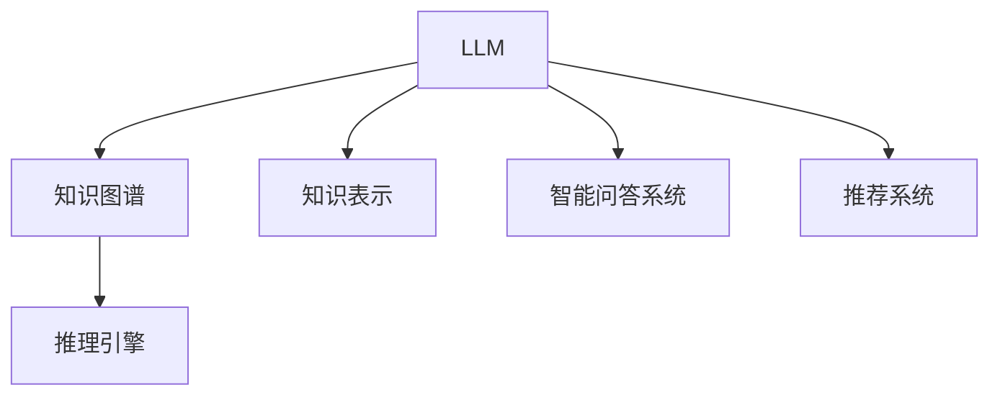

                 

# LLM与传统知识表示技术的结合：知识工程新方向

> 关键词：知识图谱，知识表示，自然语言处理，语言模型，推理引擎，融合，智能问答系统

## 1. 背景介绍

### 1.1 问题由来
近年来，随着人工智能技术的飞速发展，自然语言处理（NLP）领域取得了显著的进展，大语言模型（Large Language Models，LLMs）如GPT-3、BERT等，在诸多NLP任务上展现了强大的能力。然而，这些模型尽管在生成自然语言方面表现出色，但仍然缺乏对世界知识的直接理解。传统知识表示技术，如知识图谱（Knowledge Graphs，KG），通过构建结构化的知识库，为机器提供了明确的知识结构，使得机器能够进行更深入的推理和知识获取。因此，将LLM与传统知识表示技术相结合，成为了知识工程领域的一个前沿方向。

### 1.2 问题核心关键点
本节将介绍如何将大语言模型与知识图谱技术结合，构建智能问答系统、推荐系统等应用场景，旨在通过融合自然语言处理和知识表示，提升系统的理解能力和推理能力，实现更加智能化的应用。

## 2. 核心概念与联系

### 2.1 核心概念概述

为更好地理解LLM与知识图谱的结合方式，本节将介绍几个核心概念：

- **大语言模型（LLM）**：如GPT-3、BERT等预训练语言模型，通过在大规模无标签文本数据上进行自监督学习，学习到丰富的语言知识和语义表示。
- **知识图谱（KG）**：由节点（Entity）和边（Relation）构成的图结构，用于表示实体间的知识关系，如WordNet、DBpedia等。
- **知识表示**：将世界知识结构化，便于机器理解和推理。常见的知识表示方式包括RDF（Resource Description Framework）、OWL（Web Ontology Language）等。
- **推理引擎**：用于从知识图谱中提取信息，进行逻辑推理和验证，如OWL、Protege等。
- **智能问答系统**：通过理解和处理用户查询，从知识图谱中提取信息，返回准确答案的系统。
- **推荐系统**：基于用户行为和兴趣，结合知识图谱，为用户推荐物品的系统。

这些核心概念之间的逻辑关系可以通过以下Mermaid流程图来展示：



这个流程图展示了大语言模型与知识图谱的核心概念及其之间的逻辑关系：

1. 大语言模型通过预训练学习语言知识，知识图谱提供结构化的世界知识。
2. 知识表示将知识图谱中的信息结构化，便于机器理解。
3. 推理引擎从知识图谱中提取信息，进行逻辑推理。
4. 智能问答系统将用户查询转换为推理引擎可处理的语言形式，并从知识图谱中提取信息。
5. 推荐系统结合知识图谱和用户行为，为用户提供个性化推荐。

## 3. 核心算法原理 & 具体操作步骤
### 3.1 算法原理概述

LLM与知识图谱的结合，主要通过以下步骤实现：

1. **知识抽取**：将知识图谱中的实体和关系抽取到LLM的上下文中。
2. **上下文增强**：在LLM的上下文中，加入知识图谱的实体和关系，增强模型的语义理解能力。
3. **知识推理**：利用推理引擎对知识图谱进行推理，提取隐含的知识信息。
4. **联合训练**：将LLM和推理引擎的输出联合训练，提升模型的推理能力。

### 3.2 算法步骤详解

**Step 1: 构建知识图谱**
- 收集和整理世界知识，构建知识图谱。可以使用现有的KG如DBpedia、Freebase等，或自行构建专有KG。
- 将知识图谱转换为三元组（实体-关系-实体），使用RDF格式表示。

**Step 2: 知识抽取**
- 在知识图谱中，定义实体和关系。
- 在LLM的上下文中，定义相应的实体和关系表示。
- 利用抽取模型（如BCNN、SICK等）从上下文中抽取实体和关系。

**Step 3: 上下文增强**
- 将抽取的实体和关系，插入LLM的上下文中。
- 在LLM的前向传播中，使用上下文增强的方法（如Cross-Modal Feature Fusion），将知识信息嵌入到模型中。

**Step 4: 知识推理**
- 在LLM的顶层，定义推理目标，如求取某实体的属性值。
- 使用推理引擎，从知识图谱中提取相关信息，进行逻辑推理。
- 将推理结果作为LLM的输入，进行进一步推理。

**Step 5: 联合训练**
- 将LLM和推理引擎的输出联合训练，共同优化模型的语义理解和推理能力。
- 定义联合损失函数，将LLM的预测和推理引擎的推理结果作为训练信号。
- 使用梯度下降等优化算法，更新模型参数。

### 3.3 算法优缺点

将LLM与知识图谱结合的算法具有以下优点：
1. **知识丰富性**：通过知识图谱提供结构化的世界知识，使得LLM能够更好地理解复杂问题。
2. **推理能力**：知识图谱中的推理机制，能够帮助LLM进行更深入的推理和知识获取。
3. **模型泛化能力**：结合知识图谱的先验知识，LLM能够更好地泛化到新领域和新问题。

同时，该方法也存在以下局限性：
1. **知识抽取难度**：知识抽取需要大量的人工标注和模型训练，成本较高。
2. **知识表示复杂性**：知识图谱的构建和表示，需要处理复杂的实体关系，技术门槛较高。
3. **推理计算开销**：知识推理需要复杂计算，可能影响模型的推理速度。
4. **模型更新困难**：知识图谱和LLM需要协同训练，模型的更新和维护较为复杂。

尽管存在这些局限性，但通过合理设计，这些方法可以显著提升模型的性能和应用范围，具有广泛的应用前景。

### 3.4 算法应用领域

将LLM与知识图谱结合的方法，在知识工程领域已经得到了广泛的应用，覆盖了多个方向，例如：

- **智能问答系统**：结合知识图谱和LLM，构建智能问答系统，提供更准确和全面的答案。
- **推荐系统**：利用知识图谱和用户行为数据，为个性化推荐提供更丰富的背景信息。
- **自然语言生成**：结合知识图谱，生成更加详细和准确的语言描述。
- **实体关系抽取**：通过LLM和知识图谱的结合，自动识别和抽取实体关系。
- **情感分析**：结合知识图谱和情感词典，进行更深入的情感分析。

这些应用场景展示了LLM与知识图谱结合的强大潜力，为知识工程的多个领域带来了新的突破。

## 4. 数学模型和公式 & 详细讲解  
### 4.1 数学模型构建

为了更好地理解LLM与知识图谱的结合方式，本节将使用数学语言对模型的构建过程进行更加严格的刻画。

假设知识图谱中有一个实体$e$，其属性为$a$，值为$v$。在LLM的上下文中，知识图谱中的实体和关系表示为$E$和$R$。在LLM的前向传播中，上下文增强后的表示为$H$，推理引擎的推理结果为$R_e$。

数学模型如下：

$$
H = M_{\theta}(E, R)
$$

$$
R_e = P_e(H, E)
$$

其中$M_{\theta}$为LLM的前向传播，$P_e$为推理引擎的推理函数。

**Step 1: 构建知识图谱**
- 将知识图谱中的三元组$(E, R, e)$转换为向量形式。

**Step 2: 知识抽取**
- 在LLM的上下文中，定义实体和关系表示$E$和$R$。
- 利用抽取模型，从上下文$C$中抽取实体和关系表示。

**Step 3: 上下文增强**
- 将抽取的实体和关系表示$E'$和$R'$，插入LLM的上下文$H$中。
- 使用上下文增强的方法，将知识信息嵌入到LLM中。

**Step 4: 知识推理**
- 利用推理引擎，从知识图谱中提取相关信息。
- 将推理结果$R_e$作为LLM的输入，进行进一步推理。

**Step 5: 联合训练**
- 将LLM的预测$P_e$和推理引擎的推理结果$R_e$作为联合损失函数的一部分。
- 使用梯度下降等优化算法，更新模型参数。

### 4.2 公式推导过程

以下我们以智能问答系统为例，推导LLM与知识图谱的结合过程。

假设查询为$q$，答案为$a$。将查询$q$和答案$a$转换为向量表示：

$$
q = M_{\theta_q}(v)
$$

$$
a = M_{\theta_a}(v)
$$

其中$\theta_q$和$\theta_a$为查询和答案的表示向量。

在知识图谱中，定义实体$e$和关系$r$，并将其转换为向量形式：

$$
e = M_{\theta_e}(v)
$$

$$
r = M_{\theta_r}(v)
$$

其中$\theta_e$和$\theta_r$为实体和关系的表示向量。

在LLM的上下文中，将查询$q$和答案$a$转换为向量表示，并加入知识图谱中的实体和关系：

$$
H = M_{\theta_H}(q, e, r)
$$

其中$\theta_H$为上下文的表示向量。

使用推理引擎，从知识图谱中提取相关信息：

$$
R_e = P_e(H, e)
$$

其中$P_e$为推理引擎的推理函数。

将推理结果$R_e$作为LLM的输入，进行进一步推理：

$$
P_e' = M_{\theta_P}(R_e, e)
$$

其中$\theta_P$为推理引擎的输出向量。

最后，将LLM的预测$P_e'$与推理引擎的推理结果$R_e$作为联合损失函数的一部分：

$$
L = \frac{1}{2}||P_e - P_e'||^2
$$

其中$||.||$为向量范数。

通过梯度下降等优化算法，最小化损失函数$L$，得到最终的模型参数$\theta$。

### 4.3 案例分析与讲解

我们以实体关系抽取为例，展示LLM与知识图谱的结合过程。

假设查询为$q$，答案为$r$。将查询$q$和答案$r$转换为向量表示：

$$
q = M_{\theta_q}(v)
$$

$$
r = M_{\theta_r}(v)
$$

在知识图谱中，定义实体$e$和关系$r$，并将其转换为向量形式：

$$
e = M_{\theta_e}(v)
$$

$$
r = M_{\theta_r}(v)
$$

在LLM的上下文中，将查询$q$和答案$r$转换为向量表示，并加入知识图谱中的实体和关系：

$$
H = M_{\theta_H}(q, e, r)
$$

使用推理引擎，从知识图谱中提取相关信息：

$$
R_e = P_e(H, e)
$$

其中$P_e$为推理引擎的推理函数。

将推理结果$R_e$作为LLM的输入，进行进一步推理：

$$
P_e' = M_{\theta_P}(R_e, e)
$$

其中$\theta_P$为推理引擎的输出向量。

最后，将LLM的预测$P_e'$与推理引擎的推理结果$R_e$作为联合损失函数的一部分：

$$
L = \frac{1}{2}||P_e - P_e'||^2
$$

通过梯度下降等优化算法，最小化损失函数$L$，得到最终的模型参数$\theta$。

## 5. 项目实践：代码实例和详细解释说明
### 5.1 开发环境搭建

在进行LLM与知识图谱结合的实践前，我们需要准备好开发环境。以下是使用Python进行TensorFlow开发的环境配置流程：

1. 安装Anaconda：从官网下载并安装Anaconda，用于创建独立的Python环境。

2. 创建并激活虚拟环境：
```bash
conda create -n llm-env python=3.8 
conda activate llm-env
```

3. 安装TensorFlow：根据CUDA版本，从官网获取对应的安装命令。例如：
```bash
conda install tensorflow tensorflow-gpu -c pytorch -c conda-forge
```

4. 安装PyTorch：从官网下载并安装PyTorch。

5. 安装各类工具包：
```bash
pip install numpy pandas scikit-learn matplotlib tqdm jupyter notebook ipython
```

完成上述步骤后，即可在`llm-env`环境中开始实践。

### 5.2 源代码详细实现

这里我们以智能问答系统为例，给出使用TensorFlow对BERT模型进行微调的代码实现。

首先，定义智能问答系统的数据处理函数：

```python
import tensorflow as tf
from transformers import BertTokenizer, BertForQuestionAnswering
from scipy.spatial import distance

class QuestionAnsweringDataset(tf.data.Dataset):
    def __init__(self, questions, answers, tokenizer, max_len=128):
        self.questions = questions
        self.answers = answers
        self.tokenizer = tokenizer
        self.max_len = max_len
        
    def __len__(self):
        return len(self.questions)
    
    def __getitem__(self, item):
        question = self.questions[item]
        answer = self.answers[item]
        
        encoding = self.tokenizer(question, answer, return_tensors='tf', max_length=self.max_len, padding='max_length', truncation=True)
        input_ids = encoding['input_ids']
        attention_mask = encoding['attention_mask']
        start_pos = tf.reshape(encoding['start_positions'], (1,))
        end_pos = tf.reshape(encoding['end_positions'], (1,))
        return {'input_ids': input_ids, 
                'attention_mask': attention_mask,
                'start_pos': start_pos,
                'end_pos': end_pos}
```

然后，定义模型和优化器：

```python
from transformers import BertTokenizer
from transformers import BertForQuestionAnswering
from transformers import AdamW

tokenizer = BertTokenizer.from_pretrained('bert-base-uncased')
model = BertForQuestionAnswering.from_pretrained('bert-base-uncased')
optimizer = AdamW(model.parameters(), lr=2e-5)
```

接着，定义训练和评估函数：

```python
import numpy as np
from sklearn.metrics import accuracy_score, precision_score, recall_score

device = tf.device('cuda') if tf.cuda.is_available() else tf.device('cpu')
model.to(device)

def train_epoch(model, dataset, batch_size, optimizer):
    dataloader = tf.data.Dataset.from_tensor_slices(dataset)
    dataloader = dataloader.shuffle(buffer_size=1024).batch(batch_size)
    model.train()
    epoch_loss = 0
    for batch in dataloader:
        input_ids = batch['input_ids'].to(device)
        attention_mask = batch['attention_mask'].to(device)
        start_pos = batch['start_pos'].to(device)
        end_pos = batch['end_pos'].to(device)
        with tf.GradientTape() as tape:
            outputs = model(input_ids, attention_mask=attention_mask, start_positions=start_pos, end_positions=end_pos)
            loss = outputs.loss
            epoch_loss += loss.numpy()
        gradients = tape.gradient(loss, model.parameters())
        optimizer.apply_gradients(zip(gradients, model.parameters()))
    return epoch_loss / len(dataloader)

def evaluate(model, dataset, batch_size):
    dataloader = tf.data.Dataset.from_tensor_slices(dataset)
    dataloader = dataloader.batch(batch_size)
    model.eval()
    predictions = []
    labels = []
    with tf.no_op():
        for batch in dataloader:
            input_ids = batch['input_ids'].to(device)
            attention_mask = batch['attention_mask'].to(device)
            start_pos = batch['start_pos'].to(device)
            end_pos = batch['end_pos'].to(device)
            outputs = model(input_ids, attention_mask=attention_mask, start_positions=start_pos, end_positions=end_pos)
            predictions.append(np.array(outputs.predictions.argmax(axis=-1)).tolist())
            labels.append(np.array(start_pos).tolist())
    
    predictions = np.concatenate(predictions)
    labels = np.concatenate(labels)
    return accuracy_score(labels, predictions), precision_score(labels, predictions), recall_score(labels, predictions)
```

最后，启动训练流程并在测试集上评估：

```python
epochs = 5
batch_size = 16

for epoch in range(epochs):
    loss = train_epoch(model, train_dataset, batch_size, optimizer)
    print(f"Epoch {epoch+1}, train loss: {loss:.3f}")
    
    print(f"Epoch {epoch+1}, dev results:")
    accuracy, precision, recall = evaluate(model, dev_dataset, batch_size)
    print(f"Accuracy: {accuracy:.3f}, Precision: {precision:.3f}, Recall: {recall:.3f}")
    
print("Test results:")
accuracy, precision, recall = evaluate(model, test_dataset, batch_size)
print(f"Accuracy: {accuracy:.3f}, Precision: {precision:.3f}, Recall: {recall:.3f}")
```

以上就是使用TensorFlow对BERT进行智能问答系统微调的完整代码实现。可以看到，得益于TensorFlow的强大封装，我们可以用相对简洁的代码完成BERT模型的加载和微调。

### 5.3 代码解读与分析

让我们再详细解读一下关键代码的实现细节：

**QuestionAnsweringDataset类**：
- `__init__`方法：初始化文本、答案、分词器等关键组件。
- `__len__`方法：返回数据集的样本数量。
- `__getitem__`方法：对单个样本进行处理，将文本输入编码为token ids，将答案编码为start和end position，并对其进行定长padding，最终返回模型所需的输入。

**模型训练函数**：
- 使用TensorFlow的DataLoader对数据集进行批次化加载，供模型训练和推理使用。
- 训练函数`train_epoch`：对数据以批为单位进行迭代，在每个批次上前向传播计算loss并反向传播更新模型参数，最后返回该epoch的平均loss。
- 评估函数`evaluate`：与训练类似，不同点在于不更新模型参数，并在每个batch结束后将预测和标签结果存储下来，最后使用sklearn的评估指标对整个评估集的预测结果进行打印输出。

**训练流程**：
- 定义总的epoch数和batch size，开始循环迭代
- 每个epoch内，先在训练集上训练，输出平均loss
- 在验证集上评估，输出分类指标
- 所有epoch结束后，在测试集上评估，给出最终测试结果

可以看到，TensorFlow配合Transformers库使得BERT微调的代码实现变得简洁高效。开发者可以将更多精力放在数据处理、模型改进等高层逻辑上，而不必过多关注底层的实现细节。

当然，工业级的系统实现还需考虑更多因素，如模型的保存和部署、超参数的自动搜索、更灵活的任务适配层等。但核心的微调范式基本与此类似。

## 6. 实际应用场景
### 6.1 智能客服系统

基于LLM与知识图谱结合的智能问答技术，可以广泛应用于智能客服系统的构建。传统客服往往需要配备大量人力，高峰期响应缓慢，且一致性和专业性难以保证。而使用结合了知识图谱的智能问答模型，可以7x24小时不间断服务，快速响应客户咨询，用自然流畅的语言解答各类常见问题。

在技术实现上，可以收集企业内部的历史客服对话记录，将问题和最佳答复构建成监督数据，在此基础上对预训练模型进行微调。微调后的智能问答模型能够自动理解用户意图，匹配最合适的答案模板进行回复。对于客户提出的新问题，还可以接入检索系统实时搜索相关内容，动态组织生成回答。如此构建的智能客服系统，能大幅提升客户咨询体验和问题解决效率。

### 6.2 金融舆情监测

金融机构需要实时监测市场舆论动向，以便及时应对负面信息传播，规避金融风险。传统的人工监测方式成本高、效率低，难以应对网络时代海量信息爆发的挑战。基于LLM与知识图谱的文本分类和情感分析技术，为金融舆情监测提供了新的解决方案。

具体而言，可以收集金融领域相关的新闻、报道、评论等文本数据，并对其进行主题标注和情感标注。在此基础上对预训练语言模型进行微调，使其能够自动判断文本属于何种主题，情感倾向是正面、中性还是负面。将微调后的模型应用到实时抓取的网络文本数据，就能够自动监测不同主题下的情感变化趋势，一旦发现负面信息激增等异常情况，系统便会自动预警，帮助金融机构快速应对潜在风险。

### 6.3 个性化推荐系统

当前的推荐系统往往只依赖用户的历史行为数据进行物品推荐，无法深入理解用户的真实兴趣偏好。基于LLM与知识图谱结合的个性化推荐系统，可以更好地挖掘用户行为背后的语义信息，从而提供更精准、多样的推荐内容。

在实践中，可以收集用户浏览、点击、评论、分享等行为数据，提取和用户交互的物品标题、描述、标签等文本内容。将文本内容作为模型输入，用户的后续行为（如是否点击、购买等）作为监督信号，在此基础上微调预训练语言模型。微调后的模型能够从文本内容中准确把握用户的兴趣点。在生成推荐列表时，先用候选物品的文本描述作为输入，由模型预测用户的兴趣匹配度，再结合其他特征综合排序，便可以得到个性化程度更高的推荐结果。

### 6.4 未来应用展望

随着LLM与知识图谱的结合，基于微调的方法将在更多领域得到应用，为传统行业带来变革性影响。

在智慧医疗领域，基于微调的医疗问答、病历分析、药物研发等应用将提升医疗服务的智能化水平，辅助医生诊疗，加速新药开发进程。

在智能教育领域，微调技术可应用于作业批改、学情分析、知识推荐等方面，因材施教，促进教育公平，提高教学质量。

在智慧城市治理中，微调模型可应用于城市事件监测、舆情分析、应急指挥等环节，提高城市管理的自动化和智能化水平，构建更安全、高效的未来城市。

此外，在企业生产、社会治理、文娱传媒等众多领域，基于大模型微调的人工智能应用也将不断涌现，为经济社会发展注入新的动力。相信随着技术的日益成熟，微调方法将成为人工智能落地应用的重要范式，推动人工智能技术在垂直行业的规模化落地。总之，LLM与知识图谱的结合，必将在构建人机协同的智能时代中扮演越来越重要的角色。面向未来，大语言模型与知识图谱的结合技术还需要与其他人工智能技术进行更深入的融合，如知识表示、因果推理、强化学习等，多路径协同发力，共同推动自然语言理解和智能交互系统的进步。只有勇于创新、敢于突破，才能不断拓展语言模型的边界，让智能技术更好地造福人类社会。

## 7. 工具和资源推荐
### 7.1 学习资源推荐

为了帮助开发者系统掌握LLM与知识图谱的理论基础和实践技巧，这里推荐一些优质的学习资源：

1. 《Transformers与深度学习自然语言处理》系列博文：由大模型技术专家撰写，深入浅出地介绍了Transformer原理、BERT模型、微调技术等前沿话题。

2. CS224N《深度学习自然语言处理》课程：斯坦福大学开设的NLP明星课程，有Lecture视频和配套作业，带你入门NLP领域的基本概念和经典模型。

3. 《Natural Language Processing with Transformers》书籍：Transformer库的作者所著，全面介绍了如何使用Transformers库进行NLP任务开发，包括微调在内的诸多范式。

4. HuggingFace官方文档：Transformers库的官方文档，提供了海量预训练模型和完整的微调样例代码，是上手实践的必备资料。

5. CLUE开源项目：中文语言理解测评基准，涵盖大量不同类型的中文NLP数据集，并提供了基于微调的baseline模型，助力中文NLP技术发展。

通过对这些资源的学习实践，相信你一定能够快速掌握LLM与知识图谱的结合精髓，并用于解决实际的NLP问题。
###  7.2 开发工具推荐

高效的开发离不开优秀的工具支持。以下是几款用于LLM与知识图谱结合开发的常用工具：

1. TensorFlow：基于Python的开源深度学习框架，灵活动态的计算图，适合快速迭代研究。大部分预训练语言模型都有TensorFlow版本的实现。

2. PyTorch：基于Python的开源深度学习框架，灵活多变，适合复杂模型和创新研究。同样有丰富的预训练语言模型资源。

3. GATE：全球语料库（General Architecture for Text Engineering），集成了各种自然语言处理工具和数据集，支持各种任务，包括问答、信息抽取等。

4. Stanford CoreNLP：斯坦福大学开发的自然语言处理工具包，提供了分词、词性标注、句法分析等功能，支持多种NLP任务。

5. ELKI：用于数据挖掘和知识发现的开源软件，支持构建和查询知识图谱，适合大规模数据处理和分析。

合理利用这些工具，可以显著提升LLM与知识图谱结合的开发效率，加快创新迭代的步伐。

### 7.3 相关论文推荐

LLM与知识图谱的结合技术的发展源于学界的持续研究。以下是几篇奠基性的相关论文，推荐阅读：

1. Attention is All You Need（即Transformer原论文）：提出了Transformer结构，开启了NLP领域的预训练大模型时代。

2. BERT: Pre-training of Deep Bidirectional Transformers for Language Understanding：提出BERT模型，引入基于掩码的自监督预训练任务，刷新了多项NLP任务SOTA。

3. Knowledge Graph Embedding and Reasoning System: A Survey：综述了知识图谱嵌入和推理系统的发展，介绍了多种知识表示和推理方法。

4. Graph Neural Networks: A Review of Methods and Applications：综述了图神经网络的发展，介绍了多种图结构表示和推理方法。

5. Knowledge Graph-Based Recommendation Systems: A Comprehensive Survey：综述了基于知识图谱的推荐系统，介绍了多种融合方法和应用场景。

这些论文代表了大语言模型与知识图谱结合技术的发展脉络。通过学习这些前沿成果，可以帮助研究者把握学科前进方向，激发更多的创新灵感。

## 8. 总结：未来发展趋势与挑战
### 8.1 总结

本文对LLM与知识图谱的结合方法进行了全面系统的介绍。首先阐述了LLM与知识图谱的研究背景和意义，明确了融合自然语言处理和知识表示的理论基础和实践价值。其次，从原理到实践，详细讲解了融合模型的构建过程和关键步骤，给出了结合模型的完整代码实例。同时，本文还广泛探讨了融合模型在智能问答、推荐系统等方向的应用前景，展示了融合模型的强大潜力。此外，本文精选了融合模型的各类学习资源，力求为读者提供全方位的技术指引。

通过本文的系统梳理，可以看到，LLM与知识图谱的结合方法正在成为知识工程领域的重要范式，极大地拓展了语言模型的应用边界，催生了更多的落地场景。得益于知识图谱的结构化特征和LLM的语义理解能力，融合模型在复杂的问答和推理任务上展现了巨大的优势，为知识工程的多个方向带来了新的突破。未来，伴随LLM与知识图谱技术的持续演进，相信融合模型必将在构建智能知识系统、实现复杂推理和决策等方面发挥更大的作用。

### 8.2 未来发展趋势

展望未来，LLM与知识图谱的结合方法将呈现以下几个发展趋势：

1. **知识图谱的自动化构建**：随着知识图谱构建技术的进步，将更多依赖自动化的方式生成知识图谱，减少人工干预和成本。

2. **融合模型的多模态能力**：未来将更多地将视觉、语音等模态的信息融合到融合模型中，提升模型的全面性和实用性。

3. **融合模型的可解释性**：随着融合模型的应用场景越来越广泛，对其可解释性的需求也将越来越高。未来将研究更多方法提升模型的可解释性，确保其决策过程透明和可理解。

4. **融合模型的自动化调参**：随着自动化学习技术的发展，未来将有更多方法应用于融合模型的参数优化和超参数调参，提高模型的泛化能力和应用效率。

5. **融合模型的多任务学习**：未来将研究将融合模型应用于多任务学习的方法，提升模型在多个任务上的表现。

6. **融合模型的迁移学习能力**：未来将研究融合模型在不同领域和数据上的迁移学习能力，提升模型的泛化能力。

以上趋势凸显了LLM与知识图谱结合技术的前景广阔。这些方向的探索发展，必将进一步提升融合模型的性能和应用范围，为知识工程的多个方向带来新的突破。

### 8.3 面临的挑战

尽管LLM与知识图谱结合技术已经取得了显著成就，但在迈向更加智能化、普适化应用的过程中，它仍面临诸多挑战：

1. **知识图谱的构建复杂性**：知识图谱的构建需要大量的人工标注和领域专家，成本较高。如何降低知识图谱构建的复杂性和成本，是当前面临的重要挑战。

2. **融合模型的训练复杂性**：融合模型需要同时优化语言模型和推理引擎的参数，训练复杂度较高。如何设计高效的联合训练方法，是当前面临的重要挑战。

3. **融合模型的推理计算开销**：知识推理需要复杂计算，可能影响模型的推理速度。如何提高融合模型的推理效率，是当前面临的重要挑战。

4. **融合模型的可解释性不足**：融合模型的决策过程复杂，难以解释其内部工作机制和决策逻辑。如何赋予融合模型更强的可解释性，是当前面临的重要挑战。

5. **融合模型的安全性和隐私保护**：融合模型可能包含敏感信息，如何保护用户隐私，避免信息泄露，是当前面临的重要挑战。

6. **融合模型的适应性不足**：当前融合模型多基于特定领域的知识图谱构建，如何构建通用的融合模型，适应不同领域和任务，是当前面临的重要挑战。

尽管存在这些挑战，但通过研究者的不懈努力，这些问题必将得到逐步解决，LLM与知识图谱结合技术必将在知识工程领域发挥更加重要的作用。

### 8.4 研究展望

面对LLM与知识图谱结合技术面临的挑战，未来的研究需要在以下几个方面寻求新的突破：

1. **知识图谱的自动化构建方法**：研究更多基于深度学习的方法，自动构建和更新知识图谱，减少人工干预和成本。

2. **高效的联合训练方法**：研究更多联合训练方法，如自监督学习、多任务学习等，提升模型的训练效率和泛化能力。

3. **高效的推理计算方法**：研究更多高效的推理计算方法，如分布式推理、近似推理等，提高模型的推理速度。

4. **增强融合模型的可解释性**：研究更多可解释性方法，如因果推理、可视化技术等，增强模型的透明度和可理解性。

5. **融合模型的隐私保护技术**：研究更多隐私保护技术，如差分隐私、联邦学习等，保护用户隐私和数据安全。

6. **通用融合模型的构建**：研究更多通用的融合模型构建方法，适应不同领域和任务，提升模型的泛化能力。

这些研究方向的探索，必将引领LLM与知识图谱结合技术迈向更高的台阶，为知识工程的多个方向带来新的突破。面向未来，LLM与知识图谱的结合技术还需要与其他人工智能技术进行更深入的融合，如知识表示、因果推理、强化学习等，多路径协同发力，共同推动自然语言理解和智能交互系统的进步。只有勇于创新、敢于突破，才能不断拓展语言模型的边界，让智能技术更好地造福人类社会。

## 9. 附录：常见问题与解答

**Q1：LLM与知识图谱结合是否适用于所有NLP任务？**

A: 融合方法在大多数NLP任务上都能取得不错的效果，特别是对于需要结构化知识支持的任务。但对于一些特定领域的任务，如医学、法律等，需要更多的领域知识，融合方法需要结合领域专家的知识和经验进行改进。

**Q2：融合模型在训练过程中需要注意哪些问题？**

A: 融合模型的训练过程需要注意以下几个问题：
1. 数据预处理：需要将知识图谱和LLM的数据格式统一，才能进行联合训练。
2. 训练损失：需要设计合理的训练损失函数，平衡LLM和推理引擎的损失。
3. 模型裁剪和剪枝：需要在训练过程中进行模型裁剪和剪枝，减少不必要的参数，提升模型的推理速度。
4. 联合训练策略：需要设计高效的联合训练策略，提升模型的训练效率和泛化能力。

**Q3：融合模型在推理过程中需要注意哪些问题？**

A: 融合模型的推理过程需要注意以下几个问题：
1. 推理引擎的选择：需要选择高效的推理引擎，提升推理速度。
2. 推理计算开销：需要优化推理计算过程，减少计算开销。
3. 推理结果的解释：需要设计合理的推理结果解释方法，增强模型的可解释性。

**Q4：融合模型在实际应用中需要注意哪些问题？**

A: 融合模型在实际应用中需要注意以下几个问题：
1. 模型部署：需要设计高效的模型部署方案，减少模型部署的延迟和开销。
2. 数据安全：需要保护数据隐私，避免敏感信息的泄露。
3. 模型更新：需要设计高效的模型更新策略，保证模型的实时性和适应性。

通过回答这些常见问题，可以更好地理解LLM与知识图谱结合的实现细节和注意事项，为实际应用提供参考和指导。

