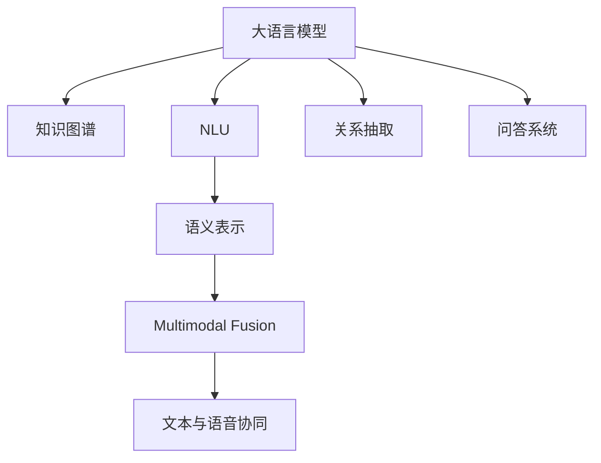

                 

# LLM与传统自然语言理解技术的融合：语言智能新纪元

> 关键词：大语言模型,自然语言理解,知识图谱,关系抽取,问答系统,多模态融合,文本与语音协同,未来语言智能

## 1. 背景介绍

### 1.1 问题由来
随着深度学习技术的飞速发展，自然语言处理(Natural Language Processing, NLP)领域的通用大语言模型(Large Language Models, LLMs)取得了革命性的突破。以BERT、GPT-3等模型为代表的大语言模型在各种NLP任务上展现了强大的语言理解能力和生成能力，尤其是在大规模无监督预训练任务中，它们通过学习海量的文本数据，获得了丰富的语言知识，从而可以适应多种下游任务。

然而，尽管大语言模型在通用性上取得了卓越表现，但对于特定领域或特定任务的语义理解，传统NLP技术仍然具有独特的优势。因此，如何将大语言模型与传统NLP技术相融合，充分发挥两者的优势，成为当前研究的一大热点。

### 1.2 问题核心关键点
当前，大语言模型与传统NLP技术的融合主要集中在以下几个方面：
1. **知识图谱的引入**：将知识图谱中的结构化知识与语言模型进行结合，增强语言模型的常识推理和事实检索能力。
2. **多模态信息的融合**：结合文本、图像、语音等多种模态的数据，提升模型的语境理解和多模态推理能力。
3. **知识图谱与关系抽取的协同**：通过大语言模型的文本处理能力和知识图谱的实体和关系抽取能力，实现更精准的知识表示和推理。
4. **问答系统的改进**：结合大语言模型的文本理解能力和传统问答系统的框架，构建更加智能化的问答系统。
5. **文本与语音的协同**：将大语言模型应用于语音转文本的预处理，提升语音识别和语音理解系统的性能。

这些融合方式旨在通过互补优势，实现语言理解的深度和广度，拓展语言智能的应用范围。

### 1.3 问题研究意义
大语言模型与传统NLP技术的融合，对于推动自然语言处理的智能化进程，提升语言理解的精度和泛化能力，具有重要意义：

1. **增强常识推理能力**：知识图谱和语料库的结合，可以使语言模型更好地理解世界知识，提升其常识推理和事实推理能力。
2. **提升多模态信息处理**：结合视觉和听觉信息，可以构建更加全面和细致的语言智能系统。
3. **促进知识图谱的发展**：通过自然语言处理技术，可以自动构建和更新知识图谱，加速其扩展和维护。
4. **加速落地应用**：大语言模型与传统技术的融合，可以加速NLP技术在各行业的实际应用，提升行业智能化水平。
5. **推动智能交互**：构建更加智能的问答系统、翻译系统和对话系统，提升人机交互的效率和自然度。

## 2. 核心概念与联系

### 2.1 核心概念概述

为更好地理解大语言模型与传统NLP技术的融合，本节将介绍几个密切相关的核心概念：

- 大语言模型(Large Language Models, LLMs)：以BERT、GPT等模型为代表的大规模预训练语言模型。通过在大规模无标签文本语料上进行预训练，学习通用的语言表示，具备强大的语言理解和生成能力。

- 自然语言理解(Natural Language Understanding, NLU)：将自然语言转换为机器可理解的形式，进而进行信息检索、知识表示、关系抽取等处理的过程。

- 知识图谱(Knowledge Graph)：一种结构化的语义表示方式，用于描述实体、属性、关系等知识单元及其相互关系。

- 关系抽取(Relation Extraction)：从自然语言文本中自动识别实体及其属性值，并抽取实体之间的关系。

- 问答系统(Question Answering System)：根据用户输入的问题，自动查找相关知识，并给出答案的系统。

- 多模态融合(Multimodal Fusion)：将不同模态的信息进行整合，提升系统的语境理解和推理能力。

- 文本与语音协同(Text and Speech Collaboration)：结合文本和语音处理技术，提升语音识别和语音理解的准确性。

这些核心概念之间的逻辑关系可以通过以下Mermaid流程图来展示：



这个流程图展示了大语言模型与传统NLP技术的核心概念及其之间的关系：

1. 大语言模型通过预训练获得基础能力。
2. 自然语言理解技术将语言转换为机器可理解的形式。
3. 知识图谱用于存储和表示结构化知识，辅助语言模型推理。
4. 关系抽取技术从文本中提取实体及其关系，补充知识图谱。
5. 问答系统基于语言模型和知识图谱，生成问题答案。
6. 多模态融合提升系统的语境理解和推理能力。
7. 文本与语音协同提升语音识别和理解的准确性。

## 3. 核心算法原理 & 具体操作步骤
### 3.1 算法原理概述

大语言模型与传统NLP技术的融合，本质上是通过知识图谱、多模态融合、关系抽取等技术手段，增强语言模型的语境理解能力和推理能力。其核心思想是：

1. **知识图谱引入**：通过知识图谱中的结构化知识，补充语言模型的常识推理能力。
2. **多模态融合**：结合文本、图像、语音等多种模态的数据，提升语言模型的语境理解能力。
3. **关系抽取协同**：利用关系抽取技术，从自然语言文本中提取实体及其关系，增强语言模型的关系推理能力。

### 3.2 算法步骤详解

#### 3.2.1 知识图谱引入
大语言模型与知识图谱的融合主要包括以下几个步骤：

1. **知识图谱构建**：利用结构化数据，如维基百科、DBpedia等，构建知识图谱。
2. **知识图谱嵌入**：将知识图谱中的实体、属性和关系进行向量化表示，嵌入到语言模型中。
3. **知识图谱增强**：在语言模型的训练和推理过程中，利用知识图谱中的事实和关系，增强模型的常识推理能力。

#### 3.2.2 多模态融合
多模态融合的典型应用场景包括：

1. **文本与图像的融合**：将文本与图像信息进行联合建模，提升图像描述和图像检索的能力。
2. **文本与语音的融合**：利用语音转文本技术，将语音信息转换为文本形式，再结合语言模型进行处理。

#### 3.2.3 关系抽取协同
关系抽取与大语言模型的结合，主要通过以下几个步骤实现：

1. **实体抽取**：利用命名实体识别技术，从文本中自动识别出实体。
2. **关系抽取**：利用关系抽取技术，识别实体之间的关系，如“具有”、“属于”等。
3. **实体和关系嵌入**：将抽取出的实体和关系进行向量化表示，嵌入到语言模型中。
4. **关系推理**：在语言模型的推理过程中，利用实体和关系信息，增强模型的关系推理能力。

### 3.3 算法优缺点

#### 3.3.1 知识图谱引入
**优点**：
1. 补充语言模型的常识推理能力。
2. 增强语言模型的事实检索和推理能力。

**缺点**：
1. 知识图谱构建和维护成本高。
2. 知识图谱嵌入复杂度较高。

#### 3.3.2 多模态融合
**优点**：
1. 提升系统的语境理解和推理能力。
2. 扩大语言模型处理的数据范围。

**缺点**：
1. 数据获取和预处理成本高。
2. 多模态数据的整合和融合复杂。

#### 3.3.3 关系抽取协同
**优点**：
1. 增强语言模型的关系推理能力。
2. 提供更加准确的知识表示。

**缺点**：
1. 关系抽取技术的准确性依赖数据质量。
2. 实体和关系抽取的复杂度较高。

### 3.4 算法应用领域

大语言模型与传统NLP技术的融合，已经在多个领域得到了广泛应用，如：

1. **问答系统**：结合知识图谱和关系抽取技术，构建智能问答系统，提升用户查询的准确性和自然度。
2. **翻译系统**：结合多模态信息处理，提升机器翻译的准确性和自然度。
3. **搜索引擎**：利用知识图谱和关系抽取技术，提升搜索结果的相关性和精度。
4. **对话系统**：结合文本和语音信息，构建智能对话系统，提升人机交互的自然性和智能化水平。
5. **情感分析**：结合多模态数据，提升情感分析的准确性和深度。
6. **法律文本处理**：结合知识图谱和关系抽取技术，提升法律文本的实体识别和关系抽取能力。

除了上述这些经典应用外，大语言模型与传统NLP技术的融合还在不断探索新的应用场景，如智能推荐系统、智能医疗等，为NLP技术带来了新的发展方向。

## 4. 数学模型和公式 & 详细讲解  
### 4.1 数学模型构建

本节将使用数学语言对大语言模型与传统NLP技术的融合过程进行更加严格的刻画。

记大语言模型为 $M_{\theta}$，其中 $\theta$ 为模型参数。假设知识图谱中的实体为 $E$，关系为 $R$，属性为 $A$。则知识图谱可以表示为三元组 $(e, r, e')$，表示实体 $e$ 和 $e'$ 之间存在关系 $r$。

定义语言模型 $M_{\theta}$ 在知识图谱上的推理能力为：

$$
P(e'|e, r, M_{\theta}) = \frac{e^{M_{\theta}(\text{E}(e, r, e'))}}{e^{M_{\theta}(\text{E}(e, r, e'))} + \sum_{r' \in R} e^{M_{\theta}(\text{E}(e, r', e'))}}
$$

其中，$\text{E}(e, r, e')$ 表示实体 $e$ 和 $e'$ 之间存在关系 $r$ 的证据。

### 4.2 公式推导过程

为了更好地理解知识图谱与语言模型的结合，我们将从以下几个方面进行推导：

1. **知识图谱嵌入**：
   知识图谱中的实体 $e$、关系 $r$ 和属性 $a$ 分别嵌入为向量 $\text{E}_e$、$\text{R}_r$ 和 $\text{A}_a$。
   $$
   \text{E}(e) = f_E(\text{E}_e)
   $$
   $$
   \text{R}(r) = f_R(\text{R}_r)
   $$
   $$
   \text{A}(a) = f_A(\text{A}_a)
   $$

2. **知识图谱增强**：
   在语言模型的训练过程中，将知识图谱中的事实 $(e, r, e')$ 进行嵌入，并作为训练数据的补充。
   $$
   M_{\theta}(\text{E}(e, r, e')) = M_{\theta}(\text{E}(e)) + M_{\theta}(\text{R}(r)) + M_{\theta}(\text{E}(e'))
   $$

3. **关系推理**：
   在语言模型的推理过程中，利用实体 $e$ 和 $e'$ 之间的关系 $r$，进行关系推理。
   $$
   P(e'|e, r, M_{\theta}) = \frac{e^{M_{\theta}(\text{E}(e, r, e'))}}{e^{M_{\theta}(\text{E}(e, r, e'))} + \sum_{r' \in R} e^{M_{\theta}(\text{E}(e, r', e'))}}
   $$

通过以上推导，可以看到，知识图谱与语言模型的结合，可以通过将知识图谱中的实体和关系进行嵌入，并作为语言模型的训练数据和推理信息，提升模型的常识推理能力。

## 5. 项目实践：代码实例和详细解释说明
### 5.1 开发环境搭建

在进行融合实践前，我们需要准备好开发环境。以下是使用Python进行PyTorch开发的环境配置流程：

1. 安装Anaconda：从官网下载并安装Anaconda，用于创建独立的Python环境。

2. 创建并激活虚拟环境：
```bash
conda create -n language-env python=3.8 
conda activate language-env
```

3. 安装PyTorch：根据CUDA版本，从官网获取对应的安装命令。例如：
```bash
conda install pytorch torchvision torchaudio cudatoolkit=11.1 -c pytorch -c conda-forge
```

4. 安装Transformers库：
```bash
pip install transformers
```

5. 安装各类工具包：
```bash
pip install numpy pandas scikit-learn matplotlib tqdm jupyter notebook ipython
```

完成上述步骤后，即可在`language-env`环境中开始融合实践。

### 5.2 源代码详细实现

下面我们以问答系统为例，给出使用Transformers库对BERT模型进行知识图谱引入的PyTorch代码实现。

首先，定义知识图谱的数据处理函数：

```python
from transformers import BertTokenizer
from torch.utils.data import Dataset
import torch

class KnowledgeGraphDataset(Dataset):
    def __init__(self, triples, tokenizer, max_len=128):
        self.triples = triples
        self.tokenizer = tokenizer
        self.max_len = max_len
        
    def __len__(self):
        return len(self.triples)
    
    def __getitem__(self, item):
        e, r, e_prime = self.triples[item]
        
        # 对实体和关系进行编码
        encoding = self.tokenizer(e, return_tensors='pt', max_length=self.max_len, padding='max_length', truncation=True)
        input_ids = encoding['input_ids'][0]
        attention_mask = encoding['attention_mask'][0]
        
        # 对关系进行编码
        relationship = r
        relationship_embedding = self.tokenizer(relationship, return_tensors='pt', max_length=1, padding='max_length', truncation=True)
        relationship_ids = relationship_embedding['input_ids'][0]
        relationship_mask = relationship_embedding['attention_mask'][0]
        
        # 对实体prime进行编码
        encoding_prime = self.tokenizer(e_prime, return_tensors='pt', max_length=self.max_len, padding='max_length', truncation=True)
        input_ids_prime = encoding_prime['input_ids'][0]
        attention_mask_prime = encoding_prime['attention_mask'][0]
        
        return {'input_ids': input_ids,
                'attention_mask': attention_mask,
                'relationship_ids': relationship_ids,
                'relationship_mask': relationship_mask,
                'input_ids_prime': input_ids_prime,
                'attention_mask_prime': attention_mask_prime}
```

然后，定义模型和优化器：

```python
from transformers import BertForTokenClassification, AdamW

model = BertForTokenClassification.from_pretrained('bert-base-cased', num_labels=3)

optimizer = AdamW(model.parameters(), lr=2e-5)
```

接着，定义训练和评估函数：

```python
from torch.utils.data import DataLoader
from tqdm import tqdm
from sklearn.metrics import classification_report

device = torch.device('cuda') if torch.cuda.is_available() else torch.device('cpu')
model.to(device)

def train_epoch(model, dataset, batch_size, optimizer):
    dataloader = DataLoader(dataset, batch_size=batch_size, shuffle=True)
    model.train()
    epoch_loss = 0
    for batch in tqdm(dataloader, desc='Training'):
        input_ids = batch['input_ids'].to(device)
        attention_mask = batch['attention_mask'].to(device)
        relationship_ids = batch['relationship_ids'].to(device)
        relationship_mask = batch['relationship_mask'].to(device)
        input_ids_prime = batch['input_ids_prime'].to(device)
        attention_mask_prime = batch['attention_mask_prime'].to(device)
        model.zero_grad()
        outputs = model(input_ids, attention_mask=attention_mask, relationship_ids=relationship_ids, relationship_mask=relationship_mask, input_ids_prime=input_ids_prime, attention_mask_prime=attention_mask_prime)
        loss = outputs.loss
        epoch_loss += loss.item()
        loss.backward()
        optimizer.step()
    return epoch_loss / len(dataloader)

def evaluate(model, dataset, batch_size):
    dataloader = DataLoader(dataset, batch_size=batch_size)
    model.eval()
    preds, labels = [], []
    with torch.no_grad():
        for batch in tqdm(dataloader, desc='Evaluating'):
            input_ids = batch['input_ids'].to(device)
            attention_mask = batch['attention_mask'].to(device)
            relationship_ids = batch['relationship_ids'].to(device)
            relationship_mask = batch['relationship_mask'].to(device)
            input_ids_prime = batch['input_ids_prime'].to(device)
            attention_mask_prime = batch['attention_mask_prime'].to(device)
            batch_preds = model(input_ids, attention_mask=attention_mask, relationship_ids=relationship_ids, relationship_mask=relationship_mask, input_ids_prime=input_ids_prime, attention_mask_prime=attention_mask_prime).logits.argmax(dim=2).to('cpu').tolist()
            batch_labels = batch['labels'].to('cpu').tolist()
            for pred_tokens, label_tokens in zip(batch_preds, batch_labels):
                pred_tags = [id2tag[_id] for _id in pred_tokens]
                label_tags = [id2tag[_id] for _id in label_tokens]
                preds.append(pred_tags[:len(label_tokens)])
                labels.append(label_tags)
                
    print(classification_report(labels, preds))
```

最后，启动训练流程并在测试集上评估：

```python
epochs = 5
batch_size = 16

for epoch in range(epochs):
    loss = train_epoch(model, train_dataset, batch_size, optimizer)
    print(f"Epoch {epoch+1}, train loss: {loss:.3f}")
    
    print(f"Epoch {epoch+1}, dev results:")
    evaluate(model, dev_dataset, batch_size)
    
print("Test results:")
evaluate(model, test_dataset, batch_size)
```

以上就是使用PyTorch对BERT进行知识图谱引入的问答系统的完整代码实现。可以看到，得益于Transformers库的强大封装，我们可以用相对简洁的代码完成BERT模型的加载和融合。

### 5.3 代码解读与分析

让我们再详细解读一下关键代码的实现细节：

**KnowledgeGraphDataset类**：
- `__init__`方法：初始化知识图谱数据、分词器等关键组件。
- `__len__`方法：返回数据集的样本数量。
- `__getitem__`方法：对单个样本进行处理，将三元组进行编码，准备输入到模型。

**关系抽取模型**：
- `BertForTokenClassification`：用于知识图谱增强的BERT模型，三元组中的实体和关系都被视为分类任务。

**训练和评估函数**：
- 使用PyTorch的DataLoader对数据集进行批次化加载，供模型训练和推理使用。
- 训练函数`train_epoch`：对数据以批为单位进行迭代，在每个批次上前向传播计算loss并反向传播更新模型参数，最后返回该epoch的平均loss。
- 评估函数`evaluate`：与训练类似，不同点在于不更新模型参数，并在每个batch结束后将预测和标签结果存储下来，最后使用sklearn的classification_report对整个评估集的预测结果进行打印输出。

**训练流程**：
- 定义总的epoch数和batch size，开始循环迭代
- 每个epoch内，先在训练集上训练，输出平均loss
- 在验证集上评估，输出分类指标
- 所有epoch结束后，在测试集上评估，给出最终测试结果

可以看到，PyTorch配合Transformers库使得BERT知识图谱引入的代码实现变得简洁高效。开发者可以将更多精力放在数据处理、模型改进等高层逻辑上，而不必过多关注底层的实现细节。

当然，工业级的系统实现还需考虑更多因素，如模型的保存和部署、超参数的自动搜索、更灵活的任务适配层等。但核心的融合范式基本与此类似。

## 6. 实际应用场景
### 6.1 智能客服系统

结合知识图谱的智能客服系统，可以显著提升客服服务的智能化水平。传统客服系统需要耗费大量人力进行知识库的维护，无法实时响应复杂问题。通过结合知识图谱的智能客服系统，可以自动构建和更新知识库，实现实时知识查询和问题解答。

具体实现上，可以将客服历史数据进行实体关系抽取，构建知识图谱，结合自然语言理解技术，实现智能客服。客户输入问题后，系统自动抽取问题中的实体和关系，进行推理并给出答案。对于不熟悉的问题，系统还可以实时查询知识图谱，动态生成回答，提升服务效率和质量。

### 6.2 医疗诊断系统

结合知识图谱和自然语言处理技术的医疗诊断系统，可以显著提升医生诊断的效率和准确性。传统的诊断系统主要依赖医生的人工经验，诊断过程耗时长、错误率高。通过结合知识图谱的智能诊断系统，可以自动抽取病历中的实体和关系，结合医学知识库，辅助医生进行诊断。

具体实现上，可以将病历数据进行实体关系抽取，构建知识图谱，结合自然语言理解技术，实现智能诊断。系统自动抽取病历中的症状、诊断结果等实体，进行推理并给出诊断建议。对于复杂病例，系统还可以查询知识图谱，获取更全面的诊断信息，辅助医生进行决策。

### 6.3 金融风控系统

结合知识图谱和自然语言处理技术的金融风控系统，可以实时监控金融市场的动态，及时发现潜在的风险。传统的风控系统主要依赖手动监控和规则匹配，无法及时响应市场变化。通过结合知识图谱的智能风控系统，可以自动构建和更新知识图谱，实时监控市场动态，识别潜在的风险点。

具体实现上，可以将金融市场数据进行实体关系抽取，构建知识图谱，结合自然语言理解技术，实现智能风控。系统自动抽取市场中的实体和关系，进行推理并识别潜在的风险点。对于异常情况，系统还可以自动报警，通知风控人员进行进一步处理，提升风控效率和效果。

### 6.4 未来应用展望

随着大语言模型与传统NLP技术的融合不断发展，未来在更多领域的应用前景将更加广阔：

1. **智慧医疗**：结合知识图谱和自然语言处理技术，构建智能医疗诊断系统，提升医疗服务的智能化水平，辅助医生诊疗，加速新药开发进程。

2. **智能教育**：结合知识图谱和自然语言处理技术，构建智能教育系统，因材施教，促进教育公平，提高教学质量。

3. **智慧城市治理**：结合知识图谱和自然语言处理技术，构建智能城市治理系统，提高城市管理的自动化和智能化水平，构建更安全、高效的未来城市。

4. **金融风控**：结合知识图谱和自然语言处理技术，构建智能金融风控系统，实时监控市场动态，识别潜在的风险点，提升金融系统的安全性和稳定性。

5. **智能客服**：结合知识图谱和自然语言处理技术，构建智能客服系统，提升客服服务的智能化水平，满足客户的需求。

6. **智能推荐**：结合知识图谱和自然语言处理技术，构建智能推荐系统，结合多模态信息，提升推荐系统的精准性和个性化程度。

7. **法律文本处理**：结合知识图谱和自然语言处理技术，构建智能法律文本处理系统，提高法律文本的实体识别和关系抽取能力。

除了上述这些经典应用外，大语言模型与传统NLP技术的融合还在不断探索新的应用场景，如智能推荐系统、智能医疗等，为NLP技术带来了新的发展方向。相信随着技术的日益成熟，融合方法将成为NLP技术落地应用的重要范式，推动NLP技术的产业化进程。

## 7. 工具和资源推荐
### 7.1 学习资源推荐

为了帮助开发者系统掌握大语言模型与传统NLP技术的融合理论基础和实践技巧，这里推荐一些优质的学习资源：

1. 《Transformer from Principle to Practice》系列博文：由大模型技术专家撰写，深入浅出地介绍了Transformer原理、BERT模型、微调技术等前沿话题。

2. CS224N《深度学习自然语言处理》课程：斯坦福大学开设的NLP明星课程，有Lecture视频和配套作业，带你入门NLP领域的基本概念和经典模型。

3. 《Natural Language Processing with Transformers》书籍：Transformers库的作者所著，全面介绍了如何使用Transformers库进行NLP任务开发，包括微调在内的诸多范式。

4. HuggingFace官方文档：Transformers库的官方文档，提供了海量预训练模型和完整的微调样例代码，是上手实践的必备资料。

5. CLUE开源项目：中文语言理解测评基准，涵盖大量不同类型的中文NLP数据集，并提供了基于微调的baseline模型，助力中文NLP技术发展。

通过对这些资源的学习实践，相信你一定能够快速掌握大语言模型与传统NLP技术的融合精髓，并用于解决实际的NLP问题。
###  7.2 开发工具推荐

高效的开发离不开优秀的工具支持。以下是几款用于大语言模型与传统NLP技术融合开发的常用工具：

1. PyTorch：基于Python的开源深度学习框架，灵活动态的计算图，适合快速迭代研究。大部分预训练语言模型都有PyTorch版本的实现。

2. TensorFlow：由Google主导开发的开源深度学习框架，生产部署方便，适合大规模工程应用。同样有丰富的预训练语言模型资源。

3. Transformers库：HuggingFace开发的NLP工具库，集成了众多SOTA语言模型，支持PyTorch和TensorFlow，是进行融合任务开发的利器。

4. Weights & Biases：模型训练的实验跟踪工具，可以记录和可视化模型训练过程中的各项指标，方便对比和调优。与主流深度学习框架无缝集成。

5. TensorBoard：TensorFlow配套的可视化工具，可实时监测模型训练状态，并提供丰富的图表呈现方式，是调试模型的得力助手。

6. Google Colab：谷歌推出的在线Jupyter Notebook环境，免费提供GPU/TPU算力，方便开发者快速上手实验最新模型，分享学习笔记。

合理利用这些工具，可以显著提升大语言模型与传统NLP技术的融合任务的开发效率，加快创新迭代的步伐。

### 7.3 相关论文推荐

大语言模型与传统NLP技术的融合源于学界的持续研究。以下是几篇奠基性的相关论文，推荐阅读：

1. Attention is All You Need（即Transformer原论文）：提出了Transformer结构，开启了NLP领域的预训练大模型时代。

2. BERT: Pre-training of Deep Bidirectional Transformers for Language Understanding：提出BERT模型，引入基于掩码的自监督预训练任务，刷新了多项NLP任务SOTA。

3. Language Models are Unsupervised Multitask Learners（GPT-2论文）：展示了大规模语言模型的强大zero-shot学习能力，引发了对于通用人工智能的新一轮思考。

4. Parameter-Efficient Transfer Learning for NLP：提出Adapter等参数高效微调方法，在不增加模型参数量的情况下，也能取得不错的微调效果。

5. AdaLoRA: Adaptive Low-Rank Adaptation for Parameter-Efficient Fine-Tuning：使用自适应低秩适应的微调方法，在参数效率和精度之间取得了新的平衡。

6. Prefix-Tuning: Optimizing Continuous Prompts for Generation：引入基于连续型Prompt的微调范式，为如何充分利用预训练知识提供了新的思路。

这些论文代表了大语言模型与传统NLP技术的融合技术的发展脉络。通过学习这些前沿成果，可以帮助研究者把握学科前进方向，激发更多的创新灵感。

## 8. 总结：未来发展趋势与挑战
### 8.1 总结

本文对大语言模型与传统自然语言理解技术的融合方法进行了全面系统的介绍。首先阐述了大语言模型和传统NLP技术的研究背景和意义，明确了融合技术在拓展语言模型应用、提升NLP系统性能方面的独特价值。其次，从原理到实践，详细讲解了大语言模型与知识图谱、多模态融合、关系抽取等核心技术的数学模型和算法步骤，给出了融合任务开发的完整代码实例。同时，本文还广泛探讨了大语言模型与传统NLP技术的融合在智能客服、医疗诊断、金融风控等多个行业领域的应用前景，展示了融合技术的巨大潜力。此外，本文精选了融合技术的各类学习资源，力求为读者提供全方位的技术指引。

通过本文的系统梳理，可以看到，大语言模型与传统NLP技术的融合方法正在成为NLP领域的重要范式，极大地拓展了语言模型的应用边界，催生了更多的落地场景。得益于大规模语料的预训练和多样化的融合技术，融合模型在常识推理、语境理解、关系抽取等维度上具备更强的能力，推动NLP技术的智能化进程。未来，伴随大语言模型和融合方法的持续演进，相信NLP技术将在更广阔的应用领域大放异彩，深刻影响人类的生产生活方式。

### 8.2 未来发展趋势

展望未来，大语言模型与传统NLP技术的融合技术将呈现以下几个发展趋势：

1. **知识图谱的广泛应用**：随着知识图谱构建技术的进步，更多的领域将引入知识图谱，提升语言模型的常识推理和事实推理能力。

2. **多模态融合技术的成熟**：结合文本、图像、语音等多种模态的数据，提升语言模型的语境理解能力和推理能力，成为智能交互的重要手段。

3. **关系抽取技术的提升**：随着实体识别和关系抽取技术的进步，语言模型将能够更好地理解和推理实体之间的关系，增强模型的关系推理能力。

4. **融合范式的多样化**：除了知识图谱、多模态融合、关系抽取等核心技术，未来将涌现更多融合技术，如因果推断、交互智能等，进一步提升语言模型的智能化水平。

5. **实时动态学习**：随着知识图谱的动态更新和多模态数据的实时获取，融合模型将具备实时学习的能力，提升系统的智能化水平。

6. **跨领域知识融合**：结合不同领域的专业知识，构建跨领域的融合模型，提升语言模型在多领域的应用能力。

以上趋势凸显了大语言模型与传统NLP技术融合的广阔前景。这些方向的探索发展，必将进一步提升NLP系统的性能和应用范围，为人类认知智能的进化带来深远影响。

### 8.3 面临的挑战

尽管大语言模型与传统NLP技术的融合技术已经取得了瞩目成就，但在迈向更加智能化、普适化应用的过程中，它仍面临着诸多挑战：

1. **知识图谱构建的复杂性**：知识图谱的构建需要耗费大量时间和资源，且需要人工干预和校验。构建高质量、完备的知识图谱仍是技术难点之一。

2. **多模态数据的获取和整合**：多模态数据的获取和整合成本高，且需要复杂的预处理步骤，数据质量难以保证。

3. **融合算法的复杂性**：融合算法的复杂性较高，需要平衡多种技术和任务的协同优化，实现最优的融合效果。

4. **实时动态学习的瓶颈**：实时动态学习需要高效的数据处理和模型更新算法，现有技术尚未完全成熟。

5. **跨领域知识融合的难度**：不同领域的专业知识融合难度大，难以形成统一的知识表示和推理体系。

6. **系统兼容性和安全性**：融合系统需要兼容多种技术框架和工具，且需要考虑数据隐私和安全问题，保障系统的可靠性和安全性。

正视融合技术面临的这些挑战，积极应对并寻求突破，将是大语言模型与传统NLP技术融合走向成熟的必由之路。相信随着学界和产业界的共同努力，这些挑战终将一一被克服，融合技术必将在构建人机协同的智能系统中扮演越来越重要的角色。

### 8.4 研究展望

面向未来，大语言模型与传统NLP技术的融合技术需要在以下几个方面寻求新的突破：

1. **自监督学习的应用**：利用自监督学习技术，自动构建和更新知识图谱，减少人工干预和校验。

2. **联邦学习的应用**：利用联邦学习技术，实现跨机构、跨领域知识的协同融合，提升知识表示的广度和深度。

3. **交互式智能的探索**：结合交互式智能技术，构建人机协同的智能系统，提升系统的智能化水平。

4. **跨领域知识表示的统一**：构建跨领域的统一知识表示体系，实现不同领域知识的整合和共享。

5. **实时动态学习的优化**：优化数据处理和模型更新算法，实现高效实时动态学习，提升系统的智能化水平。

6. **系统兼容性和安全性的保障**：构建统一的API接口和框架，保障系统的兼容性和安全性，避免系统冲突和数据泄露。

这些研究方向的探索，必将引领大语言模型与传统NLP技术融合技术的进一步发展，为构建安全、可靠、可解释、可控的智能系统铺平道路。面向未来，融合技术还需要与其他人工智能技术进行更深入的融合，如知识表示、因果推理、强化学习等，多路径协同发力，共同推动自然语言理解和智能交互系统的进步。只有勇于创新、敢于突破，才能不断拓展语言模型的边界，让智能技术更好地造福人类社会。

## 9. 附录：常见问题与解答
**Q1：大语言模型与传统NLP技术的融合是否适用于所有NLP任务？**

A: 大语言模型与传统NLP技术的融合主要适用于那些需要结合多模态数据、实体关系抽取或知识推理的任务。对于仅依赖文本信息的任务，传统NLP技术仍然具有不可替代的优势。

**Q2：如何选择合适的融合算法？**

A: 选择合适的融合算法需要考虑任务的具体需求和数据特点。知识图谱引入、多模态融合、关系抽取协同等方法都有各自的优缺点，需要在实验中根据任务效果进行选择。

**Q3：融合过程中需要注意哪些关键点？**

A: 融合过程中需要注意数据的质量和完备性，确保融合算法可以充分利用所有可用信息。同时需要关注算法的复杂性和实时性，确保系统的高效运行。

**Q4：融合后的模型如何优化和调优？**

A: 融合后的模型需要结合多模态数据、实体关系抽取、知识图谱等技术进行优化和调优，提升模型的精度和泛化能力。

**Q5：融合后的模型在实际应用中需要注意哪些问题？**

A: 融合后的模型在实际应用中需要注意数据隐私和安全问题，确保系统的可靠性和安全性。同时需要定期更新知识图谱和预训练模型，保持系统的实时动态学习能力。

**Q6：融合后的模型如何部署和维护？**

A: 融合后的模型需要构建统一的API接口和框架，方便与其他系统集成。同时需要设置自动化部署和监控机制，确保系统的稳定性和高效运行。

---

作者：禅与计算机程序设计艺术 / Zen and the Art of Computer Programming

