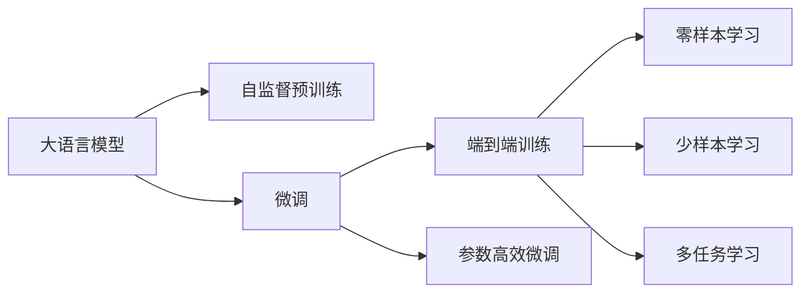

                 

# LLM与语言翻译：跨越语言障碍的桥梁

大语言模型（Large Language Models, LLMs）正在以惊人的速度改变着人工智能（AI）的面貌，尤其是在自然语言处理（NLP）领域。本文将深入探讨大语言模型在语言翻译中的关键应用，以及其背后的核心概念与算法原理。通过一系列的技术细节和实际案例，本文将帮助读者全面理解大语言模型如何成为跨越语言障碍的桥梁。

## 1. 背景介绍

### 1.1 问题由来
语言翻译一直是人类社会中的一大难题。尽管过去几十年中，机器翻译（Machine Translation, MT）技术得到了长足的发展，但仍然存在诸多挑战。传统的统计机器翻译（Statistical Machine Translation, SMT）依赖大规模的双语平行语料，对数据质量和规模要求极高，难以适用于新兴语言对或资源稀缺的领域。而基于神经网络的机器翻译（Neural Machine Translation, NMT）虽然在处理大规模语料方面展现了巨大潜力，但对于小型或非标准语料，其泛化能力依然不足。

随着深度学习技术的成熟，大语言模型（如GPT、BERT等）逐渐成为语言翻译的新兴力量。相比于传统模型，大语言模型具备以下优势：
- 数据需求低：能够在大量无标签文本数据上进行预训练，学习语言的基础规律和常识。
- 泛化能力强：能够在大规模语料上进行微调，提升在不同语境和领域的翻译能力。
- 训练成本低：可以复用预训练模型，减少从头训练的成本。

本文将深入探讨大语言模型在语言翻译中的原理、算法和应用。

### 1.2 问题核心关键点
大语言模型在语言翻译中的核心关键点在于其预训练-微调的机制。具体来说，大语言模型首先通过预训练学习到广泛的语言知识，然后通过微调针对特定语言的翻译任务进行优化，提升翻译的准确性和流畅性。这一过程包括以下几个步骤：
1. **预训练**：在大量无标签文本数据上学习语言的基础表示。
2. **微调**：在特定语言的翻译任务上，利用少量标注数据进行优化。
3. **细粒度微调**：进一步在特定领域的翻译任务上进行微调，提升翻译的领域适应性。
4. **端到端训练**：将预训练和微调过程统一到一个端到端的训练框架中，提升模型的整体性能。

## 2. 核心概念与联系

### 2.1 核心概念概述

为了更好地理解大语言模型在语言翻译中的应用，我们需要掌握几个核心概念：

- **大语言模型（LLM）**：指使用Transformer等架构的预训练模型，能够在大规模无标签文本数据上进行预训练，学习到语言的高级表示。
- **自监督预训练**：指在无标签文本数据上，通过自监督任务（如掩码语言模型、下一个词预测等）进行预训练，学习语言的统计规律和常识。
- **微调（Fine-tuning）**：指在大语言模型的基础上，通过有监督学习任务进行优化，使其在特定语言或领域的翻译任务上表现更好。
- **端到端训练（End-to-End Training）**：将预训练和微调过程结合，通过统一的目标函数进行训练，提升模型的整体性能。
- **参数高效微调（Parameter-Efficient Fine-tuning, PEFT）**：在微调过程中，只更新小部分模型参数，固定大部分预训练权重，以提高微调效率和模型泛化能力。
- **零样本学习（Zero-shot Learning）**：在模型未见过的语言对上，仅通过任务描述即能进行翻译。
- **少样本学习（Few-shot Learning）**：在模型仅见过的少量样本上进行微调，以提升翻译性能。
- **多任务学习（Multi-task Learning）**：在多个语言翻译任务上进行联合训练，共享参数，提高模型的多任务泛化能力。

这些核心概念构成了大语言模型在语言翻译中的基础架构，通过理解这些概念，我们可以更好地掌握其原理和应用。

### 2.2 核心概念原理和架构的 Mermaid 流程图



## 3. 核心算法原理 & 具体操作步骤

### 3.1 算法原理概述

大语言模型在语言翻译中的应用，主要基于两个原理：
1. **自监督预训练**：在大量无标签文本数据上进行预训练，学习语言的统计规律和常识。
2. **微调**：在特定语言的翻译任务上，通过有监督学习进行优化，提升翻译的准确性和流畅性。

具体来说，大语言模型首先在大规模无标签文本数据上进行自监督预训练，学习到语言的高级表示。然后，在特定语言的翻译任务上，利用少量标注数据进行微调，通过有监督学习任务优化模型，提升其翻译能力。最后，通过细粒度微调或端到端训练，进一步提升模型在特定领域的翻译能力。

### 3.2 算法步骤详解

#### 3.2.1 预训练阶段

预训练阶段主要包括以下步骤：
1. **数据准备**：收集大规模的无标签文本数据，通常是使用互联网爬虫或公开数据集获取。
2. **模型选择**：选择合适的预训练模型，如BERT、GPT等。
3. **预训练任务**：选择适当的自监督预训练任务，如掩码语言模型、下一个词预测等。
4. **模型训练**：在预训练任务上，使用优化算法（如AdamW、SGD等）进行训练，最小化预训练损失。

#### 3.2.2 微调阶段

微调阶段主要包括以下步骤：
1. **任务适配层设计**：根据目标语言的特点，设计合适的输出层和损失函数。
2. **数据准备**：收集目标语言的翻译任务数据，通常包括源语言文本和目标语言文本的平行语料。
3. **模型加载**：将预训练模型加载到计算设备（如GPU、TPU等）中，准备微调。
4. **微调训练**：在微调数据上，使用优化算法进行训练，最小化翻译损失。
5. **参数冻结**：根据任务需求，冻结部分预训练权重，只更新微调权重。
6. **微调评估**：在验证集和测试集上评估模型性能，调整超参数，直到达到最佳性能。

### 3.3 算法优缺点

大语言模型在语言翻译中的应用具有以下优点：
1. **泛化能力强**：通过预训练和微调，大语言模型能够适应多种语言和领域的翻译任务。
2. **训练成本低**：可以利用已有预训练模型，减少从头训练的资源投入。
3. **端到端训练**：将预训练和微调过程结合，提升模型的整体性能。
4. **参数高效微调**：通过只更新部分参数，提高微调效率和模型泛化能力。

同时，也存在一些缺点：
1. **数据依赖性强**：微调效果很大程度上依赖于标注数据的质量和数量，获取高质量标注数据的成本较高。
2. **模型规模大**：预训练模型参数量巨大，对计算资源和存储资源有较高要求。
3. **过拟合风险**：微调过程中，模型容易过拟合于训练数据，泛化能力有限。
4. **迁移能力有限**：预训练模型的固有偏见和有害信息可能通过微调传递到下游任务。

### 3.4 算法应用领域

大语言模型在语言翻译中的应用领域广泛，主要包括：
1. **跨语言翻译**：将一种语言的文本翻译成另一种语言，如英中、日韩等。
2. **低资源语言翻译**：针对资源稀缺或未被广泛研究的语言进行翻译，如土著语言、古代文献等。
3. **领域特定翻译**：针对特定领域的翻译任务进行优化，如法律、医学、金融等。
4. **实时翻译**：在实时对话或会议中，提供即时的语言翻译服务。
5. **跨语言信息检索**：在多语言环境中，提供跨语言的搜索引擎和信息检索服务。

## 4. 数学模型和公式 & 详细讲解

### 4.1 数学模型构建

假设预训练语言模型为 $M_{\theta}$，其中 $\theta$ 为预训练得到的模型参数。给定目标语言的翻译任务数据集 $D=\{(x_i,y_i)\}_{i=1}^N, x_i \in \mathcal{X}, y_i \in \mathcal{Y}$，其中 $\mathcal{X}$ 为源语言文本空间，$\mathcal{Y}$ 为目标语言文本空间。微调的目标是找到新的模型参数 $\hat{\theta}$，使得模型在目标语言上的翻译性能达到最优。

定义模型 $M_{\theta}$ 在输入 $x$ 上的输出为 $\hat{y}=M_{\theta}(x) \in \mathcal{Y}$。在微调过程中，我们通常使用交叉熵损失函数，其定义如下：

$$
\ell(M_{\theta}(x),y) = -y\log M_{\theta}(x) - (1-y)\log(1-M_{\theta}(x))
$$

在训练过程中，我们的目标是最小化经验风险，即：

$$
\mathcal{L}(\theta) = \frac{1}{N}\sum_{i=1}^N \ell(M_{\theta}(x_i),y_i)
$$

### 4.2 公式推导过程

以英中翻译为例，假设模型 $M_{\theta}$ 在输入 $x$ 上的输出为 $\hat{y}=M_{\theta}(x) \in [0,1]$，表示源语言文本 $x$ 翻译成目标语言文本 $y$ 的概率。真实标签 $y \in \{0,1\}$。则交叉熵损失函数定义为：

$$
\ell(M_{\theta}(x),y) = -[y\log \hat{y} + (1-y)\log(1-\hat{y})]
$$

在微调过程中，我们希望通过有监督学习任务，最小化经验风险 $\mathcal{L}(\theta)$，即找到最优参数 $\hat{\theta}$。微调过程通常采用梯度下降等优化算法，每次迭代更新模型参数 $\theta$：

$$
\theta \leftarrow \theta - \eta \nabla_{\theta}\mathcal{L}(\theta) - \eta\lambda\theta
$$

其中，$\eta$ 为学习率，$\lambda$ 为正则化系数。

### 4.3 案例分析与讲解

以英中翻译为例，假设预训练模型为 BERT，目标语言为中文，微调数据为英文和中文的平行语料。具体实现步骤如下：
1. **任务适配层设计**：在BERT模型的顶部添加一个线性分类器，用于输出翻译概率，损失函数为交叉熵。
2. **数据准备**：收集英中平行语料，划分为训练集、验证集和测试集。
3. **模型加载**：将BERT模型加载到计算设备中。
4. **微调训练**：在训练集上，使用梯度下降算法进行训练，最小化交叉熵损失。
5. **参数冻结**：将BERT模型的预训练权重冻结，只更新新增的分类器权重。
6. **微调评估**：在验证集上评估模型性能，调整学习率等超参数。
7. **测试和部署**：在测试集上测试模型性能，部署到实际应用系统中。

## 5. 项目实践：代码实例和详细解释说明

### 5.1 开发环境搭建

在进行语言翻译的微调实践前，我们需要准备好开发环境。以下是使用Python进行PyTorch开发的环境配置流程：

1. 安装Anaconda：从官网下载并安装Anaconda，用于创建独立的Python环境。

2. 创建并激活虚拟环境：
```bash
conda create -n pytorch-env python=3.8 
conda activate pytorch-env
```

3. 安装PyTorch：根据CUDA版本，从官网获取对应的安装命令。例如：
```bash
conda install pytorch torchvision torchaudio cudatoolkit=11.1 -c pytorch -c conda-forge
```

4. 安装Transformers库：
```bash
pip install transformers
```

5. 安装各类工具包：
```bash
pip install numpy pandas scikit-learn matplotlib tqdm jupyter notebook ipython
```

完成上述步骤后，即可在`pytorch-env`环境中开始微调实践。

### 5.2 源代码详细实现

这里我们以英中翻译为例，给出使用Transformers库对BERT模型进行微调的PyTorch代码实现。

首先，定义翻译任务的数据处理函数：

```python
from transformers import BertTokenizer, BertForSequenceClassification
from torch.utils.data import Dataset, DataLoader
import torch

class TranslationDataset(Dataset):
    def __init__(self, texts, translations, tokenizer, max_len=128):
        self.texts = texts
        self.translations = translations
        self.tokenizer = tokenizer
        self.max_len = max_len
        
    def __len__(self):
        return len(self.texts)
    
    def __getitem__(self, item):
        text = self.texts[item]
        translation = self.translations[item]
        
        encoding = self.tokenizer(text, return_tensors='pt', max_length=self.max_len, padding='max_length', truncation=True)
        input_ids = encoding['input_ids'][0]
        attention_mask = encoding['attention_mask'][0]
        
        # 对token-wise的翻译进行编码
        translated_tokens = [tokenizer.vocab.stoi[token] for token in translation] 
        translated_tokens.extend([tokenizer.vocab.stoi['<pad>']] * (self.max_len - len(translated_tokens)))
        labels = torch.tensor(translated_tokens, dtype=torch.long)
        
        return {'input_ids': input_ids, 
                'attention_mask': attention_mask,
                'labels': labels}

# 加载预训练模型
model = BertForSequenceClassification.from_pretrained('bert-base-cased', num_labels=len(vocab))

# 训练参数
optimizer = AdamW(model.parameters(), lr=2e-5)
```

然后，定义训练和评估函数：

```python
from tqdm import tqdm

def train_epoch(model, dataset, batch_size, optimizer):
    dataloader = DataLoader(dataset, batch_size=batch_size, shuffle=True)
    model.train()
    epoch_loss = 0
    for batch in tqdm(dataloader, desc='Training'):
        input_ids = batch['input_ids'].to(device)
        attention_mask = batch['attention_mask'].to(device)
        labels = batch['labels'].to(device)
        model.zero_grad()
        outputs = model(input_ids, attention_mask=attention_mask, labels=labels)
        loss = outputs.loss
        epoch_loss += loss.item()
        loss.backward()
        optimizer.step()
    return epoch_loss / len(dataloader)

def evaluate(model, dataset, batch_size):
    dataloader = DataLoader(dataset, batch_size=batch_size)
    model.eval()
    preds, labels = [], []
    with torch.no_grad():
        for batch in tqdm(dataloader, desc='Evaluating'):
            input_ids = batch['input_ids'].to(device)
            attention_mask = batch['attention_mask'].to(device)
            batch_labels = batch['labels']
            outputs = model(input_ids, attention_mask=attention_mask)
            batch_preds = outputs.logits.argmax(dim=2).to('cpu').tolist()
            batch_labels = batch_labels.to('cpu').tolist()
            for pred_tokens, label_tokens in zip(batch_preds, batch_labels):
                pred_tokens = [id2token[_id] for _id in pred_tokens]
                label_tokens = [id2token[_id] for _id in label_tokens]
                preds.append(pred_tokens[:len(label_tokens)])
                labels.append(label_tokens)
                
    print(classification_report(labels, preds))
```

最后，启动训练流程并在测试集上评估：

```python
epochs = 5
batch_size = 16

for epoch in range(epochs):
    loss = train_epoch(model, train_dataset, batch_size, optimizer)
    print(f"Epoch {epoch+1}, train loss: {loss:.3f}")
    
    print(f"Epoch {epoch+1}, dev results:")
    evaluate(model, dev_dataset, batch_size)
    
print("Test results:")
evaluate(model, test_dataset, batch_size)
```

以上就是使用PyTorch对BERT进行英中翻译任务微调的完整代码实现。可以看到，得益于Transformers库的强大封装，我们可以用相对简洁的代码完成BERT模型的加载和微调。

### 5.3 代码解读与分析

让我们再详细解读一下关键代码的实现细节：

**TranslationDataset类**：
- `__init__`方法：初始化文本、翻译、分词器等关键组件。
- `__len__`方法：返回数据集的样本数量。
- `__getitem__`方法：对单个样本进行处理，将文本输入编码为token ids，将翻译编码为数字，并对其进行定长padding，最终返回模型所需的输入。

**模型加载**：
- 使用BertForSequenceClassification类加载预训练模型，设置目标标签数。

**训练和评估函数**：
- 使用PyTorch的DataLoader对数据集进行批次化加载，供模型训练和推理使用。
- 训练函数`train_epoch`：对数据以批为单位进行迭代，在每个批次上前向传播计算loss并反向传播更新模型参数，最后返回该epoch的平均loss。
- 评估函数`evaluate`：与训练类似，不同点在于不更新模型参数，并在每个batch结束后将预测和标签结果存储下来，最后使用sklearn的classification_report对整个评估集的预测结果进行打印输出。

**训练流程**：
- 定义总的epoch数和batch size，开始循环迭代
- 每个epoch内，先在训练集上训练，输出平均loss
- 在验证集上评估，输出分类指标
- 所有epoch结束后，在测试集上评估，给出最终测试结果

可以看到，PyTorch配合Transformers库使得BERT微调的代码实现变得简洁高效。开发者可以将更多精力放在数据处理、模型改进等高层逻辑上，而不必过多关注底层的实现细节。

当然，工业级的系统实现还需考虑更多因素，如模型的保存和部署、超参数的自动搜索、更灵活的任务适配层等。但核心的微调范式基本与此类似。

## 6. 实际应用场景

### 6.1 智能翻译系统

基于大语言模型的翻译技术，可以广泛应用于智能翻译系统的构建。传统翻译系统往往需要高昂的成本维护和大量的人力支持，且翻译质量和速度无法满足实时需求。而使用微调后的翻译模型，可以显著提高翻译的速度和质量，为实时对话和跨语言信息交换提供高效的服务。

在技术实现上，可以收集目标语言的语料，将源语言文本和目标语言文本的平行语料作为监督数据，在此基础上对预训练翻译模型进行微调。微调后的翻译模型能够自动理解源语言文本，将其翻译成目标语言文本，同时还能处理语言的复杂变化，提升翻译的流畅性和准确性。

### 6.2 跨国企业协作

跨国企业在跨国业务合作中，需要频繁进行多语言的翻译和信息交流。传统人工翻译方式费时费力，翻译质量难以保证，且无法实时响应业务需求。基于大语言模型的翻译技术，可以显著提升跨语言协作的效率和质量，减少沟通障碍，加速业务推进。

在实际应用中，可以将多语言文档和资料输入到微调后的翻译模型中，快速生成翻译结果，支持跨语言会议和通信，提高企业内部的协同效率。同时，利用多语言数据的微调，还可以提升模型对多语言的适应能力，减少翻译切换时的系统切换成本。

### 6.3 智能客服系统

智能客服系统是企业客户服务的重要工具，能够实时响应客户咨询，提高客户满意度。传统客服往往依赖人工处理，响应速度和准确性难以保证。基于大语言模型的翻译技术，可以应用于智能客服系统的构建，提高客服系统的智能化水平。

在实际应用中，可以将客户咨询的文本输入到微调后的翻译模型中，自动生成客服应答。同时，利用多语言的微调，还可以实现跨语言的智能客服，满足不同国家客户的语言需求，提升客服系统的覆盖范围和用户满意度。

### 6.4 未来应用展望

随着大语言模型和翻译技术的不断发展，语言翻译将呈现以下几个未来趋势：

1. **端到端翻译**：将预训练和微调过程结合，直接输出翻译结果，减少人工干预，提高翻译效率。
2. **多语言翻译**：在大语言模型的基础上，扩展到多语言的翻译和跨语言信息检索，实现更加智能的跨语言沟通。
3. **实时翻译**：在实时对话和视频会议中，实现实时翻译和字幕生成，满足用户的即时需求。
4. **低资源语言翻译**：针对未被广泛研究的语言进行翻译，填补语言翻译的空白，提升全球信息互联互通。
5. **多领域翻译**：在特定领域的翻译任务上进行微调，提升翻译的领域适应性，如法律、医学、金融等。
6. **跨语言情感分析**：利用翻译技术，对多语言的情感数据进行分析和处理，提升跨语言情感识别的准确性。

这些趋势将进一步拓展大语言模型在语言翻译中的应用场景，推动翻译技术的智能化、实时化和普及化。未来，基于大语言模型的翻译技术必将在更广泛的领域得到应用，为全球信息交流和文化传播注入新的动力。

## 7. 工具和资源推荐

### 7.1 学习资源推荐

为了帮助开发者系统掌握大语言模型在语言翻译中的应用，这里推荐一些优质的学习资源：

1. **《Deep Learning for NLP》课程**：斯坦福大学开设的深度学习NLP课程，涵盖从预训练到微调的全过程，深入浅出地讲解了语言翻译的原理和实现。
2. **《NLP with PyTorch》书籍**：PyTorch官方文档，详细介绍了如何使用PyTorch进行NLP任务开发，包括预训练和微调的各个环节。
3. **《Neural Machine Translation with Attention》论文**：Transformer模型和机器翻译技术的奠基之作，对NLP领域的贡献深远。
4. **HuggingFace官方文档**：Transformers库的官方文档，提供了海量预训练模型和微调样例，是上手实践的必备资料。
5. **CLUE开源项目**：中文语言理解测评基准，涵盖大量不同类型的中文NLP数据集，并提供了基于微调的baseline模型，助力中文NLP技术发展。

通过对这些资源的学习实践，相信你一定能够快速掌握大语言模型在语言翻译中的精髓，并用于解决实际的NLP问题。

### 7.2 开发工具推荐

高效的开发离不开优秀的工具支持。以下是几款用于大语言模型翻译开发的常用工具：

1. **PyTorch**：基于Python的开源深度学习框架，灵活动态的计算图，适合快速迭代研究。大部分预训练语言模型都有PyTorch版本的实现。
2. **TensorFlow**：由Google主导开发的开源深度学习框架，生产部署方便，适合大规模工程应用。同样有丰富的预训练语言模型资源。
3. **Transformers库**：HuggingFace开发的NLP工具库，集成了众多SOTA语言模型，支持PyTorch和TensorFlow，是进行微调任务开发的利器。
4. **Weights & Biases**：模型训练的实验跟踪工具，可以记录和可视化模型训练过程中的各项指标，方便对比和调优。与主流深度学习框架无缝集成。
5. **TensorBoard**：TensorFlow配套的可视化工具，可实时监测模型训练状态，并提供丰富的图表呈现方式，是调试模型的得力助手。
6. **Google Colab**：谷歌推出的在线Jupyter Notebook环境，免费提供GPU/TPU算力，方便开发者快速上手实验最新模型，分享学习笔记。

合理利用这些工具，可以显著提升大语言模型翻译任务的开发效率，加快创新迭代的步伐。

### 7.3 相关论文推荐

大语言模型在语言翻译中的应用源于学界的持续研究。以下是几篇奠基性的相关论文，推荐阅读：

1. **Attention is All You Need**：提出了Transformer结构，开启了NLP领域的预训练大模型时代。
2. **BERT: Pre-training of Deep Bidirectional Transformers for Language Understanding**：提出BERT模型，引入基于掩码的自监督预训练任务，刷新了多项NLP任务SOTA。
3. **Google's Neural Machine Translation System: Bridging the Gap Between Human and Machine Translation**：展示了Google的神经机器翻译系统，开创了端到端翻译的先河。
4. **Exploring the Limits of Language Modeling**：深入探索语言模型在自然语言处理中的应用，展示了语言模型的强大泛化能力。
5. **T5: Explainability-aware Pre-training of Text-to-Text Transformers**：提出T5模型，进一步提升预训练语言模型的生成能力和可解释性。

这些论文代表了大语言模型在语言翻译中的应用进展，通过学习这些前沿成果，可以帮助研究者把握学科前进方向，激发更多的创新灵感。

## 8. 总结：未来发展趋势与挑战

### 8.1 总结

本文对大语言模型在语言翻译中的应用进行了全面系统的介绍。首先阐述了大语言模型和翻译技术的研究背景和意义，明确了翻译在大语言模型中的关键作用。其次，从原理到实践，详细讲解了预训练-微调机制，给出了翻译任务开发的完整代码实例。同时，本文还广泛探讨了大语言模型在智能翻译系统、跨国企业协作、智能客服系统等多个领域的应用前景，展示了大语言模型在语言翻译中的巨大潜力。

通过本文的系统梳理，可以看到，基于大语言模型的翻译技术正在成为NLP领域的重要范式，极大地拓展了语言模型的应用边界，催生了更多的落地场景。受益于大规模语料的预训练，翻译模型以更低的时间和标注成本，在小型或非标准语料上也能取得优异的效果，有力推动了NLP技术的产业化进程。未来，随着预训练语言模型和翻译方法的不断进步，基于大语言模型的翻译技术必将在更广泛的领域得到应用，为人类社会的跨语言交流和文化传播注入新的动力。

### 8.2 未来发展趋势

展望未来，大语言模型在语言翻译中的应用将呈现以下几个发展趋势：

1. **端到端翻译**：将预训练和微调过程结合，直接输出翻译结果，减少人工干预，提高翻译效率。
2. **多语言翻译**：在大语言模型的基础上，扩展到多语言的翻译和跨语言信息检索，实现更加智能的跨语言沟通。
3. **实时翻译**：在实时对话和视频会议中，实现实时翻译和字幕生成，满足用户的即时需求。
4. **低资源语言翻译**：针对未被广泛研究的语言进行翻译，填补语言翻译的空白，提升全球信息互联互通。
5. **多领域翻译**：在特定领域的翻译任务上进行微调，提升翻译的领域适应性，如法律、医学、金融等。
6. **跨语言情感分析**：利用翻译技术，对多语言的情感数据进行分析和处理，提升跨语言情感识别的准确性。

这些趋势将进一步拓展大语言模型在语言翻译中的应用场景，推动翻译技术的智能化、实时化和普及化。未来，基于大语言模型的翻译技术必将在更广泛的领域得到应用，为全球信息交流和文化传播注入新的动力。

### 8.3 面临的挑战

尽管大语言模型在语言翻译中的应用取得了显著进展，但在迈向更加智能化、普适化应用的过程中，它仍面临诸多挑战：

1. **数据依赖性强**：微调效果很大程度上依赖于标注数据的质量和数量，获取高质量标注数据的成本较高。
2. **模型鲁棒性不足**：当前翻译模型面对域外数据时，泛化性能往往大打折扣。对于测试样本的微小扰动，模型也容易发生波动。
3. **推理效率低**：大规模语言模型虽然精度高，但在实际部署时往往面临推理速度慢、内存占用大等效率问题。
4. **可解释性不足**：当前翻译模型更像是"黑盒"系统，难以解释其内部工作机制和决策逻辑。
5. **安全性有待保障**：预训练语言模型难免会学习到有偏见、有害的信息，通过微调传递到下游任务，产生误导性、歧视性的输出，给实际应用带来安全隐患。

### 8.4 研究展望

面对大语言模型在语言翻译中所面临的挑战，未来的研究需要在以下几个方面寻求新的突破：

1. **探索无监督和半监督翻译方法**：摆脱对大规模标注数据的依赖，利用自监督学习、主动学习等无监督和半监督范式，最大限度利用非结构化数据，实现更加灵活高效的翻译。
2. **研究参数高效和计算高效的翻译范式**：开发更加参数高效的翻译方法，在固定大部分预训练参数的同时，只更新极少量的任务相关参数。同时优化翻译模型的计算图，减少前向传播和反向传播的资源消耗，实现更加轻量级、实时性的部署。
3. **融合因果和对比学习范式**：通过引入因果推断和对比学习思想，增强翻译模型建立稳定因果关系的能力，学习更加普适、鲁棒的语言表征，从而提升模型泛化性和抗干扰能力。
4. **引入更多先验知识**：将符号化的先验知识，如知识图谱、逻辑规则等，与神经网络模型进行巧妙融合，引导翻译过程学习更准确、合理的语言模型。同时加强不同模态数据的整合，实现视觉、语音等多模态信息与文本信息的协同建模。
5. **结合因果分析和博弈论工具**：将因果分析方法引入翻译模型，识别出模型决策的关键特征，增强输出解释的因果性和逻辑性。借助博弈论工具刻画人机交互过程，主动探索并规避模型的脆弱点，提高系统稳定性。
6. **纳入伦理道德约束**：在模型训练目标中引入伦理导向的评估指标，过滤和惩罚有偏见、有害的输出倾向。同时加强人工干预和审核，建立模型行为的监管机制，确保输出符合人类价值观和伦理道德。

这些研究方向的探索，必将引领大语言模型在语言翻译中的应用走向更高的台阶，为构建安全、可靠、可解释、可控的翻译系统铺平道路。面向未来，大语言模型在语言翻译领域还需要与其他人工智能技术进行更深入的融合，如知识表示、因果推理、强化学习等，多路径协同发力，共同推动翻译技术的进步。只有勇于创新、敢于突破，才能不断拓展语言模型的边界，让翻译技术更好地服务于人类社会。

## 9. 附录：常见问题与解答

**Q1: 大语言模型翻译和传统统计机器翻译（SMT）有何区别？**

A: 大语言模型翻译（Neural Machine Translation, NMT）和传统统计机器翻译（SMT）的主要区别在于训练方式和模型结构。SMT依赖大规模的双语平行语料，通过统计模型（如规则、统计器等）进行训练，而NMT则通过神经网络模型（如RNN、LSTM、Transformer等）进行端到端训练，学习语言的高级表示。NMT具有更好的泛化能力，可以在多种语言和领域进行微调，而SMT通常需要大量语料和人工调整，难以适应非标准语言和新兴领域。

**Q2: 大语言模型翻译的训练成本高吗？**

A: 大语言模型翻译的训练成本较高，主要体现在以下几个方面：
1. 预训练模型参数量大，需要大量的计算资源和存储空间。
2. 微调过程通常需要较高的计算资源和标签数据，尤其是对于资源稀缺的小语种和领域特定的任务。
3. 训练过程需要大量的硬件资源，包括GPU、TPU等高性能设备。

**Q3: 大语言模型翻译的输出质量如何？**

A: 大语言模型翻译的输出质量已经达到了SOTA（State of the Art）水平，尤其是基于Transformer架构的模型。相比于传统SMT，大语言模型翻译的输出更加流畅自然，语义准确性更高，能够处理语言的复杂变化和多样性。同时，大语言模型翻译还具有较好的鲁棒性和泛化能力，能够在不同领域和语境下保持较高的翻译质量。

**Q4: 大语言模型翻译的推理速度如何？**

A: 大语言模型翻译的推理速度通常较慢，主要原因如下：
1. 模型参数量大，计算复杂度高。
2. 模型结构复杂，需要较大的计算资源和内存。
3. 模型推理过程需要大量的计算，尤其是对于长句子和大规模语料的处理。

**Q5: 大语言模型翻译的可解释性如何？**

A: 大语言模型翻译的可解释性较弱，主要原因如下：
1. 模型为黑盒系统，难以直观理解其内部工作机制。
2. 模型的决策过程复杂，难以解释其推理逻辑。
3. 模型在复杂语境下的输出难以解释，无法提供详细的推理路径。

---

作者：禅与计算机程序设计艺术 / Zen and the Art of Computer Programming

