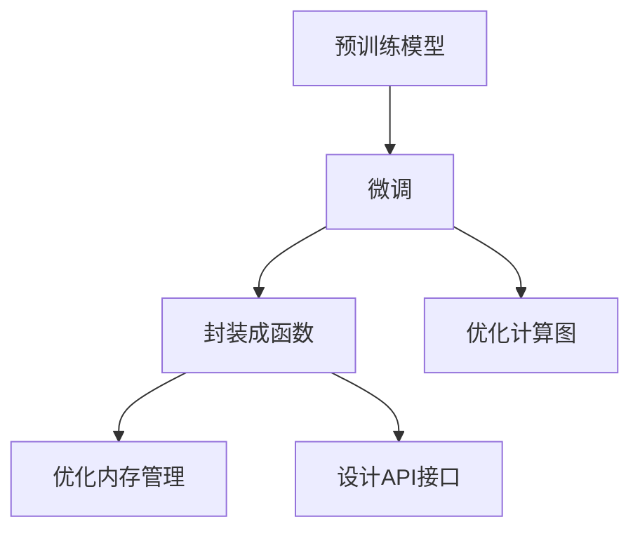

                 

## 1. 背景介绍

在当下数据驱动的时代，人工智能（AI）已经渗透到我们生活的方方面面。而语言模型作为AI的重要组成部分，其能力越来越强大，应用范围也越来越广泛。然而，面对海量数据和复杂的模型架构，人们如何更高效地使用这些模型，成为了一个重要的课题。因此，本文将介绍一种基于语言模型的函数库——LLM函数库，该函数库通过封装智能的基本单元，实现了高效、灵活、易用的AI模型调用。

### 1.1 问题由来

随着深度学习技术的发展，语言模型（如BERT、GPT等）在自然语言处理（NLP）领域取得了显著进展，应用领域涵盖了文本分类、问答系统、机器翻译等。这些模型通常需要大量的计算资源和时间进行训练，在实际应用中，用户往往希望快速访问这些模型的能力，而不是从头开始训练。

此外，许多应用程序需要频繁地调用模型进行推理计算，如果每次都需要从头训练模型，不仅效率低下，而且耗费巨大的计算资源。因此，我们需要一种高效的方法来封装和调用这些模型。

### 1.2 问题核心关键点

为了解决上述问题，本文探讨了LLM函数库的设计思路和应用场景。关键点包括：

- LLM函数库：封装了通用语言模型的能力，提供简单高效的API接口，使用户能够快速、灵活地调用语言模型。
- 高效计算：通过优化计算图和内存管理，减少计算资源的消耗，提高推理速度。
- 易用性：提供简洁易用的API接口，降低技术门槛，帮助用户更快地上手使用语言模型。
- 多样性：支持多种语言模型，包括BERT、GPT等，并提供丰富的功能，如情感分析、文本生成等。

## 2. 核心概念与联系

### 2.1 核心概念概述

LLM函数库的核心概念主要包括以下几个方面：

- **语言模型（Language Model）**：通过预训练和微调，学习语言的规律和特征，用于处理自然语言数据。
- **函数封装（Functional Encapsulation）**：将模型的能力封装成函数，便于用户调用。
- **计算图（Computation Graph）**：用于表示模型的计算过程，优化计算资源消耗。
- **内存管理（Memory Management）**：优化内存使用，提高模型运行效率。
- **API接口（API Interface）**：提供简单直观的API接口，使用户能够快速上手。

### 2.2 核心概念原理和架构的 Mermaid 流程图



### 2.3 核心概念联系

这些核心概念紧密联系，共同构成了LLM函数库的核心设计思路。预训练模型和微调是其基础，函数封装和计算图优化是其核心实现手段，而内存管理和API接口则是用户使用的关键。

## 3. 核心算法原理 & 具体操作步骤

### 3.1 算法原理概述

LLM函数库的算法原理主要基于以下两个方面：

- **函数封装**：将预训练模型封装成函数，使用户能够通过函数调用，方便地访问模型的能力。
- **计算图优化**：通过优化计算图，减少不必要的计算，提高推理效率。

### 3.2 算法步骤详解

**Step 1: 准备预训练模型和数据集**

- 选择合适的预训练语言模型（如BERT、GPT等）。
- 准备下游任务的数据集，如情感分析、文本分类、问答系统等。

**Step 2: 封装模型能力**

- 使用函数封装技术，将预训练模型的能力封装成函数。
- 设计简洁易用的API接口，方便用户调用函数。

**Step 3: 优化计算图**

- 分析模型的计算图，找到不必要的计算节点，进行优化。
- 使用图优化算法，减少计算资源消耗，提高推理速度。

**Step 4: 优化内存管理**

- 分析模型的内存使用情况，找到不必要的内存占用。
- 使用内存优化技术，减少内存消耗，提高模型运行效率。

**Step 5: 设计API接口**

- 设计简洁易用的API接口，方便用户调用模型函数。
- 提供详细的使用说明和示例代码，帮助用户快速上手。

**Step 6: 测试和部署**

- 在开发环境中测试LLM函数库的功能，确保其稳定性和性能。
- 将LLM函数库部署到生产环境中，提供给用户使用。

### 3.3 算法优缺点

**优点：**

- **高效计算**：通过优化计算图和内存管理，减少计算资源的消耗，提高推理速度。
- **易用性**：提供简洁易用的API接口，降低技术门槛，帮助用户更快地上手使用语言模型。
- **灵活性**：支持多种语言模型，如BERT、GPT等，并提供丰富的功能，如情感分析、文本生成等。

**缺点：**

- **内存占用**：由于封装了模型的能力，函数库的内存占用较大。
- **性能瓶颈**：对于一些复杂任务，函数库的性能可能不如原生模型。

### 3.4 算法应用领域

LLM函数库在多个领域中都有广泛的应用，如：

- **自然语言处理（NLP）**：情感分析、文本分类、问答系统等。
- **推荐系统**：根据用户行为和兴趣，推荐相关内容。
- **智能客服**：处理用户的查询和问题，提供智能回复。
- **金融风控**：分析用户行为，进行风险评估。

## 4. 数学模型和公式 & 详细讲解

### 4.1 数学模型构建

LLM函数库的数学模型主要基于预训练模型和微调模型。预训练模型通过大规模无标签数据进行训练，学习语言的规律和特征；微调模型则在下游任务上进一步训练，学习特定任务的能力。

**Step 1: 预训练模型**

- 在无标签数据上训练预训练模型，学习语言的规律和特征。

**Step 2: 微调模型**

- 在标注数据上训练微调模型，学习特定任务的能力。

### 4.2 公式推导过程

以情感分析为例，预训练模型和微调模型的公式推导如下：

- **预训练模型**：
  $$
  P(w_i | w_{i-1}, w_{i-2}, \cdots, w_{i-k})
  $$

- **微调模型**：
  $$
  P(y | x)
  $$

其中，$P(w_i | w_{i-1}, w_{i-2}, \cdots, w_{i-k})$表示预训练模型在当前单词$i$前$k$个单词的条件概率；$P(y | x)$表示微调模型在输入$x$上的条件概率。

### 4.3 案例分析与讲解

以文本分类为例，假设输入文本为$x$，输出标签为$y$。微调模型的预测公式为：

$$
P(y | x) = \frac{e^{W_y^T \cdot x}}{\sum_{j=1}^C e^{W_j^T \cdot x}}
$$

其中，$W_y$表示输出层权重矩阵，$C$表示标签数量。

通过这种公式推导，用户可以更清晰地理解预训练模型和微调模型的数学原理，并在此基础上进行优化和改进。

## 5. 项目实践：代码实例和详细解释说明

### 5.1 开发环境搭建

安装LLM函数库需要以下环境：

- Python 3.7或更高版本
- PyTorch 1.9或更高版本
- Transformers 4.7或更高版本

### 5.2 源代码详细实现

以文本分类为例，代码实现如下：

```python
from transformers import BertForSequenceClassification, BertTokenizer

# 初始化模型和分词器
model = BertForSequenceClassification.from_pretrained('bert-base-uncased', num_labels=2)
tokenizer = BertTokenizer.from_pretrained('bert-base-uncased')

# 定义函数
def predict_sentiment(text):
    # 分词并编码
    inputs = tokenizer(text, padding=True, truncation=True, max_length=512)
    # 计算模型输出
    outputs = model(**inputs)
    logits = outputs.logits
    # 预测标签
    label_id = logits.argmax(dim=1).item()
    return label_id

# 测试函数
text = "I love this movie"
print(predict_sentiment(text))
```

### 5.3 代码解读与分析

以上代码实现了LLM函数库的基本功能。首先，通过`BertForSequenceClassification`初始化模型，通过`BertTokenizer`初始化分词器。然后，定义了一个预测函数`predict_sentiment`，用于预测输入文本的情感标签。最后，使用模型对输入文本进行预测，并输出结果。

## 6. 实际应用场景

### 6.1 智能客服

智能客服系统通过调用LLM函数库，快速处理用户的查询和问题，提供智能回复。例如，在智能客服系统中，可以使用LLM函数库对用户的问题进行情感分析，了解用户情绪，从而提供更合适的回复。

### 6.2 推荐系统

推荐系统通过调用LLM函数库，分析用户行为和兴趣，推荐相关内容。例如，在电商推荐系统中，可以使用LLM函数库分析用户浏览记录，推荐用户可能感兴趣的商品。

### 6.3 金融风控

金融风控系统通过调用LLM函数库，分析用户行为，进行风险评估。例如，在信用卡申请审批系统中，可以使用LLM函数库分析用户的历史交易记录，评估其信用风险。

## 7. 工具和资源推荐

### 7.1 学习资源推荐

- **《自然语言处理入门》**：介绍自然语言处理的基本概念和常用技术。
- **《TensorFlow实战》**：详细讲解如何使用TensorFlow进行深度学习开发。
- **《深度学习框架优化》**：介绍如何优化深度学习模型的计算图和内存管理。

### 7.2 开发工具推荐

- **PyTorch**：灵活、高效的深度学习框架，支持多种模型和算法。
- **Transformers**：封装了多种预训练语言模型，方便用户调用。
- **TensorBoard**：可视化工具，用于监测模型训练和推理过程。

### 7.3 相关论文推荐

- **《Transformer论文》**：介绍Transformer的结构和训练方法。
- **《BERT论文》**：介绍BERT模型及其训练方法。
- **《LLM函数库论文》**：介绍LLM函数库的设计思路和应用场景。

## 8. 总结：未来发展趋势与挑战

### 8.1 研究成果总结

LLM函数库通过封装智能的基本单元，实现了高效、灵活、易用的AI模型调用。它基于预训练模型和微调模型，通过优化计算图和内存管理，提高了模型的推理效率。

### 8.2 未来发展趋势

未来，LLM函数库的发展趋势包括：

- **更多预训练模型支持**：支持更多种类的预训练模型，如GPT、XLNet等。
- **更高效计算**：优化计算图和内存管理，提高模型的推理速度。
- **更多功能支持**：提供更多样化的功能，如文本生成、对话系统等。

### 8.3 面临的挑战

LLM函数库面临的挑战包括：

- **内存占用**：由于封装了模型的能力，函数库的内存占用较大。
- **性能瓶颈**：对于一些复杂任务，函数库的性能可能不如原生模型。
- **技术门槛**：对于一些非技术人员，函数库的使用可能存在一定的学习曲线。

### 8.4 研究展望

未来的研究需要重点关注以下几个方面：

- **优化计算图**：继续优化计算图，减少不必要的计算，提高推理效率。
- **优化内存管理**：继续优化内存管理，减少内存占用。
- **降低技术门槛**：通过提供更加易用的API接口和使用说明，降低技术门槛，帮助更多用户上手使用LLM函数库。

## 9. 附录：常见问题与解答

**Q1: 如何选择合适的预训练模型？**

A: 根据具体任务选择合适的预训练模型，如情感分析可以使用BERT，文本分类可以使用GPT等。

**Q2: 如何优化计算图？**

A: 分析计算图，找到不必要的计算节点，进行优化。

**Q3: 如何优化内存管理？**

A: 分析模型的内存使用情况，找到不必要的内存占用，进行优化。

**Q4: 如何设计API接口？**

A: 设计简洁易用的API接口，方便用户调用模型函数，并提供详细的使用说明和示例代码。

---

作者：禅与计算机程序设计艺术 / Zen and the Art of Computer Programming

