                 

# LLM在个性化新闻生成中的应用：定制化信息服务

> 关键词：
- 大语言模型(LLM) 
- 个性化新闻生成 
- 定制化信息服务 
- 自然语言处理(NLP) 
- 数据增强 
- 推荐系统 
- 用户画像

## 1. 背景介绍

### 1.1 问题由来

在当今信息爆炸的时代，新闻媒体的传播渠道和内容呈现方式不断扩展和创新。传统的新闻推送方式，如编辑筛选、时效性排名等，已无法完全满足用户日益个性化的信息需求。人们越来越倾向于根据自身的兴趣、需求和偏好，定制化获取特定的新闻信息。

个性化新闻生成，作为大语言模型在NLP领域的一个重要应用，旨在通过大模型的语言理解和生成能力，为用户提供量身定制的新闻推荐服务。用户可以通过简短的语言描述，甚至是一两个关键词，就能快速获取到自己感兴趣的新闻报道。这种定制化的新闻信息服务，不仅提升了用户体验，也带来了更高效、更便捷的媒体消费方式。

### 1.2 问题核心关键点

个性化新闻生成的核心在于如何高效地从海量新闻数据中筛选出符合用户兴趣和需求的内容，并将其以自然流畅的语言生成出来。大语言模型通过大规模预训练，具备强大的语言理解能力和生成能力，能够自动抽取和生成符合用户要求的新闻信息。

具体来说，个性化新闻生成需要解决以下几个关键问题：
1. **用户需求识别**：通过分析用户输入的语言描述，准确识别出用户的兴趣点。
2. **新闻数据筛选**：从海量的新闻库中筛选出与用户兴趣相关的报道。
3. **自然语言生成**：将筛选出的新闻信息转化为自然流畅的语言文本，生成新闻摘要或全文。
4. **推荐系统优化**：通过不断优化推荐算法，提升新闻推荐的相关性和多样性。

### 1.3 问题研究意义

个性化新闻生成技术的研究和应用，对于提升新闻阅读体验、驱动信息消费模式变革具有重要意义：

1. **提升用户满意度**：通过个性化推荐，满足用户的特定需求，提升新闻消费的参与感和满意度。
2. **优化信息流**：更精准的信息推荐，能够有效降低信息噪音，优化用户的信息获取路径。
3. **提高媒体传播效率**：个性化新闻生成能够提升内容发现的效率，降低编辑和分发成本。
4. **推动技术创新**：个性化新闻生成技术的发展，能够促进NLP、推荐系统等领域的创新，提升技术水平。

## 2. 核心概念与联系

### 2.1 核心概念概述

为了更好地理解个性化新闻生成的技术实现，本节将介绍几个密切相关的核心概念：

- **大语言模型(LLM)**：以自回归(如GPT)或自编码(如BERT)模型为代表的大规模预训练语言模型。通过在大规模无标签文本语料上进行预训练，学习到丰富的语言知识和常识。
- **个性化新闻生成**：根据用户兴趣和需求，自动生成符合用户期望的新闻信息。通过大语言模型的语言理解与生成能力，实现内容的定制化输出。
- **自然语言处理(NLP)**：涉及计算机对自然语言的理解、处理和生成，是个性化新闻生成技术的基础。
- **推荐系统**：通过用户行为数据和兴趣模型，为用户推荐感兴趣的个性化内容。
- **数据增强**：通过对训练数据进行扩充和变换，提升模型泛化能力和鲁棒性。
- **用户画像**：根据用户的历史行为和属性，建立用户兴趣模型，用于个性化推荐。

这些核心概念之间的逻辑关系可以通过以下Mermaid流程图来展示：

```mermaid
graph TB
    A[大语言模型] --> B[个性化新闻生成]
    A --> C[NLP技术]
    A --> D[推荐系统]
    C --> E[数据增强]
    D --> F[用户画像]
    E --> G[BERT]
    E --> H[GPT]
    F --> I[用户行为数据]
    B --> J[用户输入]
    B --> K[新闻库]
    B --> L[生成结果]
```



这个流程图展示了大语言模型、NLP技术、推荐系统和用户画像之间的联系，以及它们如何共同作用于个性化新闻生成：

1. 大语言模型通过预训练获得基础能力。
2. NLP技术用于处理用户输入和生成新闻文本。
3. 推荐系统通过用户画像筛选新闻数据。
4. 数据增强提升模型的泛化能力。
5. 用户画像用于个性化推荐。

这些概念共同构成了个性化新闻生成的技术和应用框架，使其能够高效地生成符合用户需求的新闻信息。

## 3. 核心算法原理 & 具体操作步骤

### 3.1 算法原理概述

个性化新闻生成的算法原理，本质上是基于大语言模型的信息抽取和生成能力，结合推荐系统的个性化推荐算法，从海量新闻数据中筛选并生成符合用户兴趣的新闻信息。

具体而言，个性化新闻生成可以分为以下几个步骤：
1. **用户需求识别**：通过大语言模型的理解能力，自动解析用户输入的语言描述，识别出用户的兴趣点和需求。
2. **新闻数据筛选**：根据用户需求，从新闻库中筛选出相关的报道。
3. **新闻信息抽取**：使用大语言模型的信息抽取能力，从筛选出的新闻中提取关键信息。
4. **新闻信息生成**：通过大语言模型的生成能力，将抽取出的信息转化为自然流畅的新闻文本。
5. **推荐结果排序**：结合推荐算法，对生成的新闻进行排序，提升推荐的相关性和多样性。

### 3.2 算法步骤详解

以下将详细介绍个性化新闻生成的具体实现步骤：

#### 3.2.1 用户需求识别

用户需求识别是个性化新闻生成的第一步，也是关键步骤。用户通常通过简短的语言描述或关键词输入，表达自己的兴趣和需求。大语言模型通过分析用户输入，能够自动提取关键词和实体，识别出用户的兴趣点。

以BERT模型为例，用户输入为 "我感兴趣的是科技新闻"，模型首先通过BERT的[CLS]标记提取句子中的关键词，如"科技新闻"，然后通过池化操作，获取句子级别的语义表示，从而理解用户的兴趣点。

具体实现步骤如下：

1. **文本预处理**：对用户输入进行分词和标准化处理，去除停用词和特殊符号。
2. **特征嵌入**：使用BERT的Embedding层将处理后的文本转化为向量表示。
3. **实体识别**：通过BERT的[CLS]标记，识别出用户输入中的关键词和实体。
4. **意图抽取**：通过模型对用户输入进行分类，识别出用户的兴趣意图，如科技、体育、财经等。

#### 3.2.2 新闻数据筛选

新闻数据筛选是个性化新闻生成的核心步骤之一。基于用户需求，从海量新闻库中筛选出相关报道。目前主要采用以下几种方法：

1. **关键词匹配**：根据用户输入的关键词，在新闻库中匹配包含关键词的报道。
2. **标题和摘要匹配**：通过新闻标题和摘要与用户需求进行相似度匹配，筛选出最相关的报道。
3. **时间过滤**：根据用户输入的时间范围，筛选出对应时间内的新闻报道。
4. **热门推荐**：结合用户历史阅读行为和当前热门新闻，推荐热门报道。

#### 3.2.3 新闻信息抽取

新闻信息抽取是指从筛选出的新闻报道中，自动抽取关键信息和结构。大语言模型可以通过解析新闻文本，提取出标题、作者、时间、地点、事件等关键信息，并将其结构化。

以BERT模型为例，在新闻标题 "美国新冠疫情日增33万，医疗系统面临崩溃" 中，BERT可以自动提取出关键信息如地点 "美国"、事件 "新冠疫情"、数量 "日增33万" 和事件结果 "医疗系统面临崩溃"。

具体实现步骤如下：

1. **新闻分词**：对新闻标题和摘要进行分词和标准化处理。
2. **实体识别**：通过BERT的[CLS]标记，识别出新闻中的关键词和实体。
3. **信息抽取**：使用结构化信息抽取模型，从新闻中提取出关键信息。
4. **信息聚合**：将抽取出的信息进行聚合，生成新闻摘要或新闻结构。

#### 3.2.4 新闻信息生成

新闻信息生成是指将抽取出的关键信息，转化为自然流畅的新闻文本。大语言模型可以通过生成任务，自动生成新闻摘要或全文。

以GPT模型为例，在新闻信息 "美国新冠疫情日增33万，医疗系统面临崩溃" 的基础上，GPT能够生成详细的新闻报道，涵盖背景、事件发展、专家观点等。

具体实现步骤如下：

1. **信息拼接**：将抽取出的关键信息拼接成完整的句子。
2. **特征嵌入**：使用GPT的Embedding层将拼接后的信息转化为向量表示。
3. **新闻生成**：通过GPT的生成能力，自动生成新闻文本。
4. **后处理**：对生成的文本进行语法和逻辑校验，并进行格式整理。

#### 3.2.5 推荐结果排序

推荐结果排序是个性化新闻生成的最后一步。基于生成的新闻信息，结合推荐算法，对新闻进行排序，提升推荐的相关性和多样性。

常用的推荐算法包括：

1. **基于内容的推荐**：根据新闻内容与用户需求的相关性，进行推荐排序。
2. **协同过滤推荐**：通过用户历史行为数据，为用户推荐感兴趣的新闻。
3. **混合推荐**：结合基于内容和协同过滤的推荐，提升推荐效果。
4. **深度学习推荐**：使用深度神经网络模型，进行端到端的推荐排序。

### 3.3 算法优缺点

个性化新闻生成技术具有以下优点：

1. **高效性**：通过大语言模型的自动抽取和生成能力，能够快速生成符合用户需求的新闻信息。
2. **个性化**：根据用户输入的关键词和描述，实现高度定制化的新闻推荐。
3. **适应性强**：能够处理各种形式的用户需求，包括文本描述、关键词等。
4. **可扩展性**：随着数据和算力的增加，个性化新闻生成的性能可以不断提升。

同时，个性化新闻生成也存在以下缺点：

1. **数据依赖**：需要大量的新闻数据作为支撑，数据质量和多样性直接影响推荐效果。
2. **计算资源消耗大**：大语言模型的推理和生成过程，需要较大的计算资源和时间。
3. **用户需求理解有限**：用户输入的语言描述可能过于模糊或复杂，影响模型理解。
4. **推荐准确性不足**：在某些情况下，推荐结果可能不够精准，存在误导性。

### 3.4 算法应用领域

个性化新闻生成技术已经在多个领域得到了广泛应用，例如：

- **新闻媒体**：传统新闻媒体通过个性化推荐，提升用户体验和阅读量。
- **智能家居**：智能音箱、智能电视等设备，能够根据用户需求自动推荐新闻和信息。
- **在线广告**：广告平台通过个性化推荐，提高广告点击率和转化率。
- **社交媒体**：社交媒体平台通过个性化新闻推荐，增强用户粘性和平台活跃度。

除了上述这些经典应用外，个性化新闻生成还被创新性地应用到更多场景中，如智能客服、信息检索、智能问答等，为用户的日常信息获取带来了全新的体验。

## 4. 数学模型和公式 & 详细讲解 & 举例说明

### 4.1 数学模型构建

本节将使用数学语言对个性化新闻生成的模型构建进行更加严格的刻画。

记用户输入的关键词为 $x$，新闻库中的报道为 $D$。定义新闻生成任务为 $T$，用户需求识别任务为 $I$。

用户的输入 $x$ 与需求 $I$ 的关系可以表示为：

$$
I = f(x; \theta_I)
$$

其中 $f$ 为用户需求识别函数，$\theta_I$ 为需求识别模型的参数。

新闻生成任务 $T$ 可以表示为：

$$
T = g(D; \theta_T, \theta_G)
$$

其中 $g$ 为新闻生成函数，$\theta_T$ 为新闻筛选模型的参数，$\theta_G$ 为新闻生成模型的参数。

新闻排序任务 $R$ 可以表示为：

$$
R = h(T; \theta_R)
$$

其中 $h$ 为新闻排序函数，$\theta_R$ 为推荐模型的参数。

### 4.2 公式推导过程

以下我们将详细推导个性化新闻生成的数学模型和公式。

以BERT模型为例，用户输入的关键词 $x$ 通过BERT的Embedding层转化为向量表示 $v_x$：

$$
v_x = \text{Embedding}(x)
$$

通过BERT的[CLS]标记，模型自动提取关键词 $x$ 的语义表示 $\text{CLS}(x)$：

$$
\text{CLS}(x) = \text{BERT}(v_x)
$$

新闻库 $D$ 中的每一篇报道 $d_i$ 同样通过BERT的Embedding层转化为向量表示 $v_{d_i}$：

$$
v_{d_i} = \text{Embedding}(d_i)
$$

通过BERT的[CLS]标记，模型自动提取报道 $d_i$ 的语义表示 $\text{CLS}(d_i)$：

$$
\text{CLS}(d_i) = \text{BERT}(v_{d_i})
$$

用户需求识别函数 $f$ 的输出为 $\text{CLS}(x)$ 与 $D$ 中所有报道的语义表示 $\{\text{CLS}(d_i)\}_{i=1}^N$ 之间的相似度 $s(x, d_i)$：

$$
s(x, d_i) = \text{Similarity}(\text{CLS}(x), \text{CLS}(d_i))
$$

其中 $\text{Similarity}$ 为相似度计算函数，如余弦相似度、点积相似度等。

新闻生成函数 $g$ 的输出为新闻库 $D$ 中与用户需求 $I$ 最相关的报道 $d_{\max}$：

$$
d_{\max} = \mathop{\arg\max}_{d_i \in D} s(x, d_i)
$$

新闻生成模型 $G$ 通过BERT生成器生成新闻摘要 $t$：

$$
t = \text{Generate}(d_{\max}; \theta_G)
$$

新闻排序函数 $h$ 的输出为排序后的新闻列表 $T$：

$$
T = \text{Sort}(g(D; \theta_T, \theta_G); \theta_R)
$$

其中 $\text{Sort}$ 为排序算法，如基于内容的推荐、协同过滤推荐等。

### 4.3 案例分析与讲解

下面我们以BERT模型为例，详细讲解一个个性化新闻生成的实际案例。

假设用户输入的关键词为 "科技新闻"，BERT模型通过Embedding层和[CLS]标记，提取关键词的语义表示 $\text{CLS}(x)$：

$$
\text{CLS}(x) = \text{BERT}(v_x)
$$

新闻库 $D$ 中包含1000篇报道，通过BERT的[CLS]标记，计算每篇报道的语义表示 $\{\text{CLS}(d_i)\}_{i=1}^{1000}$。

用户需求识别函数 $f$ 计算关键词与每篇报道的相似度 $s(x, d_i)$，并取最大值：

$$
d_{\max} = \mathop{\arg\max}_{d_i \in D} s(x, d_i)
$$

假设 $d_{\max}$ 对应的报道标题为 "美国科技公司X发布最新技术"，BERT模型通过新闻生成器生成新闻摘要：

$$
t = \text{Generate}(d_{\max}; \theta_G)
$$

生成的新闻摘要为：

$$
"美国科技公司X最新发布XX技术，引领行业发展"
$$

最后，新闻排序函数 $h$ 对所有报道进行排序，将生成的新闻摘要 $t$ 排在第一位：

$$
T = \text{Sort}(g(D; \theta_T, \theta_G); \theta_R)
$$

用户接收到排序后的新闻列表：

$$
1. "美国科技公司X最新发布XX技术，引领行业发展"
2. "特斯拉最新技术突破"
3. "华为发布最新5G技术"
4. "谷歌推出最新AI产品"
$$

## 5. 项目实践：代码实例和详细解释说明

### 5.1 开发环境搭建

在进行个性化新闻生成实践前，我们需要准备好开发环境。以下是使用Python进行PyTorch开发的环境配置流程：

1. 安装Anaconda：从官网下载并安装Anaconda，用于创建独立的Python环境。

2. 创建并激活虚拟环境：
```bash
conda create -n pytorch-env python=3.8 
conda activate pytorch-env
```

3. 安装PyTorch：根据CUDA版本，从官网获取对应的安装命令。例如：
```bash
conda install pytorch torchvision torchaudio cudatoolkit=11.1 -c pytorch -c conda-forge
```

4. 安装Transformer库：
```bash
pip install transformers
```

5. 安装各类工具包：
```bash
pip install numpy pandas scikit-learn matplotlib tqdm jupyter notebook ipython
```

完成上述步骤后，即可在`pytorch-env`环境中开始个性化新闻生成的实践。

### 5.2 源代码详细实现

下面我们以BERT模型为例，给出使用PyTorch进行个性化新闻生成的代码实现。

首先，定义用户需求识别函数：

```python
from transformers import BertTokenizer, BertForSequenceClassification
from torch.utils.data import Dataset, DataLoader
import torch

class UserIntent(Dataset):
    def __init__(self, texts, labels):
        self.tokenizer = BertTokenizer.from_pretrained('bert-base-cased')
        self.texts = texts
        self.labels = labels
        
    def __len__(self):
        return len(self.texts)
    
    def __getitem__(self, item):
        text = self.texts[item]
        label = self.labels[item]
        
        encoding = self.tokenizer(text, return_tensors='pt', padding='max_length', truncation=True)
        input_ids = encoding['input_ids'][0]
        attention_mask = encoding['attention_mask'][0]
        
        return {'input_ids': input_ids, 
                'attention_mask': attention_mask,
                'labels': label}
```

然后，定义新闻生成函数：

```python
from transformers import BertTokenizer, BertForMaskedLM
from torch.utils.data import Dataset, DataLoader
import torch

class NewsArticle(Dataset):
    def __init__(self, texts):
        self.tokenizer = BertTokenizer.from_pretrained('bert-base-cased')
        self.texts = texts
        
    def __len__(self):
        return len(self.texts)
    
    def __getitem__(self, item):
        text = self.texts[item]
        
        encoding = self.tokenizer(text, return_tensors='pt', padding='max_length', truncation=True)
        input_ids = encoding['input_ids'][0]
        attention_mask = encoding['attention_mask'][0]
        
        return {'input_ids': input_ids, 
                'attention_mask': attention_mask,
                'text': text}
```

接着，定义推荐函数：

```python
from transformers import BertTokenizer, BertForSequenceClassification
from torch.utils.data import Dataset, DataLoader
import torch

class RecommendationSystem:
    def __init__(self, model):
        self.model = model
        
    def predict(self, inputs):
        inputs = self.tokenizer(inputs, return_tensors='pt', padding='max_length', truncation=True)
        with torch.no_grad():
            outputs = self.model(inputs)
            logits = outputs.logits
        predictions = torch.argmax(logits, dim=1)
        return predictions
```

最后，启动个性化新闻生成的训练和推理流程：

```python
from transformers import BertForMaskedLM, AdamW
from torch.utils.data import DataLoader
import torch

model = BertForMaskedLM.from_pretrained('bert-base-cased')
tokenizer = BertTokenizer.from_pretrained('bert-base-cased')

# 定义训练和推理数据集
train_dataset = UserIntent(train_texts, train_labels)
dev_dataset = UserIntent(dev_texts, dev_labels)
test_dataset = UserIntent(test_texts, test_labels)

news_dataset = NewsArticle(news_data)

# 定义优化器和损失函数
optimizer = AdamW(model.parameters(), lr=2e-5)
loss_fn = torch.nn.CrossEntropyLoss()

# 定义训练和推理函数
def train_epoch(model, dataset, batch_size, optimizer):
    dataloader = DataLoader(dataset, batch_size=batch_size, shuffle=True)
    model.train()
    epoch_loss = 0
    for batch in dataloader:
        input_ids = batch['input_ids'].to(device)
        attention_mask = batch['attention_mask'].to(device)
        labels = batch['labels'].to(device)
        model.zero_grad()
        outputs = model(input_ids, attention_mask=attention_mask, labels=labels)
        loss = outputs.loss
        epoch_loss += loss.item()
        loss.backward()
        optimizer.step()
    return epoch_loss / len(dataloader)

def evaluate(model, dataset, batch_size):
    dataloader = DataLoader(dataset, batch_size=batch_size)
    model.eval()
    preds, labels = [], []
    with torch.no_grad():
        for batch in dataloader:
            input_ids = batch['input_ids'].to(device)
            attention_mask = batch['attention_mask'].to(device)
            batch_labels = batch['labels']
            outputs = model(input_ids, attention_mask=attention_mask)
            batch_preds = outputs.logits.argmax(dim=2).to('cpu').tolist()
            batch_labels = batch_labels.to('cpu').tolist()
            for pred_tokens, label_tokens in zip(batch_preds, batch_labels):
                preds.append(pred_tokens[:len(label_tokens)])
                labels.append(label_tokens)
    print(classification_report(labels, preds))
    
def generate_news(model, news_data, tokenizer):
    inputs = [tokenizer(text, return_tensors='pt', padding='max_length', truncation=True) for text in news_data]
    with torch.no_grad():
        outputs = model.generate(inputs, max_length=100)
        news_summaries = tokenizer.decode(outputs, skip_special_tokens=True)
    return news_summaries
```

以上就是使用PyTorch进行个性化新闻生成的完整代码实现。可以看到，借助Transformers库和PyTorch的强大封装，个性化新闻生成的实现变得简洁高效。

### 5.3 代码解读与分析

让我们再详细解读一下关键代码的实现细节：

**UserIntent类**：
- `__init__`方法：初始化用户意图识别所需的分词器和训练数据。
- `__len__`方法：返回数据集的样本数量。
- `__getitem__`方法：对单个样本进行处理，将文本输入转换为分词器所需的格式，并返回模型所需的输入。

**NewsArticle类**：
- `__init__`方法：初始化新闻生成所需的分词器和新闻数据。
- `__len__`方法：返回数据集的样本数量。
- `__getitem__`方法：对单个样本进行处理，将新闻标题或摘要转换为分词器所需的格式，并返回模型所需的输入。

**RecommendationSystem类**：
- `__init__`方法：初始化推荐系统所需的模型和分词器。
- `predict`方法：通过模型预测输入的意图或新闻生成，并返回预测结果。

**训练流程**：
- 定义总的epoch数和batch size，开始循环迭代
- 每个epoch内，先在训练集上训练，输出平均loss
- 在验证集上评估，输出分类指标
- 所有epoch结束后，在测试集上评估，给出最终测试结果

**新闻生成流程**：
- 将用户输入的新闻标题或摘要作为输入，进行意图识别
- 根据识别出的意图，从新闻库中筛选出相关报道
- 对筛选出的新闻进行信息抽取，生成新闻摘要
- 使用生成模型对新闻摘要进行自动生成，输出新闻全文

可以看到，Python的简洁性和丰富的第三方库，使得个性化新闻生成的实现变得非常高效和易于扩展。开发者可以通过进一步优化训练和生成模型，提升个性化新闻生成的质量和效率。

## 6. 实际应用场景

### 6.1 智能媒体平台

个性化新闻生成技术在智能媒体平台上得到了广泛应用。例如，今日头条、网易新闻等平台通过个性化推荐，提升用户阅读体验和平台活跃度。这些平台能够根据用户的历史阅读行为和兴趣，自动推荐符合用户需求的新闻信息，减少信息噪音，提高阅读效率。

### 6.2 新闻代理服务

个性化新闻生成技术还应用于新闻代理服务中。通过代理服务，企业能够快速获取和生成特定领域的新闻信息，提升信息获取的速度和准确性。例如，某企业需要实时获取全球市场动态，可以通过个性化新闻生成技术，快速生成相关的新闻摘要或全文，帮助企业快速做出决策。

### 6.3 智能客服系统

在智能客服系统中，个性化新闻生成技术也有广泛应用。通过分析用户的语言输入，自动生成相应的新闻信息，并推荐给用户。用户可以实时获取最新的新闻资讯，提升服务体验。

### 6.4 未来应用展望

随着个性化新闻生成技术的不断发展，未来将会有更多的应用场景涌现。例如：

- **智能广告**：通过个性化新闻生成技术，自动生成符合用户兴趣的广告内容，提高广告点击率和转化率。
- **社交媒体**：社交媒体平台可以通过个性化新闻生成技术，自动推送新闻内容，提升用户粘性和平台活跃度。
- **金融行业**：金融行业可以通过个性化新闻生成技术，实时生成全球市场动态、公司财报等新闻信息，帮助投资者快速做出决策。

个性化新闻生成技术的发展，将推动信息获取方式的变革，提升用户的信息获取效率和质量，带来全新的用户体验。未来，随着技术的不断进步，个性化新闻生成将变得更加智能和灵活，服务于更多的垂直行业。

## 7. 工具和资源推荐

### 7.1 学习资源推荐

为了帮助开发者系统掌握个性化新闻生成的技术基础和实践技巧，这里推荐一些优质的学习资源：

1. 《Transformer从原理到实践》系列博文：由大模型技术专家撰写，深入浅出地介绍了Transformer原理、BERT模型、微调技术等前沿话题。

2. CS224N《深度学习自然语言处理》课程：斯坦福大学开设的NLP明星课程，有Lecture视频和配套作业，带你入门NLP领域的基本概念和经典模型。

3. 《Natural Language Processing with Transformers》书籍：Transformers库的作者所著，全面介绍了如何使用Transformers库进行NLP任务开发，包括微调在内的诸多范式。

4. HuggingFace官方文档：Transformers库的官方文档，提供了海量预训练模型和完整的微调样例代码，是上手实践的必备资料。

5. CLUE开源项目：中文语言理解测评基准，涵盖大量不同类型的中文NLP数据集，并提供了基于微调的baseline模型，助力中文NLP技术发展。

通过对这些资源的学习实践，相信你一定能够快速掌握个性化新闻生成的精髓，并用于解决实际的NLP问题。

### 7.2 开发工具推荐

高效的开发离不开优秀的工具支持。以下是几款用于个性化新闻生成开发的常用工具：

1. PyTorch：基于Python的开源深度学习框架，灵活动态的计算图，适合快速迭代研究。大部分预训练语言模型都有PyTorch版本的实现。

2. TensorFlow：由Google主导开发的开源深度学习框架，生产部署方便，适合大规模工程应用。同样有丰富的预训练语言模型资源。

3. Transformers库：HuggingFace开发的NLP工具库，集成了众多SOTA语言模型，支持PyTorch和TensorFlow，是进行个性化新闻生成开发的利器。

4. Weights & Biases：模型训练的实验跟踪工具，可以记录和可视化模型训练过程中的各项指标，方便对比和调优。与主流深度学习框架无缝集成。

5. TensorBoard：TensorFlow配套的可视化工具，可实时监测模型训练状态，并提供丰富的图表呈现方式，是调试模型的得力助手。

6. Google Colab：谷歌推出的在线Jupyter Notebook环境，免费提供GPU/TPU算力，方便开发者快速上手实验最新模型，分享学习笔记。

合理利用这些工具，可以显著提升个性化新闻生成任务的开发效率，加快创新迭代的步伐。

### 7.3 相关论文推荐

个性化新闻生成技术的发展源于学界的持续研究。以下是几篇奠基性的相关论文，推荐阅读：

1. Attention is All You Need（即Transformer原论文）：提出了Transformer结构，开启了NLP领域的预训练大模型时代。

2. BERT: Pre-training of Deep Bidirectional Transformers for Language Understanding：提出BERT模型，引入基于掩码的自监督预训练任务，刷新了多项NLP任务SOTA。

3. Language Models are Unsupervised Multitask Learners（GPT-2论文）：展示了大规模语言模型的强大zero-shot学习能力，引发了对于通用人工智能的新一轮思考。

4. Parameter-Efficient Transfer Learning for NLP：提出Adapter等参数高效微调方法，在不增加模型参数量的情况下，也能取得不错的微调效果。

5. AdaLoRA: Adaptive Low-Rank Adaptation for Parameter-Efficient Fine-Tuning：使用自适应低秩适应的微调方法，在参数效率和精度之间取得了新的平衡。

6. Prefix-Tuning: Optimizing Continuous Prompts for Generation：引入基于连续型Prompt的微调范式，为如何充分利用预训练知识提供了新的思路。

这些论文代表了大语言模型微调技术的发展脉络。通过学习这些前沿成果，可以帮助研究者把握学科前进方向，激发更多的创新灵感。

## 8. 总结：未来发展趋势与挑战

### 8.1 总结

本文对个性化新闻生成的技术实现进行了全面系统的介绍。首先阐述了个性化新闻生成的背景和研究意义，明确了基于大语言模型的信息抽取和生成能力，是实现个性化新闻生成的核心手段。其次，从原理到实践，详细讲解了个性化新闻生成的数学模型和具体实现步骤，给出了微调任务开发的完整代码实例。同时，本文还广泛探讨了个性化新闻生成技术在多个行业领域的应用前景，展示了其广阔的应用潜力。

通过本文的系统梳理，可以看到，个性化新闻生成技术正在成为NLP领域的一个重要范式，通过大语言模型的语言理解与生成能力，实现内容的定制化输出。未来，随着技术的不断进步，个性化新闻生成将变得更加智能和灵活，服务于更多的垂直行业。

### 8.2 未来发展趋势

展望未来，个性化新闻生成技术将呈现以下几个发展趋势：

1. **算法优化**：未来将开发更多高效、灵活的个性化新闻生成算法，提升生成效果和速度。
2. **数据多样化**：个性化新闻生成将更多地利用多媒体数据，如图片、视频等，提升信息的多样性和丰富性。
3. **交互式生成**：通过用户互动反馈，个性化新闻生成将具备自适应能力，实时调整生成内容。
4. **跨领域应用**：个性化新闻生成将更多地应用于不同领域，如金融、医疗、教育等，提供个性化服务。
5. **技术集成**：个性化新闻生成将与推荐系统、知识图谱等技术结合，形成更加全面、准确的信息整合能力。

以上趋势凸显了个性化新闻生成技术的广阔前景。这些方向的探索发展，必将进一步提升新闻阅读体验，推动信息消费模式变革，为用户的日常信息获取带来新的体验。

### 8.3 面临的挑战

尽管个性化新闻生成技术已经取得了一定的进展，但在迈向更加智能化、普适化应用的过程中，它仍面临诸多挑战：

1. **数据获取难度**：个性化新闻生成需要大量的新闻数据作为支撑，数据质量和多样性直接影响推荐效果。
2. **模型复杂度**：大语言模型和深度学习模型的复杂度较高，需要大量的计算资源和时间。
3. **用户需求理解**：用户输入的语言描述可能过于模糊或复杂，影响模型理解。
4. **推荐准确性**：在某些情况下，推荐结果可能不够精准，存在误导性。

### 8.4 研究展望

面对个性化新闻生成所面临的挑战，未来的研究需要在以下几个方面寻求新的突破：

1. **多模态融合**：将文本、图片、视频等多模态数据融合，提升信息的多样性和准确性。
2. **知识图谱集成**：将符号化的先验知识与神经网络模型结合，增强模型的理解和生成能力。
3. **用户反馈机制**：引入用户反馈机制，通过不断调整模型参数，提高生成效果。
4. **自适应算法**：开发自适应算法，根据用户反馈实时调整生成策略。
5. **伦理道德约束**：在模型训练目标中引入伦理导向的评估指标，过滤和惩罚有害内容。

这些研究方向的探索，必将引领个性化新闻生成技术迈向更高的台阶，为构建智能、可靠、可控的媒体推荐系统提供新的思路和方法。面向未来，个性化新闻生成技术还需要与其他人工智能技术进行更深入的融合，共同推动信息获取方式的进步。只有勇于创新、敢于突破，才能不断拓展个性化新闻生成的边界，带来更加丰富、智能的阅读体验。

## 9. 附录：常见问题与解答

**Q1：如何处理用户输入的多样性和复杂性？**

A: 用户输入的多样性和复杂性是个性化新闻生成的一大挑战。为了应对这一问题，可以采用以下几种方法：
1. **自然语言处理技术**：使用BERT等预训练语言模型，自动解析用户输入，提取关键词和实体，从而理解用户需求。
2. **多模态融合**：结合文本、图片、视频等多模态数据，提升信息的多样性和准确性。
3. **用户反馈机制**：引入用户反馈机制，通过不断调整模型参数，提高生成效果。

**Q2：如何优化个性化新闻生成的计算效率？**

A: 个性化新闻生成涉及大量计算，优化计算效率是关键。以下是几种常用的优化方法：
1. **模型裁剪**：去除不必要的层和参数，减小模型尺寸，加快推理速度。
2. **量化加速**：将浮点模型转为定点模型，压缩存储空间，提高计算效率。
3. **模型并行**：使用多GPU、TPU等硬件资源，提升模型训练和推理的并行计算能力。
4. **数据增强**：通过数据增强技术，提升模型泛化能力和鲁棒性，减少计算资源消耗。

**Q3：如何提高个性化新闻生成的推荐准确性？**

A: 个性化新闻生成的推荐准确性直接影响用户体验。以下是几种提升推荐准确性的方法：
1. **基于内容的推荐**：根据新闻内容与用户需求的相关性，进行推荐排序。
2. **协同过滤推荐**：通过用户历史行为数据，为用户推荐感兴趣的新闻。
3. **混合推荐**：结合基于内容和协同过滤的推荐，提升推荐效果。
4. **深度学习推荐**：使用深度神经网络模型，进行端到端的推荐排序。

**Q4：如何保障个性化新闻生成的内容质量？**

A: 个性化新闻生成的内容质量直接影响用户体验。以下是几种保障内容质量的方法：
1. **人工审核**：引入人工审核机制，对生成的新闻内容进行质量检查，防止有害内容的传播。
2. **自然语言处理技术**：使用BERT等预训练语言模型，自动解析用户输入，提取关键词和实体，从而理解用户需求。
3. **用户反馈机制**：引入用户反馈机制，通过不断调整模型参数，提高生成效果。

这些方法可以共同作用，确保个性化新闻生成的内容质量，提升用户阅读体验。

**Q5：如何处理个性化新闻生成的隐私保护问题？**

A: 个性化新闻生成技术涉及用户隐私保护问题，需要采取以下措施：
1. **数据匿名化**：对用户输入和行为数据进行匿名化处理，防止个人隐私泄露。
2. **隐私保护算法**：采用差分隐私等隐私保护算法，确保用户数据的安全性。
3. **透明机制**：建立透明的数据使用机制，让用户了解数据的用途和保护措施。

这些措施可以有效保障个性化新闻生成的隐私保护，提升用户对技术的信任度。

---

作者：禅与计算机程序设计艺术 / Zen and the Art of Computer Programming

