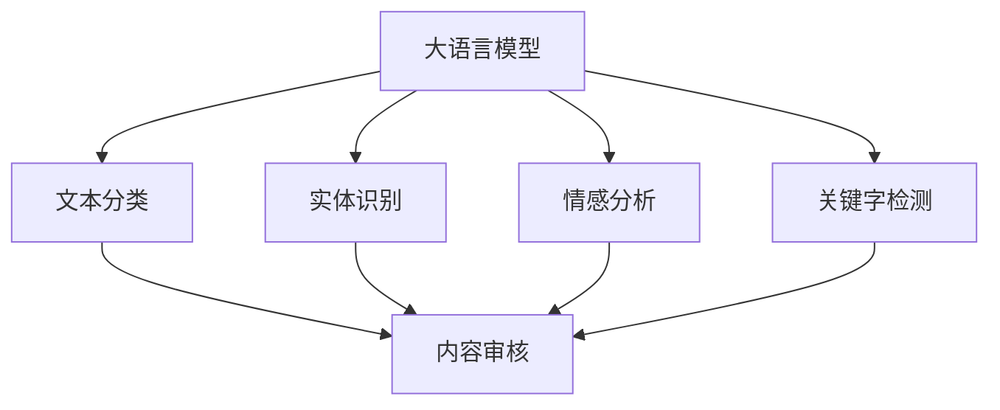

                 

## 1. 背景介绍

### 1.1 问题由来

随着互联网的飞速发展，内容审核问题日益凸显。网络空间内容丰富多样，包括文本、图片、视频等多种形式，其中存在大量违法违规内容，如仇恨言论、暴力血腥、色情、虚假信息等，严重危害社会稳定与公民心理健康。

据统计，每年全球有超过1亿网页被删除，其主要原因是其违反了网站的规则和法律。尽管网络运营商投入大量人力物力进行内容审核，但仍难以应对内容多样化、传播快节奏和分布式管理的挑战。

### 1.2 问题核心关键点

如何高效、准确地审核海量的网络内容，快速识别和屏蔽违法违规信息，成为互联网运营者面临的关键挑战。主要体现在以下几个方面：

1. **数据量大**：互联网内容海量且实时产生，审核人员无法处理如此庞大的数据量。
2. **标签多样**：网络内容形式多样，标签类型繁多，审核规则复杂，难以建立统一的审核标准。
3. **用户多样性**：不同用户群体对内容的敏感度不同，同一内容在不同文化、地域背景下可能有截然不同的解读。
4. **动态更新**：法律法规和网络运营规则不断更新，内容审核系统需要实时更新以符合新规定。

### 1.3 问题研究意义

本文旨在介绍和探讨基于预训练大语言模型(LLM)在智能内容审核中的应用。通过将大语言模型应用于内容审核，能够提升审核的自动化和智能化水平，实现高效、精准的审核效果。

预训练大语言模型通过在大规模无标签文本数据上预训练，学习到丰富的语言知识和语义表征，具备强大的自然语言理解和生成能力。将预训练大语言模型应用于内容审核，可以构建智能化的审核系统，大幅提升内容审核的效率和质量。

## 2. 核心概念与联系

### 2.1 核心概念概述

为更好地理解大语言模型在智能内容审核中的应用，本节将介绍几个密切相关的核心概念：

- **大语言模型(LLM)**：以自回归(如GPT)或自编码(如BERT)模型为代表的大规模预训练语言模型。通过在大规模无标签文本语料上进行预训练，学习通用的语言表示，具备强大的语言理解和生成能力。

- **内容审核**：指对互联网内容进行审查，识别和屏蔽违法违规信息，维护网络环境的健康与安全。

- **文本分类**：将文本分类为不同类别，如恶意内容、正常内容等。

- **实体识别**：识别文本中的实体，如人名、地名、组织名等。

- **情感分析**：分析文本情感倾向，判断文本是否含有负面情感。

- **关键字检测**：检测文本中的敏感关键词，辅助内容审核。

这些核心概念之间的逻辑关系可以通过以下Mermaid流程图来展示：



这个流程图展示了大语言模型与内容审核的核心概念及其之间的关系：

1. 大语言模型通过预训练获得基础能力。
2. 文本分类、实体识别、情感分析和关键字检测等任务，可以基于大语言模型的预训练模型进一步微调。
3. 这些任务最终支持内容审核，即对文本内容进行分类、筛选和标记。

## 3. 核心算法原理 & 具体操作步骤
### 3.1 算法原理概述

基于预训练大语言模型的智能内容审核，其核心思想是：将大语言模型作为强大的“特征提取器”，通过在内容审核任务上微调，使其能够识别和屏蔽违法违规信息，提升审核效率和准确性。

形式化地，假设预训练语言模型为 $M_{\theta}$，其中 $\theta$ 为预训练得到的模型参数。给定内容审核任务 $T$ 的标注数据集 $D=\{(x_i, y_i)\}_{i=1}^N$，其中 $x_i$ 为待审核文本，$y_i$ 为该文本是否违法违规的二元标签，即 $y_i \in \{0,1\}$。微调的目标是找到新的模型参数 $\hat{\theta}$，使得：

$$
\hat{\theta}=\mathop{\arg\min}_{\theta} \mathcal{L}(M_{\theta},D)
$$

其中 $\mathcal{L}$ 为针对任务 $T$ 设计的损失函数，用于衡量模型预测输出与真实标签之间的差异。常见的损失函数包括交叉熵损失、均方误差损失等。

通过梯度下降等优化算法，微调过程不断更新模型参数 $\theta$，最小化损失函数 $\mathcal{L}$，使得模型输出逼近真实标签。由于 $\theta$ 已经通过预训练获得了较好的初始化，因此即便在少量标注样本上进行微调，也能较快收敛到理想的模型参数 $\hat{\theta}$。

### 3.2 算法步骤详解

基于预训练大语言模型的智能内容审核一般包括以下几个关键步骤：

**Step 1: 准备预训练模型和数据集**
- 选择合适的预训练语言模型 $M_{\theta}$ 作为初始化参数，如 BERT、GPT 等。
- 准备内容审核任务 $T$ 的标注数据集 $D$，划分为训练集、验证集和测试集。一般要求标注数据与预训练数据的分布不要差异过大。

**Step 2: 添加任务适配层**
- 根据任务类型，在预训练模型顶层设计合适的输出层和损失函数。
- 对于二分类任务，通常在顶层添加线性分类器和交叉熵损失函数。
- 对于多分类任务，通常使用softmax函数输出概率分布，并以交叉熵损失为损失函数。

**Step 3: 设置微调超参数**
- 选择合适的优化算法及其参数，如 AdamW、SGD 等，设置学习率、批大小、迭代轮数等。
- 设置正则化技术及强度，包括权重衰减、Dropout、Early Stopping 等。
- 确定冻结预训练参数的策略，如仅微调顶层，或全部参数都参与微调。

**Step 4: 执行梯度训练**
- 将训练集数据分批次输入模型，前向传播计算损失函数。
- 反向传播计算参数梯度，根据设定的优化算法和学习率更新模型参数。
- 周期性在验证集上评估模型性能，根据性能指标决定是否触发 Early Stopping。
- 重复上述步骤直到满足预设的迭代轮数或 Early Stopping 条件。

**Step 5: 测试和部署**
- 在测试集上评估微调后模型 $M_{\hat{\theta}}$ 的性能，对比微调前后的精度提升。
- 使用微调后的模型对新样本进行推理预测，集成到实际的内容审核系统中。
- 持续收集新的数据，定期重新微调模型，以适应数据分布的变化。

以上是基于预训练大语言模型的智能内容审核的一般流程。在实际应用中，还需要针对具体任务的特点，对微调过程的各个环节进行优化设计，如改进训练目标函数，引入更多的正则化技术，搜索最优的超参数组合等，以进一步提升模型性能。

### 3.3 算法优缺点

基于预训练大语言模型的智能内容审核方法具有以下优点：

1. **高效性**：相比人工审核，基于大语言模型的内容审核能够大幅提升审核效率，减少人力成本。
2. **准确性**：大语言模型具备强大的自然语言理解能力，能够准确识别和屏蔽违法违规内容，提高审核的准确性。
3. **鲁棒性**：大语言模型在处理多样化的文本数据时表现出良好的鲁棒性，能够适应不同文化、地域背景下内容的解读。
4. **灵活性**：大语言模型可以根据不同任务和领域进行微调，灵活应用于多个内容审核场景。
5. **可扩展性**：大语言模型能够轻松集成到现有内容审核系统中，实现无缝升级和扩展。

同时，该方法也存在一定的局限性：

1. **依赖标注数据**：内容审核任务的标注数据获取成本较高，标注质量直接影响模型性能。
2. **过拟合风险**：当标注数据较少时，模型可能出现过拟合，导致泛化能力下降。
3. **复杂度**：大语言模型的微调涉及模型架构和超参数调整，技术难度较大。
4. **伦理问题**：大语言模型可能学习到有害信息，应用于内容审核时需严格控制，确保输出符合伦理道德。

尽管存在这些局限性，但就目前而言，基于预训练大语言模型的内容审核方法仍是智能内容审核的重要手段。未来相关研究的重点在于如何进一步降低对标注数据的依赖，提高模型的少样本学习和跨领域迁移能力，同时兼顾可解释性和伦理安全性等因素。

### 3.4 算法应用领域

基于预训练大语言模型的智能内容审核方法在互联网内容审核、广告筛选、舆情监测等多个领域中得到了广泛应用，例如：

- **互联网内容审核**：对网站、论坛、社交媒体等平台上的内容进行审核，屏蔽违法违规信息，保障网络环境的健康与安全。
- **广告筛选**：对在线广告进行内容审核，确保广告内容合法合规，避免虚假宣传和不当内容。
- **舆情监测**：实时监测网络舆情，识别和屏蔽恶意言论和有害信息，维护社会稳定。
- **用户行为分析**：分析用户行为，识别有害行为和不良信息，提升用户体验和平台安全性。

除了上述这些经典应用外，基于大语言模型的智能内容审核方法还将在更多场景中得到应用，如智能客服、金融风控、法律合规等，为各行各业的内容审核提供新的技术手段。

## 4. 数学模型和公式 & 详细讲解  
### 4.1 数学模型构建

本节将使用数学语言对基于预训练大语言模型的智能内容审核过程进行更加严格的刻画。

记预训练语言模型为 $M_{\theta}$，其中 $\theta$ 为预训练得到的模型参数。假设内容审核任务 $T$ 的训练集为 $D=\{(x_i,y_i)\}_{i=1}^N$，其中 $x_i$ 为待审核文本，$y_i$ 为该文本是否违法违规的二元标签，即 $y_i \in \{0,1\}$。

定义模型 $M_{\theta}$ 在数据样本 $(x,y)$ 上的损失函数为 $\ell(M_{\theta}(x),y)$，则在数据集 $D$ 上的经验风险为：

$$
\mathcal{L}(\theta) = \frac{1}{N} \sum_{i=1}^N \ell(M_{\theta}(x_i),y_i)
$$

其中 $\ell(M_{\theta}(x),y)$ 为模型 $M_{\theta}$ 在文本 $x$ 上的预测输出与真实标签 $y$ 的差异。

微调的优化目标是最小化经验风险，即找到最优参数：

$$
\theta^* = \mathop{\arg\min}_{\theta} \mathcal{L}(\theta)
$$

在实践中，我们通常使用基于梯度的优化算法（如SGD、Adam等）来近似求解上述最优化问题。设 $\eta$ 为学习率，$\lambda$ 为正则化系数，则参数的更新公式为：

$$
\theta \leftarrow \theta - \eta \nabla_{\theta}\mathcal{L}(\theta) - \eta\lambda\theta
$$

其中 $\nabla_{\theta}\mathcal{L}(\theta)$ 为损失函数对参数 $\theta$ 的梯度，可通过反向传播算法高效计算。

### 4.2 公式推导过程

以下我们以二分类任务为例，推导交叉熵损失函数及其梯度的计算公式。

假设模型 $M_{\theta}$ 在输入 $x$ 上的输出为 $\hat{y}=M_{\theta}(x) \in [0,1]$，表示样本属于正类的概率。真实标签 $y \in \{0,1\}$。则二分类交叉熵损失函数定义为：

$$
\ell(M_{\theta}(x),y) = -[y\log \hat{y} + (1-y)\log (1-\hat{y})]
$$

将其代入经验风险公式，得：

$$
\mathcal{L}(\theta) = -\frac{1}{N}\sum_{i=1}^N [y_i\log M_{\theta}(x_i)+(1-y_i)\log(1-M_{\theta}(x_i))]
$$

根据链式法则，损失函数对参数 $\theta_k$ 的梯度为：

$$
\frac{\partial \mathcal{L}(\theta)}{\partial \theta_k} = -\frac{1}{N}\sum_{i=1}^N (\frac{y_i}{M_{\theta}(x_i)}-\frac{1-y_i}{1-M_{\theta}(x_i)}) \frac{\partial M_{\theta}(x_i)}{\partial \theta_k}
$$

其中 $\frac{\partial M_{\theta}(x_i)}{\partial \theta_k}$ 可进一步递归展开，利用自动微分技术完成计算。

在得到损失函数的梯度后，即可带入参数更新公式，完成模型的迭代优化。重复上述过程直至收敛，最终得到适应内容审核任务的最优模型参数 $\theta^*$。

## 5. 项目实践：代码实例和详细解释说明
### 5.1 开发环境搭建

在进行智能内容审核实践前，我们需要准备好开发环境。以下是使用Python进行PyTorch开发的环境配置流程：

1. 安装Anaconda：从官网下载并安装Anaconda，用于创建独立的Python环境。

2. 创建并激活虚拟环境：
```bash
conda create -n pytorch-env python=3.8 
conda activate pytorch-env
```

3. 安装PyTorch：根据CUDA版本，从官网获取对应的安装命令。例如：
```bash
conda install pytorch torchvision torchaudio cudatoolkit=11.1 -c pytorch -c conda-forge
```

4. 安装Transformers库：
```bash
pip install transformers
```

5. 安装各类工具包：
```bash
pip install numpy pandas scikit-learn matplotlib tqdm jupyter notebook ipython
```

完成上述步骤后，即可在`pytorch-env`环境中开始智能内容审核实践。

### 5.2 源代码详细实现

下面我以文本分类任务为例，给出使用Transformers库对BERT模型进行智能内容审核的PyTorch代码实现。

首先，定义文本分类任务的数据处理函数：

```python
from transformers import BertTokenizer
from torch.utils.data import Dataset
import torch

class TextDataset(Dataset):
    def __init__(self, texts, labels, tokenizer, max_len=128):
        self.texts = texts
        self.labels = labels
        self.tokenizer = tokenizer
        self.max_len = max_len
        
    def __len__(self):
        return len(self.texts)
    
    def __getitem__(self, item):
        text = self.texts[item]
        label = self.labels[item]
        
        encoding = self.tokenizer(text, return_tensors='pt', max_length=self.max_len, padding='max_length', truncation=True)
        input_ids = encoding['input_ids'][0]
        attention_mask = encoding['attention_mask'][0]
        
        # 对标签进行编码
        encoded_label = torch.tensor(label, dtype=torch.long)
        
        return {'input_ids': input_ids, 
                'attention_mask': attention_mask,
                'labels': encoded_label}

# 标签编码
label_encoder = {0: '正常', 1: '违法'}
id2label = {v: k for k, v in label_encoder.items()}
label_encoder_inv = {k: v for k, v in label_encoder.items()}

# 创建dataset
tokenizer = BertTokenizer.from_pretrained('bert-base-cased')

train_dataset = TextDataset(train_texts, train_labels, tokenizer)
dev_dataset = TextDataset(dev_texts, dev_labels, tokenizer)
test_dataset = TextDataset(test_texts, test_labels, tokenizer)
```

然后，定义模型和优化器：

```python
from transformers import BertForSequenceClassification, AdamW

model = BertForSequenceClassification.from_pretrained('bert-base-cased', num_labels=2)

optimizer = AdamW(model.parameters(), lr=2e-5)
```

接着，定义训练和评估函数：

```python
from torch.utils.data import DataLoader
from tqdm import tqdm
from sklearn.metrics import classification_report

device = torch.device('cuda') if torch.cuda.is_available() else torch.device('cpu')
model.to(device)

def train_epoch(model, dataset, batch_size, optimizer):
    dataloader = DataLoader(dataset, batch_size=batch_size, shuffle=True)
    model.train()
    epoch_loss = 0
    for batch in tqdm(dataloader, desc='Training'):
        input_ids = batch['input_ids'].to(device)
        attention_mask = batch['attention_mask'].to(device)
        labels = batch['labels'].to(device)
        model.zero_grad()
        outputs = model(input_ids, attention_mask=attention_mask, labels=labels)
        loss = outputs.loss
        epoch_loss += loss.item()
        loss.backward()
        optimizer.step()
    return epoch_loss / len(dataloader)

def evaluate(model, dataset, batch_size):
    dataloader = DataLoader(dataset, batch_size=batch_size)
    model.eval()
    preds, labels = [], []
    with torch.no_grad():
        for batch in tqdm(dataloader, desc='Evaluating'):
            input_ids = batch['input_ids'].to(device)
            attention_mask = batch['attention_mask'].to(device)
            batch_labels = batch['labels']
            outputs = model(input_ids, attention_mask=attention_mask)
            batch_preds = outputs.logits.argmax(dim=2).to('cpu').tolist()
            batch_labels = batch_labels.to('cpu').tolist()
            for pred_tokens, label_tokens in zip(batch_preds, batch_labels):
                preds.append(label_encoder_inv[pred_tokens[0]])
                labels.append(label_encoder_inv[label_tokens[0]])
                
    print(classification_report(labels, preds))
```

最后，启动训练流程并在测试集上评估：

```python
epochs = 5
batch_size = 16

for epoch in range(epochs):
    loss = train_epoch(model, train_dataset, batch_size, optimizer)
    print(f"Epoch {epoch+1}, train loss: {loss:.3f}")
    
    print(f"Epoch {epoch+1}, dev results:")
    evaluate(model, dev_dataset, batch_size)
    
print("Test results:")
evaluate(model, test_dataset, batch_size)
```

以上就是使用PyTorch对BERT进行文本分类任务智能内容审核的完整代码实现。可以看到，得益于Transformers库的强大封装，我们可以用相对简洁的代码完成BERT模型的加载和微调。

### 5.3 代码解读与分析

让我们再详细解读一下关键代码的实现细节：

**TextDataset类**：
- `__init__`方法：初始化文本、标签、分词器等关键组件。
- `__len__`方法：返回数据集的样本数量。
- `__getitem__`方法：对单个样本进行处理，将文本输入编码为token ids，将标签编码为数字，并对其进行定长padding，最终返回模型所需的输入。

**label_encoder字典**：
- 定义了标签与字符串表示之间的映射关系，用于将数字标签转换为易于理解的字符串。

**训练和评估函数**：
- 使用PyTorch的DataLoader对数据集进行批次化加载，供模型训练和推理使用。
- 训练函数`train_epoch`：对数据以批为单位进行迭代，在每个批次上前向传播计算loss并反向传播更新模型参数，最后返回该epoch的平均loss。
- 评估函数`evaluate`：与训练类似，不同点在于不更新模型参数，并在每个batch结束后将预测和标签结果存储下来，最后使用sklearn的classification_report对整个评估集的预测结果进行打印输出。

**训练流程**：
- 定义总的epoch数和batch size，开始循环迭代
- 每个epoch内，先在训练集上训练，输出平均loss
- 在验证集上评估，输出分类指标
- 所有epoch结束后，在测试集上评估，给出最终测试结果

可以看到，PyTorch配合Transformers库使得BERT微调的代码实现变得简洁高效。开发者可以将更多精力放在数据处理、模型改进等高层逻辑上，而不必过多关注底层的实现细节。

当然，工业级的系统实现还需考虑更多因素，如模型的保存和部署、超参数的自动搜索、更灵活的任务适配层等。但核心的微调范式基本与此类似。

## 6. 实际应用场景
### 6.1 智能内容审核

智能内容审核是预训练大语言模型在内容审核领域的重要应用之一。传统内容审核通常依赖人工审查，不仅成本高昂，且审核效率低下，难以应对海量数据。使用预训练大语言模型进行内容审核，可以大幅提升审核速度和准确性，减少人力成本。

在技术实现上，可以收集互联网内容中的违法违规信息，构建标注数据集。通过预训练大语言模型进行微调，使其能够自动识别和屏蔽违法违规内容。例如，在内容审核系统中集成BERT等预训练模型，可以实时处理用户上传的文本、图片、视频等多媒体内容，快速识别和标记有害信息，确保网络环境的健康与安全。

### 6.2 广告筛选

广告内容真实性、合法性审核是内容审核的重要一环。使用预训练大语言模型进行广告筛选，可以有效识别虚假广告和不当内容，提高广告投放的精准性和合法性。

具体而言，可以收集广告语料，标注其中的违法违规内容，构建标注数据集。通过微调预训练模型，使其能够识别虚假广告的关键词、标语、图片等，判断广告内容是否违法违规。广告平台可以在发布广告前，自动进行内容审核，筛除不合法广告，避免不必要的法律风险和经济损失。

### 6.3 舆情监测

网络舆情监测是内容审核的重要组成部分，可以帮助及时发现和应对网络舆情热点和负面信息。通过预训练大语言模型进行舆情监测，可以实时分析网络舆情，识别和屏蔽恶意言论和有害信息，维护社会稳定。

具体而言，可以构建网络舆情数据集，标注其中的恶意言论和有害信息。通过微调预训练模型，使其能够识别和屏蔽恶意言论，自动检测和标记有害信息，辅助网络运营者及时发现并应对舆情危机。舆情监测系统可以根据舆情变化动态调整模型参数，确保其适应不断变化的舆情环境。

### 6.4 用户行为分析

用户行为分析是内容审核的重要应用之一，可以帮助识别有害行为和不良信息，提升用户体验和平台安全性。通过预训练大语言模型进行用户行为分析，可以实时监测用户行为，识别有害行为和不良信息，提升用户体验和平台安全性。

具体而言，可以收集用户行为数据，标注其中的有害行为和不良信息，构建标注数据集。通过微调预训练模型，使其能够自动识别和屏蔽有害行为和不良信息，如网络欺诈、虚假账号等。内容审核系统可以根据用户行为动态调整模型参数，确保其适应不断变化的舆情环境。

### 6.5 未来应用展望

随着预训练大语言模型的不断发展，其在智能内容审核中的应用前景将更加广阔。未来，大语言模型将更多地应用于智能内容审核、广告筛选、舆情监测、用户行为分析等多个领域，为网络运营者提供更加智能、高效、精准的内容审核服务。

可以预见，未来预训练大语言模型将逐步取代传统的人工审核方式，成为内容审核领域的主流技术手段。通过与自然语言处理、图像处理、视频处理等技术结合，大语言模型将在多模态内容审核中发挥更大的作用，全面提升内容审核的智能化水平。

## 7. 工具和资源推荐
### 7.1 学习资源推荐

为了帮助开发者系统掌握预训练大语言模型在智能内容审核中的应用，这里推荐一些优质的学习资源：

1. 《Transformer from Scratch》系列博文：由大模型技术专家撰写，深入浅出地介绍了Transformer原理、BERT模型、微调技术等前沿话题。

2. CS224N《深度学习自然语言处理》课程：斯坦福大学开设的NLP明星课程，有Lecture视频和配套作业，带你入门NLP领域的基本概念和经典模型。

3. 《Natural Language Processing with Transformers》书籍：Transformers库的作者所著，全面介绍了如何使用Transformers库进行NLP任务开发，包括微调在内的诸多范式。

4. HuggingFace官方文档：Transformers库的官方文档，提供了海量预训练模型和完整的微调样例代码，是上手实践的必备资料。

5. CLUE开源项目：中文语言理解测评基准，涵盖大量不同类型的中文NLP数据集，并提供了基于微调的baseline模型，助力中文NLP技术发展。

通过对这些资源的学习实践，相信你一定能够快速掌握预训练大语言模型在智能内容审核中的应用精髓，并用于解决实际的NLP问题。
###  7.2 开发工具推荐

高效的开发离不开优秀的工具支持。以下是几款用于智能内容审核开发的常用工具：

1. PyTorch：基于Python的开源深度学习框架，灵活动态的计算图，适合快速迭代研究。大部分预训练语言模型都有PyTorch版本的实现。

2. TensorFlow：由Google主导开发的开源深度学习框架，生产部署方便，适合大规模工程应用。同样有丰富的预训练语言模型资源。

3. Transformers库：HuggingFace开发的NLP工具库，集成了众多SOTA语言模型，支持PyTorch和TensorFlow，是进行智能内容审核开发的利器。

4. Weights & Biases：模型训练的实验跟踪工具，可以记录和可视化模型训练过程中的各项指标，方便对比和调优。与主流深度学习框架无缝集成。

5. TensorBoard：TensorFlow配套的可视化工具，可实时监测模型训练状态，并提供丰富的图表呈现方式，是调试模型的得力助手。

6. Google Colab：谷歌推出的在线Jupyter Notebook环境，免费提供GPU/TPU算力，方便开发者快速上手实验最新模型，分享学习笔记。

合理利用这些工具，可以显著提升智能内容审核任务的开发效率，加快创新迭代的步伐。

### 7.3 相关论文推荐

预训练大语言模型和微调技术的发展源于学界的持续研究。以下是几篇奠基性的相关论文，推荐阅读：

1. Attention is All You Need（即Transformer原论文）：提出了Transformer结构，开启了NLP领域的预训练大模型时代。

2. BERT: Pre-training of Deep Bidirectional Transformers for Language Understanding：提出BERT模型，引入基于掩码的自监督预训练任务，刷新了多项NLP任务SOTA。

3. Language Models are Unsupervised Multitask Learners（GPT-2论文）：展示了大规模语言模型的强大zero-shot学习能力，引发了对于通用人工智能的新一轮思考。

4. Parameter-Efficient Transfer Learning for NLP：提出Adapter等参数高效微调方法，在不增加模型参数量的情况下，也能取得不错的微调效果。

5. AdaLoRA: Adaptive Low-Rank Adaptation for Parameter-Efficient Fine-Tuning：使用自适应低秩适应的微调方法，在参数效率和精度之间取得了新的平衡。

这些论文代表了大语言模型微调技术的发展脉络。通过学习这些前沿成果，可以帮助研究者把握学科前进方向，激发更多的创新灵感。

## 8. 总结：未来发展趋势与挑战
### 8.1 总结

本文对基于预训练大语言模型的智能内容审核方法进行了全面系统的介绍。首先阐述了预训练大语言模型在智能内容审核中的研究背景和意义，明确了预训练大语言模型在提高审核效率和准确性方面的独特价值。其次，从原理到实践，详细讲解了预训练大语言模型在智能内容审核任务上的微调过程，给出了微调任务开发的完整代码实例。同时，本文还广泛探讨了智能内容审核方法在智能内容审核、广告筛选、舆情监测等多个领域的应用前景，展示了预训练大语言模型的广阔应用前景。

通过本文的系统梳理，可以看到，基于预训练大语言模型的智能内容审核方法正在成为智能内容审核的重要手段，极大地提升了内容审核的自动化和智能化水平，大幅降低了审核成本，提升了审核效率。未来，伴随预训练语言模型和微调方法的持续演进，相信预训练大语言模型在智能内容审核领域的应用将更加深入和广泛，为网络运营者提供更加智能、高效、精准的内容审核服务。

### 8.2 未来发展趋势

展望未来，预训练大语言模型在智能内容审核中的应用将呈现以下几个发展趋势：

1. **模型规模持续增大**：随着算力成本的下降和数据规模的扩张，预训练语言模型的参数量还将持续增长。超大规模语言模型蕴含的丰富语言知识，有望支撑更加复杂多变的智能内容审核任务。

2. **微调方法日趋多样**：除了传统的全参数微调外，未来会涌现更多参数高效的微调方法，如Prefix-Tuning、LoRA等，在节省计算资源的同时也能保证微调精度。

3. **持续学习成为常态**：随着数据分布的不断变化，智能内容审核系统需要持续学习新知识以保持性能。如何在不遗忘原有知识的同时，高效吸收新样本信息，将成为重要的研究课题。

4. **标注样本需求降低**：受启发于提示学习(Prompt-based Learning)的思路，未来的智能内容审核方法将更好地利用预训练大语言模型的语言理解能力，通过更加巧妙的任务描述，在更少的标注样本上也能实现理想的微调效果。

5. **多模态微调崛起**：当前的智能内容审核主要聚焦于纯文本数据，未来会进一步拓展到图像、视频、语音等多模态数据微调。多模态信息的融合，将显著提升智能内容审核模型的理解能力和适应性。

6. **模型通用性增强**：经过海量数据的预训练和多领域任务的微调，预训练语言模型将具备更强大的常识推理和跨领域迁移能力，逐步迈向通用人工智能(AGI)的目标。

以上趋势凸显了预训练大语言模型在智能内容审核领域的应用前景。这些方向的探索发展，必将进一步提升智能内容审核的性能和应用范围，为网络运营者提供更加智能、高效、精准的内容审核服务。

### 8.3 面临的挑战

尽管预训练大语言模型在智能内容审核中已展现出巨大的潜力，但在迈向更加智能化、普适化应用的过程中，它仍面临着诸多挑战：

1. **标注成本瓶颈**：智能内容审核任务的标注数据获取成本较高，标注质量直接影响模型性能。如何进一步降低标注成本，将是重要的研究课题。

2. **过拟合风险**：当标注数据较少时，模型可能出现过拟合，导致泛化能力下降。如何缓解过拟合风险，提高模型泛化能力，是未来的一个重要研究方向。

3. **复杂度**：预训练大语言模型的微调涉及模型架构和超参数调整，技术难度较大。如何在保证模型性能的前提下，简化模型结构和微调过程，是重要的研究方向。

4. **伦理问题**：预训练大语言模型可能学习到有害信息，应用于智能内容审核时需严格控制，确保输出符合伦理道德。

5. **计算资源**：预训练大语言模型的微调需要大量的计算资源，如何在保证模型性能的前提下，优化资源使用，提高计算效率，是重要的研究方向。

尽管存在这些挑战，但就目前而言，预训练大语言模型在智能内容审核中的应用仍是智能内容审核的重要手段。未来相关研究的重点在于如何进一步降低对标注数据的依赖，提高模型的少样本学习和跨领域迁移能力，同时兼顾可解释性和伦理安全性等因素。

### 8.4 研究展望

面对智能内容审核所面临的种种挑战，未来的研究需要在以下几个方面寻求新的突破：

1. **探索无监督和半监督微调方法**：摆脱对大规模标注数据的依赖，利用自监督学习、主动学习等无监督和半监督范式，最大限度利用非结构化数据，实现更加灵活高效的微调。

2. **研究参数高效和计算高效的微调范式**：开发更加参数高效的微调方法，在固定大部分预训练参数的同时，只更新极少量的任务相关参数。同时优化微调模型的计算图，减少前向传播和反向传播的资源消耗，实现更加轻量级、实时性的部署。

3. **融合因果和对比学习范式**：通过引入因果推断和对比学习思想，增强智能内容审核模型建立稳定因果关系的能力，学习更加普适、鲁棒的语言表征，从而提升模型泛化性和抗干扰能力。

4. **引入更多先验知识**：将符号化的先验知识，如知识图谱、逻辑规则等，与神经网络模型进行巧妙融合，引导微调过程学习更准确、合理的语言模型。同时加强不同模态数据的整合，实现视觉、语音等多模态信息与文本信息的协同建模。

5. **结合因果分析和博弈论工具**：将因果分析方法引入智能内容审核模型，识别出模型决策的关键特征，增强输出解释的因果性和逻辑性。借助博弈论工具刻画人机交互过程，主动探索并规避模型的脆弱点，提高系统稳定性。

6. **纳入伦理道德约束**：在模型训练目标中引入伦理导向的评估指标，过滤和惩罚有偏见、有害的输出倾向。同时加强人工干预和审核，建立模型行为的监管机制，确保输出符合人类价值观和伦理道德。

这些研究方向的探索，必将引领预训练大语言模型在智能内容审核领域迈向更高的台阶，为网络运营者提供更加智能、高效、精准的内容审核服务。面向未来，预训练大语言模型在智能内容审核中的应用还需与其他人工智能技术进行更深入的融合，如知识表示、因果推理、强化学习等，多路径协同发力，共同推动智能内容审核系统的进步。只有勇于创新、敢于突破，才能不断拓展语言模型的边界，让智能技术更好地造福人类社会。

## 9. 附录：常见问题与解答

**Q1：预训练大语言模型是否适用于所有智能内容审核任务？**

A: 预训练大语言模型在大多数智能内容审核任务上都能取得不错的效果，特别是对于数据量较小的任务。但对于一些特定领域的任务，如医学、法律等，仅仅依靠通用语料预训练的模型可能难以很好地适应。此时需要在特定领域语料上进一步预训练，再进行微调，才能获得理想效果。

**Q2：智能内容审核任务中的标注样本如何获取？**

A: 智能内容审核任务的标注样本通常需要人工标注，成本较高且耗时较长。为了提高标注效率，可以采用众包平台如Amazon Mechanical Turk进行标注，或使用自动化标注工具如TextBlob、NLTK等，尽量减少人工工作量。此外，还可以利用预训练模型自身的泛化能力，通过零样本或少样本学习等方式进行标注。

**Q3：智能内容审核系统如何实时更新？**

A: 智能内容审核系统需要实时更新以适应不断变化的数据分布。可以通过定期重新微调模型，增加新数据集进行训练，或使用增量学习、在线学习等方法，在原有模型的基础上进行快速更新。此外，还可以引入在线推理和增量推理等技术，实现实时更新和推理。

**Q4：智能内容审核系统如何保证输出的一致性和稳定性？**

A: 智能内容审核系统的输出一致性和稳定性依赖于模型的稳定性和泛化能力。可以通过定期重训模型、引入正则化技术、优化超参数等方式提高模型泛化能力。同时，还可以使用集成学习、多模型融合等方法，提高系统的鲁棒性和稳定性。

**Q5：智能内容审核系统的部署和运行有哪些挑战？**

A: 智能内容审核系统的部署和运行需要考虑计算资源、内存消耗、模型性能等多方面因素。可以使用分布式训练和推理技术，优化资源使用，提高系统效率。同时，还需要考虑模型压缩、量化加速等技术，减少资源消耗，提高推理速度。此外，还需要建立完善的监控告警机制，确保系统的稳定性和可靠性。

通过以上分析，我们可以看到，基于预训练大语言模型的智能内容审核方法在提升审核效率和准确性方面具有巨大潜力。未来，随着预训练大语言模型和微调技术的不断演进，智能内容审核系统将进一步智能化、自动化，为网络运营者提供更加高效、精准的内容审核服务。

