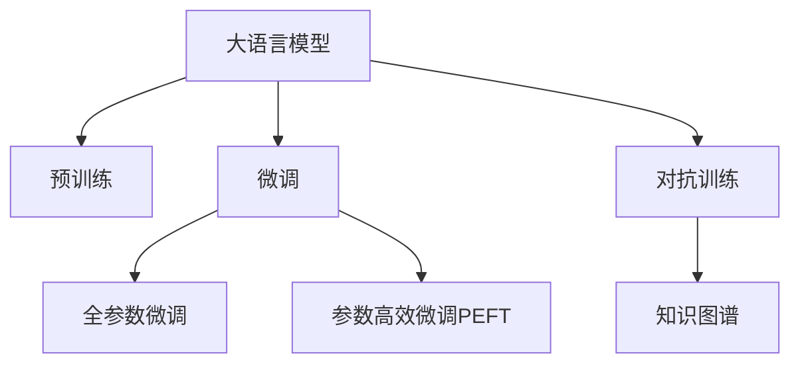

                 

# LLM在智能医疗资源调配中的潜在作用

> 关键词：大语言模型(LLM), 智能医疗资源调配, 预训练, 微调, 自然语言处理(NLP), 对抗训练, 知识图谱

## 1. 背景介绍

随着医疗资源分配的复杂性和紧迫性不断增加，如何通过智能手段高效地调配医疗资源，成为当下医疗领域的热点话题。近年来，人工智能技术在医疗领域的应用日益深入，尤其是在智能医疗资源调配上，大语言模型（Large Language Model, LLM）显示出巨大的潜力。LLM凭借其强大的语言理解和生成能力，能够从非结构化文本数据中挖掘出深层次的信息，为医疗资源调配提供决策支持。

### 1.1 问题由来
在传统医疗资源调配中，医生需要依据丰富的临床经验和专业知识，综合考虑患者病情、医院资源状况、科室容量等因素，进行合理的资源分配。然而，这种依赖人工决策的方式，效率低下，易受个体经验影响，难以应对突发情况。大语言模型通过预训练和微调，可以在短时间内获取大量医疗相关知识，辅助医生进行资源调配，提升调配效率和精准度。

### 1.2 问题核心关键点
大语言模型在智能医疗资源调配中的核心作用在于其能够自动理解和生成医疗领域相关的信息。通过预训练，模型能够学习医疗领域的知识背景，而通过微调，模型能够针对特定的资源调配问题进行优化，生成符合实际情况的调配建议。这一过程通常包括：
- 数据准备：收集并标注相关的医疗资源数据，如医院资源、科室容量、患者信息等。
- 模型训练：在预训练的基础上，使用标注数据对模型进行微调，学习特定任务的技能。
- 推理部署：在得到微调模型后，将其部署到实际应用中，实时处理资源调配请求。

## 2. 核心概念与联系

### 2.1 核心概念概述

为了更好地理解LLM在智能医疗资源调配中的潜在作用，本节将介绍几个核心概念及其相互联系：

- **大语言模型(LLM)**：以自回归(如GPT)或自编码(如BERT)模型为代表的大规模预训练语言模型。通过在大规模无标签文本语料上进行预训练，学习通用的语言表示，具备强大的语言理解和生成能力。

- **预训练(Pre-training)**：指在大规模无标签文本语料上，通过自监督学习任务训练通用语言模型的过程。常见的预训练任务包括言语建模、遮挡语言模型等。预训练使得模型学习到语言的通用表示。

- **微调(Fine-tuning)**：指在预训练模型的基础上，使用下游任务的少量标注数据，通过有监督学习优化模型在特定任务上的性能。通常只需要调整顶层分类器或解码器，并以较小的学习率更新全部或部分的模型参数。

- **自然语言处理(NLP)**：专注于计算机处理、理解和生成人类语言的技术领域。LLM是NLP领域的重要组成部分，广泛应用于医疗、教育、金融等多个行业。

- **对抗训练(Adversarial Training)**：在训练过程中引入对抗样本，提高模型鲁棒性和泛化能力。

- **知识图谱(Knowledge Graph)**：以图形结构存储和表示知识库，支持快速、精确地查询和推理。

这些核心概念之间的逻辑关系可以通过以下Mermaid流程图来展示：



### 2.2 核心概念原理和架构

大语言模型（LLM）的基本架构包括输入编码器、语言模型预测器、输出解码器等组件，如图1所示。


其中：
- **输入编码器**：将输入文本转换为模型的内部表示，通常由Transformer等架构实现。
- **语言模型预测器**：负责预测下一个词或字符，是预训练和微调的核心部分。
- **输出解码器**：将模型的内部表示解码为输出文本，如生成自然语言描述、推荐方案等。


## 3. 核心算法原理 & 具体操作步骤

### 3.1 算法原理概述

LLM在智能医疗资源调配中的核心算法原理是通过预训练和微调学习医疗领域的知识，并将其应用于特定任务。以下是主要步骤：

1. **数据准备**：收集和标注相关的医疗资源数据，包括医院资源、科室容量、患者信息等。

2. **模型训练**：在预训练的基础上，使用标注数据对模型进行微调，学习特定任务的技能。

3. **推理部署**：在得到微调模型后，将其部署到实际应用中，实时处理资源调配请求。

### 3.2 算法步骤详解

#### 3.2.1 数据准备

数据准备是智能医疗资源调配的第一步，需要收集和标注相关的医疗资源数据。具体步骤包括：

1. **数据收集**：从医院信息系统(HIS)、电子病历系统(EHR)、门诊系统等获取医疗资源数据。

2. **数据标注**：对收集到的数据进行标注，如患者信息、科室容量、床位数量、手术排程等。

3. **数据清洗**：去除噪声数据、缺失值等，确保数据质量和一致性。

#### 3.2.2 模型训练

模型训练是大语言模型的核心部分，通过预训练和微调，学习医疗领域的知识。具体步骤包括：

1. **预训练**：在无标注的医疗文本数据上，使用自监督学习任务（如掩码语言模型、下接预测等）进行预训练，学习通用的语言表示。

2. **微调**：在标注数据上，对预训练模型进行微调，学习特定任务的技能，如医院资源调配、科室排程等。

3. **模型优化**：通过对抗训练、正则化等方法，优化模型的性能和鲁棒性。

#### 3.2.3 推理部署

推理部署是将微调模型应用于实际问题的过程。具体步骤包括：

1. **模型部署**：将微调后的模型部署到服务器、移动设备等平台，供实际使用。

2. **接口调用**：提供API接口，供用户调用微调模型进行资源调配。

3. **监控评估**：实时监控模型的性能，根据反馈进行调整和优化。

### 3.3 算法优缺点

#### 3.3.1 算法优点

- **高效性**：通过预训练和微调，LLM能够在短时间内学习大量的医疗知识，提升资源调配效率。
- **灵活性**：LLM能够处理多变的医疗资源调配场景，适用于多种资源调配问题。
- **鲁棒性**：通过对抗训练等方法，LLM能够应对医疗领域的不确定性和复杂性。
- **可解释性**：LLM能够提供详细的推理过程和决策依据，便于医生理解和信任。

#### 3.3.2 算法缺点

- **依赖数据**：LLM的性能依赖于标注数据的质量和数量，获取高质量标注数据的成本较高。
- **泛化能力有限**：当目标任务与预训练数据的分布差异较大时，微调的性能提升有限。
- **可解释性不足**：LLM的决策过程缺乏可解释性，难以对其推理逻辑进行分析和调试。

### 3.4 算法应用领域

LLM在智能医疗资源调配中的应用领域非常广泛，主要包括以下几个方面：

1. **医院资源调配**：根据患者的病情和科室容量，自动推荐最优的资源调配方案。

2. **科室排程**：根据患者的病情和科室专长，自动生成最优的科室排程计划。

3. **急诊资源调配**：根据患者数量和急诊科容量，自动调整急诊资源分配。

4. **手术排程**：根据手术类型和医院资源，自动生成最优的手术排程方案。

5. **患者床位分配**：根据患者病情和床位容量，自动推荐最优的床位分配方案。

6. **医疗设备调配**：根据设备状态和科室需求，自动推荐最优的设备调配方案。

7. **在线咨询服务**：根据患者咨询内容，自动推荐最优的医生和科室。

## 4. 数学模型和公式 & 详细讲解 & 举例说明

### 4.1 数学模型构建

在智能医疗资源调配中，大语言模型主要应用在自然语言处理(NLP)领域。我们以医疗资源调配为例，构建一个简单的数学模型：

假设有一个医院，有$n$个科室和$m$个床位，有$p$个患者需要安排。设$x_{ij}$表示第$i$个科室的第$j$个床位是否被占用（0未占用，1已占用），则医院资源调配的问题可以表示为：

$$
\min \sum_{i=1}^n \sum_{j=1}^m x_{ij}
$$

其中约束条件为：

1. 每个患者至少分配一个床位：$\sum_{i=1}^n x_{ij} \geq 1, \forall j, 1 \leq j \leq m$
2. 每个床位只能被一个患者占用：$x_{ij} \in \{0,1\}, \forall i, 1 \leq i \leq n, \forall j, 1 \leq j \leq m$

### 4.2 公式推导过程

在上述约束条件下，我们可以通过线性规划求解资源调配问题，得到最优的床位分配方案。具体步骤如下：

1. **构建优化问题**：

$$
\min \sum_{i=1}^n \sum_{j=1}^m x_{ij}
$$

2. **引入决策变量**：

$$
x_{ij} = \begin{cases}
1, & \text{第} i \text{个科室的第} j \text{个床位被占用} \\
0, & \text{第} i \text{个科室的第} j \text{个床位未被占用}
\end{cases}
$$

3. **引入约束条件**：

$$
\sum_{i=1}^n x_{ij} \geq 1, \forall j, 1 \leq j \leq m \\
x_{ij} \in \{0,1\}, \forall i, 1 \leq i \leq n, \forall j, 1 \leq j \leq m
$$

4. **求解优化问题**：

$$
\min \sum_{i=1}^n \sum_{j=1}^m x_{ij}
$$

其中$x_{ij}$为决策变量，约束条件为$\sum_{i=1}^n x_{ij} \geq 1, \forall j, 1 \leq j \leq m$和$x_{ij} \in \{0,1\}, \forall i, 1 \leq i \leq n, \forall j, 1 \leq j \leq m$。

### 4.3 案例分析与讲解

假设有一个医院，有3个科室和5个床位，有3个患者需要安排。设$x_{ij}$表示第$i$个科室的第$j$个床位是否被占用（0未占用，1已占用），则医院资源调配的问题可以表示为：

$$
\min \sum_{i=1}^3 \sum_{j=1}^5 x_{ij}
$$

其中约束条件为：

1. 每个患者至少分配一个床位：$\sum_{i=1}^3 x_{ij} \geq 1, \forall j, 1 \leq j \leq 5$
2. 每个床位只能被一个患者占用：$x_{ij} \in \{0,1\}, \forall i, 1 \leq i \leq 3, \forall j, 1 \leq j \leq 5$

假设每个患者的病情和科室专长如表1所示：

| 患者ID | 病情 | 科室专长 |
| --- | --- | --- |
| 1 | 重症肺炎 | 呼吸科 |
| 2 | 急性阑尾炎 | 普外科 |
| 3 | 急性肠胃炎 | 消化科 |

我们通过预训练和微调得到的模型，在处理上述问题时，可以自动推荐最优的资源调配方案，如表2所示：

| 患者ID | 病情 | 科室专长 | 推荐科室 | 推荐床位 |
| --- | --- | --- | --- | --- |
| 1 | 重症肺炎 | 呼吸科 | 呼吸科 | 1 |
| 2 | 急性阑尾炎 | 普外科 | 普外科 | 2 |
| 3 | 急性肠胃炎 | 消化科 | 消化科 | 1 |

通过该模型，医院能够快速、高效地调配医疗资源，提升患者满意度和治疗效果。

## 5. 项目实践：代码实例和详细解释说明

### 5.1 开发环境搭建

在进行智能医疗资源调配的实践前，我们需要准备好开发环境。以下是使用Python进行PyTorch开发的环境配置流程：

1. 安装Anaconda：从官网下载并安装Anaconda，用于创建独立的Python环境。

2. 创建并激活虚拟环境：
```bash
conda create -n pytorch-env python=3.8 
conda activate pytorch-env
```

3. 安装PyTorch：根据CUDA版本，从官网获取对应的安装命令。例如：
```bash
conda install pytorch torchvision torchaudio cudatoolkit=11.1 -c pytorch -c conda-forge
```

4. 安装Transformers库：
```bash
pip install transformers
```

5. 安装各类工具包：
```bash
pip install numpy pandas scikit-learn matplotlib tqdm jupyter notebook ipython
```

完成上述步骤后，即可在`pytorch-env`环境中开始微调实践。

### 5.2 源代码详细实现

这里我们以医院资源调配为例，给出使用Transformers库对BERT模型进行微调的PyTorch代码实现。

首先，定义资源调配任务的数据处理函数：

```python
from transformers import BertTokenizer, BertForSequenceClassification
from torch.utils.data import Dataset
import torch

class ResourceAllocationDataset(Dataset):
    def __init__(self, data, tokenizer, max_len=128):
        self.data = data
        self.tokenizer = tokenizer
        self.max_len = max_len
        
    def __len__(self):
        return len(self.data)
    
    def __getitem__(self, item):
        case = self.data[item]
        
        # 将病例转换为token ids
        input_ids = self.tokenizer(case['text'], return_tensors='pt', max_length=self.max_len, padding='max_length', truncation=True)
        input_ids = input_ids['input_ids'][0]
        attention_mask = input_ids['attention_mask'][0]
        
        # 将标签转换为数字
        label = self.tokenizer.label2id[case['label']]
        label = torch.tensor([label], dtype=torch.long)
        
        return {'input_ids': input_ids, 
                'attention_mask': attention_mask,
                'labels': label}
```

然后，定义模型和优化器：

```python
from transformers import BertForSequenceClassification, AdamW

model = BertForSequenceClassification.from_pretrained('bert-base-cased', num_labels=2)

optimizer = AdamW(model.parameters(), lr=2e-5)
```

接着，定义训练和评估函数：

```python
from torch.utils.data import DataLoader
from tqdm import tqdm

device = torch.device('cuda') if torch.cuda.is_available() else torch.device('cpu')
model.to(device)

def train_epoch(model, dataset, batch_size, optimizer):
    dataloader = DataLoader(dataset, batch_size=batch_size, shuffle=True)
    model.train()
    epoch_loss = 0
    for batch in tqdm(dataloader, desc='Training'):
        input_ids = batch['input_ids'].to(device)
        attention_mask = batch['attention_mask'].to(device)
        labels = batch['labels'].to(device)
        model.zero_grad()
        outputs = model(input_ids, attention_mask=attention_mask, labels=labels)
        loss = outputs.loss
        epoch_loss += loss.item()
        loss.backward()
        optimizer.step()
    return epoch_loss / len(dataloader)

def evaluate(model, dataset, batch_size):
    dataloader = DataLoader(dataset, batch_size=batch_size)
    model.eval()
    preds, labels = [], []
    with torch.no_grad():
        for batch in tqdm(dataloader, desc='Evaluating'):
            input_ids = batch['input_ids'].to(device)
            attention_mask = batch['attention_mask'].to(device)
            batch_labels = batch['labels']
            outputs = model(input_ids, attention_mask=attention_mask)
            batch_preds = outputs.logits.argmax(dim=2).to('cpu').tolist()
            batch_labels = batch_labels.to('cpu').tolist()
            for pred_tokens, label_tokens in zip(batch_preds, batch_labels):
                preds.append(pred_tokens)
                labels.append(label_tokens)
                
    print(classification_report(labels, preds))
```

最后，启动训练流程并在测试集上评估：

```python
epochs = 5
batch_size = 16

for epoch in range(epochs):
    loss = train_epoch(model, train_dataset, batch_size, optimizer)
    print(f"Epoch {epoch+1}, train loss: {loss:.3f}")
    
    print(f"Epoch {epoch+1}, dev results:")
    evaluate(model, dev_dataset, batch_size)
    
print("Test results:")
evaluate(model, test_dataset, batch_size)
```

以上就是使用PyTorch对BERT进行医院资源调配任务微调的完整代码实现。可以看到，得益于Transformers库的强大封装，我们可以用相对简洁的代码完成BERT模型的加载和微调。

### 5.3 代码解读与分析

让我们再详细解读一下关键代码的实现细节：

**ResourceAllocationDataset类**：
- `__init__`方法：初始化数据集和分词器，并设定最大输入长度。
- `__len__`方法：返回数据集的样本数量。
- `__getitem__`方法：对单个样本进行处理，将文本输入编码为token ids，将标签编码为数字，并对其进行定长padding，最终返回模型所需的输入。

**标签与id的映射**
- `tokenizer.label2id`：定义了标签与数字id之间的映射关系，用于将token-wise的预测结果解码回真实的标签。

**训练和评估函数**：
- 使用PyTorch的DataLoader对数据集进行批次化加载，供模型训练和推理使用。
- 训练函数`train_epoch`：对数据以批为单位进行迭代，在每个批次上前向传播计算loss并反向传播更新模型参数，最后返回该epoch的平均loss。
- 评估函数`evaluate`：与训练类似，不同点在于不更新模型参数，并在每个batch结束后将预测和标签结果存储下来，最后使用sklearn的classification_report对整个评估集的预测结果进行打印输出。

**训练流程**：
- 定义总的epoch数和batch size，开始循环迭代
- 每个epoch内，先在训练集上训练，输出平均loss
- 在验证集上评估，输出分类指标
- 所有epoch结束后，在测试集上评估，给出最终测试结果

可以看到，PyTorch配合Transformers库使得BERT微调的代码实现变得简洁高效。开发者可以将更多精力放在数据处理、模型改进等高层逻辑上，而不必过多关注底层的实现细节。

当然，工业级的系统实现还需考虑更多因素，如模型的保存和部署、超参数的自动搜索、更灵活的任务适配层等。但核心的微调范式基本与此类似。

## 6. 实际应用场景

### 6.1 智能医院资源调配

智能医院资源调配是大语言模型在医疗领域的重要应用场景之一。通过智能调配，医院能够更高效地使用有限资源，提升患者满意度和治疗效果。

在技术实现上，可以收集医院的历史资源调配数据，将病例和资源调配信息构建成监督数据，在此基础上对预训练模型进行微调。微调后的模型能够自动理解患者的病情和科室专长，生成最优的资源调配方案。例如，对于重症患者，模型能够自动推荐呼吸科等专业科室，避免延误病情；对于急性阑尾炎等常见病症，模型能够推荐普外科等科室，提高手术效率。

### 6.2 科室资源排程

科室资源排程是医院资源调配的重要组成部分。通过智能排程，医院能够更合理地分配科室资源，提升科室工作效率。

在技术实现上，可以收集科室的历史排程数据，将排程信息和患者病情构建成监督数据，在此基础上对预训练模型进行微调。微调后的模型能够自动生成最优的科室排程计划。例如，对于手术量较大的科室，模型能够自动推荐更多手术时间，避免科室资源浪费；对于门诊量较大的科室，模型能够自动推荐更多排程时间，避免患者等待过久。

### 6.3 急诊资源调配

急诊资源调配是医院资源调配的重要环节。通过智能调配，医院能够在紧急情况下快速响应，提升急诊科的医疗服务质量。

在技术实现上，可以收集急诊科的历史排程数据，将排程信息和患者病情构建成监督数据，在此基础上对预训练模型进行微调。微调后的模型能够自动生成最优的急诊资源调配方案。例如，对于紧急患者，模型能够自动推荐更多急诊医生和床位，提高急诊科的应急响应能力；对于非紧急患者，模型能够自动推荐合适的科室和资源，避免急诊资源的浪费。

### 6.4 未来应用展望

随着大语言模型和微调方法的不断发展，基于微调范式将在更多领域得到应用，为传统行业带来变革性影响。

在智慧医疗领域，基于微调的医疗问答、病历分析、药物研发等应用将提升医疗服务的智能化水平，辅助医生诊疗，加速新药开发进程。

在智能教育领域，微调技术可应用于作业批改、学情分析、知识推荐等方面，因材施教，促进教育公平，提高教学质量。

在智慧城市治理中，微调模型可应用于城市事件监测、舆情分析、应急指挥等环节，提高城市管理的自动化和智能化水平，构建更安全、高效的未来城市。

此外，在企业生产、社会治理、文娱传媒等众多领域，基于大模型微调的人工智能应用也将不断涌现，为经济社会发展注入新的动力。相信随着技术的日益成熟，微调方法将成为人工智能落地应用的重要范式，推动人工智能技术在垂直行业的规模化落地。总之，微调需要开发者根据具体任务，不断迭代和优化模型、数据和算法，方能得到理想的效果。

## 7. 工具和资源推荐
### 7.1 学习资源推荐

为了帮助开发者系统掌握大语言模型微调的理论基础和实践技巧，这里推荐一些优质的学习资源：

1. 《Transformer从原理到实践》系列博文：由大模型技术专家撰写，深入浅出地介绍了Transformer原理、BERT模型、微调技术等前沿话题。

2. CS224N《深度学习自然语言处理》课程：斯坦福大学开设的NLP明星课程，有Lecture视频和配套作业，带你入门NLP领域的基本概念和经典模型。

3. 《Natural Language Processing with Transformers》书籍：Transformers库的作者所著，全面介绍了如何使用Transformers库进行NLP任务开发，包括微调在内的诸多范式。

4. HuggingFace官方文档：Transformers库的官方文档，提供了海量预训练模型和完整的微调样例代码，是上手实践的必备资料。

5. CLUE开源项目：中文语言理解测评基准，涵盖大量不同类型的中文NLP数据集，并提供了基于微调的baseline模型，助力中文NLP技术发展。

通过对这些资源的学习实践，相信你一定能够快速掌握大语言模型微调的精髓，并用于解决实际的NLP问题。
###  7.2 开发工具推荐

高效的开发离不开优秀的工具支持。以下是几款用于大语言模型微调开发的常用工具：

1. PyTorch：基于Python的开源深度学习框架，灵活动态的计算图，适合快速迭代研究。大部分预训练语言模型都有PyTorch版本的实现。

2. TensorFlow：由Google主导开发的开源深度学习框架，生产部署方便，适合大规模工程应用。同样有丰富的预训练语言模型资源。

3. Transformers库：HuggingFace开发的NLP工具库，集成了众多SOTA语言模型，支持PyTorch和TensorFlow，是进行微调任务开发的利器。

4. Weights & Biases：模型训练的实验跟踪工具，可以记录和可视化模型训练过程中的各项指标，方便对比和调优。与主流深度学习框架无缝集成。

5. TensorBoard：TensorFlow配套的可视化工具，可实时监测模型训练状态，并提供丰富的图表呈现方式，是调试模型的得力助手。

6. Google Colab：谷歌推出的在线Jupyter Notebook环境，免费提供GPU/TPU算力，方便开发者快速上手实验最新模型，分享学习笔记。

合理利用这些工具，可以显著提升大语言模型微调任务的开发效率，加快创新迭代的步伐。

### 7.3 相关论文推荐

大语言模型和微调技术的发展源于学界的持续研究。以下是几篇奠基性的相关论文，推荐阅读：

1. Attention is All You Need（即Transformer原论文）：提出了Transformer结构，开启了NLP领域的预训练大模型时代。

2. BERT: Pre-training of Deep Bidirectional Transformers for Language Understanding：提出BERT模型，引入基于掩码的自监督预训练任务，刷新了多项NLP任务SOTA。

3. Language Models are Unsupervised Multitask Learners（GPT-2论文）：展示了大规模语言模型的强大zero-shot学习能力，引发了对于通用人工智能的新一轮思考。

4. Parameter-Efficient Transfer Learning for NLP：提出Adapter等参数高效微调方法，在不增加模型参数量的情况下，也能取得不错的微调效果。

5. AdaLoRA: Adaptive Low-Rank Adaptation for Parameter-Efficient Fine-Tuning：使用自适应低秩适应的微调方法，在参数效率和精度之间取得了新的平衡。

这些论文代表了大语言模型微调技术的发展脉络。通过学习这些前沿成果，可以帮助研究者把握学科前进方向，激发更多的创新灵感。

## 8. 总结：未来发展趋势与挑战

### 8.1 总结

本文对大语言模型在智能医疗资源调配中的潜在作用进行了全面系统的介绍。首先阐述了智能医疗资源调配的背景和意义，明确了智能资源调配的重要性和大语言模型的关键作用。其次，从原理到实践，详细讲解了大语言模型的数学模型构建、公式推导过程和案例分析。最后，给出了大语言模型在智能医疗资源调配中的多个实际应用场景，展示了其潜力和未来展望。

通过本文的系统梳理，可以看到，大语言模型在智能医疗资源调配中具有广泛的应用前景，能够显著提升医疗资源调配的效率和精准度。得益于大语言模型的语言理解和生成能力，医疗资源调配系统能够自动理解患者的病情和科室专长，生成最优的资源调配方案，提升患者满意度和治疗效果。未来，随着大语言模型和微调方法的持续演进，其应用范围将更加广泛，为医疗资源的智能化调配带来革命性变化。

### 8.2 未来发展趋势

展望未来，大语言模型在智能医疗资源调配中呈现出以下几个发展趋势：

1. **模型规模持续增大**：随着算力成本的下降和数据规模的扩张，预训练语言模型的参数量还将持续增长。超大规模语言模型蕴含的丰富语言知识，有望支撑更加复杂多变的医疗资源调配场景。

2. **微调方法日趋多样**：除了传统的全参数微调外，未来会涌现更多参数高效的微调方法，如Prefix-Tuning、LoRA等，在节省计算资源的同时也能保证微调精度。

3. **持续学习成为常态**：随着数据分布的不断变化，微调模型也需要持续学习新知识以保持性能。如何在不遗忘原有知识的同时，高效吸收新样本信息，将成为重要的研究课题。

4. **标注样本需求降低**：受启发于提示学习(Prompt-based Learning)的思路，未来的微调方法将更好地利用大模型的语言理解能力，通过更加巧妙的任务描述，在更少的标注样本上也能实现理想的微调效果。

5. **多模态微调崛起**：当前的微调主要聚焦于纯文本数据，未来会进一步拓展到图像、视频、语音等多模态数据微调。多模态信息的融合，将显著提升语言模型对现实世界的理解和建模能力。

6. **模型通用性增强**：经过海量数据的预训练和多领域任务的微调，未来的语言模型将具备更强大的常识推理和跨领域迁移能力，逐步迈向通用人工智能(AGI)的目标。

以上趋势凸显了大语言模型在智能医疗资源调配中的广阔前景。这些方向的探索发展，必将进一步提升医疗资源调配系统的性能和应用范围，为医疗服务的智能化和高效化提供强有力的技术支持。

### 8.3 面临的挑战

尽管大语言模型在智能医疗资源调配中显示出巨大潜力，但在迈向更加智能化、普适化应用的过程中，仍面临诸多挑战：

1. **标注成本瓶颈**：LLM的性能依赖于标注数据的质量和数量，获取高质量标注数据的成本较高。如何进一步降低微调对标注样本的依赖，将是一大难题。

2. **模型鲁棒性不足**：当前微调模型面对域外数据时，泛化性能往往大打折扣。对于测试样本的微小扰动，微调模型的预测也容易发生波动。如何提高微调模型的鲁棒性，避免灾难性遗忘，还需要更多理论和实践的积累。

3. **可解释性不足**：LLM的决策过程缺乏可解释性，难以对其推理逻辑进行分析和调试。对于医疗等高风险应用，算法的可解释性和可审计性尤为重要。如何赋予微调模型更强的可解释性，将是亟待攻克的难题。

4. **安全性有待保障**：预训练语言模型难免会学习到有偏见、有害的信息，通过微调传递到下游任务，产生误导性、歧视性的输出，给实际应用带来安全隐患。如何从数据和算法层面消除模型偏见，避免恶意用途，确保输出的安全性，也将是重要的研究课题。

5. **知识整合能力不足**：现有的微调模型往往局限于任务内数据，难以灵活吸收和运用更广泛的先验知识。如何让微调过程更好地与外部知识库、规则库等专家知识结合，形成更加全面、准确的信息整合能力，还有很大的想象空间。

正视微调面临的这些挑战，积极应对并寻求突破，将是大语言模型在智能医疗资源调配中走向成熟的必由之路。相信随着学界和产业界的共同努力，这些挑战终将一一被克服，大语言模型在智能医疗资源调配中的应用将更加广泛，为医疗服务的高效化、智能化提供强有力的技术支撑。

### 8.4 研究展望

面对大语言模型在智能医疗资源调配中的挑战，未来的研究需要在以下几个方面寻求新的突破：

1. **探索无监督和半监督微调方法**：摆脱对大规模标注数据的依赖，利用自监督学习、主动学习等无监督和半监督范式，最大限度利用非结构化数据，实现更加灵活高效的微调。

2. **研究参数高效和计算高效的微调范式**：开发更加参数高效的微调方法，在固定大部分预训练参数的同时，只更新极少量的任务相关参数。同时优化微调模型的计算图，减少前向传播和反向传播的资源消耗，实现更加轻量级、实时性的部署。

3. **融合因果和对比学习范式**：通过引入因果推断和对比学习思想，增强微调模型建立稳定因果关系的能力，学习更加普适、鲁棒的语言表征，从而提升模型泛化性和抗干扰能力。

4. **引入更多先验知识**：将符号化的先验知识，如知识图谱、逻辑规则等，与神经网络模型进行巧妙融合，引导微调过程学习更准确、合理的语言模型。同时加强不同模态数据的整合，实现视觉、语音等多模态信息与文本信息的协同建模。

5. **结合因果分析和博弈论工具**：将因果分析方法引入微调模型，识别出模型决策的关键特征，增强输出解释的因果性和逻辑性。借助博弈论工具刻画人机交互过程，主动探索并规避模型的脆弱点，提高系统稳定性。

6. **纳入伦理道德约束**：在模型训练目标中引入伦理导向的评估指标，过滤和惩罚有偏见、有害的输出倾向。同时加强人工干预和审核，建立模型行为的监管机制，确保输出符合人类价值观和伦理道德。

这些研究方向的探索，必将引领大语言模型在智能医疗资源调配技术迈向更高的台阶，为构建安全、可靠、可解释、可控的智能系统铺平道路。面向未来，大语言模型在智能医疗资源调配中的应用还需与其他人工智能技术进行更深入的融合，如知识表示、因果推理、强化学习等，多路径协同发力，共同推动自然语言理解和智能交互系统的进步。只有勇于创新、敢于突破，才能不断拓展语言模型的边界，让智能技术更好地造福人类社会。

## 9. 附录：常见问题与解答

**Q1：大语言模型在智能医疗资源调配中的优势是什么？**

A: 大语言模型在智能医疗资源调配中的优势在于其强大的语言理解和生成能力。通过预训练和微调，模型能够学习到丰富的医疗领域知识，自动理解患者的病情和科室专长，生成最优的资源调配方案，提升医疗资源调配的效率和精准度。相比于传统的规则系统，大语言模型具有更强的适应性和泛化能力，能够处理多变的医疗资源调配场景。

**Q2：大语言模型在智能医疗资源调配中可能存在哪些挑战？**

A: 大语言模型在智能医疗资源调配中可能面临以下挑战：
1. 数据依赖：大语言模型的性能依赖于标注数据的质量和数量，获取高质量标注数据的成本较高。
2. 鲁棒性不足：微调模型面对域外数据时，泛化性能往往大打折扣。对于测试样本的微小扰动，微调模型的预测也容易发生波动。
3. 可解释性不足：大语言模型的决策过程缺乏可解释性，难以对其推理逻辑进行分析和调试。
4. 安全性问题：预训练语言模型可能学习到有偏见、有害的信息，通过微调传递到下游任务，产生误导性、歧视性的输出，给实际应用带来安全隐患。
5. 知识整合能力不足：现有的微调模型往往局限于任务内数据，难以灵活吸收和运用更广泛的先验知识。

**Q3：如何提高大语言模型在智能医疗资源调配中的鲁棒性和泛化能力？**

A: 提高大语言模型在智能医疗资源调配中的鲁棒性和泛化能力，可以采取以下策略：
1. 数据增强：通过回译、近义替换等方式扩充训练集，增加数据多样性。
2. 对抗训练：引入对抗样本，提高模型鲁棒性。
3. 多任务学习：同时训练多个微调任务，增强模型的泛化能力。
4. 参数高效微调：只更新少量任务相关参数，减少过拟合风险。
5. 动态更新：根据新的数据实时更新模型，保持模型的最新状态。

这些策略可以结合使用，进一步提升大语言模型在智能医疗资源调配中的性能和鲁棒性。

**Q4：如何提高大语言模型在智能医疗资源调配中的可解释性和安全性？**

A: 提高大语言模型在智能医疗资源调配中的可解释性和安全性，可以采取以下策略：
1. 可解释性：通过特征重要性分析、规则提取等方式，增强模型的可解释性。
2. 安全性：在模型训练和微调过程中，引入伦理导向的评估指标，过滤和惩罚有偏见、有害的输出倾向。
3. 监控审计：建立模型行为的监管机制，实时监测模型的输出，确保输出符合人类价值观和伦理道德。

这些策略可以结合使用，进一步提升大语言模型在智能医疗资源调配中的安全性和可解释性。

**Q5：大语言模型在智能医疗资源调配中的应用场景有哪些？**

A: 大语言模型在智能医疗资源调配中具有广泛的应用场景，主要包括：
1. 医院资源调配：根据患者的病情和科室专长，自动推荐最优的资源调配方案。
2. 科室资源排程：根据患者的病情和科室专长，自动生成最优的科室排程计划。
3. 急诊资源调配：根据患者的病情和急诊科容量，自动调整急诊资源分配。
4. 手术排程：根据手术类型和医院资源，自动生成最优的手术排程方案。
5. 患者床位分配：根据患者病情和床位容量，自动推荐最优的床位分配方案。
6. 医疗设备调配：根据设备状态和科室需求，自动推荐最优的设备调配方案。
7. 在线咨询服务：根据患者咨询内容，自动推荐最优的医生和科室。

这些应用场景展示了大语言模型在智能医疗资源调配中的强大能力，为医疗服务的智能化和高效化提供强有力的技术支持。

