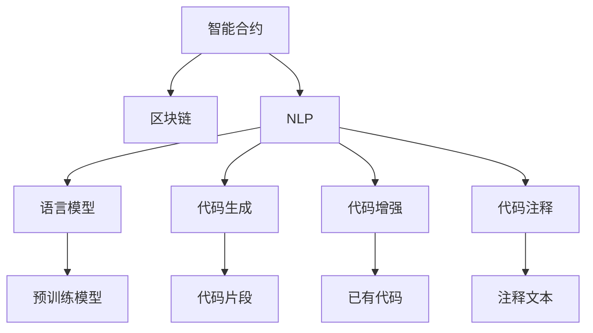

                 

# 《LLM在智能合约中的应用可能》

> 关键词：智能合约,区块链,语言模型,自动化执行,智能合约优化

## 1. 背景介绍

随着区块链技术的不断发展，智能合约(智能合约, Smart Contracts)成为一种新的编程范式，广泛用于各类场景，从去中心化金融(DeFi)到供应链管理，从身份认证到版权登记，都出现了智能合约的身影。智能合约的自动化执行特性，可以有效降低交易成本、提高安全性、增强透明度，被誉为下一代金融科技的重要组成部分。然而，智能合约并非完美无缺，仍面临着代码漏洞、执行效率、合规性等方面的挑战。

近年来，语言模型（Language Model, LLM）在自然语言处理(Natural Language Processing, NLP)领域取得了巨大进展。以Transformer为代表的预训练语言模型，通过大规模无监督学习，学到了丰富的语言知识，具备强大的语言理解和生成能力。这些模型在文本分类、命名实体识别、情感分析、机器翻译、问答系统等任务上表现优异，已经在多个行业得到了广泛应用。

将语言模型应用于智能合约中，可以帮助开发者更高效地编写智能合约，并提升智能合约的执行效率和合规性。智能合约的语言模型应用，不仅能降低开发难度和成本，还能在处理复杂业务逻辑和多模态数据时发挥重要作用。本文将系统地探讨语言模型在智能合约中的应用可能，给出具体的实现方案和技术细节，并对未来的研究方向进行展望。

## 2. 核心概念与联系

### 2.1 核心概念概述

为更好地理解智能合约中的语言模型应用，本节将介绍几个密切相关的核心概念：

- 智能合约(Smart Contracts)：部署在区块链上的自执行、自验证的合约，使用代码自动执行、控制资产转移和业务逻辑。

- 区块链(Blockchain)：一种分布式账本技术，通过去中心化方式记录交易信息，确保不可篡改、透明可追溯。

- 自然语言处理(NLP)：研究如何使计算机处理和理解人类语言的技术，涵盖了文本处理、语音识别、语言生成等多个方向。

- 语言模型(Language Model)：用于预测一段给定文本的下一个单词或字节的概率分布的模型，通过无监督学习学到了语言的统计规律和语言知识。

- 预训练语言模型(Pre-trained Language Model, PLM)：使用大规模语料库预训练的语言模型，如BERT、GPT等。

- 代码生成(Code Generation)：使用语言模型自动生成程序代码，降低软件开发成本，提升代码质量。

- 代码增强(Code Augmentation)：基于已有代码片段，生成更多、更完整的代码，丰富开发者的代码库。

- 代码注释(Code Comment)：使用自然语言生成代码注释，提高代码可读性，帮助开发者理解代码逻辑。

这些核心概念之间的逻辑关系可以通过以下Mermaid流程图来展示：



这个流程图展示了一些关键概念及其之间的关系：

1. 智能合约通过区块链技术实现自动化执行，确保交易透明、安全、不可篡改。
2. NLP技术用于处理自然语言输入，实现智能合约的用户交互。
3. 语言模型可以用于自动生成代码，提升开发效率。
4. 代码生成和增强技术，进一步丰富代码库，提升代码质量。
5. 代码注释技术，提升代码可读性，帮助开发者理解代码逻辑。
6. 预训练模型利用大规模数据学习语言知识，提升代码生成和注释的质量。

这些概念共同构成了语言模型在智能合约中的应用框架，使得智能合约的开发、测试、维护等环节变得更加高效、智能。

## 3. 核心算法原理 & 具体操作步骤

### 3.1 算法原理概述

语言模型在智能合约中的应用，主要体现在代码生成、代码增强和代码注释三个方面。

**代码生成**：利用语言模型自动生成智能合约的代码片段，特别是对于一些重复出现的业务逻辑或代码片段，可以大幅提高开发效率。

**代码增强**：基于已有的代码片段，使用语言模型生成更多、更完整的代码，丰富开发者的代码库，降低重复开发的工作量。

**代码注释**：使用自然语言生成代码注释，提升代码可读性，帮助开发者理解代码逻辑，降低维护成本。

上述三个方面的共同点是，都需要将自然语言转化为程序代码。这一过程通常称为代码翻译或程序生成。

形式化地，假设给定自然语言输入 $T$，要求生成对应的程序代码 $C$。则代码生成过程可建模为如下映射：

$$
C = f(T)
$$

其中 $f$ 为代码生成函数，其输入为自然语言 $T$，输出为程序代码 $C$。

### 3.2 算法步骤详解

基于语言模型的智能合约代码生成、增强和注释可以按以下步骤进行：

**Step 1: 数据准备**
- 收集智能合约项目中的代码片段、注释、输入文本等，构建数据集。
- 预处理文本数据，如分词、去除停用词、词干提取等，以降低模型输入的复杂度。

**Step 2: 模型选择与训练**
- 选择适合的预训练语言模型，如GPT-3、BERT等，进行微调或finetune。
- 将数据集划分为训练集、验证集和测试集，使用交叉验证方法训练模型。
- 使用BLEU、ROUGE等指标评估模型生成代码的质量，不断调整超参数优化模型性能。

**Step 3: 代码生成**
- 给定自然语言输入 $T$，使用训练好的语言模型生成对应的程序代码 $C$。
- 根据智能合约的业务逻辑，筛选生成的代码片段，确保其符合规范。

**Step 4: 代码增强**
- 选取已有的代码片段 $C_1$，使用语言模型生成新的代码片段 $C_2$。
- 将 $C_1$ 和 $C_2$ 合并，得到更完整的代码片段。

**Step 5: 代码注释**
- 给定程序代码 $C$，使用语言模型生成对应的注释 $D$。
- 根据注释生成代码，提升代码的可读性和可维护性。

### 3.3 算法优缺点

基于语言模型的智能合约代码生成、增强和注释技术，具有以下优点：

1. 提高开发效率：利用语言模型自动生成代码，可以大大降低软件开发成本，提升开发效率。
2. 提升代码质量：基于已有的代码片段，使用语言模型生成更多的代码，可以丰富代码库，提升代码质量。
3. 提高代码可读性：使用自然语言生成代码注释，提高代码可读性，降低维护成本。

同时，该方法也存在一定的局限性：

1. 依赖高质量数据：生成高质量代码，需要依赖高质量的数据集，这可能会带来较高的标注成本。
2. 泛化能力有限：生成的代码可能无法完全符合预期的业务逻辑，需要人工干预和调试。
3. 安全性风险：生成的代码可能存在安全漏洞，需要严格测试和验证。

尽管存在这些局限性，但就目前而言，语言模型在智能合约中的应用潜力巨大，值得深入研究和探索。

### 3.4 算法应用领域

基于语言模型的智能合约代码生成、增强和注释技术，已经在多个领域得到了应用，例如：

1. 去中心化金融(DeFi)：生成自动化交易逻辑，提升交易效率和安全性。

2. 供应链管理：生成物流流程控制逻辑，实现智能物流管理。

3. 版权登记：生成智能合约，自动登记和转移版权。

4. 身份认证：生成智能合约，自动验证用户身份，提升系统安全性。

5. 资产管理：生成智能合约，自动管理资产，提高资产运营效率。

6. 智能合约优化：生成优化后的智能合约代码，提升智能合约的执行效率和鲁棒性。

除了上述这些经典应用外，语言模型还可以用于生成智能合约的测试用例、自动化审计、自动化文档生成等任务，进一步拓展智能合约的自动化能力。

## 4. 数学模型和公式 & 详细讲解 & 举例说明

### 4.1 数学模型构建

本节将使用数学语言对基于语言模型的智能合约代码生成、增强和注释过程进行更加严格的刻画。

记自然语言输入 $T$ 和对应的程序代码 $C$，则代码生成过程可以建模为如下优化问题：

$$
\min_{C} \text{distance}(T, C)
$$

其中 $\text{distance}$ 为自然语言和程序代码之间的距离度量，如BLEU、ROUGE、SEER等。

假设使用预训练语言模型 $M_{\theta}$ 对自然语言进行编码，得到编码向量 $h$。则代码生成过程可以进一步表示为：

$$
C = \text{Dec}_{M_{\theta}}(h)
$$

其中 $\text{Dec}_{M_{\theta}}$ 为解码函数，用于将编码向量 $h$ 转换为程序代码 $C$。

### 4.2 公式推导过程

以下我们以自然语言到程序代码的翻译为例，推导代码生成过程的损失函数及其优化算法。

假设自然语言输入 $T$ 的长度为 $n$，对应的程序代码 $C$ 的长度为 $m$。设 $\theta$ 为语言模型的参数，则代码生成过程的损失函数可以定义为：

$$
\mathcal{L}(T, C) = -\log P(C|T; \theta)
$$

其中 $P(C|T; \theta)$ 为给定自然语言输入 $T$ 下，生成程序代码 $C$ 的概率。由于代码长度有限，可以假设 $P(C|T; \theta)$ 服从二项分布，则有：

$$
P(C|T; \theta) = \prod_{i=1}^{m} P(c_i|T, c_1...c_{i-1}; \theta)
$$

其中 $c_i$ 为程序代码中的第 $i$ 个字符。

为了简化计算，可以引入隐变量 $z_i$，将 $P(c_i|T, c_1...c_{i-1}; \theta)$ 建模为条件概率分布，即：

$$
P(c_i|T, c_1...c_{i-1}, z_i; \theta) = P(c_i|z_i; \theta)
$$

其中 $z_i$ 为隐变量，表示在给定自然语言 $T$ 和前 $i-1$ 个字符 $c_1...c_{i-1}$ 的情况下，生成字符 $c_i$ 的条件概率。

则代码生成过程的损失函数可以表示为：

$$
\mathcal{L}(T, C) = -\log \prod_{i=1}^{m} P(c_i|z_i; \theta)
$$

为了训练模型，可以将损失函数分解为：

$$
\mathcal{L}(T, C) = -\sum_{i=1}^{m} \log P(c_i|z_i; \theta)
$$

其中 $P(c_i|z_i; \theta)$ 可以通过解码函数 $\text{Dec}_{M_{\theta}}$ 生成。

在得到损失函数后，可以使用优化算法（如Adam、RMSprop等）来最小化损失函数，生成对应的程序代码 $C$。

### 4.3 案例分析与讲解

以智能合约中的自动化交易逻辑为例，探讨语言模型的应用。

假设要编写一个基于市场价差套利的智能合约，需要输入以下自然语言描述：

```
如果A的价格高于B的价格，买入A并卖出B，否则卖出A并买入B。
```

使用语言模型生成对应的程序代码如下：

```python
def trade_logic(price_a, price_b):
    if price_a > price_b:
        buy_price_a, sell_price_b = price_a, price_b
    else:
        buy_price_a, sell_price_b = price_b, price_a
    return buy_price_a, sell_price_b
```

可以看到，语言模型能够将自然语言描述转化为程序代码，实现自动化交易逻辑。

## 5. 项目实践：代码实例和详细解释说明

### 5.1 开发环境搭建

在进行语言模型在智能合约中的应用实践前，我们需要准备好开发环境。以下是使用Python进行PyTorch开发的环境配置流程：

1. 安装Anaconda：从官网下载并安装Anaconda，用于创建独立的Python环境。

2. 创建并激活虚拟环境：
```bash
conda create -n language_model-env python=3.8 
conda activate language_model-env
```

3. 安装PyTorch：根据CUDA版本，从官网获取对应的安装命令。例如：
```bash
conda install pytorch torchvision torchaudio cudatoolkit=11.1 -c pytorch -c conda-forge
```

4. 安装Transformers库：
```bash
pip install transformers
```

5. 安装各类工具包：
```bash
pip install numpy pandas scikit-learn matplotlib tqdm jupyter notebook ipython
```

完成上述步骤后，即可在`language_model-env`环境中开始语言模型在智能合约中的应用实践。

### 5.2 源代码详细实现

这里我们以自然语言到程序代码的翻译为例，给出使用Transformers库对GPT模型进行代码翻译的PyTorch代码实现。

首先，定义代码生成函数：

```python
from transformers import GPT2LMHeadModel, GPT2Tokenizer

def generate_code(input_text, model, tokenizer, max_len=128):
    inputs = tokenizer(input_text, return_tensors='pt')
    outputs = model.generate(inputs.input_ids, max_length=max_len, do_sample=True)
    generated_text = tokenizer.decode(outputs[0])
    return generated_text
```

然后，定义智能合约代码生成示例：

```python
from transformers import GPT2LMHeadModel, GPT2Tokenizer

tokenizer = GPT2Tokenizer.from_pretrained('gpt2')
model = GPT2LMHeadModel.from_pretrained('gpt2')

input_text = "如果A的价格高于B的价格，买入A并卖出B，否则卖出A并买入B。"
generated_code = generate_code(input_text, model, tokenizer)
print(generated_code)
```

以上代码展示了如何使用GPT模型对自然语言描述进行代码生成。具体步骤如下：

1. 加载预训练模型和分词器。
2. 将自然语言输入进行分词和编码。
3. 使用模型生成代码序列。
4. 对生成的代码序列进行解码，得到对应的程序代码。

### 5.3 代码解读与分析

让我们再详细解读一下关键代码的实现细节：

**generate_code函数**：
- `tokenizer`：定义了模型输入的分词器，用于将自然语言输入转化为模型可接受的token。
- `model`：定义了预训练的GPT模型，用于生成代码序列。
- `inputs`：将自然语言输入进行分词和编码，得到模型可接受的输入。
- `outputs`：模型生成的代码序列。
- `generated_text`：对生成的代码序列进行解码，得到对应的程序代码。

**输入文本**：
- 定义了自然语言描述，即生成的智能合约的自动化交易逻辑。
- 通过调用`generate_code`函数，将自然语言描述转化为程序代码。

可以看到，语言模型在智能合约中的应用，能够将自然语言描述转化为程序代码，降低智能合约的编写难度，提升开发效率。

## 6. 实际应用场景

### 6.1 智能合约优化

智能合约的编写和维护往往需要耗费大量时间和精力。利用语言模型，可以自动生成或增强智能合约的代码，提升代码质量和开发效率。

以DeFi领域中的自动清算智能合约为例，需要编写复杂的清算逻辑和风险控制机制。利用语言模型，可以自动生成清算算法和风险参数的代码片段，大幅降低编写成本，提升系统稳定性。

### 6.2 多模态智能合约

当前的智能合约主要聚焦于文本数据，难以处理图像、视频、语音等多模态数据。利用语言模型，可以生成多模态智能合约，实现多模态信息的整合和处理。

例如，在供应链管理中，可以通过扫描合同照片生成智能合约，提升信息处理的效率和准确性。在金融交易中，可以通过语音指令生成智能合约，实现智能化的交易控制。

### 6.3 智能合约解释

智能合约通常被视为"黑盒"系统，其内部逻辑和决策过程难以解释。利用语言模型，可以自动生成代码注释，提升代码可读性，帮助开发者和用户理解智能合约的执行逻辑。

例如，在智能合约审计中，可以利用语言模型生成审计报告，详细解释每个函数和变量的作用，帮助审计人员理解系统实现，提升审计效率和准确性。

## 7. 工具和资源推荐

### 7.1 学习资源推荐

为了帮助开发者系统掌握语言模型在智能合约中的应用，这里推荐一些优质的学习资源：

1. 《Transformer从原理到实践》系列博文：由大模型技术专家撰写，深入浅出地介绍了Transformer原理、BERT模型、代码生成等前沿话题。

2. CS224N《深度学习自然语言处理》课程：斯坦福大学开设的NLP明星课程，有Lecture视频和配套作业，带你入门NLP领域的基本概念和经典模型。

3. 《Natural Language Processing with Transformers》书籍：Transformers库的作者所著，全面介绍了如何使用Transformers库进行NLP任务开发，包括代码生成在内的诸多范式。

4. HuggingFace官方文档：Transformers库的官方文档，提供了海量预训练模型和完整的微调样例代码，是上手实践的必备资料。

5. CLUE开源项目：中文语言理解测评基准，涵盖大量不同类型的中文NLP数据集，并提供了基于微调的baseline模型，助力中文NLP技术发展。

通过对这些资源的学习实践，相信你一定能够快速掌握语言模型在智能合约中的应用精髓，并用于解决实际的NLP问题。

### 7.2 开发工具推荐

高效的开发离不开优秀的工具支持。以下是几款用于语言模型在智能合约中的应用开发的常用工具：

1. PyTorch：基于Python的开源深度学习框架，灵活动态的计算图，适合快速迭代研究。大部分预训练语言模型都有PyTorch版本的实现。

2. TensorFlow：由Google主导开发的开源深度学习框架，生产部署方便，适合大规模工程应用。同样有丰富的预训练语言模型资源。

3. Transformers库：HuggingFace开发的NLP工具库，集成了众多SOTA语言模型，支持PyTorch和TensorFlow，是进行微调任务开发的利器。

4. Weights & Biases：模型训练的实验跟踪工具，可以记录和可视化模型训练过程中的各项指标，方便对比和调优。与主流深度学习框架无缝集成。

5. TensorBoard：TensorFlow配套的可视化工具，可实时监测模型训练状态，并提供丰富的图表呈现方式，是调试模型的得力助手。

6. Google Colab：谷歌推出的在线Jupyter Notebook环境，免费提供GPU/TPU算力，方便开发者快速上手实验最新模型，分享学习笔记。

合理利用这些工具，可以显著提升语言模型在智能合约中的应用开发效率，加快创新迭代的步伐。

### 7.3 相关论文推荐

语言模型和智能合约的发展源于学界的持续研究。以下是几篇奠基性的相关论文，推荐阅读：

1. Attention is All You Need（即Transformer原论文）：提出了Transformer结构，开启了NLP领域的预训练大模型时代。

2. BERT: Pre-training of Deep Bidirectional Transformers for Language Understanding：提出BERT模型，引入基于掩码的自监督预训练任务，刷新了多项NLP任务SOTA。

3. Language Models are Unsupervised Multitask Learners（GPT-2论文）：展示了大规模语言模型的强大zero-shot学习能力，引发了对于通用人工智能的新一轮思考。

4. Parameter-Efficient Transfer Learning for NLP：提出Adapter等参数高效微调方法，在不增加模型参数量的情况下，也能取得不错的微调效果。

5. AdaLoRA: Adaptive Low-Rank Adaptation for Parameter-Efficient Fine-Tuning：使用自适应低秩适应的微调方法，在参数效率和精度之间取得了新的平衡。

6. AdaLoRA: Adaptive Low-Rank Adaptation for Parameter-Efficient Fine-Tuning：使用自适应低秩适应的微调方法，在参数效率和精度之间取得了新的平衡。

这些论文代表了大语言模型在智能合约中的应用发展脉络。通过学习这些前沿成果，可以帮助研究者把握学科前进方向，激发更多的创新灵感。

## 8. 总结：未来发展趋势与挑战

### 8.1 总结

本文对基于语言模型的智能合约代码生成、增强和注释方法进行了全面系统的介绍。首先阐述了语言模型在智能合约中的应用背景和意义，明确了代码生成、增强和注释在提升智能合约开发效率、代码质量和系统可读性方面的独特价值。其次，从原理到实践，详细讲解了基于语言模型的代码生成过程的数学模型和实现细节，给出了代码生成的完整代码实例。同时，本文还广泛探讨了语言模型在智能合约中的应用场景，展示了其在智能合约优化、多模态智能合约、智能合约解释等方面的潜力。此外，本文精选了语言模型在智能合约中的各类学习资源，力求为读者提供全方位的技术指引。

通过本文的系统梳理，可以看到，基于语言模型的智能合约应用技术正在成为NLP领域的重要范式，极大地拓展了智能合约的自动化能力，催生了更多的落地场景。受益于大规模语料的预训练，智能合约语言模型的性能和应用范围不断扩大，为NLP技术在垂直行业的规模化落地奠定了坚实基础。未来，伴随语言模型和智能合约技术的持续演进，相信NLP技术将在更广阔的应用领域大放异彩，深刻影响人类的生产生活方式。

### 8.2 未来发展趋势

展望未来，智能合约语言模型技术将呈现以下几个发展趋势：

1. 模型规模持续增大。随着算力成本的下降和数据规模的扩张，智能合约语言模型参数量还将持续增长。超大模型蕴含的丰富语言知识，有望支撑更加复杂多变的智能合约编写。

2. 代码生成方法多样化。除了传统的基于自然语言的代码生成，未来会涌现更多基于语法、语义的生成方法，提升代码生成质量。

3. 多模态智能合约崛起。当前的智能合约主要聚焦于文本数据，未来会进一步拓展到图像、视频、语音等多模态数据微调。多模态信息的融合，将显著提升智能合约的自动化能力。

4. 代码增强和注释智能化。通过引入先进的自然语言处理技术，如语义理解、上下文推理等，提升代码增强和注释的智能化水平，增强开发者的编码体验。

5. 智能合约可视化。利用自然语言生成技术，自动生成智能合约的可视化文档，提升系统的透明度和可理解性。

6. 智能合约安全性提升。结合先进的自然语言处理技术，提升智能合约的安全性和鲁棒性，避免潜在的攻击和漏洞。

以上趋势凸显了智能合约语言模型技术的广阔前景。这些方向的探索发展，必将进一步提升智能合约系统的性能和应用范围，为人工智能技术在垂直行业的规模化落地提供新的动力。

### 8.3 面临的挑战

尽管智能合约语言模型技术已经取得了一定的成果，但在迈向更加智能化、普适化应用的过程中，它仍面临着诸多挑战：

1. 数据质量瓶颈。生成高质量代码，需要依赖高质量的数据集，这可能会带来较高的标注成本。如何降低微调对标注样本的依赖，将是一大难题。

2. 泛化能力有限。生成的代码可能无法完全符合预期的业务逻辑，需要人工干预和调试。如何在代码生成过程中加入更多的业务规则，提升代码泛化性，还需要更多研究。

3. 安全性风险。生成的代码可能存在安全漏洞，需要严格测试和验证。如何在代码生成过程中加入安全约束，提升系统的安全性，也将是重要的研究课题。

4. 推理效率有待提高。智能合约语言模型虽然精度高，但在实际部署时往往面临推理速度慢、内存占用大等效率问题。如何在保证性能的同时，简化模型结构，提升推理速度，优化资源占用，将是重要的优化方向。

5. 可解释性亟需加强。当前智能合约语言模型更像是"黑盒"系统，难以解释其内部工作机制和决策逻辑。对于高风险应用，算法的可解释性和可审计性尤为重要。如何赋予智能合约语言模型更强的可解释性，将是亟待攻克的难题。

6. 系统兼容性问题。不同的智能合约语言模型可能具有不同的API和接口，如何实现跨模型的协作，统一系统的兼容性，也是一大挑战。

正视智能合约语言模型面临的这些挑战，积极应对并寻求突破，将是大语言模型在智能合约领域迈向成熟的必由之路。相信随着学界和产业界的共同努力，这些挑战终将一一被克服，智能合约语言模型必将在构建人机协同的智能合约系统中扮演越来越重要的角色。

### 8.4 研究展望

面对智能合约语言模型所面临的种种挑战，未来的研究需要在以下几个方面寻求新的突破：

1. 探索无监督和半监督代码生成方法。摆脱对大规模标注数据的依赖，利用自监督学习、主动学习等无监督和半监督范式，最大限度利用非结构化数据，实现更加灵活高效的代码生成。

2. 研究参数高效和计算高效的智能合约语言模型。开发更加参数高效的生成模型，在固定大部分预训练参数的同时，只更新极少量的任务相关参数。同时优化模型的计算图，减少前向传播和反向传播的资源消耗，实现更加轻量级、实时性的部署。

3. 引入因果推断和强化学习技术。通过引入因果推断和强化学习思想，增强智能合约语言模型建立稳定因果关系的能力，学习更加普适、鲁棒的语言表征，从而提升模型泛化性和抗干扰能力。

4. 融入更多业务规则。将符号化的业务规则与智能合约语言模型进行巧妙融合，引导代码生成过程学习更准确、合理的语言模型。同时加强多模态数据的整合，实现视觉、语音等多模态信息与文本信息的协同建模。

5. 结合因果分析和博弈论工具。将因果分析方法引入智能合约语言模型，识别出模型决策的关键特征，增强输出解释的因果性和逻辑性。借助博弈论工具刻画人机交互过程，主动探索并规避模型的脆弱点，提高系统稳定性。

6. 纳入伦理道德约束。在智能合约语言模型的训练目标中引入伦理导向的评估指标，过滤和惩罚有害的输出倾向。同时加强人工干预和审核，建立模型行为的监管机制，确保输出符合人类价值观和伦理道德。

这些研究方向的探索，必将引领智能合约语言模型技术迈向更高的台阶，为构建安全、可靠、可解释、可控的智能合约系统铺平道路。面向未来，智能合约语言模型技术还需要与其他人工智能技术进行更深入的融合，如知识表示、因果推理、强化学习等，多路径协同发力，共同推动智能合约系统的进步。只有勇于创新、敢于突破，才能不断拓展智能合约语言模型的边界，让智能合约技术更好地造福人类社会。

## 9. 附录：常见问题与解答

**Q1：智能合约语言模型是否适用于所有NLP任务？**

A: 智能合约语言模型在大多数NLP任务上都能取得不错的效果，特别是对于数据量较小的任务。但对于一些特定领域的任务，如医学、法律等，仅仅依靠通用语料预训练的模型可能难以很好地适应。此时需要在特定领域语料上进一步预训练，再进行微调，才能获得理想效果。此外，对于一些需要时效性、个性化很强的任务，如对话、推荐等，智能合约语言模型也需要针对性的改进优化。

**Q2：智能合约语言模型如何选择合适的学习率？**

A: 智能合约语言模型一般要比预训练模型小1-2个数量级，建议使用较小的学习率进行微调。一般建议从1e-5开始调参，逐步减小学习率，直至收敛。也可以使用warmup策略，在开始阶段使用较小的学习率，再逐渐过渡到预设值。需要注意的是，不同的优化器(如Adam、RMSprop等)以及不同的学习率调度策略，可能需要设置不同的学习率阈值。

**Q3：智能合约语言模型在落地部署时需要注意哪些问题？**

A: 将智能合约语言模型转化为实际应用，还需要考虑以下因素：
1. 模型裁剪：去除不必要的层和参数，减小模型尺寸，加快推理速度
2. 量化加速：将浮点模型转为定点模型，压缩存储空间，提高计算效率
3. 服务化封装：将模型封装为标准化服务接口，便于集成调用
4. 弹性伸缩：根据请求流量动态调整资源配置，平衡服务质量和成本
5. 监控告警：实时采集系统指标，设置异常告警阈值，确保服务稳定性
6. 安全防护：采用访问鉴权、数据脱敏等措施，保障数据和模型安全

智能合约语言模型在实际部署时，还需要考虑模型裁剪、量化加速、服务化封装、弹性伸缩、监控告警、安全防护等多个因素，以确保系统的高效、安全、稳定运行。

---

作者：禅与计算机程序设计艺术 / Zen and the Art of Computer Programming

