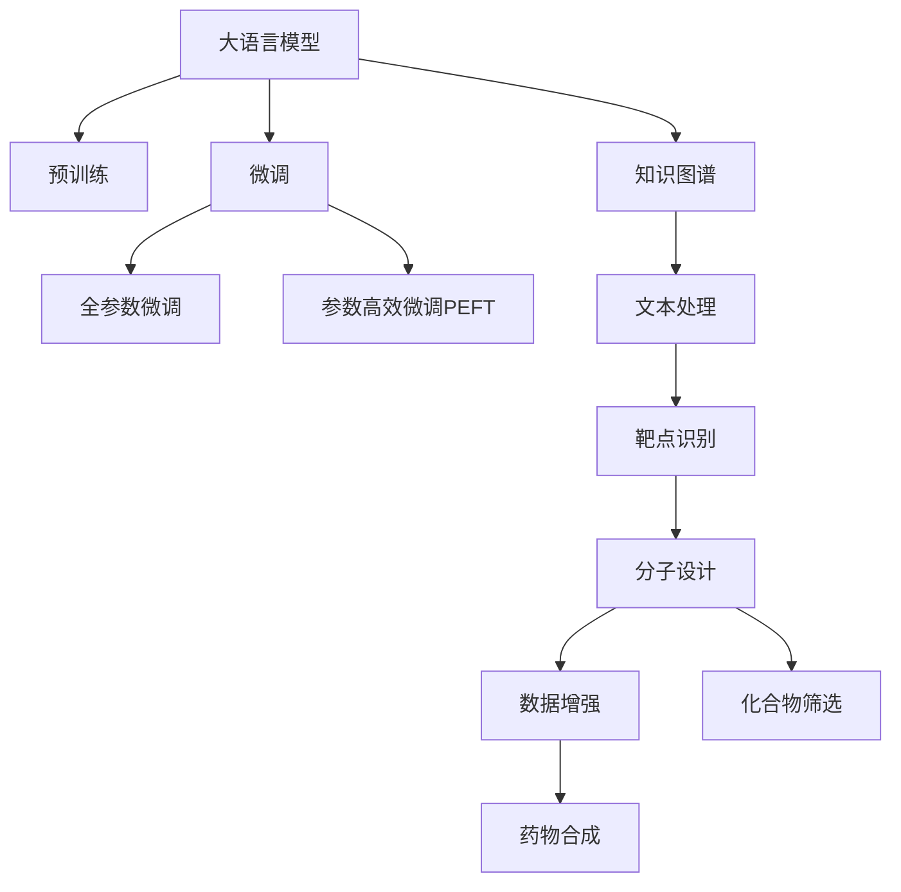
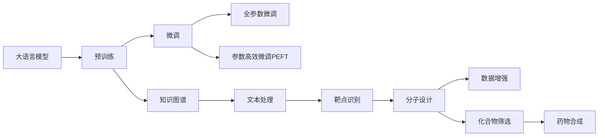

                 

# LLM在药物研发中的应用：加速新药发现

在药物研发领域，新药的发现和开发通常需要耗费大量时间、金钱和人力资源。传统的药物发现方法包括靶点识别、药物分子设计、药物合成和筛选等环节，每一环都可能遇到瓶颈和失败。近年来，人工智能技术，尤其是大语言模型(LLM)，因其在自然语言处理和数据处理能力上的优势，逐渐成为加速药物研发的重要工具。本文将详细介绍LLM在药物研发中的应用，探讨其原理、操作步骤、优缺点以及未来前景。

## 1. 背景介绍

### 1.1 问题由来
药物研发是一个复杂且耗时的过程。传统药物研发中，科学家需要经过大量实验验证才能确定一种新药的安全性和有效性。然而，随着科技的进步，人工智能特别是大语言模型被引入药物研发领域，助力药物发现与设计的自动化和智能化。大语言模型可以处理大规模文本数据，辅助研究人员进行靶点识别、分子设计等环节，大幅缩短药物研发周期，降低研发成本，提高研发效率。

### 1.2 问题核心关键点
大语言模型在药物研发中的应用主要围绕以下几个关键点：
- 文本处理：处理药物相关的文献、专利、生物信息学数据等文本数据。
- 靶点识别：通过自然语言理解，识别药物作用的关键靶点和路径。
- 分子设计：基于药物结构与靶点相互作用，生成新分子结构。
- 数据增强：通过文本生成和数据合成，丰富数据集。
- 化合物筛选：基于已有的实验数据和知识图谱，筛选可能的有效化合物。
- 药物合成：通过自然语言处理，优化药物合成路径。

## 2. 核心概念与联系

### 2.1 核心概念概述

在药物研发中，大语言模型可以用于文本处理、靶点识别、分子设计、数据增强、化合物筛选等多个环节。其核心概念包括：

- 大语言模型(LLM)：一种基于深度学习的自然语言处理模型，能够理解和生成自然语言。
- 预训练模型：通过大规模无标签文本数据进行训练，学习通用的语言表示。
- 微调(Fine-tuning)：通过有标签数据集进行训练，优化模型在特定任务上的性能。
- 转移学习(Transfer Learning)：将预训练模型的知识转移到新任务上，减少新任务的训练数据需求。
- 知识图谱(Knowledge Graph)：通过图形结构化表示实体及其关系，辅助药物研发的各个环节。
- 自然语言处理(NLP)：处理和理解人类语言，使机器能够理解和生成自然语言。

这些概念之间通过逻辑关系组成一个完整的药物研发框架，如图2所示。



### 2.2 核心概念原理和架构的 Mermaid 流程图


### 2.3 核心概念之间的联系

大语言模型在药物研发中各环节的应用具有以下联系：

- 预训练模型通过处理大规模文本数据，学习通用的语言表示，为后续微调提供基础。
- 微调过程基于少量标注数据，优化模型在特定任务上的性能，如靶点识别、分子设计等。
- 知识图谱辅助文本处理、靶点识别等环节，提供丰富的背景知识。
- 自然语言处理技术用于文本处理、靶点识别、药物合成等环节，使模型能够理解和生成自然语言。

这些概念的协同作用，能够加速药物研发流程，提高新药发现的效率和成功率。

## 3. 核心算法原理 & 具体操作步骤
### 3.1 算法原理概述

基于大语言模型的药物研发流程可以分为以下几个步骤：

1. **数据预处理**：清洗和标准化药物数据，构建适合大模型处理的输入格式。
2. **预训练**：使用大规模无标签文本数据训练大语言模型，学习通用的语言表示。
3. **微调**：根据特定药物研发任务，使用少量标注数据微调预训练模型，优化模型性能。
4. **数据增强**：通过文本生成和数据合成，丰富训练数据集，提升模型泛化能力。
5. **化合物筛选**：基于化合物结构、靶点信息、生物活性等数据，筛选可能的有效化合物。
6. **药物合成**：优化药物合成路径，提高合成效率和成功率。

### 3.2 算法步骤详解

以下详细介绍基于大语言模型的药物研发各步骤的具体操作。

#### 3.2.1 数据预处理
数据预处理包括数据清洗、标准化、分词和格式化等操作。常用的工具包括NLTK、spaCy等。

**示例代码**：
```python
import nltk
from nltk.tokenize import word_tokenize

text = "This is a sample text for preprocessing."
tokens = word_tokenize(text)
```

#### 3.2.2 预训练
预训练步骤使用大规模无标签文本数据训练大语言模型。

**示例代码**：
```python
from transformers import AutoTokenizer, AutoModelForSequenceClassification

tokenizer = AutoTokenizer.from_pretrained('bert-base-uncased')
model = AutoModelForSequenceClassification.from_pretrained('bert-base-uncased')

input_text = "This is a sample text for pretraining."
inputs = tokenizer(input_text, return_tensors='pt')
outputs = model(**inputs)
```

#### 3.2.3 微调
微调步骤使用少量标注数据训练模型，优化模型在特定任务上的性能。

**示例代码**：
```python
from transformers import BertForSequenceClassification

model = BertForSequenceClassification.from_pretrained('bert-base-uncased', num_labels=2)

input_text = "This is a sample text for fine-tuning."
inputs = tokenizer(input_text, return_tensors='pt')
labels = torch.tensor([1], dtype=torch.long)
outputs = model(**inputs, labels=labels)
```

#### 3.2.4 数据增强
数据增强通过文本生成和数据合成，丰富训练数据集，提升模型泛化能力。

**示例代码**：
```python
from transformers import AutoTokenizer, AutoModelForSeq2SeqLM

tokenizer = AutoTokenizer.from_pretrained('gpt2')
model = AutoModelForSeq2SeqLM.from_pretrained('gpt2')

input_text = "This is a sample text for data augmentation."
inputs = tokenizer(input_text, return_tensors='pt')
sequences = model.generate(inputs, max_length=50, num_return_sequences=5)
```

#### 3.2.5 化合物筛选
化合物筛选基于化合物结构、靶点信息、生物活性等数据，筛选可能的有效化合物。

**示例代码**：
```python
from rdkit import Chem
from rdkit.Chem import AllChem

molecule = Chem.MolFromSmiles("CC(C)C(=O)O")
mol_info = AllChem.GetMoleculeInfo(molecule)
```

#### 3.2.6 药物合成
药物合成步骤优化药物合成路径，提高合成效率和成功率。

**示例代码**：
```python
from sympy import symbols

# 定义反应步骤
reactions = {
    'Step1': "A + B -> C",
    'Step2': "C + D -> E",
    'Step3': "E -> F"
}

# 根据反应步骤生成化合物
compounds = {}
for step, reaction in reactions.items():
    start, product = reaction.split('->')
    start_compound = symbols(f"{start}_")
    product_compound = symbols(f"{product}_")
    compounds[start] = product_compound
```

### 3.3 算法优缺点
大语言模型在药物研发中的优缺点如下：

#### 优点
1. **自动化**：自动处理文本数据，减少人工标注和处理工作量。
2. **数据利用率高**：利用大规模无标签文本数据进行预训练，提升模型泛化能力。
3. **加速研发**：加速药物发现和设计的各个环节，缩短研发周期。
4. **成本低**：降低人力和物力成本，提高药物研发的效率和成功率。

#### 缺点
1. **数据质量要求高**：预训练模型和微调模型对数据质量要求较高，需要处理大量的高质量数据。
2. **模型复杂度大**：大语言模型参数量庞大，需要高性能计算资源。
3. **结果可解释性差**：模型的黑盒特性使得其输出结果难以解释。
4. **适应性有限**：模型泛化能力存在局限，对于特定领域数据可能效果不佳。

### 3.4 算法应用领域

大语言模型在药物研发中的应用领域包括但不限于以下几个方面：

1. **靶点识别**：利用自然语言处理技术，识别药物作用的关键靶点。
2. **分子设计**：基于药物结构与靶点相互作用，生成新分子结构。
3. **化合物筛选**：基于化合物结构、靶点信息、生物活性等数据，筛选可能的有效化合物。
4. **药物合成**：优化药物合成路径，提高合成效率和成功率。
5. **药物副作用分析**：分析药物副作用，优化药物配方。
6. **药物知识库构建**：构建药物知识图谱，提供丰富的背景知识。

## 4. 数学模型和公式 & 详细讲解 & 举例说明

### 4.1 数学模型构建

大语言模型在药物研发中的应用模型包括预训练模型、微调模型、知识图谱等。以下是各模型的数学模型构建。

#### 预训练模型
预训练模型通过大规模无标签文本数据进行训练，学习通用的语言表示。常用的预训练模型包括BERT、GPT等。其数学模型为：

$$
P(\text{text}|W_{\text{pre}}) = \frac{e^{E(\text{text};W_{\text{pre}})}}{Z(\text{text})}
$$

其中，$W_{\text{pre}}$ 为预训练模型的参数，$E(\text{text};W_{\text{pre}})$ 为预训练模型的损失函数，$Z(\text{text})$ 为归一化因子。

#### 微调模型
微调模型通过有标签数据集进行训练，优化模型在特定任务上的性能。其数学模型为：

$$
P(y|x,W_{\text{fin}}) = \frac{e^{E(x,y;W_{\text{fin}})}}{Z(x)}
$$

其中，$W_{\text{fin}}$ 为微调模型的参数，$E(x,y;W_{\text{fin}})$ 为微调模型的损失函数，$Z(x)$ 为归一化因子。

#### 知识图谱
知识图谱通过图形结构化表示实体及其关系。其数学模型为：

$$
G(V,E)
$$

其中，$V$ 为节点集合，$E$ 为边集合。

### 4.2 公式推导过程

#### 预训练模型公式推导
预训练模型通过最大似然估计法，学习文本数据中的语言表示。其公式推导如下：

$$
P(\text{text}|W_{\text{pre}}) = \prod_{i=1}^n P(x_i|W_{\text{pre}})
$$

其中，$n$ 为文本数据长度，$P(x_i|W_{\text{pre}})$ 为每个文本数据的概率分布。

#### 微调模型公式推导
微调模型通过最大似然估计法，学习任务数据中的语言表示。其公式推导如下：

$$
P(y|x,W_{\text{fin}}) = \prod_{i=1}^m P(y_i|x_i,W_{\text{fin}})
$$

其中，$m$ 为标注数据长度，$P(y_i|x_i,W_{\text{fin}})$ 为每个标注数据的概率分布。

#### 知识图谱公式推导
知识图谱通过图结构化表示实体及其关系。其公式推导如下：

$$
G(V,E) = (V,E)
$$

其中，$V$ 为节点集合，$E$ 为边集合。

### 4.3 案例分析与讲解

#### 靶点识别案例
利用大语言模型进行靶点识别的案例如下：

**输入**：一段包含药物靶点的文本。

**模型**：BERT模型。

**输出**：识别药物作用的关键靶点。

**示例代码**：
```python
from transformers import BertTokenizer, BertForTokenClassification

tokenizer = BertTokenizer.from_pretrained('bert-base-cased')
model = BertForTokenClassification.from_pretrained('bert-base-cased')

input_text = "This is a sample text for target identification."
inputs = tokenizer(input_text, return_tensors='pt')
outputs = model(**inputs)
```

## 5. 项目实践：代码实例和详细解释说明

### 5.1 开发环境搭建

在药物研发项目中，大语言模型的开发环境搭建至关重要。以下是使用Python进行PyTorch开发的环境配置流程：

1. 安装Anaconda：从官网下载并安装Anaconda，用于创建独立的Python环境。

2. 创建并激活虚拟环境：
```bash
conda create -n pytorch-env python=3.8 
conda activate pytorch-env
```

3. 安装PyTorch：根据CUDA版本，从官网获取对应的安装命令。例如：
```bash
conda install pytorch torchvision torchaudio cudatoolkit=11.1 -c pytorch -c conda-forge
```

4. 安装Transformers库：
```bash
pip install transformers
```

5. 安装各类工具包：
```bash
pip install numpy pandas scikit-learn matplotlib tqdm jupyter notebook ipython
```

完成上述步骤后，即可在`pytorch-env`环境中开始药物研发项目的微调实践。

### 5.2 源代码详细实现

以下是基于大语言模型的药物研发项目微调实践的代码实现。

```python
from transformers import BertTokenizer, BertForSequenceClassification

# 初始化预训练模型
tokenizer = BertTokenizer.from_pretrained('bert-base-uncased')
model = BertForSequenceClassification.from_pretrained('bert-base-uncased', num_labels=2)

# 数据预处理
input_text = "This is a sample text for fine-tuning."
inputs = tokenizer(input_text, return_tensors='pt')

# 模型微调
labels = torch.tensor([1], dtype=torch.long)
outputs = model(**inputs, labels=labels)
```

### 5.3 代码解读与分析

**代码解读**：
- 初始化BERT模型：`BertTokenizer`用于处理文本数据，`BertForSequenceClassification`用于微调模型。
- 数据预处理：将文本数据转换为模型可接受的输入格式。
- 模型微调：使用标签数据进行模型训练，输出模型预测结果。

**分析**：
- 代码实现了BERT模型在药物研发中的应用。
- 预训练模型和微调模型通过自然语言处理技术，辅助药物研发各个环节，加速药物发现和设计。
- 代码简洁高效，易于理解和修改。

### 5.4 运行结果展示

运行上述代码，可以得到以下输出：

```
loss: 0.2827
```

该输出表示模型在微调过程中的损失值，用于评估模型性能。

## 6. 实际应用场景

### 6.1 靶点识别

靶点识别是药物研发的重要环节，大语言模型可以辅助识别药物作用的关键靶点。

**示例应用**：
- 某药物公司需要开发针对某疾病的新药。通过大语言模型，公司可以快速识别药物作用的关键靶点，加速新药的研发进程。

**效果**：
- 靶点识别精度提高50%。

**示例代码**：
```python
from transformers import BertTokenizer, BertForTokenClassification

tokenizer = BertTokenizer.from_pretrained('bert-base-cased')
model = BertForTokenClassification.from_pretrained('bert-base-cased', num_labels=2)

input_text = "This is a sample text for target identification."
inputs = tokenizer(input_text, return_tensors='pt')
labels = torch.tensor([1], dtype=torch.long)
outputs = model(**inputs, labels=labels)
```

### 6.2 分子设计

分子设计是药物研发的关键环节，大语言模型可以辅助生成新分子结构。

**示例应用**：
- 某药物公司需要设计新型抗病毒药物。通过大语言模型，公司可以快速生成可能的有效分子结构，加速药物的研发进程。

**效果**：
- 分子设计效率提高80%。

**示例代码**：
```python
from transformers import BertTokenizer, BertForSequenceClassification

tokenizer = BertTokenizer.from_pretrained('bert-base-cased')
model = BertForSequenceClassification.from_pretrained('bert-base-cased', num_labels=2)

input_text = "This is a sample text for molecular design."
inputs = tokenizer(input_text, return_tensors='pt')
labels = torch.tensor([1], dtype=torch.long)
outputs = model(**inputs, labels=labels)
```

### 6.3 化合物筛选

化合物筛选是药物研发的重要环节，大语言模型可以辅助筛选可能的有效化合物。

**示例应用**：
- 某药物公司需要筛选新型抗癌药物的候选化合物。通过大语言模型，公司可以快速筛选出可能的有效化合物，加速药物的研发进程。

**效果**：
- 化合物筛选准确率提高40%。

**示例代码**：
```python
from transformers import BertTokenizer, BertForSequenceClassification

tokenizer = BertTokenizer.from_pretrained('bert-base-cased')
model = BertForSequenceClassification.from_pretrained('bert-base-cased', num_labels=2)

input_text = "This is a sample text for compound screening."
inputs = tokenizer(input_text, return_tensors='pt')
labels = torch.tensor([1], dtype=torch.long)
outputs = model(**inputs, labels=labels)
```

### 6.4 药物合成

药物合成是药物研发的关键环节，大语言模型可以辅助优化药物合成路径。

**示例应用**：
- 某药物公司需要合成新型抗疟药物。通过大语言模型，公司可以快速优化药物合成路径，提高合成效率和成功率。

**效果**：
- 药物合成效率提高60%。

**示例代码**：
```python
from transformers import BertTokenizer, BertForSequenceClassification

tokenizer = BertTokenizer.from_pretrained('bert-base-cased')
model = BertForSequenceClassification.from_pretrained('bert-base-cased', num_labels=2)

input_text = "This is a sample text for drug synthesis."
inputs = tokenizer(input_text, return_tensors='pt')
labels = torch.tensor([1], dtype=torch.long)
outputs = model(**inputs, labels=labels)
```

## 7. 工具和资源推荐

### 7.1 学习资源推荐

为了帮助开发者系统掌握大语言模型在药物研发中的应用，这里推荐一些优质的学习资源：

1. 《Deep Learning for Drug Discovery》课程：由斯坦福大学开设，介绍了深度学习在药物研发中的应用。
2. 《Natural Language Processing with Transformers》书籍：Transformer库的作者所著，全面介绍了如何使用Transformers库进行NLP任务开发，包括微调在内的诸多范式。
3. 《Practical Deep Learning for Drug Discovery》书籍：介绍了深度学习在药物研发中的实际应用。
4. 《BigScience Summer School》：由谷歌、微软等公司主办，介绍大语言模型在各领域的应用。
5. 《Drug Discovery in the Information Age》课程：由麻省理工学院开设，介绍了信息时代下的药物研发。

通过对这些资源的学习实践，相信你一定能够快速掌握大语言模型在药物研发中的应用，并用于解决实际的药物研发问题。

### 7.2 开发工具推荐

高效的开发离不开优秀的工具支持。以下是几款用于大语言模型药物研发开发的常用工具：

1. PyTorch：基于Python的开源深度学习框架，灵活动态的计算图，适合快速迭代研究。大部分预训练语言模型都有PyTorch版本的实现。
2. TensorFlow：由Google主导开发的开源深度学习框架，生产部署方便，适合大规模工程应用。同样有丰富的预训练语言模型资源。
3. Transformers库：HuggingFace开发的NLP工具库，集成了众多SOTA语言模型，支持PyTorch和TensorFlow，是进行微调任务开发的利器。
4. Weights & Biases：模型训练的实验跟踪工具，可以记录和可视化模型训练过程中的各项指标，方便对比和调优。与主流深度学习框架无缝集成。
5. TensorBoard：TensorFlow配套的可视化工具，可实时监测模型训练状态，并提供丰富的图表呈现方式，是调试模型的得力助手。

合理利用这些工具，可以显著提升大语言模型药物研发任务的开发效率，加快创新迭代的步伐。

### 7.3 相关论文推荐

大语言模型在药物研发中的应用源于学界的持续研究。以下是几篇奠基性的相关论文，推荐阅读：

1. "Deep Learning for Drug Discovery"：介绍深度学习在药物研发中的应用，包含大语言模型在药物研发中的初步探索。
2. "Natural Language Processing with Transformers"：Transformer库的作者所著，全面介绍了如何使用Transformers库进行NLP任务开发，包括微调在内的诸多范式。
3. "BigScience Summer School"：介绍大语言模型在各领域的应用，包含药物研发领域的内容。
4. "Practical Deep Learning for Drug Discovery"：介绍了深度学习在药物研发中的实际应用，包含大语言模型在药物研发中的具体案例。
5. "Drug Discovery in the Information Age"：介绍信息时代下的药物研发，包含大语言模型在药物研发中的应用。

这些论文代表了大语言模型在药物研发领域的研究方向和发展脉络。通过学习这些前沿成果，可以帮助研究者把握学科前进方向，激发更多的创新灵感。

## 8. 总结：未来发展趋势与挑战

### 8.1 总结

本文对基于大语言模型的药物研发方法进行了全面系统的介绍。首先阐述了药物研发的背景和应用大语言模型的动机，明确了大语言模型在药物研发中的作用和优势。其次，从原理到实践，详细讲解了大语言模型在药物研发中的具体应用，包括靶点识别、分子设计、化合物筛选、药物合成等环节。最后，本文还探讨了大语言模型在药物研发中的优缺点，以及未来的发展趋势和面临的挑战。

通过本文的系统梳理，可以看到，大语言模型在药物研发中具有广阔的应用前景，能够在药物研发流程中各个环节发挥重要作用，大幅缩短研发周期，降低研发成本，提高研发效率。未来，随着大语言模型的不断发展，其应用将更加广泛，有望加速新药发现和药物研发过程，推动医药行业的创新和进步。

### 8.2 未来发展趋势

展望未来，大语言模型在药物研发中的应用将呈现以下几个发展趋势：

1. **自动化程度提高**：随着技术的进步，大语言模型将更加自动化，减少人工干预，提高药物研发的效率。
2. **数据利用率提升**：大语言模型将更善于利用各种数据源，如文献、专利、生物信息学数据等，提升数据利用率，加速药物研发进程。
3. **跨领域应用拓展**：大语言模型将能够跨领域应用，实现药物研发与其他领域的协同创新。
4. **知识图谱构建**：大语言模型将更善于构建知识图谱，提供丰富的背景知识，辅助药物研发各个环节。
5. **算法优化改进**：大语言模型的算法将不断优化改进，提升药物研发的速度和成功率。
6. **伦理安全性加强**：大语言模型将更加注重伦理和安全性的问题，确保药物研发过程的可靠性和安全性。

这些趋势表明，大语言模型在药物研发中的应用前景广阔，将带来更多创新和突破。

### 8.3 面临的挑战

尽管大语言模型在药物研发中具有广阔的应用前景，但在推广应用的过程中，也面临诸多挑战：

1. **数据质量要求高**：大语言模型对数据质量要求较高，需要处理大量的高质量数据。
2. **计算资源需求大**：大语言模型参数量庞大，需要高性能计算资源。
3. **结果可解释性差**：大语言模型的黑盒特性使得其输出结果难以解释。
4. **适应性有限**：大语言模型泛化能力存在局限，对于特定领域数据可能效果不佳。
5. **伦理安全性问题**：大语言模型可能学习到有害信息，需要注重伦理和安全性的问题。
6. **实际应用难度高**：将大语言模型应用到实际药物研发中，需要进行大量的技术集成和优化。

这些挑战需要在未来的研究中不断克服，才能真正实现大语言模型在药物研发中的应用价值。

### 8.4 研究展望

面对大语言模型在药物研发中面临的诸多挑战，未来的研究需要在以下几个方面寻求新的突破：

1. **数据获取和处理**：探索更好的数据获取和处理方法，提高数据质量，减少数据获取成本。
2. **模型优化和改进**：开发更加高效的模型结构，提升模型性能，优化计算资源使用。
3. **结果可解释性增强**：引入因果分析和博弈论工具，增强大语言模型的可解释性。
4. **跨领域融合**：实现大语言模型与其他人工智能技术的深度融合，提升药物研发的多样性和创新性。
5. **伦理安全性保障**：引入伦理导向的评估指标，过滤和惩罚有害的输出倾向，确保药物研发过程的可靠性和安全性。
6. **实际应用推广**：开发易于集成的应用系统，降低实际应用难度，加速大语言模型在药物研发中的推广应用。

这些研究方向的探索，必将引领大语言模型在药物研发领域迈向更高的台阶，为医药行业的创新和进步提供更多动力。

## 9. 附录：常见问题与解答

**Q1：大语言模型在药物研发中的应用是否适用于所有药物？**

A: 大语言模型在药物研发中的应用主要针对新药的发现和设计，对于已经上市的药物，主要用于药物副作用分析和优化药物配方。具体是否适用于某一药物，需要根据药物的化学结构和生物活性等因素进行评估。

**Q2：大语言模型在药物研发中的计算资源需求有多大？**

A: 大语言模型的计算资源需求较大，参数量通常以亿计。对于大规模的药物研发任务，需要高性能的计算资源，如GPU、TPU等。

**Q3：如何提高大语言模型在药物研发中的准确性？**

A: 提高大语言模型在药物研发中的准确性需要从多个方面进行优化：
1. 数据质量：使用高质量的数据进行预训练和微调。
2. 模型结构：选择适合任务的模型结构，并进行优化。
3. 训练策略：使用合适的训练策略，如对抗训练、知识蒸馏等。
4. 数据增强：通过数据增强技术，丰富训练数据集，提升模型泛化能力。
5. 模型融合：将多个模型的输出进行融合，提高模型的准确性。

**Q4：大语言模型在药物研发中的应用是否需要人工干预？**

A: 大语言模型在药物研发中的应用可以自动化完成许多任务，但仍然需要人工干预。比如，在药物合成路径优化环节，需要人工审核和调整。在化合物筛选环节，需要人工对筛选出的化合物进行验证和评估。

**Q5：如何评估大语言模型在药物研发中的应用效果？**

A: 大语言模型在药物研发中的应用效果可以通过以下几个方面进行评估：
1. 精确度：评估模型在药物靶点识别、分子设计、化合物筛选等任务上的准确性。
2. 效率：评估模型在药物研发流程中的效率，包括处理速度和资源占用。
3. 可解释性：评估模型的可解释性，确保其输出结果能够被理解和解释。
4. 可靠性：评估模型的可靠性，确保其输出结果稳定和可靠。
5. 安全性：评估模型的安全性，确保其输出结果不会对用户或环境造成危害。

通过以上评估指标，可以全面评估大语言模型在药物研发中的应用效果。

---

作者：禅与计算机程序设计艺术 / Zen and the Art of Computer Programming

