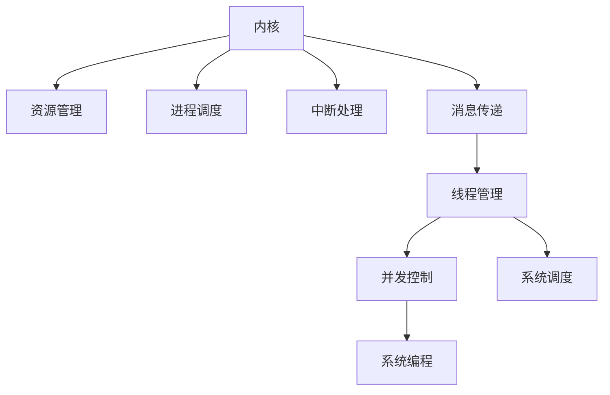

                 

# LLM操作系统的核心组件：内核、消息和线程

> 关键词：LLM操作系统，内核，消息传递，线程管理，计算机体系结构，并发控制，系统调度，系统编程

## 1. 背景介绍

### 1.1 问题由来
随着大型语言模型(LLM)的兴起，它们在自然语言处理、机器学习、人工智能等领域中的应用日益广泛。然而，在实践中，大模型的应用常常面临着高效、可靠和可扩展性的挑战。这需要一种系统化的解决方案，能够在高效利用硬件资源的同时，确保系统的稳定性和可靠性。

### 1.2 问题核心关键点
为了应对这些挑战，LLM操作系统应运而生。它结合了操作系统原理、并行计算和系统编程的知识，旨在提供一种机制，使得LLM能够在高效、可靠地运行，同时便于开发和部署。

### 1.3 问题研究意义
研究LLM操作系统对于提升大模型的应用效率、稳定性与可扩展性具有重要意义：
- 提高模型的处理速度：通过高效的调度算法和并行计算，可以显著提升大模型的推理速度。
- 增强系统的稳定性：通过合理的资源管理与调度，可以避免资源竞争和死锁问题，提高系统的稳定性。
- 促进模型开发：通过提供标准化的API和工具库，可以降低模型开发与部署的难度。
- 支持大规模计算：通过分布式计算和弹性扩展机制，可以支持大规模计算任务，应对海量数据处理的需求。

## 2. 核心概念与联系

### 2.1 核心概念概述

为了更好地理解LLM操作系统的核心组件，本节将介绍几个关键概念：

- **内核(Kernel)**：LLM操作系统的核心部分，负责资源管理、进程调度、中断处理等核心功能。
- **消息传递(Message Passing)**：一种通信机制，允许不同进程之间通过消息交换数据。
- **线程管理(Threads Management)**：线程是轻量级进程，可以共享内存空间和系统资源，提高系统的并发性能。
- **并发控制(Concurrency Control)**：控制多个进程或线程同时访问共享资源时产生的冲突。
- **系统调度(System Scheduling)**：根据算法合理分配系统资源，提高系统的整体效率。
- **系统编程(System Programming)**：编写系统相关的程序，与内核直接交互。

这些概念之间的关系可以用以下Mermaid流程图来表示：



## 3. 核心算法原理 & 具体操作步骤
### 3.1 算法原理概述

LLM操作系统的核心算法主要围绕资源管理、进程/线程调度和消息传递展开。其中，资源管理是整个系统的基础，进程/线程调度和消息传递则是提高系统并发性和效率的关键。

### 3.2 算法步骤详解

**Step 1: 内核设计与实现**
- 设计一个高效的内核，负责系统资源管理，如内存管理、文件系统、网络堆栈等。
- 实现进程/线程调度算法，如Cormen's algorithm、Round Robin等，根据任务的紧急程度和优先级进行调度。
- 设计中断处理机制，确保系统可以及时响应外部事件。

**Step 2: 消息传递系统实现**
- 设计高效的消息传递系统，支持异步通信和同步原语，如send、recv、barrier等。
- 实现消息队列、管道等通信机制，提高系统并发性能。

**Step 3: 线程管理与调度**
- 设计线程库，提供创建、同步、终止等线程操作。
- 实现线程池和任务队列，提高线程复用率和系统吞吐量。
- 实现锁机制、信号量、条件变量等同步原语，确保线程安全。

**Step 4: 系统调度与资源管理**
- 设计调度算法，如基于时间的调度、基于优先级的调度等，根据任务的性质合理分配资源。
- 实现内存管理算法，如分段、分页等，优化内存使用效率。
- 实现文件系统，提供文件读写、目录管理等功能。

**Step 5: 系统编程与优化**
- 提供标准化的API和工具库，支持开发者快速开发系统程序。
- 实现性能分析工具，如系统调用追踪、性能计数器等，优化系统性能。
- 实现分布式计算机制，支持多台机器协同工作，提高计算能力。

### 3.3 算法优缺点

LLM操作系统在提高大模型的并发性和效率方面具有显著优势：
1. **高效资源管理**：通过合理的资源分配和调度，可以显著提高系统性能。
2. **并发性能提升**：通过线程管理和消息传递，可以高效利用硬件资源，提高系统的并行能力。
3. **系统稳定性增强**：通过并发控制和资源管理，可以有效避免死锁和资源竞争，提高系统的可靠性。

然而，该系统也存在一些局限性：
1. **复杂性高**：设计与实现复杂，需要深厚的计算机体系结构与操作系统知识。
2. **性能瓶颈**：内核和调度算法的设计对性能有显著影响，需要不断优化。
3. **兼容性问题**：不同操作系统间的兼容性问题，可能会影响系统的应用范围。

尽管如此，LLM操作系统在提升大模型的性能和稳定性方面仍然具有不可替代的优势，值得深入研究和探索。

### 3.4 算法应用领域

LLM操作系统的核心组件在以下几个领域有着广泛的应用：

- **高性能计算**：通过高效的资源管理和调度算法，可以显著提升高性能计算系统的性能。
- **分布式系统**：通过分布式计算和消息传递机制，支持大规模计算任务。
- **实时系统**：通过合理的调度和管理，可以保证实时系统的高效和可靠性。
- **网络系统**：通过高效的通信机制，支持网络应用中的并发请求处理。
- **嵌入式系统**：通过优化内核和资源管理，支持嵌入式设备的轻量级操作。

## 4. 数学模型和公式 & 详细讲解 & 举例说明

### 4.1 数学模型构建

LLM操作系统的数学模型主要围绕资源分配、进程/线程调度、消息传递等方面展开。以下是一个典型的系统调度和资源管理模型：

**资源分配模型**：
假设系统有 $N$ 个任务，每个任务需要 $R_i$ 个资源，则资源分配模型为：

$$
\min_{x} \sum_{i=1}^N c_i x_i \\
s.t. \quad \sum_{i=1}^N x_i = R \\
0 \leq x_i \leq R_i \quad \forall i \in [1, N]
$$

其中 $c_i$ 表示任务 $i$ 的权重，$x_i$ 表示分配给任务 $i$ 的资源数，$R$ 表示系统总资源数。

**进程调度模型**：
假设系统有 $N$ 个进程，每个进程的执行时间为 $T_i$，则基于时间的调度模型为：

$$
\min_{\sigma} \sum_{i=1}^N (T_i / \sigma_i)
$$

其中 $\sigma_i$ 表示进程 $i$ 的执行时间。

### 4.2 公式推导过程

在上述模型的基础上，我们可以推导出一些基本的优化算法。以资源分配模型为例，可以采用贪心算法或基于图论的匹配算法进行求解。例如，基于最小生成树算法，可以将资源分配问题转化为最小生成树问题，使用Prim算法或Kruskal算法求解。

### 4.3 案例分析与讲解

以Linux内核为例，它的资源管理包括内存管理、进程调度、中断处理等。内存管理通过分页和分段技术，将物理内存和虚拟内存进行管理。进程调度采用基于时间的轮转调度算法，确保系统公平性。中断处理则通过向量中断机制，快速响应外部事件。

## 5. 项目实践：代码实例和详细解释说明

### 5.1 开发环境搭建

为了进行LLM操作系统的开发，我们需要搭建一个开发环境，包括编译器、调试工具和操作系统内核等。以下是一个典型的开发环境配置流程：

1. **编译器**：选择合适的编译器，如GCC或Clang，进行系统编译。
2. **调试工具**：安装调试器，如GDB或LLDB，进行代码调试。
3. **操作系统内核**：选择合适的操作系统内核，如Linux或FreeBSD，进行内核编译和调试。
4. **测试框架**：安装测试框架，如JUnit或Google Test，进行系统测试。

### 5.2 源代码详细实现

以Linux内核为例，其资源管理代码主要在以下几部分：

**内存管理**：

```c
#include <linux/mm.h>
#include <linux/slab.h>

static struct kmem_cache *mem_cache;
static void *mem_alloc(int size)
{
    return kmalloc(size, GFP_KERNEL);
}

static void mem_free(void *ptr)
{
    kfree(ptr);
}
```

**进程调度**：

```c
#include <linux/sched.h>

static void schedule_task(struct task_struct *task)
{
    if (task->state != TASK_INTERRUPTIBLE)
        return;
    task->state = TASK_INTERRUPTIBLE;
    reschedule();
}

void start_task(struct task_struct *task)
{
    task->state = TASK_RUNNING;
    schedule_task(task);
}
```

**中断处理**：

```c
#include <linux/interrupt.h>

void handle_interrupt(int irq, void *dev)
{
    // 处理中断
    struct irq_desc *desc = irq_desc(irq);
    struct irqaction *action = irqaction(dev);
    if (action->handler == NULL)
        return;
    action->handler(desc, irq, action->flags);
}

void request_interrupt(int irq, void *dev)
{
    // 请求中断
    struct irq_desc *desc = irq_desc(irq);
    struct irqaction *action = irqaction(dev);
    if (action == NULL)
        return;
    action->handler(desc, irq, action->flags);
}
```

### 5.3 代码解读与分析

在上述代码中，内存管理、进程调度和中断处理是LLM操作系统中最基本的组件。内存管理主要通过kmalloc和kfree函数进行内存分配和释放。进程调度主要通过schedule_task和start_task函数进行任务切换和启动。中断处理则通过handle_interrupt和request_interrupt函数进行中断请求和处理。

## 6. 实际应用场景

### 6.1 高性能计算

LLM操作系统的内核和调度算法，可以显著提升高性能计算系统的性能。例如，分布式计算框架如Hadoop和Spark，通过多台计算机协同工作，可以高效处理海量数据。

### 6.2 分布式系统

通过分布式计算和消息传递机制，LLM操作系统支持大规模计算任务。例如，MapReduce算法通过任务分解和并行处理，可以高效处理大规模数据集。

### 6.3 实时系统

LLM操作系统通过合理的调度和管理，可以保证实时系统的高效和可靠性。例如，实时操作系统如RT-Linux，通过预分配资源和优先级调度，支持对时间敏感的任务处理。

### 6.4 网络系统

通过高效的通信机制，LLM操作系统支持网络应用中的并发请求处理。例如，Web服务器通过多线程和消息队列，可以高效处理大量并发请求。

### 6.5 嵌入式系统

通过优化内核和资源管理，LLM操作系统支持嵌入式设备的轻量级操作。例如，嵌入式操作系统如FreeRTOS，通过简化内核和优化资源管理，支持嵌入式设备的低延迟和高效率。

## 7. 工具和资源推荐

### 7.1 学习资源推荐

为了帮助开发者掌握LLM操作系统的原理与实践，这里推荐一些优秀的学习资源：

1. **操作系统原理课程**：例如，《操作系统：设计与实现》，介绍了操作系统的基本原理和实现方法。
2. **系统编程书籍**：例如，《UNIX网络编程》，介绍了网络编程和系统编程的基本方法。
3. **内核源码分析**：例如，《Linux内核源码分析》，介绍了Linux内核的源码结构和实现方法。
4. **分布式计算框架**：例如，《Hadoop：原理与实践》，介绍了分布式计算框架的基本原理和应用方法。
5. **高性能计算书籍**：例如，《并行编程》，介绍了并行计算的基本方法和实现技术。

### 7.2 开发工具推荐

LLM操作系统的开发需要依赖多种工具，以下是几款常用的开发工具：

1. **编译器**：GCC、Clang等，用于编译和优化系统代码。
2. **调试工具**：GDB、LLDB等，用于调试和分析系统问题。
3. **版本控制系统**：Git、SVN等，用于管理和协作开发系统代码。
4. **测试框架**：JUnit、Google Test等，用于测试和验证系统功能。
5. **性能分析工具**：Valgrind、Perf等，用于分析和优化系统性能。

### 7.3 相关论文推荐

为了深入了解LLM操作系统的研究进展，这里推荐几篇重要的相关论文：

1. **Cormen's algorithm**：介绍了一种基于时间的调度算法，适用于多任务系统。
2. **Round Robin调度算法**：介绍了一种公平的轮转调度算法，适用于多进程系统。
3. **Prim算法**：介绍了一种基于图论的最小生成树算法，适用于资源分配问题。
4. **Kruskal算法**：介绍了一种基于图论的最小生成树算法，适用于资源分配问题。
5. **Linux内核源码分析**：介绍了Linux内核的源码结构和实现方法，是理解LLM操作系统的经典资源。

## 8. 总结：未来发展趋势与挑战

### 8.1 总结

本文对LLM操作系统的核心组件进行了全面系统的介绍。首先阐述了LLM操作系统的背景和意义，明确了内核、消息传递、线程管理等核心组件的原理和架构。其次，从原理到实践，详细讲解了LLM操作系统的数学模型和具体操作步骤，给出了系统开发的代码实例和详细解释。同时，本文还探讨了LLM操作系统在多个行业领域的应用场景，展示了其巨大的潜力和应用价值。

### 8.2 未来发展趋势

展望未来，LLM操作系统的研究将呈现以下几个趋势：

1. **系统架构演进**：随着硬件和软件技术的进步，LLM操作系统的架构将不断优化和演进，提高系统的效率和稳定性。
2. **多核与多机协同**：未来的系统将更注重多核和多机的协同工作，通过并行计算和分布式计算，提高系统的处理能力。
3. **内存管理优化**：内存管理是系统的核心问题，未来的系统将进一步优化内存管理算法，减少内存碎片和浪费。
4. **并发控制创新**：并发控制是系统的关键技术，未来的系统将探索新的并发控制方法，提高系统的并发性和稳定性。
5. **资源分配优化**：资源分配是系统的基础问题，未来的系统将进一步优化资源分配算法，提高系统的效率和公平性。

### 8.3 面临的挑战

尽管LLM操作系统已经取得了显著进展，但在迈向更加智能化、普适化应用的过程中，它仍面临诸多挑战：

1. **资源分配瓶颈**：在高性能计算和分布式系统中，资源分配和调度是关键问题，需要进一步优化。
2. **并发控制复杂性**：并发控制机制需要高效、可靠，避免死锁和资源竞争。
3. **系统稳定性问题**：系统的稳定性和可靠性是关键，需要进一步研究和优化。
4. **性能优化挑战**：系统性能的优化需要综合考虑硬件、软件和算法等多方面因素。
5. **跨平台兼容性**：不同平台间的兼容性问题，可能会影响系统的应用范围。

### 8.4 研究展望

未来的研究需要在以下几个方向寻求新的突破：

1. **高效资源管理**：研究新的资源分配和调度算法，提高系统的效率和公平性。
2. **并发控制机制创新**：探索新的并发控制方法，提高系统的并发性和稳定性。
3. **系统优化技术**：研究新的系统优化技术，提高系统的性能和可靠性。
4. **跨平台兼容性**：研究跨平台兼容性技术，提高系统的应用范围和灵活性。
5. **分布式计算优化**：研究新的分布式计算技术，提高系统的处理能力和可扩展性。

通过这些研究方向的探索，相信LLM操作系统将不断提升大模型的应用性能和稳定性，为人工智能技术的发展提供坚实的基础。

## 9. 附录：常见问题与解答

**Q1: 如何设计高效的内存管理算法？**

A: 高效的内存管理算法需要综合考虑内存分配、回收和碎片问题。常见的方法包括页式管理、分段管理、虚拟内存管理等。例如，Linux内核采用分页技术，将物理内存和虚拟内存进行管理，通过交换空间和缓存技术，优化内存使用效率。

**Q2: 如何设计合理的进程调度算法？**

A: 进程调度算法需要综合考虑任务优先级和执行时间。常见的调度算法包括基于时间的调度、基于优先级的调度等。例如，Linux内核采用基于时间的轮转调度算法，确保系统公平性。

**Q3: 如何实现高效的消息传递机制？**

A: 高效的消息传递机制需要综合考虑消息的异步和同步特性。常见的方法包括消息队列、管道等。例如，Linux内核采用消息队列机制，支持异步和同步通信。

**Q4: 如何优化系统的并发控制机制？**

A: 并发控制机制需要综合考虑锁、信号量、条件变量等同步原语。常见的方法包括互斥锁、读写锁、信号量等。例如，Linux内核采用互斥锁机制，确保线程安全。

**Q5: 如何实现系统性能优化？**

A: 系统性能优化需要综合考虑硬件、软件和算法等多方面因素。常见的方法包括性能分析工具、优化算法等。例如，Linux内核采用Perf工具，进行系统性能分析，优化资源使用效率。

通过回答这些问题，可以帮助开发者更好地理解LLM操作系统的核心组件和实现方法，为系统开发和优化提供指导。

