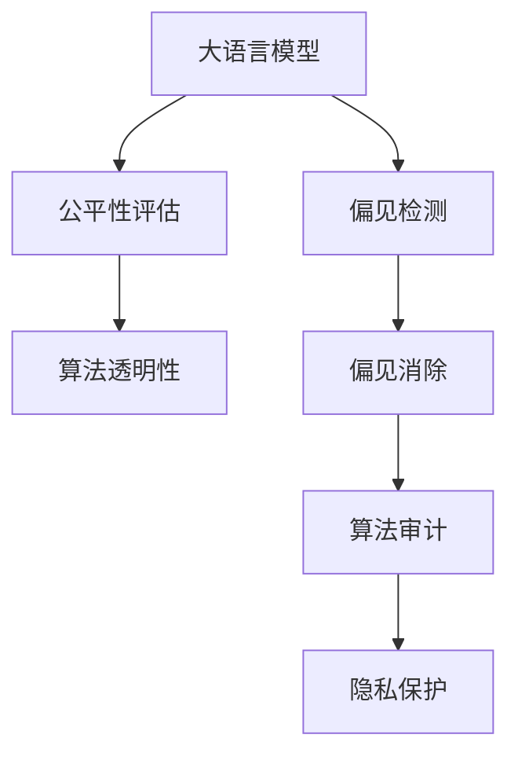

                 

# LLM的偏见消除：构建公平的AI世界

> 关键词：大语言模型, 偏见消除, 公平性, 算法透明, 伦理审查, 隐私保护, 算法审计

## 1. 背景介绍

在当前人工智能(AI)技术蓬勃发展的背景下，语言模型以其强大的语义理解能力和自然语言处理能力，正逐渐成为AI领域的研究热点。然而，伴随着大语言模型(LLMs)的兴起，其内在固有的偏见问题也引起了广泛关注。近年来，随着一系列公正性、隐私保护和伦理问题的不断曝光，如何消除语言模型的偏见，确保其在应用中的公平性和透明性，已成为AI社区亟需解决的重要课题。

本文旨在深入探讨LLM的偏见消除问题，并提出一系列实践建议和技术策略，以期构建一个更加公平、透明和安全的AI世界。

## 2. 核心概念与联系

### 2.1 核心概念概述

为更好地理解LLM的偏见消除问题，本节将介绍几个关键概念：

- **大语言模型(LLMs)**：以Transformer结构为代表的大规模预训练语言模型，如BERT、GPT等。通过在大规模无标签文本数据上进行自监督学习，学习到了广泛的语言表示，具备强大的语言理解能力和生成能力。

- **偏见(Bias)**：指模型在训练和应用过程中，对某些群体或特征表现出不平等对待的现象。这种偏见可能来源于训练数据、模型设计、输出结果等多个环节，导致模型对某些群体或特征的预测或决策存在系统性偏差。

- **公平性(Fairness)**：指模型在处理不同群体或特征时，能够平等对待，不因特征而产生歧视或偏见。公平性是保证AI系统公正、透明、可信赖的重要指标。

- **算法透明性(Algorithmic Transparency)**：指模型在推理和决策过程中的可解释性，即用户能够理解模型的工作原理和输出依据。透明性有助于提高用户对模型的信任度和接受度。

- **隐私保护(Privacy Protection)**：指在数据处理和模型应用过程中，对用户隐私数据的保护，避免敏感信息泄露和滥用。隐私保护是构建公平AI系统的基础。

- **算法审计(Algorithmic Audit)**：指对AI模型进行系统性的审查和评估，以检测和纠正偏见、错误和缺陷。审计过程通常涉及技术、法律、伦理等多个层面的考量和验证。

- **偏见检测(Bias Detection)**：指在模型训练和应用过程中，识别和量化模型所包含的偏见程度，如性别偏见、种族偏见等。通过偏见检测，可以更好地理解偏见来源，采取有针对性的纠正措施。

这些概念之间的关系可以通过以下Mermaid流程图来展示：



这个流程图展示了大语言模型在训练和应用过程中，涉及到偏见检测、公平性评估、算法透明性、偏见消除、算法审计和隐私保护等多个关键环节，每一个环节都在确保模型的公平性和透明性中发挥着重要作用。

## 3. 核心算法原理 & 具体操作步骤
### 3.1 算法原理概述

消除LLM的偏见，涉及多个层面的工作，包括数据收集、模型设计和应用实践等。本文将重点讨论其中几个关键步骤：

- **数据收集**：构建无偏见的训练数据集，确保模型训练过程中，各类群体的数据分布均衡。
- **模型设计**：采用抗偏差的模型结构，如公平性约束、数据增强等，从模型层面减少偏见。
- **应用实践**：在模型输出结果上采取纠偏措施，如后处理、隐私保护等，确保模型决策的公平性和透明性。

### 3.2 算法步骤详解

#### 数据收集

消除LLM偏见的第一步是构建无偏见的训练数据集。这通常涉及以下步骤：

1. **数据采集**：从多个来源收集文本数据，确保数据多样性和覆盖面广。
2. **数据清洗**：移除或标记含有偏见、歧视、有害信息的文本，减少负面数据的影响。
3. **数据增强**：通过数据增强技术，如对抗生成、回译等，扩充数据集，提高数据多样性和均衡性。
4. **数据划分**：将数据集划分为训练集、验证集和测试集，确保模型在各个数据集上的公平性。

#### 模型设计

模型设计是消除LLM偏见的核心环节。通常可以采用以下策略：

1. **公平性约束**：在模型损失函数中引入公平性约束项，确保模型在处理不同特征时，输出结果的公平性。
2. **数据增强**：在模型训练过程中，通过对抗样本、噪声注入等技术，增强模型对不同群体的识别能力。
3. **正则化技术**：如L2正则化、Dropout等，限制模型复杂度，减少过拟合，避免模型过度偏向某些特征。
4. **公平性评估**：在模型训练过程中，定期评估模型在各类群体上的公平性，及时调整模型参数，减少偏见。

#### 应用实践

应用实践阶段是确保LLM公平性的重要环节。常见的纠偏措施包括：

1. **后处理**：在模型输出结果上，进行公平性调整，如加权、阈值调整等，确保输出结果的公平性。
2. **隐私保护**：对用户隐私数据进行匿名化、加密处理，确保数据使用过程中的隐私安全。
3. **算法审计**：对模型输出结果进行审计，检测和纠正偏见、错误和缺陷，确保模型决策的透明性和可解释性。
4. **用户反馈**：建立用户反馈机制，及时收集用户对模型输出的反馈，进行模型优化和改进。

### 3.3 算法优缺点

偏见消除的算法具有以下优点：

1. **减少歧视**：通过构建无偏见的训练数据集和模型设计，减少模型对某些群体或特征的歧视。
2. **提高公平性**：通过公平性评估和纠偏措施，确保模型在各类群体上的公平性，提升模型的公正性。
3. **增强透明性**：通过算法透明性设计，使用户能够理解和信任模型的决策过程。
4. **保护隐私**：通过隐私保护措施，确保用户数据的安全性和隐私性。

然而，这些算法也存在一些缺点：

1. **数据获取困难**：构建无偏见的训练数据集需要大量时间和资源，特别是对特定群体的数据获取可能面临挑战。
2. **模型复杂度高**：为了消除偏见，可能需要引入复杂的模型结构和公平性约束，增加模型训练的难度和计算成本。
3. **用户信任度低**：即使模型本身无偏见，用户对AI系统的信任度也可能受限于其输出结果的公平性和透明性。
4. **伦理审查复杂**：算法审计和伦理审查过程可能涉及复杂的法律和伦理问题，需要多方面的专业知识。

尽管存在这些局限性，但偏见消除的算法仍然是大语言模型应用中不可或缺的一环，其对于提升模型的公平性和透明性具有重要意义。

### 3.4 算法应用领域

偏见消除算法在多个领域得到了广泛应用，如：

- **金融风控**：构建无偏见的信用评分模型，确保金融服务的公平性和透明性。
- **医疗诊断**：开发无偏见的医疗诊断模型，减少对不同群体的不公平诊断结果。
- **招聘评估**：构建无偏见的招聘评估模型，避免对特定性别、种族的歧视。
- **司法判决**：使用无偏见的司法判决模型，确保司法公正性和透明性。
- **教育评估**：开发无偏见的教育评估模型，促进教育公平和可访问性。

## 4. 数学模型和公式 & 详细讲解 & 举例说明
### 4.1 数学模型构建

构建无偏见的LLM，需要在模型损失函数中引入公平性约束。以二分类任务为例，假设模型输出为 $y_{\hat{f}(x)} \in [0,1]$，真实标签为 $y \in \{0,1\}$。我们定义模型在处理不同群体特征 $z_i$ 时的公平性指标 $\delta_i$，则公平性约束项可以表示为：

$$
\min_{\theta} \mathcal{L}(\theta) + \alpha \sum_{i=1}^n \delta_i
$$

其中 $\mathcal{L}(\theta)$ 为模型的损失函数，$\delta_i$ 为公平性指标，$\alpha$ 为公平性惩罚系数。公平性指标通常通过统计学方法计算，如等值性偏差、独立性偏差等。

### 4.2 公式推导过程

以等值性偏差为例，定义 $N_i$ 为处理特征 $z_i$ 的样本数量，$y_{\hat{f}_i}$ 为模型对特征 $z_i$ 的预测结果，$y_i$ 为真实标签。则等值性偏差可以表示为：

$$
\delta_i = \frac{1}{N_i} \sum_{x_j \in z_i} |y_j - y_{\hat{f}_j}|
$$

将其代入公平性约束项，得：

$$
\min_{\theta} \mathcal{L}(\theta) + \alpha \sum_{i=1}^n \frac{1}{N_i} \sum_{x_j \in z_i} |y_j - y_{\hat{f}_j}|
$$

在实际应用中，模型损失函数通常采用交叉熵损失或均方误差损失。例如，对于二分类任务，交叉熵损失可以表示为：

$$
\mathcal{L}(\theta) = -\frac{1}{N} \sum_{i=1}^N [y_i\log \hat{y}_i + (1-y_i)\log (1-\hat{y}_i)]
$$

其中 $\hat{y}_i$ 为模型对样本 $x_i$ 的预测结果。

### 4.3 案例分析与讲解

以医疗诊断为例，构建无偏见的诊断模型涉及以下步骤：

1. **数据收集**：收集包含各类患者信息的医疗数据，如性别、年龄、病史等，确保数据多样性和均衡性。
2. **数据清洗**：移除或标记含有偏见、歧视、有害信息的医疗数据，减少负面数据的影响。
3. **数据增强**：通过对抗生成、回译等技术，扩充医疗数据集，提高数据多样性和均衡性。
4. **模型设计**：使用公平性约束，确保模型在处理不同性别、年龄、病史的患者时，输出结果的公平性。
5. **公平性评估**：在模型训练过程中，定期评估模型在各类患者上的公平性，及时调整模型参数，减少偏见。
6. **后处理**：对模型输出结果进行公平性调整，如加权、阈值调整等，确保输出结果的公平性。

## 5. 项目实践：代码实例和详细解释说明
### 5.1 开发环境搭建

在进行偏见消除实践前，我们需要准备好开发环境。以下是使用Python进行PyTorch开发的环境配置流程：

1. 安装Anaconda：从官网下载并安装Anaconda，用于创建独立的Python环境。

2. 创建并激活虚拟环境：
```bash
conda create -n pytorch-env python=3.8 
conda activate pytorch-env
```

3. 安装PyTorch：根据CUDA版本，从官网获取对应的安装命令。例如：
```bash
conda install pytorch torchvision torchaudio cudatoolkit=11.1 -c pytorch -c conda-forge
```

4. 安装相关库：
```bash
pip install torchmetrics numpy pandas scikit-learn tqdm jupyter notebook ipython
```

完成上述步骤后，即可在`pytorch-env`环境中开始偏见消除实践。

### 5.2 源代码详细实现

下面以医疗诊断为例，给出使用PyTorch进行公平性评估和纠偏的PyTorch代码实现。

首先，定义公平性指标函数：

```python
import numpy as np
import torch
from torchmetrics import Fairness

def fairness_metric(preds, labels):
    # 计算预测结果和真实标签的偏差
    _, preds = torch.max(preds, dim=1)
    delta = Fairness(labels, preds).delta_mean
    return delta
```

然后，定义模型和优化器：

```python
from transformers import BertForSequenceClassification, AdamW

model = BertForSequenceClassification.from_pretrained('bert-base-cased', num_labels=2)
optimizer = AdamW(model.parameters(), lr=2e-5)
```

接着，定义训练和评估函数：

```python
from torch.utils.data import DataLoader
from tqdm import tqdm

def train_epoch(model, dataset, batch_size, optimizer, fairness_metric):
    dataloader = DataLoader(dataset, batch_size=batch_size, shuffle=True)
    model.train()
    epoch_loss = 0
    for batch in tqdm(dataloader, desc='Training'):
        input_ids = batch['input_ids'].to(device)
        attention_mask = batch['attention_mask'].to(device)
        labels = batch['labels'].to(device)
        model.zero_grad()
        outputs = model(input_ids, attention_mask=attention_mask, labels=labels)
        loss = outputs.loss
        epoch_loss += loss.item()
        loss.backward()
        optimizer.step()
        delta = fairness_metric(outputs.logits, labels)
        epoch_loss += delta * 0.01
    return epoch_loss / len(dataloader)

def evaluate(model, dataset, batch_size, fairness_metric):
    dataloader = DataLoader(dataset, batch_size=batch_size)
    model.eval()
    preds, labels = [], []
    with torch.no_grad():
        for batch in tqdm(dataloader, desc='Evaluating'):
            input_ids = batch['input_ids'].to(device)
            attention_mask = batch['attention_mask'].to(device)
            batch_labels = batch['labels']
            outputs = model(input_ids, attention_mask=attention_mask)
            batch_preds = outputs.logits.argmax(dim=2).to('cpu').tolist()
            batch_labels = batch_labels.to('cpu').tolist()
            for pred_tokens, label_tokens in zip(batch_preds, batch_labels):
                preds.append(pred_tokens)
                labels.append(label_tokens)
    
    delta = fairness_metric(torch.tensor(preds), torch.tensor(labels))
    print(f"Fairness delta: {delta:.3f}")
```

最后，启动训练流程并在测试集上评估：

```python
epochs = 5
batch_size = 16

for epoch in range(epochs):
    loss = train_epoch(model, train_dataset, batch_size, optimizer, fairness_metric)
    print(f"Epoch {epoch+1}, train loss: {loss:.3f}")
    
    print(f"Epoch {epoch+1}, dev results:")
    evaluate(model, dev_dataset, batch_size, fairness_metric)
    
print("Test results:")
evaluate(model, test_dataset, batch_size, fairness_metric)
```

以上就是使用PyTorch对Bert模型进行公平性评估和纠偏的完整代码实现。可以看到，得益于PyTorch的强大封装，我们可以用相对简洁的代码实现公平性评估和纠偏。

### 5.3 代码解读与分析

让我们再详细解读一下关键代码的实现细节：

**公平性指标函数**：
- 通过计算预测结果和真实标签的偏差，计算模型在处理不同特征时的公平性指标 $\delta$。

**训练和评估函数**：
- 使用PyTorch的DataLoader对数据集进行批次化加载，供模型训练和推理使用。
- 训练函数`train_epoch`：对数据以批为单位进行迭代，在每个批次上前向传播计算loss并反向传播更新模型参数，同时计算公平性指标 $\delta$，并将其加入损失函数中，一起优化模型。
- 评估函数`evaluate`：与训练类似，不同点在于不更新模型参数，并在每个batch结束后将预测和标签结果存储下来，最后使用Fairness库计算公平性指标 $\delta$。

**训练流程**：
- 定义总的epoch数和batch size，开始循环迭代
- 每个epoch内，先在训练集上训练，输出平均loss和公平性指标
- 在验证集上评估，输出公平性指标
- 所有epoch结束后，在测试集上评估，给出最终公平性指标

可以看到，PyTorch配合Fairness库使得Bert模型的公平性评估和纠偏的代码实现变得简洁高效。开发者可以将更多精力放在数据处理、模型改进等高层逻辑上，而不必过多关注底层的实现细节。

当然，工业级的系统实现还需考虑更多因素，如模型的保存和部署、超参数的自动搜索、更灵活的任务适配层等。但核心的公平性评估和纠偏范式基本与此类似。

## 6. 实际应用场景
### 6.1 金融风控

在金融领域，无偏见的信用评分模型对于提升金融服务的公平性和透明性至关重要。传统的信用评分模型往往存在明显的性别、种族偏见，导致对某些群体的不公平对待。通过构建无偏见的信用评分模型，金融机构可以确保贷款审批和信用评估的公正性，提升用户的信任度和满意度。

### 6.2 医疗诊断

医疗诊断中，无偏见的诊断模型对于减少对不同群体的不公平诊断结果具有重要意义。传统医疗诊断模型可能存在性别、年龄、病史等方面的偏见，导致对某些群体的误诊率高。通过构建无偏见的医疗诊断模型，医疗机构可以确保诊断结果的公平性，提升医疗服务的质量和可信赖度。

### 6.3 招聘评估

在招聘过程中，无偏见的评估模型能够有效避免对特定性别、种族的歧视。传统招聘评估模型可能存在偏见，导致对某些群体的评价低。通过构建无偏见的招聘评估模型，企业可以确保招聘过程的公平性和透明性，提升员工的满意度和企业的多样性。

### 6.4 司法判决

司法判决中，无偏见的判决模型对于确保司法公正性和透明性具有重要意义。传统司法判决模型可能存在性别、种族等方面的偏见，导致对某些群体的判决不公平。通过构建无偏见的司法判决模型，司法机构可以确保判决结果的公正性，提升司法公信力和社会的公平感。

### 6.5 教育评估

在教育评估中，无偏见的评估模型能够促进教育公平和可访问性。传统教育评估模型可能存在性别、种族等方面的偏见，导致对某些群体的评估低。通过构建无偏见的教育评估模型，教育机构可以确保评估结果的公平性，提升教育资源分配的合理性和公平性。

## 7. 工具和资源推荐
### 7.1 学习资源推荐

为了帮助开发者系统掌握偏见消除的理论基础和实践技巧，这里推荐一些优质的学习资源：

1. 《深度学习与人工智能伦理》系列博文：由大模型技术专家撰写，深入浅出地介绍了深度学习中的伦理问题，如偏见、隐私保护、可解释性等。

2. 《公平性学习与伦理性深度学习》课程：由知名大学开设的在线课程，涵盖公平性学习、伦理性深度学习的基本概念和实践技巧，适合入门学习。

3. 《AI伦理与公平性》书籍：系统介绍了AI伦理和公平性的基本概念、理论框架和应用场景，适合深入学习。

4. Google AI公平性指导：Google提供的官方指南，涵盖了公平性评估、纠偏方法、隐私保护等多个方面，适合实战应用。

5. AI伦理与社会责任：Ethics in AI系列文章，探讨了AI伦理与社会责任的多维问题，适合深入思考。

通过对这些资源的学习实践，相信你一定能够快速掌握LLM的偏见消除精髓，并用于解决实际的NLP问题。

### 7.2 开发工具推荐

高效的开发离不开优秀的工具支持。以下是几款用于偏见消除开发的常用工具：

1. PyTorch：基于Python的开源深度学习框架，灵活动态的计算图，适合快速迭代研究。大部分预训练语言模型都有PyTorch版本的实现。

2. TensorFlow：由Google主导开发的开源深度学习框架，生产部署方便，适合大规模工程应用。同样有丰富的预训练语言模型资源。

3. Fairness库：专门用于公平性评估和纠偏的工具库，提供了丰富的公平性指标和评估函数，方便开发者进行模型测试和优化。

4. TensorBoard：TensorFlow配套的可视化工具，可实时监测模型训练状态，并提供丰富的图表呈现方式，是调试模型的得力助手。

5. Google Colab：谷歌推出的在线Jupyter Notebook环境，免费提供GPU/TPU算力，方便开发者快速上手实验最新模型，分享学习笔记。

合理利用这些工具，可以显著提升LLM偏见消除的开发效率，加快创新迭代的步伐。

### 7.3 相关论文推荐

大语言模型偏见消除的研究源于学界的持续研究。以下是几篇奠基性的相关论文，推荐阅读：

1. Fairness in Machine Learning and Its Application: A Survey：综述了机器学习中的公平性问题，并提出了多种公平性评估和纠偏方法。

2. Fairness-aware Deep Learning Models for Healthcare: A Survey：综述了在医疗领域应用公平性深度学习模型的研究成果，并提出了多种无偏见的医疗模型构建方法。

3. Gender Fairness of Word Embeddings：研究了词嵌入中的性别偏见问题，并提出了多种去偏方法，如对抗训练、数据增强等。

4. Counterfactual Fairness in Machine Learning：介绍了对抗性公平的概念，并提出了多种对抗性公平的评估和纠偏方法。

5. Model Cards for Model Reporting：提出了模型报告卡的概念，帮助用户理解和信任深度学习模型，增强模型的透明性和可解释性。

这些论文代表了大语言模型偏见消除技术的发展脉络。通过学习这些前沿成果，可以帮助研究者把握学科前进方向，激发更多的创新灵感。

## 8. 总结：未来发展趋势与挑战
### 8.1 研究成果总结

本文对LLM的偏见消除问题进行了全面系统的介绍。首先阐述了LLM偏见消除问题的研究背景和意义，明确了偏见消除在提升模型公平性和透明性方面的重要作用。其次，从原理到实践，详细讲解了LLM偏见消除的数学原理和关键步骤，给出了偏见消除任务开发的完整代码实例。同时，本文还广泛探讨了LLM偏见消除在金融风控、医疗诊断、招聘评估等多个行业领域的应用前景，展示了偏见消除范式的巨大潜力。此外，本文精选了偏见消除技术的各类学习资源，力求为读者提供全方位的技术指引。

通过本文的系统梳理，可以看到，LLM偏见消除技术正在成为AI社区的重要课题，对于构建公平、透明、可信赖的AI系统具有重要意义。这些方向的探索发展，必将进一步提升LLM的公平性和透明性，为构建更加公正、透明、可信的AI世界铺平道路。

### 8.2 未来发展趋势

展望未来，LLM偏见消除技术将呈现以下几个发展趋势：

1. **模型复杂度降低**：随着偏见检测和纠偏技术的发展，未来无偏见的LLM模型将更加轻量级和高效，能够在不增加计算成本的情况下，提升公平性。

2. **数据质量提升**：构建无偏见的训练数据集是偏见消除的重要环节。未来将有更多高质量、多样化的数据集被开发和共享，促进公平性研究的深入。

3. **技术整合增强**：LLM偏见消除将与其他AI技术进行更深入的融合，如因果推理、强化学习等，通过多路径协同发力，共同提升模型公平性和透明性。

4. **隐私保护加强**：隐私保护是构建公平AI系统的基础。未来将有更多隐私保护技术被引入，如差分隐私、同态加密等，增强用户数据的安全性。

5. **伦理审查严格**：算法审计和伦理审查过程将更加严格和规范化，通过多方面的专业知识，确保模型的公平性和透明性。

以上趋势凸显了LLM偏见消除技术的广阔前景。这些方向的探索发展，必将进一步提升LLM的公平性和透明性，为构建更加公正、透明、可信的AI世界奠定坚实基础。

### 8.3 面临的挑战

尽管LLM偏见消除技术已经取得了一定的进展，但在迈向更加智能化、普适化应用的过程中，仍面临诸多挑战：

1. **数据获取困难**：构建无偏见的训练数据集需要大量时间和资源，特别是对特定群体的数据获取可能面临挑战。

2. **模型复杂度高**：为了消除偏见，可能需要引入复杂的模型结构和公平性约束，增加模型训练的难度和计算成本。

3. **用户信任度低**：即使模型本身无偏见，用户对AI系统的信任度也可能受限于其输出结果的公平性和透明性。

4. **伦理审查复杂**：算法审计和伦理审查过程可能涉及复杂的法律和伦理问题，需要多方面的专业知识。

5. **隐私保护问题**：在数据使用和模型应用过程中，隐私保护措施可能与公平性目标产生冲突，需要在两者之间找到平衡点。

6. **动态环境适应性**：未来数据分布可能发生变化，需要模型具备一定的动态适应能力，及时调整模型参数，以应对新的偏见。

正视这些挑战，积极应对并寻求突破，将是大语言模型偏见消除技术走向成熟的必由之路。相信随着学界和产业界的共同努力，这些挑战终将一一被克服，LLM偏见消除必将在构建公平AI系统中发挥重要作用。

### 8.4 研究展望

面对LLM偏见消除所面临的种种挑战，未来的研究需要在以下几个方面寻求新的突破：

1. **无监督和半监督偏见检测**：摆脱对大规模标注数据的依赖，利用自监督学习、主动学习等无监督和半监督范式，最大限度利用非结构化数据，实现更加灵活高效的偏见检测。

2. **参数高效偏见消除**：开发更加参数高效的偏见消除方法，在固定大部分预训练参数的同时，只更新极少量的任务相关参数。同时优化模型的计算图，减少前向传播和反向传播的资源消耗，实现更加轻量级、实时性的部署。

3. **因果分析和博弈论工具**：将因果分析方法引入偏见消除模型，识别出模型决策的关键特征，增强输出解释的因果性和逻辑性。借助博弈论工具刻画人机交互过程，主动探索并规避模型的脆弱点，提高系统稳定性。

4. **多模态偏见消除**：将符号化的先验知识，如知识图谱、逻辑规则等，与神经网络模型进行巧妙融合，引导偏见消除过程学习更准确、合理的语言模型。同时加强不同模态数据的整合，实现视觉、语音等多模态信息与文本信息的协同建模。

5. **公平性嵌入学习**：将公平性约束嵌入模型训练过程，通过公平性约束项的优化，引导模型学习公平性的语言表示。

6. **公平性公平性评估**：开发更加多样化和准确的公平性评估方法，如对抗性公平评估、动态公平性评估等，提升公平性评估的可靠性和实用性。

这些研究方向的探索，必将引领LLM偏见消除技术迈向更高的台阶，为构建安全、可靠、可解释、可控的智能系统铺平道路。面向未来，LLM偏见消除技术还需要与其他人工智能技术进行更深入的融合，如知识表示、因果推理、强化学习等，多路径协同发力，共同推动自然语言理解和智能交互系统的进步。只有勇于创新、敢于突破，才能不断拓展语言模型的边界，让智能技术更好地造福人类社会。

## 9. 附录：常见问题与解答

**Q1：什么是偏见？**

A: 偏见指模型在训练和应用过程中，对某些群体或特征表现出不平等对待的现象。这种偏见可能来源于训练数据、模型设计、输出结果等多个环节，导致模型对某些群体或特征的预测或决策存在系统性偏差。

**Q2：构建无偏见的训练数据集有哪些步骤？**

A: 构建无偏见的训练数据集涉及以下步骤：
1. 数据采集：从多个来源收集文本数据，确保数据多样性和覆盖面广。
2. 数据清洗：移除或标记含有偏见、歧视、有害信息的文本，减少负面数据的影响。
3. 数据增强：通过对抗生成、回译等技术，扩充数据集，提高数据多样性和均衡性。
4. 数据划分：将数据集划分为训练集、验证集和测试集，确保模型在各个数据集上的公平性。

**Q3：如何衡量模型的公平性？**

A: 模型的公平性可以通过多种指标来衡量，如等值性偏差、独立性偏差、分配偏差等。具体计算方法可以参考相关文献，如Fairness库中的计算函数。

**Q4：如何处理模型中的性别偏见？**

A: 处理模型中的性别偏见通常包括以下步骤：
1. 数据预处理：收集包含性别信息的标注数据，并进行预处理，确保数据多样性和均衡性。
2. 模型设计：在模型损失函数中引入公平性约束项，确保模型在处理不同性别时，输出结果的公平性。
3. 公平性评估：在模型训练过程中，定期评估模型在性别方面的公平性，及时调整模型参数，减少偏见。
4. 后处理：对模型输出结果进行公平性调整，如加权、阈值调整等，确保输出结果的公平性。

**Q5：如何保护用户隐私？**

A: 保护用户隐私通常包括以下措施：
1. 数据匿名化：对用户数据进行去标识化处理，确保数据无法被识别。
2. 数据加密：对用户数据进行加密处理，确保数据在传输和存储过程中的安全性。
3. 差分隐私：通过加入噪声，保护用户隐私，同时保证模型性能。
4. 访问控制：对用户数据进行严格访问控制，确保只有授权用户能够访问数据。

---

作者：禅与计算机程序设计艺术 / Zen and the Art of Computer Programming

