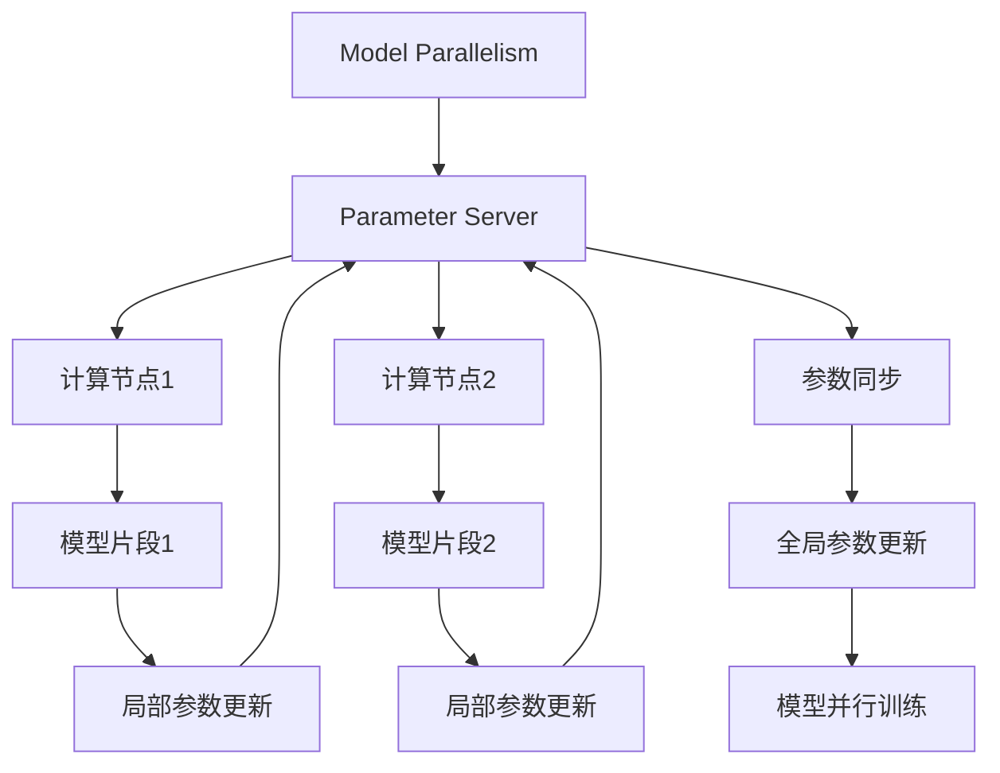

                 

## 1. 背景介绍

在人工智能（AI）领域，大型语言模型（Large Language Model, LLM）的出现引发了一场革命。这些模型通过在海量数据上进行预训练，学习了语言的基本规律和知识，能够进行复杂的语言理解和生成，展现出超凡的性能。然而，这些模型往往具有极高的计算需求和存储空间，使得单机部署变得非常困难。随着分布式计算技术的进步，分布式部署成为了一种更为可行的选择，极大地拓展了LLM的应用范围。

### 1.1 问题由来

随着模型规模的扩大，单机部署的限制变得愈发显著。当前大型语言模型往往需要耗费数百GB甚至更多的内存和数十个GPU，这对大多数用户的硬件配置提出了极高的要求。而大规模数据集和长时间训练也增加了单机部署的成本和时间开销。分布式部署技术允许将模型分布在多台计算节点上进行并行训练和推理，显著提高了模型性能、扩展性和实用性。

### 1.2 问题核心关键点

在分布式部署中，核心问题在于如何平衡计算资源的分配、数据通信的效率以及系统的整体优化。当前，主流的方法包括模型并行、数据并行、混合并行等。每种技术都有其特点和适用场景，需要在具体应用中根据数据特征和任务需求进行选择和优化。

### 1.3 问题研究意义

分布式部署不仅能够解决单机部署的硬件限制问题，还能显著提升模型的训练速度和推理效率。此外，分布式训练还带来了模型扩展性、系统弹性和容错性等方面的优势。这些技术突破，对于推动LLM在更广泛的应用场景中落地，具有重要意义。

## 2. 核心概念与联系

### 2.1 核心概念概述

为了更好地理解LLM的分布式部署，需要掌握以下几个核心概念：

- **模型并行（Model Parallelism）**：将大型模型拆分为多个小的模型片段，每个片段在单独的计算节点上进行训练，不同片段间通过参数服务器协调同步。
- **数据并行（Data Parallelism）**：将数据集拆分为多个子集，每个子集在独立的计算节点上进行训练，每个节点拥有完整的模型。
- **混合并行（Hybrid Parallelism）**：结合模型并行和数据并行，部分模型片段在多节点上进行并行训练，同时每个节点独立处理一部分数据。
- **计算图（Computation Graph）**：定义模型计算过程的数学表达式，通过分布式计算图对模型进行优化，减少通信开销。
- **参数服务器（Parameter Server）**：集中存储和管理模型的参数，多个计算节点通过参数服务器进行同步更新。
- **分布式训练（Distributed Training）**：利用多台计算机协同训练模型，提升训练效率。
- **模型压缩（Model Compression）**：通过剪枝、量化等技术减少模型参数，降低计算资源消耗。
- **动态调度（Dynamic Scheduling）**：根据任务特征动态调整资源分配，提升系统性能。
- **故障容忍（Fault Tolerance）**：设计冗余机制，确保系统在部分节点故障时仍能正常工作。

### 2.2 核心概念原理和架构的 Mermaid 流程图



以上流程图展示了模型并行的基本架构。其中，参数服务器负责协调多个计算节点间的参数更新，确保模型片段的一致性。每个计算节点独立处理模型的一个片段，通过反向传播算法更新本地参数，并最终同步到参数服务器。

## 3. 核心算法原理 & 具体操作步骤

### 3.1 算法原理概述

分布式部署的核心算法原理主要包括模型并行、数据并行和混合并行等，下面将分别介绍其基本原理：

- **模型并行**：将大型模型拆分为多个小的模型片段，每个片段在单独的计算节点上进行训练。模型片段间通过参数服务器协调同步。
- **数据并行**：将数据集拆分为多个子集，每个子集在独立的计算节点上进行训练。每个节点拥有完整的模型，通过分布式计算提升训练效率。
- **混合并行**：结合模型并行和数据并行，部分模型片段在多节点上进行并行训练，同时每个节点独立处理一部分数据。

### 3.2 算法步骤详解

分布式部署的具体操作步骤包括以下几个关键步骤：

**Step 1: 选择合适的分布式框架**
- 选择适合特定场景的分布式计算框架，如TensorFlow、PyTorch、Horovod等。

**Step 2: 设计模型结构**
- 将模型拆分为多个片段，分配到不同的计算节点上进行训练。每个片段独立训练，但最终参数需要同步。

**Step 3: 设置分布式参数**
- 设置每个节点的计算资源和存储资源，如GPU数量、内存大小等。
- 设置分布式参数，如任务标识、节点编号等。

**Step 4: 实现数据分割**
- 将训练数据分割为多个子集，每个子集在独立的计算节点上进行训练。

**Step 5: 数据传输和同步**
- 在训练过程中，通过网络传输数据，确保不同节点间的数据同步。

**Step 6: 参数同步与更新**
- 在每个节点上更新模型参数后，通过参数服务器进行同步，确保全局参数一致。

**Step 7: 模型训练与优化**
- 在多个节点上进行并行训练，通过反向传播算法更新模型参数。
- 应用正则化技术、学习率调整等策略，优化模型性能。

**Step 8: 测试与部署**
- 在测试集上评估模型性能，确保模型在不同节点上的一致性。
- 部署模型到生产环境，进行在线推理和实时预测。

### 3.3 算法优缺点

分布式部署的优点包括：

1. 提高训练效率：通过多台计算机并行训练，显著缩短了训练时间。
2. 扩展性强：可根据需求动态增加或减少计算节点，灵活扩展计算资源。
3. 系统容错：多个计算节点间互为备份，提高系统的可靠性和容错性。
4. 节省成本：共享计算资源，减少单节点硬件成本。

缺点包括：

1. 通信开销：节点间数据传输和参数同步需要额外的计算和网络资源。
2. 系统复杂：分布式系统管理和维护难度较大，需精心设计和管理。
3. 资源分配：需合理分配计算资源，避免资源浪费和计算不均衡。

### 3.4 算法应用领域

分布式部署技术在多个领域得到了广泛应用，以下是几个典型应用：

- **自然语言处理（NLP）**：用于大规模语言模型的训练和推理，如GPT-3、BERT等。
- **计算机视觉（CV）**：用于图像识别、物体检测、图像分割等任务的分布式训练。
- **推荐系统**：用于推荐算法的并行化训练，提升推荐效率。
- **金融风控**：用于大规模数据模型的训练和实时预测，提升金融决策的准确性。
- **大数据分析**：用于分布式数据处理和分析，如Spark等。

## 4. 数学模型和公式 & 详细讲解 & 举例说明

### 4.1 数学模型构建

分布式部署的数学模型通常使用分布式计算图（Distributed Computation Graph）来表示。以下以一个简单的三层神经网络为例，展示分布式计算图的构建过程：

假设输入数据为 $x$，模型参数为 $\theta$，输出为 $y$。将模型分为两个片段，分别在两个节点上训练。每个节点计算一个片段的损失函数，并将结果发送回参数服务器进行同步更新。

**节点1的计算图**：
$$
y_1 = \sigma(w_1 \cdot x + b_1)
$$
**节点2的计算图**：
$$
y_2 = \sigma(w_2 \cdot y_1 + b_2)
$$
**全局损失函数**：
$$
L = \frac{1}{2} ||y - y_2||^2
$$

其中 $\sigma$ 为激活函数，$w$ 和 $b$ 为模型参数。

### 4.2 公式推导过程

在分布式部署中，每个节点的计算过程是独立的，但需要保持模型参数的一致性。以节点1为例，计算过程中涉及的参数更新公式如下：

1. 计算节点1的输出：
$$
y_1 = \sigma(w_1 \cdot x + b_1)
$$

2. 计算节点1的损失函数：
$$
L_1 = \frac{1}{2} ||y - y_1||^2
$$

3. 计算节点1的梯度：
$$
\nabla_{w_1}L_1 = (y - y_1) \cdot (\nabla_{y_1}L_1) \cdot (\nabla_{w_1}y_1)
$$
$$
\nabla_{b_1}L_1 = (y - y_1) \cdot (\nabla_{y_1}L_1) \cdot 1
$$

4. 更新节点1的参数：
$$
w_1 \leftarrow w_1 - \eta \nabla_{w_1}L_1
$$
$$
b_1 \leftarrow b_1 - \eta \nabla_{b_1}L_1
$$

其中 $\eta$ 为学习率。

### 4.3 案例分析与讲解

以GPT-3的分布式训练为例，分析其具体实现过程：

1. 将GPT-3模型分为多个片段，每个片段在独立的计算节点上进行训练。
2. 每个节点计算一个片段的梯度，并通过参数服务器同步更新全局参数。
3. 应用混合精度训练、梯度累积等优化策略，提升训练效率。
4. 在多个节点上进行并行训练，显著缩短训练时间。
5. 在测试集上评估模型性能，确保模型在不同节点上的一致性。

## 5. 项目实践：代码实例和详细解释说明

### 5.1 开发环境搭建

在进行分布式部署的实践前，我们需要准备好开发环境。以下是使用PyTorch进行分布式训练的环境配置流程：

1. 安装Anaconda：从官网下载并安装Anaconda，用于创建独立的Python环境。

2. 创建并激活虚拟环境：
```bash
conda create -n pytorch-env python=3.8 
conda activate pytorch-env
```

3. 安装PyTorch：根据CUDA版本，从官网获取对应的安装命令。例如：
```bash
conda install pytorch torchvision torchaudio cudatoolkit=11.1 -c pytorch -c conda-forge
```

4. 安装Horovod：一个广泛用于分布式深度学习的开源库。
```bash
pip install horovod
```

5. 安装各类工具包：
```bash
pip install numpy pandas scikit-learn matplotlib tqdm jupyter notebook ipython
```

完成上述步骤后，即可在`pytorch-env`环境中开始分布式部署的实践。

### 5.2 源代码详细实现

下面我们以一个简单的分布式训练为例，展示如何使用Horovod对模型进行分布式训练。

首先，定义模型的损失函数：

```python
import torch
from torch import nn
from torch.distributed.fsdp import FullyShardedDataParallel as FSDP
import horovod.torch as hvd

class Net(nn.Module):
    def __init__(self):
        super(Net, self).__init__()
        self.fc1 = nn.Linear(100, 100)
        self.fc2 = nn.Linear(100, 10)

    def forward(self, x):
        x = x.view(-1, 100)
        x = torch.relu(self.fc1(x))
        x = self.fc2(x)
        return x

def loss_fn(output, target):
    return nn.CrossEntropyLoss()(output, target)

net = Net()
model = FSDP(net)
```

然后，初始化Horovod并设置分布式参数：

```python
hvd.init()
hvd.rank()
hvd.size()
```

接着，定义分布式训练函数：

```python
def train_epoch(model, dataset, optimizer, loss_fn):
    model.train()
    loss_sum = 0
    for data, target in dataset:
        data = data.to(hvd.local_rank())
        target = target.to(hvd.local_rank())
        optimizer.zero_grad()
        output = model(data)
        loss = loss_fn(output, target)
        loss_sum += loss.item()
        loss.backward()
        optimizer.step()
    return loss_sum / len(dataset)
```

最后，启动分布式训练流程：

```python
epochs = 5
batch_size = 16
optimizer = torch.optim.Adam(model.parameters(), lr=0.001)

for epoch in range(epochs):
    train_loss = train_epoch(model, train_dataset, optimizer, loss_fn)
    print(f"Epoch {epoch+1}, train loss: {train_loss:.3f}")
```

以上就是使用Horovod对模型进行分布式训练的完整代码实现。可以看到，通过Horovod的简单封装，我们可以在短时间内完成分布式训练的实现。

### 5.3 代码解读与分析

让我们再详细解读一下关键代码的实现细节：

**Net类**：
- 定义了一个简单的两层全连接神经网络。

**Horovod初始化**：
- 使用Horovod初始化分布式环境，获取每个节点的编号和总数。

**train_epoch函数**：
- 在每个epoch内，循环遍历训练集数据。
- 将输入数据和目标标签移动到当前节点的设备上。
- 使用FSDP进行模型并行化，在多个节点上进行并行计算。
- 计算损失函数并反向传播更新模型参数。
- 应用Adam优化器更新模型参数。

**训练流程**：
- 定义总的epoch数和batch size，开始循环迭代。
- 每个epoch内，在训练集上进行分布式训练，输出平均损失。

可以看到，通过Horovod和FSDP的配合使用，我们可以非常方便地实现模型在多个节点上的分布式训练。

当然，工业级的系统实现还需考虑更多因素，如模型的保存和部署、超参数的自动搜索、更灵活的任务适配层等。但核心的分布式训练范式基本与此类似。

## 6. 实际应用场景

### 6.1 智能客服系统

智能客服系统通常需要处理大量的用户请求，对于实时性和系统扩展性要求较高。分布式部署可以极大地提升系统处理能力和响应速度，满足用户的多样化需求。

在技术实现上，可以将智能客服系统分布式部署到多台服务器上，每个服务器负责处理一部分请求。通过消息队列等中间件，将请求分发到不同的服务器进行处理。系统可以根据用户请求量动态调整计算节点数量，确保系统的稳定性和可扩展性。

### 6.2 金融风控

金融行业的数据量庞大，实时风险评估和监控任务需要高效的计算能力。分布式部署技术可以提升模型的训练和推理效率，缩短风险评估的时间。

具体而言，可以将金融风控模型分布式部署到多台服务器上，对海量数据进行实时处理和风险评估。系统可以通过弹性调度机制，根据任务负载动态调整资源分配，确保模型能够在高峰期保持高性能运行。

### 6.3 推荐系统

推荐系统需要处理大规模用户和商品数据，对实时性要求较高。分布式部署技术可以提升推荐算法的训练和推理效率，提供更加精准的推荐结果。

具体而言，可以将推荐模型分布式部署到多台服务器上，对用户和商品数据进行并行处理和推荐计算。系统可以通过动态调度和资源管理，确保推荐算法在实时请求下能够快速响应。

### 6.4 未来应用展望

随着分布式计算技术的不断发展，分布式部署技术将在更多领域得到应用，为各行各业带来变革性影响。

在智慧医疗领域，分布式部署技术可以提升医疗影像处理和诊断的效率，加速新药研发进程。

在智能教育领域，分布式部署技术可以支持大规模在线教育课程的实时生成和推送，提升教育质量。

在智慧城市治理中，分布式部署技术可以提升城市事件监测和应急响应的效率，提高城市管理水平。

此外，在企业生产、社会治理、文娱传媒等众多领域，分布式部署技术也将不断涌现，为传统行业数字化转型升级提供新的技术路径。

## 7. 工具和资源推荐

### 7.1 学习资源推荐

为了帮助开发者系统掌握分布式部署的理论基础和实践技巧，这里推荐一些优质的学习资源：

1. 《分布式深度学习》系列书籍：深入浅出地介绍了分布式深度学习的原理和实践，涵盖模型并行、数据并行、混合并行等多种技术。
2. 《深度学习分布式算法》课程：斯坦福大学开设的分布式深度学习课程，涵盖各种分布式计算框架和算法。
3. 《Hugging Face官方文档》：提供详细的Horovod使用指南和示例代码，方便开发者上手实践。
4. 《TensorFlow官方文档》：提供TensorFlow和Horovod的集成使用指南和API参考。
5. 《Apache Spark官方文档》：提供Spark的分布式计算框架和API参考。

通过对这些资源的学习实践，相信你一定能够快速掌握分布式部署的精髓，并用于解决实际的分布式计算问题。

### 7.2 开发工具推荐

高效的开发离不开优秀的工具支持。以下是几款用于分布式部署开发的常用工具：

1. TensorFlow：基于Python的开源深度学习框架，生产部署方便，适合大规模工程应用。
2. PyTorch：基于Python的开源深度学习框架，灵活动态的计算图，适合快速迭代研究。
3. Horovod：广泛用于分布式深度学习的开源库，支持多种深度学习框架，易于使用。
4. MPI：消息传递接口，广泛用于高性能计算，支持大规模分布式系统。
5. MPI4py：Python实现的MPI接口，方便与深度学习框架结合使用。
6. Spark：Apache基金会开发的分布式计算框架，适合大数据处理和分析。

合理利用这些工具，可以显著提升分布式部署任务的开发效率，加快创新迭代的步伐。

### 7.3 相关论文推荐

分布式部署技术的发展源于学界的持续研究。以下是几篇奠基性的相关论文，推荐阅读：

1. Scalable Deep Learning（Spark深度学习）：提出Spark深度学习框架，支持大规模深度学习的分布式训练和推理。
2. Distributed Deep Learning with Parameter Server：提出参数服务器模型，用于多节点并行训练深度学习模型。
3. DeepSpeed：Facebook开源的深度学习加速工具包，支持模型并行、数据并行等多种技术。
4. Dist-Bert：Google开源的分布式BERT模型，支持大规模语言模型的分布式训练和推理。
5. TensorFlow Model Optimization Toolkit：提供多种优化技术，用于分布式模型的压缩、量化和加速。

这些论文代表了大规模分布式部署技术的发展脉络。通过学习这些前沿成果，可以帮助研究者把握学科前进方向，激发更多的创新灵感。

## 8. 总结：未来发展趋势与挑战

### 8.1 研究成果总结

本文对基于分布式部署的LLM技术进行了全面系统的介绍。首先阐述了分布式部署的原理和背景，明确了其在提升模型性能、扩展性和实用性的重要意义。其次，从原理到实践，详细讲解了分布式部署的数学模型和操作步骤，给出了分布式部署任务开发的完整代码实例。同时，本文还广泛探讨了分布式部署技术在智能客服、金融风控、推荐系统等多个行业领域的应用前景，展示了其广阔的发展潜力。

通过本文的系统梳理，可以看到，分布式部署技术已经成为LLM应用的重要手段，极大地拓展了预训练语言模型的应用边界，催生了更多的落地场景。未来，伴随分布式计算技术的持续演进，LLM将能够处理更复杂、更大规模的计算任务，为智能系统的构建带来更大价值。

### 8.2 未来发展趋势

展望未来，分布式部署技术将呈现以下几个发展趋势：

1. 模型规模持续增大。随着算力成本的下降和数据规模的扩张，预训练语言模型的参数量还将持续增长。超大模型在分布式部署下，能够处理更复杂、更庞大的计算任务。
2. 通信优化提升。优化网络通信效率，降低节点间的数据传输开销，进一步提升分布式系统的性能。
3. 弹性调度和资源管理：智能调度和资源管理技术，确保系统在不同负载情况下能够高效运行。
4. 混合并行和异构并行：结合多种并行技术和异构计算资源，提升分布式系统的灵活性和扩展性。
5. 多模态分布式训练：结合视觉、语音、文本等多种模态数据，进行多模态分布式训练，提升系统的智能化水平。
6. 跨云部署和协作：支持跨云平台、跨数据中心和多租户环境下的分布式部署和管理。

以上趋势凸显了大规模分布式部署技术的广阔前景。这些方向的探索发展，必将进一步提升LLM的性能和实用性，为智能系统的构建提供强大支持。

### 8.3 面临的挑战

尽管分布式部署技术已经取得了显著进展，但在迈向更加智能化、普适化应用的过程中，仍面临诸多挑战：

1. 通信开销：节点间数据传输和参数同步需要额外的计算和网络资源，通信开销较大。
2. 系统复杂度：分布式系统管理和维护难度较大，需精心设计和管理。
3. 资源分配：需合理分配计算资源，避免资源浪费和计算不均衡。
4. 系统可靠性：系统故障容忍性和鲁棒性有待提升，确保系统在高并发、高负载情况下的稳定性。
5. 数据隐私和安全：分布式训练和推理过程中，数据隐私和安全性问题需妥善解决。

### 8.4 研究展望

面对分布式部署面临的挑战，未来的研究需要在以下几个方面寻求新的突破：

1. 探索更加高效的通信技术：研究新型网络协议和算法，降低节点间通信开销。
2. 设计更灵活的调度策略：开发智能调度算法，提升资源利用率和系统性能。
3. 引入更多先验知识：将符号化的先验知识，如知识图谱、逻辑规则等，与分布式系统结合，提升系统的知识整合能力。
4. 结合因果分析和博弈论工具：将因果分析方法引入分布式系统，识别出系统决策的关键特征，增强系统输出的可解释性和稳定性。
5. 引入跨平台协作技术：支持跨云平台、跨数据中心和多租户环境下的分布式部署和管理。
6. 研究新的数据安全技术：开发数据隐私保护算法，确保分布式系统在数据共享和交换中的安全性。

这些研究方向将推动分布式部署技术迈向更高的台阶，为智能系统的构建提供更强大的支持。面向未来，分布式部署技术需要与其他人工智能技术进行更深入的融合，共同推动智能系统的进步。

## 9. 附录：常见问题与解答

**Q1：分布式部署是否适用于所有NLP任务？**

A: 分布式部署在大多数NLP任务上都能取得不错的效果，特别是对于数据量较大的任务。但对于一些特定领域的任务，如医学、法律等，由于数据规模较小，分布式部署的优势不明显。此时可以结合特定领域的数据特点和需求，进行分布式训练和推理。

**Q2：如何选择适合分布式部署的框架？**

A: 选择合适的分布式框架需要考虑任务的规模和需求。对于小规模任务，可以使用单机或多节点数据并行。对于大规模任务，需要使用模型并行。常用的框架包括TensorFlow、PyTorch、Horovod等，需根据具体需求选择。

**Q3：分布式部署中如何优化通信开销？**

A: 优化通信开销的关键在于减少数据传输量和传输频率。可以通过以下方法实现：
1. 数据压缩：对传输数据进行压缩，减少通信开销。
2. 异步通信：异步传输数据，减少等待时间。
3. 分块传输：将数据分成小块传输，减少单次传输量。
4. 优化通信协议：选择高效的通信协议，如GPUDirect、InfiniBand等。

**Q4：如何设计高效的分布式系统？**

A: 设计高效的分布式系统需要考虑以下因素：
1. 合理的资源分配：根据任务需求和硬件配置，合理分配计算资源。
2. 智能调度：使用智能调度算法，根据系统负载动态调整计算节点。
3. 数据分割：合理分割数据，确保每个节点处理的数据量均衡。
4. 参数同步：使用高效的参数同步算法，确保全局参数一致。
5. 容错机制：设计冗余机制，确保系统在部分节点故障时仍能正常工作。

**Q5：分布式部署的模型是否可以跨平台部署？**

A: 分布式部署的模型通常需要与特定平台和硬件环境配合使用，跨平台部署需要考虑数据格式、计算框架、通信协议等方面的兼容性问题。可以通过容器化技术、虚拟化技术等方式，实现跨平台部署和运行。

本文通过全面系统的介绍，展现了分布式部署技术的原理和实践，并提供了多种学习资源和开发工具推荐，相信能帮助读者系统掌握分布式部署的精髓，并用于解决实际的分布式计算问题。面向未来，分布式部署技术将在更多领域得到应用，为智能系统的构建带来变革性影响。

