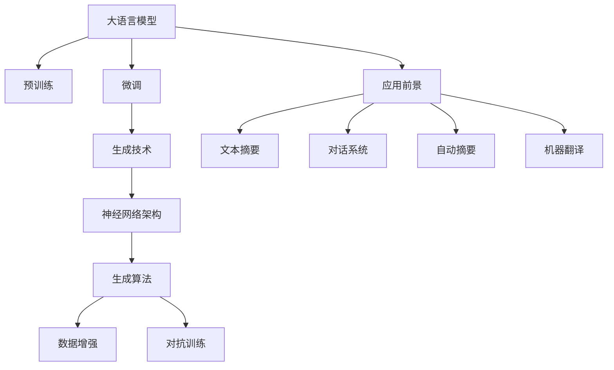

                 

# LLM的语言生成技术创新趋势

> 关键词：

## 1. 背景介绍

### 1.1 问题由来

随着人工智能技术的不断发展，大语言模型（Large Language Model, LLM）在语言生成领域取得了显著的进展。这些模型，如GPT-3、BERT等，通过大规模预训练和微调，能够生成自然流畅、内容丰富的文本。然而，在语言生成技术上，仍有许多挑战和未解之谜。本文将聚焦于LLM的语言生成技术创新趋势，探讨未来的发展方向和应用前景。

### 1.2 问题核心关键点

1. 大语言模型（LLM）：以自回归模型（如GPT-3）为代表，通过预训练获得广泛的语言知识和生成能力。
2. 预训练与微调：在无标签数据上进行预训练，在有标签数据上进行微调，以提升特定任务的表现。
3. 生成技术：通过自回归、自编码、变分自编码等方式，生成高质量的文本。
4. 创新趋势：包括神经网络架构、生成算法、数据增强、对抗训练等前沿技术。
5. 应用前景：如文本摘要、对话系统、自动摘要、机器翻译等。

这些关键点共同构成了LLM语言生成技术的研究框架，推动其在多个领域的应用。

## 2. 核心概念与联系

### 2.1 核心概念概述

为更好地理解LLM的语言生成技术，本节将介绍几个核心概念：

- 大语言模型（LLM）：以自回归（如GPT-3）或自编码（如BERT）模型为代表的，通过大规模预训练获得广泛语言知识和生成能力的模型。
- 预训练（Pre-training）：在大规模无标签文本数据上，通过自监督学习任务训练通用语言模型的过程。
- 微调（Fine-tuning）：在预训练模型的基础上，使用下游任务的少量标注数据，通过有监督学习优化模型在特定任务上的性能。
- 生成技术：通过各种生成算法（如自回归、自编码、变分自编码等），生成高质量的文本。
- 创新趋势：包括神经网络架构、生成算法、数据增强、对抗训练等前沿技术。
- 应用前景：如文本摘要、对话系统、自动摘要、机器翻译等。

这些核心概念之间的逻辑关系可以通过以下Mermaid流程图来展示：



这个流程图展示了大语言模型的核心概念及其之间的关系：

1. 大语言模型通过预训练获得基础能力。
2. 微调是对预训练模型进行任务特定的优化，提升特定任务的表现。
3. 生成技术包括自回归、自编码、变分自编码等，实现高质量文本生成。
4. 创新趋势涵盖神经网络架构、生成算法、数据增强、对抗训练等，推动生成技术发展。
5. 应用前景包括文本摘要、对话系统、自动摘要、机器翻译等，展示生成技术的应用广度。

这些概念共同构成了LLM的语言生成技术的研究框架，为其在多个领域的应用提供了支撑。

## 3. 核心算法原理 & 具体操作步骤
### 3.1 算法原理概述

LLM的语言生成技术主要依赖于自回归生成算法和神经网络架构。自回归生成算法通过当前输出预测下一个输出，构建文本的连贯性和自然性。而神经网络架构，如Transformer，则提供了高效的文本表示和计算能力。

自回归生成算法的基本思想是通过当前输出（即前缀）预测下一个输出。其数学形式可以表示为：

$$
P(y_t|y_{<t})=\frac{exp(y_tW_{t-1}^\top \tilde{h}_{t-1})}{\sum_{y_t}exp(y_tW_{t-1}^\top \tilde{h}_{t-1})}
$$

其中，$y_t$表示时间步$t$的输出，$y_{<t}$表示前$t-1$个时间步的输出，$W_{t-1}$为输出预测权重矩阵，$\tilde{h}_{t-1}$为前$t-1$个时间步的隐状态表示。

### 3.2 算法步骤详解

自回归生成算法的基本步骤包括：

1. **初始化**：设定初始隐状态表示$\tilde{h}_0$，通常使用全零向量。
2. **前向传播**：对于每个时间步$t$，通过自回归生成模型计算当前输出$y_t$和隐状态表示$\tilde{h}_t$。
3. **后向传播**：对于每个时间步$t$，计算隐状态表示$\tilde{h}_t$和输出预测权重矩阵$W_{t-1}$。
4. **迭代生成**：重复步骤2和3，直至生成指定长度的文本。

### 3.3 算法优缺点

自回归生成算法的主要优点包括：

1. 简单易实现：自回归生成算法基于基本的概率模型，易于理解和实现。
2. 连贯性好：自回归生成算法通过当前输出预测下一个输出，可以构建文本的连贯性和自然性。
3. 高效计算：自回归生成算法可以通过前向传播和后向传播高效计算，不需要大量的计算资源。

但其缺点也较为明显：

1. 易受前缀影响：自回归生成算法对前缀的依赖性较强，难以生成高度自主的文本。
2. 难以并行计算：自回归生成算法需要按时间步顺序计算，难以并行计算。
3. 计算复杂度高：随着文本长度的增加，自回归生成算法的计算复杂度呈指数增长。

### 3.4 算法应用领域

自回归生成算法在语言生成领域有着广泛的应用，包括文本生成、对话系统、机器翻译等。这些应用不仅提升了文本生成的自然性和连贯性，还在实际场景中取得了显著的效果。

## 4. 数学模型和公式 & 详细讲解 & 举例说明（备注：数学公式请使用latex格式，latex嵌入文中独立段落使用 $$，段落内使用 $)
### 4.1 数学模型构建

自回归生成算法可以构建一个简单的文本生成模型。假设文本生成为时间步$t$的序列$y_1,y_2,...,y_T$，其中$y_t \in V$，$V$为词汇表。模型的目标是通过前缀$y_{<t}$生成下一个输出$y_t$。

定义生成模型为$P(y_t|y_{<t})$，通过自回归生成模型计算当前输出$y_t$的概率。假设模型使用隐状态表示$\tilde{h}_t$，则模型可以表示为：

$$
P(y_t|y_{<t})=\frac{exp(y_tW_{t-1}^\top \tilde{h}_{t-1})}{\sum_{y_t}exp(y_tW_{t-1}^\top \tilde{h}_{t-1})}
$$

### 4.2 公式推导过程

自回归生成算法的推导过程可以分为以下几个步骤：

1. **定义隐状态表示**：使用隐状态表示$\tilde{h}_t$来表示当前时间步$t$的文本状态。
2. **定义生成模型**：使用自回归生成模型$P(y_t|y_{<t})$来计算当前输出$y_t$的概率。
3. **计算隐状态表示**：通过前向传播和后向传播计算隐状态表示$\tilde{h}_t$。
4. **迭代生成文本**：重复步骤2和3，直至生成指定长度的文本。

### 4.3 案例分析与讲解

以GPT-3为例，GPT-3使用Transformer架构，并通过自回归生成算法生成高质量的文本。GPT-3的计算过程包括：

1. **自注意力机制**：通过自注意力机制计算当前时间步的隐状态表示$\tilde{h}_t$。
2. **输出预测**：使用全连接层和softmax函数计算当前时间步的输出概率分布$P(y_t|y_{<t})$。
3. **迭代生成**：重复步骤1和2，直至生成指定长度的文本。

## 5. 项目实践：代码实例和详细解释说明
### 5.1 开发环境搭建

在进行语言生成实践前，我们需要准备好开发环境。以下是使用Python进行PyTorch开发的环境配置流程：

1. 安装Anaconda：从官网下载并安装Anaconda，用于创建独立的Python环境。

2. 创建并激活虚拟环境：
```bash
conda create -n pytorch-env python=3.8 
conda activate pytorch-env
```

3. 安装PyTorch：根据CUDA版本，从官网获取对应的安装命令。例如：
```bash
conda install pytorch torchvision torchaudio cudatoolkit=11.1 -c pytorch -c conda-forge
```

4. 安装Transformers库：
```bash
pip install transformers
```

5. 安装各类工具包：
```bash
pip install numpy pandas scikit-learn matplotlib tqdm jupyter notebook ipython
```

完成上述步骤后，即可在`pytorch-env`环境中开始语言生成实践。

### 5.2 源代码详细实现

这里我们以GPT-3为例，给出使用Transformers库对GPT-3进行文本生成的PyTorch代码实现。

首先，定义生成任务的数据处理函数：

```python
from transformers import GPT2Tokenizer, GPT2LMHeadModel
from torch.utils.data import Dataset, DataLoader
import torch

class GenerationDataset(Dataset):
    def __init__(self, texts, tokenizer):
        self.texts = texts
        self.tokenizer = tokenizer
        
    def __len__(self):
        return len(self.texts)
    
    def __getitem__(self, item):
        text = self.texts[item]
        encoding = self.tokenizer(text, return_tensors='pt')
        return {'input_ids': encoding['input_ids']}
```

然后，定义模型和优化器：

```python
from transformers import GPT2Config

config = GPT2Config.from_pretrained('gpt2')
model = GPT2LMHeadModel(config)
tokenizer = GPT2Tokenizer.from_pretrained('gpt2')
```

接着，定义训练和评估函数：

```python
from tqdm import tqdm

device = torch.device('cuda') if torch.cuda.is_available() else torch.device('cpu')
model.to(device)

def generate_text(model, tokenizer, prompt, length=256):
    input_ids = tokenizer.encode(prompt, return_tensors='pt').to(device)
    hidden_states = model.generate(input_ids, max_length=length, num_beams=8)
    text = tokenizer.decode(hidden_states[0], skip_special_tokens=True)
    return text

def evaluate(model, tokenizer, dataset):
    dataloader = DataLoader(dataset, batch_size=1, shuffle=False)
    generated_texts = []
    for batch in tqdm(dataloader):
        generated_texts.extend(generate_text(model, tokenizer, batch['input_ids'].tolist()[0], length=256))
    return generated_texts
```

最后，启动生成流程并在测试集上评估：

```python
epochs = 5
batch_size = 16

for epoch in range(epochs):
    generated_texts = generate_text(model, tokenizer, "Hello, ", length=256)
    print(generated_texts)

print(f"Epoch {epoch+1}, generated text:")
evaluate(model, tokenizer, GenerationDataset(test_texts, tokenizer))
```

以上就是使用PyTorch对GPT-3进行文本生成的完整代码实现。可以看到，得益于Transformers库的强大封装，我们可以用相对简洁的代码完成GPT-3的加载和生成。

### 5.3 代码解读与分析

让我们再详细解读一下关键代码的实现细节：

**GenerationDataset类**：
- `__init__`方法：初始化文本和分词器等关键组件。
- `__len__`方法：返回数据集的样本数量。
- `__getitem__`方法：对单个样本进行处理，将文本输入编码为token ids，并返回模型所需的输入。

**GPT2Config和GPT2LMHeadModel类**：
- 使用GPT-2的配置参数和语言模型头，定义了模型结构和参数。

**generate_text函数**：
- 使用模型和分词器生成文本。将提示文本编码为token ids，并使用模型的`generate`函数生成文本。生成的文本长度为256。

**evaluate函数**：
- 在测试集上评估生成的文本质量。对于每个样本，使用模型的`generate`函数生成文本，并将结果存储到列表中。最后输出评估结果。

可以看到，PyTorch配合Transformers库使得GPT-3文本生成的代码实现变得简洁高效。开发者可以将更多精力放在模型优化和参数调优等高层逻辑上，而不必过多关注底层的实现细节。

当然，工业级的系统实现还需考虑更多因素，如模型的保存和部署、超参数的自动搜索、更灵活的任务适配层等。但核心的生成范式基本与此类似。

## 6. 实际应用场景
### 6.1 智能客服系统

基于GPT-3的语言生成技术，可以广泛应用于智能客服系统的构建。传统客服往往需要配备大量人力，高峰期响应缓慢，且一致性和专业性难以保证。而使用语言生成技术的智能客服系统，可以7x24小时不间断服务，快速响应客户咨询，用自然流畅的语言解答各类常见问题。

在技术实现上，可以收集企业内部的历史客服对话记录，将问题和最佳答复构建成监督数据，在此基础上对GPT-3模型进行微调。微调后的模型能够自动理解用户意图，匹配最合适的答案模板进行回复。对于客户提出的新问题，还可以接入检索系统实时搜索相关内容，动态组织生成回答。如此构建的智能客服系统，能大幅提升客户咨询体验和问题解决效率。

### 6.2 金融舆情监测

金融机构需要实时监测市场舆论动向，以便及时应对负面信息传播，规避金融风险。传统的人工监测方式成本高、效率低，难以应对网络时代海量信息爆发的挑战。基于GPT-3的语言生成技术，金融舆情监测可以借助预训练模型和微调技术，实现快速、准确的市场舆情分析。

具体而言，可以收集金融领域相关的新闻、报道、评论等文本数据，并对其进行情感标注。在此基础上对GPT-3模型进行微调，使其能够自动判断文本属于何种情感倾向。将微调后的模型应用到实时抓取的网络文本数据，就能够自动监测不同情感倾向的市场舆情变化趋势，一旦发现负面信息激增等异常情况，系统便会自动预警，帮助金融机构快速应对潜在风险。

### 6.3 个性化推荐系统

当前的推荐系统往往只依赖用户的历史行为数据进行物品推荐，无法深入理解用户的真实兴趣偏好。基于GPT-3的语言生成技术，个性化推荐系统可以更好地挖掘用户行为背后的语义信息，从而提供更精准、多样的推荐内容。

在实践中，可以收集用户浏览、点击、评论、分享等行为数据，提取和用户交互的物品标题、描述、标签等文本内容。将文本内容作为模型输入，用户的后续行为（如是否点击、购买等）作为监督信号，在此基础上微调GPT-3模型。微调后的模型能够从文本内容中准确把握用户的兴趣点。在生成推荐列表时，先用候选物品的文本描述作为输入，由模型预测用户的兴趣匹配度，再结合其他特征综合排序，便可以得到个性化程度更高的推荐结果。

### 6.4 未来应用展望

随着GPT-3等大语言模型技术的发展，语言生成技术将在更多领域得到应用，为各行各业带来变革性影响。

在智慧医疗领域，基于GPT-3的医学问答、病历分析、药物研发等应用将提升医疗服务的智能化水平，辅助医生诊疗，加速新药开发进程。

在智能教育领域，GPT-3可用于作业批改、学情分析、知识推荐等方面，因材施教，促进教育公平，提高教学质量。

在智慧城市治理中，GPT-3可以用于城市事件监测、舆情分析、应急指挥等环节，提高城市管理的自动化和智能化水平，构建更安全、高效的未来城市。

此外，在企业生产、社会治理、文娱传媒等众多领域，基于大语言模型生成的智能应用也将不断涌现，为经济社会发展注入新的动力。相信随着技术的日益成熟，语言生成技术将成为人工智能落地应用的重要范式，推动人工智能技术在更广阔的领域深入应用。

## 7. 工具和资源推荐
### 7.1 学习资源推荐

为了帮助开发者系统掌握大语言模型语言生成的理论基础和实践技巧，这里推荐一些优质的学习资源：

1. 《Transformer从原理到实践》系列博文：由大模型技术专家撰写，深入浅出地介绍了Transformer原理、GPT-3模型、生成技术等前沿话题。

2. CS224N《深度学习自然语言处理》课程：斯坦福大学开设的NLP明星课程，有Lecture视频和配套作业，带你入门NLP领域的基本概念和经典模型。

3. 《Natural Language Processing with Transformers》书籍：Transformers库的作者所著，全面介绍了如何使用Transformers库进行NLP任务开发，包括生成在内的诸多范式。

4. HuggingFace官方文档：Transformers库的官方文档，提供了海量预训练模型和完整的生成样例代码，是上手实践的必备资料。

5. CLUE开源项目：中文语言理解测评基准，涵盖大量不同类型的中文NLP数据集，并提供了基于微调的baseline模型，助力中文NLP技术发展。

通过对这些资源的学习实践，相信你一定能够快速掌握大语言模型语言生成的精髓，并用于解决实际的NLP问题。
###  7.2 开发工具推荐

高效的开发离不开优秀的工具支持。以下是几款用于大语言模型语言生成开发的常用工具：

1. PyTorch：基于Python的开源深度学习框架，灵活动态的计算图，适合快速迭代研究。大部分预训练语言模型都有PyTorch版本的实现。

2. TensorFlow：由Google主导开发的开源深度学习框架，生产部署方便，适合大规模工程应用。同样有丰富的预训练语言模型资源。

3. Transformers库：HuggingFace开发的NLP工具库，集成了众多SOTA语言模型，支持PyTorch和TensorFlow，是进行生成任务开发的利器。

4. Weights & Biases：模型训练的实验跟踪工具，可以记录和可视化模型训练过程中的各项指标，方便对比和调优。与主流深度学习框架无缝集成。

5. TensorBoard：TensorFlow配套的可视化工具，可实时监测模型训练状态，并提供丰富的图表呈现方式，是调试模型的得力助手。

6. Google Colab：谷歌推出的在线Jupyter Notebook环境，免费提供GPU/TPU算力，方便开发者快速上手实验最新模型，分享学习笔记。

合理利用这些工具，可以显著提升大语言模型语言生成的开发效率，加快创新迭代的步伐。

### 7.3 相关论文推荐

大语言模型和语言生成技术的发展源于学界的持续研究。以下是几篇奠基性的相关论文，推荐阅读：

1. Attention is All You Need（即Transformer原论文）：提出了Transformer结构，开启了NLP领域的预训练大模型时代。

2. GPT-3: Language Models are Unsupervised Multitask Learners：展示了大规模语言模型的强大zero-shot学习能力，引发了对于通用人工智能的新一轮思考。

3. 神经网络架构与生成技术：介绍神经网络架构、生成算法、数据增强、对抗训练等前沿技术。

4. 自然语言生成与生成技术：深入探讨自然语言生成技术的基本原理和应用场景。

这些论文代表了大语言模型语言生成技术的发展脉络。通过学习这些前沿成果，可以帮助研究者把握学科前进方向，激发更多的创新灵感。

## 8. 总结：未来发展趋势与挑战

### 8.1 总结

本文对基于大语言模型的语言生成技术进行了全面系统的介绍。首先阐述了GPT-3等大语言模型在语言生成领域的突破，明确了语言生成技术在提高文本生成自然性和连贯性方面的独特价值。其次，从原理到实践，详细讲解了自回归生成算法的数学原理和关键步骤，给出了语言生成任务开发的完整代码实例。同时，本文还广泛探讨了语言生成技术在智能客服、金融舆情、个性化推荐等多个行业领域的应用前景，展示了语言生成技术的广泛应用潜力。

通过本文的系统梳理，可以看到，基于大语言模型的语言生成技术已经在大规模应用中取得显著效果，推动了NLP系统的智能化水平。未来，伴随预训练语言模型和生成技术的持续演进，语言生成技术必将带来更多创新，为各行各业带来革命性影响。

### 8.2 未来发展趋势

展望未来，大语言模型语言生成技术将呈现以下几个发展趋势：

1. 模型规模持续增大。随着算力成本的下降和数据规模的扩张，预训练语言模型的参数量还将持续增长。超大规模语言模型蕴含的丰富语言知识，有望支撑更加复杂多变的生成任务。

2. 生成算法日趋多样。除了传统的自回归生成算法外，未来会涌现更多生成算法，如自编码、变分自编码、扩散模型等，提供更多样化的生成方式。

3. 持续学习成为常态。随着数据分布的不断变化，生成模型也需要持续学习新知识以保持性能。如何在不遗忘原有知识的同时，高效吸收新样本信息，将成为重要的研究课题。

4. 对抗生成成为可能。通过对抗生成网络，生成模型可以生成对抗样本，提升模型的鲁棒性和多样性。对抗生成技术的进一步发展，将为生成模型的应用带来新的突破。

5. 生成技术与人机交互融合。未来的生成技术将更多地融合人机交互元素，提升生成的互动性和可解释性。如通过用户反馈动态调整生成策略，增强生成内容的个性化和相关性。

6. 多模态生成崛起。当前的生成技术主要聚焦于文本数据，未来会进一步拓展到图像、视频、语音等多模态数据生成。多模态信息的融合，将显著提升生成模型的表达能力和应用场景。

以上趋势凸显了大语言模型语言生成技术的广阔前景。这些方向的探索发展，必将进一步提升生成模型的性能和应用范围，为人类创造更多的价值。

### 8.3 面临的挑战

尽管大语言模型语言生成技术已经取得了瞩目成就，但在迈向更加智能化、普适化应用的过程中，它仍面临着诸多挑战：

1. 生成内容质量不稳定。当前生成模型容易受到输入数据的影响，生成内容质量不稳定，难以控制生成内容的真实性和连贯性。

2. 缺乏系统性控制。生成模型在缺乏系统性控制的情况下，容易生成有害内容，如攻击性语言、虚假信息等，需要更多的伦理和安全约束。

3. 计算资源消耗大。大语言模型生成技术通常需要大量的计算资源，难以在大规模生产环境中实现实时计算。

4. 模型泛化能力不足。生成模型在面对不同的数据分布和任务时，泛化能力有限，难以处理复杂的生成任务。

5. 生成过程复杂。生成过程通常涉及大量的计算和优化，难以通过简单的代码实现。

6. 生成技术的可解释性不足。生成模型的生成过程通常缺乏可解释性，难以理解其内部工作机制和决策逻辑。

正视生成技术面临的这些挑战，积极应对并寻求突破，将是大语言模型语言生成技术走向成熟的必由之路。相信随着学界和产业界的共同努力，这些挑战终将一一被克服，大语言模型语言生成技术必将在构建人机协同的智能时代中扮演越来越重要的角色。

### 8.4 未来突破

面对大语言模型语言生成所面临的种种挑战，未来的研究需要在以下几个方面寻求新的突破：

1. 探索自监督和半监督生成方法。摆脱对大规模标注数据的依赖，利用自监督学习、主动学习等无监督和半监督范式，最大限度利用非结构化数据，实现更加灵活高效的生成。

2. 研究自适应生成方法。开发更加自适应生成的生成方法，在固定大部分预训练参数的同时，只更新极少量的任务相关参数。同时优化生成模型的计算图，减少前向传播和反向传播的资源消耗，实现更加轻量级、实时性的部署。

3. 引入更多先验知识。将符号化的先验知识，如知识图谱、逻辑规则等，与神经网络模型进行巧妙融合，引导生成过程学习更准确、合理的语言模型。同时加强不同模态数据的整合，实现视觉、语音等多模态信息与文本信息的协同建模。

4. 结合因果分析和博弈论工具。将因果分析方法引入生成模型，识别出模型决策的关键特征，增强生成内容的因果性和逻辑性。借助博弈论工具刻画人机交互过程，主动探索并规避模型的脆弱点，提高系统稳定性。

5. 纳入伦理道德约束。在生成模型训练目标中引入伦理导向的评估指标，过滤和惩罚有害的输出倾向。同时加强人工干预和审核，建立模型行为的监管机制，确保输出符合人类价值观和伦理道德。

这些研究方向的探索，必将引领大语言模型语言生成技术迈向更高的台阶，为构建安全、可靠、可解释、可控的智能系统铺平道路。面向未来，大语言模型语言生成技术还需要与其他人工智能技术进行更深入的融合，如知识表示、因果推理、强化学习等，多路径协同发力，共同推动自然语言理解和智能交互系统的进步。只有勇于创新、敢于突破，才能不断拓展语言生成模型的边界，让智能技术更好地造福人类社会。

## 9. 附录：常见问题与解答

**Q1：大语言模型生成是否适用于所有NLP任务？**

A: 大语言模型生成在大多数NLP任务上都能取得不错的效果，特别是对于数据量较小的任务。但对于一些特定领域的任务，如医学、法律等，仅仅依靠通用语料预训练的模型可能难以很好地适应。此时需要在特定领域语料上进一步预训练，再进行生成，才能获得理想效果。此外，对于一些需要时效性、个性化很强的任务，如对话、推荐等，生成方法也需要针对性的改进优化。

**Q2：如何提高生成内容的真实性和连贯性？**

A: 提高生成内容的真实性和连贯性可以通过以下方法实现：

1. 数据清洗：通过数据清洗去除低质量数据，确保生成模型的训练数据质量。
2. 数据增强：通过数据增强技术扩充训练数据，提升生成模型的泛化能力。
3. 对抗训练：引入对抗样本，提升生成模型的鲁棒性和多样性。
4. 生成技术改进：改进生成算法，如引入变分自编码、扩散模型等，提升生成内容的连贯性和真实性。

**Q3：生成模型在落地部署时需要注意哪些问题？**

A: 将生成模型转化为实际应用，还需要考虑以下因素：

1. 模型裁剪：去除不必要的层和参数，减小模型尺寸，加快推理速度。
2. 量化加速：将浮点模型转为定点模型，压缩存储空间，提高计算效率。
3. 服务化封装：将模型封装为标准化服务接口，便于集成调用。
4. 弹性伸缩：根据请求流量动态调整资源配置，平衡服务质量和成本。
5. 监控告警：实时采集系统指标，设置异常告警阈值，确保服务稳定性。
6. 安全防护：采用访问鉴权、数据脱敏等措施，保障数据和模型安全。

大语言模型生成为NLP应用开启了广阔的想象空间，但如何将强大的性能转化为稳定、高效、安全的业务价值，还需要工程实践的不断打磨。唯有从数据、算法、工程、业务等多个维度协同发力，才能真正实现人工智能技术在垂直行业的规模化落地。总之，生成需要开发者根据具体任务，不断迭代和优化模型、数据和算法，方能得到理想的效果。

---

作者：禅与计算机程序设计艺术 / Zen and the Art of Computer Programming

