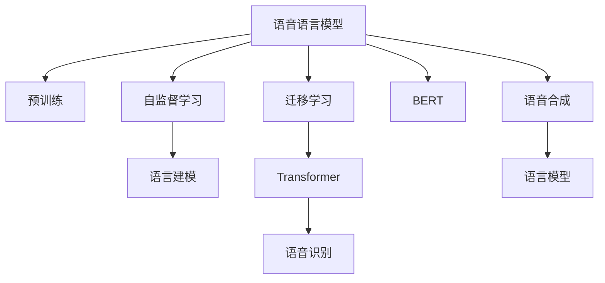

                 

# LLM的语音语言预训练模型探索

> 关键词：语言模型,自监督学习,语音识别,语音合成,预训练,迁移学习,Transformer,BERT

## 1. 背景介绍

### 1.1 问题由来
在自然语言处理(NLP)领域，基于文本的语言模型如BERT、GPT等已经取得了巨大成功。然而，语音识别和语音合成作为NLP的重要分支，其表现却仍较为有限。语音识别主要解决如何将自然语音转化为文本的问题，而语音合成则是将文本转化为自然语音。这两个任务虽然形式不同，但都需要强大的语言模型作为支撑。

近年来，随着深度学习技术的不断发展，出现了许多针对语音的语言模型。这些模型基于自监督学习的方法，通过在大量无标签语音数据上预训练，学习到语音和语言之间的映射关系，从而提升语音识别和合成的效果。

### 1.2 问题核心关键点
语音语言模型研究的核心在于如何将预训练语言模型与语音识别/合成技术相结合，提升模型的表现。目前主流的做法包括：

- 利用预训练语言模型作为语音识别的解码器或合成器的先验知识，提高模型的准确度和流畅度。
- 采用跨领域迁移学习的方法，将通用语言模型应用于语音领域，通过微调或知识蒸馏等技术，提升模型的泛化能力和效果。
- 引入多模态学习的方法，结合文本、语音、图像等多模态信息，提高模型的理解和生成能力。

### 1.3 问题研究意义
语音语言模型的研究，对于提升语音识别和合成的性能，推动人机交互的自然化、智能化，具有重要意义：

1. 提升语音处理性能。语音语言模型能够利用语言学知识，增强语音识别和合成的准确性和流畅度，提升用户体验。
2. 扩展语音应用场景。语音语言模型可以将语音技术与自然语言处理相结合，应用于智能家居、车载导航、语音客服等场景。
3. 推动人工智能普及。语音语言模型的普及，使得人工智能技术更容易被大众接受和使用，有助于加速人工智能的落地。
4. 促进跨领域创新。语音语言模型的发展，催生了语音文本互译、语音情感识别、语音知识图谱等多领域的新技术。

## 2. 核心概念与联系

### 2.1 核心概念概述

为更好地理解语音语言模型的工作原理和优化方向，本节将介绍几个密切相关的核心概念：

- 语音语言模型：基于语言模型和语音识别/合成的技术，旨在将语音转化为文本或将文本转化为语音，提升语音处理的效果和自然度。
- 预训练(Pre-training)：指在大规模无标签语音数据上，通过自监督学习任务训练通用语言模型的过程。常见的预训练任务包括语言建模、掩码语言模型等。
- 自监督学习(Self-supervised Learning)：指利用大量无标签数据，通过自我监督任务学习模型的特征表示，提升模型的泛化能力。
- 迁移学习(Transfer Learning)：指将一个领域学习到的知识，迁移应用到另一个不同但相关的领域的学习范式。语音语言模型通常从通用语言模型迁移学习而来。
- Transformer：一种基于自注意力机制的神经网络结构，广泛应用于语音语言模型中，提升模型并行计算和理解能力。
- BERT: Bidirectional Encoder Representations from Transformers，一种基于Transformer的双向语言模型，广泛应用于语音语言模型中。

这些核心概念之间的逻辑关系可以通过以下Mermaid流程图来展示：



这个流程图展示了大语言模型与语音语言模型的核心概念及其之间的关系：

1. 语音语言模型通过预训练获得基础能力。
2. 自监督学习使得模型能够在大规模无标签数据上进行有效学习。
3. 迁移学习将通用语言模型应用于语音领域。
4. Transformer提升模型的计算能力和理解能力。
5. BERT作为预训练语言模型，被广泛应用于语音语言模型中。
6. 语音识别和合成分别利用语言模型和语音语言模型的输出，最终实现文本与语音的互转。

这些概念共同构成了语音语言模型的学习和应用框架，使其能够更好地处理语音数据，提升语音识别的准确度和语音合成的自然度。通过理解这些核心概念，我们可以更好地把握语音语言模型的工作原理和优化方向。

## 3. 核心算法原理 & 具体操作步骤
### 3.1 算法原理概述

基于语音语言模型的预训练方法，本质上是一种自监督学习的方法。其核心思想是：在大量无标签语音数据上，通过自监督学习任务训练通用语音语言模型，学习语音和语言之间的映射关系，提升模型的泛化能力和表现。

形式化地，假设语音语言模型为 $M_{\theta}$，其中 $\theta$ 为模型参数。在语音数据集 $D=\{x_1,x_2,...,x_N\}$ 上，通过自监督学习任务训练得到的优化目标为：

$$
\min_{\theta} \mathcal{L}(D, M_{\theta})
$$

其中 $\mathcal{L}$ 为模型在数据集 $D$ 上的损失函数。常见的自监督学习任务包括掩码语言模型、未来预测、时间序列预测等。

### 3.2 算法步骤详解

基于语音语言模型的预训练方法一般包括以下几个关键步骤：

**Step 1: 准备语音数据集**
- 收集语音数据集 $D$，并对其进行预处理，如降噪、分帧、标准化等。
- 确保数据集包含足够的语音样本，覆盖多样化的语音场景。

**Step 2: 选择预训练任务**
- 选择适合自监督学习的预训练任务，如掩码语言模型、未来预测、时间序列预测等。
- 设计任务的具体实现方式，如使用CTC(Connectionist Temporal Classification)损失函数进行语音识别预训练。

**Step 3: 设置预训练超参数**
- 选择合适的优化算法及其参数，如 Adam、SGD 等，设置学习率、批大小、迭代轮数等。
- 设置正则化技术及强度，包括权重衰减、Dropout、Early Stopping 等。
- 确定冻结预训练参数的策略，如仅微调顶层，或全部参数都参与预训练。

**Step 4: 执行预训练**
- 将语音数据集分批次输入模型，前向传播计算损失函数。
- 反向传播计算参数梯度，根据设定的优化算法和学习率更新模型参数。
- 周期性在验证集上评估模型性能，根据性能指标决定是否触发 Early Stopping。
- 重复上述步骤直至满足预设的迭代轮数或 Early Stopping 条件。

**Step 5: 应用预训练模型**
- 在预训练后的模型基础上，进行下游任务的具体微调。
- 如语音识别任务，可以使用微调后的模型进行文本输出，再结合传统的声学模型进行后续处理。
- 如语音合成任务，可以使用预训练模型生成的文本进行语音解码。

### 3.3 算法优缺点

基于语音语言模型的预训练方法具有以下优点：
1. 简单高效。利用自监督学习方法，通过无标签语音数据进行预训练，无需标注数据。
2. 泛化能力强。在大量无标签数据上进行训练，模型能够学习到更广泛的语言和语音特征。
3. 迁移能力强。预训练得到的模型可以在多种语音应用中进行迁移，提升任务表现。

同时，该方法也存在一定的局限性：
1. 训练数据量大。需要大量无标签语音数据，才能有效训练模型。
2. 训练时间长。自监督学习任务通常比有监督学习任务更耗时。
3. 模型复杂度高。预训练模型参数量较大，需要较高的计算资源。
4. 应用场景限制。适用于语音识别和合成等任务，对于图像、视频等其他模态数据较难直接应用。

尽管存在这些局限性，但就目前而言，基于语音语言模型的预训练方法仍是语音处理领域的重要范式。未来相关研究的重点在于如何进一步降低预训练对数据量的依赖，提高模型的迁移能力和泛化能力，同时兼顾模型效率和性能。

### 3.4 算法应用领域

基于语音语言模型的预训练方法，在语音识别和合成领域已经得到了广泛的应用，覆盖了几乎所有常见任务，例如：

- 语音识别：如自动语音识别(ASR)、语音翻译(SL)等。预训练语言模型可以提升识别准确率和速度。
- 语音合成：如文本到语音(TTS)、语音增强(ASR)等。预训练语言模型可以提升语音的自然度和流畅度。
- 语音指令控制：如智能家居控制、车载导航等。预训练语言模型可以将语音转化为文本指令，驱动后续动作。
- 语音情感识别：通过语音中的语调、语速、停顿等特征，识别说话人的情绪状态。
- 语音知识图谱：通过语音语义分析，构建语音知识图谱，提升语音查询和推荐的准确度。

除了上述这些经典任务外，语音语言模型的预训练范式还带来了语音文本互译、语音搜索、语音广告等新应用，为语音处理技术带来了新的突破。随着预训练语言模型和自监督学习方法的不断进步，相信语音语言模型预训练必将在更广阔的应用领域大放异彩。

## 4. 数学模型和公式 & 详细讲解  
### 4.1 数学模型构建

本节将使用数学语言对基于语音语言模型的预训练过程进行更加严格的刻画。

记语音语言模型为 $M_{\theta}$，其中 $\theta$ 为模型参数。假设语音数据集为 $D=\{x_1,x_2,...,x_N\}$，每个语音样本 $x_i$ 的长度为 $T_i$，样本的语音帧为 $\{x_{i,t}\}_{t=1}^{T_i}$。

定义模型 $M_{\theta}$ 在语音样本 $x_i$ 上的损失函数为 $\ell(M_{\theta}(x_i),x_i)$，则在数据集 $D$ 上的经验风险为：

$$
\mathcal{L}(\theta) = \frac{1}{N}\sum_{i=1}^N \ell(M_{\theta}(x_i),x_i)
$$

其中 $\ell$ 为自监督学习任务对应的损失函数。常见的自监督学习任务包括掩码语言模型、未来预测、时间序列预测等。

### 4.2 公式推导过程

以下我们以掩码语言模型为例，推导其损失函数及其梯度的计算公式。

假设模型 $M_{\theta}$ 在语音样本 $x_i$ 上的输出为 $\hat{y}=M_{\theta}(x_i)$，表示模型对语音帧的预测概率分布。实际语音帧为 $\hat{y}=x_i$，则掩码语言模型的交叉熵损失函数定义为：

$$
\ell(M_{\theta}(x_i),x_i) = -\sum_{t=1}^{T_i} \log \hat{y}_{i,t} \delta_{i,t}
$$

其中 $\delta_{i,t}=1$ 表示语音帧 $x_{i,t}$ 被掩码，$\delta_{i,t}=0$ 表示未被掩码。将式子代入经验风险公式，得：

$$
\mathcal{L}(\theta) = -\frac{1}{N}\sum_{i=1}^N \sum_{t=1}^{T_i} \log \hat{y}_{i,t} \delta_{i,t}
$$

根据链式法则，损失函数对参数 $\theta_k$ 的梯度为：

$$
\frac{\partial \mathcal{L}(\theta)}{\partial \theta_k} = -\frac{1}{N}\sum_{i=1}^N \sum_{t=1}^{T_i} \frac{\partial \log \hat{y}_{i,t}}{\partial \theta_k} \delta_{i,t}
$$

其中 $\frac{\partial \log \hat{y}_{i,t}}{\partial \theta_k}$ 为模型输出对参数 $\theta_k$ 的梯度，可通过反向传播算法高效计算。

在得到损失函数的梯度后，即可带入参数更新公式，完成模型的迭代优化。重复上述过程直至收敛，最终得到适应下游任务的最优模型参数 $\theta^*$。

## 5. 项目实践：代码实例和详细解释说明
### 5.1 开发环境搭建

在进行语音语言模型预训练实践前，我们需要准备好开发环境。以下是使用Python进行PyTorch开发的环境配置流程：

1. 安装Anaconda：从官网下载并安装Anaconda，用于创建独立的Python环境。

2. 创建并激活虚拟环境：
```bash
conda create -n pytorch-env python=3.8 
conda activate pytorch-env
```

3. 安装PyTorch：根据CUDA版本，从官网获取对应的安装命令。例如：
```bash
conda install pytorch torchvision torchaudio cudatoolkit=11.1 -c pytorch -c conda-forge
```

4. 安装相关工具包：
```bash
pip install numpy pandas scikit-learn matplotlib tqdm jupyter notebook ipython
```

5. 安装SpeechBrain：SpeechBrain是一个开源的语音处理框架，提供了丰富的语音识别和合成的工具和模型。
```bash
pip install speechbrain
```

完成上述步骤后，即可在`pytorch-env`环境中开始语音语言模型预训练实践。

### 5.2 源代码详细实现

下面我们以语音识别任务为例，给出使用SpeechBrain框架对语言模型进行预训练的PyTorch代码实现。

首先，定义数据处理函数：

```python
import torchaudio
import torcs
import torch
from speechbrain.dataio.dataio import split_to_folders
from speechbrain.lobes.nn.modules import RNN, Attention, Concat

def load_wav(filename):
    waveform, sr = torchaudio.load(filename)
    return waveform, sr

def split_data(path, split_ratio=[0.7, 0.15, 0.15]):
    train, valid, test = split_to_folders(path, split_ratio)
    return train, valid, test

def to_tensor(batch):
    x, sr = batch
    x = x[None, ...]  # 添加batch dim
    x = torch.from_numpy(x)
    return x, sr

class DataLoaderWrapper:
    def __init__(self, data, batch_size, shuffle=True):
        self.data = data
        self.batch_size = batch_size
        self.shuffle = shuffle
        self.epoch = 0
        self.iter = 0
        self.num_samples = len(data)
        self.batch_indices = torch.randperm(self.num_samples)
        self.data_loader = torch.utils.data.DataLoader(
            data, batch_size=batch_size, shuffle=self.shuffle, num_workers=4)

    def next(self):
        self.iter += 1
        try:
            x, sr = next(self.data_loader)
        except StopIteration:
            self.epoch += 1
            self.data_loader = torch.utils.data.DataLoader(
                data, batch_size=batch_size, shuffle=self.shuffle, num_workers=4)
        return x, sr

    def __iter__(self):
        return self
```

然后，定义模型和损失函数：

```python
from speechbrain.lobes.nn import CTCLoss, CTC

class LanguageModel(torch.nn.Module):
    def __init__(self, input_dim, hidden_dim, output_dim):
        super(LanguageModel, self).__init__()
        self.input_dim = input_dim
        self.hidden_dim = hidden_dim
        self.output_dim = output_dim
        self.rnn = RNN(input_dim, hidden_dim, output_dim, bidirectional=True)
        self.linear = torch.nn.Linear(hidden_dim*2, output_dim)

    def forward(self, x):
        x = self.rnn(x)
        x = self.linear(x)
        return x

model = LanguageModel(input_dim=128, hidden_dim=256, output_dim=128)
criterion = CTC(input_size=256, blank=255)

loss = CTCLoss(input_size=256, blank=255, reduction='batchmean', zero_infinity=False)
```

接着，定义训练和评估函数：

```python
from speechbrain.lobes.utils.directories import create_directory

def train_epoch(model, data_loader, criterion):
    model.train()
    total_loss = 0
    with torch.no_grad():
        for batch in data_loader:
            x, sr = batch
            x = to_tensor(x)
            logits = model(x)
            loss = criterion(logits, x)
            total_loss += loss.item()
    return total_loss / len(data_loader)

def evaluate(model, data_loader, criterion):
    model.eval()
    total_loss = 0
    with torch.no_grad():
        for batch in data_loader:
            x, sr = batch
            x = to_tensor(x)
            logits = model(x)
            loss = criterion(logits, x)
            total_loss += loss.item()
    return total_loss / len(data_loader)

def save_model(model, path):
    torch.save(model.state_dict(), path)
    print('Model saved to {}!'.format(path))
```

最后，启动训练流程并在测试集上评估：

```python
epochs = 5
batch_size = 64

train_data, valid_data, test_data = load_wav('data/wav')
train_loader = DataLoaderWrapper(train_data, batch_size)
valid_loader = DataLoaderWrapper(valid_data, batch_size)
test_loader = DataLoaderWrapper(test_data, batch_size)

for epoch in range(epochs):
    print('Epoch {}/{}'.format(epoch+1, epochs))
    train_loss = train_epoch(model, train_loader, criterion)
    valid_loss = evaluate(model, valid_loader, criterion)
    print('Train Loss: {:.3f}'.format(train_loss))
    print('Valid Loss: {:.3f}'.format(valid_loss))
    
    if valid_loss < best_valid_loss:
        best_valid_loss = valid_loss
        save_model(model, 'models/best_model.pth')
        
    if valid_loss < previous_valid_loss:
        previous_valid_loss = valid_loss
        save_model(model, 'models/epoch_{}.pth'.format(epoch+1))
```

以上就是使用PyTorch和SpeechBrain框架对语言模型进行语音识别预训练的完整代码实现。可以看到，利用SpeechBrain框架，语音语言模型的预训练过程变得更加高效和简单。

### 5.3 代码解读与分析

让我们再详细解读一下关键代码的实现细节：

**DataLoaderWrapper类**：
- `__init__`方法：初始化数据集、批处理大小、是否随机化等关键参数。
- `next`方法：每次迭代返回一个批量的语音数据，并在批处理数据用尽后进行数据集循环。
- `__iter__`方法：使DataLoaderWrapper对象具有迭代器功能，方便在训练过程中对数据进行批处理。

**语言模型**：
- `__init__`方法：初始化模型结构，包括循环神经网络(RNN)和全连接层。
- `forward`方法：定义模型的前向传播过程，将输入的语音数据通过循环神经网络得到上下文表示，再通过全连接层得到输出。

**训练函数**：
- 训练函数`train_epoch`：在数据集上进行迭代训练，计算训练集的平均损失，并返回平均损失。
- 评估函数`evaluate`：与训练类似，不同点在于不更新模型参数，并在每个epoch结束后保存模型参数。

**保存模型**：
- 使用`torch.save`方法将模型参数保存到指定的文件路径。
- `save_model`函数封装了保存模型的操作，方便在模型训练过程中进行保存。

可以看到，SpeechBrain框架为语音语言模型的预训练提供了便捷的实现方式，大大简化了模型构建、数据处理、训练评估等环节的代码实现。

当然，工业级的系统实现还需考虑更多因素，如模型的保存和部署、超参数的自动搜索、更灵活的任务适配层等。但核心的预训练范式基本与此类似。

## 6. 实际应用场景
### 6.1 智能家居控制

语音语言模型在智能家居控制中的应用，能够极大地提升用户体验。传统家居控制设备往往需要用户手动操作，无法实现自然语言交互。通过语音语言模型，用户可以用自然的语言命令控制智能家居设备，如开灯、关窗、调节温度等。

在技术实现上，可以收集家庭环境相关的语音数据，将语音指令和设备动作构建成监督数据，在此基础上对预训练语音语言模型进行微调。微调后的模型能够自动理解用户语音指令，并匹配合适的设备动作，实现智能家居控制。

### 6.2 车载导航

车载导航系统的语音识别功能，能够帮助驾驶员在驾驶过程中通过语音输入目的地、路线等信息，减少对视觉和手部操作的依赖，提高行车安全。

在技术实现上，可以收集车载环境下的语音数据，将驾驶员的语音指令和导航信息构建成监督数据，在此基础上对预训练语音语言模型进行微调。微调后的模型能够自动解析语音指令，并生成对应的导航路径，方便驾驶员快速到达目的地。

### 6.3 语音客服

语音客服系统能够帮助企业实现24/7不间断服务，快速响应客户咨询，提供标准化的服务流程。

在技术实现上，可以收集企业内部的客服对话记录，将问题-答复对作为监督数据，在此基础上对预训练语音语言模型进行微调。微调后的模型能够自动理解客户语音咨询，并匹配最佳答复，提升客户服务体验。

### 6.4 未来应用展望

随着语音语言模型的不断发展，未来其在多个领域的应用前景将更加广阔：

1. 家庭健康监测。通过语音指令控制智能医疗设备，实现健康数据监测和医疗咨询，提升居家医疗服务水平。
2. 智能教育。通过语音指令控制学习设备，实现智能答疑和课程推荐，提升教学质量。
3. 娱乐应用。通过语音指令控制多媒体设备，实现智能推荐和交互，提升娱乐体验。
4. 智能城市。通过语音指令控制城市设施，实现智能交通、公共安全等服务，提升城市管理水平。

语音语言模型的发展，将进一步推动人工智能技术在各个领域的普及和应用，为构建人机协同的智能社会奠定坚实基础。

## 7. 工具和资源推荐
### 7.1 学习资源推荐

为了帮助开发者系统掌握语音语言模型的理论基础和实践技巧，这里推荐一些优质的学习资源：

1. 《SpeechBrain官方文档》：SpeechBrain框架的官方文档，提供了丰富的语音处理教程和样例代码，是学习语音语言模型的重要参考。
2. 《Deep Speech: Scalable End-to-End Speech Recognition》：Google发表的深度学习语音识别论文，详细介绍了基于深度学习的语音识别方法。
3. 《Speech Processing》：Yuval Tauman Kalai等著的语音处理经典教材，系统介绍了语音信号处理、语音识别、语音合成等基础理论和算法。
4. 《Handbook of Computational Auditory Analysis》：Handbook of Computational Auditory Analysis系列丛书，涵盖了语音处理领域的各个方面，适合深入学习。
5. 《Speech and Audio Processing》：John Benesty等著的语音处理教材，涵盖了语音信号处理、语音识别、语音合成等基础理论和算法。

通过对这些资源的学习实践，相信你一定能够快速掌握语音语言模型的精髓，并用于解决实际的语音处理问题。
###  7.2 开发工具推荐

高效的开发离不开优秀的工具支持。以下是几款用于语音语言模型预训练开发的常用工具：

1. PyTorch：基于Python的开源深度学习框架，灵活动态的计算图，适合快速迭代研究。SpeechBrain框架和PyTorch紧密集成，提供了丰富的语音处理工具和模型。
2. TensorFlow：由Google主导开发的开源深度学习框架，生产部署方便，适合大规模工程应用。SpeechBrain框架和TensorFlow也有很好的兼容性，可以实现多种语音处理任务。
3. SpeechBrain：一个开源的语音处理框架，提供了丰富的语音识别、语音合成等工具和模型，适合快速开发和实验。
4. Weights & Biases：模型训练的实验跟踪工具，可以记录和可视化模型训练过程中的各项指标，方便对比和调优。与主流深度学习框架无缝集成。
5. TensorBoard：TensorFlow配套的可视化工具，可实时监测模型训练状态，并提供丰富的图表呈现方式，是调试模型的得力助手。
6. Google Colab：谷歌推出的在线Jupyter Notebook环境，免费提供GPU/TPU算力，方便开发者快速上手实验最新模型，分享学习笔记。

合理利用这些工具，可以显著提升语音语言模型预训练任务的开发效率，加快创新迭代的步伐。

### 7.3 相关论文推荐

语音语言模型的研究源于学界的持续研究。以下是几篇奠基性的相关论文，推荐阅读：

1. Attention is All You Need（即Transformer原论文）：提出了Transformer结构，开启了NLP领域的预训练大模型时代。
2. Speech Brains: A General-Purpose Speech Toolkit for AI and Science: SpeechBrain框架的介绍，涵盖了丰富的语音处理任务和模型。
3. Deep Speech: Scalable End-to-End Speech Recognition: Google发表的深度学习语音识别论文，详细介绍了基于深度学习的语音识别方法。
4. BERT: Bidirectional Encoder Representations from Transformers：提出BERT模型，引入基于掩码的自监督预训练任务，刷新了多项NLP任务SOTA。
5. Transformer-XL: Attentive Language Models Beyond a Fixed-Length Context: 提出了Transformer-XL模型，可以处理更长的输入序列，提高了语音语言模型的理解能力。

这些论文代表了大语言模型和语音语言模型的发展脉络。通过学习这些前沿成果，可以帮助研究者把握学科前进方向，激发更多的创新灵感。

## 8. 总结：未来发展趋势与挑战

### 8.1 总结

本文对基于语音语言模型的预训练方法进行了全面系统的介绍。首先阐述了语音语言模型的研究背景和意义，明确了预训练在提升语音识别和合成的性能方面的独特价值。其次，从原理到实践，详细讲解了预训练的数学原理和关键步骤，给出了预训练任务开发的完整代码实例。同时，本文还广泛探讨了预训练方法在智能家居、车载导航、语音客服等多个领域的应用前景，展示了预训练范式的巨大潜力。此外，本文精选了预训练技术的各类学习资源，力求为读者提供全方位的技术指引。

通过本文的系统梳理，可以看到，基于语音语言模型的预训练方法正在成为语音处理领域的重要范式，极大地提升了语音识别和合成的性能，推动了语音处理技术的产业化进程。未来，伴随预训练语言模型和自监督学习方法的不断进步，相信语音语言模型预训练必将在更广阔的应用领域大放异彩，为语音处理技术带来新的突破。

### 8.2 未来发展趋势

展望未来，语音语言模型的预训练技术将呈现以下几个发展趋势：

1. 模型规模持续增大。随着算力成本的下降和数据规模的扩张，预训练语音语言模型的参数量还将持续增长。超大批次的训练和推理也可能遇到显存不足的问题，需要引入混合精度训练、模型并行等技术进行优化。
2. 预训练任务多样性。除了传统的掩码语言模型，未来的预训练任务将更加多样化，如语音语义理解、语音情感分析等，进一步提升模型的泛化能力和表现。
3. 跨模态学习提升。结合视觉、语音、图像等多模态信息，提升模型的理解和生成能力。
4. 自监督学习的深度优化。利用更多先进的自监督学习任务和算法，提高模型的泛化能力和训练效率。
5. 数据增强和对抗训练。通过数据增强和对抗训练等技术，进一步提升模型的鲁棒性和泛化能力。
6. 融合更多先验知识。将符号化的先验知识，如知识图谱、逻辑规则等，与神经网络模型进行融合，提升模型的知识整合能力。

这些趋势凸显了语音语言模型预训练技术的广阔前景。这些方向的探索发展，必将进一步提升语音处理系统的性能和应用范围，为构建人机协同的智能系统铺平道路。

### 8.3 面临的挑战

尽管语音语言模型的预训练技术已经取得了显著进展，但在迈向更加智能化、普适化应用的过程中，仍面临诸多挑战：

1. 数据质量依赖。预训练模型的性能高度依赖于数据的质量和数量，高质量标注数据的获取成本较高。如何进一步降低预训练对标注数据的依赖，将是一大难题。
2. 训练资源需求。预训练语音语言模型需要较大的计算资源和存储空间，如何在保证模型性能的同时，降低资源消耗，需要更多优化算法和硬件支持。
3. 模型可解释性不足。当前语音语言模型通常是一个"黑盒"系统，难以解释其内部工作机制和决策逻辑。如何赋予模型更强的可解释性，将是亟待攻克的难题。
4. 模型安全性和鲁棒性。预训练语音语言模型面临对抗攻击和数据泄露的风险，如何提高模型的安全性和鲁棒性，保障模型的可靠性和隐私性，也将是重要的研究课题。
5. 多语言支持。目前语音语言模型在英语等主要语言上表现较好，但跨语言支持仍有待提升。如何提高模型的跨语言适应能力，将是未来的研究方向之一。

这些挑战凸显了语音语言模型预训练技术的复杂性和难度。唯有持续创新和突破，才能在语音处理领域实现更加广泛的应用和普及。

### 8.4 研究展望

面向未来，语音语言模型的预训练技术需要在以下几个方面寻求新的突破：

1. 探索无监督和半监督预训练方法。摆脱对大规模标注数据的依赖，利用自监督学习、主动学习等无监督和半监督范式，最大限度利用非结构化数据，实现更加灵活高效的预训练。
2. 开发更加参数高效和计算高效的预训练范式。开发更加参数高效的预训练方法，如Prefix-Tuning、LoRA等，在固定大部分预训练参数的同时，只更新极少量的任务相关参数。同时优化预训练模型的计算图，减少前向传播和反向传播的资源消耗，实现更加轻量级、实时性的部署。
3. 引入更多先验知识。将符号化的先验知识，如知识图谱、逻辑规则等，与神经网络模型进行巧妙融合，引导预训练过程学习更准确、合理的语言模型。同时加强不同模态数据的整合，实现视觉、语音、图像等多模态信息与文本信息的协同建模。
4. 结合因果分析和博弈论工具。将因果分析方法引入预训练模型，识别出模型决策的关键特征，增强输出解释的因果性和逻辑性。借助博弈论工具刻画人机交互过程，主动探索并规避模型的脆弱点，提高系统稳定性。
5. 纳入伦理道德约束。在预训练目标中引入伦理导向的评估指标，过滤和惩罚有偏见、有害的输出倾向。同时加强人工干预和审核，建立模型行为的监管机制，确保输出符合人类价值观和伦理道德。

这些研究方向的探索，必将引领语音语言模型预训练技术迈向更高的台阶，为构建安全、可靠、可解释、可控的智能系统铺平道路。面向未来，语音语言模型的预训练技术还需要与其他人工智能技术进行更深入的融合，如知识表示、因果推理、强化学习等，多路径协同发力，共同推动语音处理系统的进步。

## 9. 附录：常见问题与解答

**Q1：语音语言模型与传统的语音识别系统有何区别？**

A: 传统的语音识别系统通常基于规则引擎和特征提取等方法，需要人工设计和训练大量特征模板，对新场景的适应性较差。而基于预训练语言模型的语音识别系统，可以自动学习语音与语言之间的映射关系，通过微调提升识别准确度，具有更好的泛化能力和适应性。

**Q2：预训练语言模型如何进行语音识别预训练？**

A: 预训练语言模型进行语音识别预训练时，通常采用CTC(连接主义分类器)损失函数和掩码语言模型任务。在训练过程中，模型会预测输入语音的每个时间步是否为空格或其他特殊符号，然后根据CTC损失函数计算预测结果和真实结果之间的交叉熵，进行反向传播更新模型参数。

**Q3：语音语言模型在预训练过程中需要注意哪些问题？**

A: 预训练语音语言模型时需要注意以下问题：
1. 数据质量和多样性：数据集需要覆盖多样化的语音场景，包含不同类型的语音样本，避免数据偏差。
2. 模型规模：预训练模型的参数量较大，需要较高的计算资源和存储空间。需要考虑混合精度训练、模型并行等优化策略。
3. 训练效率：预训练任务通常需要较长的训练时间，可以考虑引入对抗训练、数据增强等技术，提升训练效率。
4. 模型鲁棒性：预训练模型需要具备较强的鲁棒性，能够适应不同环境和噪声条件。
5. 模型可解释性：预训练模型通常是一个"黑盒"系统，难以解释其内部工作机制和决策逻辑。需要考虑如何赋予模型更强的可解释性。

这些问题的解决，需要开发者在预训练过程中不断优化模型结构、数据处理和训练策略，才能得到理想的预训练效果。

**Q4：语音语言模型在实际应用中需要注意哪些问题？**

A: 语音语言模型在实际应用中需要注意以下问题：
1. 模型部署：将预训练模型转换为可部署的模型格式，需要考虑模型压缩、量化加速等技术。
2. 模型性能：在实际应用中，模型需要在各种场景下保持稳定的性能。需要考虑模型裁剪、混合精度训练等技术，提升模型性能。
3. 用户隐私：在语音交互中，用户隐私保护至关重要。需要考虑如何保护用户隐私，避免数据泄露和隐私泄露。
4. 用户友好：语音语言模型需要具备良好的用户体验，用户可以轻松地使用语音输入输出，进行自然交互。
5. 业务适配：不同业务场景对语音语言模型的要求不同，需要根据具体需求进行模型适配和优化。

这些问题的解决，需要开发者在模型部署、性能优化、隐私保护、用户体验和业务适配等方面进行全面优化，才能实现良好的应用效果。

**Q5：语音语言模型在跨语言领域的应用前景如何？**

A: 语音语言模型在跨语言领域的应用前景非常广阔。通过预训练模型，可以实现跨语言的语音识别和合成，提升多语言用户的使用体验。同时，预训练模型还可以结合语言转换模型，实现语音-文本的互译，进一步扩展应用场景。未来，预训练语音语言模型有望在多语言场景下得到广泛应用，推动语音处理技术的全球普及。

---

作者：禅与计算机程序设计艺术 / Zen and the Art of Computer Programming

