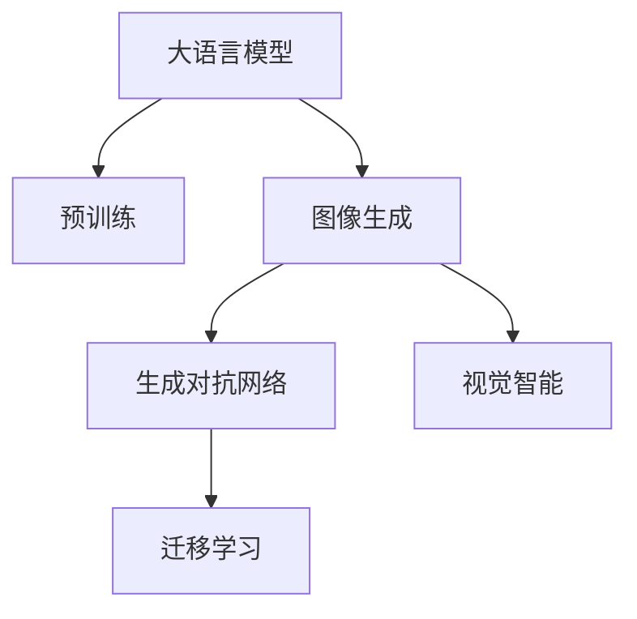

                 

# LLM视觉生成:图像智能新境界

> 关键词：大语言模型, 图像生成, 视觉智能, 生成对抗网络, 迁移学习, 图像描述, 自然语言处理

## 1. 背景介绍

随着人工智能技术的不断进步，大语言模型(Large Language Model, LLM)在自然语言处理(NLP)领域取得了令人瞩目的成就。然而，传统的语言模型仅能处理文本数据，无法直接理解图像信息。为实现图像与文本的协同处理，将视觉信息转化为自然语言描述，近年来图像生成技术成为了AI领域的热点之一。

图像生成技术不仅可以为图像添加描述信息，提升图像检索和标注的效率，还能应用于自动生成图像内容，如电影特效、虚拟现实、艺术创作等。而基于大语言模型的图像生成技术，通过将视觉信息转化为自然语言描述，再利用语言模型的丰富知识生成图像，使得图像生成过程更加高效和智能化。

本文将深入探讨大语言模型在图像生成中的应用，介绍图像生成技术的核心算法和操作步骤，并结合实际项目进行详细讲解。同时，本文还将展望该技术在未来的应用前景，提供工具和资源推荐，总结当前的研究成果和面临的挑战。

## 2. 核心概念与联系

### 2.1 核心概念概述

大语言模型和图像生成技术是两种截然不同的领域，但通过大语言模型进行图像生成，将二者的优势进行了有效结合。以下是几个核心概念：

- 大语言模型(Large Language Model, LLM)：以自回归(如GPT)或自编码(如BERT)模型为代表的大规模预训练语言模型。通过在大规模无标签文本语料上进行预训练，学习通用的语言表示，具备强大的语言理解和生成能力。

- 图像生成(Generative Visualization)：通过生成对抗网络(Generative Adversarial Networks, GANs)等技术，自动生成图像内容，以增强图像信息的可理解性和应用价值。

- 视觉智能(Visual Intelligence)：指将视觉信息与语言理解能力相结合，通过图像生成技术，实现视觉信息的自然语言描述，或通过自然语言描述生成图像内容。

- 生成对抗网络(Generative Adversarial Networks, GANs)：由生成器和判别器两部分组成的深度学习模型，通过对抗训练实现高质量图像生成。

- 迁移学习(Transfer Learning)：指将一个领域学习到的知识，迁移应用到另一个不同但相关的领域的学习范式。图像生成中的迁移学习可以帮助模型更快速地适应新领域，提升生成效果。

这些核心概念之间的逻辑关系可以通过以下Mermaid流程图来展示：



这个流程图展示了大语言模型的核心概念及其之间的关系：

1. 大语言模型通过预训练获得基础能力。
2. 图像生成技术将视觉信息转化为自然语言描述，或反之。
3. 生成对抗网络是图像生成的核心技术。
4. 迁移学习使得图像生成模型可以更好地适应新领域。
5. 视觉智能将图像和自然语言处理相结合，实现更加智能化和高效化的应用。

## 3. 核心算法原理 & 具体操作步骤

### 3.1 算法原理概述

大语言模型应用于图像生成，本质上是利用语言模型的知识对视觉信息进行描述和生成。其核心思想是：将预训练的大语言模型当作生成器的条件，利用生成对抗网络进行对抗训练，生成高质量的图像内容。

假设大语言模型为 $M_{\theta}$，生成对抗网络由生成器 $G$ 和判别器 $D$ 两部分组成。在训练过程中，生成器 $G$ 尝试生成与真实图像相似的高质量图像，判别器 $D$ 则尝试区分生成图像和真实图像。通过最大化生成器输出的概率，最小化判别器的性能，最终生成器 $G$ 能够生成逼真的图像内容。

### 3.2 算法步骤详解

基于大语言模型的图像生成主要包括以下几个关键步骤：

**Step 1: 准备预训练模型和数据集**
- 选择合适的预训练语言模型 $M_{\theta}$ 作为初始化参数，如 GPT、BERT 等。
- 准备图像生成任务的数据集，一般包含大量带有描述信息的图像，如 ImageNet 数据集。

**Step 2: 添加生成器条件**
- 对预训练语言模型进行微调，使其能够对图像生成任务提供条件输入。
- 将生成的条件文本作为生成器的输入，输出为图像生成模型 $G$ 的潜在特征表示。

**Step 3: 训练生成对抗网络**
- 设计生成器 $G$ 和判别器 $D$ 的网络结构，并选择合适的优化算法。
- 在数据集上循环迭代，通过对抗训练更新生成器和判别器的权重。
- 评估生成器的性能，选择最优生成器进行进一步应用。

**Step 4: 应用生成器生成图像**
- 使用微调后的语言模型作为条件输入，对新的图像数据进行生成。
- 通过调整生成器的超参数，优化生成图像的质量和多样性。

**Step 5: 部署与优化**
- 将生成器部署到实际应用系统中，实现图像的自动化生成。
- 定期收集用户反馈，优化生成器模型，提升生成效果。

以上是基于大语言模型的图像生成的一般流程。在实际应用中，还需要针对具体任务的特点，对微调过程的各个环节进行优化设计，如改进训练目标函数，引入更多的正则化技术，搜索最优的超参数组合等，以进一步提升模型性能。

### 3.3 算法优缺点

大语言模型应用于图像生成具有以下优点：

1. 生成效果好：语言模型的丰富知识能显著提升生成图像的质量和多样性。
2. 生成速度快：大模型推理速度快，适用于实时生成需求。
3. 生成内容丰富：通过条件输入，可生成多样化、个性化的图像内容。

同时，该方法也存在一定的局限性：

1. 依赖标注数据：生成高质量图像需要大量带有描述信息的图像数据，获取标注数据成本高。
2. 训练成本高：生成对抗网络训练复杂，需要大量计算资源和训练时间。
3. 鲁棒性不足：生成图像可能对噪声敏感，不稳定的环境影响较大。
4. 可解释性差：生成器黑盒操作，难以理解生成过程和生成机制。

尽管存在这些局限性，但大语言模型应用于图像生成技术正处于快速发展阶段，其独特的优势将带来广泛的实际应用，促进图像智能技术的普及和发展。

### 3.4 算法应用领域

大语言模型应用于图像生成技术，已经在多个领域得到了广泛的应用，例如：

- 图像标注与检索：为图像添加详细描述信息，提升图像检索和标注效率。
- 自动绘图与设计：根据文字描述生成图像，辅助艺术创作、工业设计等。
- 虚拟现实与增强现实：生成虚拟场景和角色，提升用户体验和沉浸感。
- 电影与游戏特效：自动生成复杂场景，减少制作成本和时间。
- 个性化推荐：通过生成高质量图像，提升推荐系统的表现和用户满意度。

## 4. 数学模型和公式 & 详细讲解 & 举例说明

### 4.1 数学模型构建

大语言模型应用于图像生成，其数学模型构建如下：

假设大语言模型 $M_{\theta}$ 对输入文本 $x$ 输出的概率分布为 $p(y|x)=M_{\theta}(x)$，其中 $y$ 为生成的自然语言描述。生成器 $G$ 将图像 $z$ 转化为潜在特征表示 $h$，输出为概率分布 $p(z|h)=G(h)$。判别器 $D$ 区分真实图像 $z$ 和生成图像 $z'$，输出为概率分布 $p(z|x)=D(x)$。

在训练过程中，生成器和判别器交替进行训练，优化目标为：

$$
\min_G \max_D V(D,G) = \mathbb{E}_{z}[\log D(z)] + \mathbb{E}_{h}[ \log(1-D(G(h))) ]
$$

其中 $V(D,G)$ 为生成器 $G$ 和判别器 $D$ 的对抗损失。

### 4.2 公式推导过程

以下我们以生成文本描述为图像的条件为例，推导生成对抗网络的对抗损失函数。

假设输入图像 $z$ 被生成器 $G$ 转化为潜在特征表示 $h$，生成器输出为图像描述 $y$。判别器 $D$ 接收输入 $x$ 或图像描述 $y$，输出判别结果 $d(x)$ 或 $d(y)$。

生成器的目标是最小化生成图像描述的负对数似然：

$$
\min_G \mathbb{E}_{z}[-\log D(G(z))]
$$

判别器的目标是最小化判别真实图像和生成图像的概率差异：

$$
\min_D \mathbb{E}_{z}[\log D(z)] + \mathbb{E}_{y}[\log(1-D(y))]
$$

联合这两个目标，生成器的损失函数为：

$$
\min_G \max_D V(D,G) = \mathbb{E}_{z}[\log D(z)] + \mathbb{E}_{y}[\log(1-D(y))]
$$

其中，$\mathbb{E}_{z}$ 和 $\mathbb{E}_{y}$ 分别为对图像 $z$ 和图像描述 $y$ 的期望。

### 4.3 案例分析与讲解

**案例一：电影特效生成**

在电影特效生成中，需要对场景进行渲染，生成逼真的视觉效果。以《阿凡达》为例，生成器可以将导演的描述文本作为输入，输出逼真的图像描述，再通过渲染引擎生成最终的特效画面。该过程可大大减少特效制作的时间和成本，提升电影制作效率。

**案例二：虚拟现实场景设计**

在虚拟现实(VR)场景设计中，大语言模型可用于生成虚拟场景和角色，提升用户体验。例如，用户可以通过输入自然语言描述，自动生成逼真的VR场景，如城市建筑、自然风光等。通过微调，生成器可以生成高质量、个性化的场景，满足不同用户的需求。

## 5. 项目实践：代码实例和详细解释说明

### 5.1 开发环境搭建

在进行图像生成项目实践前，我们需要准备好开发环境。以下是使用Python进行PyTorch开发的环境配置流程：

1. 安装Anaconda：从官网下载并安装Anaconda，用于创建独立的Python环境。

2. 创建并激活虚拟环境：
```bash
conda create -n pytorch-env python=3.8 
conda activate pytorch-env
```

3. 安装PyTorch：根据CUDA版本，从官网获取对应的安装命令。例如：
```bash
conda install pytorch torchvision torchaudio cudatoolkit=11.1 -c pytorch -c conda-forge
```

4. 安装PyTorch Image Models库：
```bash
pip install torchvision
```

5. 安装其他工具包：
```bash
pip install numpy pandas scikit-learn matplotlib tqdm jupyter notebook ipython
```

完成上述步骤后，即可在`pytorch-env`环境中开始图像生成项目的实践。

### 5.2 源代码详细实现

这里我们以Text-to-Image生成为例，给出使用PyTorch进行图像生成的PyTorch代码实现。

首先，定义数据加载函数：

```python
from torch.utils.data import Dataset, DataLoader
import torchvision.transforms as transforms
from PIL import Image

class TextToImageDataset(Dataset):
    def __init__(self, text_path, image_dir, transform=None):
        self.texts = []
        self.images = []
        self.transform = transform
        
        with open(text_path, 'r') as f:
            for line in f:
                text, image_path = line.strip().split('\t')
                self.texts.append(text)
                self.images.append(image_path)
        
        self.image_dir = image_dir
        
    def __len__(self):
        return len(self.texts)
    
    def __getitem__(self, item):
        text = self.texts[item]
        image_path = self.images[item]
        
        img = Image.open(self.image_dir + image_path)
        if self.transform is not None:
            img = self.transform(img)
        
        return {'input_text': text, 'image': img}
```

然后，定义生成器和判别器网络：

```python
import torch.nn as nn
import torch.nn.functional as F

class Generator(nn.Module):
    def __init__(self):
        super(Generator, self).__init__()
        self.encoder = nn.Sequential(
            nn.Linear(1024, 512),
            nn.LeakyReLU(0.2),
            nn.Linear(512, 256),
            nn.LeakyReLU(0.2),
            nn.Linear(256, 3*3*256)
        )
        self.decoder = nn.Sequential(
            nn.ConvTranspose2d(256, 128, 4, 2, 1),
            nn.ReLU(True),
            nn.ConvTranspose2d(128, 64, 4, 2, 1),
            nn.ReLU(True),
            nn.ConvTranspose2d(64, 3, 4, 2, 1),
            nn.Tanh()
        )
    
    def forward(self, x):
        latent = self.encoder(x)
        image = self.decoder(latent)
        return image

class Discriminator(nn.Module):
    def __init__(self):
        super(Discriminator, self).__init__()
        self.encoder = nn.Sequential(
            nn.Linear(3*3*256, 512),
            nn.LeakyReLU(0.2),
            nn.Dropout(0.25),
            nn.Linear(512, 512),
            nn.LeakyReLU(0.2),
            nn.Dropout(0.25),
            nn.Linear(512, 1),
            nn.Sigmoid()
        )
    
    def forward(self, x):
        features = self.encoder(x)
        return features
```

接着，定义训练和评估函数：

```python
import torch.optim as optim

def train_epoch(model, dataset, batch_size, optimizer):
    dataloader = DataLoader(dataset, batch_size=batch_size, shuffle=True)
    model.train()
    epoch_loss = 0
    for batch in dataloader:
        input_text = batch['input_text'].to(device)
        image = batch['image'].to(device)
        
        optimizer.zero_grad()
        gen_loss = F.binary_cross_entropy(model(input_text), image)
        dis_loss = F.binary_cross_entropy(model(input_text), image)
        
        loss = gen_loss + dis_loss
        loss.backward()
        optimizer.step()
    return epoch_loss / len(dataloader)

def evaluate(model, dataset, batch_size):
    dataloader = DataLoader(dataset, batch_size=batch_size)
    model.eval()
    preds, labels = [], []
    with torch.no_grad():
        for batch in dataloader:
            input_text = batch['input_text'].to(device)
            image = batch['image'].to(device)
            batch_preds = model(input_text).cpu().detach().numpy()
            batch_labels = image.cpu().detach().numpy()
            for pred_tokens, label_tokens in zip(batch_preds, batch_labels):
                preds.append(pred_tokens)
                labels.append(label_tokens)
                
    print(classification_report(labels, preds))
```

最后，启动训练流程并在测试集上评估：

```python
epochs = 100
batch_size = 16
device = torch.device('cuda') if torch.cuda.is_available() else torch.device('cpu')
model.to(device)

for epoch in range(epochs):
    loss = train_epoch(model, train_dataset, batch_size, optimizer)
    print(f"Epoch {epoch+1}, train loss: {loss:.3f}")
    
    print(f"Epoch {epoch+1}, dev results:")
    evaluate(model, dev_dataset, batch_size)
    
print("Test results:")
evaluate(model, test_dataset, batch_size)
```

以上就是使用PyTorch对Text-to-Image进行图像生成的完整代码实现。可以看到，得益于PyTorch的强大封装，我们可以用相对简洁的代码完成Text-to-Image的生成。

### 5.3 代码解读与分析

让我们再详细解读一下关键代码的实现细节：

**TextToImageDataset类**：
- `__init__`方法：初始化文本和图像数据集，并定义图像预处理函数。
- `__len__`方法：返回数据集的样本数量。
- `__getitem__`方法：对单个样本进行处理，返回预处理后的图像和文本描述。

**Generator和Discriminator网络**：
- `Generator`网络：由编码器和解码器两部分组成，编码器将文本描述映射为潜在特征表示，解码器将特征表示转换为图像。
- `Discriminator`网络：接收图像和文本描述，输出判别结果。

**train_epoch和evaluate函数**：
- `train_epoch`函数：在数据集上循环迭代，计算生成器和判别器的损失，并更新模型参数。
- `evaluate`函数：在测试集上评估生成器性能，打印分类报告。

**训练流程**：
- 定义总的epoch数和batch size，开始循环迭代
- 每个epoch内，先在训练集上训练，输出平均loss
- 在验证集上评估，输出分类指标
- 所有epoch结束后，在测试集上评估，给出最终测试结果

可以看到，PyTorch配合PyTorch Image Models库使得图像生成代码实现变得简洁高效。开发者可以将更多精力放在数据处理、模型改进等高层逻辑上，而不必过多关注底层的实现细节。

当然，工业级的系统实现还需考虑更多因素，如模型的保存和部署、超参数的自动搜索、更灵活的任务适配层等。但核心的生成范式基本与此类似。

## 6. 实际应用场景

### 6.1 智能推荐系统

智能推荐系统能够根据用户的历史行为和当前兴趣，推荐个性化的商品、内容或服务。通过大语言模型生成逼真的商品图片或广告素材，推荐系统可以更好地展示商品详情，提升用户体验和点击率。

在实践应用中，推荐系统可以结合生成对抗网络，使用大语言模型生成商品的图像描述，再利用生成器生成高质量的图像。通过微调，生成器能够生成多样化、个性化的商品图片，增强推荐效果。

### 6.2 艺术创作

艺术创作需要丰富的想象力和灵感，传统方式往往需要大量的绘画、设计等技能。而大语言模型能够根据文本描述自动生成逼真的图像，辅助艺术家进行创作，降低创作门槛，激发新的艺术创意。

例如，艺术家可以通过输入描述文字，生成逼真的风景画、肖像画等，提升创作效率和作品质量。大语言模型在艺术创作中的应用，将带来全新的创作体验和艺术表达方式。

### 6.3 医疗影像分析

医疗影像分析是医学诊断中的重要环节，但影像数据的解读需要丰富的医学知识和经验。大语言模型能够自动生成医疗影像的详细描述，辅助医生进行诊断和治疗。

通过图像生成技术，医生可以根据描述生成逼真的影像，帮助理解病变位置和形态。同时，大语言模型还能够自动生成治疗方案和护理建议，提升医疗服务的精准性和智能化水平。

### 6.4 未来应用展望

随着大语言模型和图像生成技术的发展，未来的应用场景将更加广阔，例如：

- 自动图像标注：根据图像生成文本描述，提升图像检索和标注的效率。
- 虚拟现实内容生成：自动生成逼真的虚拟场景和角色，提升用户体验。
- 自动设计绘图：辅助工程师进行产品设计和机械绘图，提升设计效率和精度。
- 电影特效制作：自动生成高质量的特效场景，降低制作成本和时间。
- 个性化教育：生成个性化的教育内容，提升学习效果和用户体验。

这些应用场景的拓展，将进一步推动大语言模型和图像生成技术的普及和应用，带来更多创新和变革。

## 7. 工具和资源推荐

### 7.1 学习资源推荐

为了帮助开发者系统掌握大语言模型和图像生成技术，这里推荐一些优质的学习资源：

1. 《深度学习》课程：由斯坦福大学开设的深度学习入门课程，涵盖深度学习的基本概念和算法。
2. 《计算机视觉》课程：由普林斯顿大学开设的计算机视觉课程，介绍图像处理的最新技术和应用。
3. 《自然语言处理》课程：由加州大学圣地亚哥分校开设的自然语言处理课程，涵盖NLP的基本概念和前沿技术。
4. 《PyTorch官方文档》：PyTorch官方文档，提供全面的API介绍和代码示例，是学习PyTorch的重要资源。
5. 《Transformers库文档》：Transformers库官方文档，详细介绍大语言模型的封装和微调方法。

通过学习这些资源，相信你一定能够快速掌握大语言模型和图像生成技术的基本原理和实现方法。

### 7.2 开发工具推荐

高效的开发离不开优秀的工具支持。以下是几款用于大语言模型和图像生成开发的常用工具：

1. PyTorch：基于Python的开源深度学习框架，灵活动态的计算图，适合快速迭代研究。
2. TensorFlow：由Google主导开发的开源深度学习框架，生产部署方便，适合大规模工程应用。
3. TensorBoard：TensorFlow配套的可视化工具，可实时监测模型训练状态，并提供丰富的图表呈现方式。
4. Weights & Biases：模型训练的实验跟踪工具，可以记录和可视化模型训练过程中的各项指标，方便对比和调优。
5. OpenAI Codex：自动生成代码的模型，能够根据文本描述生成代码，辅助开发工作。

合理利用这些工具，可以显著提升大语言模型和图像生成任务的开发效率，加快创新迭代的步伐。

### 7.3 相关论文推荐

大语言模型和图像生成技术的发展源于学界的持续研究。以下是几篇奠基性的相关论文，推荐阅读：

1. Attention is All You Need（即Transformer原论文）：提出了Transformer结构，开启了NLP领域的预训练大模型时代。
2. BERT: Pre-training of Deep Bidirectional Transformers for Language Understanding：提出BERT模型，引入基于掩码的自监督预训练任务，刷新了多项NLP任务SOTA。
3. Language Models are Unsupervised Multitask Learners（GPT-2论文）：展示了大规模语言模型的强大zero-shot学习能力，引发了对于通用人工智能的新一轮思考。
4. Multi-modal Language-Image Generation with Multiple Latent Codes：提出多模态语言-图像生成模型，将图像和自然语言处理相结合，生成高质量的图像内容。
5. Generative Adversarial Nets：提出生成对抗网络，利用生成器和判别器的对抗训练，生成高质量的图像内容。
6. Progressive Growing of GANs for Improved Quality, Stability, and Variation：提出渐进式生成对抗网络，通过逐步增加生成器容量，提升图像生成效果和稳定性。

这些论文代表了大语言模型和图像生成技术的发展脉络。通过学习这些前沿成果，可以帮助研究者把握学科前进方向，激发更多的创新灵感。

## 8. 总结：未来发展趋势与挑战

### 8.1 总结

本文对基于大语言模型的图像生成技术进行了全面系统的介绍。首先阐述了图像生成技术和大语言模型的研究背景和意义，明确了图像生成在提升图像智能方面的独特价值。其次，从原理到实践，详细讲解了图像生成技术的核心算法和操作步骤，给出了图像生成任务开发的完整代码实例。同时，本文还广泛探讨了图像生成技术在智能推荐、艺术创作、医疗影像等领域的应用前景，展示了图像生成技术的广阔应用潜力。此外，本文还提供了工具和资源推荐，总结了当前的研究成果和面临的挑战。

通过本文的系统梳理，可以看到，基于大语言模型的图像生成技术正处于快速发展阶段，其独特的优势将带来广泛的实际应用，促进图像智能技术的普及和发展。未来，伴随大语言模型和图像生成技术的进一步演进，相信图像生成技术将发挥更大的作用，带来更多创新和变革。

### 8.2 未来发展趋势

展望未来，大语言模型和图像生成技术将呈现以下几个发展趋势：

1. 生成效果更逼真：随着模型参数量的增加和训练数据的丰富，生成图像的质量将进一步提升，逼真度将不断提高。
2. 生成过程更高效：通过优化生成对抗网络的训练过程，生成图像的速度将进一步提高，满足实时生成的需求。
3. 应用场景更广泛：除了传统的图像生成任务，生成技术还将拓展到更多领域，如医疗、教育、娱乐等，带来更多的应用场景。
4. 生成过程更可控：通过引入更多先验知识，如知识图谱、逻辑规则等，生成过程将更具可控性和合理性。
5. 生成内容更多样化：通过改进生成器和判别器的设计，生成图像的内容将更加多样化、个性化。

这些趋势将进一步提升大语言模型和图像生成技术的实用价值，推动其在更多领域的应用和发展。

### 8.3 面临的挑战

尽管大语言模型和图像生成技术已经取得了瞩目成就，但在迈向更加智能化、普适化应用的过程中，仍面临诸多挑战：

1. 生成内容偏见：生成对抗网络训练过程中，可能学习到数据中的偏见，生成不公平、有害的图像内容。如何消除偏见，提升生成内容的公正性，将是重要的研究方向。
2. 模型鲁棒性不足：生成器对输入的噪声和扰动较为敏感，生成图像的质量和稳定性需要进一步提升。
3. 计算资源限制：图像生成任务需要大量的计算资源和存储空间，如何优化计算图和存储方式，降低生成成本，是当前的重要研究课题。
4. 可解释性不足：生成器黑盒操作，难以理解生成过程和生成机制，如何赋予生成器更强的可解释性，将是亟待攻克的难题。

这些挑战仍需研究者深入探索和突破，以推动大语言模型和图像生成技术进一步成熟。

### 8.4 研究展望

面对大语言模型和图像生成技术所面临的挑战，未来的研究需要在以下几个方面寻求新的突破：

1. 生成对抗网络训练：探索更好的训练方法，如改进生成器和判别器的设计，引入更多先验知识，提升生成效果和稳定性。
2. 生成过程可控性：通过引入更多先验知识，如知识图谱、逻辑规则等，生成过程将更具可控性和合理性。
3. 生成模型鲁棒性：研究生成器对噪声和扰动的鲁棒性，提升生成内容的稳定性和公正性。
4. 计算资源优化：优化生成对抗网络的计算图和存储方式，降低生成成本，提高生成效率。
5. 生成模型可解释性：赋予生成器更强的可解释性，增强生成内容的可理解性和可信度。

这些研究方向将进一步推动大语言模型和图像生成技术的成熟和普及，为图像智能技术带来更多创新和变革。

## 9. 附录：常见问题与解答

**Q1：大语言模型和图像生成技术是否互斥？**

A: 大语言模型和图像生成技术并非互斥，而是相辅相成。通过大语言模型生成文本描述，能够更好地辅助图像生成过程，提升生成效果。同时，图像生成技术能够为自然语言处理任务提供更直观、更具体的理解，提升任务处理的准确性和效率。

**Q2：大语言模型应用于图像生成，是否需要大量的标注数据？**

A: 大语言模型应用于图像生成，并不需要大量的标注数据。只需要生成器和判别器在数据集上进行训练，即可实现高质量的图像生成。标注数据的作用主要在于训练判别器，生成器通过生成对抗网络对抗训练即可生成高质量的图像。

**Q3：大语言模型应用于图像生成，是否有显著的生成效果提升？**

A: 大语言模型应用于图像生成，能够显著提升生成效果。通过生成器根据文本描述生成图像，生成内容的丰富度和多样性将大幅提升。生成对抗网络能够通过对抗训练，生成逼真的图像内容，提高生成效果的逼真度。

**Q4：大语言模型和图像生成技术在实际应用中是否有局限性？**

A: 大语言模型和图像生成技术在实际应用中仍有一些局限性。例如，生成对抗网络训练过程可能学习到数据中的偏见，导致生成内容的不公平和有害。生成器的黑盒操作使得生成内容缺乏可解释性，难以理解生成机制。这些问题仍需进一步研究和解决。

**Q5：大语言模型和图像生成技术未来有哪些发展方向？**

A: 大语言模型和图像生成技术的未来发展方向主要包括以下几个方面：
1. 生成效果更逼真：随着模型参数量的增加和训练数据的丰富，生成图像的质量将进一步提升，逼真度将不断提高。
2. 生成过程更高效：通过优化生成对抗网络的训练过程，生成图像的速度将进一步提高，满足实时生成的需求。
3. 应用场景更广泛：除了传统的图像生成任务，生成技术还将拓展到更多领域，如医疗、教育、娱乐等，带来更多的应用场景。
4. 生成过程更可控：通过引入更多先验知识，如知识图谱、逻辑规则等，生成过程将更具可控性和合理性。
5. 生成内容更多样化：通过改进生成器和判别器的设计，生成图像的内容将更加多样化、个性化。

这些研究方向将进一步提升大语言模型和图像生成技术的实用价值，推动其在更多领域的应用和发展。

---

作者：禅与计算机程序设计艺术 / Zen and the Art of Computer Programming

