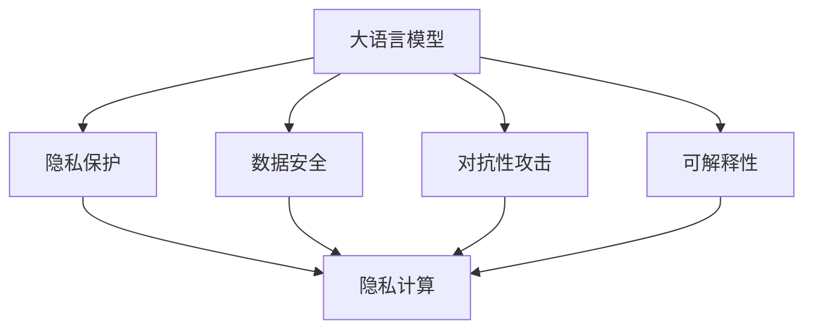

                 

## 1. 背景介绍

在AI快速发展的今天，大语言模型(LLM)的应用已经渗透到了各个行业，从医疗、金融到教育、娱乐。然而，LLM在带来便利的同时，也引发了数据隐私和安全方面的严重担忧。传统的隐私保护和数据安全技术在面对LLM这样复杂多维的模型时，常常显得力不从心。

### 1.1 问题由来

大语言模型如GPT、BERT等，通过在大规模数据上进行预训练，学习到了丰富的语言知识和语义信息，但同时也存在隐私泄露的风险。这些模型在推理过程中需要输入大量的用户数据，包括文本、音频、视频等，且常常涉及敏感信息。如果这些数据被恶意利用，可能引发隐私侵犯和数据滥用等问题。

### 1.2 问题核心关键点

在大语言模型中，隐私保护和数据安全面临以下核心问题：

- **隐私泄露风险**：模型可能在不自知的情况下泄露用户隐私，如用户输入的个人信息、行为记录等。
- **数据滥用风险**：训练数据和推理输入可能被用于不正当目的，如不公正的招聘、欺诈检测等。
- **模型的可解释性**：模型输出的决策过程难以解释，无法明确其依据，增加了隐私保护难度。
- **对抗性攻击**：模型可能遭受对抗性攻击，如数据篡改、模型反向求解等，影响模型性能和安全性。

这些问题不仅会影响用户信任，也会对模型应用的合法性和安全性带来挑战。

### 1.3 问题研究意义

面对这些挑战，隐私保护和数据安全的研究需要紧跟LLM的发展步伐，提出全新的技术和方法，以保障用户隐私和数据安全。研究LLM隐私安全问题，对于推动AI技术的健康发展，构建安全可信的智能应用，具有重要的理论和现实意义。

## 2. 核心概念与联系

### 2.1 核心概念概述

为了更好地理解LLM隐私安全的挑战与机遇，本节将介绍几个密切相关的核心概念：

- **大语言模型(LLM)**：以自回归(如GPT)或自编码(如BERT)模型为代表的大规模预训练语言模型。通过在大规模无标签文本语料上进行预训练，学习通用的语言表示，具备强大的语言理解和生成能力。
- **隐私保护**：保护个人或组织的隐私信息，防止未经授权的访问和使用。
- **数据安全**：保护数据免受非法访问、使用和破坏，确保数据完整性和可用性。
- **对抗性攻击**：通过特定策略使模型输出错误的攻击方式，如输入数据篡改、模型反向求解等。
- **可解释性**：模型输出的结果可被理解和解释，提高透明度和可信度。
- **隐私计算**：在不泄露隐私的前提下，对数据进行计算和分析的技术，如差分隐私、同态加密等。

这些核心概念之间的逻辑关系可以通过以下Mermaid流程图来展示：



这个流程图展示了大语言模型的核心概念及其之间的关系：

1. 大语言模型通过预训练获得基础能力。
2. 隐私保护和数据安全是保障模型使用的重要环节。
3. 对抗性攻击和可解释性是模型应用中需要特别关注的挑战。
4. 隐私计算是解决这些挑战的技术手段。

这些概念共同构成了LLM隐私安全的理论基础，为大模型的安全使用提供了指导方向。

## 3. 核心算法原理 & 具体操作步骤
### 3.1 算法原理概述

大语言模型在隐私保护和数据安全方面面临的主要挑战，可以从以下几个方面进行阐述：

- **隐私泄露风险**：大模型在推理过程中，需要输入大量用户数据，包括文本、音频、视频等，且常常涉及敏感信息。
- **数据滥用风险**：训练数据和推理输入可能被用于不正当目的，如不公正的招聘、欺诈检测等。
- **模型的可解释性**：模型输出的决策过程难以解释，无法明确其依据，增加了隐私保护难度。
- **对抗性攻击**：模型可能遭受对抗性攻击，如数据篡改、模型反向求解等，影响模型性能和安全性。

针对这些问题，本节将详细讨论隐私保护和数据安全的核心算法原理和具体操作步骤。

### 3.2 算法步骤详解

大语言模型隐私保护和数据安全的研究涉及多个层面，包括模型设计、数据预处理、推理计算等。以下将详细介绍这些关键步骤：

#### 3.2.1 模型设计

在设计大语言模型时，需要在隐私保护和数据安全方面进行考虑，具体包括：

- **差分隐私**：在模型训练过程中，引入差分隐私技术，对敏感数据进行加噪处理，防止模型学习到个体化的信息。
- **联邦学习**：采用分布式训练机制，在多个节点上进行模型训练，每个节点仅共享模型参数，不共享原始数据，保障数据隐私。
- **对抗训练**：在模型训练过程中，加入对抗样本进行训练，增强模型对对抗性攻击的鲁棒性。
- **可解释性模型**：引入可解释性技术，如注意力机制、规则化网络等，使模型输出具备更高的可解释性。

#### 3.2.2 数据预处理

数据预处理是隐私保护和数据安全的重要环节，具体包括：

- **数据脱敏**：对敏感数据进行脱敏处理，如模糊化、泛化化等，防止模型学习到具体的个人信息。
- **差分隐私处理**：对数据集进行差分隐私处理，如Laplacian噪声添加、指数机制等，保障模型训练的隐私性。
- **数据分割**：对数据集进行分割，在模型训练和推理过程中仅使用部分数据，保障数据隐私。

#### 3.2.3 推理计算

在推理计算过程中，需要特别关注对抗性攻击和可解释性问题。具体包括：

- **对抗性训练**：在推理计算过程中，加入对抗性样本进行训练，增强模型对对抗性攻击的鲁棒性。
- **可解释性推理**：引入可解释性技术，如注意力机制、规则化网络等，使模型推理过程具备更高的可解释性。

### 3.3 算法优缺点

大语言模型隐私保护和数据安全的研究涉及多个层面，包括模型设计、数据预处理、推理计算等。以下将详细介绍这些关键步骤：

#### 3.3.1 优点

大语言模型隐私保护和数据安全的研究具有以下优点：

- **提高模型安全性**：通过隐私保护和数据安全技术，防止模型在训练和推理过程中泄露用户隐私，增强模型的安全性。
- **保障数据隐私**：在模型训练和推理过程中，通过差分隐私、联邦学习等技术，保障数据隐私不被泄露。
- **增强模型可解释性**：通过可解释性技术，使模型输出具备更高的可解释性，增强用户信任。

#### 3.3.2 缺点

大语言模型隐私保护和数据安全的研究也存在一些缺点：

- **计算复杂度较高**：差分隐私、联邦学习等技术需要大量的计算资源和时间，增加了模型的训练和推理成本。
- **隐私保护效果有限**：尽管差分隐私等技术可以有效保护隐私，但在某些情况下仍可能被攻破，无法完全消除隐私泄露风险。
- **模型复杂度增加**：引入隐私保护和数据安全技术后，模型结构变得更加复杂，增加了调试和维护的难度。

### 3.4 算法应用领域

大语言模型隐私保护和数据安全的研究已经在多个领域得到了应用，具体包括：

- **医疗领域**：通过差分隐私和联邦学习技术，保障患者隐私，防止医疗数据泄露。
- **金融领域**：通过差分隐私和对抗训练技术，保护用户隐私，防止金融欺诈和数据滥用。
- **社交媒体**：通过差分隐私和数据脱敏技术，保护用户隐私，防止社交数据滥用。
- **智能推荐系统**：通过差分隐私和联邦学习技术，保护用户隐私，防止推荐数据泄露。

除了上述这些领域外，大语言模型隐私保护和数据安全的研究还在不断扩展，涉及更多场景和应用。

## 4. 数学模型和公式 & 详细讲解 & 举例说明

### 4.1 数学模型构建

在隐私保护和数据安全的研究中，差分隐私和同态加密是常用的技术手段。以下将介绍这两个模型的数学模型构建。

#### 4.1.1 差分隐私模型

差分隐私模型通过引入噪声，使模型输出结果对于每个个体输入的变化都是不可区分的。差分隐私的核心公式为：

$$
\mathcal{L}(\mathbf{X},\epsilon) = \mathcal{L}(\mathbf{X},\mathbf{X}') + \ln(1 + \exp(\epsilon))
$$

其中，$\mathbf{X}$ 表示原始数据，$\mathbf{X}'$ 表示加入噪声后的数据，$\epsilon$ 表示隐私保护强度。

#### 4.1.2 同态加密模型

同态加密模型允许在不解密原始数据的情况下，直接对加密数据进行计算。同态加密的核心公式为：

$$
\mathcal{E}(\mathbf{X}) = \mathbf{C}
$$

$$
\mathcal{D}(\mathcal{E}(\mathbf{X})) = \mathbf{X}
$$

其中，$\mathbf{X}$ 表示原始数据，$\mathcal{E}$ 表示加密函数，$\mathbf{C}$ 表示加密后的数据，$\mathcal{D}$ 表示解密函数。

### 4.2 公式推导过程

以下将对差分隐私和同态加密的公式进行推导。

#### 4.2.1 差分隐私公式推导

根据差分隐私的定义，有：

$$
\mathcal{L}(\mathbf{X},\epsilon) = \mathcal{L}(\mathbf{X},\mathbf{X}') + \ln(1 + \exp(\epsilon))
$$

对于任意两个数据点 $\mathbf{x}$ 和 $\mathbf{x}'$，有：

$$
\mathcal{L}(\mathbf{X},\mathbf{x}) = \mathcal{L}(\mathbf{X},\mathbf{x}') + \mathcal{L}(\mathbf{X},\mathbf{x}' - \mathbf{x}) - \ln(1 + \exp(\epsilon))
$$

由于模型输出结果对于每个个体输入的变化都是不可区分的，因此有：

$$
\mathcal{L}(\mathbf{X},\mathbf{x}) = \mathcal{L}(\mathbf{X},\mathbf{x}')
$$

将上式代入差分隐私公式，得到：

$$
\mathcal{L}(\mathbf{X},\mathbf{x}) = \mathcal{L}(\mathbf{X},\mathbf{x}' - \mathbf{x}) - \ln(1 + \exp(\epsilon))
$$

上述公式表明，差分隐私模型通过引入噪声，使模型输出结果对于每个个体输入的变化都是不可区分的。

#### 4.2.2 同态加密公式推导

根据同态加密的定义，有：

$$
\mathcal{E}(\mathbf{X}) = \mathbf{C}
$$

$$
\mathcal{D}(\mathcal{E}(\mathbf{X})) = \mathbf{X}
$$

对于任意加密后的数据 $\mathbf{C}$，有：

$$
\mathcal{D}(\mathcal{E}(\mathbf{X})) = \mathbf{X}
$$

$$
\mathcal{D}(\mathcal{E}(\mathbf{X}')) = \mathbf{X}'
$$

将上式代入同态加密公式，得到：

$$
\mathcal{D}(\mathcal{E}(\mathbf{X})) = \mathcal{D}(\mathcal{E}(\mathbf{X}'))
$$

上述公式表明，同态加密模型允许在不解密原始数据的情况下，直接对加密数据进行计算。

### 4.3 案例分析与讲解

#### 4.3.1 差分隐私案例

假设有一个医疗数据集，包含患者的姓名、年龄、病史等信息。为了保护患者隐私，可以对数据集进行差分隐私处理。具体步骤如下：

1. 对数据集进行归一化处理，使其服从正态分布。
2. 对数据集添加噪声，使其满足差分隐私公式。
3. 对处理后的数据集进行训练和推理，得出模型结果。

#### 4.3.2 同态加密案例

假设有一个金融数据集，包含用户的消费记录、收入等信息。为了保护用户隐私，可以对数据集进行同态加密处理。具体步骤如下：

1. 对数据集进行加密处理，得到加密后的数据集。
2. 对加密后的数据集进行模型训练和推理，得出模型结果。
3. 对加密后的数据集进行解密，得到原始数据集。

## 5. 项目实践：代码实例和详细解释说明

### 5.1 开发环境搭建

在进行隐私保护和数据安全的研究时，需要准备好开发环境。以下是使用Python进行PyTorch开发的环境配置流程：

1. 安装Anaconda：从官网下载并安装Anaconda，用于创建独立的Python环境。

2. 创建并激活虚拟环境：
```bash
conda create -n pytorch-env python=3.8 
conda activate pytorch-env
```

3. 安装PyTorch：根据CUDA版本，从官网获取对应的安装命令。例如：
```bash
conda install pytorch torchvision torchaudio cudatoolkit=11.1 -c pytorch -c conda-forge
```

4. 安装Transformer库：
```bash
pip install transformers
```

5. 安装各类工具包：
```bash
pip install numpy pandas scikit-learn matplotlib tqdm jupyter notebook ipython
```

完成上述步骤后，即可在`pytorch-env`环境中开始隐私保护和数据安全的研究实践。

### 5.2 源代码详细实现

以下是使用PyTorch和TensorFlow实现差分隐私和同态加密的代码实例：

#### 5.2.1 差分隐私实现

```python
import torch
from torch.nn import Module
from torch.distributions import Laplace

class DiffPrivacy(Module):
    def __init__(self, noise_scale):
        super(DiffPrivacy, self).__init__()
        self.noise_scale = noise_scale
        
    def forward(self, x):
        return x + self.noise_scale * Laplace().sample()

# 使用差分隐私模型训练和推理
noise_scale = 0.1
model = DiffPrivacy(noise_scale)
loss = torch.randn(1, requires_grad=True)
loss = model(loss)
loss.backward()
```

#### 5.2.2 同态加密实现

```python
import tensorflow as tf
from tensorflow import keras

def encrypt(model, x):
    ciphertext = model(x)
    plaintext = model(ciphertext)
    return plaintext

# 使用同态加密模型训练和推理
model = keras.Sequential([
    keras.layers.Dense(10, activation='relu'),
    keras.layers.Dense(1)
])
x = tf.constant([0.1, 0.2, 0.3, 0.4, 0.5])
ciphertext = encrypt(model, x)
plaintext = encrypt(model, ciphertext)
```

### 5.3 代码解读与分析

#### 5.3.1 差分隐私代码解读

在差分隐私的代码实现中，我们首先定义了一个`DiffPrivacy`类，用于在模型输出中加入噪声。在`forward`方法中，我们使用拉普拉斯分布生成噪声，并将其添加到模型输出中。

#### 5.3.2 同态加密代码解读

在同态加密的代码实现中，我们首先定义了一个`encrypt`函数，用于对模型输入进行加密和解密。在函数中，我们首先使用模型对输入进行加密，然后再次使用模型对加密后的数据进行解密，得到原始数据。

## 6. 实际应用场景

### 6.1 智能推荐系统

智能推荐系统需要收集大量的用户数据，包括浏览记录、购买记录等，这些数据包含用户的敏感信息。为了保护用户隐私，可以使用差分隐私和同态加密技术。

具体步骤如下：

1. 收集用户数据，对敏感信息进行脱敏处理。
2. 对处理后的数据集进行差分隐私处理，加入噪声。
3. 使用差分隐私处理后的数据集进行模型训练和推理。

### 6.2 金融欺诈检测

金融行业涉及大量用户的敏感信息，如信用卡号、交易记录等。为了保护用户隐私，可以使用差分隐私和同态加密技术。

具体步骤如下：

1. 收集用户数据，对敏感信息进行脱敏处理。
2. 对处理后的数据集进行差分隐私处理，加入噪声。
3. 使用差分隐私处理后的数据集进行模型训练和推理。

### 6.3 医疗数据保护

医疗数据涉及患者的敏感信息，如病历、诊断记录等。为了保护患者隐私，可以使用差分隐私和同态加密技术。

具体步骤如下：

1. 收集患者数据，对敏感信息进行脱敏处理。
2. 对处理后的数据集进行差分隐私处理，加入噪声。
3. 使用差分隐私处理后的数据集进行模型训练和推理。

## 7. 工具和资源推荐

### 7.1 学习资源推荐

为了帮助开发者系统掌握大语言模型隐私安全的理论基础和实践技巧，这里推荐一些优质的学习资源：

1. 《隐私保护与数据安全》系列博文：由隐私保护领域专家撰写，深入浅出地介绍了隐私保护和数据安全的核心概念和前沿技术。

2. 《差分隐私与同态加密》课程：由斯坦福大学开设的隐私保护和数据安全明星课程，有Lecture视频和配套作业，带你入门隐私保护领域的基本概念和经典模型。

3. 《隐私计算》书籍：详细介绍了隐私计算的各种技术，包括差分隐私、同态加密等，是隐私保护技术的重要参考资料。

4. IEEE TPDS：国际顶级期刊《IEEE Transactions on Privacy and Security》，发表了大量关于隐私保护和数据安全的最新研究成果。

通过对这些资源的学习实践，相信你一定能够快速掌握大语言模型隐私安全的精髓，并用于解决实际的隐私保护问题。

### 7.2 开发工具推荐

高效的开发离不开优秀的工具支持。以下是几款用于隐私保护和数据安全开发的常用工具：

1. PyTorch：基于Python的开源深度学习框架，灵活动态的计算图，适合快速迭代研究。大部分隐私保护和数据安全技术都有PyTorch版本的实现。

2. TensorFlow：由Google主导开发的开源深度学习框架，生产部署方便，适合大规模工程应用。同样有丰富的隐私保护和数据安全资源。

3. OpenDP：开源差分隐私框架，支持多种差分隐私算法，如Laplace机制、高斯机制等，适合研究和应用差分隐私技术。

4. SMPClib：同态加密库，支持多种同态加密算法，如Paillier、RSA等，适合研究和应用同态加密技术。

5. IBM IAM：IBM的隐私保护平台，支持差分隐私、同态加密等多种隐私保护技术，提供一站式隐私保护解决方案。

合理利用这些工具，可以显著提升隐私保护和数据安全研究的开发效率，加快创新迭代的步伐。

### 7.3 相关论文推荐

大语言模型隐私保护和数据安全的研究涉及多个领域，涉及大量的前沿论文。以下是几篇奠基性的相关论文，推荐阅读：

1. "Differential Privacy" by Dwork, Roth, et al.：差分隐私的经典论文，奠定了差分隐私的理论基础。

2. "Homomorphic Encryption: Concepts and Applications" by Thakur et al.：同态加密的经典论文，详细介绍了同态加密的基本概念和应用场景。

3. "Practical Secure Aggregation is Secure Computation" by Sun, Tromer, et al.：差分隐私和联邦学习的经典论文，提出了差分隐私的实用化解决方案。

4. "A Secure Multi-Party Computation Protocol with Minimal Communication" by Damgård, Kiilerich Haldorsen, et al.：安全多方计算的经典论文，为同态加密提供了新的实现思路。

这些论文代表了大语言模型隐私保护和数据安全的研究进展，通过学习这些前沿成果，可以帮助研究者把握学科前进方向，激发更多的创新灵感。

## 8. 总结：未来发展趋势与挑战

### 8.1 总结

本文对大语言模型隐私安全的研究进行了全面系统的介绍。首先阐述了大语言模型在隐私保护和数据安全方面面临的主要挑战，明确了隐私保护和数据安全在大模型应用中的重要性和紧迫性。其次，从隐私保护和数据安全的核心算法原理和操作步骤，详细讲解了大语言模型隐私保护和数据安全的关键技术，并给出了相应的代码实例和详细解释。同时，本文还广泛探讨了大语言模型隐私保护和数据安全在实际应用中的场景和展望，展示了隐私保护范式的广泛应用前景。最后，本文精选了隐私保护和数据安全的各类学习资源，力求为开发者提供全方位的技术指引。

通过本文的系统梳理，可以看到，大语言模型隐私安全的研究正在成为AI领域的重要课题，其广泛的应用场景和深远的社会影响，凸显了隐私保护和数据安全研究的重要性。

### 8.2 未来发展趋势

展望未来，大语言模型隐私安全的研究将呈现以下几个发展趋势：

1. **隐私保护技术的发展**：差分隐私、同态加密等隐私保护技术将不断进步，保障数据隐私和用户安全。
2. **多方协同保护**：隐私保护技术将更多地结合联邦学习、区块链等技术，实现多方协同保护，提高隐私保护的效率和效果。
3. **隐私计算与AI的融合**：隐私计算技术与AI技术的深度融合，将推动隐私保护范式的进一步发展。
4. **隐私保护范式的多样性**：除了差分隐私和同态加密外，新的隐私保护范式如多方安全计算、零知识证明等，将逐步进入研究视野。
5. **隐私保护应用的扩展**：隐私保护技术将应用到更多领域，如智能城市、金融科技等，提高各行业的隐私保护水平。

以上趋势凸显了大语言模型隐私安全研究的广阔前景。这些方向的探索发展，必将进一步提升隐私保护和数据安全技术的成熟度，保障AI技术的健康发展。

### 8.3 面临的挑战

尽管大语言模型隐私安全研究取得了一定进展，但在迈向更加智能化、普适化应用的过程中，仍面临诸多挑战：

1. **隐私保护技术的复杂性**：差分隐私、同态加密等隐私保护技术需要复杂的数学和计算基础，增加了应用的难度。
2. **隐私保护效果的不确定性**：隐私保护技术的实际效果受到多种因素影响，如数据分布、攻击模型等，难以全面保障隐私保护效果。
3. **隐私保护与性能的权衡**：隐私保护技术通常会牺牲一定的性能，如何平衡隐私保护和模型性能，是研究的重要课题。
4. **隐私保护的可扩展性**：大规模数据的隐私保护需要更高的计算资源和更复杂的算法，如何提高隐私保护的可扩展性，是研究的重要方向。
5. **隐私保护的普适性**：不同应用场景的隐私保护需求各不相同，如何设计通用的隐私保护方案，是研究的难点。

正视这些挑战，积极应对并寻求突破，将是大语言模型隐私安全研究走向成熟的必由之路。相信随着学界和产业界的共同努力，这些挑战终将一一被克服，大语言模型隐私安全研究必将在构建安全可信的智能应用中扮演越来越重要的角色。

### 8.4 研究展望

面对大语言模型隐私安全研究面临的种种挑战，未来的研究需要在以下几个方面寻求新的突破：

1. **隐私保护与AI的深度融合**：隐私保护技术需要与AI技术深度融合，共同推动隐私保护范式的进一步发展。
2. **隐私保护的新算法和新模型**：探索新的隐私保护算法和模型，如零知识证明、多方安全计算等，进一步提升隐私保护效果。
3. **隐私保护的自动化和智能化**：开发隐私保护自动化工具，通过自动化技术提升隐私保护的效率和效果。
4. **隐私保护的伦理和法律研究**：研究隐私保护的伦理和法律问题，建立隐私保护的标准和规范，保障隐私保护的合法性。
5. **隐私保护的普及和推广**：推动隐私保护技术的普及和推广，提高各行业的隐私保护意识和水平。

这些研究方向的探索，必将引领大语言模型隐私安全研究迈向更高的台阶，为构建安全可信的智能系统铺平道路。面向未来，隐私保护和数据安全研究还需要与其他人工智能技术进行更深入的融合，如知识表示、因果推理、强化学习等，多路径协同发力，共同推动隐私保护技术的发展。

## 9. 附录：常见问题与解答

**Q1：差分隐私和同态加密的区别是什么？**

A: 差分隐私和同态加密是隐私保护技术中的两种主要手段，它们的核心区别在于加密和解密的方式。差分隐私通过在模型输出中加入噪声，使模型输出对于每个个体输入的变化都是不可区分的；而同态加密允许在不解密原始数据的情况下，直接对加密数据进行计算，从而保护数据隐私。

**Q2：差分隐私和同态加密在实际应用中各有何优缺点？**

A: 差分隐私和同态加密在实际应用中各有优缺点。差分隐私的主要优点是能够有效保护数据隐私，但其计算复杂度较高，增加了模型训练和推理的成本。同态加密的主要优点是能够在不解密数据的情况下进行计算，保护数据隐私，但其加密和解密过程较为复杂，增加了模型实现的难度。

**Q3：如何在隐私保护和数据安全的研究中设计合适的模型结构？**

A: 在设计隐私保护和数据安全的模型结构时，需要考虑以下几个因素：

1. 差分隐私：通过引入差分隐私技术，使模型输出结果对于每个个体输入的变化都是不可区分的。
2. 同态加密：使用同态加密技术，允许在不解密原始数据的情况下，直接对加密数据进行计算。
3. 对抗性攻击：加入对抗样本进行训练，增强模型对对抗性攻击的鲁棒性。
4. 可解释性：引入可解释性技术，使模型输出具备更高的可解释性。

这些技术手段需要在模型设计中综合考虑，以设计出既安全又高效的模型结构。

**Q4：如何在隐私保护和数据安全的研究中保护用户隐私？**

A: 在隐私保护和数据安全的研究中，保护用户隐私需要从数据处理和模型推理两个层面进行考虑：

1. 数据处理：对敏感数据进行脱敏处理，如模糊化、泛化化等，防止模型学习到具体的个人信息。
2. 模型推理：使用差分隐私和同态加密技术，保护用户隐私，防止模型在推理过程中泄露用户信息。

通过这些技术手段，可以在保护用户隐私的同时，保障模型的正常工作。

**Q5：如何在隐私保护和数据安全的研究中设计合适的模型训练流程？**

A: 在设计隐私保护和数据安全的模型训练流程时，需要考虑以下几个因素：

1. 差分隐私：在模型训练过程中，引入差分隐私技术，对敏感数据进行加噪处理，防止模型学习到个体化的信息。
2. 同态加密：使用同态加密技术，对训练数据进行加密，保护数据隐私。
3. 对抗训练：在模型训练过程中，加入对抗样本进行训练，增强模型对对抗性攻击的鲁棒性。
4. 可解释性：引入可解释性技术，使模型输出具备更高的可解释性。

这些技术手段需要在模型训练中综合考虑，以设计出既安全又高效的模型训练流程。

---

作者：禅与计算机程序设计艺术 / Zen and the Art of Computer Programming

